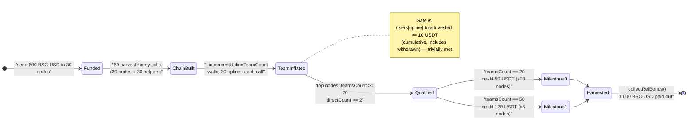
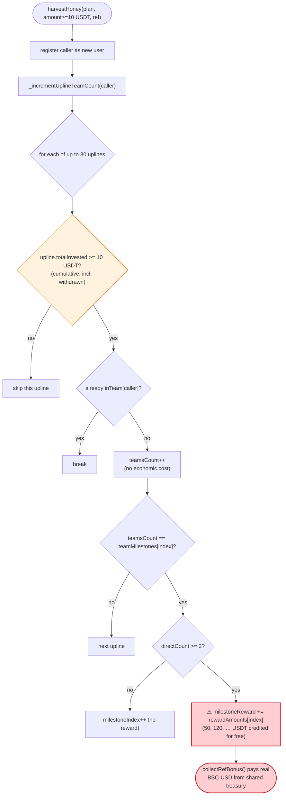

# Grizzifi Exploit — Sybil Milestone-Reward Farming via Self-Referral Chain

> **Vulnerability classes:** vuln/access-control/fake-account-substitution · vuln/logic/reward-calculation · vuln/logic/state-update

> **Reproduction:** the PoC compiles & runs in an isolated Foundry project at
> [this project folder](.) (the umbrella DeFiHackLabs repo contains many
> unrelated PoCs that do not whole-compile, so this one was extracted).
> Full verbose trace: [output.txt](output.txt).
> Verified vulnerable source: [Grizzifi.sol](sources/Grizzifi_21ab89/Grizzifi.sol).

---

## Key info

| | |
|---|---|
| **Loss** | ~$61,000 USD on-chain (BSC-USD). The minimal PoC here nets **+1,000 BSC-USD** per round (600 → 1,600); the real attacker repeated/scaled the pattern. |
| **Vulnerable contract** | `Grizzifi` — [`0x21ab8943380B752306aBF4D49C203B011A89266B`](https://bscscan.com/address/0x21ab8943380b752306abf4d49c203b011a89266b#code) |
| **Victim** | Grizzifi staking pool's BSC-USD treasury (real depositors' principal + the milestone reward budget) |
| **Attacker EOA** | [`0xe2336b08a43f87a4ac8de7707ab7333ba4dbaf7c`](https://bscscan.com/address/0xe2336b08a43f87a4ac8de7707ab7333ba4dbaf7c) |
| **Attacker contract** | [`0xEd35746F389177eCD52A16987b2aaC74AA0c1128`](https://bscscan.com/address/0xEd35746F389177eCD52A16987b2aaC74AA0c1128) |
| **Attack tx** | [`0x36438165d701c883fd9a03631ee0cdeec35a138153720006ab59264db7e075c1`](https://bscscan.com/tx/0x36438165d701c883fd9a03631ee0cdeec35a138153720006ab59264db7e075c1) |
| **Chain / block / date** | BSC / fork at 57,478,533 / Aug 13, 2025 (fork timestamp `1755107000` = 2025-08-13 17:43:20 UTC) |
| **Compiler** | Source: Solidity v0.8.30, optimizer 200 runs. PoC built under `evm_version = cancun`. |
| **Bug class** | Sybil-able incentive accounting — milestone rewards paid for self-created, throwaway "team members" with no economic substance |

---

## TL;DR

`Grizzifi` is a USDT (BSC-USD) staking / MLM-style protocol. Besides daily staking yield, it pays
**"team milestone" bonuses**: when the count of people in your downline ("team") crosses thresholds
`[20, 50, 100, …]`, you are credited rewards `[50, 120, 220, …]` USDT respectively
([Grizzifi.sol:83-91](sources/Grizzifi_21ab89/Grizzifi.sol#L83-L91)).

The accounting for "team size" is dangerously cheap to inflate:

- A downline member counts toward an upline's `teamsCount` **as long as that upline has ever invested
  at least `minInvestForMilestone = 10` USDT** (cumulative `totalInvested`, *including amounts already
  withdrawn*) — see [`_incrementUplineTeamCount`:615-651](sources/Grizzifi_21ab89/Grizzifi.sol#L615-L651).
- Each `harvestHoney` deposit of ≥ 10 USDT registers the caller as a **new user** and walks **up to 30
  uplines** crediting each of them one team member ([harvestHoney:147-149](sources/Grizzifi_21ab89/Grizzifi.sol#L147-L149)).
- The milestone reward only further requires `directCount >= minDirect (2)`
  ([:634](sources/Grizzifi_21ab89/Grizzifi.sol#L634)) — i.e. at least two direct referrals.

There is **no Sybil resistance, no proof of distinct humans, and no economic cost tied to the reward
size.** An attacker simply deploys a linear chain of throwaway contracts, each referring the next, each
investing the bare minimum 10 USDT twice (so every node gets ≥ 2 "direct" referrals), then walks each
upline's `teamsCount` past the milestone thresholds and **collects the milestone rewards for free** via
`collectRefBonus()` ([:466-484](sources/Grizzifi_21ab89/Grizzifi.sol#L466-L484)).

In this minimal PoC, 30 attack contracts (cost: 600 BSC-USD of deposits) farm **1,600 BSC-USD** of
milestone rewards out of the protocol treasury — a net profit of **+1,000 BSC-USD** in a single round.
On-chain the attacker repeated/scaled this for a total loss of roughly **$61K**.

---

## Background — what Grizzifi does

`Grizzifi` ([source](sources/Grizzifi_21ab89/Grizzifi.sol)) — "Honeycomb Wealth Plan – Powered by DeFi"
— is a multi-plan USDT staking contract with an MLM referral overlay:

- **Staking plans** (`harvestHoney`, `collectHoney`, `retrieveHoneyPot`): users deposit BSC-USD into one
  of 8 plans and accrue a daily return; principal unlocks after a lock period.
- **17-level referral commissions** (`_payReferralCommissions`,
  [:426-445](sources/Grizzifi_21ab89/Grizzifi.sol#L426-L445)): when a downline claims yield, ancestors
  accrue a percentage (`referralRates = [2000, 1000, 500, …]` bps) into `claimableReferralBonus`.
- **Team milestone bonuses** — the mechanism abused here. Each registration walks the upline chain and
  increments each ancestor's `teamsCount`. Crossing a threshold in
  `teamMilestones = [20, 50, 100, 200, 500, 1000, 3000, 6000, 10000, 30000]` credits the corresponding
  `rewardAmounts = [50, 120, 220, 440, 800, 1600, 2500, 4500, 7500, 15000]` USDT into `milestoneReward`.
- **`collectRefBonus()`** transfers `claimableReferralBonus + milestoneReward` straight out of the
  contract's BSC-USD balance.

Relevant on-chain parameters at the fork block:

| Parameter | Value |
|---|---|
| `minInvestForMilestone` | **10 × 1e18 = 10 USDT** |
| `minDirect` | **2** direct referrals required to bank a milestone reward |
| `teamMilestones[0]` / `rewardAmounts[0]` | **20 team members → 50 USDT** |
| `teamMilestones[1]` / `rewardAmounts[1]` | **50 team members → 120 USDT** |
| `platformFee` | 1,000 bps (10% — but milestone rewards are *not* funded by it) |
| `_incrementUplineTeamCount` loop depth | up to **30** uplines per registration |

---

## The vulnerable code

### 1. Milestone "team count" credited per registration, walking 30 uplines

`harvestHoney` calls `_incrementUplineTeamCount(msg.sender)` on every deposit of at least
`minInvestForMilestone` (10 USDT):

```solidity
// harvestHoney — Grizzifi.sol:147-149
if (_amount >= minInvestForMilestone) {
    _incrementUplineTeamCount(msg.sender);
}
```

The function itself ([Grizzifi.sol:615-651](sources/Grizzifi_21ab89/Grizzifi.sol#L615-L651)):

```solidity
function _incrementUplineTeamCount(address _user) internal {
    address upline = users[_user].referrer;
    for (uint8 i = 0; i < 30; i++) {
        if (upline == address(0)) break;

        if (users[upline].totalInvested >= minInvestForMilestone) {   // ⚠️ cumulative, incl. withdrawn
            if (!users[upline].inTeam[_user]) {                       //   dedup per (upline, downline)
                if (i == 0 && !users[_user].inDirect) {
                    users[_user].inDirect = true;
                    users[upline].directCount++;                      //   first-gen → direct referral
                }
                users[upline].inTeam[_user] = true;
                users[upline].teamsCount++;                           // ⚠️ team grows with NO economic gate

                uint256 index = users[upline].milestoneIndex;
                if (
                    index < teamMilestones.length &&
                    users[upline].teamsCount == teamMilestones[index]     // 20, 50, 100, …
                ) {
                    if (users[upline].directCount >= minDirect) {         // only needs 2 directs
                        uint256 reward = rewardAmounts[index];            // 50, 120, …  USDT
                        users[upline].milestoneReward += reward;          // ⚠️ free credit
                        users[upline].totalMilestoneEarned += reward;
                        emit MilestoneAchieved(upline, users[upline].milestoneIndex, reward);
                    }
                    users[upline].milestoneIndex++;
                }
            } else {
                break;
            }
        }
        upline = users[upline].referrer;
    }
}
```

### 2. The reward is paid in real USDT, no questions asked

```solidity
// collectRefBonus — Grizzifi.sol:466-484
function collectRefBonus() external {
    User storage user = users[msg.sender];
    uint256 referralAmount  = user.claimableReferralBonus;
    uint256 milestoneAmount = user.milestoneReward;        // farmed above
    uint256 totalToClaim    = referralAmount + milestoneAmount;

    require(totalToClaim > 0, "Grizzifi: No referral or milestone bonuses to claim");
    require(USDT.balanceOf(address(this)) >= totalToClaim, "Grizzifi: Insufficient contract balance");

    user.claimableReferralBonus = 0;
    user.milestoneReward = 0;
    user.totalReferralBonusWithdrawn += totalToClaim;
    totalPayouts += totalToClaim;

    require(USDT.transfer(msg.sender, totalToClaim), "Grizzifi: Bonus transfer failed");  // ⚠️ real money out
    emit ReferralBonusClaimed(msg.sender, totalToClaim);
}
```

### 3. The economic gate (`totalInvested`) is the wrong variable

`harvestHoney` increments `totalInvested` **cumulatively and never decrements it on withdrawal**:

```solidity
// harvestHoney — Grizzifi.sol:169-170
users[msg.sender].totalInvested += _amount;   // monotonic; retrieveHoneyPot() never subtracts it
totalInvested += _amount;
```

So the `users[upline].totalInvested >= minInvestForMilestone` check at
[:620](sources/Grizzifi_21ab89/Grizzifi.sol#L620) is satisfied by *any historical* 10-USDT deposit, even
if that capital was already pulled back out. The PoC doesn't even need to withdraw — it just keeps the
10 USDT staked, which is recoverable later via `retrieveHoneyPot()` after the lock — but the comment in
the original PoC highlights the deeper design flaw: **"team membership" is gated on a number that
includes withdrawn capital, so the qualification is essentially free and permanent.**

---

## Root cause — why it was possible

The milestone bonus is an **un-collateralized reward whose only entry requirement is a graph shape the
attacker fully controls.** Four design decisions compose into the bug:

1. **Team size has no Sybil resistance.** `teamsCount` is incremented once per *(upline, downline-address)*
   pair. Addresses are free to create, so an attacker manufactures arbitrarily many "team members" by
   deploying throwaway contracts and registering each one.
2. **The qualification gate is trivial and uses the wrong metric.** A downline counts toward the milestone
   if the *upline* has `totalInvested >= 10` USDT — a **cumulative, never-decremented** figure
   ([:169-170](sources/Grizzifi_21ab89/Grizzifi.sol#L169-L170),
   [:620](sources/Grizzifi_21ab89/Grizzifi.sol#L620)). It does **not** require the downline to hold an
   active stake, nor does it scale the reward to capital at risk.
3. **`minDirect = 2` is bypassed for free.** Each attack node gets two direct referrals by registering
   *two* addresses (the next `AttackContract1` and its spawned `AttackContract2`) that both point to it.
   No real "two distinct recruits" exist.
4. **Reward >> cost.** Reaching 20 team members costs the attacker only the bare 10-USDT-per-registration
   deposits (recoverable), yet pays a flat 50 USDT, then 120 USDT at 50 members, etc. The reward is
   funded from the shared treasury that holds *real* users' principal.

In short: the protocol pays out of pooled depositor funds for a metric (downline size) that is
**costless to fabricate** and **decoupled from any value the attacker actually locked**.

---

## Preconditions

- The project is live (`startUNIX > 0`, set by the owner via `startproject()`
  [:513-517](sources/Grizzifi_21ab89/Grizzifi.sol#L513-L517)). True at the fork block.
- The Grizzifi contract holds enough BSC-USD to pay the farmed milestone rewards (it held real depositor
  funds — the PoC also seeds the test EOA with 600 BSC-USD as deposit working capital).
- Each attacker node deposits ≥ `minInvestForMilestone` (10 USDT) at least once so that
  `totalInvested >= 10` qualifies it as a milestone-eligible upline.
- No flash loan needed — the entire attack uses only ~600 BSC-USD of staked capital, which is itself
  recoverable. The attack is fully **self-funded and repeatable**.

---

## Attack walkthrough (with on-chain numbers from the trace)

The PoC ([test/Grizzifi_exp.sol](test/Grizzifi_exp.sol)) deploys **30 `AttackContract1` instances** wired
into a single linear referral chain `ac[0] ← ac[1] ← … ← ac[29]` (`ac[0]` is the root, referrer = 0).
Each `init()` makes the node deposit 10 USDT *and* spins up an `AttackContract2` that deposits another
10 USDT with the **same referrer**, so every node accrues **two** direct referrals.

| # | Step | What happens on-chain | Numbers |
|---|------|------------------------|---------|
| 0 | **Fund** 30 attack contracts | Test sends 20 BSC-USD to each `AttackContract1` | 30 × 20 = **600 BSC-USD** out |
| 1 | **Register the chain** — for `i = 0…29`: `ac[i].init(GRIZZIFI, ac[i-1])` | `AttackContract1[i]` calls `harvestHoney(0, 10e18, ac[i-1])` (registers itself, refers to previous node) then deploys `AttackContract2[i]` which calls `harvestHoney(0, 10e18, ac[i-1])` (a 2nd downline of `ac[i-1]`) | **60** `harvestHoney` calls (30+30); every call ≥ 10 USDT ⇒ `_incrementUplineTeamCount` runs and walks up to 30 uplines |
| 2 | **`teamsCount` climbs the chain** | Each registration credits one team member to *every* ancestor; the root-most nodes accumulate the most. Top nodes cross `teamMilestones[0]=20` and the very top 5 cross `teamMilestones[1]=50`. `directCount >= 2` is satisfied because each node has its own `AttackContract1`+`AttackContract2` children. | 20 × `MilestoneAchieved(index 0, 50e18)` + 5 × `MilestoneAchieved(index 1, 120e18)` = **25 milestone events** |
| 3 | **Harvest the rewards** — for each node: `collectRefBonus()` | 5 top nodes each had `milestoneReward = 50 + 120 = 170` USDT; 15 nodes had `50` USDT; 10 nodes did not qualify and revert with *"No referral or milestone bonuses to claim"* (caught by the PoC `try/catch`). Each node forwards its balance back to the test contract. | 5 × 170 + 15 × 50 = **1,600 BSC-USD** in |

Verified directly from [output.txt](output.txt):

- `MilestoneAchieved` events: **20 at index 0** (`param2 = 50e18`) + **5 at index 1** (`param2 = 120e18`).
- `ReferralBonusClaimed` events: **5 × 170 USDT** + **15 × 50 USDT** = **1,600 USDT** (sum verified to the wei).
- Attacker balance: **600.0 → 1,600.0 BSC-USD**.

### Profit accounting (BSC-USD)

| Direction | Amount |
|---|---:|
| Spent — 30 nodes funded (20 each) | 600.00 |
| Received — 5 nodes × 170 (50 + 120 milestones) | 850.00 |
| Received — 15 nodes × 50 (one milestone each) | 750.00 |
| **Total received** | **1,600.00** |
| **Net profit (this round)** | **+1,000.00** |

The 600 USDT of deposits stays staked inside Grizzifi (recoverable via `retrieveHoneyPot()` after the
plan lock period), so the *true* extracted value is the full 1,600 USDT of milestone rewards, with the
600 USDT principal merely temporarily parked. On mainnet the attacker repeated and scaled the structure
for a total loss of roughly **$61K**.

---

## Diagrams

### Sequence of the attack

```mermaid
sequenceDiagram
    autonumber
    actor A as "Attacker (test)"
    participant N as "30 AttackContract1 nodes"
    participant M as "30 AttackContract2 helpers"
    participant G as "Grizzifi"
    participant U as "BSC-USD treasury"

    Note over A,N: Setup — fund 30 nodes
    A->>N: transfer 20 BSC-USD x 30 (600 total)

    rect rgb(255,243,224)
    Note over A,G: Step 1 — build the self-referral chain
    loop i = 0 .. 29
        A->>N: ac[i].init(GRIZZIFI, ac[i-1])
        N->>G: harvestHoney(0, 10 USDT, ac[i-1])
        Note over G: registers ac[i]; _incrementUplineTeamCount walks 30 uplines
        N->>M: deploy AttackContract2[i] + send 10 USDT
        M->>G: harvestHoney(0, 10 USDT, ac[i-1])
        Note over G: 2nd downline for ac[i-1] -> directCount reaches 2
    end
    end

    rect rgb(255,235,238)
    Note over G: teamsCount climbs the chain
    Note over G: 20 nodes hit milestone[0]=20 (50 USDT)<br/>5 top nodes also hit milestone[1]=50 (120 USDT)
    G-->>G: emit MilestoneAchieved x25 (credits milestoneReward)
    end

    rect rgb(232,245,233)
    Note over A,U: Step 2 — harvest free rewards
    loop each node
        A->>N: ac[i].withdraw(GRIZZIFI)
        N->>G: collectRefBonus()
        G->>U: transfer milestoneReward
        U-->>N: 170 or 50 USDT (or revert if unqualified)
        N-->>A: forward balance
    end
    end

    Note over A: 600 BSC-USD in -> 1,600 BSC-USD out (+1,000 net)
```

### Team-count / milestone state evolution



### Why the milestone gate fails



---

## Why each magic number

- **30 attack contracts:** Building a 30-deep chain means the top-most nodes accumulate the most "team"
  members as every descendant registration walks up the chain. 30 is also exactly the
  `_incrementUplineTeamCount` loop bound, so a single deep registration touches every ancestor.
- **Two deposits per node (`AttackContract1` + `AttackContract2`, same referrer):** satisfies the
  `directCount >= minDirect (2)` requirement at [:634](sources/Grizzifi_21ab89/Grizzifi.sol#L634) without
  any real second recruit.
- **10 BSC-USD per deposit:** exactly `minInvestForMilestone`, the cheapest amount that both meets a
  plan's minimum (plan 0 minimum is 10 USDT) and flips the upline's `totalInvested >= 10` gate.
- **Result 1,600 BSC-USD:** `teamMilestones[0]=20 → 50 USDT` fires for 20 nodes (1,000 USDT) and
  `teamMilestones[1]=50 → 120 USDT` fires for the 5 deepest-rooted nodes (600 USDT).

---

## Remediation

1. **Tie milestone rewards to active, at-risk capital — not to a fabricated head-count.** Gate eligibility
   and reward size on the *sum of active (non-withdrawn) downline investments*, and require the upline's
   *own* active stake to exceed the reward by a safe margin. The protocol already computes
   active-investment sums elsewhere (`getUserReferralLevels`,
   [:389-424](sources/Grizzifi_21ab89/Grizzifi.sol#L389-L424)); use that, never the monotonic
   `totalInvested`.
2. **Stop using `totalInvested` (cumulative, incl. withdrawn) for any qualification.** Replace the
   [:620](sources/Grizzifi_21ab89/Grizzifi.sol#L620) check with a current-active-stake check, and decrement
   active balances inside `retrieveHoneyPot()`.
3. **Add Sybil resistance to team counting.** A flat per-address increment is free to inflate. Weight team
   contribution by capital, require a minimum *holding period* of active stake before a downline counts,
   and/or only count downlines that have themselves generated real yield/fees for the protocol.
4. **Make `minDirect` meaningful.** Two referrals pointing from addresses the same actor controls is not
   "two recruits." Require directs to have *distinct, independently-funded* active stakes, or remove the
   direct-count gate as a security control entirely (it provides no real protection).
5. **Fund rewards from a dedicated, capped budget — never from pooled depositor principal.** Cap total
   milestone payouts per epoch and per user so a single actor cannot drain the treasury even if the
   counting were manipulated.
6. **Bound the unbounded upline loop.** Walking 30 uplines per registration is both a griefing/gas vector
   and the mechanism that lets a single deep chain credit dozens of milestones at once.

---

## How to reproduce

The PoC was extracted into a standalone Foundry project (the umbrella DeFiHackLabs repo has many unrelated
PoCs that fail to whole-compile under `forge test`):

```bash
_shared/run_poc.sh 2025-08-Grizzifi_exp -vvvvv
```

- RPC: a **BSC archive** endpoint is required (fork block 57,478,533). The contended public endpoints
  may time out or return `missing trie node`; `foundry.toml` is set to
  `https://bsc-mainnet.public.blastapi.io`, which serves historical state at that block (the storage read
  at the Grizzifi contract is deep and slow — allow 1–2 min for the fork to warm up). Fallbacks that did
  *not* have the archive depth at this slot: `https://bsc.drpc.org` (HTTP 500), `https://1rpc.io/bnb`
  (`missing trie node`).
- Result: `[PASS] testExploit()` with the attacker's BSC-USD balance going **600 → 1,600**.

Expected tail:

```
Ran 1 test for test/Grizzifi_exp.sol:Grizzifi
[PASS] testExploit() (gas: 75999909)
  Attacker Before exploit USDT Balance: 600.000000000000000000
  Attacker After exploit USDT Balance: 1600.000000000000000000
Suite result: ok. 1 passed; 0 failed; 0 skipped
```

---

*References: Attack tx
[`0x36438165…e075c1`](https://bscscan.com/tx/0x36438165d701c883fd9a03631ee0cdeec35a138153720006ab59264db7e075c1);
alert thread: https://x.com/MetaTrustAlert/status/1955967862276829375 (Grizzifi, BSC, ~$61K).*
