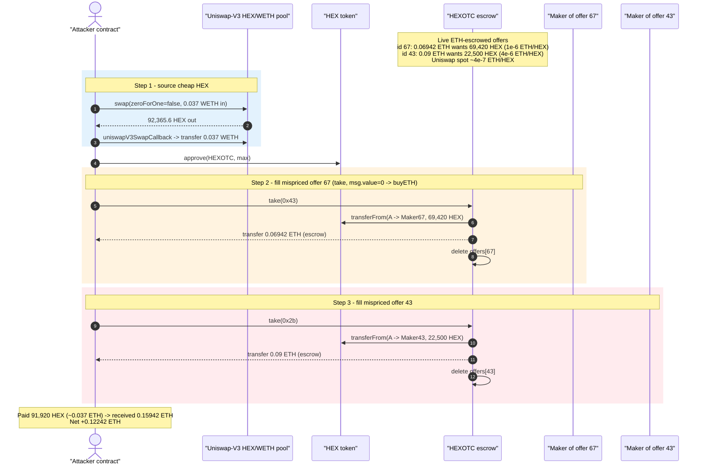
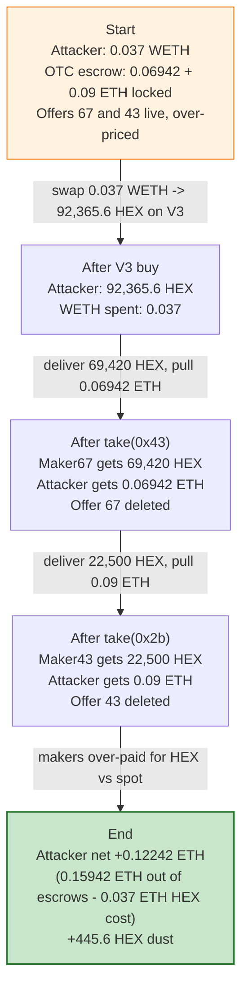
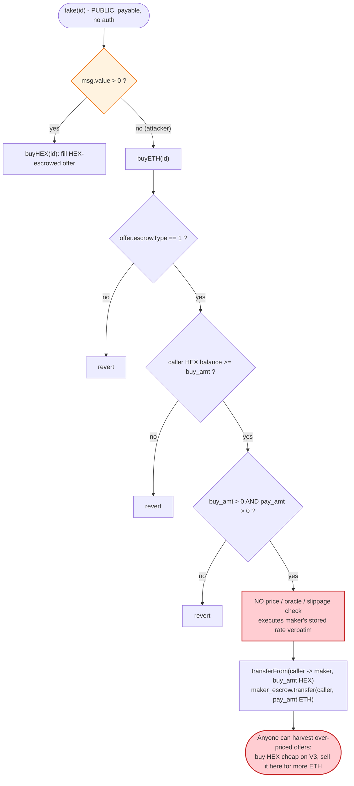

# Hexotic (HEX-OTC) Exploit — Mispriced OTC Orders Arbitraged Against Uniswap-V3 Spot

> **Vulnerability classes:** vuln/oracle/missing-validation · vuln/defi/slippage

> **Reproduction:** the PoC compiles & runs in an isolated Foundry project at
> [this project folder](.) (the umbrella DeFiHackLabs repo does not whole-compile,
> so this PoC was extracted into a standalone project).
> Full verbose trace: [output.txt](output.txt).
> Verified vulnerable source: [sources/HEXOTC_204B93/HEXOTC.sol](sources/HEXOTC_204B93/HEXOTC.sol)
> (a single Etherscan multi-file JSON; the logical files are `hex-otc.sol`, `erc20.sol`, `math.sol`).

---

## Key info

| | |
|---|---|
| **Loss** | ~$500 (the over-paid ETH escrowed in two mispriced orders). In this fork run the attacker EOA nets **+0.12242 ETH** of economic profit (0.15942 ETH drained from order escrows − 0.037 ETH spent buying HEX). |
| **Vulnerable contract** | `HEXOTC` — [`0x204B937FEaEc333E9e6d72D35f1D131f187ECeA1`](https://etherscan.io/address/0x204B937FEaEc333E9e6d72D35f1D131f187ECeA1#code) (Ethereum mainnet) |
| **Victim** | The makers of the two ETH-escrowed offers (ids `67` / `0x43` and `43` / `0x2b`) — their escrowed ETH was paid out for HEX at >2.5× spot |
| **HEX token** | [`0x2b591e99afE9f32eAA6214f7B7629768c40Eeb39`](https://etherscan.io/token/0x2b591e99afE9f32eAA6214f7B7629768c40Eeb39) (8 decimals) |
| **Liquidity source** | Uniswap-V3 HEX/WETH pool `0x9e0905249CeEFfFB9605E034b534544684A58BE6` |
| **Attacker EOA** | `0x07185a9e74f8dceb7d6487400e4009ff76d1af46` |
| **Attacker contract** | `0x6e0113c4f1de65b98381baa6443b20834b70d4c5` |
| **Attack tx** | `0x23b69bef57656f493548a5373300f7557777f352ade8131353ff87a1b27e2bb3` |
| **Chain / block / date** | Ethereum mainnet / fork at **23,260,640** (= 23260641 − 1) / Aug 2025 |
| **Compiler (victim)** | Solidity **v0.4.26**, optimizer 1 run (200) |
| **Bug class** | Permissionless OTC order fill with **no price / oracle / slippage validation** → stale-order arbitrage |

> **Note on the PoC header:** the `@KeyInfo` comment links to `arbiscan.io` for the
> vulnerable address, but the running PoC forks **`mainnet`** and every call lands on the
> mainnet `HEXOTC` deployment above. The HEX token, the V3 pool and the OTC contract are all
> on Ethereum mainnet; the Arbiscan link in the original PoC is a copy-paste artifact.

---

## TL;DR

`HEXOTC` is a tiny peer-to-peer OTC escrow for swapping ETH ⇄ HEX. A maker can lock ETH in the
contract (an "ETH-escrowed" offer, `escrowType == 1`) declaring how much HEX they want in return.
Anyone can fill that offer through the **permissionless** `take(id)` entry point: the contract
hands the escrowed ETH to the filler and pulls the maker's requested HEX out of the filler's wallet.

The contract performs **no validation that the offer's ETH↔HEX rate is anywhere near market** —
it blindly executes whatever exchange rate the maker stored. Two live offers were quoting HEX at
`1e-6` and `4e-6` ETH/HEX, while the Uniswap-V3 spot price was `~4.0e-7` ETH/HEX (2.5×–10× cheaper).

The attacker simply:

1. **Buys cheap HEX on Uniswap V3** — swaps `0.037 WETH` for `92,365.6 HEX` from the HEX/WETH V3 pool.
2. **Fills the two mispriced offers** via `take(0x43)` and `take(0x2b)` with `msg.value == 0`
   (routing into `buyETH`), paying the makers `69,420 HEX` and `22,500 HEX` and receiving the
   makers' escrowed `0.06942 ETH` and `0.09 ETH`.

The attacker pays out `91,920 HEX` (bought for `~0.037 ETH`) and walks away with `0.15942 ETH`.
Net intra-transaction profit: **+0.12242 ETH**, funded entirely by the makers who over-quoted HEX.

---

## Background — what HEXOTC does

[`hex-otc.sol`](sources/HEXOTC_204B93/HEXOTC.sol) is an OZ-era (Solidity 0.4.x, `DSMath`-based)
peer-to-peer order book for swapping ETH and HEX with on-chain escrow. There are two offer types,
stored per id in `mapping (uint => OfferInfo) public offers`:

```solidity
struct OfferInfo {
    uint     pay_amt;     // what the maker escrowed / will pay out
    uint     buy_amt;     // what the maker wants in return
    address  owner;       // the maker
    uint64   timestamp;
    bytes32  offerId;
    uint     escrowType;  // 0 = HEX escrowed, 1 = ETH escrowed
}
```

- **`offerHEX` / `escrowType == 0`** — maker escrows HEX, wants ETH. Filled by `buyHEX` (caller sends ETH).
- **`offerETH` / `escrowType == 1`** — maker escrows ETH, wants HEX. Filled by `buyETH` (caller sends HEX).

`take(id)` is the single public fill router. It dispatches purely on `msg.value`:

```solidity
function take(bytes32 id) public payable {
    if (msg.value > 0) { require(buyHEX(uint256(id)), "Buy HEX failed"); }
    else               { require(buyETH(uint256(id)), "Sell HEX failed"); }
}
```

So calling `take(id)` with **zero ETH** always routes to `buyETH`, i.e. "fill an ETH-escrowed
offer by delivering HEX." That is exactly the path the attacker used for both ids.

On-chain facts at the fork block (from the trace in [output.txt](output.txt)):

| Fact | Value |
|---|---|
| Uniswap-V3 HEX price (from the flash buy) | `0.037 WETH / 92,365.6 HEX` ≈ **4.006e-7 ETH/HEX** |
| Offer `67` (`0x43`) rate (`pay_amt`/`buy_amt`) | `0.06942 ETH / 69,420 HEX` = **1.0e-6 ETH/HEX** (≈ 2.5× spot) |
| Offer `43` (`0x2b`) rate | `0.09 ETH / 22,500 HEX` = **4.0e-6 ETH/HEX** (≈ 10× spot) |

The makers were buying HEX at well above market, and `HEXOTC` happily let anyone collect their
escrowed ETH by paying market-cheap HEX into the orders.

---

## The vulnerable code

All snippets are from [`hex-otc.sol`](sources/HEXOTC_204B93/HEXOTC.sol) inside the multi-file source.

### 1. `take` — permissionless, routed by `msg.value`

```solidity
//take
function take(bytes32 id)
    public
    payable
{
    if(msg.value > 0){
        require(buyHEX(uint256(id)), "Buy HEX failed");
    }
    else{
        require(buyETH(uint256(id)), "Sell HEX failed");   // ← attacker path (msg.value == 0)
    }
}
```

No access control, no allow-list of takers, no per-offer price sanity check.

### 2. `buyETH` — pays escrowed ETH out for HEX at the maker's quoted rate

```solidity
function buyETH(uint id)
    public
    can_buy(id)        // require(isActive(id))
    synchronized       // re-entrancy lock
    returns (bool)
{
    OfferInfo memory offer = offers[id];
    require(offer.escrowType == 1, "Incorrect escrow type");
    require(hexInterface.balanceOf(msg.sender) >= offer.buy_amt, "Balance is less than requested spend amount");
    require(offer.buy_amt > 0 && offer.pay_amt > 0, "values are zero");
    //transfer
    require(hexInterface.transferFrom(msg.sender, offer.owner, offer.buy_amt), "Transfer failed"); // HEX: taker -> maker
    msg.sender.transfer(offer.pay_amt);   // ETH: escrow -> taker   ⚠️ rate is whatever the maker stored
    ...
    delete offers[id];
    return true;
}
```

The only economic check is `offer.buy_amt > 0 && offer.pay_amt > 0`. There is **no comparison of
`pay_amt/buy_amt` against any reference price**, no oracle, no TWAP, no maximum slippage, and no
restriction on who may fill. Whatever exchange rate the maker baked into the offer is executed
verbatim, and the order is open to the entire world.

---

## Root cause — why it was possible

`HEXOTC` is a *fixed-price limit-order escrow* with no link to market price. That is fine in
principle — but two design properties combine into a free-money bug:

1. **Fills are permissionless and price-agnostic.** `take` → `buyETH` lets *anyone* collect a
   maker's escrowed ETH simply by delivering the requested HEX. The contract never asks "is this a
   fair price?" — it only checks the amounts are non-zero.
2. **Nothing keeps an offer's price aligned with spot.** Once an offer is on the book it stays
   live (`isActive` = `timestamp > 0`) until taken or cancelled by the maker. An offer quoting HEX
   at 2.5×–10× the Uniswap price is a standing arbitrage that **anybody** can harvest.

Because deep, instant HEX liquidity exists on Uniswap V3 at ~`4e-7 ETH/HEX`, an arbitrageur can
*manufacture* the HEX side of any over-priced ETH offer for cents and pocket the spread:

> Buy `N` HEX on V3 for `N · spot`, then call `take(id)` on an ETH-escrowed offer wanting `N` HEX,
> receiving `N · offerRate` ETH. Profit = `N · (offerRate − spot)`. With `offerRate` up to 10× spot,
> the profit is the bulk of the escrowed ETH.

So the "exploit" is not a memory/accounting/re-entrancy bug — it is the absence of any
**price-validation or fill-authorization** in a permissionless OTC fill, which turns stale /
mispriced maker offers into instantly drainable bounties. The attacker batched two such offers into
one transaction and used a single Uniswap-V3 buy to source all the HEX needed.

(The PoC's V3 `swap` is a *plain swap*, not a flash loan: the `uniswapV3SwapCallback` pays the pool
`0.037 WETH` for the `92,365.6 HEX` received — the HEX is bought outright and only ~`91,920` of it
is needed to fill both orders, leaving `~445.6 HEX` dust unspent.)

---

## Preconditions

- One or more **ETH-escrowed offers (`escrowType == 1`)** are live on `HEXOTC` quoting HEX above
  market (here, offers `67` and `43` at `1e-6` and `4e-6` ETH/HEX vs `~4e-7` spot).
- A liquid market for the requested token (HEX/WETH Uniswap V3 pool) so the filler can source the
  HEX cheaper than the offer's implied price.
- A small amount of WETH/ETH as working capital to buy the HEX (here `0.037 WETH`); fully recovered
  from the order proceeds within the same transaction, so the position is self-financing.

No special role, no timing window, no governance, no re-entrancy needed — `take` is open to all.

---

## Attack walkthrough (with on-chain numbers from the trace)

HEX has **8 decimals**; ETH/WETH have 18. All figures are read directly from
[output.txt](output.txt) (the `Swap`, `Transfer`, `Deposit` and `LogTake` events).

| # | Step | HEX flow | ETH/WETH flow | Source line(s) |
|---|------|----------|----------------|----------------|
| 0 | Seed test contract with `0.1 ETH`, wrap `0.037 ETH` → WETH | — | `+0.1 ETH`, `0.037 ETH → WETH` | [output.txt:1582-1588](output.txt) |
| 1 | **Buy HEX on Uniswap V3** — `pool.swap(recipient, zeroForOne=false, 0.037e18, …)`; callback pays `0.037 WETH` | `+92,365.61624407 HEX` to attacker | `−0.037 WETH` to pool | [output.txt:1589-1613](output.txt) |
| 2 | `approve(HEXOTC, max)` for HEX | — | — | [output.txt:1614-1618](output.txt) |
| 3 | **`take(0x43)`** (`msg.value=0` → `buyETH`, offer 67, escrowType 1) | `−69,420 HEX` (attacker → maker `0x68CBc12a…`) | `+0.06942 ETH` (escrow → attacker) | [output.txt:1619-1639](output.txt) |
| 4 | **`take(0x2b)`** (`msg.value=0` → `buyETH`, offer 43, escrowType 1) | `−22,500 HEX` (attacker → maker `0xFeDc84d0…`) | `+0.09 ETH` (escrow → attacker) | [output.txt:1640-1660](output.txt) |
| — | **End** | `+445.6 HEX` dust retained | balance `0.22242 ETH` (incl. `0.063 ETH` leftover seed) | [output.txt:1661](output.txt) |

The two `LogTake` events confirm the fills:

```
LogTake(id=0x43, maker=0x68CBc12a…, taker=attacker, take_amt=0.06942 ETH, give_amt=69,420 HEX, escrowType=1)
LogTake(id=0x2b, maker=0xFeDc84d0…, taker=attacker, take_amt=0.09000 ETH, give_amt=22,500 HEX, escrowType=1)
```

(`take_amt` = `pay_amt` = ETH the attacker received; `give_amt` = `buy_amt` = HEX the attacker delivered.)

### Profit / loss accounting

| Direction | Amount |
|---|---:|
| Spent — WETH to buy 92,365.6 HEX on V3 | −0.03700 ETH |
| Received — `take(0x43)` ETH escrow | +0.06942 ETH |
| Received — `take(0x2b)` ETH escrow | +0.09000 ETH |
| **Net economic profit (this tx)** | **+0.12242 ETH** |
| (Final test-contract balance, incl. 0.063 ETH unused seed) | 0.22242 ETH |

HEX side: bought `92,365.6 HEX` for `0.037 ETH`; spent `91,920 HEX` filling the two orders; kept
`~445.6 HEX` dust. The makers received `91,920 HEX` worth `~0.0368 ETH` at spot in exchange for
paying out `0.15942 ETH` — a ~`0.1226 ETH` (~$500-class) transfer of value from the makers to the
attacker, mediated by the contract's price-blind escrow.

---

## Diagrams

### Sequence of the attack



### Value flow / state evolution



### The flaw inside `take` / `buyETH`



---

## Why each number

- **`0.037 WETH` flash-buy on V3:** sized to obtain just over the `91,920 HEX` needed to fill both
  orders (`69,420 + 22,500`). The swap returns `92,365.6 HEX`; the `~445.6 HEX` surplus is harmless dust.
- **`take(0x43)` / offer 67:** `pay_amt = 0.06942 ETH`, `buy_amt = 69,420 HEX` ⇒ rate `1e-6 ETH/HEX`,
  ~2.5× the `4.006e-7` spot. Filling it yields `0.06942 ETH` for `~0.0278 ETH` of HEX.
- **`take(0x2b)` / offer 43:** `pay_amt = 0.09 ETH`, `buy_amt = 22,500 HEX` ⇒ rate `4e-6 ETH/HEX`,
  ~10× spot. Filling it yields `0.09 ETH` for `~0.009 ETH` of HEX — the more lucrative of the two.
- **`msg.value == 0`:** mandatory so `take` routes into `buyETH` (the ETH-escrow-paying path) rather
  than `buyHEX`.

---

## Remediation

1. **Validate the offer price against a reference at fill time.** Before paying out, compare the
   offer's implied rate to a manipulation-resistant oracle / TWAP (e.g. the Uniswap-V3 HEX/WETH TWAP)
   and revert (or cap) if the offer deviates beyond a configured tolerance. A price-blind OTC fill is
   a standing bounty whenever a maker mis-quotes.
2. **Expire / refresh stale offers.** Give offers a TTL after which they auto-cancel, or require the
   maker to re-affirm the price, so a quote cannot sit on the book drifting away from market.
3. **Restrict who can fill, if intended as true OTC.** If offers are meant for a specific
   counterparty, store and enforce an allowed-taker address rather than exposing `take` to everyone.
4. **Surface the spot-vs-quote spread to makers off-chain.** The contract itself is the wrong place to
   "fix" a maker's bad price, but a front-end / keeper that refuses to broadcast or that auto-cancels
   wildly off-market offers would prevent these self-inflicted losses.
5. **Treat permissionless + price-agnostic + escrow as a red flag.** Any function that releases
   escrowed value at a counterparty-controlled rate to an arbitrary caller must either (a) verify the
   rate, or (b) authorize the caller. `buyETH`/`buyHEX` do neither.

---

## How to reproduce

```bash
_shared/run_poc.sh 2025-08-Hexotic_exp -vvvvv
```

- RPC: an **Ethereum mainnet archive** endpoint is required (the fork block 23,260,640). The
  pre-configured `mainnet` endpoint in [foundry.toml](foundry.toml) is an Infura archive key.
- Result: `[PASS] testExploit()`.

Expected tail:

```
Ran 1 test for test/Hexotic_exp.sol:Hex
[PASS] testExploit() (gas: 261871)
Logs:
  Attacker Before exploit ETH Balance: 0.000000000000000000
  Attacker After exploit ETH Balance: 0.222420000000000000
```

The `0.22242 ETH` final balance is the `0.15942 ETH` drained from the two order escrows, minus the
`0.037 ETH` spent buying HEX, plus the `0.063 ETH` of unused seed ETH — i.e. **+0.12242 ETH** of
genuine attack profit.

---

*Reference: Defimon Alerts post-mortem — https://t.me/defimon_alerts/1757 . Vulnerable source on
Etherscan: https://etherscan.io/address/0x204B937FEaEc333E9e6d72D35f1D131f187ECeA1#code .*
