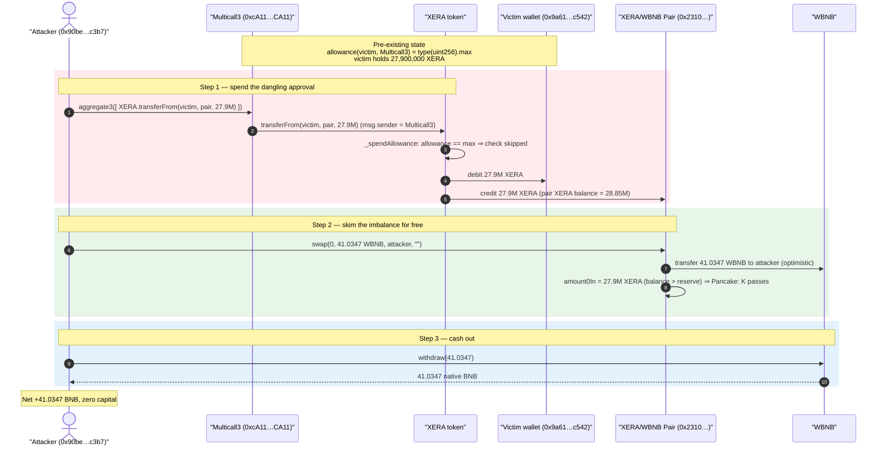
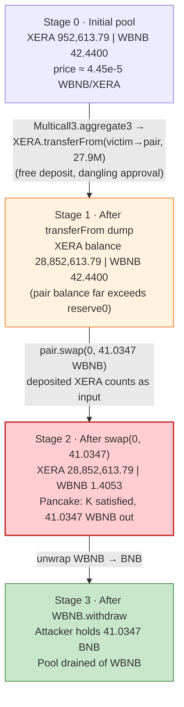
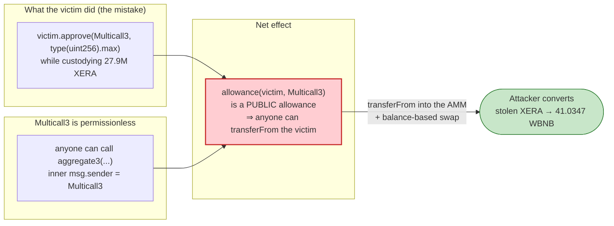

# LUXERA (XERA) Exploit — Dangling Infinite Approval to Multicall3 Drained via `aggregate3`

> **Vulnerability classes:** vuln/access-control/secret-exposure · vuln/logic/missing-allowance

> One-line: the XERA deployer wallet had granted an **infinite XERA allowance to the canonical Multicall3 contract**, and Multicall3's permissionless `aggregate3` let the attacker spend that allowance with `transferFrom`, dumping 27.9M XERA into the XERA/WBNB PancakeSwap pair and skimming the resulting imbalance for ~41 WBNB.

> **Reproduction:** the PoC compiles & runs in this isolated Foundry project (the umbrella DeFiHackLabs repo does not whole-compile, so this PoC was extracted).
> Full verbose trace: [output.txt](output.txt).
> PoC: [test/MulticallWithXera_exp.sol](test/MulticallWithXera_exp.sol).
> Verified token source: [sources/LUXERA_93E99a/Token.sol](sources/LUXERA_93E99a/Token.sol).

---

## Key info

| | |
|---|---|
| **Loss** | ~$17K — **41.0347 WBNB** drained from the XERA/WBNB PancakeSwap pair |
| **Vulnerable target** | The victim's wallet held a dangling **infinite XERA approval to Multicall3**. Tokens: `LUXERA` (XERA) — [`0x93E99aE6692b07A36E7693f4ae684c266633b67d`](https://bscscan.com/address/0x93E99aE6692b07A36E7693f4ae684c266633b67d#code) |
| **Abused contract** | Canonical Multicall3 — [`0xcA11bde05977b3631167028862bE2a173976CA11`](https://bscscan.com/address/0xcA11bde05977b3631167028862bE2a173976CA11) (`aggregate3`) |
| **Victim** | XERA owner / supply holder wallet `0x9a619Ae8995A220E8f3A1Df7478A5c8d2afFc542` (held 27.9M XERA, infinite-approved Multicall3) |
| **Victim pool** | XERA/WBNB PancakeSwap pair `0x231075E4AA60d28681a2d6D4989F8F739BAC15a0` |
| **Attacker EOA** | [`0x00b700b9da0053009cb84400ed1e8fe251002af3`](https://bscscan.com/address/0x00b700b9da0053009cb84400ed1e8fe251002af3) |
| **Attacker contract** | [`0x90be00229fe8000000009e007743a485d400c3b7`](https://bscscan.com/address/0x90be00229fe8000000009e007743a485d400c3b7) |
| **Attack tx** | [`0xed6fd61c1eb2858a1594616ddebaa414ad3b732dcdb26ac7833b46803c5c18db`](https://bscscan.com/tx/0xed6fd61c1eb2858a1594616ddebaa414ad3b732dcdb26ac7833b46803c5c18db) |
| **Chain / block / date** | BSC / 58,269,338 / Aug 2025 |
| **Compiler** | XERA token: Solidity v0.8.25, optimizer 200 runs |
| **Bug class** | Operational error — excessive/dangling token approval to a public arbitrary-call relayer (Multicall3) |

---

## TL;DR

The XERA token contract itself is a textbook OpenZeppelin-v5 ERC20 with fee/dividend extensions; its `transferFrom`/`_spendAllowance` are standard ([ERC20.sol:154](sources/LUXERA_93E99a/ERC20.sol#L154), [ERC20.sol:305](sources/LUXERA_93E99a/ERC20.sol#L305)). There is **no code bug in XERA**.

The loss came from an **operational mistake by the XERA deployer**:

1. The deployer/owner wallet `0x9a619Ae8…` (which also held the entire circulating supply of 27.9M XERA) had at some point approved the **canonical Multicall3** contract `0xcA11…CA11` for an **infinite (`type(uint256).max`) amount of XERA**. (Verified on-chain at the fork block — see "On-chain facts" below.)
2. Multicall3's `aggregate3(Call3[])` is a **public, permissionless** function that executes arbitrary calls where the *executing* contract — Multicall3 itself — is the `msg.sender` of each inner call.
3. So **anyone** could craft a single `Call3` of `XERA.transferFrom(victim, …, 27.9M)`, route it through `aggregate3`, and have it pass the allowance check (because Multicall3 *was* the approved spender).

The attacker pointed the stolen 27.9M XERA straight into the XERA/WBNB pair (a direct deposit, not a real swap), then called `pair.swap(0, 41.0347 WBNB)`. Because the pair computes its input from `balanceOf` vs. stored reserves ([PancakePair.sol:469](sources/PancakePair_231075/PancakePair.sol#L469)), the 27.9M XERA already sitting in the pair counted as the swap's "payment," so the `Pancake: K` invariant at [PancakePair.sol:475](sources/PancakePair_231075/PancakePair.sol#L475) passed and 41.0347 WBNB flowed out for free. The attacker unwrapped it to native BNB.

---

## Background — what XERA / Multicall3 are

- **LUXERA (XERA)** is a BSC reflection/fee token ("Blockchain Capital Corperation") with a 1% transfer tax, a USDT (`0x55d398…`) dividend distributor, AMM-aware fees, trade cooldowns, and a trading gate ([Token.sol](sources/LUXERA_93E99a/Token.sol)). At deploy, the **entire supply** (`310,000,000 / 10 = 31,000,000` XERA) was minted to `0x9a619Ae8…` and ownership transferred to it ([Token.sol:128-129](sources/LUXERA_93E99a/Token.sol#L128-L129)). By the fork block that wallet still held **27,900,000 XERA**.

- **Multicall3** (`0xcA11bde0…CA11`) is the universal batching utility deployed at the same address on every chain. Its `aggregate3` takes a list of `{target, allowFailure, callData}` and `target.call(callData)`s each — meaning every inner call has `msg.sender == Multicall3`. It holds no funds and grants no special trust; it is purely a relayer. The danger is entirely on the *approver's* side: any allowance you grant Multicall3 can be spent by **anyone** through `aggregate3`.

- **The XERA/WBNB pair** `0x231075…` is a standard PancakeSwap V2 pair: `token0 = XERA`, `token1 = WBNB`, 0.25% fee, with the canonical balance-vs-reserve `swap` accounting and `Pancake: K` check ([PancakePair.sol:452-480](sources/PancakePair_231075/PancakePair.sol#L452-L480)).

---

## On-chain facts (read via `cast` at block 58,269,337)

| Query | Value |
|---|---|
| `XERA.allowance(victim, Multicall3)` | `115792089237316195423570985008687907853269984665640564039457584007913129639935` = **`type(uint256).max`** (infinite) |
| `XERA.balanceOf(victim)` | `27,900,000 XERA` (2.79e25 wei) |
| `XERA.owner()` | `0x9a619Ae8995A220E8f3A1Df7478A5c8d2afFc542` (the victim) |
| `XERA.pairV2()` | `0x231075…` (the drained pool) |
| pair `token0 / token1` | `XERA` / `WBNB` |
| pair `getReserves()` before | `952,613.79 XERA` / `42.4400 WBNB` |
| allowance **after** the attack | still `type(uint256).max` (infinite approvals are not decremented) |

The infinite allowance + the victim holding the full supply is the entire setup. Nothing else was required.

---

## The "vulnerable" code

There is no exploitable bug in a contract here; the exploit is the **composition of three perfectly-normal pieces**.

### 1. XERA's `transferFrom` is the standard OZ implementation — it trusts the allowance

```solidity
// sources/LUXERA_93E99a/ERC20.sol:154
function transferFrom(address from, address to, uint256 value) public virtual returns (bool) {
    address spender = _msgSender();          // == Multicall3 in the attack
    _spendAllowance(from, spender, value);   // passes: allowance(victim, Multicall3) == max
    _transfer(from, to, value);
    return true;
}

// sources/LUXERA_93E99a/ERC20.sol:305
function _spendAllowance(address owner, address spender, uint256 value) internal virtual {
    uint256 currentAllowance = allowance(owner, spender);
    if (currentAllowance != type(uint256).max) {     // ← infinite ⇒ check skipped entirely
        if (currentAllowance < value) revert ERC20InsufficientAllowance(spender, currentAllowance, value);
        unchecked { _approve(owner, spender, currentAllowance - value, false); }
    }
}
```

`_msgSender()` is plain OZ `Context` returning `msg.sender` ([Context.sol:17-19](sources/LUXERA_93E99a/Context.sol#L17-L19)) — *not* a meta-transaction shim, so there is no sender spoofing. The transfer succeeds simply because the spender (Multicall3) genuinely had the allowance.

### 2. Multicall3 makes that allowance spendable by anyone

`aggregate3` (the canonical Multicall3) does, for each entry:

```solidity
(result.success, result.returnData) = calls[i].target.call(calls[i].callData);
// msg.sender of this inner call == address(Multicall3)
```

The attacker's single call is `target = XERA`, `callData = transferFrom(victim, cakeLP, 27_900_000e18)`. Inside XERA, `msg.sender == Multicall3`, the approved spender — so it executes.

### 3. PancakeSwap pays out on the balance it already holds

```solidity
// sources/PancakePair_231075/PancakePair.sol:466-475
balance0 = IERC20(_token0).balanceOf(address(this));    // includes the 27.9M XERA just dumped in
...
uint amount0In = balance0 > _reserve0 - amount0Out ? balance0 - (_reserve0 - amount0Out) : 0; // = 27.9M XERA
...
require(balance0Adjusted.mul(balance1Adjusted) >= uint(_reserve0).mul(_reserve1).mul(10000**2), 'Pancake: K'); // passes
```

The attacker never sends tokens *inside* `swap`; the prior `transferFrom` deposit is what funds the swap, so `swap(0, 41.0347 WBNB)` is satisfied.

---

## Root cause — why it was possible

> **An EOA that holds funds granted an unbounded token allowance to a public, permissionless arbitrary-call relayer (Multicall3). Any allowance given to Multicall3 is effectively a public allowance — `aggregate3` lets anyone spend it.**

Multicall3 carries no access control by design; its whole purpose is to relay arbitrary calls under its own address. That is harmless *as long as nobody grants it a standing allowance*. The XERA deployer wallet broke that assumption: it `approve`d Multicall3 for `type(uint256).max` XERA while still custodying 27.9M XERA. From that moment the tokens were as good as unlocked to the public — the only "exploit" needed was for someone to be the first to call `aggregate3` with a `transferFrom`.

Contributing factors:

1. **Infinite approval, not a scoped one.** A bounded, one-shot approval consumed by the intended operation would have left nothing for the attacker. The `type(uint256).max` allowance is never decremented ([ERC20.sol:305-313](sources/LUXERA_93E99a/ERC20.sol#L305-L313)), so it persisted indefinitely.
2. **The approved spender is permissionless.** Approving an EOA or a properly access-controlled contract limits who can spend. Multicall3's `aggregate3` is callable by anyone, so the approval is functionally public.
3. **Funds left in the approving wallet.** The 27.9M XERA sat in the same wallet that issued the approval, giving the dangling allowance something to drain.
4. **AMM liquidity provided a cash-out.** With XERA/WBNB liquidity available, the stolen, otherwise-illiquid XERA was immediately converted to WBNB by abusing the standard PancakeSwap balance-based `swap`.

This is the same class as the recurring "approved Multicall3 / approved a public router" drains: the protocol code is fine; the loss is an operational/key-management error in how an allowance was granted.

---

## Preconditions

- The victim wallet holds a token balance (27.9M XERA) **and** has an outstanding non-zero allowance to Multicall3 (here `type(uint256).max`). Both verified on-chain at the fork block.
- That allowance is large enough to move the whole balance (infinite ⇒ trivially so).
- A liquidity venue exists to convert the stolen token into a liquid asset (the XERA/WBNB pair). Without it the attacker would hold illiquid XERA; with it the attacker walks away with WBNB.
- No capital, flash loan, or timing window is required — the attack is a single, self-contained transaction with zero up-front cost.

---

## Attack walkthrough (ground-truth numbers from the trace)

Pair `token0 = XERA`, `token1 = WBNB`, so `reserve0 = XERA`, `reserve1 = WBNB`. All figures are taken from [output.txt](output.txt).

| # | Step | Call (trace) | XERA reserve/balance | WBNB reserve | Effect |
|---|------|--------------|----------------------:|-------------:|--------|
| 0 | **Initial pool** | `getReserves()` | 952,613.79 | 42.4400 | Honest XERA/WBNB pool. |
| 1 | **Steal via Multicall3** | `Multicall3.aggregate3([XERA.transferFrom(victim, pair, 27,900,000 XERA)])` ([output.txt:19-21](output.txt)) | pair XERA balance → **28,852,613.79** | 42.4400 | Allowance check passes (Multicall3 is approved spender); 27.9M XERA moved from victim into the pair as a free deposit. |
| 1b | *(side effect)* | XERA `_update` runs the dividend tracker: `setBalance(victim, 0)`, `setBalance(pair, 28.85M)`, then `process(300000)` pays **USDT** dividends to 4 holders ([output.txt:22-66](output.txt)) | — | — | Incidental to XERA's tokenomics; **not** part of the attacker's profit. Note the transfer was fee-exempt (pair excluded), so no XERA tax was taken. |
| 2 | **Skim the imbalance** | `pair.swap(0, 41.034748173552867045 WBNB, attacker, "")` ([output.txt:72-89](output.txt)) | 28,852,613.79 | 42.4400 → **1.4053** | Pair sees `amount0In = 27.9M XERA` (its balance now exceeds reserve0), so `Pancake: K` passes and 41.0347 WBNB is sent out for free. |
| 3 | **Cash out** | `WBNB.withdraw(41.034748173552867045)` ([output.txt:90-96](output.txt)) | — | — | Attacker unwraps WBNB → 41.0347 native BNB. |

**Post-swap reserves (from the `Sync` event, [output.txt:83](output.txt)):** XERA `28,852,613.79`, WBNB `1.4053` — i.e. `42.4400 − 41.0347 = 1.4053 WBNB` left in the pool, matching exactly.

**Why `swap(0, 41.0347 WBNB)` works with no XERA paid inside `swap`:** PancakeSwap computes the input from `balanceOf(pair) − (reserve − amountOut)` *after* optimistically sending the output ([PancakePair.sol:466-471](sources/PancakePair_231075/PancakePair.sol#L466-L471)). The 27.9M XERA deposited in step 1 *is* that input. With 0.25% fee the theoretical max out is `41.035429 WBNB`; the attacker requested `41.034748` WBNB (just under the max) so the `Pancake: K` check at [PancakePair.sol:475](sources/PancakePair_231075/PancakePair.sol#L475) holds (verified: k-invariant LHS ≥ RHS with positive margin).

### Profit accounting

| Direction | Asset | Amount |
|---|---|---:|
| Spent (gas only, no capital) | — | 0 |
| Stolen from victim wallet | XERA | 27,900,000 |
| Received from pool | WBNB | **41.034748173552867045** |
| Unwrapped to native | BNB | 41.034748173552867045 |
| **Attacker net (PoC balance log)** | BNB | **+41.034748173552867045** (≈ $17K) |

The attacker's BNB balance went from `0` to `41.034748173552867045` ([output.txt:6-7](output.txt)) — pure profit, zero outlay. The economic victims are the XERA holder (lost 27.9M XERA) and the XERA/WBNB LPs (lost essentially all of the pool's 42.44 WBNB).

---

## Diagrams

### Sequence of the attack



### Pool state evolution



### Why the approval was the bug (trust composition)



---

## Remediation

This is an operational/key-management failure, so the fixes are about *how approvals are granted*, not about XERA's code:

1. **Never grant a standing allowance to Multicall3 (or any permissionless arbitrary-call relayer).** Multicall3's whole purpose is to relay calls under its own identity; any allowance to it is spendable by anyone. If you must batch a `transferFrom`, do it in a single transaction that approves and consumes the exact amount, then revoke.
2. **Use scoped, minimal approvals.** Approve only the precise amount needed for one operation rather than `type(uint256).max`; OZ's `_spendAllowance` decrements finite approvals, so a one-shot approval cannot be reused.
3. **Revoke dangling approvals.** The victim could have `approve(Multicall3, 0)` at any time before the attack; periodic allowance hygiene (e.g., revoke.cash-style sweeps) would have closed the window.
4. **Do not hold large balances in the same wallet that issues broad approvals.** Segregate treasury custody from any wallet that interacts with batchers/routers, so a leaked or over-broad approval cannot reach the bulk of funds.
5. **Token-side defense-in-depth (optional).** Tokens can refuse approvals to known infrastructure addresses (e.g., disallow `approve(MULTICALL3, …)`), or require allowances to be set to a finite value, but the canonical fix lives with the approver.

---

## How to reproduce

```bash
_shared/run_poc.sh 2025-08-MulticallWithXera_exp -vvvvv
```

- RPC: a **BSC archive** endpoint is required (fork block 58,269,337). `foundry.toml` uses `https://bsc-mainnet.public.blastapi.io`, which serves historical state at this block; pruned public RPCs (`onfinality.io/public`, `bsc.drpc.org`) fail with `historical state … is not available`. If blastapi returns a transient `429`, simply re-run.
- Result: `[PASS] testExploit()` with the attacker's BNB balance going `0 → 41.0347`.

Expected tail:

```
Ran 1 test for test/MulticallWithXera_exp.sol:Multicall
[PASS] testExploit() (gas: 496291)
Logs:
  Attacker Before exploit BNB Balance: 0.000000000000000000
  Attacker After exploit BNB Balance: 41.034748173552867045

Suite result: ok. 1 passed; 0 failed; 0 skipped
```

---

*Post-mortem reference: TenArmor — https://x.com/TenArmorAlert/status/1958354933247590450 (LUXERA / XERA, BSC, ~$17K).*
