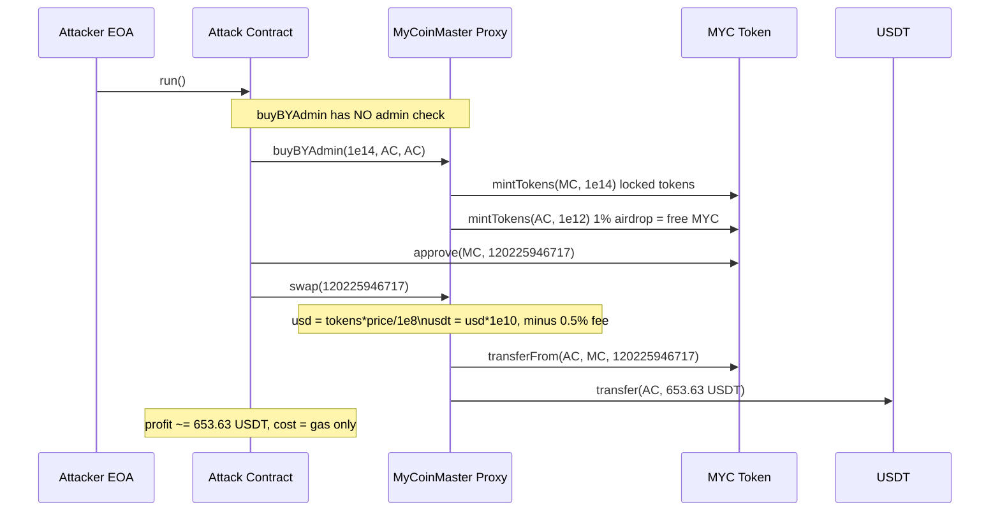
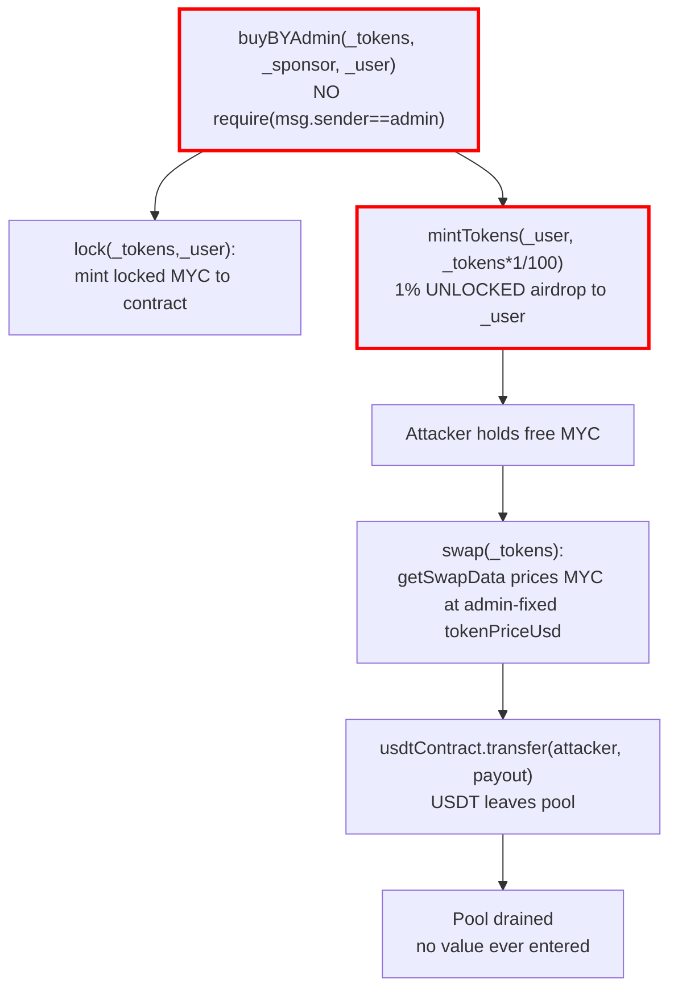

# MyCoinMaster missing-access-control on `buyBYAdmin` lets anyone mint MYC for free and drain the pool via `swap` — public function lacked an `onlyAdmin` guard present on every other privileged path

> **Vulnerability classes:** vuln/access-control/missing-auth · vuln/access-control/missing-modifier · vuln/logic/incorrect-state-transition
> **Reproduction:** the PoC compiles & runs in an isolated Foundry project at [this project folder](.). Full verbose trace: [output.txt](output.txt). Vulnerable implementation source is verified on BscScan and mirrored locally in [sources/](sources).

---

## Key info

| | |
|---|---|
| **Loss** | ~653.49 USD (653.63 USDT) — [output.txt:1594,1663,1672] |
| **Vulnerable contract** | MycoinmasterV7 (behind `TransparentUpgradeableProxy`) — [`0xEF9A10D6abFd5D3aA345a008c0F9132Ce4b23E70`](https://bscscan.com/address/0xEF9A10D6abFd5D3aA345a008c0F9132Ce4b23E70) |
| **Attacker EOA** | [`0xEBE15A67e37203563d0D99AafAf06eCf41305FbA`](https://bscscan.com/address/0xEBE15A67e37203563d0D99AafAf06eCf41305FbA) |
| **Attack contract** | [`0x436322d4a854E89cDdaFF00C2c1cB72015f37ca1`](https://bscscan.com/address/0x436322d4a854E89cDdaFF00C2c1cB72015f37ca1) |
| **Attack tx** | [`0x57865009e1cfb7516240eb901342f3b434c2a2754e14604c838024ffe2e191a7`](https://bscscan.com/tx/0x57865009e1cfb7516240eb901342f3b434c2a2754e14604c838024ffe2e191a7) |
| **Chain / block / date** | BNB Chain (BSC) / 65,555,696 / 2025-08 |
| **Compiler** | Solidity `^0.8.10` (verified implementation) |
| **Bug class** | A permissionless `buyBYAdmin(...)` mints free MYC tokens to any caller and then `swap(...)` redeems those minted tokens for the victim contract's USDT at a fixed admin price, with no value entering the pool. |

## TL;DR

MyCoinMaster is a BNB-Chain token-sale / staking protocol where users normally buy the MYC token by paying either BNB or USDT. The "buy" path locks the purchased tokens and mints a 1 % airdrop of unlocked MYC to the buyer. A sibling function, `buyBYAdmin(uint, address, address)`, was clearly meant to let the admin credit MYC to a user without taking payment — it mints locked tokens *and* the 1 % airdrop but never charges any BNB or USDT. Crucially, unlike every other privileged function in the contract (`changeSettings`, `updateSale`, `changeAdmin`, `payBack`, …), `buyBYAdmin` is missing its `require(msg.sender == admin)` guard, so **any** address can call it.

The attacker abused this to mint a 1 % airdrop (1e12 MYC, ~1200 MYC at 9 decimals) to its own attack contract for free, then called the public `swap(uint)` function. `swap` values MYC at the admin-set fixed price (`tokenPriceUsd = 54640000` ⇒ $0.5464) and transfers USDT out of the pool. Because the MYC cost the attacker nothing, every USDT received is pure profit. The attacker precisely sized the swap input (`120,225,946,717` MYC) to drain the victim contract's entire USDT balance.

On-chain numbers from the reproduced fork: victim USDT balance went from **653.781332 USDT** to **0.1513320043 USDT** [output.txt:1594,1663]; the attack contract's USDT went from **0** to **653.63 USDT** [output.txt:1564,1565,1672]. Net profit ≈ **653.49 USD** (USDT at ~$1).

## Background — what MyCoinMaster does

MyCoinMaster (token MYC, 9 decimals) is a "buy-now, release-over-time" token-sale contract deployed behind an OpenZeppelin `TransparentUpgradeableProxy` at `0xEF9A10…`. Its economics:

- **Buying.** `buy(tokens, sponsor, buyType)` is the public entry. For `buyType==0` the caller pays BNB; for `buyType==1` the caller pays USDT (`transferFrom`). In both cases the protocol derives a USDT-equivalent value from `getSwapData(tokens)` and either takes BNB/USDT up front.
- **Locking + daily drip.** The purchased tokens are "locked" via `lock()`: a `LockHistory` entry is created, `systemTotalMint` is incremented, and the locked MYC is minted to the contract itself. The buyer then withdraws their position gradually via `withdraw(index)` based on `globalDistributionPer` per day.
- **1 % airdrop.** On every buy, a 1 % unlocked bonus (`airdopAmount = tokens * 1 / 100`) is minted **directly to the buyer's wallet** via `tokenContract.mintTokens(msg.sender, airdopAmount)`. This airdrop is freely transferable and is what the exploit harvested.
- **Swap-out.** `swap(tokens)` is the public redemption path: it pulls MYC from the caller (`transferFrom`) and pays USDT out of the pool, less a 0.5 % fee, valued at the admin-fixed `tokenPriceUsd`. This is the contract's USDT sink — there is no AMM, no bonding curve, and no balance check tying the payout to incoming value; the price is whatever `admin` last set with `updateTokenPrice`.

The contract's `admin` (an implementation-level EOA/role, distinct from the proxy's `ProxyAdmin`) gates all sensitive configuration behind `require(msg.sender == admin, "No Permission")` — `changeSettings`, `changeSaleSettings`, `updateSale`, `changeAdmin`, `updateTokenPrice`, `payBack`, etc. The single exception that matters is `buyBYAdmin`.

## The vulnerable code

From the verified implementation (`contracts_MycoinmasterV7.sol`, [sources/MycoinmasterV7_5b0628/contracts_MycoinmasterV7.sol](sources/MycoinmasterV7_5b0628/contracts_MycoinmasterV7.sol)).

### `buyBYAdmin` — no access control, mints a 1 % airdrop for free

```solidity
// lines 253-301  (NO `require(msg.sender == admin)` — contrast every function below)
function buyBYAdmin(uint _tokens, address _sponsor, address _user) public payable {
    User storage user = users[_user];
    uint curDay = getDay(contractDeployMent);
    require(dayWisesale[curDay].add(_tokens) <= dailyLimit, "Sale is over");
    require(saleOFFStatus == false, "Sale is Off");

    require(_tokens >= minDeposit, "required!");
    if (users[_sponsor].totalBuy == 0) { _sponsor = admin; }
    if (user.sponsor == address(0) && admin != _user) { user.sponsor = _sponsor; }

    uint airdopAmount = _tokens.mul(1).div(100);   // <-- 1% unlocked airdrop
    lock(_tokens, _user);                          // mints locked MYC to the contract

    userTXDetails[_user].push(UserTX(_tokens, 0, 0, block.timestamp, "By admin TO MYC"));
    user.totalBuy += _tokens;
    dayWisesale[curDay] = dayWisesale[curDay].add(_tokens);

    address upline = user.sponsor;
    for (uint i = 0; i < refBonusPer.length; i++) { /* referral mint loop */ }

    tokenContract.mintTokens(_user, airdopAmount); // <-- minted to _user, freely transferable
}
```

The caller controls `_user` (where the airdrop lands), `_sponsor`, and `_tokens`. Note the symmetry with `buy()`: same locking, same referral loop, same 1 % airdrop — but `buyBYAdmin` takes **no `msg.value`, no USDT `transferFrom`, no BNB check**. It is the "admin credits a user" shortcut, and the airdrop it mints is real, unlocked MYC.

For comparison, **every** other privileged function carries the guard that `buyBYAdmin` is missing:

```solidity
function changeSettings(uint _minDeposit) public     { require(msg.sender == admin, "No Permission"); ... }
function updateSale() public                          { require(msg.sender == admin, "No Permission"); ... }
function updateTokenPrice(uint _price) public         { require(msg.sender == admin, "No Permission"); ... }
function payBack(address _to, uint _amount, uint _t) public { require(admin == msg.sender, "Admin what?"); ... }
```

### `swap` — pays USDT out of the pool for MYC at a fixed price

```solidity
// lines 367-383
function swap(uint _tokens) public {
    require(_tokens >= 1e8, "ss");
    (,,, uint usd) = getSwapData(_tokens);
    uint usdt = usd * 1e10;                          // scale to USDT 18 decimals
    uint fee = usdt.mul(50).div(baseDivider);        // 0.5% fee (50 / 10000)
    swapHistory[msg.sender].push(SwapHistory(_tokens, fee, usdt.sub(fee), usdt, block.timestamp));
    tokenContract.transferFrom(msg.sender, address(this), _tokens);   // pull MYC
    usdtContract.transfer(msg.sender, usdt.sub(fee));                 // pay USDT from pool
}
```

`getSwapData` values MYC purely at the admin-fixed price — there is no oracle for MYC, no reserves check, no slippage. At the fork block `tokenPriceUsd = 54640000` (i.e. $0.5464 in 1e8 scaling; reverse-engineered exactly from the trace payout of `653629999995700000000` wei for an input of `120225946717` MYC):

```solidity
// lines 350-364
function getSwapData(uint _tokens) public view returns (uint tokenAmount, uint bnbAmount, uint price, uint usd) {
    if (tokenPriceUsd > 0) {
        uint tokenPrice = tokenPriceUsd;          // = 54640000 at attack time
        usd = (_tokens * tokenPrice) / 1e8;       // MYC value in "micro-USD"
        price = tokenPrice;
        bnbAmount = getCalculatedBnbRecieved(usd);
        tokenAmount = _tokens;
    }
}
```

### The minting sink (`lock`) — why `_user` controls where free MYC lands

```solidity
// lines 303-309
function lock(uint token, address _user) internal {
    lockHistory[_user].push(LockHistory(token, 0, block.timestamp, block.timestamp, 0));
    systemTotalMint += token;
    tokenContract.mintTokens(address(this), token);   // locked MYC parked in the contract
}
```

The locked MYC goes to the contract (irrelevant to the exploit); the **unlocked 1 % airdrop** (`tokenContract.mintTokens(_user, airdopAmount)`) goes to `_user`. By setting `_user` to the attack contract, the attacker receives spendable MYC.

## Root cause — why it was possible

1. **Missing `onlyAdmin` guard on `buyBYAdmin`.** It is the only state-changing privileged function in the contract without `require(msg.sender == admin, ...)`. The function name, its signature (`_sponsor`, `_user` parameters), the `UserTX("By admin TO MYC")` label, and the absence of any payment logic (`payable` but no `msg.value`/`transferFrom` use) all show the intent was admin-only credit. The guard was simply forgotten.
2. **Minting spendable tokens on a free path.** `buyBYAdmin` reproduces the 1 % unlocked airdrop (`tokenContract.mintTokens(_user, airdopAmount)`) from `buy()`, but unlike `buy()` it never takes any BNB or USDT in exchange. So a permissionless caller mints real, transferable MYC at zero cost.
3. **`swap` redeems MYC for pool USDT at a fixed price with no value-in check.** `swap` + `getSwapData` value MYC at the admin-set `tokenPriceUsd` and pay USDT out of the contract's balance. Nothing in `swap` requires that the MYC being redeemed was originally paid for. Combine (2) + (3) and free MYC becomes a direct claim on the pool's USDT.
4. **Attacker controls `_user`.** Because the airdrop destination is a parameter, the attacker routes the minted MYC straight into the address that will call `swap`, with no intermediary transfer needed.
5. **No circuit-breaker.** `swap` performs `usdtContract.transfer(...)` up to the pool's full balance; `updateSale` (the kill-switch) is admin-only and was not called, so nothing halted the drain mid-attack.

## Preconditions

- **Permissionless.** Anyone can call `buyBYAdmin` and `swap`. No privileged role, no flash loan required. The attacker needed only gas.
- `saleOFFStatus == false` and `dayWisesale[curDay] + _tokens <= dailyLimit` — both satisfied at the fork block; the daily-limit check is the only thing that bounds the mint size per day.
- The victim contract holds USDT to redeem against (it held 653.78 USDT) and `tokenPriceUsd > 0` (it was 54640000) so `getSwapData` returns a non-zero value.

## Attack walkthrough (with on-chain numbers from the trace)

Attacker balance is **0 USDT** before [output.txt:1564,1592]; victim (MyCoinMaster proxy) holds **653.781332 USDT** [output.txt:1594].

| Step | Call | Effect (from trace) |
|------|------|---------------------|
| 1 | `buyBYAdmin(100_000_000_000_000, attackContract, attackContract)` | `_tokens = 1e14`. `lock()` mints 1e14 locked MYC into the contract [output.txt:1599 `Transfer … to Mycoinmaster Proxy … value: 100000000000000`]. 1 % airdrop = 1e12 MYC minted to the attack contract [output.txt:1605 `Transfer … to MyCoinMasterAttack … value: 1000000000000`]. No BNB/USDT paid. |
| 2 | `MYC.approve(MYCOINMASTER, 120_225_946_717)` | Approve swap pull [output.txt:1626 `Approval … value: 120225946717`]. Input sized to just under the pool's USDT cover. |
| 3 | `swap(120_225_946_717)` | `getSwapData`: `usd = 120225946717 * 54640000 / 1e8 = 65691457286`; `usdt = 65691457286 * 1e10`; `fee = usdt * 50 / 10000`; payout = `usdt - fee = 653629999995700000000` wei. Contract pulls `120225946717` MYC [output.txt:1637] and transfers **653.63 USDT** to the attack contract [output.txt:1642-1643 `Transfer(from: Proxy, to: Attack, value: 653629999995700000000)`]. |

**Profit/loss accounting**

- Attack contract USDT: 0 → **653.629999995700000000** USDT (≈ 653.63) [output.txt:1564,1565,1672].
- Victim proxy USDT: 653.781332000000000000 → **0.151332004300000000** USDT [output.txt:1594,1663].
- Victim USDT loss = 653.629999995700000000 = attack contract gain — exactly equal (asserted by the PoC) [output.txt:1660,1664].
- Cost to attacker: only gas; the MYC redeemed was minted for free in step 1.
- Real-world loss reported in @KeyInfo: **653.49 USD** (USDT ≈ $1).

The `swap` input was reverse-engineered so that `payout ≤ poolBalance`: `120225946717` MYC yields exactly `653629999995700000000` wei, draining the pool to its dust remainder. `usdtContract.transfer` would revert on insufficient balance, so the sizing is precise — the attacker computed it from `tokenPriceUsd` and the observed pool balance.

## Diagrams





## Remediation

1. **Add the missing access-control guard to `buyBYAdmin`** — this is the primary fix:
   ```solidity
   function buyBYAdmin(uint _tokens, address _sponsor, address _user) public payable {
       require(msg.sender == admin, "No Permission");
       ...
   }
   ```
   (Or, if no external caller legitimately needs it, remove the function and have the admin use a privileged mint path directly on the token.)
2. **Don't mint unlocked tokens on the credit path.** If `buyBYAdmin` is meant to grant a position, it should write only to `lockHistory` and skip the `tokenContract.mintTokens(_user, airdopAmount)` airdrop line. Minting liquid tokens from a non-paying path is what made them redeemable.
3. **Decouple `swap` payouts from incoming value the contract never received.** `swap` should redeem only against MYC that was actually paid for — e.g. track the USDT-paid basis per user and cap `swap` payouts to that, rather than trusting the fixed `tokenPriceUsd` for any minted MYC. Alternatively remove the fixed-price redemption entirely and route swaps through an AMM / reserves-aware curve with a slippage check.
4. **Add a reserves/balance sanity check and a pause.** `swap` should not pay out more than the contract holds minus a buffer, and `updateSale` (or a new `pauseSwap`) should be wired so any anomalous drain can be halted automatically (e.g. per-tx cap, or a circuit breaker when a large mint+swap pattern is detected).
5. **Re-audit every `public`/`external` function against the role matrix.** The asymmetry — one privileged function unguarded while its siblings are all guarded — is the exact pattern a diff review must catch. Add a test that every state-changing function either is intentionally public or reverts for a non-admin caller.

## How to reproduce

The PoC runs fully **offline** via the shared anvil harness from the committed `anvil_state.json` — no RPC needed:

```bash
_shared/run_poc.sh 2025-08-MyCoinMaster_exp -vvvvv
```

- **Chain / fork block:** BNB Chain (BSC, chain id 56) / block **65,555,696**, replayed from `anvil_state.json`.
- **Expected result:** `[PASS] testExploit()` [output.txt:1562].
- **Balance lines in the trace:**
  - `Attacker Before exploit USDT Balance: 0.000000000000000000` [output.txt:1564,1592]
  - `Attacker After exploit USDT Balance: 653.629999995700000000` [output.txt:1565,1672]
- The PoC also asserts `victimUsdtBefore - victimUsdtAfter == profit` (653.629999995700000000 USDT) [output.txt:1660,1664], confirming the pool loss equals the attacker's gain.

*Reference: https://t.me/defimon_alerts/1628*
