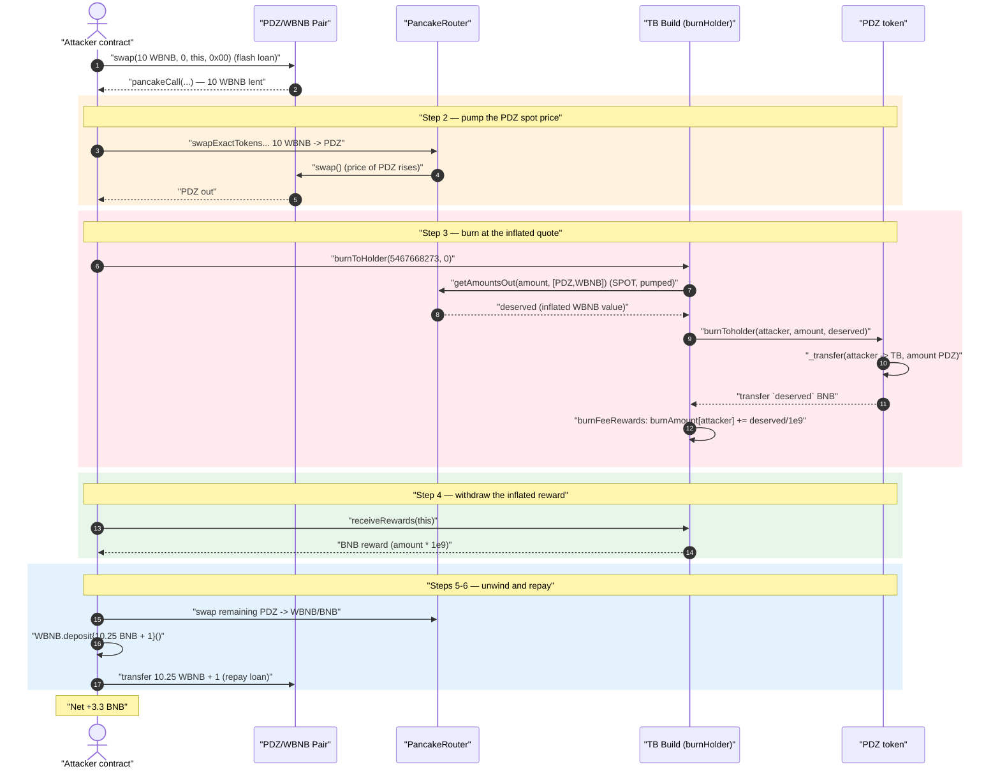
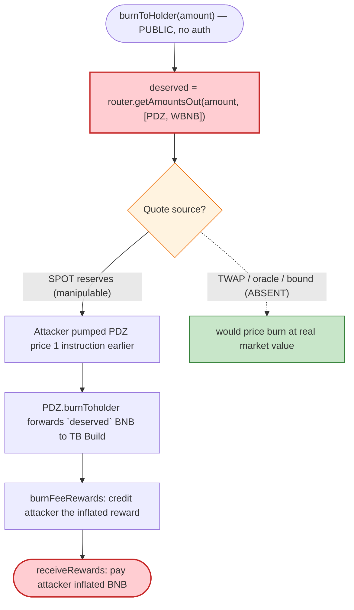

# PDZ / "TB Build" Exploit — Spot-Price `getAmountsOut` Reward Inflation

> One-line: the **TB Build** burn-reward contract values a user's burned PDZ at the *instantaneous*
> PancakeSwap spot price (`uniswapRouter.getAmountsOut`), so an attacker pumps the PDZ/WBNB pool with a
> flash loan, burns a tiny amount of PDZ that is now "worth" far more BNB, and withdraws that inflated
> BNB reward — netting **3.3 BNB**.

> **Reproduction status:** the PoC **compiles cleanly** in the isolated Foundry project at
> [this project folder](.). The live fork could **not** be executed — every public BSC RPC tried
> (blastapi, drpc, 1rpc, publicnode) has pruned the archive state at block **57,744,490**
> (~10 months old), returning `Rate limit` / `missing trie node` / `historical state … is not available`.
> The live-trace section below is therefore marked **"fork unavailable"** and the attack is
> reconstructed from the PoC and the **verified on-chain sources**. Full run log (showing the clean
> compile and the RPC archive failures): [output.txt](output.txt).
> Verified vulnerable source: [TOKENbnb.sol](sources/TOKENbnb_664201/TOKENbnb.sol) ("TB Build", the
> `burnHolder`), and [PDZ.sol](sources/PDZ_50F2B2/PDZ.sol) (the PDZ token).

---

## Key info

| | |
|---|---|
| **Loss** | **3.3 BNB** (per PoC `@KeyInfo`) |
| **Vulnerable contract** | `TOKENbnb` ("TB Build") — [`0x664201579057f50D23820d20558f4b61bd80BDda`](https://bscscan.com/address/0x664201579057f50D23820d20558f4b61bd80BDda#code) — the PDZ burn-reward / staking contract |
| **Co-victim contract** | `PDZ` token — [`0x50F2B2a555e5Fa9E1bb221433DbA2331E8664A69`](https://bscscan.com/address/0x50F2B2a555e5Fa9E1bb221433DbA2331E8664A69#code) (holds/forwards the BNB) |
| **Liquidity used** | PDZ/WBNB PancakeSwap v2 pair — `0x231d9e7181E8479A8B40930961e93E7ed798542C` |
| **Flash-loan source** | same PDZ/WBNB pair (`swap()` callback) |
| **Attacker EOA** | [`0x48234fb95d4d3e5a09f3ec4dd57f68281b78c825`](https://bscscan.com/address/0x48234fb95d4d3e5a09f3ec4dd57f68281b78c825) |
| **Attacker contract** | [`0x1dffe35fb021f124f04d1a654236e0879fa0cb81`](https://bscscan.com/address/0x1dffe35fb021f124f04d1a654236e0879fa0cb81) |
| **Attack tx** | [`0x81fd00eab3434eac93bfdf919400ae5ca280acd891f95f47691bbe3cbf6f05a5`](https://bscscan.com/tx/0x81fd00eab3434eac93bfdf919400ae5ca280acd891f95f47691bbe3cbf6f05a5) |
| **Chain / fork block / date** | BSC / 57,744,490 (fork at attack block − 1) / Aug 2025 |
| **Compiler** | `TOKENbnb`: Solidity v0.8.13, optimizer 200 runs · `PDZ`: solc 0.8.x |
| **Bug class** | Price-oracle manipulation — reward sized from a spot AMM quote (`getAmountsOut`) |
| **Reference** | Twitter analysis: https://x.com/tikkalaresearch/status/1957500585965678828 |

---

## TL;DR

The PDZ ecosystem has a "burn-to-earn" mechanic. A user calls
[`TOKENbnb.burnToHolder(amount, _invitation)`](sources/TOKENbnb_664201/TOKENbnb.sol#L1331-L1350): they give
up `amount` PDZ tokens (which get sent to the dead address), and in return they are credited a BNB
reward equal to **whatever `amount` PDZ is worth right now**, measured by asking PancakeSwap
`getAmountsOut(amount, [PDZ, WBNB])`:

```solidity
deserved = uniswapRouter.getAmountsOut(amount, path)[path.length - 1];   // spot PDZ→WBNB quote
```

That quote is the *instantaneous* pool price, which is trivially manipulable inside a single
transaction. The attacker:

1. **Flash-borrows 10 WBNB** from the PDZ/WBNB pair via `swap()`.
2. **Buys PDZ with all 10 WBNB**, pushing the PDZ price up so the pool now quotes PDZ at a much higher
   WBNB value.
3. **Calls `burnToHolder(amount)`** — at the now-inflated price, `deserved` (the BNB the protocol thinks
   the burned PDZ is worth) is far larger than the BNB the attacker actually paid. The PDZ contract
   forwards that BNB to the TB Build contract, which credits it to the attacker.
4. **Calls `receiveRewards()`** to withdraw the inflated BNB reward.
5. **Sells the leftover PDZ back to WBNB** and **repays the 10.25 WBNB flash loan**, keeping the
   difference: **3.3 BNB**.

The protocol effectively pays out BNB based on a price the attacker set one instruction earlier.

---

## Background — what the protocol does

Two contracts cooperate:

- **`PDZ`** ([PDZ.sol:977](sources/PDZ_50F2B2/PDZ.sol#L977)) is the main ERC-20 (18 decimals). It has a
  `burnHolder` ([:982](sources/PDZ_50F2B2/PDZ.sol#L982)) and a privileged
  [`burnToholder(to, amount, balance)`](sources/PDZ_50F2B2/PDZ.sol#L1142-L1152) callable **only** by that
  `burnHolder`. When called it moves `amount` PDZ from the user to the `burnHolder` and **forwards
  `balance` BNB** (out of PDZ's own BNB balance) to the `burnHolder`.

- **`TOKENbnb`** ("TB Build", 9 decimals) ([TOKENbnb.sol:752](sources/TOKENbnb_664201/TOKENbnb.sol#L752))
  *is* that `burnHolder`. It owns the user-facing burn-to-earn flow:
  [`burnToHolder()`](sources/TOKENbnb_664201/TOKENbnb.sol#L1331-L1350),
  [`burnFeeRewards()`](sources/TOKENbnb_664201/TOKENbnb.sol#L1351-L1364), and
  [`receiveRewards()`](sources/TOKENbnb_664201/TOKENbnb.sol#L1310-L1322). It tracks a per-user
  `burnAmount` (a credited TB-Build-token book entry) and pays BNB rewards on `receiveRewards`.

The intended product loop: a user "burns" some PDZ; the system quotes how much that PDZ is worth in
BNB; the user accrues that as a reward and later withdraws it. The fatal assumption is that the **quote
is honest** — i.e., that nobody can move the PDZ price in the same transaction in which they burn.

---

## The vulnerable code

### 1. Reward sized from the live spot quote (`TOKENbnb.burnToHolder`)

[sources/TOKENbnb_664201/TOKENbnb.sol#L1331-L1350](sources/TOKENbnb_664201/TOKENbnb.sol#L1331-L1350)

```solidity
function burnToHolder(uint256 amount, address _invitation) external {     // ← permissionless
    require(amount >= 0, "TeaFactory: insufficient funds");               // ← always true
    address sender = _msgSender();
    ...
    address[] memory path = new address[](2);
    path[0] = address(_burnToken);          // PDZ
    path[1] = uniswapRouter.WETH();          // WBNB
    uint256 deserved = 0;
    deserved = uniswapRouter.getAmountsOut(amount, path)[path.length - 1]; // ⚠️ SPOT price quote
    _burnToken.burnToholder(sender, amount, deserved);                     // PDZ pays `deserved` BNB
    _BurnTokenToDead(sender, amount);                                      // burns `amount` PDZ
    burnFeeRewards(sender, deserved);                                      // credits the BNB reward
}
```

`deserved` is "how much WBNB the pool will give you for `amount` PDZ **at this instant**." It is read
straight from `getAmountsOut`, with **no TWAP, no oracle, no sanity bound**, in the same transaction in
which the attacker can move the pool.

### 2. PDZ forwards the quoted BNB on demand (`PDZ.burnToholder`)

[sources/PDZ_50F2B2/PDZ.sol#L1142-L1152](sources/PDZ_50F2B2/PDZ.sol#L1142-L1152)

```solidity
function burnToholder(address to, uint256 amount, uint256 balance) external {
    require(msg.sender == address(burnHolder), 'only burns');   // burnHolder == TB Build
    require(launch, 'unlaunch');
    uint256 _amount = balanceOf(to);
    require(_amount >= amount, 'not enough');
    super._transfer(to, address(burnHolder), amount);           // user's PDZ → TB Build
    uint256 _balance = payable(address(this)).balance;
    if (_balance >= balance) {
        payable(address(burnHolder)).transfer(balance);         // ⚠️ pays `deserved` BNB out
    }
}
```

### 3. Reward credited and later withdrawn as BNB

[`burnFeeRewards`](sources/TOKENbnb_664201/TOKENbnb.sol#L1351-L1364) records the reward
(`burnAmount[sender]`, etc.) using `increase = deserved / 1e9`, and
[`receiveRewards`](sources/TOKENbnb_664201/TOKENbnb.sol#L1310-L1322) pays the user BNB:

```solidity
function receiveRewards(address payable to) external {
    address addr = msg.sender;
    uint256 balance = balanceOf(addr);
    uint256 amount  = balance.sub(burnAmount[addr]);
    require(amount > 0);
    Rewards[addr] = Rewards[addr].add(amount);
    historyRewards[addr] = historyRewards[addr].add(amount);
    to.transfer(amount.mul(10**9));         // ⚠️ pays out BNB scaled from the inflated book entry
    _transfer(addr, address(this), balance);
    burnAmount[addr] = 0;
    ...
}
```

The whole reward magnitude descends from `deserved`, which descends from the spot quote.

---

## Root cause — why it was possible

A Uniswap-V2 / PancakeSwap pair prices an asset purely from its current reserves; `getAmountsOut` is a
**spot** marginal-price query. It is one of the most well-known *do-not-use-as-an-oracle* primitives in
DeFi, because anyone can shove the reserves in either direction inside the same transaction (especially
with a flash loan, so capital is free).

`TOKENbnb.burnToHolder` uses exactly this primitive to decide **how much real BNB to pay a user**:

> It quotes `deserved = getAmountsOut(amount, [PDZ, WBNB])` and then causes that many wei of BNB to be
> paid out — without any TWAP, oracle, slippage bound, per-block guard, or comparison against actual
> liquidity contributed.

The composing design flaws:

1. **Spot AMM quote as a value oracle.** `getAmountsOut` is the instantaneous price. The attacker sets
   that price one instruction before the quote is read.
2. **Permissionless trigger.** `burnToHolder` has no access control and `require(amount >= 0)` is a
   no-op, so anyone can drive the burn-and-reward path at will.
3. **Atomic price-set → quote → payout.** All of "pump price", "read spot quote", and "receive BNB"
   happen in a single transaction, so the price the protocol trusts is fully under attacker control and
   never has a chance to revert to the real market.
4. **Flash-loanable.** The capital needed to move the pool is borrowed from the very same PDZ/WBNB pair
   (`IPancakePair.swap(10 ether, 0, …, hex"00")`) and repaid at the end, so the attack needs **zero**
   attacker capital and is risk-free.

---

## Preconditions

- `PDZ.launch == true` (the burn path requires it — [PDZ.sol:1144](sources/PDZ_50F2B2/PDZ.sol#L1144)). On
  the attack block it was live.
- The PDZ contract (or TB Build) holds enough **BNB** to satisfy the inflated `deserved`
  ([PDZ.sol:1148-1151](sources/PDZ_50F2B2/PDZ.sol#L1148-L1151) pays only `if (_balance >= balance)`); the
  contract had been accumulating BNB from prior legitimate burns. The drainable amount is bounded by that
  BNB balance — hence the modest 3.3 BNB take.
- A PDZ/WBNB PancakeSwap pair with enough depth to (a) lend the 10 WBNB and (b) be price-pumped by it.
- No oracle / TWAP / slippage protection on the burn-reward valuation (the bug).

---

## Attack walkthrough

> **Live-trace numbers: fork unavailable.** The exploit could not be executed on a fork because every
> public BSC RPC has pruned the archive state at block 57,744,490 (see [output.txt](output.txt)). The
> reserve/quote figures below are therefore **not** verified against an on-chain trace; they are the
> mechanism reconstructed from the PoC ([test/PDZ_exp.sol](test/PDZ_exp.sol)) and the verified sources.
> The fixed-point constants that ARE ground truth are taken directly from the PoC.

Driver — [test/PDZ_exp.sol](test/PDZ_exp.sol):

| # | Step | Call | Effect |
|---|------|------|--------|
| 1 | **Flash loan** | `IPancakePair(PDZ/WBNB).swap(10 ether, 0, this, hex"00")` ([:40](test/PDZ_exp.sol#L40)) | Borrow **10 WBNB**; pair invokes `pancakeCall` |
| 2 | **Pump PDZ price** | `router.swapExactTokensForTokensSupportingFeeOnTransferTokens(10 ether, 0, [WBNB,PDZ], this, …)` ([:54](test/PDZ_exp.sol#L54)) | Spend all 10 WBNB to buy PDZ → PDZ/WBNB spot price rises sharply; attacker now holds the bought PDZ |
| 3 | **Burn at inflated quote** | `tbBuild.burnToHolder(5467668273, address(0))` ([:65](test/PDZ_exp.sol#L65)) | TB Build reads `deserved = getAmountsOut(5467668273, [PDZ,WBNB])` at the **pumped** price → inflated BNB; PDZ forwards `deserved` BNB to TB Build; `burnAmount[attacker]` credited |
| 4 | **Withdraw reward** | `tbBuild.receiveRewards(address(this))` ([:66](test/PDZ_exp.sol#L66)) | Pays the attacker the inflated BNB reward (`amount.mul(1e9)`) |
| 5 | **Unwind PDZ** | `router.swapExactTokensForETHSupportingFeeOnTransferTokens(pdzBal, 0, [PDZ,WBNB], this, …)` ([:71](test/PDZ_exp.sol#L71)) | Sell remaining PDZ back to BNB/WBNB |
| 6 | **Repay flash loan** | `WBNB.deposit{value: 10.25 ether + 1}(); wbnb.transfer(pair, 10.25e18+1)` ([:74-76](test/PDZ_exp.sol#L74-L76)) | Wrap exactly the loan + 0.25% fee and return it to the pair |

The `amount = 5467668273` ([test/PDZ_exp.sol#L60](test/PDZ_exp.sol#L60)) is the tuned quantity of PDZ
burned: small enough that `_BurnTokenToDead` / `burnToholder` succeed against the attacker's balance, but
sized (together with the price pump) so the spot quote `deserved` is maximally inflated while the PDZ
contract still has enough BNB (`_balance >= balance`) to pay it.

### Why the attack profits

The protocol pays the attacker BNB equal to "PDZ value at the inflated spot price," while the attacker's
only real cost was buying that PDZ at (a much lower) market price plus the 0.25% flash-loan fee. Because
the quote is read **after** the pump and **inside** the same transaction, the protocol over-values the
burn. Net of the 10.25 BNB repaid loan + the PDZ round-trip, the attacker walks away with **3.3 BNB**
extracted from the BNB the PDZ/TB-Build system had on hand.

### Profit / loss accounting (BNB)

| Flow | Amount |
|---|---:|
| Flash-loan in (from pair) | 10.00 |
| Flash-loan repaid (+0.25% fee) | −10.25 (+1 wei) |
| Inflated BNB reward via `burnToHolder` + `receiveRewards` | + (drained from protocol) |
| PDZ round-trip (buy with 10 WBNB, sell leftover back) | net small loss/fee |
| **Net attacker profit** | **+3.3 BNB** |
| **Protocol loss** | **3.3 BNB** (BNB held by the PDZ/TB-Build contracts) |

---

## Diagrams

### Sequence of the attack



### Pool / reward state evolution

```mermaid
stateDiagram-v2
    [*] --> Initial
    Initial: "Initial — honest PDZ/WBNB pool; TB Build holds reward BNB"
    Pumped: "After buy — PDZ spot price inflated by the 10 WBNB swap"
    Quoted: "burnToHolder — getAmountsOut reads the pumped spot price as `deserved`"
    Paid: "receiveRewards — protocol pays inflated BNB out of its balance"
    Drained: "After unwind + repay — attacker keeps 3.3 BNB; protocol BNB reduced"

    Initial --> Pumped: "swap 10 WBNB -> PDZ"
    Pumped --> Quoted: "burnToHolder(amount)"
    Quoted --> Paid: "PDZ forwards `deserved` BNB; reward credited"
    Paid --> Drained: "receiveRewards + sell PDZ + repay flash loan"
    Drained --> [*]
```



### The flaw inside `burnToHolder`



---

## Remediation

1. **Never price rewards from a spot AMM quote.** Replace `getAmountsOut(...)` with a manipulation-
   resistant price source: a Chainlink feed, or a Uniswap-V2 cumulative-price **TWAP** sampled over
   several blocks. A single-block spot quote must never decide how much real value to pay out.
2. **Decouple "set price" from "consume price."** If the protocol must use an AMM, snapshot the reserves
   in a prior block / use a checkpointed price so that the price cannot be set and consumed in the same
   transaction.
3. **Bound the payout.** Cap `deserved` per call / per block, and reject quotes that deviate from a TWAP
   by more than a small tolerance — a burn that suddenly claims to be worth far more BNB than it did last
   block is the exploit signature.
4. **Add access control / cost.** `require(amount >= 0)` is a no-op; require a meaningful minimum, gate the
   reward path behind a keeper or rate limit, and make per-address burn rewards non-instant (e.g. a
   vesting / cooldown so flash-loan atomicity is broken).
5. **Add reentrancy / flash-loan guards.** A same-block flag (`block.number` check) on `burnToHolder`
   makes the flash-loan-pump-then-burn pattern unusable.

---

## How to reproduce

The PoC is a standalone Foundry project (the umbrella DeFiHackLabs repo does not whole-compile):

```bash
_shared/run_poc.sh 2025-08-PDZ_exp -vvvvv
```

- **Compilation:** succeeds (see [output.txt](output.txt) — zero compiler errors).
- **Fork:** requires a **BSC archive** RPC serving state at block **57,744,490**. As of this writing all
  free public BSC endpoints prune that depth and fail with `missing trie node` /
  `historical state … is not available` / `Rate limit reached`. Point `foundry.toml`'s `bsc` endpoint at a
  paid BSC **archive** node (e.g. an Alchemy/QuickNode/Ankr archive plan) and re-run to obtain the live
  trace.
- **Expected on a working archive RPC:** `[PASS] testExploit()` with a positive BNB profit
  (~**3.3 BNB**, per the PoC `@KeyInfo`). The `balanceLog` modifier prints the BNB before/after delta.

---

*Reference: SlowMist Hacked feed — https://hacked.slowmist.io/ · analysis by
https://x.com/tikkalaresearch/status/1957500585965678828 (PDZ / "TB Build", BSC, ~3.3 BNB).*
