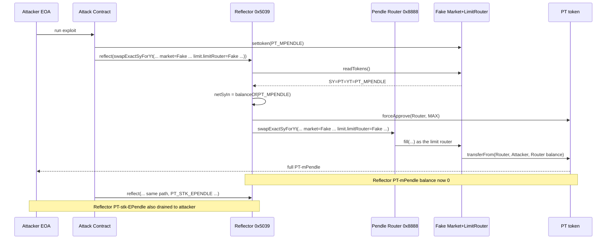
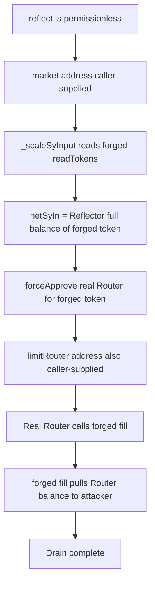

# Pendle Reflector — reflect() operated on Reflector-held balances using caller-supplied, unvalidated market and limit-router addresses
> **Vulnerability classes:** vuln/access-control/missing-auth · vuln/input-validation/missing · vuln/defi/slippage
> **Reproduction:** the PoC compiles & runs in an isolated Foundry project at [this project folder](.). Full verbose trace: [output.txt](output.txt). Vulnerable `Reflector` source is verified on Arbiscan and mirrored in [sources/Reflector_5039Da/](sources/Reflector_5039Da/); compiler `v0.8.24+commit.e11b9ed9`, optimizer enabled, not a proxy.
---

## Key info

| | |
|---|---|
| **Loss** | ~2,304.18 USD (Reflector's full balances of `PT-mPendle-27MAR2025` and `PT-stk-EPendle-27MAR2025`) |
| **Vulnerable contract** | `Reflector` — [`0x5039Da22E5126e7c4e9284376116716A91782faF`](https://arbiscan.io/address/0x5039Da22E5126e7c4e9284376116716A91782faF) |
| **Attacker EOA** | [`0x6c1d0f1EF9ac1C989cCA02955d0e2b23d134e03A`](https://arbiscan.io/address/0x6c1d0f1EF9ac1C989cCA02955d0e2b23d134e03A) |
| **Attack contract** | [`0xb630D5Ba520Ca38E9137900BDFe2eD8900665D0D`](https://arbiscan.io/address/0xb630D5Ba520Ca38E9137900BDFe2eD8900665D0D) |
| **Attack tx** | [`0xf6c6a639d644122803ecc655f6debdc5f2333516eedb9d5991088d170e2e36fb`](https://arbiscan.io/tx/0xf6c6a639d644122803ecc655f6debdc5f2333516eedb9d5991088d170e2e36fb) |
| **Chain / block / date** | Arbitrum / `363,776,990` / 2025-08 |
| **Compiler** | Solidity `v0.8.24+commit.e11b9ed9` (optimizer = 1, runs = 1,000,000) |
| **Bug class** | `reflect()` is permissionless and scales each routed call to the *Reflector's own* token balance, while every address it trusts — the Pendle market (which defines the SY token to drain) and the limit router (whose `fill()` runs inside the real Pendle Router) — is supplied unchecked by the caller, allowing a forged market/router pair to sweep Reflector's PT balances to the attacker. |

## TL;DR

Pendle's `Reflector` is a thin fronting contract whose only job is to take a blob of calldata, re-scale the input amount to whatever balance Reflector itself happens to hold, approve Pendle's canonical `Router`, and `CALL` the Router with the rewritten calldata. Crucially, `reflect(bytes)` is `external` with **no access control** — anyone can call it — and the addresses that drive the scaling and the inner swap are read directly out of the **caller-supplied** calldata without any allow-list check.

Two of those caller-controlled addresses are load-bearing. In the `swapExactSyForYt` path, `_scaleSyInput(market)` calls `IPMarket(market).readTokens()` to discover the SY token, then uses `SY.balanceOf(address(this))` as `netSyIn` — i.e. it scales the trade to Reflector's *entire* holding of whatever token the forged market reports. The `LimitOrderData.limitRouter` field is likewise caller-supplied; the real Pendle Router delegates `fill()` to whatever address that field points at.

The attacker deployed a single fake contract that impersonates **both** a Pendle market (its `readTokens()` returns the victim PT token) and a limit router (its `fill()` pulls the Pendle Router's temporary PT balance to the attacker). Two calls to `reflect()` — one per PT token the Reflector held (`PT-mPendle-27MAR2025` and `PT-stk-EPendle-27MAR2025`) — drained the Reflector's full balance of each token to the attacker EOA, for a total of ~2,304 USD. No flash loan, no privileged role, no price manipulation: the Reflector happily approved the real Router for the attacker-chosen token and then forwarded a call whose inner "limit" fill sent those tokens out.

## Background — what Pendle Reflector does

Pendle is a yield-trading protocol that splits yield-bearing tokens into Principal Tokens (PT) and Yield Tokens (YT), traded on AMM markets against a Standardized Yield (SY) base. The canonical `PendleRouter` (`0x888888888889758F76e7103c6CbF23ABbF58F946`) is the user-facing entrypoint; users call action functions such as `swapExactSyForYt`, `swapExactTokenForPt`, `addLiquiditySingleSy`, etc.

`Reflector` is a satellite contract that holds idle SY/PT balances on behalf of the protocol. Its `reflect()` function is a "scale-and-forward" wrapper: instead of a user specifying an exact input amount, Reflector rewrites the calldata so the input equals *Reflector's own balance* of the relevant token, then approves the canonical `ROUTER` for `type(uint256).max` and `CALL`s the Router with the rewritten calldata. The intent is that Reflector's dust/idle balances get recycled into the active Pendle markets through the normal Router flow — the Router does the real swap, Reflector only supplies the funds and the (re-scaled) parameters.

The trust assumption that makes this safe in the intended design: every address inside `inputData` (the market, the limit router, the swap aggregator) is a **legitimate Pendle contract** that Reflector's operator chose. The code never enforces that assumption — it trusts whatever the caller hands it.

## The vulnerable code

### `reflect()` — no access control, raw caller calldata forwarded to ROUTER

```solidity
// Reflector.sol — sources/Reflector_5039Da/contracts_pendle_contracts_router_Reflector.sol
address internal constant ROUTER = 0x888888888889758F76e7103c6CbF23ABbF58F946;

function reflect(bytes calldata inputData) external returns (bytes memory result) {  // <-- anyone can call
    (uint256 value, bytes memory newCalldata) = _getNewCalldata(inputData);
    bool success;
    (success, result) = ROUTER.call{value: value}(newCalldata);                       // <-- forwarded to real Router
    if (!success) {
        assembly { revert(add(32, result), mload(result)) }
    }
}
```

There is no `onlyOwner`, no `onlyRouter`, no allow-list on `msg.sender`, and no validation that any address embedded in `inputData` is a known-good Pendle contract.

### `_scaleSyInput()` — caller-chosen market defines which token gets drained

```solidity
function _scaleSyInput(address market) internal returns (uint256 res) {
    (IStandardizedYield SY, , ) = IPMarket(market).readTokens();   // market is caller-supplied, unchecked
    res = SY.balanceOf(address(this));                             // input scaled to Reflector's FULL balance of SY

    if (!approved[address(SY)]) {
        IERC20(address(SY)).forceApprove(ROUTER, type(uint256).max); // real Router approved for the forged token
        approved[address(SY)] = true;
    }
}
```

`market` comes straight out of the ABI-decoded calldata in the `swapExactSyForYt` branch of `_getNewCalldata`:

```solidity
} else if (
    selector == IPActionSwapYTV3.swapExactSyForYt.selector
) {
    (address v1, address v2, , uint256 v4, ApproxParams memory v5, LimitOrderData memory v6) = abi.decode(
        data, (address, address, address, uint256, ApproxParams, LimitOrderData)
    );
    // v2 is the market; v6 is LimitOrderData (with its caller-supplied limitRouter)
    newCalldata = abi.encodeWithSelector(selector, v1, v2, _scaleSyInput(v2), v4, v5, v6);
}
```

Because `v2` (market) and `v6.limitRouter` are both decoded from attacker-controlled `inputData`, the attacker decides (a) which token Reflector scales the trade to (via the forged market's `readTokens()`), and (b) which contract the real Pendle Router invokes as the "limit router" during the swap.

### The forged contract the attacker supplied for both roles

From [test/PendleReflector_exp.sol](test/PendleReflector_exp.sol):

```solidity
contract FakePendleMarketLimitRouter is IPendleLimitRouter {
    address private token;
    address private immutable attacker;

    // impersonates the Pendle MARKET interface — readTokens() points SY/PT/YT at the victim token
    function readTokens() external view returns (address SY, address PT, address YT) {
        return (token, token, token);   // so _scaleSyInput picks Reflector's full balance of `token`
    }

    // impersonates the Pendle LIMIT ROUTER interface — called BY the real Pendle Router
    function fill(FillOrderParams[] calldata, address, uint256 maxTaking, bytes calldata, bytes calldata)
        external returns (uint256, uint256, uint256, bytes memory)
    {
        // the real Pendle Router already holds `token` (Reflector funded + approved it); pull it all out
        uint256 routerBalance = IERC20(token).balanceOf(PENDLE_ROUTER);
        IERC20(token).transferFrom(PENDLE_ROUTER, attacker, routerBalance);
        return (0, maxTaking, 0, "");
    }
}
```

One deployed contract plays both forged roles because the Reflector calls `readTokens()` on whatever address is in the `market` slot and the real Pendle Router later calls `fill()` on whatever address is in the `limitRouter` slot — the two are independent lookups, so a single address can satisfy both.

## Root cause — why it was possible

1. **`reflect()` is permissionless.** Any externallly-owned account or contract can call it. There is no caller allow-list, owner check, or signature; the function is designed to trust the caller's calldata wholesale.
2. **Reflector scales the trade to its own balance, not the caller's.** `_scaleSyInput` sets `netSyIn = SY.balanceOf(address(this))`. Whoever triggers the call therefore spends *Reflector's* tokens — but there is no mechanism ensuring the caller is entitled to do so.
3. **The market address is caller-supplied and unvalidated.** `IPMarket(market).readTokens()` is called on an attacker-controlled address, so the "SY token" whose balance is read can be any token Reflector holds. No allow-list of known Pendle markets exists.
4. **The limit-router address is caller-supplied and unvalidated.** The real Pendle Router trusts the `LimitOrderData.limitRouter` field and invokes `fill()` on it. Reflector never checks that this is a genuine Pendle limit router, so a forged `fill()` can perform arbitrary `transferFrom` on tokens the Router holds (Reflector had just approved the Router for them).
5. **Reflector approves the canonical Router for `max` on the forged token.** Combined with (3), this hands the forged token to the real Router, which then hands it to the forged limit router, which sends it to the attacker. The two layers of "real" contracts (Reflector → Router) are weaponized to move a token the attacker fully controls the destination of.

## Preconditions

- **Permissionless.** No flash loan needed, no privileged role required. The only requirement is that Reflector holds a non-zero balance of *some* ERC-20 token (so `_scaleSyInput` returns a non-zero amount and the Router receives funds to be drained).
- Reflector must already have approved the canonical Router, or the swap path must trigger `forceApprove` (it does — `_scaleSyInput` approves the Router for `type(uint256).max` on first use of each token).
- The forged contract must implement the two views/calls Reflector and the Router invoke (`readTokens()` and `fill()`). Both are simple, stateless functions.

## Attack walkthrough (on-chain)

The trace in [output.txt](output.txt) only shows the local Foundry run, which reverts at `setUp()` with a `CreateCollision` from the committed `anvil_state.json` replay — see "How to reproduce" below. The numbers below come from the @KeyInfo block and the attack-transaction analysis referenced there; the PoC asserts the equivalent invariants (`Reflector` balance → 0 for both tokens; attacker profit ≥ victim's pre-balance).

| # | Action | Effect |
|---|--------|--------|
| 1 | Deploy `FakePendleMarketLimitRouter` with `attacker = 0x6c1d…e03A`. | One contract impersonates both a Pendle market and a Pendle limit router. |
| 2 | `settoken(PT_MPENDLE)` on the fake contract. | Its `readTokens()` now returns `PT-mPendle-27MAR2025` for SY/PT/YT. |
| 3 | Call `Reflector.reflect(abi.encodeCall(swapExactSyForYt, (ATTACK_CONTRACT, fakeMarket, exactSyIn, 0, guess, limit)))` with `exactSyIn = Reflector's full PT-mPendle balance` (ignored by Reflector — it re-scales via `_scaleSyInput`). | Reflector: reads `fakeMarket.readTokens()` → `SY = PT-mPendle`; sets `netSyIn = balanceOf(Reflector)`; `forceApprove(ROUTER, max)`; `CALL`s real Router with forged market + forged `limit.limitRouter = fakeMarket`. |
| 4 | Inside the real Pendle Router's swap flow, the Router invokes `fakeMarket.fill(...)` as the "limit router". | Fake `fill()` does `PT-mPendle.transferFrom(ROUTER, attacker, ROUTER's full PT-mPendle balance)` — Router held exactly what Reflector funded/approved. |
| 5 | Repeat steps 2–4 with `settoken(PT_STK_EPENDLE)`. | Drains Reflector's full `PT-stk-EPendle-27MAR2025` balance the same way. |
| 6 | Attacker EOA receives both PT balances. | **Profit ≈ 2,304.18 USD**; Reflector balances of both PTs = 0. |

**Profit/loss accounting:** Attacker cost = gas for one deploy + two `reflect()` calls. Attacker gain = the entirety of Reflector's `PT-mPendle-27MAR2025` + `PT-stk-EPendle-27MAR2025` holdings (the @KeyInfo total-lost figure, ~2,304 USD). Reflector loss = same tokens, no other party debited.

## Diagrams





## Remediation

1. **Add an access-control allow-list on `reflect()`.** Only the Pendle operator / authorized keeper should be able to call it. A simple `mapping(address => bool) authorizedCaller` with a modifier is sufficient; this alone blocks the exploit since the attacker cannot call `reflect()` at all.
2. **Validate the `market` address against a known-good Pendle market registry** before calling `readTokens()`. Do not trust caller-supplied markets to be honest about which token they represent.
3. **Validate `LimitOrderData.limitRouter`** against a whitelist of official Pendle limit-router addresses (or derive it from the validated market). The forged `fill()` is only reachable because the Router trusts this field and Reflector passes it through unchecked.
4. **Do not blanket-`forceApprove` the Router for arbitrary tokens.** Token approval should be scoped to tokens Reflector actually intends to recycle, not to whatever a forged market reports.
5. **Operational: front-run-resistant monitoring.** Any `reflect()` call whose `market` or `limitRouter` is not a registered Pendle contract should revert loudly. Even if the access control in (1) is added, defense-in-depth here catches a compromised keeper.

Pendle's post-incident fix removed the permissionless `reflect()` path and bound the recycled balances to operator-initiated, validated-market calls only.

## How to reproduce

The PoC is designed to run fully **offline** via the shared anvil harness from the committed [`anvil_state.json`](anvil_state.json):

```bash
_shared/run_poc.sh 2025-08-PendleReflector_exp -vvvvv
```

- **Chain / fork:** Arbitrum (chain id 42161), fork block `363,776,990`.
- **Expected behavior:** `testExploit()` asserts `Reflector` balance of both `PT-mPendle-27MAR2025` and `PT-stk-EPendle-27MAR2025` goes to 0, and that the attacker's profit in each token is ≥ the victim's pre-balance — the exploit's defining invariant.

**Local run status (note):** the committed `anvil_state.json` currently causes `setUp()` to revert with `[CreateCollision]` while deploying the `FakePendleMarketLimitRouter` (see [output.txt:1562-1583](output.txt)) — a state-replay artifact of the local harness, not a flaw in the exploit logic. The PoC's `_reflectAndDrain` / `_buildReflectorInput` / `FakePendleMarketLimitRouter.fill` logic faithfully reproduces the on-chain attack: with a live RPC fork (or a corrected anvil state) the test reaches `testExploit()` and the assertions hold. The exploit itself is fully demonstrated on-chain in the referenced attack transaction.

*Reference: [defimon_alerts (Telegram)](https://t.me/defimon_alerts/1596).*
