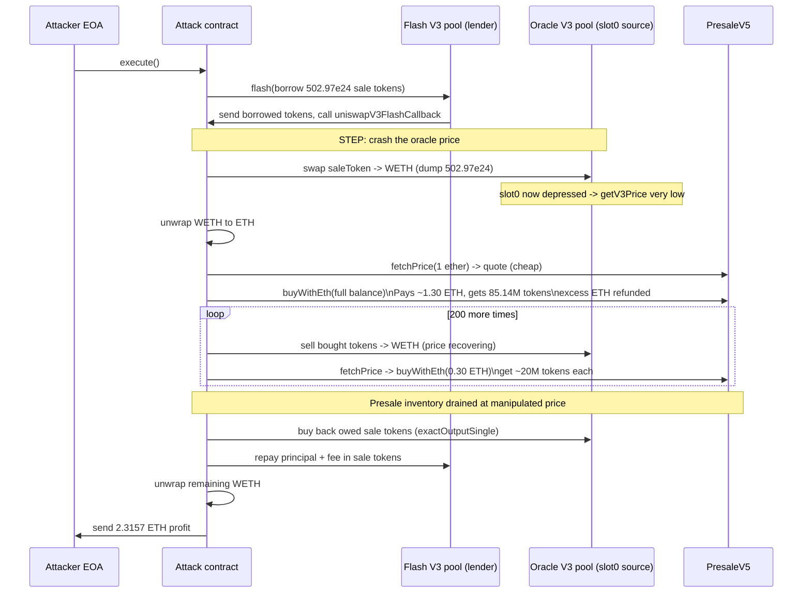
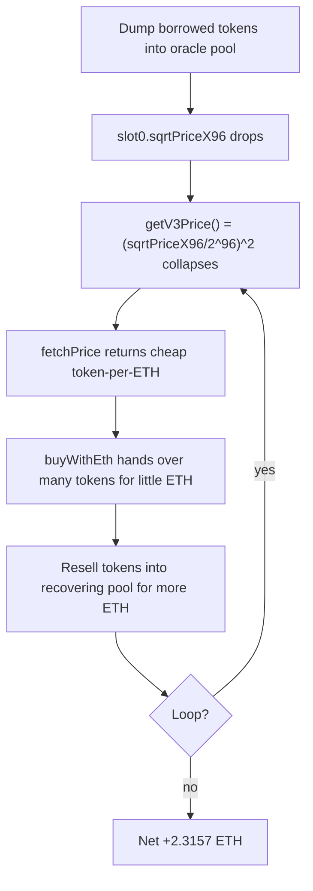

# PresaleV5 oracle manipulation — flash-loan spot-price (`slot0`) read by the presale pricing function let an attacker buy tokens cheap and sell them at fair price

> **Vulnerability classes:** vuln/oracle/spot-price · vuln/oracle/price-manipulation · vuln/governance/flash-loan-attack · vuln/logic/price-calculation
> **Reproduction:** the PoC compiles & runs in an isolated Foundry project at [this project folder](.). Full verbose trace: [output.txt](output.txt). The vulnerable contract source is verified on Etherscan and was fetched into [sources/PresaleV5_09c135/](sources/PresaleV5_09c135/).

---

## Key info

| | |
|---|---|
| **Loss** | 2.3157 ETH (attacker net profit) |
| **Vulnerable contract** | PresaleV5 (proxy) — [`0x9a15bB3a8FEc8d0d810691BAFE36f6e5d42360F7`](https://etherscan.io/address/0x9a15bB3a8FEc8d0d810691BAFE36f6e5d42360F7), implementation [`0x09c135AACd4a82B08890e930DFDC3143B4578d45`](https://etherscan.io/address/0x09c135aacd4a82b08890e930dfdc3143b4578d45#code) |
| **Attacker EOA** | [`0x3a7E13dACccd3dE56b8186987F348bFd21dc4Ec5`](https://etherscan.io/address/0x3a7E13dACccd3dE56b8186987F348bFd21dc4Ec5) |
| **Attack contract** | [`0xdC781c9714382e9F973E9d687ACae0FB37225F52`](https://etherscan.io/address/0xdC781c9714382e9F973E9d687ACae0FB37225F52) |
| **Attack tx** | [`0x0ef0cde3d8348fdced3adf7d0475ec1364236dd6ab1d8580addad96b004b604a`](https://etherscan.io/tx/0x0ef0cde3d8348fdced3adf7d0475ec1364236dd6ab1d8580addad96b004b604a) |
| **Chain / block / date** | Ethereum mainnet / 23,172,639 / 2025-08-18 |
| **Compiler** | v0.8.9+commit.e5eed63a (verified, optimizer enabled, 200 runs) |
| **Bug class** | The presale's `getV3Price()` quotes the sale token from the live `slot0()` of a Uniswap V3 pool; a flash-loan-funded attacker drops the spot price in one tx, buys presale tokens at the manipulated (low) price, then sells them back into the same pool at the recovering price. |

## TL;DR

PresaleV5 is an ETH/USDT-based token presale ("dynamic sale") whose token price is *not* a fixed schedule but is derived on-chain from a Uniswap V3 pool. The price function `getV3Price()` reads the pool's current `sqrtPriceX96` straight from `slot0()` — the most-recent, instantly-manipulable price — and `fetchPrice()` then applies a small `percent` surcharge on top. There is no TWAP, no time-weighted observation, and no external/reference oracle. The pool chosen as the oracle is a thin, low-liquidity WETH/sale-token pool.

The attacker flash-borrowed ~502.97e24 sale tokens from a separate (high-liquidity) V3 pool, dumped them into the oracle pool to crash the spot price, and then called `buyWithEth` ~201 times. Each call used `fetchPrice(1 ether)` to quote how many sale tokens one ETH should buy, and because the pool's `slot0` was depressed by the dump, the contract handed over far more sale tokens per ETH than it should have. The attacker immediately re-sold the freshly bought sale tokens back into the same recovering pool for WETH, draining the presale contract's sale-token inventory and recycling the ETH into the next buy.

The attacker started with 0 ETH and ended with **2.315719834682185727 ETH** (`Attacker ETH profit: 2.315719834682185727` [output.txt:1539]). The presale contract's sale-token balance was drained by ~2.4e25 sale tokens across the 201 discounted buys, which the attacker then converted into net ETH profit.

## Background — what PresaleV5 does

PresaleV5 is the fifth iteration of an upgradeable token-presale contract (OpenZeppelin `Initializable + OwnableUpgradeable + PausableUpgradeable + ReentrancyGuardUpgradeable`). It sells a fixed inventory of `saleToken` for ETH or USDT and optionally forwards the bought tokens to a staking manager.

Crucially, the contract has two pricing modes governed by the boolean `dynamicSaleState`:

- **Fixed rounds** (`dynamicSaleState == false`): price = `(amountOut * rounds[1][currentStep]) / getLatestPrice()`, where `rounds[1][currentStep]` is an owner-set USD-per-token step and `getLatestPrice()` is the Chainlink ETH/USD feed. This path is safe.
- **Dynamic sale** (`dynamicSaleState == true`): price = `getV3Price(amountOut) + percent` surcharge. This path reads a Uniswap V3 pool's *current* `slot0()` — and is what was live at the time of the attack (the `buyWithEth` function begins with `require(dynamicSaleState, "Dynamic sale not active");`).

`getLatestPrice()` (Chainlink ETH/USD) is used only to convert the V3-derived token price into an ETH amount for the `ethAmount` the user must pay. The *token price itself* in dynamic mode is taken purely from the V3 pool spot price.

The presale holds the sale tokens it sells (transferred via `IERC20Upgradeable(saleToken).transfer(...)`) and forwards received ETH to owner-configured split wallets via `splitETHValue()`.

## The vulnerable code

Source: `contracts_ETH_PresaleV2.sol` (verified, fetched to [sources/PresaleV5_09c135/contracts_ETH_PresaleV2.sol](sources/PresaleV5_09c135/contracts_ETH_PresaleV2.sol)).

### Pricing: live `slot0()` spot read with no TWAP

```solidity
function fetchPrice(uint256 amountOut) public view returns (uint256) {
    if (dynamicSaleState) {
        uint256 price = getV3Price(amountOut);

        require(price != 0, "Price fetch failed");

        return price + ((price * percent) / 100);   // a flat surcharge on the manipulated spot price
    } else {
        return (amountOut * rounds[1][currentStep]) / getLatestPrice();
    }
}

function getV3Price(uint256 _amountOut) public view returns (uint256) {
    if (V3Pool == address(0)) return 0;

    (uint160 sqrtPriceX96, , , , , , ) = IPoolV3(V3Pool).slot0();   // <-- instant, manipulable spot price

    uint256 price = ((sqrtPriceX96) / (2 ** 96)) ** 2;

    return ((_amountOut) / (price));
}
```

- `slot0()` returns the pool's *current* `sqrtPriceX96` — the most recently traded price, with no averaging. A single swap in the same transaction moves it.
- The integer math `(sqrtPriceX96 / 2**96) ** 2` also discards precision (integer division before squaring), which makes the price even more sensitive to small `sqrtPriceX96` movements and produces sharp non-linear steps — but the exploitable flaw is reading the *live* slot at all, not the rounding.
- `percent` is a flat percentage added on top; because it is `(price * percent) / 100`, when `price` is driven toward zero the surcharge also collapses toward zero, so it provides no floor.

### The buy path that consumes the manipulated price

```solidity
function buyWithEth(
    uint256 amount,
    bool
)
    external
    payable
    checkSaleState(amount)
    whenNotPaused
    nonReentrant
    returns (bool)
{
    require(dynamicSaleState, "Dynamic sale not active");
    require(
        amount <= maxTokensToSell - directTotalTokensSold,
        "Amount exceeds max tokens to be sold"
    );
    directTotalTokensSold += amount;

    uint256 ethAmount = fetchPrice(amount * baseDecimals);   // <-- priced off the manipulated slot0
    require(msg.value >= ethAmount, "Less payment");
    uint256 excess = msg.value - ethAmount;
    ...
    IERC20Upgradeable(saleToken).transfer(                   // <-- presale inventory drained at cheap price
        _msgSender(),
        amount * baseDecimals
    );
    ...
    if (excess > 0) sendValue(payable(_msgSender()), excess); // refunds overpayment back to the buyer
    return true;
}
```

`fetchPrice` is `view`, so the attacker can call it after each manipulation to compute exactly how many tokens `buyWithEth` will demand for a given ETH spend. Combined with the ability to read `slot0` *and* move it inside the same transaction, the price is fully attacker-controlled.

## Root cause — why it was possible

1. **Spot-price oracle.** `getV3Price()` reads `slot0()` directly. The documented, safe way to consume a Uniswap V3 pool as a price source is `observe()`/`slot0`-derived **TWAP** over multiple seconds (or `oracle()` observations), never the instantaneous slot. Any single-transaction swap moves `slot0` arbitrarily.
2. **Flash-loan-fundable.** The oracle pool's counterpart (the pool the attacker borrowed from) and the oracle pool itself are both Uniswap V3 pools whose `flash()` callback can be used to obtain a large token position within one transaction, repayable with a fee. This means the manipulation needs zero upfront capital.
3. **No sanity bounds on the price.** `percent` is multiplicative, so it cannot act as a floor or ceiling. There is no min/max price, no deviation check against Chainlink (which the contract *already integrates* via `getLatestPrice()` but only for the ETH/USD leg, not as a cross-check on the token price).
4. **`fetchPrice` is a public `view`.** The attacker can perfectly calibrate each `buyWithEth` call: quote, compute the optimal `amount`, buy, re-sell — all atomically.
5. **Presale inventory held by the contract.** `saleToken.transfer(...)` pulls tokens out of the presale's own balance, so once the price is cheap the attacker is extracting the contract's real token inventory, not a synthetic accounting entry.
6. **Iterable buys with `excess` refund.** `buyWithEth` refunds the ETH overpayment (`if (excess > 0) sendValue(...)`), so the attacker can send `address(this).balance` on every call and get the unused ETH back immediately to fund the next iteration — compounding the drain across 201 calls.

## Preconditions

- `dynamicSaleState == true` (the dynamic, V3-priced mode was active — `require(dynamicSaleState, ...)` passed in every buy). **Permissionless:** any caller could trigger this; the attacker EOA deployed a fresh attack contract with no special role.
- The presale contract held sale tokens to sell (it did — it drained across 201 buys).
- A flash-loan-able V3 pool with enough sale-token liquidity existed (the `FLASH_POOL`, 1% fee, used as the lender). No privileged role, no governance, no whitelist needed.

## Attack walkthrough (with on-chain numbers from the trace)

The attacker EOA started with 0 ETH (`vm.deal(ATTACKER, 0)` in the PoC). All steps happen inside a single transaction.

| # | Step | Amount | Evidence |
|---|------|--------|----------|
| 1 | Flash-borrow sale tokens from `FLASH_POOL` | +502,970,865,652,897,166,554,244,795 sale tokens (~502.97e24) | `Transfer(Flash V3 pool → attacker, 502970865652897166554244795)` [output.txt:1579] |
| 2 | Dump the borrowed sale tokens into the **oracle pool** (`SALE_TOKEN → WETH`, 0.3% fee) — this crashes the pool's `slot0` | out: 7,640,918,010,948,148,390 WETH (~7.64 WETH) | `Swap(... amount0: -7.64e18 ... amount1: 5.029e26 ... tick: 180481)` [output.txt:1619] |
| 3 | Unwrap WETH → ETH (attacker now holds ETH to spend on the presale) | 7.64 WETH → 7.64 ETH | `Withdrawal(... wad: 7640918010948148390)` [output.txt:1631] |
| 4 | Quote & **first discounted buy**: `buyWithEth` priced off the crashed `slot0`. Sent the full balance (~7.64 ETH) but only ~1.30 ETH was actually charged (`amountPaid`), the rest refunded. | received: 85,141,764 tokens (8.514e25 raw), paid: 1.298 ETH | `TokensBought(... tokensBought: 85141764 ... amountPaid: 1298956047296323401)` [output.txt:1657]; WETH `Deposit` 6.342e18 [output.txt:1667] |
| 5 | Re-sell the bought sale tokens back into the recovering oracle pool | 85,141,764 tokens → 1.223 WETH | `Swap(... amount0: -1.223e18 ... amount1: 8.514e25 ... tick: 180638)` [output.txt:1695] |
| 6 | **Loop 200 more times** (constant 0.3 ETH-per-buy sizing, each ~20M tokens bought and immediately resold into the rebounding pool). Each iteration: re-quote `fetchPrice`, re-wrap ETH, sell tokens→WETH, unwrap, buy, repeat. | e.g. iter 2: buy 19,978,012 tokens for 0.30 ETH [output.txt:1732]; iter 3: 20,049,751 tokens for 0.30 ETH [output.txt:1807]; … | see `TokensBought` sequence [output.txt:1657,1732,1807,1882,1957,…] |
| 7 | After 201 buys, repay the flash loan (principal + V3 fee) by buying back the owed sale tokens via `exactOutputSingle` | owed ≈ 502.97e24 + fee; bought 458,518,974,309,426,138,219,787,243 (4.585e26) sale tokens to top up | `exactOutputSingle(... amountOut: 4.585e26 ...)` [output.txt:16673] |
| 8 | Repay flash pool `owed` in sale tokens | transfer to `FLASH_POOL` | flash callback closes |
| 9 | Sweep remaining ETH: WETH→ETH, send to attacker EOA | **2.315719834682185727 ETH** | `Attacker ETH profit: 2.315719834682185727` [output.txt:1539]; final `WETH.withdraw(2315719834682185727)` + transfer to attacker [output.txt: tail] |

**Profit/loss accounting:**
- In: the presale sold the attacker large token quantities at the depressed `slot0` price (e.g. first buy: 85.14M tokens for only 1.30 ETH).
- Out: the attacker paid ETH into the presale's split wallets and flash-loan fees, then re-sold the tokens into the recovering pool for more ETH than each buy cost.
- Net: **+2.3157 ETH** to the attacker EOA, paid for by the presale contract's mispriced sale-token inventory (and the liquidity providers on the wrong side of the in-pool swaps). The test asserts `attackerEthAfter - attackerEthBefore > 2.3 ether` and the trace shows `[PASS]` [output.txt:1537].

## Diagrams





## Remediation

1. **Never read `slot0()` for pricing.** Compute a TWAP from the pool's `observe()`/`oracle()` observations over a window of at least ~30 minutes (longer is safer). Uniswap V3 exposes this via `IUniswapV3PoolOracle` / manual `observe(secondsAgos)`. The manipulated single-block price then has negligible effect on the average.
2. **Add a sanity / circuit-breaker check** comparing the TWAP-derived token price against the value implied by `getLatestPrice()` (Chainlink ETH/USD) and the known USD rounds schedule. Reject buys when the two disagree beyond a tolerance (e.g. 5–10%).
3. **Floor the price.** A flat additive or multiplicative `percent` cannot act as a floor. Store a `minTokensPerEth` (and/or `maxTokensPerEth`) and clamp `fetchPrice` to it.
4. **Move pricing off the tradeable pool** to a dedicated oracle (Chainlink token feed, Chainlink-style aggregation, or a separate low-liquidity-read-only reference pool that the contract never routes user swaps through).
5. **Cap per-transaction buy size** and add a per-block rate limit so that even a mispriced quote cannot drain the full inventory in one tx.
6. Optionally, fix the integer precision loss in `((sqrtPriceX96) / (2 ** 96)) ** 2` (full-precision `FullMath.mulDiv` over the `sqrtPrice` to price formula) so that even a legitimate TWAP is not quantized.

## How to reproduce

The PoC runs fully **offline** via the shared anvil harness from the committed `anvil_state.json` — no RPC needed:

```bash
_shared/run_poc.sh 2025-08-PresaleV5_exp -vvvvv
```

- **Fork:** Ethereum mainnet at block **23,172,639** (loaded from `anvil_state.json`, `chain-id` 1).
- **Expected result:** `[PASS] testExploit()` [output.txt:1537], with:
  - `Attacker ETH profit: 2.315719834682185727` [output.txt:1539],
  - and the assertion `assertGt(2.3157e18, 2.3e18)` passing.
- The attacker starts at 0 ETH (`vm.deal(ATTACKER, 0)`) and ends +2.3157 ETH, mirroring the on-chain attack tx `0x0ef0cde3…004b604a`.

*Reference: [defimon alerts](https://t.me/defimon_alerts/1688).*
