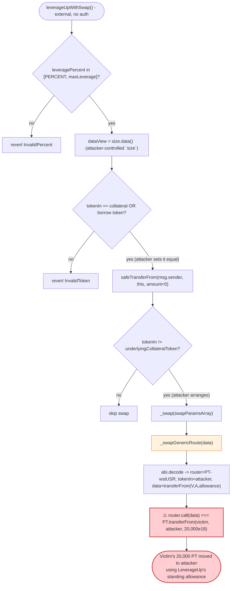
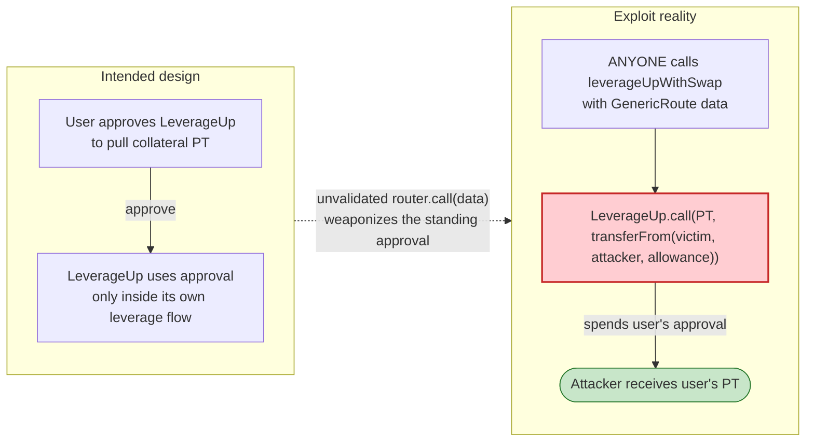

# Size Credit `LeverageUp` Exploit — Arbitrary External Call via `GenericRoute` Swap Drains User Approvals

> **Vulnerability classes:** vuln/dependency/unsafe-external-call · vuln/access-control/missing-auth

> **One-line summary:** Size Credit's `LeverageUp` zap contract forwards a fully attacker-controlled
> `(router, calldata)` pair into a raw `router.call(data)` with **zero validation**, so anyone could make the
> contract execute `transferFrom(victim, attacker, allowance)` against every token a user had approved to it.

> **Reproduction:** the PoC compiles & runs in an isolated Foundry project at
> [this project folder](.) (the umbrella DeFiHackLabs repo contains many unrelated PoCs that don't
> whole-compile, so this one was extracted). Full verbose trace:
> [output.txt](output.txt). Verified vulnerable source:
> [`src_liquidator_DexSwap.sol`](sources/LeverageUp_F4a21A/src_liquidator_DexSwap.sol) and
> [`src_zaps_LeverageUp.sol`](sources/LeverageUp_F4a21A/src_zaps_LeverageUp.sol).

---

## Key info

| | |
|---|---|
| **Loss** | ~$19.7k — **20,000 PT-wstUSR-25SEP2025** drained from one approving user |
| **Vulnerable contract** | `LeverageUp` (zap) — [`0xF4a21Ac7e51d17A0e1C8B59f7a98bb7A97806f14`](https://etherscan.io/address/0xf4a21ac7e51d17a0e1c8b59f7a98bb7a97806f14#code) |
| **Victim (approver)** | `0x83eCCb05386B2d10D05e1BaEa8aC89b5B7EA8290` (held 25,587 PT-wstUSR, had approved 20,000 to LeverageUp) |
| **Drained asset** | `PT-wstUSR-25SEP2025` — `0x23E60d1488525bf4685f53b3aa8E676c30321066` |
| **Attacker EOA** | `0xa7e9b982b0e19a399bc737ca5346ef0ef12046da` |
| **Attacker contract** | `0xa6dc1fc33c03513a762cdf2810f163b9b0fd3a71` |
| **Attack tx** | [`0xc7477d6a5c63b04d37a39038a28b4cbaa06beb167e390d55ad4a421dbe4067f8`](https://etherscan.io/tx/0xc7477d6a5c63b04d37a39038a28b4cbaa06beb167e390d55ad4a421dbe4067f8) |
| **Chain / block / date** | Ethereum mainnet / 23,145,764 / Aug 2025 |
| **Compiler** | Solidity v0.8.23, optimizer **200 runs** |
| **Bug class** | Arbitrary external call (unvalidated `address.call`) abusing the contract's standing token approvals |

---

## TL;DR

`LeverageUp` is a "one-click leverage" helper on top of the Size Credit lending market. To build a
leveraged position it has to **swap** tokens, and it supports several swap back-ends, one of which is a
catch-all `GenericRoute` method. That method
([`DexSwap.sol:212-223`](sources/LeverageUp_F4a21A/src_liquidator_DexSwap.sol#L212-L223)) does:

```solidity
function _swapGenericRoute(bytes memory data) internal {
    GenericRouteParams memory params = abi.decode(data, (GenericRouteParams)); // (router, tokenIn, data)
    IERC20(params.tokenIn).forceApprove(params.router, type(uint256).max);
    (bool success,) = params.router.call(params.data);   // ⚠️ arbitrary target, arbitrary calldata
    if (!success) revert PeripheryErrors.GENERIC_SWAP_ROUTE_FAILED();
}
```

Both `params.router` and `params.data` come **straight from the external caller** — there is no
allow-list of routers, no selector filtering, no check that `data` is a swap. So the contract can be made
to call **any address with any calldata, as itself**.

Why that is catastrophic: to do its job, `LeverageUp` ends up holding (and is *designed* to hold) ERC20
approvals from its users. The Size collateral approval is granted inside the function, but more importantly
many users had standing `approve(LeverageUp, …)` allowances on their collateral PT tokens. An attacker
simply picks `params.router = PT-wstUSR` and `params.data = transferFrom(victim, attacker, allowance)`. The
`LeverageUp` contract — being the approved spender — happily executes the transfer and the victim's tokens
land in the attacker's contract. **No flash loan, no price manipulation, no capital required.**

The PoC drains the one user with an outstanding approval at the fork block: **20,000 PT-wstUSR ≈ $19.7k**.

---

## Background — what Size Credit / `LeverageUp` does

[Size Credit](https://size.credit/) is a fixed-rate lending market. `LeverageUp`
([`src_zaps_LeverageUp.sol`](sources/LeverageUp_F4a21A/src_zaps_LeverageUp.sol)) is a *zap* / periphery
contract that lets a user open a leveraged position in a single transaction:

1. Pull the user's input token (`safeTransferFrom(msg.sender, this, amount)`).
2. If the input token is not the market's collateral token, **swap** it into the collateral token.
3. `deposit` the collateral into Size on the user's behalf.
4. Loop: `sellCreditMarket` to borrow, `withdraw` the borrowed token, swap it back to collateral, deposit
   again — repeating until the requested leverage is reached.

Because step 2 and the loop need a swap, `LeverageUp` inherits `DexSwap`
([`src_liquidator_DexSwap.sol`](sources/LeverageUp_F4a21A/src_liquidator_DexSwap.sol)), which dispatches on
a `SwapMethod` enum to one of seven back-ends:

```solidity
enum SwapMethod { OneInch, Unoswap, UniswapV2, UniswapV3, GenericRoute, BoringPtSeller, BuyPt }
```

`GenericRoute` (index 4) was meant as an escape hatch for arbitrary aggregator routes. Every other branch
decodes into a *typed* struct and calls a *fixed, immutable* router stored at construction
(`oneInchAggregator`, `unoswapRouter`, `uniswapV2Router`, `uniswapV3Router`). `GenericRoute` is the only
branch where the **router address itself** is taken from caller-supplied bytes.

---

## The vulnerable code

### 1. The arbitrary call — `_swapGenericRoute`

[`DexSwap.sol:212-223`](sources/LeverageUp_F4a21A/src_liquidator_DexSwap.sol#L212-L223)

```solidity
struct GenericRouteParams {
    address router;
    address tokenIn;
    bytes   data;
}

function _swapGenericRoute(bytes memory data) internal {
    GenericRouteParams memory params = abi.decode(data, (GenericRouteParams));

    // Approve router to spend collateral token
    IERC20(params.tokenIn).forceApprove(params.router, type(uint256).max);   // attacker-chosen tokenIn + router

    // Execute swap via low-level call
    (bool success,) = params.router.call(params.data);                       // ⚠️ THE BUG
    if (!success) {
        revert PeripheryErrors.GENERIC_SWAP_ROUTE_FAILED();
    }
}
```

There is **no validation** that:
- `params.router` is a known/whitelisted DEX,
- `params.data` is a swap (no selector check),
- the call does not touch the contract's own balances or its inbound approvals.

`forceApprove(params.tokenIn, params.router, max)` even *helps* the attacker by granting an extra max
allowance, but it is not even needed — the drain works through the raw `.call`.

### 2. How the call is reached — `leverageUpWithSwap`

[`LeverageUp.sol:49-130`](sources/LeverageUp_F4a21A/src_zaps_LeverageUp.sol#L49-L130)

```solidity
function leverageUpWithSwap(
    ISize size,                                   // attacker passes a contract it controls
    SellCreditMarketParams[] memory sellCreditMarketParamsArray,
    address tokenIn,
    uint256 amount,
    uint256 leveragePercent,
    uint256 borrowPercent,
    SwapParams[] memory swapParamsArray
) external {
    ...
    DataView memory dataView = size.data();       // ← read from the attacker's fake "size"
    if (tokenIn != address(dataView.underlyingCollateralToken)
        && tokenIn != address(dataView.underlyingBorrowToken)) {
        revert InvalidToken(tokenIn);
    }
    ...
    IERC20Metadata(tokenIn).safeTransferFrom(msg.sender, address(this), amount); // amount = 0 -> no-op
    if (tokenIn != address(dataView.underlyingCollateralToken)) {
        _swap(swapParamsArray);                    // ← reaches _swapGenericRoute with attacker bytes
    }
    ...
}
```

Note that `size` is **not validated** to be a real Size market — it is just an `ISize`-typed address the
attacker supplies. In the PoC the "size" is the attacker contract itself, returning hand-crafted
`riskConfig()`, `data()`, `oracle()`, `getPrice()` values designed only to pass the leverage/token checks
and reach the swap. Everything that gates the path to `_swap` is therefore attacker-controlled, so the
attacker can always satisfy `tokenIn != underlyingCollateralToken` and trigger the swap branch.

### 3. The approvals that make it lucrative

`leverageUpWithSwap` itself only pulls `amount` of `tokenIn` from `msg.sender`, but the contract is a
long-lived zap that users approve before use. At the fork block, victim
`0x83eCCb05…8290` had an outstanding `approve(LeverageUp, 20000e18)` on PT-wstUSR
(visible in the trace as `allowance(...) -> 2e22`). That standing allowance is exactly what the arbitrary
`transferFrom` consumes.

---

## Root cause — why it was possible

A low-level `.call(data)` where **both the target and the calldata are attacker-controlled** turns the
contract into a universal proxy that acts *with the contract's own identity and permissions*. Any privilege
the contract has — token allowances it holds, roles it was granted, balances it custodies — becomes
exercisable by anyone.

Concretely, three design decisions compose into a critical bug:

1. **Unrestricted target + calldata.** `_swapGenericRoute` passes caller bytes verbatim into
   `params.router.call(params.data)`. There is no router allow-list and no selector/argument validation.
   This alone is the vulnerability.
2. **Standing user approvals on the zap.** Because users `approve(LeverageUp, …)` their collateral, the
   contract is a *de facto* custodian of approvals. The arbitrary call can spend those approvals via
   `transferFrom(victim, attacker, allowance)` — the contract is the legitimate approved spender.
3. **The `size` market is not authenticated.** `leverageUpWithSwap` trusts whatever `ISize size` the caller
   passes for `data()`, `riskConfig()`, `oracle()`, etc., so the attacker trivially steers control flow into
   the swap branch and out the other side without doing any real lending.

The result: **value transfer with no preconditions** other than "some user has an open allowance on
`LeverageUp`." Loss size equals the sum of those outstanding allowances (here, one user, 20,000 PT-wstUSR).

> The `data[127] = 0x60` line in the PoC is not part of the bug — it is just a manual fix to the
> hand-rolled ABI encoding so the inner `transferFrom(...)` calldata lands in the `bytes data` field of
> `GenericRouteParams`. Production exploit calldata would be `abi.encode`d cleanly.

---

## Preconditions

- A victim has an **outstanding ERC20 approval** to the `LeverageUp` contract (any token, any amount). PT
  collateral approvals are the natural target. (The trace shows `allowance(victim, LeverageUp) = 20,000e18`.)
- `LeverageUp` exposes `leverageUpWithSwap` **permissionlessly** (it is `external`, no auth).
- The attacker can pass an `ISize size` it controls so the leverage/token checks pass and the
  `GenericRoute` swap branch is reached.

No flash loan, no price/oracle manipulation, and **no attacker capital** are required (`amount = 0`).

---

## Attack walkthrough (with on-chain numbers from the trace)

All figures are taken directly from [output.txt](output.txt) (the `leverageUpWithSwap` sub-trace,
lines 1590-1635). `address(this)` in the PoC is the attacker contract `0x7FA9385b…1496` ("SizeCredit" in
the trace), which doubles as the fake `size` market.

| # | Step | Call / value | Effect |
|---|------|--------------|--------|
| 0 | **Read victim state** | `balanceOf(victim) = 25,587.46 PT`; `allowance(victim, LeverageUp) = 20,000 PT` | Confirms the open approval. `amount = min(bal, allowance) = 20,000e18`. |
| 1 | **Call `leverageUpWithSwap`** | `size = attacker`, `tokenIn = attacker (== fake underlyingBorrowToken)`, `amount = 0`, `leveragePercent = 1e18`, `swapParams = {GenericRoute, craftedData}` | Enters the zap. |
| 2 | **Pass guards** | `size.riskConfig()` / `data()` / `oracle()` / `getPrice()` return attacker values; `tokenIn == underlyingBorrowToken` ✓ | `InvalidToken` / `InvalidPercent` checks pass. |
| 3 | **`forceApprove(size, max)` + `safeTransferFrom(msg.sender, this, 0)`** | attacker's own fake tokens; no-op | Trivial pre-steps. |
| 4 | **`_swap` → `_swapGenericRoute`** decodes `(router = PT-wstUSR, tokenIn = attacker, data = transferFrom(victim, attacker, 20,000e18))` | `forceApprove(attacker, PT, max)` then `PT.call(transferFrom(...))` | The arbitrary call fires. |
| 5 | **`PT.transferFrom(victim → attacker, 20,000e18)`** | `Transfer(victim → attacker, 2e22)`; victim approval to LeverageUp drops `20,000e18 → 0` | **20,000 PT-wstUSR stolen.** |
| 6 | **Zap "leverage loop"** runs on fake `size` | `balanceOf(size)=2`, `deposit(0)`, leverage `2e18 ≥ 1e18` → `break` | Loop is satisfied immediately on attacker's fake numbers; function returns cleanly. |

The drained 20,000 PT-wstUSR end up at the attacker contract (`balanceOf = 2e22` after the run).

### Profit accounting

| Direction | Amount (PT-wstUSR) | ≈ USD |
|---|---:|---:|
| Attacker capital in | 0 | $0 |
| Stolen from victim (full open allowance) | 20,000 | ~$19,700 |
| **Net profit** | **20,000** | **~$19.7k** |

PoC balance log:

```
Attacker Before exploit PT-wstUSR-25SEP2025 Balance: 0.000000000000000000
Attacker After  exploit PT-wstUSR-25SEP2025 Balance: 20000.000000000000000000
```

(The live on-chain loss is quoted at ~$19.7k in the PoC header; the PoC reproduces the exact 20,000-token
drain — i.e. the victim's entire outstanding allowance.)

---

## Diagrams

### Sequence of the attack

```mermaid
sequenceDiagram
    autonumber
    actor A as "Attacker (also fake `size`)"
    participant L as "LeverageUp (vulnerable zap)"
    participant PT as "PT-wstUSR token"
    participant V as "Victim (approver)"

    Note over V,L: Pre-state - Victim approved 20,000 PT to LeverageUp

    A->>L: leverageUpWithSwap(size=A, tokenIn=A, amount=0, swap={GenericRoute, craftedData})
    L->>A: size.data() / riskConfig() / oracle() / getPrice()
    Note over L: All guard checks pass (attacker controls `size`)
    L->>A: safeTransferFrom(A, L, 0)  (no-op)

    rect rgb(255,235,238)
    Note over L,PT: _swap -> _swapGenericRoute decodes (router=PT, data=transferFrom(V,A,20000e18))
    L->>PT: forceApprove(PT, max)  (extra, not needed)
    L->>PT: PT.call(transferFrom(V, A, 20,000e18))
    PT->>V: debit 20,000 PT (uses L's standing allowance)
    PT->>A: credit 20,000 PT
    Note over PT: Transfer(V -> A, 2e22); allowance(V, L): 20000e18 -> 0
    end

    L->>L: leverage loop satisfied on fake numbers -> break
    L-->>A: returns cleanly
    Note over A: +20,000 PT-wstUSR (~$19.7k), zero capital spent
```

### Control-flow / state evolution



### Why the call is theft: who holds what privilege



---

## Remediation

1. **Eliminate (or tightly constrain) the arbitrary call.** A periphery contract should never execute
   caller-supplied `(target, calldata)`. Either remove the `GenericRoute` method, or restrict it to:
   - an **allow-list of router addresses** (like the other branches already use immutables), and
   - a **selector allow-list** (only `swap`-class functions), and
   - explicitly forbid the contract's *inbound* approval tokens as `router`/target.
2. **Never let the contract hold standing user approvals.** Pull exactly the needed amount inside the call
   and reset allowances to 0 at the end. If a zap needs an approval, prefer single-use `permit` so no
   ambient allowance can be weaponized.
3. **Authenticate the `size` market.** Validate that `ISize size` is a genuine Size market deployed by the
   Size factory before reading `data()`/`riskConfig()`/`oracle()`. The current code trusts an
   attacker-supplied address for control-flow-critical values.
4. **Use `SafeERC20`/checked swaps, not raw `.call`.** Route every swap through a typed interface against a
   known router; verify `tokenIn`/`tokenOut` and `amountOutMin`. Raw `.call` to an arbitrary address has no
   place in a token-handling contract.
5. **Sweep guard.** After any external swap, assert the contract did not lose tokens it shouldn't have, and
   that no third-party approvals were consumed.

---

## How to reproduce

The PoC was extracted into a standalone Foundry project (the umbrella DeFiHackLabs repo has many unrelated
PoCs that fail to whole-compile under `forge test`).

```bash
_shared/run_poc.sh 2025-08-SizeCredit_exp -vvvvv
```

- RPC: an **Ethereum mainnet archive** endpoint is required (fork block `23,145,763`).
  `foundry.toml` uses the Infura archive endpoint, which serves historical state at that block.
- Result: `[PASS] testExploit()` with the attacker's PT-wstUSR balance going `0 → 20,000`.

Expected tail:

```
  Attacker Before exploit PT-wstUSR-25SEP2025 Balance: 0.000000000000000000
  Attacker After  exploit PT-wstUSR-25SEP2025 Balance: 20000.000000000000000000

Suite result: ok. 1 passed; 0 failed; 0 skipped
```

---

*Vulnerable source verified on Etherscan and downloaded under
[`sources/LeverageUp_F4a21A/`](sources/LeverageUp_F4a21A/). Reference:
[@SuplabsYi thread](https://x.com/SuplabsYi/status/1956306748073230785).*
