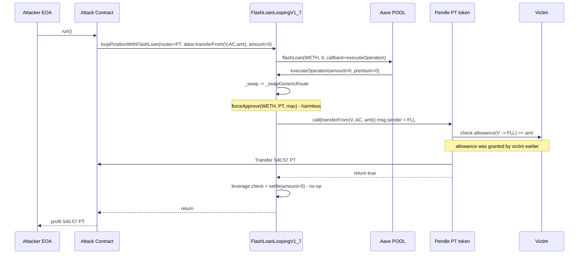
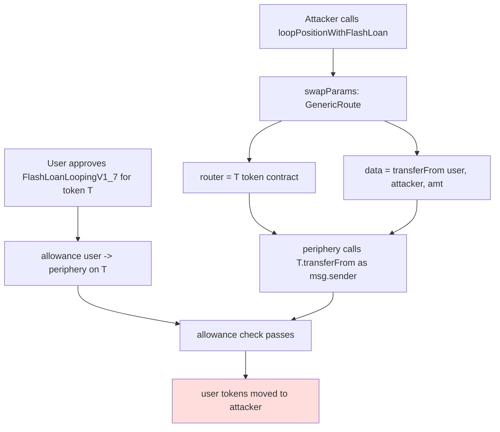

# Size Credit FlashLoanLoopingV1_7 Generic-Route Arbitrary Call — third-party token allowance theft via caller-controlled `router.call(data)`
> **Vulnerability classes:** vuln/dependency/unsafe-external-call · vuln/logic/missing-validation · vuln/access-control/missing-auth
> **Reproduction:** the PoC compiles & runs in an isolated Foundry project at [this project folder](.). Full verbose trace: [output.txt](output.txt). Verified source for the vulnerable contract `FlashLoanLoopingV1_7` and its `DexSwap` library is available in [sources/](sources/FlashLoanLoopingV1_7_4b356d/).
---
## Key info
| | |
|---|---|
| **Loss** | ~533 USD (540.576557 PT-wstUSR-25SEP2025 tokens stolen from one victim) [output.txt:1564-1565] |
| **Vulnerable contract** | `FlashLoanLoopingV1_7` — [`0x4b356Dc596dd508836bd9e8FE5aCad81F8Cf9019`](https://etherscan.io/address/0x4b356Dc596dd508836bd9e8FE5aCad81F8Cf9019) |
| **Attacker EOA** | [`0x326dc2FF9045AE79Ca3E395D584d3b56aF1F310e`](https://etherscan.io/address/0x326dc2FF9045AE79Ca3E395D584d3b56aF1F310e) |
| **Attack contract** | [`0x977E8f1C4e3a05BE213D62428AFC2891Aeb9F4e3`](https://etherscan.io/address/0x977E8f1C4e3a05BE213D62428AFC2891Aeb9F4e3) |
| **Attack tx** | [`0x63aaa5a9fc87ce419c8b1711effee34e2c726b3ee2c2d28f64b963408d6ea8d3`](https://etherscan.io/tx/0x63aaa5a9fc87ce419c8b1711effee34e2c726b3ee2c2d28f64b963408d6ea8d3) |
| **Chain / block / date** | Ethereum mainnet / 23,146,022 / 2025-08-19 |
| **Compiler** | Solidity `0.8.23` (from verified source) |
| **Bug class** | Public `loopPositionWithFlashLoan` passes attacker-controlled `router` + `data` straight into `_swapGenericRoute`, which does `router.call(data)` with `msg.sender = FlashLoanLoopingV1_7` — letting the periphery spend token allowances users had granted to it. |

## TL;DR

Size Credit's `FlashLoanLoopingV1_7` is an Ownable zap contract that lets a user flash-loan from Aave, swap the borrowed token into collateral, deposit, and borrow in one atomic operation. To convert the flash-loaned asset into collateral it embeds a generic swap engine (`DexSwap`) with a `SwapMethod.GenericRoute` path that is meant to invoke an arbitrary DEX router with arbitrary calldata.

The flaw is that `_swapGenericRoute` performs an unvalidated `(bool ok,) = router.call(data)` **with the periphery contract itself as `msg.sender`** [sources/.../src_liquidator_DexSwap.sol]. `router` and `data` are both fully attacker-controlled, and the function is reached through the public `loopPositionWithFlashLoan` entrypoint with no caller/allow-list check. Because many users had granted ERC-20 `approve` allowances to `FlashLoanLoopingV1_7` (it was a legitimate periphery contract that they interacted with), the attacker pointed the "router" at a Pendle PT token and set `data = transferFrom(victim, attacker, amount)`. Executed in the periphery's storage/identity context, that `transferFrom` pulls the victim's tokens straight to the attacker — exactly as if the periphery itself had decided to sweep them.

The PoC reproduces this offline against a committed anvil fork at block 23,146,022. The victim `0xaC47E…210d` held `540.576557` PT-wstUSR-25SEP2025 (`0x23E60d…21066`) and had granted the periphery an allowance of `1e21` [output.txt:1599-1603]. After the single `loopPositionWithFlashLoan` call the attacker contract holds `540.576557` PT and the victim holds `0`, confirmed by `assertEq` [output.txt:1700-1702]. Net profit ≈ 533 USD.

The entrypoint requires no privileged role, no collateral, and a flash-loan amount of `0`. The exploit is fully permissionless against any address that has an outstanding ERC-20 allowance to the periphery.

## Background — what Size Credit does

Size Credit is a credit-market protocol (fixed-rate, tenor-based borrowing and lending) deployed behind periphery "zap" contracts so that users can compose a leveraged position in one transaction. `FlashLoanLoopingV1_7` is one such zap:

1. **`loopPositionWithFlashLoan(LoopParamsV1_7)`** is `external` and calls `POOL.flashLoan(address(this), …)`, passing the user-supplied `LoopParamsV1_7` through [sources/.../src_zaps_FlashLoanLoopingV1_7.sol].
2. Aave calls back into **`executeOperation`**, which:
   - runs the user-supplied **`swapParamsArray`** through `DexSwap._swap(...)` to turn the flash-loaned borrow token into the collateral token,
   - deposits the collateral and borrows via an internal `multicall` against the Size market,
   - checks the achieved leverage against `targetLeveragePercent`, and
   - repays the flash loan plus premium.

The `swapParamsArray` is intentionally flexible — Size supports 1inch, Uniswap V2/V3, Unoswap, a Pendle "BoringPtSeller", a "BuyPt" path, and a catch-all `GenericRoute`. The `GenericRoute` path exists so that a user can plug in any DEX aggregator: the user provides a `router` address, a `tokenIn`, and raw `data` (typically the router's swap calldata). To make the swap work the periphery `forceApprove`s `tokenIn` to `router` for `type(uint256).max`, then low-level calls `router` with `data`.

The whole zap is `Ownable`, but `loopPositionWithFlashLoan` has **no access modifier** — it is designed to be callable by any user who wants to loop their own position. The intended trust model is "the caller is operating on their own behalf via the onBehalfOf-encoded params". The bug is that the swap layer is reachable by anyone and the generic route makes an arbitrary external call in the periphery's identity, which can spend the periphery's *own* allowances — and the periphery holds allowances granted to it by every user who ever approved it.

## The vulnerable code

### `DexSwap._swapGenericRoute` — arbitrary `router.call(data)` in the periphery's context

From the verified source ([sources/.../src_liquidator_DexSwap.sol](sources/FlashLoanLoopingV1_7_4b356d/src_liquidator_DexSwap.sol)):

```solidity
struct GenericRouteParams {
    address router;
    address tokenIn;
    bytes data;
}

function _swapGenericRoute(bytes memory data) internal {
    GenericRouteParams memory params = abi.decode(data, (GenericRouteParams));

    // Approve router to spend collateral token
    IERC20(params.tokenIn).forceApprove(params.router, type(uint256).max);

    // Execute swap via low-level call
    (bool success,) = params.router.call(params.data);
    if (!success) {
        revert PeripheryErrors.GENERIC_SWAP_ROUTE_FAILED();
    }
}
```

Two properties make this dangerous:

1. **`router` and `data` are caller-supplied and unchecked.** There is no allow-list of known DEX routers and no validation that `data` is actually a swap calldata.
2. **The call executes with `FlashLoanLoopingV1_7` as `msg.sender`.** When `router` is itself an ERC-20 token and `data` is `transferFrom(from, to, amount)`, the `transferFrom` is authorised by the periphery's allowance — i.e. any allowance any user has granted to `FlashLoanLoopingV1_7`. The `forceApprove` line is a red herring here: it approves `tokenIn` (WETH) to the "router" (the PT), which the PT ignores.

### `loopPositionWithFlashLoan` — public, unguarded entrypoint

```solidity
function loopPositionWithFlashLoan(LoopParamsV1_7 memory loopParams) external {
    bytes memory params = abi.encode(loopParams, msg.sender);
    ...
    POOL.flashLoan(address(this), assets, amounts, modes, address(this), params, 0);
}
```

No `onlyOwner`, no allow-list, no minimum flash-loan amount, no `onBehalfOf == msg.sender` enforcement at this boundary (it is decoded from `params` but only used later for the Size market multicall, which the attacker bypasses by pointing `sizeMarket` at their own contract). The swap array is executed unconditionally inside `executeOperation` before any of the Size-market logic runs.

### How the attacker neutralises the post-swap checks

`executeOperation` would normally revert if the leverage check or flash-loan repayment failed. The attacker sidesteps this by supplying:

- `flashLoanAmountBorrowToken = 0` (no Aave debt to repay, premium is 0),
- `sizeMarket = collateralToken = address(this)` (the attack contract impersonates the Size market),
- `targetLeveragePercent = 10_000` matched by a fake `balanceOf`/`debtTokenAmountToCollateralTokenAmount` that return constants so `currentLeveragePercent == 10_000`,
- empty `sellCreditMarketParamsArray` and a stub `deposit`/`multicall` so the internal loop is a no-op.

The full call is visible in the trace at [output.txt:1611].

## Root cause — why it was possible

1. **Unvalidated arbitrary external call.** `_swapGenericRoute` forwards attacker-controlled `(router, data)` straight into `router.call(data)` executing in the periphery's identity. No router allow-list, no `data`-selector validation, no "must be a real swap" check.
2. **The arbitrary call is reachable from a public, unguarded entrypoint.** `loopPositionWithFlashLoan` has no access modifier, so the generic-route path is callable by anyone — not just the owner or an authorised keeper.
3. **The periphery is the natural spender of user token allowances.** Because the zap legitimately needs to move user tokens (deposit collateral, repay, etc.), users had outstanding `approve(FlashLoanLoopingV1_7, …)` allowances on many tokens. The arbitrary call let an attacker convert those allowances into `transferFrom(victim, attacker, …)`.
4. **No `onBehalfOf == msg.sender` binding at the swap boundary.** The swap array runs before any per-user authorisation check, so the caller can make the periphery spend *another* user's allowance.
5. **Loop parameters are too permissive.** Allowing caller-controlled `sizeMarket`/`collateralToken`/`borrowToken`, a zero flash-loan amount, and a caller-supplied leverage target made it trivial to satisfy the post-swap assertions without ever interacting with a real Size market.

## Preconditions

- **Permissionless.** Anyone can call `loopPositionWithFlashLoan`; no privileged role, no collateral, no flash-loan amount required (`flashLoanAmountBorrowToken = 0` is valid).
- **Required victim state:** the target address must have an outstanding ERC-20 `allowance(target → FlashLoanLoopingV1_7)` ≥ the stolen amount, on a token that the attacker selects as `router`. In the PoC the victim had approved `1e21` PT-wstUSR to the periphery [output.txt:1599-1603].
- **No price/oracle/liquidity precondition.** The attack is a direct allowance pull; it does not touch any AMM or oracle.
- The attacker needs ~0 ETH for gas and a tiny amount of WETH (`10_000` wei) to satisfy `tokenIn = WETH` in the generic-route struct; no flash loan capital is required because the borrowed amount is zero.

## Attack walkthrough (with on-chain numbers from the trace)

| # | Action | On-chain value |
|---|--------|----------------|
| 0 | Fork mainnet at block 23,146,022; deploy attack contract, fund with 10,000 wei of ETH. | — |
| 1 | Verify victim state: `balanceOf(Victim) = 540.576557e18` PT, `allowance(Victim → periphery) = 1e21`. | [output.txt:1597-1603] |
| 2 | Wrap 10,000 wei ETH → WETH (used only as `tokenIn` so the periphery's `forceApprove(WETH, router=PT)` does nothing harmful). | `emit Deposit(... wad: 10000)` [output.txt:1607] |
| 3 | Build `SwapParams{ method: GenericRoute, data: encode(GenericRouteParams{ router: Pendle PT, tokenIn: WETH, data: transferFrom(Victim, attackContract, 540.576557e18) }) }`. | — |
| 4 | Call `loopPositionWithFlashLoan` with `flashLoanAmountBorrowToken = 0`, `swapParamsArray = [step 3]`, `sizeMarket = collateralToken = attackContract`, empty sell array, `targetLeveragePercent = 10_000`. | [output.txt:1611] |
| 5 | Periphery → Aave `POOL.flashLoan(... amount=0 ...)`. With a zero loan, Aave still invokes `executeOperation`. | [output.txt:1612-1613] |
| 6 | Inside `executeOperation`, `_swap` → `_swapGenericRoute`: periphery `forceApprove(WETH, PT, max)` (harmless), then `PT.call(transferFrom(Victim, attackContract, 540.576557e18))`. | `emit Approval(owner: Victim, spender: periphery, value: 4.594e20)` then `emit Transfer(from: Victim, to: attackContract, value: 5.405e20)` [output.txt:1641-1642] |
| 7 | Post-swap loop is a no-op against the attacker's stub `sizeMarket`; leverage check returns `10_000 == 10_000`; flash-loan settlement with `amount=0, premium=0` succeeds. | [output.txt:1667-1685] |
| 8 | After call: `balanceOf(attackContract) = 540.576557e18` PT, `balanceOf(Victim) = 0`. | [output.txt:1697-1702] |

**Profit / loss accounting**

- Victim: −540.576557 PT-wstUSR-25SEP2025 (~−533 USD at the time).
- Attacker: +540.576557 PT-wstUSR-25SEP2025 (~+533 USD), minus ~gas. Attacker before = `0.000000` PT, after = `540.576557` PT [output.txt:1564-1565].
- Size periphery: 0 net (it was only used as the authorised `msg.sender` for the `transferFrom`).
- The trace shows the attacker used `transferFrom` to pull the **full** victim allowance up to the victim's balance; the remaining allowance (`4.594e20`) is whatever was left after the `540.576e20` pull [output.txt:1641].

## Diagrams





## Remediation

1. **Remove or heavily gate `SwapMethod.GenericRoute`.** It is the root of the arbitrary call. Prefer the typed swap methods (OneInch, Uniswap V2/V3, Unoswap) whose `router` is an immutable, constructor-validated, well-known address. If a generic route is genuinely needed, restrict `router` to an explicit allow-list set by the owner.
2. **Validate the calldata selector.** Even with an allow-listed router, decode `data` and require it to be one of the known swap selectors for that router — never pass through opaque bytes.
3. **Bind `msg.sender` to the operator.** In `executeOperation`, enforce that the encoded `onBehalfOf` (or the swap's benefit) corresponds to `msg.sender` so a caller cannot make the periphery spend another user's allowance. Better: perform swaps only with tokens the periphery itself received from the flash loan, not with arbitrary `tokenIn`.
4. **Restrict `LoopParamsV1_7` inputs.** Validate `sizeMarket` against the factory's authorised markets, validate `borrowToken`/`collateralToken` against the market's actual tokens, and require `flashLoanAmountBorrowToken > 0` (or remove the ability to call the zap with a zero loan, which serves no legitimate purpose).
5. **Add an access modifier / pause.** Make `loopPositionWithFlashLoan` callable only via an authorised router or behind an allow-list while the generic route exists; this limits blast radius if a similar swap-path bug is reintroduced.
6. **Notify users to revoke allowances.** Post-fix, revoke all outstanding allowances to the periphery on affected tokens.

The Size team removed the generic-route capability from subsequent versions of the zap.

## How to reproduce

The PoC runs **fully offline** via the shared anvil harness, replaying the committed `anvil_state.json` (no RPC needed).

```bash
_shared/run_poc.sh 2025-08-SizeFlashLoanLooping_exp -vvvvv
```

- **Chain / fork block:** Ethereum mainnet, block **23,146,022**.
- **Expected result:** `Suite result: ok. 1 passed; 0 failed` with `[PASS] testExploit()` [output.txt:1562].
- **Balance lines to confirm:**
  - `Attacker Before exploit PT-wstUSR-25SEP2025 Balance: 0.000000000000000000` [output.txt:1564]
  - `Attacker After exploit PT-wstUSR-25SEP2025 Balance: 540.576557356106541792` [output.txt:1565]
  - Final `assertEq` confirms victim balance dropped by exactly `540.576557e18` [output.txt:1700-1702].

The test asserts both the attacker's profit and the victim's loss, so a `[PASS]` tail is a complete end-to-end reproduction of the theft.

*Reference: https://t.me/defimon_alerts/1669 (defimon alerts).*
