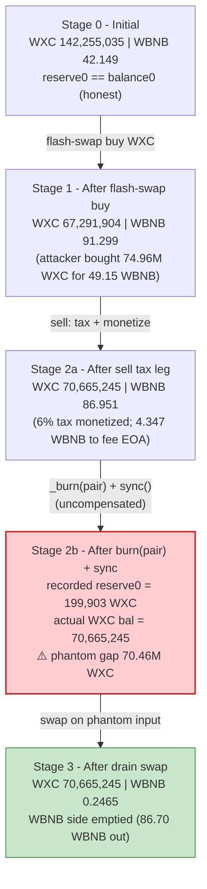
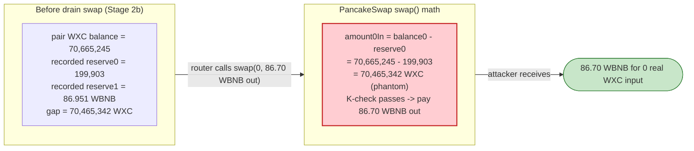

# WXC Token Exploit — Burn-From-Pool + `sync()` "Phantom Reserve" Drain

> **Vulnerability classes:** vuln/defi/slippage · vuln/logic/incorrect-state-transition · vuln/governance/flash-loan-attack

> One-line summary: a sell-tax token that **burns the seller's tokens straight out of the AMM pair and then calls `pair.sync()`** makes the pair under-record its own token reserve by exactly the deposited amount, so a follow-up `swap()` pays out almost the entire WBNB reserve for free.

> **Reproduction:** the PoC compiles & runs as a `[PASS]` in an isolated Foundry project at
> [this project folder](.) (the umbrella DeFiHackLabs repo does not whole-compile, so this PoC was extracted).
> Full verbose trace: [output.txt](output.txt). PoC: [test/WXC_Token_exp.sol](test/WXC_Token_exp.sol).
>
> **Source caveat:** the vulnerable WXC logic lives in an **unverified** implementation contract
> (`0x4c100D30…`, behind the `0x8087720…` ERC1967 proxy). BscScan has no verified source for it, so the
> code shown below is **reconstructed from the on-chain execution trace** (`Transfer`/`Sync`/`Swap`
> events + storage diffs), which is the most authoritative artifact available. Only the OpenZeppelin
> proxy wrapper is verified — see [sources/ERC1967Proxy_808772/](sources/ERC1967Proxy_808772/openzeppelin_contracts_proxy_ERC1967_ERC1967Proxy.sol).

---

## Key info

| | |
|---|---|
| **Loss** | **37.55 WBNB** net profit to the attacker (≈ the pool's honest WBNB liquidity, drained from the WXC/WBNB LPs) |
| **Vulnerable contract** | `WXC` token — proxy [`0x8087720EeeA59F9F04787065447D52150c09643E`](https://bscscan.com/address/0x8087720EeeA59F9F04787065447D52150c09643E#code) → impl `0x4c100D30d9C511B8BB9D1c951BBc1bE489A0172F` (**unverified**) |
| **Victim pool** | PancakeSwap WXC/WBNB pair — [`0xdA5C7eA4458Ee9c5484fA00F2B8c933393BAC965`](https://bscscan.com/address/0xdA5C7eA4458Ee9c5484fA00F2B8c933393BAC965) (`token0 = WXC`, `token1 = WBNB`) |
| **Attacker EOA** | [`0x476954c752a6ee04b68382c97f7560040eda7309`](https://bscscan.com/address/0x476954c752a6ee04b68382c97f7560040eda7309) |
| **Attack contract** | [`0x798465b25b68206370d99f541e11eea43288d297`](https://bscscan.com/address/0x798465b25b68206370d99f541e11eea43288d297) |
| **Attack tx** | [`0x1397bc7f0d284f8e2e30d0a9edd0db1f3eb0dd284c75e30d226b02bf09ad068f`](https://bscscan.com/tx/0x1397bc7f0d284f8e2e30d0a9edd0db1f3eb0dd284c75e30d226b02bf09ad068f) |
| **Flash-loan source** | Lista DAO **Moolah** market — proxy `0x8F73b65B4caAf64FBA2aF91cC5D4a2A1318E5D8C` (`onMoolahFlashLoan` callback) |
| **Chain / block / date** | BSC / fork at **57,177,437** (attack block 57,177,438) / **2025-08-11** |
| **Compiler** | impl built with Solidity v0.8.x (proxy: `v0.8.9`, optimizer 1 run) |
| **Bug class** | Broken AMM invariant via an **un-compensated, per-sell burn from the pair + `sync()`** (token-side reserve manipulation) |

---

## TL;DR

`WXC` is a sell-taxed, "deflationary" BEP-20. Its transfer logic treats a transfer **to the LP pair** as a
sell, and as part of that path it **burns the seller's net (post-tax) tokens directly out of the pair's
balance and then calls `pair.sync()`**. Because the burn destroys `token0` (WXC) but no `token1` (WBNB)
leaves, and `sync()` then forces the pair to adopt the *reduced* WXC balance as its new `reserve0`, the
pair ends up recording a `reserve0` that is **smaller than its actual WXC balance by exactly the deposited
sale amount**.

That gap is free money. The next PancakeSwap `swap()` computes the seller's "amount in" as
`balance0 - reserve0`. Thanks to the burn+sync, the pair believes a gigantic amount of WXC just arrived
(70.46 M WXC of phantom input) and pays out almost the **entire WBNB reserve** in return — even though the
attacker contributed nothing new; those WXC were burned, not added.

The attack, all inside one flash-loan callback:

1. **Flash-swap-buy** 74.96 M WXC out of the pair, paying it back 49.15 WBNB (flash-loaned from Moolah).
2. **Sell** the 74.96 M WXC back through the router. During the sell the token burns the net 70.46 M WXC
   out of the pair and `sync()`s → recorded `reserve0` collapses to 199,903 WXC while the pair still
   physically holds 70.66 M WXC.
3. The router's final `swap()` reads `balance0 − reserve0 ≈ 70.46 M WXC` as input and pays the attacker
   **86.70 WBNB** — almost the whole WBNB side.
4. Repay the 49.15 WBNB flash loan. **Net profit: 86.70 − 49.15 = 37.55 WBNB.**

---

## Background — what WXC does

`WXC` ([`0x8087720…`](https://bscscan.com/address/0x8087720EeeA59F9F04787065447D52150c09643E)) is an
upgradeable (ERC1967 proxy) BEP-20 with the usual "DeFi-flavored" extras bolted onto its `_transfer`:

- **Sell tax (6%)** — a transfer *into the LP pair* (a sell) is taxed 6%. In the trace, a sale of
  74,963,130 WXC incurs a tax of **4,497,787 WXC** (exactly 6.0000 %, see
  [output.txt:132](output.txt#L132), [output.txt:192](output.txt#L192)).
- **Tax monetization** — part of the collected tax is swapped to WBNB and forwarded to a project fee EOA
  `0x27391d90ff854BB8D0cc56c0A17f884F9a31c8ab` (3,373,340 WXC → 4.347 WBNB,
  [output.txt:136](output.txt#L136), [output.txt:149](output.txt#L149)), with a slice routed to a staking
  reward contract `0x17FE0D33…` via `addRewards()` ([output.txt:184](output.txt#L184)).
- **"Deflation" / burn-from-pool** — on the sell path, the net (post-tax) tokens that land in the pair are
  **burned out of the pair** and the pair is re-`sync()`ed
  ([output.txt:193-194](output.txt#L193-L194), [output.txt:197](output.txt#L197),
  [output.txt:210](output.txt#L210)). This is the bug.

On-chain parameters at the fork block (read via `cast … --block 57177437`):

| Parameter | Value |
|---|---|
| `name` / `symbol` / `decimals` | `WXC` / `WXC` / 18 |
| `totalSupply` | 304,349,985 WXC |
| Sell tax | **6 %** |
| Pair `token0` / `token1` | `WXC` / `WBNB` |
| Pool WXC reserve (`reserve0`) | **142,255,035 WXC** |
| Pool WBNB reserve (`reserve1`) | **42.149 WBNB** ← the honest liquidity |

The pair is the loser here: every WXC that gets burned out of it is WXC its LPs paid for, and the WBNB side
is what the attacker eventually walks off with.

---

## The vulnerable code

> Reconstructed from the trace (the impl is unverified). The logic the bytecode performs on a sell is
> equivalent to the following. The two load-bearing lines are `_burn(pair, …)` and `pair.sync()`.

```solidity
// WXC._transfer / _transferWithTax  (reconstructed)
function _transfer(address from, address to, uint256 amount) internal {
    if (to == pair) {                                  // this transfer is a SELL into the LP
        uint256 tax = amount * SELL_TAX / 10000;       // 6% -> 4,497,787 WXC of 74,963,130
        uint256 net = amount - tax;                    // 70,465,342 WXC

        _balances[from]  -= amount;
        _balances[pair]  += net;                       // net lands in the pair  (trace L214)
        _handleTax(tax);                               // swap part -> WBNB to fee EOA + rewards (L132-190)

        // ⚠️ "deflation": destroy the just-deposited WXC straight out of the pair
        _burn(pair, net);                              // Transfer(pair -> 0x0, 70,465,342)  (L193-194)
        IUniswapV2Pair(pair).sync();                   // forces reserve0 := pair.balanceOf(WXC)  (L197)
        emit SellTransaction(from, amount, tax);       // (L192)
        return;
    }
    // ... normal path ...
}
```

```solidity
// PancakeSwap V2 pair (victim side) — what sync() and swap() do
function sync() external {
    _update(IERC20(token0).balanceOf(address(this)),   // reserve0 := current WXC balance
            IERC20(token1).balanceOf(address(this)),    // reserve1 := current WBNB balance
            reserve0, reserve1);
}

function swap(uint amount0Out, uint amount1Out, address to, bytes data) external {
    // ...
    uint balance0 = IERC20(token0).balanceOf(address(this));
    uint amount0In = balance0 > reserve0 - amount0Out ? balance0 - (reserve0 - amount0Out) : 0;
    // ⚠️ if reserve0 was under-recorded by sync(), amount0In is inflated by the same gap
    require(amount0In > 0 || amount1In > 0, "INSUFFICIENT_INPUT_AMOUNT");
    // K-check uses (balance·1000 − amountIn·25); a huge phantom amount0In passes it while paying out WBNB
}
```

Only the OZ proxy is verified — it just `delegatecall`s into the unverified logic:
[`ERC1967Proxy.sol`](sources/ERC1967Proxy_808772/openzeppelin_contracts_proxy_ERC1967_ERC1967Proxy.sol).
The impl address is pinned in the EIP-1967 slot (`cast storage … 0x360894…` returns `0x4c100d30…`).

---

## Root cause — why it was possible

A Uniswap-V2 / PancakeSwap pair prices assets purely from its cached `reserve0/reserve1`. `sync()` exists so
the pair can "catch up" to its real balances, and `swap()` derives the trader's input from
`balance − reserve`. Both trust that token balances only move via mechanisms the pair can reason about
(`mint`/`burn` of LP, `swap`, plain transfers it later accounts for).

`WXC` violates that trust in the most damaging way possible **on every single sell**:

> It transfers the seller's net tokens *into* the pair, then **`_burn`s them back out of the pair** and calls
> `pair.sync()`. The pair dutifully records the now-smaller WXC balance as `reserve0`. The product `k`
> collapses, and — critically — the pair's recorded `reserve0` is now **smaller than its actual WXC balance
> by exactly the amount just deposited**. The very next `swap()` reads that phantom gap as "input" and pays
> out WBNB for it.

Concretely, four design decisions compose into a critical bug:

1. **Burning from the pool is theft from LPs.** Destroying `reserve0` (WXC) without removing any `reserve1`
   (WBNB) shifts the entire WBNB side toward whoever can next call `swap()`. There is no compensating LP
   redemption — `k` is simply deleted.
2. **The burn + `sync()` is on the *hot* sell path.** It is not a gated daily keeper job (as in some other
   deflationary tokens). It fires on **every** sell, so the attacker only has to make one sell large enough
   to crush the recorded reserve and then immediately `swap()` against the gap — all atomic.
3. **`sync()` makes the pair self-sabotage.** After the burn, `pair.balanceOf(WXC)` already dropped, but
   `sync()` then commits that drop into `reserve0`, guaranteeing the `balance − reserve` gap is mis-read as
   trader input rather than caught as an invariant violation.
4. **Flash-loanable.** No real capital is required: the WBNB to corner-buy WXC is flash-loaned from Moolah
   and fully repaid intra-transaction, so the attack is risk-free.

---

## Preconditions

- The token's sell path performs `_burn(pair, …)` + `pair.sync()` (intrinsic to WXC's design — always true).
- A live WXC/WBNB PancakeSwap pair with real WBNB liquidity (42.149 WBNB at the fork block).
- Working capital in WBNB to corner the pool's WXC — fully recovered intra-transaction, hence flash-loanable.
  The PoC borrows **49.15 WBNB** from Moolah ([test/WXC_Token_exp.sol:43](test/WXC_Token_exp.sol#L43)).
- The attacker must hold WXC at the moment of the drain swap so that its sell triggers the burn (the PoC
  buys it in step 1).

---

## Attack walkthrough (with on-chain numbers from the trace)

`token0 = WXC`, `token1 = WBNB`, so `reserve0 = WXC`, `reserve1 = WBNB`. All figures are taken directly from
the `Sync` / `Swap` / `Transfer` events and `getReserves()`/`balanceOf` returns in
[output.txt](output.txt).

| # | Step | Pair `reserve0` (WXC) | Pair `reserve1` (WBNB) | Actual pair WXC balance | Effect |
|---|------|----------------------:|-----------------------:|------------------------:|--------|
| 0 | **Initial** (L62) | 142,255,035 | 42.149 | 142,255,035 | Honest pool. |
| 1 | **Flash-swap buy** — `Cake_LP.swap(74.96M WXC out, 1 wei WBNB out, to=attacker)`, repaid 49.15 WBNB in `pancakeCall` (L52, L92, L111-112) | 67,291,904 | 91.299 | 67,291,904 | Attacker holds **74.96 M WXC**; pool pre-loaded with WBNB. |
| 2a | **Sell — tax leg.** Router pulls 74.96 M WXC; 6% tax (4.49M WXC) skimmed, 3.37M WXC swapped → **4.347 WBNB to fee EOA** (L132, L149, L168) | 70,665,245 | 86.951 | 70,665,245 | Tax monetized; pair WBNB drops to 86.951. |
| 2b | **Sell — burn leg.** Net 70.46 M WXC arrives in pair (L214), then **`_burn(pair, 70.46M WXC)`** (L193-194) + **`pair.sync()`** (L197, L210) | **199,903** | 86.951 | **70,665,245** | ⚠️ `reserve0` crushed to 199,903 while pair *still physically holds 70.66 M WXC* → **phantom gap = 70.46 M WXC**. |
| 3 | **Drain swap** — router `swap(0, 86.70 WBNB out, to=attacker)`; pair reads `balance0 − reserve0 = 70.46M WXC` as input (L236, L255-256) | 70,665,245 | **0.2465** | 70,665,245 | Pair pays out **86.70 WBNB** for the phantom input → WBNB side emptied. |
| 4 | **Repay flash loan** — `transferFrom(attacker → Moolah, 49.15 WBNB)` (L264) | — | — | — | Loan closed. |

**Why "phantom input drains the pool":** PancakeSwap's `swap()` derives the trader's contribution as
`amount0In = balance0 − (reserve0 − amount0Out)`. After WXC's burn+sync, `reserve0` (199,903) is far below
the pair's real WXC balance (70,665,245). With `amount0Out = 0`, the pair computes
`amount0In = 70,665,245 − 199,903 = 70,465,342 WXC` of "input" — exactly the burned amount — and the
constant-product K-check happily lets it pull out **86.70 WBNB** (essentially the whole WBNB reserve). The
attacker supplied no new WXC for this; the input is purely the under-recorded reserve created by `sync()`.

### Profit accounting (WBNB)

| Direction | Amount (WBNB) | Source |
|---|---:|---|
| Borrowed (flash loan from Moolah) | 49.150000 | [output.txt:37](output.txt#L37) |
| Paid to pair in step-1 flash-swap | 49.150000 | [output.txt:92](output.txt#L92) |
| **Received — drain swap (step 3)** | **86.704716** | [output.txt:256](output.txt#L256) |
| Repaid flash loan (step 4) | 49.150000 | [output.txt:264](output.txt#L264) |
| **Net profit** | **+37.554716** | [output.txt:7](output.txt#L7) |

Measured directly by the harness: WBNB before `0`, WBNB after `37.554715963191219441`
([output.txt:6-7](output.txt#L6-L7)). The drained 37.55 WBNB is the honest LPs' liquidity, plus the fee EOA
separately pocketed 4.347 WBNB of "tax" that was itself extracted from the same pool.

---

## Diagrams

### Sequence of the attack

```mermaid
sequenceDiagram
    autonumber
    actor A as "Attacker (WXC contract)"
    participant M as "Moolah (flash loan)"
    participant R as "PancakeRouter"
    participant P as "WXC/WBNB Pair"
    participant T as "WXC Token"

    Note over P: "Initial reserves<br/>142,255,035 WXC / 42.149 WBNB"

    A->>M: "flashLoan(WBNB, 49.15)"
    M-->>A: "49.15 WBNB + onMoolahFlashLoan()"

    rect rgb(255,243,224)
    Note over A,T: "Step 1 — flash-swap-buy WXC, corner the pool"
    A->>P: "swap(74.96M WXC out, 1 wei, to=A, data!=0)"
    P-->>A: "74.96M WXC"
    P->>A: "pancakeCall(...)"
    A->>P: "transfer 49.15 WBNB (repay flash-swap)"
    Note over P: "67,291,904 WXC / 91.299 WBNB"
    end

    rect rgb(255,235,238)
    Note over A,T: "Step 2 — sell WXC; token burns pool + sync"
    A->>R: "swapExactTokensForTokensSupportingFee(74.96M WXC -> WBNB)"
    R->>T: "transferFrom(A -> pair, 74.96M)"
    T->>T: "6% tax (4.49M); swap part -> 4.347 WBNB to fee EOA"
    T->>P: "_burn(pair, 70.46M WXC)"
    T->>P: "sync()"
    Note over P: "reserve0 = 199,903 WXC (recorded)<br/>actual WXC bal = 70,665,245 ⚠️ phantom gap"
    end

    rect rgb(243,229,245)
    Note over A,T: "Step 3 — drain WBNB on the phantom input"
    R->>P: "swap(0, 86.70 WBNB out, to=A)"
    Note over P: "amount0In = balance0 - reserve0 = 70.46M (phantom)"
    P-->>A: "86.70 WBNB"
    Note over P: "70,665,245 WXC / 0.2465 WBNB (drained)"
    end

    A->>M: "repay 49.15 WBNB"
    Note over A: "Net +37.55 WBNB"
```

### Pool state evolution



### The flaw: balance vs recorded reserve after burn+sync



---

## Why each magic number

- **`flashAmount = 49.15 WBNB`** — sized so the step-1 flash-swap buys ~74.96 M WXC out of the pool (about
  half the WXC reserve), leaving the pool holding enough WBNB that a single subsequent drain swap is worth
  far more than the loan. Borrowed from Moolah and repaid in full at the end
  ([test/WXC_Token_exp.sol:22](test/WXC_Token_exp.sol#L22), [:43](test/WXC_Token_exp.sol#L43)).
- **`amt0 = 74,963,130 WXC`, `amt1 = 1` in `Cake_LP.swap(...)`** — the flash-swap output. The non-empty
  `data` blob triggers `pancakeCall`, where the attacker pays the 49.15 WBNB back into the pair
  ([test/WXC_Token_exp.sol:52](test/WXC_Token_exp.sol#L52), [:67-69](test/WXC_Token_exp.sol#L67-L69)).
- **`amtIn = 74,963,130 WXC` sold via the router** — selling the full bought amount triggers the token's
  burn-from-pool + sync, which crushes `reserve0` and creates the phantom gap the next swap monetizes
  ([test/WXC_Token_exp.sol:58-64](test/WXC_Token_exp.sol#L58-L64)).

---

## Remediation

1. **Never burn from the liquidity pool.** A burn must only destroy tokens the protocol *owns* (its own
   balance / a treasury). Removing the `_burn(pair, …)` + `pair.sync()` from the sell path eliminates the
   bug entirely. If "deflation reaching LPs" is a product goal, implement it via genuine LP redemption (the
   pair's own `burn()` so *both* reserves move together and `k` is preserved), not a side-channel reserve
   deletion.
2. **Never call `sync()` after mutating a pair's balance you control.** `sync()` after `_burn(pair, …)` is
   the exact step that converts the burn into an exploitable `balance − reserve` gap. A token must not be
   able to dictate an AMM pair's reserve cache.
3. **Do not put reserve-mutating side effects on the hot transfer path.** Tax/deflation logic that touches
   the pair turns every ordinary sell into a potential invariant break and makes the whole thing atomic and
   flash-loanable.
4. **If a token must reduce supply in the pool, route value symmetrically.** Any operation moving a pool
   reserve should move *both* sides proportionally, or revert. A one-sided reserve deletion is always theft
   from LPs.
5. **Audit token/AMM coupling.** Fee-on-transfer + burn-on-transfer tokens that interact with a `sync()`able
   pair are a recurring critical pattern (cf. BYToken); treat any `transfer`-path call to `pair.sync()` or
   `_burn(pair, …)` as a red flag.

---

## How to reproduce

The PoC was extracted into a standalone Foundry project (the umbrella DeFiHackLabs repo has several
unrelated PoCs that fail to compile under a whole-project `forge build`):

```bash
_shared/run_poc.sh 2025-08-WXC_Token_exp -vvvvv
```

- RPC: a **BSC archive** endpoint is required (fork block 57,177,437 is from Aug 2025). `foundry.toml`
  uses `https://bsc-mainnet.public.blastapi.io`, which serves historical state at that block. Several other
  public BSC RPCs were tried and failed: onFinality (HTTP 429 rate-limit), `bsc.drpc.org`
  (`historical state … is not available`), `1rpc.io/bnb` (non-archive / pruned).
- Result: `[PASS] testExploit()` with `Profit WBNB: 37.55`.

Expected tail:

```
Ran 1 test for test/WXC_Token_exp.sol:WXC
[PASS] testExploit() (gas: 442011)
  Attacker Before exploit WBNB Balance: 0.000000000000000000
  Attacker After exploit WBNB Balance: 37.554715963191219441

Suite result: ok. 1 passed; 0 failed; 0 skipped; finished in 14.20s
```

---

*Reference: TenArmor post-mortem — https://x.com/TenArmorAlert/status/1954774967481962832 (WXC, BSC, ~37.5 WBNB).*
