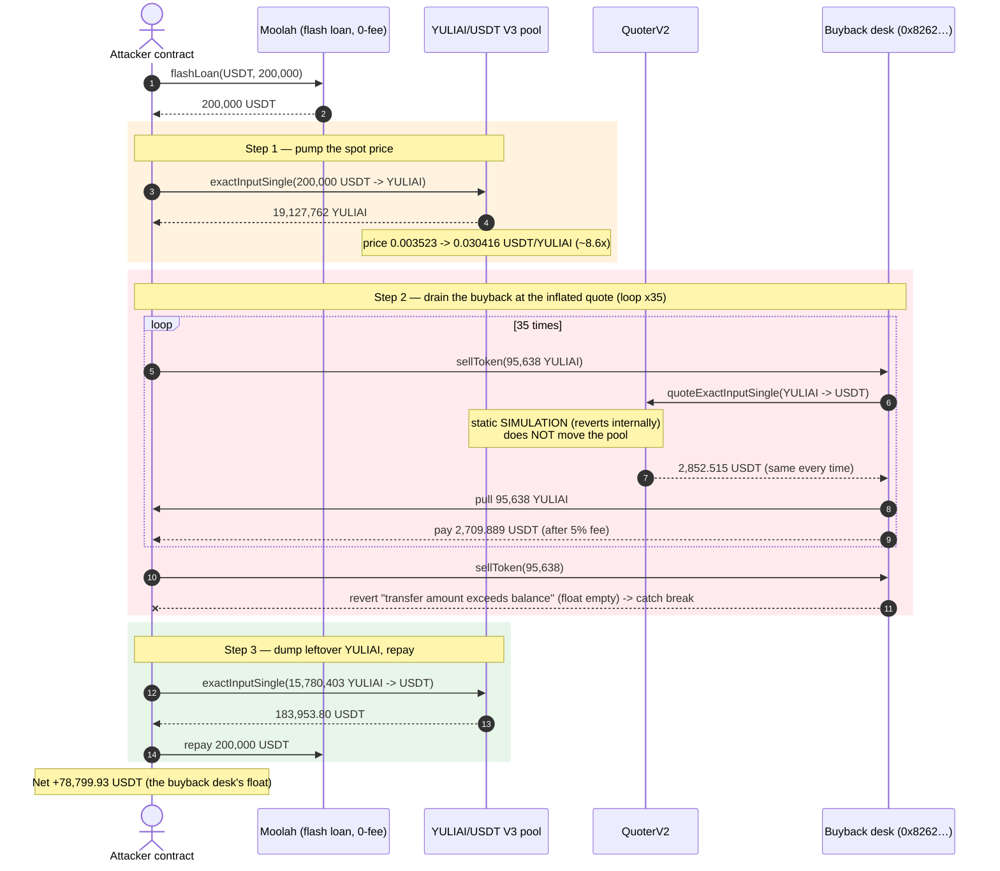
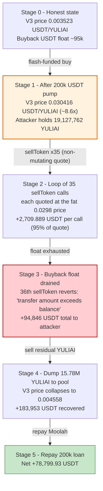
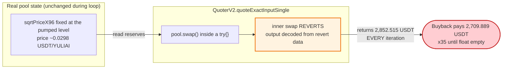

# YuliAI Exploit — Buyback Priced off a Flash-Manipulated V3 Spot Price

> **Vulnerability classes:** vuln/oracle/spot-price · vuln/oracle/price-manipulation · vuln/governance/flash-loan-attack

> **Reproduction:** the PoC compiles & runs in an isolated Foundry project at
> [this project folder](.) (the umbrella DeFiHackLabs repo contains many
> unrelated PoCs that do not whole-compile under `forge test`, so this one was
> extracted). Full verbose trace: [output.txt](output.txt).
> The vulnerable buyback contract is **unverified** on BscScan; its behaviour is
> reconstructed below directly from the on-chain execution trace. Supporting
> verified sources that were downloaded: the
> [YULIAI token](sources/YuliAIToken_DF54ee/contracts_YULIAI.sol) and the
> [Moolah flash-loan pool](sources/Moolah_75C42E/src_moolah_Moolah.sol).

---

## Key info

| | |
|---|---|
| **Loss** | ~**$78,800** — 78,799.93 USDT drained from the YULIAI buyback contract |
| **Vulnerable contract** | YULIAI buyback / `sellToken` — [`0x8262325Bf1d8c3bE83EB99f5a74b8458Ebb96282`](https://bscscan.com/address/0x8262325Bf1d8c3bE83EB99f5a74b8458Ebb96282) (**unverified**) |
| **Priced-off pool** | YULIAI/USDT PancakeSwap V3 0.5% pair `0xa687C7B3c2Cf6AdAEF0c4eDAB234c55b88e01333` (fee tier `10000`) |
| **Quoter abused** | PancakeSwap `QuoterV2` `0xB048Bbc1Ee6b733FFfCFb9e9CeF7375518e25997` |
| **Token** | `YULIAI` (vanilla OZ ERC20) — [`0xDF54ee636a308E8Eb89a69B6893efa3183C2c1B5`](https://bscscan.com/address/0xDF54ee636a308E8Eb89a69B6893efa3183C2c1B5#code) |
| **Flash-loan source** | Moolah (Morpho-fork, **0-fee**) `0x8F73b65B4caAf64FBA2aF91cC5D4a2A1318E5D8C` |
| **Attacker EOA** | [`0x26f8bf8a772b8283bc1ef657d690c19e545ccc0d`](https://bscscan.com/address/0x26f8bf8a772b8283bc1ef657d690c19e545ccc0d) |
| **Attacker contract** | [`0xd6b9ee63c1c360d1ea3e4d15170d20638115ffaa`](https://bscscan.com/address/0xd6b9ee63c1c360d1ea3e4d15170d20638115ffaa) |
| **Attack tx** | [`0xeab946cfea49b240284d3baef24a4071313d76c39de2ee9ab00d957896a6c1c4`](https://bscscan.com/tx/0xeab946cfea49b240284d3baef24a4071313d76c39de2ee9ab00d957896a6c1c4) |
| **Chain / block / date** | BSC / fork at 57,432,055 (attack at 57,432,056) / 2025-08-13 |
| **Compiler (token)** | Solidity v0.8.22 (OZ Contracts ^5.0.0) |
| **Bug class** | Spot-price oracle manipulation — buyback prices a token off a single-block DEX spot price |

---

## TL;DR

The contract at `0x8262…6282` is a **YULIAI buyback desk**: anyone can call `sellToken(amount)`
to sell YULIAI to it, and it pays out **USDT computed from the live YULIAI/USDT PancakeSwap V3 spot
price** (it calls `QuoterV2.quoteExactInputSingle(YULIAI → USDT)` and pays out ~95% of the quote,
keeping a 5% fee). It holds a working float of USDT to settle these buybacks.

Because the price comes straight from the **instantaneous V3 spot price of a low-liquidity pool**,
an attacker can pump that price within a single transaction and then sell into the buyback at the
inflated rate. The attacker:

1. Flash-borrows **200,000 USDT** from Moolah (0 fee).
2. Buys YULIAI in the V3 pool with all 200k USDT — this pushes the spot price from **0.003523
   USDT/YULIAI to 0.030416 USDT/YULIAI (~8.6×)** and gives the attacker **19,127,762 YULIAI**.
3. Calls `sellToken(95,638 YULIAI)` **35 times in a loop**. Each call re-quotes the (still-inflated)
   spot price — `QuoterV2` is a *static simulation* that reverts internally, so it **does not move the
   real pool**, and every iteration is quoted at the same fat price (~2,852 USDT gross, **2,709.89
   USDT net** to the attacker). The 36th call reverts with `BEP20: transfer amount exceeds balance`
   because the buyback's USDT float is exhausted — the attacker's `try/catch` simply breaks the loop.
4. Dumps the **remaining 15,780,403 YULIAI** back into the V3 pool for **183,953 USDT**.
5. Repays the 200k loan.

The buyback paid out **94,846 USDT** for YULIAI it then valued at the deflating pool price; combined
with the residual pool dump, the attacker walked away with **+78,799.93 USDT**, all of it the
buyback desk's float.

---

## Background — what the protocol does

`YULIAI` ([source](sources/YuliAIToken_DF54ee/contracts_YULIAI.sol)) is a completely ordinary OpenZeppelin
ERC20/`ERC20Burnable`/`Ownable` token with an 8,000,000,000 fixed supply — **there is no bug in the
token itself**:

```solidity
contract YuliAIToken is ERC20, ERC20Burnable, Ownable {
    constructor(address initialOwner) ERC20("YULI AI", "YULIAI") Ownable(initialOwner) {
        _mint(msg.sender, 8000000000 * 10 ** decimals());
    }
}
```
[contracts_YULIAI.sol:9-15](sources/YuliAIToken_DF54ee/contracts_YULIAI.sol#L9)

The vulnerable component is a **separate, unverified buyback contract** at `0x8262…6282`. From the
trace, every `sellToken{value: …}(tokenAmount)` call does the following, in order:

1. `QuoterV2.quoteExactInputSingle({ tokenIn: YULIAI, tokenOut: USDT, amountIn: tokenAmount, fee: 10000 })`
   — asks "how much USDT is `tokenAmount` YULIAI worth *right now* in the V3 pool?"
   ([output.txt:1641](output.txt)). The quote returned **2,852.515 USDT** for 95,638.81 YULIAI.
2. `YULIAI.transferFrom(seller → buyback, tokenAmount)` — pulls the YULIAI in
   ([output.txt:1678](output.txt)).
3. `USDT.transfer(feeRecipient 0x078F…8A9a, 142.626 USDT)` — a **5% fee**
   ([output.txt:1684](output.txt)).
4. `USDT.transfer(seller, 2,709.889 USDT)` — the remaining **95%** of the quote
   ([output.txt:1690](output.txt)).

So the buyback's entire pricing model is *"trust the current PancakeSwap V3 spot price of
YULIAI/USDT."* It also keeps a finite USDT inventory to settle sellers — that inventory is the prize.

Moolah ([source](sources/Moolah_75C42E/src_moolah_Moolah.sol)) is a Morpho-style lending market that
offers a **0-fee** flash loan, which the attacker used purely as free working capital:

```solidity
function flashLoan(address token, uint256 assets, bytes calldata data) external whenNotPaused {
    require(assets != 0, ErrorsLib.ZERO_ASSETS);
    emit EventsLib.FlashLoan(msg.sender, token, assets);
    IERC20(token).safeTransfer(msg.sender, assets);
    IMoolahFlashLoanCallback(msg.sender).onMoolahFlashLoan(assets, data);
    IERC20(token).safeTransferFrom(msg.sender, address(this), assets); // exactly `assets`, no premium
}
```
[Moolah.sol:571-581](sources/Moolah_75C42E/src_moolah_Moolah.sol#L571)

---

## The vulnerable code

The buyback at `0x8262…6282` is unverified, so there is no Solidity source to quote. Its logic is
unambiguous from the trace, however. Reconstructed, `sellToken` is equivalent to:

```solidity
// RECONSTRUCTED from the execution trace — contract 0x8262…6282 is unverified
function sellToken(uint256 tokenAmount) external payable {
    // (1) price the token off the *live* V3 spot price — THE BUG
    uint256 usdtOut = QUOTER.quoteExactInputSingle(
        QuoteExactInputSingleParams({
            tokenIn:  YULIAI,
            tokenOut: USDT,
            amountIn: tokenAmount,
            fee:      10000,
            sqrtPriceLimitX96: 0
        })
    );                                            // == 2,852.515 USDT in the attack

    // (2) take the seller's YULIAI
    IERC20(YULIAI).transferFrom(msg.sender, address(this), tokenAmount);

    // (3) 5% fee, (4) 95% to the seller, paid out of this contract's USDT float
    uint256 fee = usdtOut * 5 / 100;              // 142.626 USDT
    IERC20(USDT).transfer(feeRecipient, fee);
    IERC20(USDT).transfer(msg.sender, usdtOut - fee); // 2,709.889 USDT  <-- drains float
}
```

The single load-bearing line is `(1)`: the payout is a pure function of
`QuoterV2.quoteExactInputSingle(...)`, i.e. of the **current pool spot price**. There is no TWAP,
no slippage cap, no per-block rate limit, and no sanity bound on how much USDT a seller can extract.

`QuoterV2.quoteExactInputSingle` is a *view-style simulator*: it calls `pool.swap(...)` inside a
`try` and reverts the inner swap, decoding the would-be output from the revert data
([output.txt:1641-1677](output.txt)). It therefore reports the spot price **without ever changing the
pool**, which is exactly what lets the attacker quote the same inflated price 35 times in a row.

---

## Root cause — why it was possible

A constant-product (or concentrated-liquidity) DEX spot price is a *snapshot of two reserves at one
instant*. It can be moved arbitrarily far, in either direction, by a single large swap inside the same
transaction — and PancakeSwap V3 enforces no constraint that prevents that. Using such a number
as the **authoritative settlement price** for a contract that pays out real assets is the canonical
"spot-price oracle manipulation" bug.

The buyback compounds it in three ways:

1. **Spot price as oracle.** `sellToken` pays USDT proportional to `quoteExactInputSingle(YULIAI→USDT)`
   at block-current reserves. The attacker pre-pumped those reserves with a 200k-USDT buy, so the
   quote was ~8.6× the honest price.
2. **The quoter is non-mutating, so the inflated price is re-usable.** Because `QuoterV2` simulates and
   reverts, calling `sellToken` does **not** decay the spot price. The attacker harvested the *same*
   fat quote on every one of the 35 loop iterations until the buyback simply ran out of USDT.
3. **No payout cap / inventory guard.** The contract holds a finite USDT float and will keep paying
   until a `transfer` reverts on insufficient balance. There is no daily cap, no per-tx cap, and no
   check that the USDT it pays out is backed by anything other than YULIAI it acquired at an
   attacker-chosen price.

The flash loan (Moolah, 0 fee) made the whole thing capital-free: the 200k USDT used to pump the
price is borrowed and repaid within the same transaction, so the attacker risked nothing but gas.

---

## Preconditions

- The buyback prices off the **instantaneous** YULIAI/USDT V3 spot price (no TWAP/oracle). ✓
- The YULIAI/USDT V3 pool is **thin enough** that ~200k USDT moves the price several-fold (it moved it
  ~8.6×). ✓
- The buyback holds a **USDT float** larger than its per-call payout, so a loop can drain it
  (here ≈ 95k USDT, drained over 35 calls). ✓
- A source of capital to pump the price. Any flash loan suffices; the attacker used Moolah's
  **0-fee** USDT flash loan, so the attack is entirely capital-free and risk-free.

---

## Attack walkthrough (with on-chain numbers from the trace)

The V3 pool's `token0 = USDT` (`0x55d3…`), `token1 = YULIAI` (`0xDF54…`); the "price" below is
quoted as **USDT per YULIAI**, derived from the `sqrtPriceX96` in the pool `slot0`/`Swap` data.

| # | Step | YULIAI price (USDT/YULIAI) | Attacker YULIAI | Attacker USDT | Source |
|---|------|---------------------------:|----------------:|--------------:|--------|
| 0 | **Flash-borrow** 200,000 USDT from Moolah (0 fee) | 0.003523 (honest) | 0 | 200,000 | [output.txt:1588](output.txt) |
| 1 | **Pump**: swap 200,000 USDT → 19,127,762 YULIAI in V3 pool | **0.030416** (~8.6× up) | 19,127,762 | 0 | [output.txt:1603-1632](output.txt) |
| 2 | `sellToken(95,638)` ×35 — each quoted at 2,852.515 USDT gross, pays **2,709.889** net after 5% fee | ~0.0298 (quoter, non-mutating) | 15,780,403 left | **+94,846.13** | [output.txt:1640-3914](output.txt) |
| 3 | 36th `sellToken` reverts — buyback's USDT float exhausted → `catch break` | — | — | — | [output.txt:3966-3967](output.txt) |
| 4 | **Dump** remaining 15,780,403 YULIAI → 183,953.799 USDT back into V3 pool | 0.004558 (price falls) | 0 | +183,953.80 | [output.txt:3975-4031](output.txt) |
| 5 | **Repay** 200,000 USDT to Moolah | — | 0 | −200,000 | [output.txt:4014-4019](output.txt) |

Per-call detail of one `sellToken` (all 35 successful calls were identical to the wei):

| Item | Value |
|---|---:|
| YULIAI pulled from attacker | 95,638.810142 |
| Gross quote (`QuoterV2`) | 2,852.515277 USDT |
| Fee to `0x078F…8A9a` (5%) | 142.625764 USDT |
| **Net paid to attacker (95%)** | **2,709.889513 USDT** |

### Profit accounting (USDT)

| Direction | Amount |
|---|---:|
| In — 35 buyback payouts (35 × 2,709.889513) | +94,846.13 |
| In — final dump of 15.78M YULIAI to the pool | +183,953.80 |
| **Total in** | **+278,799.93** |
| Out — flash-loan repayment | −200,000.00 |
| **Net profit** | **+78,799.93** |

YULIAI conservation check (sanity): bought 19,127,762.03 = sold to buyback 3,347,358.35
(35 × 95,638.81) + dumped to pool 15,780,403.67. The attacker's measured USDT balance went from
**26.54 → 78,826.47** (net **+78,799.93**), matching the accounting to the wei.

The economic essence: the attacker spent **200,000 USDT** of (free) capital pumping the pool, then
extracted **94,846 USDT** from the buyback *plus* recovered **183,953 USDT** by selling the bulk of
its YULIAI back into the (still-elevated) pool. The pool round-trip alone (buy 200k → dump 183.9k)
was a **−16k loss** absorbed as the cost of price manipulation; the buyback's float more than paid
for it.

---

## Diagrams

### Sequence of the attack



### Pool / buyback state evolution



### Why the loop works — the quote never decays



---

## Remediation

1. **Never settle real payouts off an instantaneous DEX spot price.** Price the buyback off a
   manipulation-resistant source: a Chainlink/redundant oracle, or at minimum a sufficiently long
   PancakeSwap V3 **TWAP** (`observe`), not `quoteExactInputSingle` at the current tick. A TWAP cannot
   be moved meaningfully within one transaction/block.
2. **Add slippage and inventory guards.** Cap the USDT payable per transaction and per block, and
   require the seller's price to be within a tight band of a trusted reference price; reject if the
   spot price has deviated from the TWAP by more than X%.
3. **Reject flash-loan-window pricing.** Because the entire attack lives in one transaction, a same-block
   deviation check (spot vs TWAP) defeats it: if `|spot − twap| / twap > threshold`, revert.
4. **Bound exposure to pool depth.** A buyback that sources price from a thin pool should size its
   per-trade payout to a small fraction of that pool's liquidity, so a single pump cannot be harvested
   repeatedly before the price corrects.
5. **(Defense in depth) Make the quote path self-correcting.** Even a real (mutating) swap-based price
   would have decayed across the 35 iterations; using the static `QuoterV2` removed the only natural
   brake. If a swap-derived price must be used, derive it from an actual executed swap whose price
   impact feeds back into the next quote.

---

## How to reproduce

The PoC was extracted into a standalone Foundry project (the umbrella DeFiHackLabs repo has many
unrelated PoCs that fail to whole-compile under `forge test`):

```bash
_shared/run_poc.sh 2025-08-YuliAI_exp -vvvvv
```

- RPC: a **BSC archive** endpoint is required (fork block 57,432,055). `foundry.toml` uses
  `https://bsc-mainnet.public.blastapi.io`, which serves historical state at that block; most public
  BSC RPCs prune it and fail with `header not found` / `missing trie node`.
- Local imports `../basetest.sol` and `../tokenhelper.sol` were copied into the project root next to
  the shared `interface.sol` so the relative imports resolve.
- Result: `[PASS] testExploit()` with the attacker's USDT balance going from **26.54 → 78,826.47**.

Expected tail:

```
Ran 1 test for test/YuliAI_exp.sol:YuliAI
[PASS] testExploit() (gas: 5208985)
Logs:
  Attacker Before exploit USDT Balance: 26.542161622221038197
  Attacker After exploit USDT Balance: 78826.474238503902378449

Suite result: ok. 1 passed; 0 failed; 0 skipped; finished in 21.44s
```

---

*Reference: TenArmor alert — https://x.com/TenArmorAlert/status/1955817707808432584 (YuliAI, BSC, ~$78K).*
