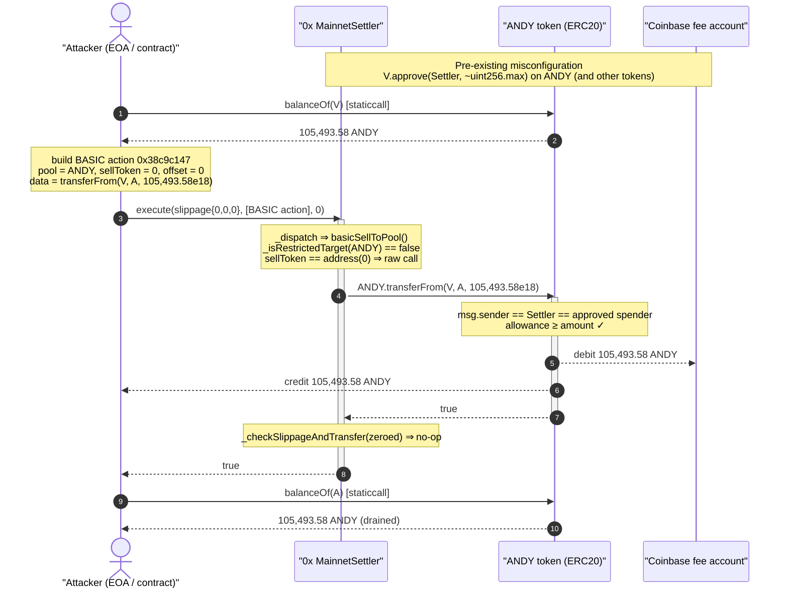
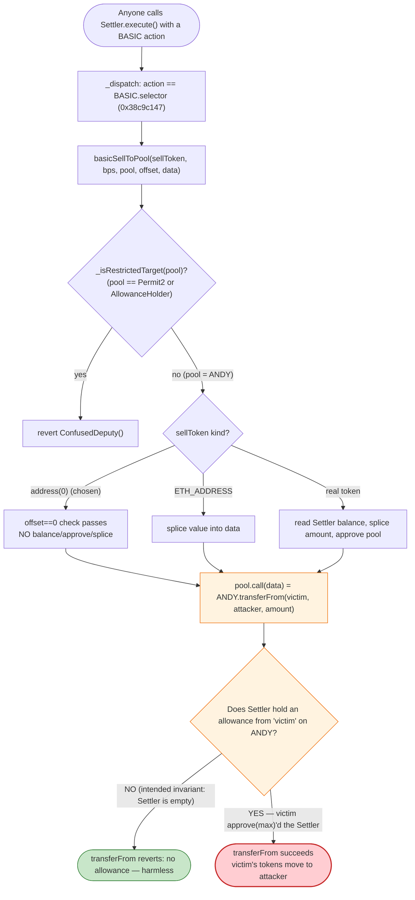

# Coinbase Fee-Account Drain — Confused-Deputy via 0x Settler `BASIC` Arbitrary Call

> **Reproduction:** the PoC compiles & runs in an isolated Foundry project at
> [this project folder](.) (the umbrella DeFiHackLabs repo contains many unrelated PoCs
> that do not whole-compile, so this one was extracted).
> Full verbose trace: [output.txt](output.txt).
> Verified source of the enabling contract: [src_flat_MainnetTakerSubmittedFlat.sol](sources/MainnetSettler_Df31A7/src_flat_MainnetTakerSubmittedFlat.sol).

---

## Key info

| | |
|---|---|
| **Loss** | ~$300,000 total across multiple tokens. This PoC reproduces one leg: **105,493.58 ANDY** drained from the Coinbase fee account |
| **"Vulnerable" contract (enabler)** | 0x **MainnetSettler** — [`0xDf31A70a21A1931e02033dBBa7DEaCe6c45cfd0f`](https://etherscan.io/address/0xDf31A70a21A1931e02033dBBa7DEaCe6c45cfd0f#code) |
| **Actual root cause** | A **Coinbase fee receiver** account (`0x382fFCe2287252F930E1C8DC9328dac5BF282bA1`) that mistakenly granted **unlimited ERC-20 approvals to the Settler** |
| **Victim** | Coinbase fee account `0x382fFCe2287252F930E1C8DC9328dac5BF282bA1` |
| **Drained token (this PoC)** | ANDY — [`0x68BbEd6A47194EFf1CF514B50Ea91895597fc91E`](https://etherscan.io/address/0x68BbEd6A47194EFf1CF514B50Ea91895597fc91E#code) |
| **Attacker EOA** | [`0xC31a49D1c4C652aF57cEFDeF248f3c55b801c649`](https://etherscan.io/address/0xC31a49D1c4C652aF57cEFDeF248f3c55b801c649) |
| **Attacker contract** | [`0xF0D539955974b248d763D60C3663eF272dfC6971`](https://etherscan.io/address/0xF0D539955974b248d763D60C3663eF272dfC6971) |
| **Attack tx** | [`0x33b2cb5bc3c0ccb97f0cc21e231ecb6457df242710dfce8d1b68935f0e05773b`](https://etherscan.io/tx/0x33b2cb5bc3c0ccb97f0cc21e231ecb6457df242710dfce8d1b68935f0e05773b) |
| **Chain / block / date** | Ethereum mainnet / 23,134,257 (forked at 23,134,256) / Aug-13-2025 |
| **Compiler (Settler)** | Solidity v0.8.25, optimizer 2000 runs |
| **Bug class** | Confused deputy / dangling token approval to a contract that lets anyone trigger arbitrary calls |

---

## TL;DR

The 0x **Settler** is a swap router that, by design, can be told to perform a *raw external call*
to any address through its `BASIC` action ([selector `0x38c9c147`](sources/MainnetSettler_Df31A7/src_flat_MainnetTakerSubmittedFlat.sol#L1367)).
The Settler is built on the assumption that it **never holds standing ERC-20 approvals** — it pulls
funds only through signed Permit2 permits scoped to a single transaction. Under that assumption the
arbitrary-call capability is harmless: the Settler has nothing valuable to steal.

A **Coinbase fee-collection account** broke that assumption. It directly `approve`d the Settler for
an **unlimited** amount of several ERC-20 tokens (the kind of `approve(max)` a frontend issues so it
never has to re-approve). That turned the Settler into a **confused deputy**: it now had a live,
unlimited allowance to move the Coinbase account's tokens, and `BASIC` lets *anyone* direct it to do
exactly that.

The attacker simply called the Settler's `execute()` with a single `BASIC` action whose payload was
`ANDY.transferFrom(coinbaseFeeAccount, attacker, balance)`. The Settler forwarded the call, ANDY saw
its approved spender (the Settler) calling `transferFrom`, and moved **105,493.58 ANDY** to the
attacker. No signature, no flash loan, no price manipulation — just one call.

This PoC reproduces the ANDY leg. The full incident (~$300K) repeated the same one-call pattern
across every token the Coinbase account had over-approved.

---

## Background — what the 0x Settler is

The 0x **Settler** (also "MainnetSettler" / "MainnetTakerSubmitted") is 0x Protocol's on-chain swap
executor. A swap is expressed as an ordered list of **actions** passed to
[`execute(AllowedSlippage, bytes[] actions, bytes32)`](sources/MainnetSettler_Df31A7/src_flat_MainnetTakerSubmittedFlat.sol#L9390).
Each action is an ABI-encoded call whose first 4 bytes select a handler in
[`ISettlerActions`](sources/MainnetSettler_Df31A7/src_flat_MainnetTakerSubmittedFlat.sol#L1139)
(`UNISWAPV3`, `UNISWAPV2`, `RFQ`, `BASIC`, …). `execute()` decodes each action and routes it through
[`_dispatchVIP` / `_dispatch`](sources/MainnetSettler_Df31A7/src_flat_MainnetTakerSubmittedFlat.sol#L9466).

The Settler's security model rests on two pillars:

1. **It holds no standing balances or approvals.** Tokens enter the Settler *within a swap* via
   **Permit2** signed transfers (`PermitTransferFrom` + signature), scoped to that transaction and
   that taker. The contract is designed to be *empty* between swaps.
2. **Arbitrary calls are deliberately allowed** through the `BASIC` action so the router can talk to
   any AMM/pool, but only two addresses are blocklisted as call targets — `Permit2` and the
   `AllowanceHolder` ([`_isRestrictedTarget`](sources/MainnetSettler_Df31A7/src_flat_MainnetTakerSubmittedFlat.sol#L7845)) —
   precisely because those are the only contracts that *do* know how to move third-party funds.

Pillar 1 is what makes pillar 2 safe. If the Settler genuinely owns nothing and is owed nothing,
then letting an attacker make it call `someToken.transferFrom(victim, attacker, x)` does nothing:
the Settler has no allowance from `victim`. The incident is what happens when **pillar 1 is violated
externally** — a victim hands the Settler a real allowance.

---

## The vulnerable code (the enabling mechanism)

### 1. `BASIC` decodes to a raw call to an arbitrary `pool`

The `BASIC` action handler is
[`basicSellToPool`](sources/MainnetSettler_Df31A7/src_flat_MainnetTakerSubmittedFlat.sol#L5838):

```solidity
function basicSellToPool(IERC20 sellToken, uint256 bps, address pool, uint256 offset, bytes memory data) internal {
    if (_isRestrictedTarget(pool)) {           // only blocks Permit2 / AllowanceHolder
        assembly ("memory-safe") {
            mstore(0x00, 0xe758b8d5)            // selector for `ConfusedDeputy()`
            revert(0x1c, 0x04)
        }
    }

    bool success;
    bytes memory returnData;
    uint256 value;
    if (sellToken == ETH_ADDRESS) {
        ...
    } else if (address(sellToken) == address(0)) {
        // TODO: check for zero `bps`
        if (offset != 0) revert InvalidOffset();   // ← attacker sets sellToken=0, offset=0 ⇒ passes
    } else {
        uint256 amount = sellToken.fastBalanceOf(address(this)).mulDiv(bps, BASIS);
        ...                                          // amount-splicing path (not taken here)
        if (address(sellToken) != pool) {
            sellToken.safeApproveIfBelow(pool, amount);
        }
    }
    (success, returnData) = payable(pool).call{value: value}(data);   // ⚠️ raw arbitrary call
    success.maybeRevert(returnData);
    // forbid sending data to EOAs
    if (returnData.length == 0 && pool.code.length == 0) revert InvalidTarget();
}
```

The `sellToken == address(0)` branch is the attacker's chosen path: it performs **no balance read,
no `bps` splicing, no approval** — it falls straight through to
`payable(pool).call{value: 0}(data)`. With `pool = ANDY` and `data =
abi.encodeWithSelector(transferFrom.selector, coinbaseFee, attacker, amount)`, the Settler calls
`ANDY.transferFrom(...)` verbatim. ANDY has code, so the trailing `InvalidTarget` guard is satisfied.

### 2. The `BASIC` selector and the dispatch routing

```solidity
// ISettlerActions.sol
function BASIC(address sellToken, uint256 bps, address pool, uint256 offset, bytes calldata data) external;
```
`bytes4(keccak256("BASIC(address,uint256,address,uint256,bytes)")) == 0x38c9c147` — exactly the outer
selector the PoC encodes ([test/coinbase_exp.sol:81-89](test/coinbase_exp.sol#L81-L89)).

The action is routed in
[`_dispatch`](sources/MainnetSettler_Df31A7/src_flat_MainnetTakerSubmittedFlat.sol#L9497):

```solidity
} else if (action == uint32(ISettlerActions.BASIC.selector)) {
    (IERC20 sellToken, uint256 bps, address pool, uint256 offset, bytes memory _data) =
        abi.decode(data, (IERC20, uint256, address, uint256, bytes));
    basicSellToPool(sellToken, bps, pool, offset, _data);
}
```

### 3. The only "guard" — and why it does not help here

```solidity
// Permit2PaymentAbstract: the lowest _isRestrictedTarget in the chain
function _isRestrictedTarget(address target) internal pure virtual override returns (bool) {
    return target == address(_PERMIT2);    // 0x000000000022D473030F116dDEE9F6B43aC78BA3
}
// Permit2PaymentTakerSubmitted: adds the AllowanceHolder
//   target == address(_ALLOWANCE_HOLDER) || super._isRestrictedTarget(target)
//   _ALLOWANCE_HOLDER = 0x0000000000001fF3684f28c67538d4D072C22734
```

The blocklist names the two contracts that *can* move third-party tokens via the Settler's own
plumbing. It does **not** (and cannot, statically) blocklist an arbitrary ERC-20 such as ANDY — that
would break the router's entire purpose of calling pools. The design relies on the Settler having no
allowances to abuse, not on filtering the call target.

### 4. The victim token is a vanilla ERC-20

ANDY's [`transferFrom`](sources/Andy_68BbEd/Andy.sol#L476) is textbook OpenZeppelin: it moves funds
and decrements `_allowances[sender][msg.sender]`. The post-transfer `Approval` event in the trace
showing a remaining allowance of `1.157e77` is the residue of an originally **near-infinite**
approval — the proof that the Coinbase account had `approve(Settler, ~max)`'d this token.

---

## Root cause — why it was possible

This is a **confused-deputy** incident whose true root cause lives *off* the Settler, in operational
key/approval management:

> A Coinbase fee account directly `approve`d the 0x Settler for an **unlimited** amount of several
> tokens. The Settler is explicitly designed never to hold such approvals; its built-in "make an
> arbitrary call to any pool" feature (`BASIC`) is only safe under that invariant. The dangling
> approval converted a benign router capability into a public "drain my account" button.

The chain of decisions that compose into the loss:

1. **The Settler exposes a permissionless arbitrary call.** `execute()` is open to anyone, and the
   `BASIC` action forwards `data` to any non-blocklisted `pool`. This is intentional and, on its own,
   not a bug.
2. **Targets are filtered, allowances are not.** The Settler can only refuse to *call* Permit2 /
   AllowanceHolder. It has no way to know that some third party granted it a standing allowance on
   ANDY, nor to refuse to *exercise* such an allowance — `transferFrom` is just a call to a pool that
   happens to honor it.
3. **The victim broke the "no standing approval" invariant.** Approving the Settler directly (rather
   than approving Permit2, the canonical flow) is the actual defect. It is the kind of mistake a
   wallet/automation makes when it treats the Settler like any other spender and issues `approve(max)`
   "to save gas."
4. **`approve(max)` makes the blast radius the entire balance.** Because the allowance was unlimited,
   one `transferFrom` could move the account's *whole* ANDY balance (105,493.58 ANDY), and the same
   for every other over-approved token.

The PoC header notes the misconfiguration was first visible ~2 hours before the attack in an
unrelated transaction ([`0x8df54ebe…269f2`](https://etherscan.io/tx/0x8df54ebe76c09cda530f1fccb591166c716000ec95ee5cb37dff997b2ee269f2)),
after which the attacker noticed the dangling approval and swept the account.

---

## Preconditions

- The victim (Coinbase fee account) has a **live, non-zero ERC-20 allowance** granted to the Settler
  — here an unlimited approval on ANDY. This is the sole hard precondition; everything else follows.
- The victim holds a **non-zero balance** of that token (105,493.58 ANDY at the fork block).
- The Settler's `execute()` is callable by anyone (always true — it is a public swap entry point).
- No flash loan, no capital, and no price/oracle manipulation are required. The attacker spent
  essentially nothing (the PoC forwards 1,620 wei merely to exercise the `payable` path).

---

## Attack walkthrough (with on-chain numbers from the trace)

All figures below are taken directly from [output.txt](output.txt).

| # | Step | Detail | State change |
|---|------|--------|--------------|
| 0 | **Read victim balance** | `ANDY.balanceOf(0x382f…2bA1)` | returns `105,493,579,719,278,780,000,000` wei = **105,493.58 ANDY** |
| 1 | **Build `BASIC` payload** | inner = `transferFrom(0x382f…2bA1, attacker, 105,493.58e18)`; outer = `BASIC(sellToken=0, bps=10000, pool=ANDY, offset=0, inner)` | encodes selector `0x38c9c147` |
| 2 | **Call Settler** | `MainnetSettler.execute(slippage{0,0,0}, [action], 0)` | routes to `_dispatch` → `basicSellToPool` |
| 3 | **Settler forwards raw call** | `sellToken==address(0)` branch ⇒ `pool.call(data)` → `ANDY.transferFrom(0x382f…2bA1, attacker, 105,493.58e18)` | uses the dangling unlimited allowance |
| 4 | **ERC-20 moves funds** | `Transfer(0x382f…2bA1 → attacker, 1.054e23)`; `Approval(0x382f…2bA1 → Settler, 1.157e77)` | victim allowance decremented from ~max |
| 5 | **Slippage check** | `_checkSlippageAndTransfer({recipient:0, buyToken:0, minAmountOut:0})` | no-op (zeroed slippage) |
| 6 | **Confirm** | `ANDY.balanceOf(attacker)` | `0 → 105,493.58 ANDY` |

### Profit / loss accounting

| Party | Token | Before | After | Delta |
|---|---|---:|---:|---:|
| Attacker | ANDY | 0 | 105,493.579719278780 | **+105,493.58 ANDY** |
| Coinbase fee account | ANDY | 105,493.579719278780 | 0 | **−105,493.58 ANDY** |
| Attacker | ETH | — | — | ~0 (only 1,620 wei forwarded, gas only) |

The PoC's `balanceLog` measures the ANDY balance of the test contract (which plays the attacker
role): `0 → 105,493.579719278780000000`. The full real-world incident repeated this single call for
each over-approved token, totalling **~$300K**.

---

## Diagrams

### Sequence of the attack



### Confused-deputy state / trust evolution



---

## Remediation

The decisive fix is operational; the contract-level mitigations are defense-in-depth.

1. **Never grant standing approvals to a router that exposes arbitrary calls.** The Coinbase fee
   account should approve **Permit2** (the canonical 0x flow) and let each swap consume a *signed,
   single-use* permit — never `approve(Settler, max)`. Audit and **revoke** every dangling allowance
   to the Settler / AllowanceHolder across all tokens immediately.
2. **Avoid `approve(max)` on operational accounts.** Use exact-amount, just-in-time approvals (or
   Permit2 nonce-scoped permits) so a single mistaken/abused allowance cannot drain an entire balance.
3. **Segregate fee-collection from spending.** Tokens accumulating in a fee account should not share
   an address that holds live approvals to third-party routers; sweep fees to a cold/treasury address
   that never approves anything.
4. **Monitoring / circuit breaker.** Alert on any `Approval` from a treasury/fee account to a known
   router and on large `transferFrom` outflows, so a misconfiguration is caught in seconds rather than
   exploited hours later.
5. **(Router side, optional) restrict standing-allowance abuse.** A router that exposes a generic
   `BASIC` call cannot enumerate every token, but it could, for tokens it knows about, prefer
   `safeApproveIfBelow`-style scoped flows and document loudly that direct approvals to it are
   unsupported and unsafe. The fundamental responsibility, however, remains with the approver.

---

## How to reproduce

The PoC was extracted into a standalone Foundry project (the umbrella DeFiHackLabs repo has many
unrelated PoCs that fail under a whole-project `forge build`). It additionally pulls in the repo's
shared `basetest.sol` + `tokenhelper.sol` (for the `balanceLog` modifier) into the project root so
`../basetest.sol` resolves from `test/`.

```bash
_shared/run_poc.sh 2025-08-coinbase_exp -vvvvv
```

- RPC: an **Ethereum archive** endpoint is required (fork block 23,134,256). `foundry.toml` uses an
  Infura archive endpoint; most pruned public RPCs would fail with `missing trie node` at this block.
- Result: `[PASS] testExploit()`.

Expected tail:

```
[PASS] testExploit() (gas: 1744110)
  Attacker Before exploit ANDY Balance: 0.000000000000000000
  Attacker After exploit ANDY Balance: 105493.579719278780000000

Suite result: ok. 1 passed; 0 failed; 0 skipped
```

---

*References: PoC header (DeFiHackLabs `src/test/2025-08/coinbase_exp.sol`); analysis thread
https://x.com/deeberiroz/status/1955718986894549344 ; 0x Settler design docs (Permit2-based,
"no standing approvals" invariant).*
