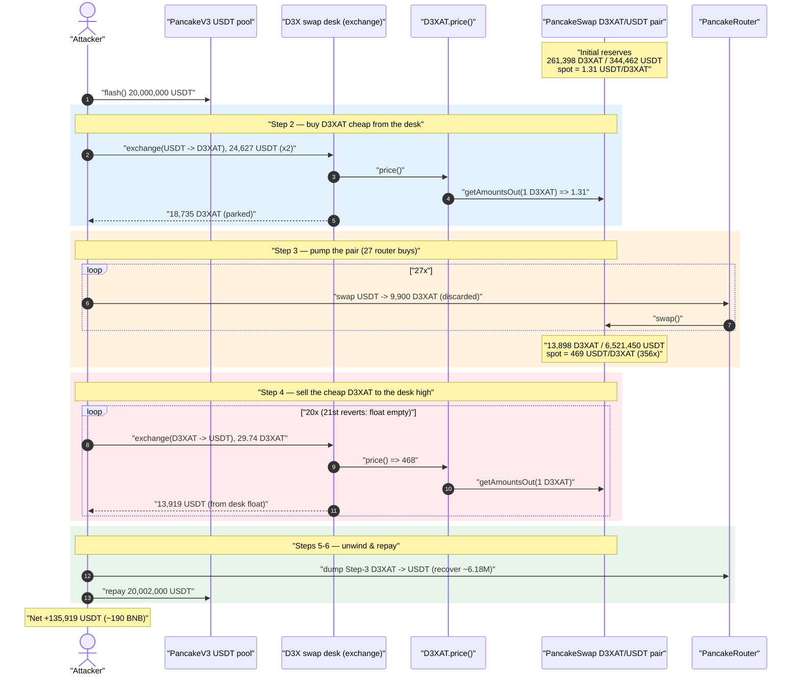
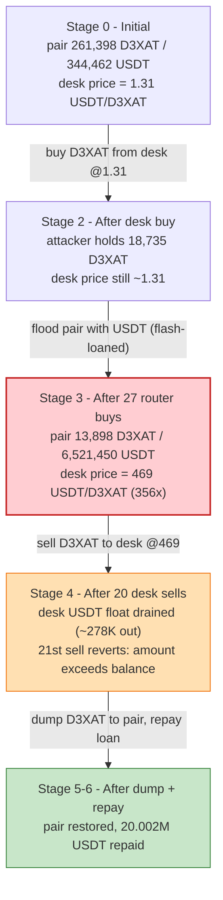
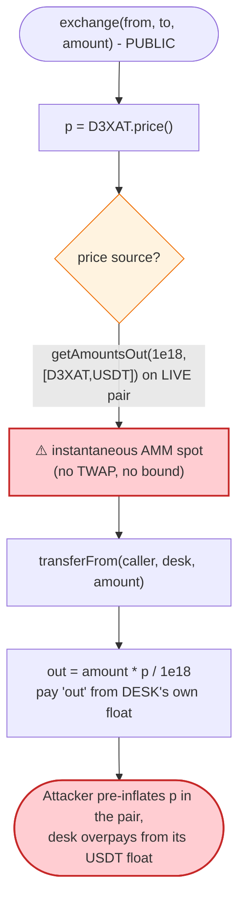
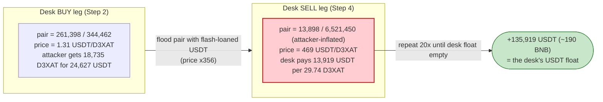

# D3X AI Exploit — Proxy `exchange()` Prices D3XAT From A Manipulable PancakeSwap Spot Reserve

> **Reproduction:** the PoC compiles & runs in an isolated Foundry project at
> [this project folder](.) (the umbrella DeFiHackLabs repo contains many unrelated PoCs that do
> not whole-compile, so this one was extracted).
> Full verbose trace: [output.txt](output.txt).
> The vulnerable `exchange()` / `price()` logic lives in **unverified** implementation contracts;
> the verified proxy wrappers are under [sources/](sources/) and the behaviour is reconstructed
> from the on-chain trace.

---

## Key info

| | |
|---|---|
| **Loss** | **190 BNB** (≈ **135,919 USDT** net intra-transaction profit, per the balance log) |
| **Vulnerable contract** | D3X swap proxy `exchange()` — [`0xb8ad82c4771DAa852DdF00b70Ba4bE57D22eDD99`](https://bscscan.com/address/0xb8ad82c4771DAa852DdF00b70Ba4bE57D22eDD99#code) (impl `0x94DDCd72…` — *unverified*) |
| **Priced asset / token** | D3XAT token — [`0x2Cc8B879E3663d8126fe15daDaaA6Ca8D964BbBE`](https://bscscan.com/address/0x2Cc8B879E3663d8126fe15daDaaA6Ca8D964BbBE#code) (impl `0x1a1a84b4…` — *unverified*) |
| **Victim price source / pool** | D3XAT/USDT PancakeSwap-v2 pair — `0xaec58FBd7Ed8008A3742f6d4FFAA9F4B0ECbc30e` |
| **Attacker EOA** | [`0x4b63c0cf524f71847ea05b59f3077a224d922e8d`](https://bscscan.com/address/0x4b63c0cf524f71847ea05b59f3077a224d922e8d) |
| **Attacker contract** | [`0x3b3e1edeb726b52d5de79cf8dd8b84995d9aa27c`](https://bscscan.com/address/0x3b3e1edeb726b52d5de79cf8dd8b84995d9aa27c) |
| **Attack tx** | [`0x26bcefc152d8cd49f4bb13a9f8a6846be887d7075bc81fa07aa8c0019bd6591f`](https://bscscan.com/tx/0x26bcefc152d8cd49f4bb13a9f8a6846be887d7075bc81fa07aa8c0019bd6591f) |
| **Chain / block / date** | BSC / 57,780,985 (forked at 57,780,984) / Aug 2025 |
| **Compiler** | PoC `^0.8.0`; proxies `v0.8.29` |
| **Bug class** | Spot-price oracle manipulation — internal "swap desk" prices a token from a live, thin AMM reserve that the attacker controls |

---

## TL;DR

D3X runs a small in-house "swap desk": a `TransparentUpgradeableProxy` exposing
`exchange(fromToken, toToken, amount)`
([first call: output.txt:1739](output.txt#L1739)). When you sell D3XAT into that desk, it does **not**
quote you from its own deep reserves or a TWAP — it asks the D3XAT token's `price()` view, which
internally calls **`PancakeRouter.getAmountsOut(1e18, [D3XAT, USDT])`** against the **live**
D3XAT/USDT PancakeSwap pair ([output.txt:1741-1748](output.txt#L1741-L1748)). The marginal price of
that pair is whatever its instantaneous reserves say it is.

The attacker:

1. **Flash-borrows 20,000,000 USDT** from the PancakeSwap-v3 USDT pool
   ([output.txt:1699](output.txt#L1699)).
2. **Buys D3XAT cheaply through the desk** at the un-manipulated price (~**1.31 USDT/D3XAT**) and
   parks it ([output.txt:1739](output.txt#L1739)).
3. **Pumps the PancakeSwap pair** by buying ~9,900 D3XAT in each of **27** router swaps, dragging the
   pair's D3XAT reserve from **261,398 → 13,898** and its USDT reserve from **344,462 → 6,521,450**.
   The desk's `price()` reading explodes from **1.31 → ~469 USDT/D3XAT** (~356×)
   ([reserve progression: output.txt:1716+](output.txt#L1716)).
4. **Sells the cheaply-bought D3XAT back to the desk** at the inflated price (~469 USDT/D3XAT):
   29.74 D3XAT → ~13,919 USDT per call, repeated **20×** until the desk's USDT reserve is drained and
   the 21st sell reverts `BEP20: transfer amount exceeds balance`
   ([revert: output.txt:5320](output.txt#L5320), [loop-break sell: output.txt:5281](output.txt#L5281)).
5. **Dumps the Step-3 D3XAT back into the PancakeSwap pool** to recover the ~6.18M USDT it injected
   ([output.txt:5330](output.txt#L5330)).
6. **Repays the 20,000,000 USDT + 2,000 USDT fee** ([output.txt:7059](output.txt#L7059)) and keeps the
   difference.

Net result per the balance log: **26.54 USDT → 135,946.03 USDT**, i.e. **+135,919 USDT (≈190 BNB)**,
drained from the swap desk's USDT float.

---

## Background — what D3X's swap desk does

D3X deploys two `TransparentUpgradeableProxy` contracts (both verified as standard OZ transparent
proxies, [sources/TransparentUpgradeableProxy_b8ad82](sources/TransparentUpgradeableProxy_b8ad82/),
[sources/TransparentUpgradeableProxy_2Cc8B8](sources/TransparentUpgradeableProxy_2Cc8B8/)):

| Role | Proxy | Implementation at fork block | Verified? |
|------|-------|------------------------------|-----------|
| Swap desk (`exchange`, `price` pass-through) | `0xb8ad82c4…` | `0x94DDCd72…` | impl **unverified** |
| D3XAT token (`price`, ERC20) | `0x2Cc8B879…` | `0x1a1a84b4…` | impl **unverified** |

The swap desk lets users convert between USDT and D3XAT at a price derived from the project's own
`price()` oracle. From the trace, `exchange(USDT, D3XAT, amount)` (buy) and
`exchange(D3XAT, USDT, amount)` (sell) both:

1. read `D3XAT.price()` (which forwards to `PancakeRouter.getAmountsOut(1e18, [D3XAT, USDT])`),
2. pull the input token from the caller via `transferFrom`,
3. pay out the other token from the **desk proxy's own balance** (a "float" of USDT and D3XAT it
   holds),
4. skim a fee to `0x1334214…` (≈15% of the USDT leg on the sell path; see the
   `transfer(0x1334…, 2087.8 USDT)` at [output.txt:4035](output.txt#L4035)).

Because the desk pays out of its own float and prices off the live pair, it behaves like a market
maker that **always quotes the current PancakeSwap spot** — with no slippage of its own and no
sanity bound. That is the entire vulnerability.

The verified portion is only the proxy plumbing — the priced logic is in the unverified
implementations. The verified `getAmountsOut`/`getReserves` calls in the trace are PancakeRouter
(`0x10ED43C7…`, labelled `Recovery` by Foundry) and the PancakePair (`0xaec58F…`).

---

## The vulnerable behaviour (reconstructed from the trace)

The implementation is unverified, but the trace makes the pricing path unambiguous. Pseudocode of the
desk's sell path, annotated with trace line numbers:

```solidity
// proxy 0xb8ad82… delegatecalls impl 0x94DDCd72…  (output.txt:1739, 4001)
function exchange(address fromToken, address toToken, uint256 amount) external {
    // 1) price is the LIVE PancakeSwap spot, NOT a reserve-of-this-desk quote
    uint256 p = D3XAT(token).price();          // output.txt:1741  → 0x1a1a84b4…::price()
    //    price() == PancakeRouter.getAmountsOut(1e18, [D3XAT, USDT])[1]
    //            == quote of 1 D3XAT against pair 0xaec58F… reserves   (output.txt:1743-1748)

    // 2) take input
    IERC20(fromToken).transferFrom(msg.sender, address(this), amount);   // output.txt:1753 / 4034

    // 3) pay output FROM THIS DESK'S OWN FLOAT at the spot price
    uint256 out = amount * p / 1e18;           // sell: 29.74 D3XAT * 468.01 ≈ 13,918.9 USDT
    uint256 fee = out * feeBps / 10_000;       // ≈15% skim to 0x1334…  (output.txt:4044)
    IERC20(toToken).transfer(msg.sender, out - fee);   // output.txt:4029 (11,831 USDT)
    IERC20(toToken).transfer(feeSink,   fee);          // output.txt:4035 (2,087 USDT)
}
```

The corresponding `price()` view (token impl `0x1a1a84b4…`) — from the trace
([output.txt:1741-1748](output.txt#L1741-L1748)):

```solidity
function price() public view returns (uint256) {
    address[] memory path = [D3XAT, USDT];
    return IPancakeRouter(PANCAKE_ROUTER).getAmountsOut(1e18, path)[1];   // spot, no TWAP
    //   getReserves() => (reserveD3XAT, reserveUSDT)                     // output.txt:1744-1745
    //   out = 1e18 * reserveUSDT*9975 / (reserveD3XAT*10000 + 1e18*9975)
}
```

Two readings observed in the same transaction:

| When | Pair reserves (D3XAT / USDT) | `price()` returned |
|------|------------------------------|--------------------|
| Buy phase (Step 2) | 261,398 / 344,462 | `0x123dec39a01190f0` = **1.3145 USDT/D3XAT** ([output.txt:1746](output.txt#L1746)) |
| Sell phase (Step 4) | 13,898 / 6,521,450 | `0x195ef23961273a97a3` = **468.01 USDT/D3XAT** ([output.txt:4008](output.txt#L4008)) |

Same desk, same block, same token — a **356×** price swing, fully controlled by whoever last touched
the pair's reserves.

---

## Root cause — why it was possible

> The swap desk's `exchange()` settles trades at the **instantaneous marginal price of a thin,
> permissionless AMM pair**, paying from its own token float. An attacker who can move that pair's
> reserves (anyone, with a flash loan) can make the desk buy D3XAT from them cheap and re-buy it back
> expensive in the same transaction, pocketing the desk's USDT float.

The composing design errors:

1. **Spot price, not TWAP/independent oracle.** `price()` reads
   `getAmountsOut(1e18, [D3XAT, USDT])` against the *current* pair reserves. A constant-product spot
   price is trivially manipulable within one transaction; it must never be the settlement price for a
   maker that pays from a real float.
2. **No price bounds / no slippage of the desk's own inventory.** The desk fills any size at the
   single spot quote. There is no min/max price band, no cap relative to a reference, and the fill
   price does not move as inventory is consumed — so the attacker drains the float at a flat,
   inflated rate (20 identical 13,918.9-USDT fills).
3. **The same desk both buys and sells against the same manipulable feed.** The attacker buys low at
   the un-manipulated price and sells high at the manipulated price; the desk has no memory of the
   purchase price and no consistency check between the two legs.
4. **Thin pair vs. flash-loan-scale capital.** The D3XAT/USDT pair held only ~261K D3XAT / ~344K
   USDT, so a flash-loaned 20M-USDT war-chest moves `price()` by hundreds of x for the duration of
   one transaction.

The convoluted helper/seller fan-out (`ProxyBuyer`, `ProxySeller`, `PancakeBuyer`, `PancakeSeller`,
each delegatecalling a helper) is just the attacker batching many small fills across fresh addresses
to stay under per-call/per-address limits and to recycle balances; it is incidental to the bug.

---

## Preconditions

- A flash-loan source for USDT — here PancakeSwap-v3 pool `0x92b7807b…` provides 20M USDT for a
  2,000-USDT fee (0.01%) ([output.txt:1699](output.txt#L1699)). Fully repaid intra-transaction
  ([output.txt:7077](output.txt#L7077)), so the attack is self-funded.
- The desk `exchange()` must be **callable by anyone** and must price off the live pair (true here).
- The desk must hold a USDT float large enough to be worth draining (~278K USDT was paid out across
  20 sells before it reverted).
- The D3XAT/USDT pair must be thin enough that flash-loan-scale buying moves `price()` by a large
  multiple (261K/344K reserves vs. 20M USDT ⇒ 356×).

---

## Attack walkthrough (with on-chain numbers from the trace)

All figures are pulled directly from [output.txt](output.txt). The PancakeSwap pair's
`token0 = D3XAT`, `token1 = USDT`, so `reserve0 = D3XAT`, `reserve1 = USDT`.

| # | Step | Concrete numbers | Effect |
|---|------|------------------|--------|
| 0 | **Initial pair reserves** | D3XAT **261,398.6** / USDT **344,462.1** → spot **1.3145** | Honest pool; desk `price()` = 1.31. |
| 1 | **Flash loan** 20,000,000 USDT from v3 pool `0x92b7807b…` | fee 2,000 USDT | War-chest acquired. |
| 2 | **Buy D3XAT through the desk** (2× `exchange(USDT→D3XAT)`) | spend **24,627.2 USDT** → receive **18,735.5 D3XAT** at ~1.31 ([output.txt:1739](output.txt#L1739)) | Cheap D3XAT parked in `ProxySeller`. |
| 3 | **Pump the pair** — 27× `swapExactTokensForTokens(USDT→D3XAT)` of ~9,900 D3XAT out each | ~**6,176,988 USDT** pushed into pair; reserves walk **261,398→13,898 D3XAT** / **344,462→6,521,450 USDT**; spot **1.31→469.2** ([progression: output.txt:1716+](output.txt#L1716)) | Desk `price()` now ~**468 USDT/D3XAT**. |
| 4 | **Sell the cheap D3XAT to the desk** at the inflated price — `exchange(D3XAT→USDT)`, 29.74 D3XAT each | each call pays **13,918.9 USDT** (11,831.1 to seller + 2,087.8 fee, [output.txt:4029-4035](output.txt#L4029-L4035)); repeated **20×** ≈ **278,378 USDT** out, then 21st reverts *BEP20: transfer amount exceeds balance* ([output.txt:5320](output.txt#L5320)) | Drains the desk's USDT float. |
| 5 | **Dump the Step-3 D3XAT back into the pair** — 25× `swapExactTokensForTokens(D3XAT→USDT)` | recovers the ~6.18M USDT spent in Step 3 ([output.txt:5330](output.txt#L5330)) | Unwinds the manipulation. |
| 6 | **Repay flash loan** | transfer **20,002,000 USDT** to v3 pool ([output.txt:7077](output.txt#L7077)) | Loan closed. |
| 7 | **Final** | attacker USDT **26.54 → 135,946.03** | **+135,919 USDT (≈190 BNB)**. |

### Why the desk's `price()` moved 356×

PancakeSwap's `getAmountsOut(1e18, [D3XAT, USDT])` returns
`out = 1e18·9975·reserveUSDT / (reserveD3XAT·10000 + 1e18·9975)`. As Step 3 walks the reserves from
`(261398.6 D3XAT, 344462.1 USDT)` to `(13898.6 D3XAT, 6521450.1 USDT)`, the numerator (USDT reserve)
grows ~19× while the denominator (D3XAT reserve) shrinks ~19× — multiplying the quoted price by
~356× (1.31 → 469). The desk read this very quote ([output.txt:4008](output.txt#L4008)) and filled
the attacker's sells at it.

### Profit accounting (USDT)

| Item | Amount |
|---|---:|
| Flash-borrowed | 20,000,000.0 |
| Step 2 — buy D3XAT from desk (cost) | −24,627.2 |
| Step 3 — net USDT into pair (cost, recovered in Step 5) | −6,176,988 |
| Step 4 — USDT received from desk (20 fills × 13,918.9, gross) | +278,378 |
| Step 5 — USDT recovered by dumping D3XAT into pair | +~6,176,988 |
| Step 6 — flash-loan repay (principal + fee) | −20,002,000.0 |
| **Net (balance log: 135,946.03 − 26.54)** | **+135,919 USDT (≈190 BNB)** |

The profit is the swap desk's USDT float, paid out because it valued the attacker's D3XAT at a price
the attacker themselves had just manufactured in the adjacent pool.

---

## Diagrams

### Sequence of the attack



### Pair-reserve / desk-price evolution



### The flaw inside the desk's `exchange()`



### Why it is theft: buy-low / sell-high against one feed



---

## Why each magic number

- **20,000,000 USDT flash loan:** sized to dwarf the D3XAT/USDT pair (~344K USDT side), so 27 router
  buys move the desk's `price()` reading by hundreds of x while leaving plenty of headroom to repay.
- **27 router buys of ~9,900 D3XAT-out each (Step 3):** chunked into small swaps to walk the price up
  smoothly and avoid a single swap's slippage/limits; cumulatively they push the pair to
  13,898 D3XAT / 6,521,450 USDT (price 469).
- **29.74 D3XAT per desk sell, 20 iterations (Step 4):** small fixed lot repeated until the desk's
  USDT float is exhausted — the 21st call reverts `BEP20: transfer amount exceeds balance`, and the
  PoC's `try/catch` cleanly stops the loop.
- **~24,627 USDT desk buy (Step 2):** just enough cheap D3XAT (18,735) to feed the 20 inflated sells
  (20 × 29.74 ≈ 595 D3XAT actually consumed; the rest is spare inventory for the fan-out).

---

## Remediation

1. **Never settle a maker desk at an AMM spot price.** Price `exchange()` from a manipulation-
   resistant source: a Chainlink feed, a multi-block TWAP, or the desk's *own* deep reserves with a
   real constant-product / slippage curve. `getAmountsOut(1e18, …)` on a live pair is the textbook
   manipulable input.
2. **Bound the fill price.** Reject `exchange()` if the quoted price deviates more than a small band
   from a reference (TWAP or last-settled), and/or require caller-supplied `minOut`/`maxIn` that the
   desk validates — so a 356× spike cannot be filled.
3. **Make the desk's own inventory move the price.** A maker that pays from a float must move its
   quote as the float is consumed (i.e., be an AMM itself), so the 20th identical 13,919-USDT fill is
   impossible.
4. **Couple the two legs.** Track a position's acquisition price (or use a single bonding curve for
   both directions) so a same-transaction buy-low/sell-high round-trip nets ~0 minus fees.
5. **Cap per-transaction / per-block notional** through the desk relative to its float, and consider a
   block delay between large buys and sells to defeat flash-loan-atomic manipulation.

---

## How to reproduce

The PoC was extracted into a standalone Foundry project (the umbrella DeFiHackLabs repo has many
unrelated PoCs that fail to compile under one `forge build`). The PoC imports `../basetest.sol` (and
its `./tokenhelper.sol`) and `../interface.sol`, which were copied to the project root.

```bash
_shared/run_poc.sh 2025-08-d3xai_exp -vvvvv
```

- RPC: a **BSC archive** endpoint is required (fork block 57,780,984). `foundry.toml` uses
  `https://bsc-mainnet.public.blastapi.io`, which serves historical state at that block; most public
  BSC RPCs prune it and fail with `header not found` / `missing trie node`.
- Result: `[PASS] testExploit()`; attacker USDT balance goes **26.54 → 135,946.03**.

Expected tail:

```
[PASS] testExploit() (gas: 10333551)
Logs:
  Attacker Before exploit USDT Balance: 26.542161622221038197
  Attacker After exploit USDT Balance: 135946.025366414993593264

Suite result: ok. 1 passed; 0 failed; 0 skipped
```

---

*References: PoC header — Total Lost 190 BNB; analysis credit
[@suplabsyi](https://x.com/suplabsyi/status/1956695597546893598). The vulnerable `exchange()` /
`price()` implementations (`0x94DDCd72…`, `0x1a1a84b4…`) are unverified on BscScan; behaviour above is
reconstructed from the verbose execution trace.*
