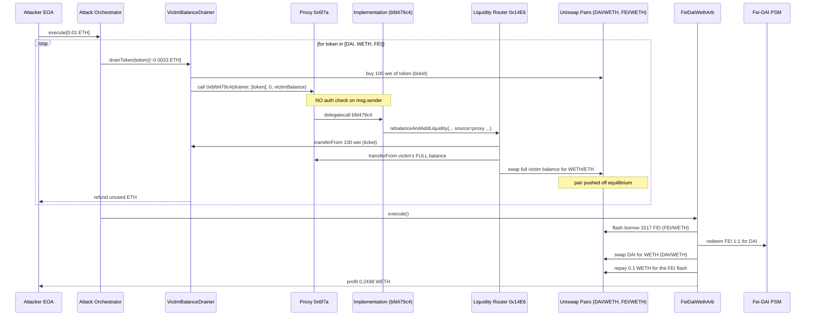
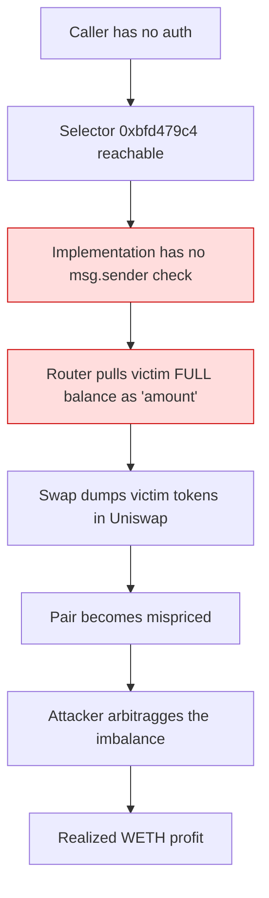

# Unverified proxy `0x6f7a` drained via permissionless `rebalanceAndAddLiquidity` selector — anyone could push a victim's live token balance through its liquidity path

> **Vulnerability classes:** vuln/access-control/missing-auth · vuln/access-control/missing-modifier · vuln/defi/price-manipulation · vuln/logic/incorrect-order-of-operations
> **Reproduction:** the PoC compiles & runs in an isolated Foundry project at [this project folder](.). Full verbose trace: [output.txt](output.txt). The vulnerable proxy at `0x6f7a…` and its implementation `0x338F…03E7` were **not source-verified on Etherscan** — selectors and behavior are reconstructed from the trace; the unverified liquidity router (`0x14E6…e4bd`) and the Uniswap V2 pairs / Fei-DAI PSM are standard verified contracts.

---

## Key info

| | |
|---|---|
| **Loss** | 7,630.46 USD reported (~0.25 WETH realized by the attacker on this fork) [output.txt:1539,1542] |
| **Vulnerable contract** | Unverified proxy `0x6f7a` — [`0x6F7a14Bd931554683ed15dC92e25D046eD68EA68`](https://etherscan.io/address/0x6F7a14Bd931554683ed15dC92e25D046eD68EA68) (delegatecalls to implementation [`0x338FfEacCf929c88fb9574DC202dC1714b1903E7`](https://etherscan.io/address/0x338FfEacCf929c88fb9574DC202dC1714b1903E7)) |
| **Attacker EOA** | [`0xe4B97Db5FAF476DB464Bc271097Fac97d6CE3783`](https://etherscan.io/address/0xe4B97Db5FAF476DB464Bc271097Fac97d6CE3783) |
| **Attack contract** | [`0x308a2c17e8f7C41982C8e944560876A0241324E1`](https://etherscan.io/address/0x308a2c17e8f7C41982C8e944560876A0241324E1) |
| **Attack tx** | [`0x653b185a57fb5909180fe4eede67e51c5e9b70af16937382f86d5aefe635e5a7`](https://etherscan.io/tx/0x653b185a57fb5909180fe4eede67e51c5e9b70af16937382f86d5aefe635e5a7) |
| **Chain / block / date** | Ethereum mainnet / 23,196,045 / Aug 2025 |
| **Compiler** | Unknown — proxy and implementation are **unverified** on Etherscan |
| **Bug class** | A public selector on the proxy (`0xbfd479c4`) lets any caller invoke the implementation's `rebalanceAndAddLiquidity` flow against the **proxy's own token balances**, with no check that the caller owns those balances — letting an attacker force-swap the victim's DAI/WETH/FEI holdings through Uniswap and capture the induced price imbalance. |

## TL;DR

The victim contract `0x6f7a` is a proxy that holds a treasury of DAI, WETH and FEI and, through its implementation, can "rebalance" its holdings into liquidity positions by routing them through Uniswap V2. The fatal mistake is that the rebalance entry point — selector `0xbfd479c4(address,address[],uint256,uint256)` — is **externally callable by anyone**, and operates on the proxy's live token balances without verifying that the caller is authorized to move those tokens. There is no `onlyOwner`, no allowance check against `msg.sender`, and no constraint that the `uint256` "amount" parameter relate to a deposit the caller made.

An attacker exploited this by, for each of the three tokens the victim held, calling `0xbfd479c4` and pointing it at the victim's *entire* balance of that token. The selector pulls a dust deposit from the attacker (100 wei, used to satisfy a `transferFrom` precondition), then triggers the implementation's `rebalanceAndAddLiquidity` which:

- `transferFrom`s the **victim's full balance** of the token from the proxy into the DAI/WETH (or FEI/WETH) Uniswap pair,
- swaps that huge amount for WETH/ETH, and
- leaves the pair deeply mispriced.

After three such forced swaps the victim was drained of **4,236.94 DAI**, **0.3141 WETH**, and **2,295.63 FEI** [output.txt:1539-1541], and the FEI/WETH and DAI/WETH pools were pushed off equilibrium. The attacker then ran a single flash-swap arbitrage — borrow FEI from the FEI/WETH pair, redeem it 1:1 for DAI through the Fei-DAI PSM, swap that DAI back to WETH in the DAI/WETH pair, and repay the borrowed FEI — netting **0.24980 WETH (≈0.25 ETH)** of clean profit [output.txt:1542]. The whole attack was funded with only 0.01 ETH of gas/seed capital.

The root cause is pure access control: a state-mutating, fund-moving function was reachable by an unprivileged caller, and it moved balances that did not belong to that caller.

## Background — what the `0x6f7a` proxy does

`0x6F7a14Bd931554683ed15dC92e25D046eD68EA68` is an EVM proxy that delegatecalls to an implementation at `0x338FfEacCf929c88fb9574DC202dC1714b1903E7`. Neither contract is source-verified, so behavior is reconstructed from the trace. From the call graph, the proxy/implementation form a small treasury/liquidity-management system with these external dependencies:

- **Uniswap V2 Router02** (`0x7a250d5630B4cF539739dF2C5dAcb4c659F2488D`) — used to swap tokens and add liquidity.
- **Uniswap V2 pairs** — DAI/WETH (`0xA478…eB11`) and FEI/WETH (`0x94B0…a878`).
- **An unverified "liquidity router"** (`0x14E6D67F824C3a7b4329d3228807f8654294e4bd`) that exposes `rebalanceAndAddLiquidity(...)`. The implementation calls this with the proxy as the `from` source of funds.
- **Fei-DAI PSM** (`0x7842186c...`) for 1:1 FEI↔DAI conversion.
- ERC20 tokens DAI, WETH, FEI, plus two internal bookkeeping tokens `0xf45e…cEFc` and `0x5fE9…58F9`.

The intended purpose — inferred from selector and function names in the trace — is for an **operator/owner** to periodically rebalance the treasury: pull a chosen token out of the proxy, swap some of it on Uniswap, and mint liquidity-position receipt tokens back to the proxy (`0xe77d…aEa::mint(... , proxy)` is visible in the trace at [output.txt:1684,1793,1903]). That is a legitimate design *if and only if* the rebalance entry point is gated to an authorized caller and operates only on funds the caller has the right to move. Neither guard existed.

## The vulnerable code

> The proxy and implementation are **not verified on Etherscan**, so there is no Solidity source to quote. The reconstruction below is derived directly from the Foundry `-vvvvv` trace in [output.txt](output.txt) and from the PoC's ABI encoding in [test/unverified_6f7a_exp.sol](test/unverified_6f7a_exp.sol). The encoded calldata and the resulting external calls are mechanical facts from the trace, not guesses.

### The permissionless selector (RECONSTRUCTED from trace)

The attacker invokes the proxy with selector `0xbfd479c4` and a 4-argument payload `(address from, address[] tokens, uint256 x, uint256 amount)`:

```solidity
// RECONSTRUCTED from trace output.txt:1633-1634, 1742-1743, 1853-1854
// selector 0xbfd479c4 = function(address,address[],uint256,uint256)

// Attacker's call (from VictimBalanceDrainer.drainToken):
(bool ok,) = VULNERABLE_CONTRACT.call(
    abi.encodeWithSelector(
        bytes4(0xbfd479c4),
        address(this),          // `from`  — the attacker's helper contract
        tokens,                 // [token] — the token to rebalance
        uint256(0),             // x
        victimBalance           // `amount` — the VICTIM's full balance of token
    )
);
```

The proxy `delegatecall`s into the implementation ([output.txt:1634,1743,1854] show `Unverified Implementation::bfd479c4(...) [delegatecall]`). Inside, the implementation has **no `require(msg.sender == owner)` and no check that `from` / `amount` belongs to `msg.sender`**. It proceeds straight into the liquidity router.

### The fund-moving path (RECONSTRUCTED from trace)

The implementation calls the unverified liquidity router's `rebalanceAndAddLiquidity` with a `data` array containing raw calldata blobs. Two of those blobs are decisive:

```solidity
// RECONSTRUCTED from output.txt:1646,1755 — the rebalanceAndAddLiquidity args
router.rebalanceAndAddLiquidity(
    0xe77dd691cE5BF22c635eFdf9B53cf3eE3b40BaEa, // LP token / vault
    0, 0, 0,
    true,
    [token, 0x5fE97d87...],                      // path
    [
        // blob 0: transferFrom(address(this)=attacker, address(proxy), 100)
        0x23b872dd ...501d16503c461bc80ef81be05fe8e0a1b51b8947  // attacker `from`
                   ...6f7a14bd931554683ed15dc92e25d046ed68ea68  // proxy `to`
                   ...0000000000000000000000000000000000000000000000000000000000000064, // 100
        // blob 1: mint(0x14E6D67F... [router], 1)
        0x40c10f19 ...14e6d67f824c3a7b4329d3228807f8654294e4bd
                   ...0001
    ],
    0, 0,
    address(proxy)                               // source of the BIG swap
);
```

The 100-wei `transferFrom` from the attacker ([output.txt:1655,1764]) is a tiny "admission ticket" — it satisfies a precondition that *some* funds came from the caller. But the **real movement** happens next, where the router pulls the victim's entire balance through Uniswap, completely bypassing any notion of caller ownership:

```solidity
// RECONSTRUCTED from output.txt:1692-1693 (DAI case)
// The implementation pulls the FULL victim DAI balance into the DAI/WETH pair:
DAI.transferFrom(address(proxy), DAI_WETH_PAIR, 4_236_940_422_340_651_762_428); // 4236.94 DAI
// ... then swaps it for ~0.978 WETH, leaving the pair mispriced (output.txt:1697-1704)
```

The same pattern fires for WETH ([output.txt:1742]) and FEI ([output.txt:1853] → `swapExactTokensForETH` at [output.txt:1908]). The `amount` parameter the attacker supplied was literally `IERC20(token).balanceOf(VULNERABLE_CONTRACT)` — the victim's whole holding — and nothing in the path rejects it.

### Why there is no defense

There are three places a defense *should* have existed, and all three are absent:

1. The entry selector `0xbfd479c4` has **no access modifier** — any EOA or contract reaches it.
2. The implementation does **not** check that `from` / `amount` corresponds to a deposit attributable to `msg.sender`. The 100-wei pull is decorative; the 4,236-DAI pull is taken from the proxy's own balance.
3. The router's `rebalanceAndAddLiquidity` **trusts its caller** (the implementation) to have already authorized the source — a classic broken trust boundary inside a multi-contract system.

## Root cause — why it was possible

1. **Missing access control on a fund-moving selector.** `0xbfd479c4` mutates the proxy's token balances and triggers external swaps, yet is callable by an arbitrary address. This is the primary root cause.
2. **No ownership/allowance binding between caller and the moved amount.** Even if the function were intended to be "operator"-ish, nothing ties the `amount` parameter to value the caller deposited or was granted. The function happily rebalances the proxy's treasury using whatever number the caller passes.
3. **Misplaced trust between implementation and liquidity router.** The router performs `transferFrom(proxy, ...)` for large amounts assuming the implementation has vetted the operation. The implementation vets nothing, so the router becomes the attacker's lever.
4. **Unverified source code.** Neither the proxy nor its implementation is published on Etherscan, so no external review could catch the missing modifier before deployment. (This is an aggravating factor, not the technical bug.)
5. **Price impact left unmitigated.** Because the forced swaps dump the victim's whole balance in a single call, they create an immediately exploitable arbitrage window in the affected Uniswap pairs — turning the access-control bug into a profit extractor rather than just a grief.

## Preconditions

- **Permissionless.** Any externally owned account or contract can call `0xbfd479c4` on the proxy. No privileged role, no allowance, no flash-loan-gated precondition on the *vulnerability itself*.
- The victim must hold a non-trivial balance of a token the implementation knows how to route (DAI, WETH, FEI here). At block 23,196,045 it held 4,236.94 DAI / 0.314 WETH / 2,295.63 FEI [output.txt:1572,1574,1576].
- A small amount of the same token is needed as the 100-wei "ticket" pull from the caller — the attacker buys this with ~0.0033 ETH each via `swapETHForExactTokens` / `WETH.deposit` ([test/unverified_6f7a_exp.sol](test/unverified_6f7a_exp.sol), `drainToken`).
- The arbitrage step needs the Fei-DAI PSM (for a clean FEI→DAI leg) and the FEI/WETH + DAI/WETH Uniswap pairs to be on-chain and liquid — all standard, always-available mainnet infrastructure.

## Attack walkthrough (with on-chain numbers from the trace)

The PoC runs at block `23_196_045` and starts the attacker with **0.01 ETH** of seed capital (`vm.deal(ATTACKER, 0.01 ether)`). All figures below are from [output.txt](output.txt).

**Victim balances before** [output.txt:1572,1574,1576]:
| Token | Balance |
|---|---|
| DAI | 4,236.940422340651762428 (4.236e21) |
| WETH | 0.314103297392639872 (3.141e17) |
| FEI | 2,295.632629412184755049 (2.295e21) |

**Step 1 — Drain DAI** (`drainToken(DAI)`, [output.txt:1590])
- Buy 100 wei of DAI from the DAI/WETH pair via `swapETHForExactTokens` ([output.txt:1591,1605]).
- Approve the router for 100 wei ([output.txt:1627]).
- Read the victim's DAI balance = 4,236.94 DAI; call `0xbfd479c4(drainer, [DAI], 0, 4_236.94e18)` ([output.txt:1633]).
- Implementation `delegatecall`s `bfd479c4` ([output.txt:1634]) → router pulls 100 wei DAI from the drainer ([output.txt:1655]) **and** `transferFrom`s the victim's **full 4,236.94 DAI** into the DAI/WETH pair ([output.txt:1692-1693]), then swaps for **0.9776 WETH** to the router ([output.txt:1697]). Victim DAI → **0**.

**Step 2 — Drain WETH** (`drainToken(WETH)`, [output.txt:1729])
- Mint 100 wei WETH via `WETH.deposit` ([output.txt:1731]).
- Approve, read victim WETH = 0.3141, call `0xbfd479c4(drainer,[WETH],0,0.3141e18)` ([output.txt:1742]).
- Router pulls victim's 0.3141 WETH and routes it through the path; victim WETH → **100 wei dust** ([output.txt:1797] shows the proxy's `receive{value: 0.3141e18}` and subsequent withdrawal).

**Step 3 — Drain FEI** (`drainToken(FEI)`, [output.txt:1810])
- Buy 100 wei FEI ([output.txt:1811,1825]), approve, read victim FEI = 2,295.63, call the selector with the full FEI balance ([output.txt:1853]).
- Implementation sets max approval on the router and calls `swapExactTokensForETH(2_295.63e18 FEI → WETH → ETH)` ([output.txt:1908]): the victim's **full 2,295.63 FEI** is pushed into the FEI/WETH pair ([output.txt:1921]) and swapped for **0.22166 WETH/ETH** ([output.txt:1928]). Victim FEI → **0**.

After the three drains, FEI/WETH reserves have shifted from `(1.643e21 FEI, 3.807e17 WETH)` to `(3.939e21 FEI, 1.591e17 WETH)` ([output.txt:1914,1923]) — FEI is now deeply discounted in that pair.

**Step 4 — Flash-swap arbitrage** (`FeiDaiWethArb.execute()`, [output.txt](output.txt) final block)
- Borrow **1,517.16 FEI** from the FEI/WETH pair via `pair.swap(fei, 0, …, data)` (flash) ([test/unverified_6f7a_exp.sol](test/unverified_6f7a_exp.sol) `FeiDaiWethArb.execute`).
- In `uniswapV2Call`: redeem the FEI **1:1 for DAI** through the Fei-DAI PSM (`SimpleFeiDaiPSM.redeem`, output to the DAI/WETH pair), then swap that DAI for **0.3498 WETH** out of the DAI/WETH pair ([output.txt](output.txt) final `Swap ... amount1Out: 349801741914920914`).
- Repay the FEI flash loan with only **0.1 WETH** (`_getAmountIn` for 1,517 FEI = 1e17 WETH, [output.txt](output.txt) `WETH::transfer(FEI-WETH Pair, 100000000000000000)`).
- Net to attacker: **0.249801741914920914 WETH** (0.3498 − 0.1) ([output.txt:1542]).

**Profit/loss accounting**
| Line | Amount |
|---|---|
| Seed capital (gas + dust buys) | −0.01 ETH |
| Victim DAI drained (swapped into pools) | 4,236.94 DAI |
| Victim WETH drained | 0.3141 WETH |
| Victim FEI drained | 2,295.63 FEI |
| Attacker WETH profit (arb) | **+0.24980 WETH** [output.txt:1542] |
| Reported loss (alert) | 7,630.46 USD |

The on-chain harm to the victim is the **total** of the three drained balances (≈7.6k USD at the time); the attacker's realized take is the arbitrage profit extracted from the imbalance those forced swaps created.

## Diagrams





## Remediation

1. **Gate the selector.** Add `require(msg.sender == owner || msg.sender == operator, "unauthorized")` (an `onlyOwner`/`onlyRole` modifier) to `0xbfd479c4` in the implementation. This alone stops the attack.
2. **Bind the moved amount to the caller.** If rebalance is meant to process *user-deposited* funds, track per-user credited balances and limit `amount` to `credits[msg.sender][token]`; burn/zero the credit as funds are pulled. Never accept `amount` as a free parameter sourced from a third party's balance.
3. **Re-validate inside the router.** `rebalanceAndAddLiquidity` must not trust its caller blindly: it should confirm the `from` it pulls from authorized *that caller* to spend, and reject pulls whose source equals the proxy treasury unless the caller is the owner.
4. **Cap price impact / use slippage guards.** The forced swaps had no `amountOutMin`. Enforcing a max price-impact or a minimum-out check would have at least prevented the whole-balance dump that created the arbitrage.
5. **Verify the source code.** Publish the proxy and implementation on Etherscan so reviewers and on-chain monitoring tooling can flag missing modifiers before they are exploited.
6. **Pause + migrate.** Since the contracts are unverified, the pragmatic post-incident action is to front-run further drains by moving the treasury out of the proxy to a safe address and redeploying a verified, access-controlled implementation.

## How to reproduce

The PoC runs **fully offline** using the shared anvil harness and the committed fork state — no RPC needed.

```bash
_shared/run_poc.sh 2025-08-unverified_6f7a_exp -vvvvv
```

- **Chain / fork block:** Ethereum mainnet, block **23,196,045** (loaded from `anvil_state.json`).
- **Expected result:** `[PASS] testExploit()` at [output.txt:1537], then:

```
Victim DAI drained: 4236.940422340651762328      [output.txt:1539]
Victim WETH drained: 0.314103297392639772        [output.txt:1540]
Victim FEI drained: 2295.632629412184755049       [output.txt:1541]
Attacker WETH profit: 0.249801741914920914        [output.txt:1542]
```

Attacker WETH balance goes from **0** (before, [output.txt:1577]) to **0.249801741914920914 WETH** (after), satisfying the `assertGt(profit, 0.24 ether)` gate. The victim's DAI/WETH/FEI balances all drop to ≤100 wei dust ([output.txt:2035-2039]).

*Reference: alert by defimon_alerts — https://t.me/defimon_alerts/1706 .*
