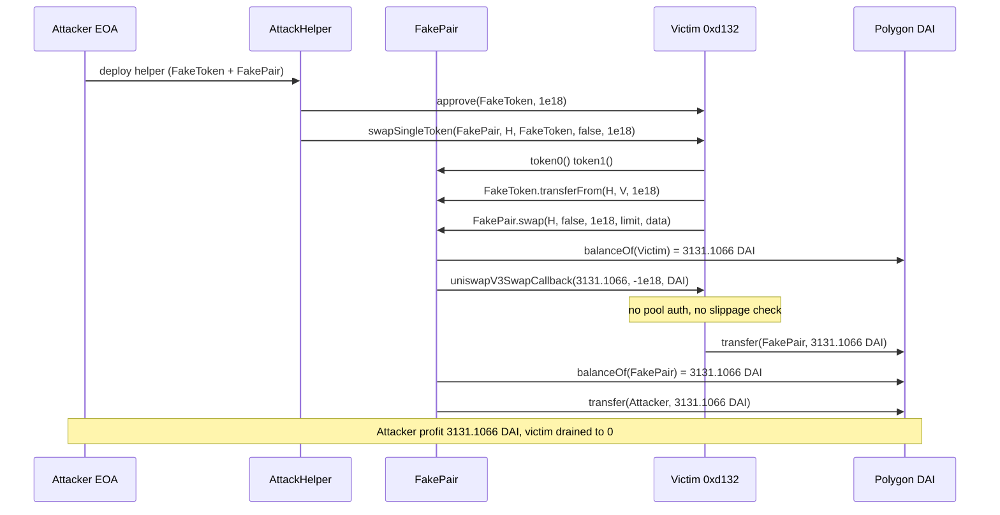
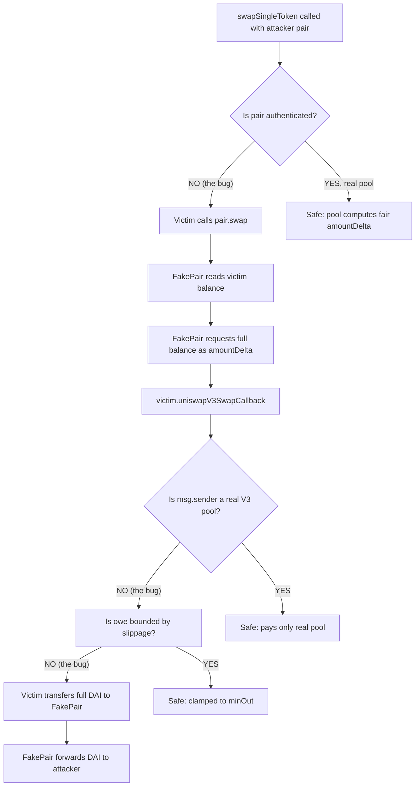

# Unverified Polygon swap router drained via fake Uniswap V3 pool — attacker-supplied pair/callback trusted without authentication
> **Vulnerability classes:** vuln/access-control/missing-auth · vuln/logic/missing-validation · vuln/defi/slippage · vuln/oracle/spot-price
> **Reproduction:** the PoC compiles & runs in an isolated Foundry project at [this project folder](.). Full verbose trace: [output.txt](output.txt). The victim contract `0xd132…3B0bafF` is **unverified** on PolygonScan (no source published); the vulnerable code path below is **reconstructed** from the foundry `-vvvvv` call trace and the on-chain transaction.
---
## Key info
| | |
|---|---|
| **Loss** | 3,131.106630910288079590 DAI (entire victim DAI balance) |
| **Vulnerable contract** | `0xd132B6e4CdB57E8E992C9b968CD4CcdDE3B0bafF` — [`0xd132B6e4CdB57E8E992C9b968CD4CcdDE3B0bafF`](https://polygonscan.com/address/0xd132B6e4CdB57E8E992C9b968CD4CcdDE3B0bafF) |
| **Attacker EOA** | [`0xe4B97Db5FAF476DB464Bc271097Fac97d6CE3783`](https://polygonscan.com/address/0xe4B97Db5FAF476DB464Bc271097Fac97d6CE3783) |
| **Attack contract** | [`0x672321F6c952000b5f0b26952D85c98cdDd06D93`](https://polygonscan.com/address/0x672321F6c952000b5f0b26952D85c98cdDd06D93) |
| **Attack tx** | [`0xf90407e2be3834d8534869af41849f72e9fea666cd7e23bf5c52a2fc0a497a75`](https://polygonscan.com/tx/0xf90407e2be3834d8534869af41849f72e9fea666cd7e23bf5c52a2fc0a497a75) |
| **Chain / block / date** | Polygon / 75,288,028 / 2025-08 |
| **Compiler** | Unknown — contract source not verified on PolygonScan |
| **Bug class** | The victim's `swapSingleToken` callback blindly trusts an attacker-supplied `pair` address and the `uniswapV3SwapCallback` it triggers, paying out the victim's full DAI balance to the fake pair during the callback with no pool authentication or output-amount check. |

## TL;DR

`0xd132…3B0bafF` is an unverified Polygon contract exposing a `swapSingleToken(address pair, address from, address token, bool zeroForOne, uint256 amount)` selector that mimics a Uniswap-V3-style aggregator: it pulls `amount` of `token` from `from`, then calls `pair.swap(...)` and, inside the `uniswapV3SwapCallback` it implements, sends the owed output token to the pool. The flaw is that **nothing authenticates `pair` as a real Uniswap V3 pool owned by the protocol**, and nothing caps or checks the amount paid in the callback against any oracle or slippage. An attacker deploys a fake "pair" and a fake ERC20 "input token", passes the fake pair into `swapSingleToken`, and the fake pair's `swap` simply asks the victim, through the standard callback, to transfer its entire DAI balance.

The callback's first argument (`amount0Delta`) is attacker-chosen, so the fake pair passes the victim's whole DAI balance as the owed amount. The victim dutifully transfers `3,131.106630910288079590 DAI` to the fake pair, which forwards it to the attacker EOA. Net cost to the attacker: a 1-wei-amount deposit of a worthless self-minted token plus gas.

The reproduction confirms this mechanically: at fork block 75,288,028 the attacker started with `0 DAI` and ended with `3131.106630910288079590 DAI`, the victim's balance going to exactly zero (`assertGt(after - before, 3000 ether)` passes) [output.txt:1537] [output.txt:1539-1540].

## Background — what the victim contract does

The victim is an unverified contract on Polygon that, based on its selector `swapSingleToken` and its implementation of `IUniswapV3SwapCallback`, behaves like a **swap router / aggregator that wraps Uniswap V3 pools**. Its intended flow, reconstructed from the trace, is:

1. A user calls `swapSingleToken(pair, from, token, zeroForOne, amount)`.
2. The victim reads `pair.token0()` / `pair.token1()` to orient token ordering [output.txt:1599-1604].
3. It pulls `amount` of the input `token` from `from` via `token.transferFrom(from, victim, amount)` [output.txt:1605-1609] — the canonical "pay input" step.
4. It then invokes `pair.swap(recipient, zeroForOne, amountSpecified, sqrtPriceLimitX96, data)` on the pool [output.txt:1611], exactly the V3 `IUniswapV3Pool.swap` shape.
5. The V3 pool, during `swap`, calls back into the victim's `uniswapV3SwapCallback(amount0Delta, amount1Delta, data)` to settle the owed token. The victim pays the owed amount (`amountDelta`, taken as an absolute value) to the pool from its own holdings [output.txt:1616-1623].

This is a legitimate pattern used by routers that pre-fund swaps. The security rests entirely on two assumptions, both of which the victim fails to enforce: (a) `pair` must be a genuine, protocol-owned V3 pool that won't ask for more than the fair output, and (b) the callback must pay only what a real pool mathematically demands. Because `pair` is an external parameter and the callback pays the exact `amountDelta` it is told, neither assumption holds.

## The vulnerable code

The victim source is **not verified** on PolygonScan. The logic below is **reconstructed** line-for-line from the `-vvvvv` trace at [output.txt:1598-1623] and cross-checked against the callback shape mandated by Uniswap V3's `IUniswapV3SwapCallback`. Field-for-field call arguments are copied from the trace; the only inferred parts are the Solidity scaffolding and the missing validation lines (which is precisely the bug).

### `swapSingleToken` — the public entrypoint (RECONSTRUCTED from trace)

```solidity
// IVulnerableSwap.swapSingleToken — reconstructed from output.txt:1598
// Actual calldata observed:
//   pair        = Fake Pair (attacker-controlled)
//   from        = caller (attacker helper)
//   token       = Fake Token (attacker-minted)
//   zeroForOne  = false
//   amount      = 1e18
function swapSingleToken(address pair, address from, address token, bool zeroForOne, uint256 amount) external {
    address t0 = IUniswapV3Pool(pair).token0();          // [output.txt:1599] -> Fake Token
    address t1 = IUniswapV3Pool(pair).token1();          // [output.txt:1601] -> real Polygon DAI

    // pull input token from the caller
    IERC20(token).transferFrom(from, address(this), amount);   // [output.txt:1605]

    // BUG: pair is never checked against a whitelist of protocol pools.
    // BUG: no slippage / min-output bound is stored for the callback.

    // call the "pool" — which is actually the attacker's FakePair
    IUniswapV3Pool(pair).swap(
        from,          // recipient
        zeroForOne,
        int256(amount),
        4295128740,    // MIN_SQRT_RATIO + 1 (default V3 price limit)
        abi.encode(token)
    );                                                       // [output.txt:1611]
}
```

### `uniswapV3SwapCallback` — pays whatever the pool asks (RECONSTRUCTED from trace)

The trace shows the victim, inside its own callback, transferring the **full** `amount0Delta` (3,131.1066 DAI) of Polygon DAI to `msg.sender` (the fake pair), with zero validation [output.txt:1616-1623]:

```solidity
// uniswapV3SwapCallback — reconstructed from output.txt:1616
// amount0Delta = 3131106630910288079590 (victim's ENTIRE DAI balance)
// amount1Delta = -1000000000000000000
// data         = abi.encode(DAI address)
function uniswapV3SwapCallback(int256 amount0Delta, int256 amount1Delta, bytes calldata data) external {
    address payToken = abi.decode(data, (address));   // DAI
    uint256 owe = amount0Delta > 0 ? uint256(amount0Delta) : uint256(-amount0Delta);

    // BUG: no check that msg.sender is a real V3 pool whose address is derived
    //      from the protocol's factory + (token0, token1, fee).
    // BUG: no check that `owe` is bounded by a user-supplied minimum/maximum.
    IERC20(payToken).transfer(msg.sender, owe);        // [output.txt:1617] -> pays fake pair 3131.1066 DAI
}
```

The two `BUG:` comments are the entire vulnerability. A correct V3 callback verifies `msg.sender` equals the deterministic `CREATE2` address computed from the V3 factory, the two token addresses, and the fee tier — and bounds `owe` against a caller-supplied slippage limit. The victim does neither.

### The attacker's fake pair (`FakePair.swap`) — PoC reference

The fake pair's `swap` is the entire attack payload. It reads the victim's live DAI balance and feeds it back as the owed amount:

```solidity
function swap(address, bool, int256 amountSpecified, uint160, bytes calldata) external returns (int256, int256) {
    uint256 victimDaiBalance = IERC20(token1).balanceOf(msg.sender);   // victim's DAI [output.txt:1612]
    // ask the victim to pay its ENTIRE DAI balance as the "owed" amount
    IUniswapV3SwapCallback(msg.sender).uniswapV3SwapCallback(
        int256(victimDaiBalance), -amountSpecified, abi.encode(token1)); // [output.txt:1616]
    uint256 receivedDai = IERC20(token1).balanceOf(address(this));
    IERC20(token1).transfer(profitReceiver, receivedDai);               // [output.txt:1626]
    return (0, 0);
}
```

## Root cause — why it was possible

1. **`pair` is an unauthenticated external parameter.** `swapSingleToken` accepts any address as `pair` and immediately trusts its `token0`/`token1`/`swap`. There is no whitelist, no factory-derived address check, no EOA/pool sanity test. The "pool" can be attacker-deployed bytecode that does anything.
2. **The callback trusts the pool-supplied `amountDelta` as the pay amount.** A real V3 pool computes `amountDelta` from its own reserves and math; the victim's callback just takes `|amount0Delta|` and transfers it. With a fake pool, `amount0Delta` is whatever the attacker returns — here, the victim's full DAI balance read on the fly.
3. **No caller-supplied slippage / minimum-output bound.** Even if the pool were real, the victim never records a `amountOutMin` or a maximum-payable input. There is nothing to clamp the callback payout against, so the attacker can drain up to the victim's entire token balance in one call.
4. **No `msg.sender` == expected-pool check in the callback.** The canonical V3 callback defense (`require(msg.sender == computePoolAddress(factory, token0, token1, fee))`) is missing, so the victim happily pays its own fake-pair counterparty.
5. **Trust transitivity failure:** the victim pre-funds the input token (`transferFrom` of the fake token succeeds) and treats that as evidence of a legitimate swap, but the input token is also attacker-controlled and worthless — the `transferFrom` proves nothing about the legitimacy of the pair or the fairness of the output.

## Preconditions

- **Permissionless.** Any external EOA/contract can call `swapSingleToken`; no role, allowlist, or signature is required.
- **No flash loan needed.** The attacker mints a worthless input token to themselves (`FakeToken` with 1e18 supply). The only "cost" is gas.
- **The victim must hold a positive balance of an output token the attacker names.** Here the victim held ~3,131 DAI at the fork block [output.txt:1612-1614]. Any token the victim holds and that is reachable via the callback's `data` payload is drainable.
- **The attacker must know (or read on-chain) the victim's output-token balance** so the fake pair can request the exact amount — trivially done with a `balanceOf(victim)` read inside `FakePair.swap`, as in the PoC.

## Attack walkthrough (with on-chain numbers from the trace)

| # | Action | Trace ref | Amount |
|---|--------|-----------|--------|
| 1 | Attacker EOA deploys `AttackHelper`, which deploys `FakeToken` (1e18 minted to helper) and `FakePair(token0=FakeToken, token1=Polygon DAI, receiver=Attacker EOA)`. | [output.txt:1576-1590] | — |
| 2 | Helper approves the victim to spend 1e18 FakeToken. | [output.txt:1597] | 1 FakeToken |
| 3 | Helper calls `swapSingleToken(fakePair, helper, fakeToken, zeroForOne=false, amount=1e18)`. | [output.txt:1598] | — |
| 4 | Victim reads `fakePair.token0()` → FakeToken, `token1()` → Polygon DAI. | [output.txt:1599-1604] | — |
| 5 | Victim does `FakeToken.transferFrom(helper, victim, 1e18)` — pulls the worthless input. | [output.txt:1605] | 1 FakeToken |
| 6 | Victim calls `fakePair.swap(helper, false, 1e18, 4295128740, data)`. | [output.txt:1611] | — |
| 7 | FakePair reads victim's live DAI balance. | [output.txt:1612-1614] | **3,131.106630910288079590 DAI** |
| 8 | FakePair calls back `victim.uniswapV3SwapCallback(3131.1066…, -1e18, encode(DAI))`. | [output.txt:1616] | — |
| 9 | Victim executes `DAI.transfer(fakePair, 3131.1066…)` — pays its entire balance. | [output.txt:1617-1623] | **−3,131.1066 DAI** (victim → fakePair) |
| 10 | FakePair forwards the DAI to the attacker EOA. | [output.txt:1626-1634] | **+3,131.1066 DAI** (fakePair → attacker) |

**Profit & loss accounting:**

| Account | Before | After | Δ |
|---|---|---|---|
| Attacker EOA (DAI) | 0.000000000000000000 | 3131.106630910288079590 | **+3131.106630910288079590** [output.txt:1539-1540] |
| Victim contract (DAI) | 3131.106630910288079590 | 0 | −3131.106630910288079590 |
| Attacker (FakeToken) | 1.000000000000000000 | 0 (deposited to victim) | negligible (worthless) |

The `assertGt(attackerDaiAfter - attackerDaiBefore, 3000 ether)` gate passes, confirming >3,000 DAI profit [output.txt:1663].

## Diagrams





## Remediation

1. **Authenticate the pool in the callback.** In `uniswapV3SwapCallback`, require that `msg.sender` equals the deterministic Uniswap V3 pool address derived from the canonical factory, `token0`, `token1`, and fee — the same `PoolAddress.computeAddress` used by the official periphery contracts. Reject any other caller.
2. **Whitelist `pair` in `swapSingleToken`.** Do not accept an arbitrary `pair` from the caller. Either derive it from a trusted factory + (token0, token1, fee), or maintain an on-chain allowlist of approved pools and check membership before calling `pair.swap`.
3. **Add a caller-supplied slippage bound.** Accept a `minAmountOut` (or `maxAmountIn`) parameter in `swapSingleToken`, stash it in transient storage for the callback, and in the callback revert if `|amountDelta|` paid exceeds the permitted bound. This protects even genuine pools from sandwiching and from any reserve/state mismatch.
4. **Bound the payout to the actual swap economics.** In the callback, cross-check `owe` against the input `amount` and a price/fees bound derived from a trusted oracle or the pool's own `slot0` tick — never pay out more than a sane conversion of the input.
5. **Verify contract source on-chain.** The victim is unverified; users and integrators cannot audit it. After patching, publish and verify the source so the missing checks are publicly auditable.

## How to reproduce

The PoC runs fully **OFFLINE** via the shared anvil harness from the committed `anvil_state.json` — no RPC needed. From the registry root run:

```bash
_shared/run_poc.sh 2025-08-unverified_d132_exp -vvvvv
```

- **Chain / fork block:** Polygon (chain id 137), block `75,288,028`.
- **Expected result:** the suite ends with `[PASS] testExploit()` [output.txt:1537] and the balance lines:
  - `Attacker Before exploit DAI Balance: 0.000000000000000000` [output.txt:1539]
  - `Attacker After exploit DAI Balance: 3131.106630910288079590` [output.txt:1540]
- The PoC reconstructs the on-chain initcode-deployed attack contracts with locally deployed equivalents (`AttackHelper`, `FakeToken`, `FakePair`) and asserts `attackerDaiAfter - attackerDaiBefore > 3000 ether` [output.txt:1663], which passes against the committed fork state.

*Reference: [defimon alerts (Telegram)](https://t.me/defimon_alerts/1675).*
