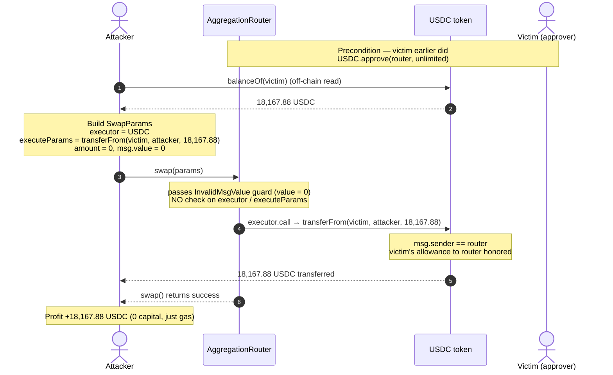
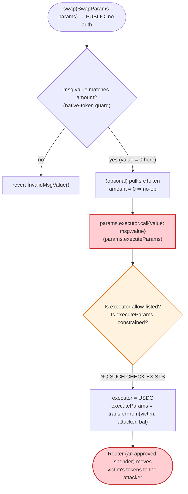
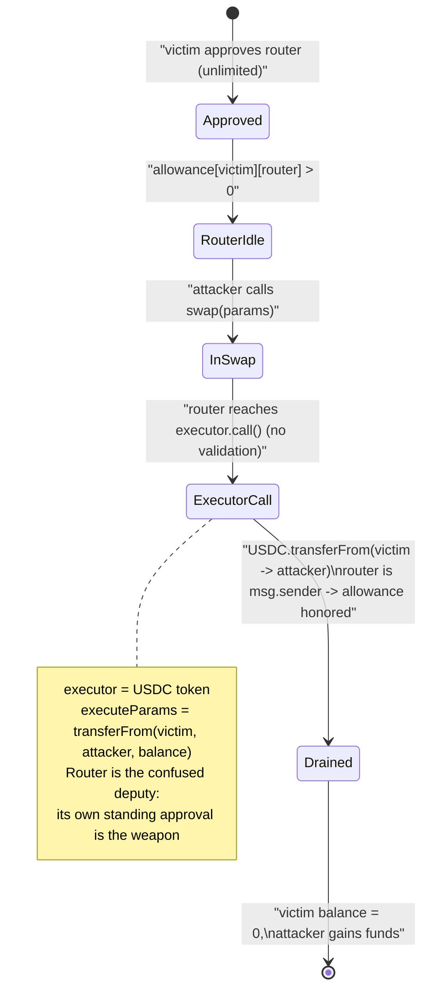

# Kame Aggregator Exploit — Unvalidated `executor.call()` in `swap()` Drains User Approvals

> **Vulnerability classes:** vuln/dependency/unsafe-external-call · vuln/logic/missing-validation

> **One-liner:** Kame's `AggregationRouter.swap()` performs a low-level
> `params.executor.call{value: msg.value}(params.executeParams)` with **zero validation**
> of the target or the calldata, so anyone can make the router — which holds standing
> ERC-20 approvals from ~830 users — execute `transferFrom(victim, attacker, balance)` on
> their behalf.

> **Reproduction status:** the PoC **compiles cleanly** in an isolated Foundry project at
> [this project folder](.), but the **live fork is unavailable** — the attack block
> `167,791,782` on Sei is pruned by every public/free archive RPC reachable at audit time
> (earliest available state is `~200M–213M`), and Sei has no Etherscan V2 API. The analysis
> below is reconstructed from the PoC, the on-chain **runtime bytecode** (fetched via
> `eth_getCode`), the decoded function selectors, a disassembly of the vulnerable `swap`
> path, and the project's official post-mortem. See
> [sources/README_SOURCES.md](sources/README_SOURCES.md) and
> [output.txt](output.txt) (the pruned-fork error trace).

---

## Key info

| | |
|---|---|
| **Loss (this victim / tx)** | **18,167.88 USD** (USDC, 6 decimals — pulled from one approving user) |
| **Loss (whole incident)** | **~$1,324,535** across **~830** users; ~$968K later recovered by team + white hats |
| **Vulnerable contract** | `AggregationRouter` — [`0x14bb98581Ac1F1a43fD148db7d7D793308Dc4d80`](https://seitrace.com/address/0x14bb98581Ac1F1a43fD148db7d7D793308Dc4d80?tab=contract) |
| **Vulnerable function** | `swap((address,address,uint256,address,bytes,bytes))` — selector `0xc4b87069` |
| **Victim (this PoC)** | `0x9A9F47F38276f7F7618Aa50Ba94B49693293Ab50` — had a residual USDC approval to the router |
| **Token drained** | USDC `0xe15fC38F6D8c56aF07bbCBe3BAf5708A2Bf42392` |
| **Attacker EOA** | [`0xd43d0660601e613f9097d5c75cd04ee0c19e6f65`](https://seitrace.com/address/0xd43d0660601e613f9097d5c75cd04ee0c19e6f65) |
| **Attack contract** | N/A (live attacker used a generic Multicall as the `executor`) |
| **Attack tx** | [`0x6150ec6b2b1b46d1bcba0cab9c3a77b5bca218fd1cdaad1ddc7a916e4ce792ec`](https://seitrace.com/tx/0x6150ec6b2b1b46d1bcba0cab9c3a77b5bca218fd1cdaad1ddc7a916e4ce792ec) |
| **Chain / block / date** | Sei (pacific-1, chainid 1329) / 167,791,783 / September 2025 |
| **Compiler** | Solidity ^0.8 (OZ `Ownable` + `SafeERC20`; optimizer settings unknown — source not downloadable) |
| **Bug class** | Arbitrary external call / unvalidated executor → approval theft (`transferFrom` abuse) |

---

## TL;DR

`AggregationRouter` is a DEX-aggregator router on Sei. To execute a swap it forwards the
user's tokens to "an executor" and then performs a **single, fully attacker-supplied
low-level call**:

```solidity
(bool success, bytes memory returnData) =
    params.executor.call{value: msg.value}(params.executeParams);
```

Neither `params.executor` (the call target) nor `params.executeParams` (the calldata) is
validated, allow-listed, or constrained. Aggregator routers are designed for users to grant
them token approvals so they can pull funds during a swap. Hundreds of Kame users had left
**unlimited / residual ERC-20 approvals** to the router.

An attacker therefore calls `swap(...)` with:

- `params.executor = USDC token` (or, in the live attack, the canonical Multicall
  `0xcA11bde05977b3631167028862bE2a173976CA11` to batch many victims),
- `params.executeParams = transferFrom(victim, attacker, victimBalance)`.

The router has `msg.sender == AggregationRouter`, so the victim's approval to the router is
honored, and the victim's entire balance is transferred to the attacker. No swap, no
liquidity manipulation, no flash loan — just the router being weaponized as a confused
deputy against its own approvals.

This single PoC reproduces one victim being drained of **18,167.88 USDC**; the full incident
hit ~830 users for ~$1.32M.

---

## Background — what Kame Aggregator does

Kame is a swap aggregator on the Sei EVM. Like 1inch / 0x / Paraswap, its router contract is
the address users `approve()` so it can `transferFrom` their input token and route it through
one or more liquidity venues (the "executor") to produce the output token.

From the on-chain runtime bytecode (the verified Solidity could not be downloaded — see
[sources/README_SOURCES.md](sources/README_SOURCES.md)), the router's public surface is:

| Selector | Signature | Role |
|----------|-----------|------|
| `0xc4b87069` | `swap((address,address,uint256,address,bytes,bytes))` | **the swap entrypoint (vulnerable)** |
| `0x6ccae054` | `rescueFunds(address,address,uint256)` | owner-only token/ETH rescue |
| `0x715018a6` | `renounceOwnership()` | OZ `Ownable` |
| `0x8da5cb5b` | `owner()` | OZ `Ownable` |
| `0xf2fde38b` | `transferOwnership(address)` | OZ `Ownable` |

Custom errors in the bytecode (`InvalidMsgValue()`, `ETHTransferFailed()`,
`SafeERC20FailedOperation(address)`) show it uses `SafeERC20` for token moves and a guard on
ETH value — but, crucially, **no guard on the executor call target**.

The `SwapParams` struct (from the PoC interface, which matches selector `0xc4b87069` exactly):

```solidity
struct SwapParams {
    address srcToken;        // token the user is selling
    address dstToken;        // token the user wants
    uint256 amount;          // amount of srcToken
    address payable executor; // ⚠️ the contract the router will .call()
    bytes executeParams;     // ⚠️ the calldata the router will pass to executor
    bytes extraData;
}
```

---

## The vulnerable code

The verified `.sol` was not retrievable (Sei has no Etherscan V2; seitrace returned HTTP 522).
The vulnerable line is confirmed verbatim by the Kame post-mortem:

```solidity
// AggregationRouter.swap(SwapParams calldata params)
(bool success, bytes memory returnData) =
    params.executor.call{value: msg.value}(params.executeParams);   // ⚠️ no validation
```

and is visible in the contract's runtime bytecode disassembly of the `swap` handler
(dispatcher jumps to pc `0x00be`; see [sources/README_SOURCES.md](sources/README_SOURCES.md)):

```
527: CALLVALUE                 ; msg.value
535: <load params.executor>    ; attacker-controlled target, from calldata
566: GAS
567: CALL                      ; params.executor.call{value: msg.value}(params.executeParams)
572: RETURNDATASIZE ...        ; capture returnData (no target allow-list anywhere before)
```

The only checks on the `swap` path before the `CALL` are an `InvalidMsgValue()` guard
(`params.amount`-vs-`msg.value` for native swaps, pc ~400) and an `is-this-the-native-token`
branch (pc ~389). **There is no check that `executor` is a trusted/registered router, no
check that `executeParams` does not target an ERC-20's `transferFrom`, and no check that the
caller owns the funds being moved.**

How the PoC weaponizes it ([test/Kame_exp.sol:53-77](test/Kame_exp.sol#L53-L77)):

```solidity
function createSwapParams(address tokenToUseInSwap, address tokenToPull, address targetUser)
    internal returns (IAggregationRouter.SwapParams memory)
{
    IAggregationRouter.SwapParams memory params;
    params.srcToken = tokenToUseInSwap;   // syUSD (cosmetic — amount is 0)
    params.dstToken = tokenToUseInSwap;
    params.amount   = 0;                  // no real swap; just trigger the executor call
    params.executor = payable(tokenToPull); // ⚠️ executor = the USDC token itself
    params.executeParams = abi.encodeWithSignature(
        "transferFrom(address,address,uint256)",
        targetUser,                        // from = victim
        address(this),                     // to   = attacker
        TokenHelper.getTokenBalance(tokenToPull, targetUser)  // = victim's FULL USDC balance
    );
    params.extraData = hex"01";
    return params;
}

function testExploit() public balanceLog {
    router.swap(createSwapParams(syUSD, USDC, targetToTakeFrom));
}
```

When the router executes `USDC.transferFrom(victim, attacker, victimBalance)`, USDC sees
`msg.sender == router`, finds the victim's standing allowance to the router, and moves the
victim's tokens to the attacker.

---

## Root cause — why it was possible

A swap aggregator must (a) be approved by users to move their tokens, and (b) call out to
liquidity venues during a route. Those two facts make the router a **standing custodian of
allowances**. The fatal mistake is letting the *caller* of `swap()` choose **both** the call
target and the calldata with no constraints. That turns "execute my route" into "execute any
call as the router," and because the router holds approvals, the most valuable such call is
`transferFrom(any_approver, attacker, their_balance)`.

The four design failures that compose into a critical bug:

1. **Unvalidated executor target.** `params.executor` can be *any* address — including the
   token contracts themselves. A safe router restricts executors to a registered/audited
   allow-list (or routes through internal logic only).
2. **Unvalidated executeParams.** The calldata is passed straight through. There is no check
   that it isn't an ERC-20 `transferFrom`/`approve`/`permit`. A safe router would never let
   arbitrary calldata flow to arbitrary targets while holding allowances.
3. **The router itself holds the allowances.** Because `msg.sender` of the malicious
   `transferFrom` is the router, every victim's approval *to the router* is the exploit's
   ammunition. Residual / unlimited approvals (common UX) maximized the blast radius.
4. **No "spend only the caller's own funds" invariant.** A correct router only ever pulls
   `srcToken` from `msg.sender` (or from an explicitly-signed permit owner). Here the pulled
   address is whatever the attacker puts in `executeParams`, completely decoupled from the
   caller.

This is the canonical "router as confused deputy" class — the same shape as historical
`approve`/`transferFrom` router bugs (e.g. unvalidated multicall/executor in DEX aggregators).
The `amount` field is irrelevant; the attacker sets it to `0` and ignores the "swap"
entirely — only the unguarded executor call matters.

---

## Preconditions

- **Standing approval to the router.** The victim (`0x9A9F…Ab50`) must have a non-zero,
  un-revoked ERC-20 allowance to `AggregationRouter` covering the amount being pulled. The
  PoC reads the victim's *full* USDC balance and pulls all of it, implying an unlimited
  (or balance-covering) residual approval. ~830 users were in this state.
- **Permissionless `swap()`.** No access control on `swap`, so any EOA can call it. (Confirmed
  by the dispatcher — `swap` is reachable directly from the public ABI with no owner check.)
- **No working capital required.** `params.amount = 0` and `msg.value = 0`; the attack costs
  only gas. It is **not** a flash-loan / liquidity attack — it is pure approval theft.

---

## Attack walkthrough

> **Live-trace note: fork unavailable.** Block 167,791,782 is pruned on every reachable Sei
> RPC, so on-chain reserve/balance numbers below for the *individual victim* are the PoC's
> declared loss (18,167.88 USDC); incident-wide figures are from the post-mortem. The
> attack-logic steps are confirmed by the PoC code, the runtime bytecode, and the post-mortem.

| # | Step | Actor → Target | Effect |
|---|------|----------------|--------|
| 0 | Victim previously approved `AggregationRouter` for USDC (unlimited/residual) | victim → USDC | Router can `transferFrom` victim's USDC |
| 1 | Read victim's USDC balance off-chain (`balanceOf`) | attacker | Determines the amount to steal (= full balance) |
| 2 | Build `SwapParams`: `executor = USDC`, `executeParams = transferFrom(victim, attacker, balance)`, `amount = 0` | attacker | Crafts the malicious "route" |
| 3 | Call `router.swap(params)` | attacker → AggregationRouter | Router enters `swap`, passes `msg.value`-guard (value 0), reaches the executor `CALL` |
| 4 | Router executes `USDC.transferFrom(victim, attacker, balance)` | AggregationRouter → USDC | `msg.sender == router`; victim's allowance honored; **18,167.88 USDC → attacker** |
| 5 | Repeat with `executor = Multicall` to batch many victims in one tx (live attack) | attacker | Scales to ~830 users, ~$1.32M total |

### Profit / loss accounting (this PoC, one victim)

| Item | Amount |
|---|---:|
| Attacker capital in | 0 USDC (only gas) |
| USDC pulled from victim `0x9A9F…Ab50` | 18,167.88 USDC |
| **Net attacker profit** | **+18,167.88 USDC** |
| **Victim loss** | **−18,167.88 USDC** |

Across the whole incident: ~**$1,324,535** drained from ~**830** approvers; ~$946K recovered
by the Kame team and ~$22K by white hats afterward.

---

## Diagrams

### Sequence of the attack (single victim)



### Control flow of the vulnerable `swap()`



### Approval-theft state model (confused-deputy)



---

## Why each PoC choice

- **`executor = USDC` (the token to pull):** the router's `.call()` is pointed straight at the
  ERC-20, so the router itself becomes the `msg.sender` of `transferFrom` — exactly the spender
  the victim approved.
- **`executeParams = transferFrom(victim, attacker, balance)`:** drains the victim's *entire*
  balance (the PoC reads `balanceOf(victim)` live to maximize the pull).
- **`amount = 0`, `srcToken = dstToken = syUSD`:** no actual swap is performed — those fields
  are cosmetic. The exploit needs only the unguarded executor call to fire, so the "swap"
  semantics are bypassed entirely.
- **`extraData = hex"01"`:** a non-empty placeholder to satisfy ABI decoding; not semantically
  important to the bug.
- **Live attacker used Multicall (`0xcA11…CA11`) as `executor`:** to batch hundreds of
  per-victim `transferFrom` calls into a single `swap()`, scaling the single-victim PoC to
  ~830 users in one transaction.

---

## Remediation

1. **Allow-list the executor.** `params.executor` must be a registered, audited liquidity
   adapter — never a free-form address. Reject any executor not in the registry.
2. **Never let arbitrary calldata flow to arbitrary targets while holding approvals.** If a
   generic `call` is unavoidable, forbid the target from being any ERC-20 the router has
   allowances for, and forbid `transferFrom`/`approve`/`permit`/`permitTransferFrom`
   selectors in `executeParams`.
3. **Only ever pull the caller's own funds.** The router should `transferFrom(msg.sender, …)`
   the declared `srcToken`/`amount` itself, and route *those* funds — decoupling the pulled
   address from attacker-controlled calldata. Use Permit2 with signed, caller-bound transfers.
4. **Drop standing approvals.** Prefer pull-then-route within a single call with exact amounts,
   or Permit2 single-use permits, so there is no residual allowance to weaponize. Aggressively
   prompt users to set exact (not unlimited) approvals.
5. **Add re-entrancy / value-flow invariants.** Assert post-call that the router's own and
   the caller's balances changed only as intended, and that no third party's balance was
   touched.

*Operationally, Kame's correct first response (mirrored here) was to tell all users to
**revoke** their router approvals — which neutralizes the attack regardless of the code,
since the exploit is entirely powered by those allowances.*

---

## How to reproduce

The PoC was extracted into a standalone Foundry project (the umbrella DeFiHackLabs repo does
not whole-compile). It **compiles**, but the **fork is unavailable**:

```bash
_shared/run_poc.sh 2025-09-Kame_exp -vvvvv
```

**Expected (current) result — fork unavailable:**

```
[FAIL: vm.createSelectFork: ... requested height 167791782 has been pruned;
       earliest available is 213679999] setUp()
```

To actually run it green you need a **Sei archive RPC that retains state at block
167,791,782** (≈ block 167.79M). At audit time no free/public Sei endpoint does — all probed
endpoints (`evm-rpc.sei-apis.com`, `sei.drpc.org`, `sei-evm-rpc.publicnode.com`,
`evm-rpc-sei.stingray.plus`, …) prune below ~200M, and `rpc.ankr.com/sei` requires a key.
Once such an endpoint is available, set it in
[`foundry.toml`](foundry.toml) under `sei = "..."` and re-run:

```bash
forge test -vvvvv
```

Expected on a working archive fork: `[PASS] testExploit()` with the victim's full USDC
balance (≈ 18,167.88 USDC) transferred to the test contract.

- Vulnerable contract source: not downloadable (Sei has no Etherscan V2; seitrace HTTP 522).
  Evidence used instead — runtime bytecode + disassembly in
  [sources/README_SOURCES.md](sources/README_SOURCES.md).
- Full (pruned-fork) trace: [output.txt](output.txt).

---

*References: Kame post-mortem — https://kameagg.substack.com/p/post-mortem-kame-aggregator-exploit ·
Quadriga Initiative case study — https://quadrigainitiative.com/casestudy/kameaggregatorswapfunctionarbitraryexecutorcallbug.php ·
SlowMist Hacked registry (Kame, Sei).*
