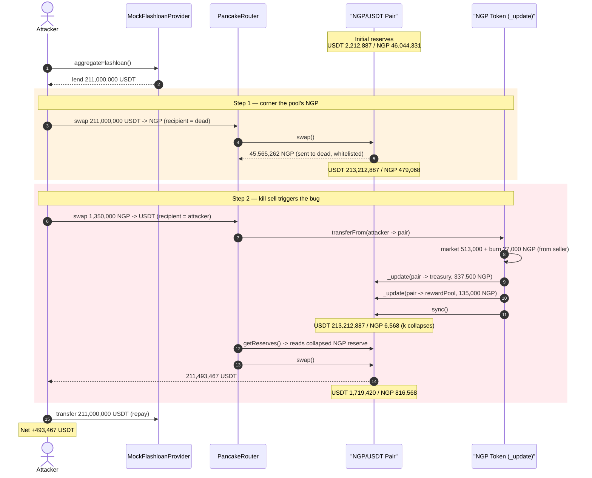
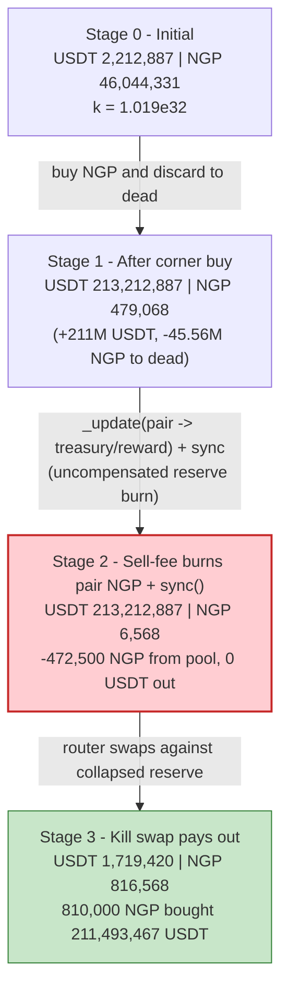
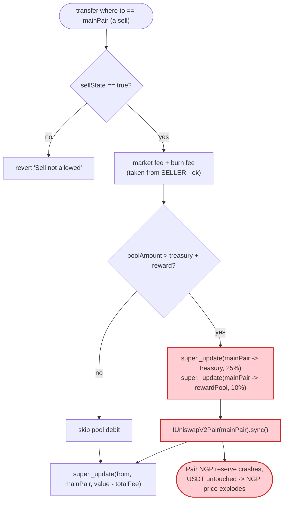

# NGP Token Exploit — Sell-Fee Burns NGP *Out of the Pair* and `sync()`s, Collapsing the AMM Reserve

> **Vulnerability classes:** vuln/logic/incorrect-order-of-operations · vuln/oracle/spot-price

> **Reproduction:** the PoC compiles & runs in an isolated Foundry project at
> [this project folder](.) (the umbrella DeFiHackLabs repo contains many unrelated
> PoCs that do not whole-compile, so this one was extracted).
> Full verbose trace: [output.txt](output.txt).
> Verified vulnerable source: [sources/Token_d2F262/contracts_Token.sol](sources/Token_d2F262/contracts_Token.sol).

---

## Key info

| | |
|---|---|
| **Loss** | **~493,467 USDT in this single simulated transaction** (the campaign drained ~2M USDT total across multiple txs) |
| **Vulnerable contract** | `NGP` (`Token`) — [`0xd2F26200cD524dB097Cf4ab7cC2E5C38aB6ae5c9`](https://bscscan.com/address/0xd2F26200cD524dB097Cf4ab7cC2E5C38aB6ae5c9#code) |
| **Victim pool** | NGP/USDT PancakePair — [`0x20cAb54946D070De7cc7228b62f213Fccf3ffb1E`](https://bscscan.com/address/0x20cAb54946D070De7cc7228b62f213Fccf3ffb1E) |
| **Attacker EOA** | [`0x0305ddd42887676ec593b39ace691b772eb3c876`](https://bscscan.com/address/0x0305ddd42887676ec593b39ace691b772eb3c876) |
| **Attacker contract** | [`0x2d2a69bdafe4aad981da4e98721b3b81a0315363`](https://bscscan.com/address/0x2d2a69bdafe4aad981da4e98721b3b81a0315363) |
| **Attack tx** | [`0xc2066e0dff1a8a042057387d7356ad7ced76ab90904baa1e0b5ecbc2434df8e1`](https://bscscan.com/tx/0xc2066e0dff1a8a042057387d7356ad7ced76ab90904baa1e0b5ecbc2434df8e1) |
| **Chain / block / date** | BSC / fork at 61,515,894 (`61515895 - 1`) / Sept 2025 |
| **Compiler** | Token: Solidity v0.8.28, optimizer 200 runs · Pair: v0.5.16 |
| **Bug class** | Broken AMM invariant via a fee mechanism that **debits the pair's own reserve** and `sync()`s |
| **Post-mortem** | [SolidityScan — NGP Token Hack Analysis](https://blog.solidityscan.com/ngp-token-hack-analysis-414b6ca16d96) |

---

## TL;DR

`NGP` is a fee-on-transfer token. On every *sell* (any transfer where `to == mainPair`), its
`_update` hook does something a token must never do: it moves the **treasury fee + reward fee
portions out of the liquidity pair's own NGP balance** (`super._update(mainPair, treasuryAddress, …)`
and `super._update(mainPair, rewardPoolAddress, …)`) and then calls `IUniswapV2Pair(mainPair).sync()`
([contracts_Token.sol:294-301](sources/Token_d2F262/contracts_Token.sol#L294-L301)).

`sync()` forces the pair to accept its *current, now-depleted* NGP balance as the new reserve — **no
USDT leaves the pair**. The constant product `k = reserveUSDT · reserveNGP` collapses, and the
marginal price of NGP-into-USDT explodes. The attacker engineers a state where, on a single sell, the
fee deletes nearly *all* of the pair's NGP reserve, then receives an enormous USDT output from the same
swap.

Concretely, the attacker (with a 211M USDT flash loan):

1. **Corners the pool's NGP** — swaps 211M USDT → 45.56M NGP and discards it to `dead`, shrinking the
   pair's NGP reserve from 46.04M down to **479,068 NGP** while loading 213.2M USDT into the pair.
2. **Sells 1,350,000 NGP back.** The sell-fee hook burns **472,500 NGP out of the pair** (treasury +
   reward) and `sync()`s — crashing the pair's NGP reserve from 479,068 → **6,568 NGP** while the USDT
   reserve stays at 213.2M. The very same swap then prices the 810,000 NGP "amount-in" against the
   tiny 6,568 reserve and pays out **211,493,467 USDT**.
3. **Repays** the 211M flash loan and keeps **493,467 USDT** profit.

---

## Background — what NGP does

`NGP` ([source](sources/Token_d2F262/contracts_Token.sol)) is a standard OpenZeppelin `ERC20` with a
fee-on-transfer hook implemented by overriding `_update`. It tracks a `mainPair` (its NGP/USDT
PancakeSwap pair, created in the constructor) and applies different logic depending on whether a
transfer is a buy (`from == mainPair`), a sell (`to == mainPair`), or a plain transfer.

On a **sell** ([:277-312](sources/Token_d2F262/contracts_Token.sol#L277-L312)) it splits the sold
`value` into:

| Fee | Deployed rate (from the trace's `FlowIntoPool` event) | Taken from | Destination |
|---|---|---|---|
| Market fee | 38% | the seller (`from`) | `marketAddress` |
| Burn fee | 2% | the seller (`from`) | `dead` |
| Treasury fee | 25% | **the pair (`mainPair`)** | `treasuryAddress` |
| Reward fee | 10% | **the pair (`mainPair`)** | `rewardPoolAddress` |

The source defaults (`marketFeeRate=3%`, `burnFeeRate=2%`, `treasuryRate=10%`, `rewardRate=60%`) had
been changed on-chain via `setFeeRates`; the rates above are the *actual* rates observed in the attack
transaction. Either way, the structural flaw is identical: **the treasury and reward fees are sourced
from the pair's balance and followed by a `sync()`.**

Key state at the fork block (read from the trace):

| Item | Value |
|---|---|
| Pair `token0` / `token1` | USDT / NGP → `reserve0 = USDT`, `reserve1 = NGP` |
| Pair USDT reserve (initial) | 2,212,887 USDT |
| Pair NGP reserve (initial) | 46,044,331 NGP |
| `marketFeeRate` (deployed) | 38% |
| `burnFeeRate` (deployed) | 2% |
| `treasuryRate` (deployed) | 25% |
| `rewardRate` (deployed) | 10% |

---

## The vulnerable code

### The sell-fee path debits the pair and `sync()`s

```solidity
// sell or add liquidity
if (to == mainPair) {
    require(sellState, "Sell not allowed");
    _checkTransferCooldown(from);

    uint256 marketFee  = (value * marketFeeRate) / RATIO_PRECISION;
    uint256 burnAmount = (value * burnFeeRate)   / RATIO_PRECISION;
    if (!isLpStopBurn()) {
        super._update(from, DEAD, burnAmount);           // burn fee — from the SELLER, ok
    } else {
        super._update(from, marketAddress, burnAmount);
    }
    super._update(from, marketAddress, marketFee);        // market fee — from the SELLER, ok

    uint256 totalFee        = marketFee + burnAmount;
    uint256 treasuryAmount  = (value * treasuryRate) / RATIO_PRECISION;
    uint256 rewardAmount    = (value * rewardRate)   / RATIO_PRECISION;
    uint256 burnPoolAmount  = treasuryAmount + rewardAmount;
    uint poolAmount = this.balanceOf(mainPair);
    if (poolAmount > burnPoolAmount) {
        super._update(mainPair, treasuryAddress, treasuryAmount);   // ⚠️ taken FROM THE PAIR
        super._update(mainPair, rewardPoolAddress, rewardAmount);   // ⚠️ taken FROM THE PAIR
        IUniswapV2Pair(mainPair).sync();                            // ⚠️ force the reduced balance as reserve
    }
    value = value - totalFee;
    emit FlowIntoPool(from, to, value, marketFee, burnAmount, treasuryAmount, rewardAmount);
}

super._update(from, to, value);   // the remaining NGP actually arrives at the pair
```

([contracts_Token.sol:277-319](sources/Token_d2F262/contracts_Token.sol#L277-L319))

The two `super._update(mainPair, …)` calls **move NGP out of the pair's balance** to the
treasury/reward addresses, and `IUniswapV2Pair(mainPair).sync()`
([IUniswapV2Pair.sol declaration](sources/Token_d2F262/uniswap_v2-core_contracts_interfaces_IUniswapV2Pair.sol)) tells the
pair to set `reserve1 = currentNGPBalance` ([PancakePair.sol:366-379](sources/PancakePair_20cAb5/PancakePair.sol#L366-L379),
called from `sync()`). No USDT moves, so `k` is silently reduced.

### Why the AMM trusts `sync()`

PancakeSwap's `swap()` only enforces `x·y ≥ k` against **whatever the reserves currently are**
([PancakePair.sol:452+](sources/PancakePair_20cAb5/PancakePair.sol#L452)). `sync()` exists so a pair
can re-baseline to its real balances. The NGP token weaponizes this: it shrinks the pair's NGP
balance and immediately `sync()`s, so by the time the router computes `getAmountOut` for the seller's
own swap, the NGP reserve is artificially tiny and the USDT payout is enormous.

---

## Root cause — why it was possible

A fee-on-transfer token may legitimately tax the **sender**. NGP's market fee (38%) and burn fee (2%)
are taken from `from` (the seller) — that is fine. The fatal mistake is that the **treasury (25%) and
reward (10%) fees are taken from `mainPair`'s balance**, i.e. the protocol pays its own fees out of the
liquidity pool's reserves, and then calls `sync()` to make the pool acknowledge the loss.

This is an *un-compensated removal of one side of the pool's reserves*:

> On every sell of `value` NGP, `(treasuryRate + rewardRate) × value = 35% × value` NGP is destroyed
> from the pair and `sync()`ed. The USDT side is untouched. The product `k` shrinks, and the marginal
> NGP→USDT price rises **without anyone paying for it**.

The composition that turns this into a clean drain:

1. **The fee removed from the pool is proportional to the *seller's* `value`, not to the pool's size.**
   If the attacker first shrinks the pool's NGP reserve to a small number, a single sell whose 35%
   fee is comparable to that reserve will wipe almost the entire NGP reserve in one shot.
2. **`sync()` runs *before* the swap math is evaluated.** The fee debit + `sync()` happen inside the
   NGP `transferFrom` that the router performs at the *start* of `swapExactTokensForTokensSupportingFeeOnTransferTokens`,
   so when the router later calls `getReserves()` it reads the already-collapsed reserve and computes a
   wildly favorable output for the same swap.
3. **`dead` and the contract are whitelisted** ([:78-80, 256-260](sources/Token_d2F262/contracts_Token.sol#L78-L80)),
   so the "corner the pool" step (swapping USDT→NGP and sending NGP to `dead`) is a pure system transfer
   that does not trip the fee/limit logic — it just lets the attacker cheaply drain the pool's NGP
   reserve down to a small base before the kill swap.

The per-account daily buy limit and 30-minute cooldown
([:172-196, 263-274](sources/Token_d2F262/contracts_Token.sol#L172-L196)) are the only friction; in the
real attack the attacker bought NGP across multiple addresses/txs to accumulate the seed NGP. The PoC
simulates that accumulation with `deal(ngpToken, attacker, 1,350,000 NGP)`.

---

## Preconditions

- A live NGP/USDT PancakeSwap pair with real USDT liquidity (213.2M USDT on the USDT side after the
  attacker's first swap — most of which is the attacker's own flash-loaned capital, but the residual
  ~493K is genuine LP value the attacker walks off with).
- Sell enabled (`sellState == true`) and `poolAmount > treasuryAmount + rewardAmount` so the
  pool-debit branch is taken ([:295](sources/Token_d2F262/contracts_Token.sol#L295)).
- Enough seed NGP for the kill sell (1,350,000 NGP). In the real attack the attacker bought this over
  multiple transactions because it was not whitelisted and is subject to the daily buy cap; the PoC
  uses `deal` to short-circuit that accumulation.
- USDT working capital to corner the pool. The PoC uses a `MockFlashloanProvider` that lends 211M USDT
  and requires full repayment in the same call, so the attack is **flash-loanable** and needs no
  attacker principal.

---

## Attack walkthrough (with on-chain numbers from the trace)

The pair's `token0 = USDT`, `token1 = NGP`, so `reserve0 = USDT`, `reserve1 = NGP`. All figures are
pulled directly from `Sync`/`Swap`/`FlowIntoPool` events and balance reads in
[output.txt](output.txt) (decimals dropped, all 1e18). The whole exploit runs inside
`flashloanCallback()` ([test/NGP_exp.sol:60-98](test/NGP_exp.sol#L60-L98)).

| # | Step | Pair USDT (reserve0) | Pair NGP (reserve1) | Notes |
|---|------|---------------------:|--------------------:|-------|
| 0 | **Initial** (fork state) | 2,212,887 | 46,044,331 | Honest pool, `k ≈ 1.019e32`. |
| 1 | **Borrow** 211,000,000 USDT from `MockFlashloanProvider` | — | — | Attacker now holds 211M USDT + 1.35M NGP. |
| 2 | **Corner buy**: `swap 211,000,000 USDT → 45,565,262 NGP`, recipient = `dead` | 213,212,887 | **479,068** | NGP→`dead` is a whitelisted system transfer; pool NGP shrunk ~99%. |
| 3 | **Kill sell**: `swap 1,350,000 NGP → USDT`, recipient = attacker. NGP `transferFrom` fires the sell-fee hook | — | — | See breakdown below. |
| 3a | &nbsp;&nbsp;hook: market fee 513,000 NGP (38%, from seller → `0xae6B…`), burn 27,000 NGP (2%, from seller → `dead`) | 213,212,887 | 479,068 | Seller-side fees only. |
| 3b | &nbsp;&nbsp;hook: **treasury 337,500 + reward 135,000 = 472,500 NGP burned FROM THE PAIR**, then `sync()` | 213,212,887 | **6,568** | ⚠️ `Sync(reserve0=213,212,887, reserve1=6,568)` — `k` collapses to ~1.4e27. |
| 3c | &nbsp;&nbsp;remaining `value − totalFee = 810,000 NGP` transferred into the pair; router calls `getReserves()` → reads (213.2M USDT, **6,568 NGP**) | — | — | The router prices the swap against the collapsed reserve. |
| 3d | &nbsp;&nbsp;`Pair.swap()` pays out **211,493,467 USDT** for the 810,000-NGP amount-in | **1,719,420** | 816,568 | `Swap(amount1In=810,000, amount0Out=211,493,467)`. |
| 4 | **Repay** flash loan: `transfer 211,000,000 USDT` back to provider | — | — | Provider's `require(balance == lent)` passes. |
| 5 | **End** | — | — | Attacker USDT = **493,467**. |

**The math at the kill swap.** PancakeSwap's `getAmountOut` is
`out = (in·9975·reserveOut) / (reserveIn·10000 + in·9975)`. After `sync()`, `reserveIn = 6,568.75 NGP`
and `reserveOut = 213,212,887.45 USDT`, with `in = 810,000 NGP`:

```
out = (810,000·9975·213,212,887.45) / (6,568.75·10000 + 810,000·9975)
    = 211,493,467.02 USDT
```

This matches the trace's `amount0Out` to the wei. The fee-scaled input (`810,000·9975`) dwarfs the
scaled reserve (`6,568·10000`), so the 810,000-NGP sell buys essentially the *entire* USDT side of the
pool at a price that the pre-collapse pool would never have offered.

### Profit accounting (USDT)

| Direction | Amount |
|---|---:|
| Borrowed (flash loan) | 211,000,000 |
| Spent — corner buy (USDT → NGP to `dead`) | 211,000,000 |
| Received — kill swap output | 211,493,467 |
| Repaid — flash loan | 211,000,000 |
| **Net profit** | **+493,467** |

The 493,467 USDT profit is exactly the surplus the kill swap extracted over the borrowed amount — value
taken from the pool's honest LPs by collapsing the NGP reserve for free.

---

## Diagrams

### Sequence of the attack



### Pool state evolution



### The flaw inside the sell branch of `_update`



---

## Why each magic number

- **`FLASHLOAN_AMOUNT = 211,000,000 USDT`** — sized so the corner buy drains the pool's NGP reserve as
  far down as possible (46.04M → 479,068 NGP) while loading the USDT side to 213.2M USDT. The bigger
  this is, the smaller the post-corner NGP reserve, and the larger the eventual payout per unit of
  fee-burned NGP. The PoC comment notes both magic values are pre-computed to (1) trigger the
  `sync()` in the sell branch and (2) minimize the pair's NGP balance.
- **`PREPARATION_NGP_AMOUNT = 1,350,000 NGP`** — the kill-sell size. Its 35% pool-debit (472,500 NGP)
  is just under the cornered pool reserve (479,068 NGP), so `sync()` leaves only **6,568 NGP** — a
  reserve small enough that the 810,000-NGP effective amount-in buys nearly the whole USDT side. In
  the real attack this NGP was accumulated by repeated whitelisted-free buys across addresses; the PoC
  uses `deal` to simulate it.

---

## Remediation

1. **Never source fees from the liquidity pool.** A transfer fee must only ever debit the parties to
   the transfer (the sender). Removing `super._update(mainPair, treasuryAddress, …)` /
   `super._update(mainPair, rewardPoolAddress, …)` + `sync()` eliminates the bug entirely. If
   "the pool funds the treasury/reward" is a product requirement, implement it as the protocol buying
   and redistributing from its *own* treasury, not as a side-channel deletion of pool reserves.
2. **Never call `pair.sync()` after manipulating the pair's balance from outside `mint`/`burn`/`swap`.**
   `sync()` re-baselines reserves to balances; combining it with an uncompensated single-sided debit is
   exactly how `k` is broken in the attacker's favor.
3. **If the pool must lose tokens, route it through the pair's own `burn()` (LP redemption)** so both
   reserves move pro-rata and `k` is preserved.
4. **Take fees in the *output* token after the swap, not as a pre-swap reserve mutation.** Many fee
   tokens tax the recipient on the way out; that does not touch the pool's invariant.
5. **Cap single-operation reserve impact.** Any operation that can move a pool reserve by a large
   percentage of its current value should revert — a fee that lands as ~99% of a thinned reserve is a
   red flag.

---

## How to reproduce

The PoC was extracted into a standalone Foundry project (the umbrella DeFiHackLabs repo has many
unrelated PoCs that fail to compile under `forge test`'s whole-project build):

```bash
_shared/run_poc.sh 2025-09-NGP_exp -vvvvv
```

- RPC: a **BSC archive** endpoint is required (fork block 61,515,894). `foundry.toml` is preconfigured;
  most public BSC RPCs prune that state and fail with `header not found` / `missing trie node`.
- Local imports resolved into the project: [basetest.sol](basetest.sol) and
  [tokenhelper.sol](tokenhelper.sol) (copied from the shared DeFiHackLabs test harness) plus the shared
  [interface.sol](interface.sol).
- Result: `[PASS] testExploit()`. The final log line reports the attacker's net USDT balance.

Expected tail:

```
  [In the end] Attacker USDT Balance: 493467.023074517622865696

Suite result: ok. 1 passed; 0 failed; 0 skipped
Ran 1 test suite ...: 1 tests passed, 0 failed, 0 skipped (1 total tests)
```

---

*Reference: SolidityScan — https://blog.solidityscan.com/ngp-token-hack-analysis-414b6ca16d96 (NGP, BSC, ~$2M campaign).*
