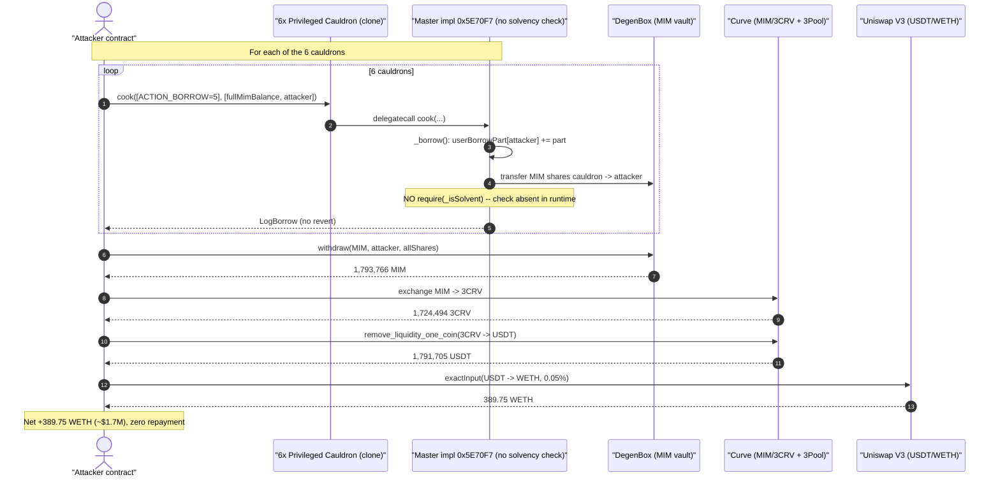
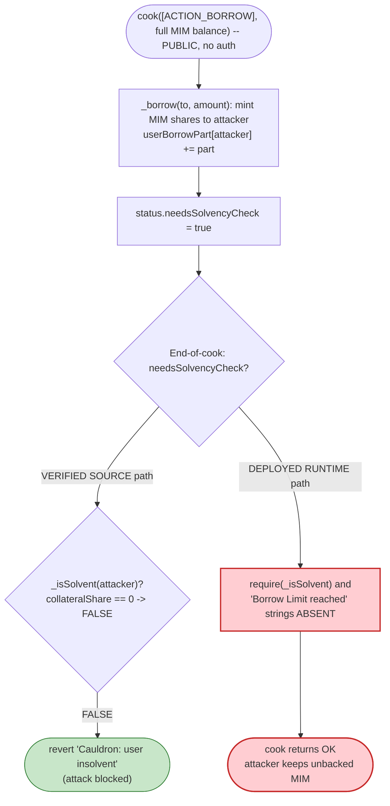
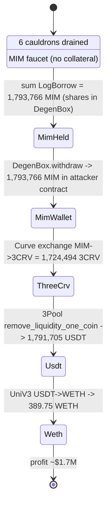

# MIM Spell ("MIMSpell3") Exploit — Collateral-Free MIM Mint from Privileged Cauldrons

> **Vulnerability classes:** vuln/logic/missing-check · vuln/access-control/missing-auth

> One-liner: six Abracadabra "Privileged" cauldrons were running a master-contract implementation whose `cook(ACTION_BORROW)` path performs **no solvency check**, so anyone could `cook` a borrow with zero collateral and mint the cauldron's entire MIM balance for free — ~1.79M MIM (~$1.7M) drained and laundered MIM → 3CRV → USDT → WETH.

> **Reproduction:** the PoC compiles & runs in this isolated Foundry project ([folder](.)). Full verbose trace: [output.txt](output.txt). Verified (but stale) cauldron source: [sources/PrivilegedCheckpointCauldronV4_46f54d/src_cauldrons_CauldronV4.sol](sources/PrivilegedCheckpointCauldronV4_46f54d/src_cauldrons_CauldronV4.sol).

---

## Key info

| | |
|---|---|
| **Loss** | ~$1.7M — **1,793,766 MIM** minted with no collateral, exited as **389.75 WETH** |
| **Vulnerable contract** | Abracadabra cauldron master impl `PrivilegedCheckpointCauldronV4` — [`0x5E70F7AcB8ec0231c00220d11c74dC2B23187103`](https://etherscan.io/address/0x5E70F7AcB8ec0231c00220d11c74dC2B23187103#code) (executes via `delegatecall` for the cauldron clones) |
| **Victim cauldrons (6)** | `0x46f5…ff82c`, `0x2894…b134ED`, `0xce45…0865B`, `0x40d9…5b87a3`, `0x6bcd…5CDA2`, `0xC6D3…dC20d` — primary: [`0x46f54d434063e5F1a2b2CC6d9AAa657b1B9ff82c`](https://etherscan.io/address/0x46f54d434063e5F1a2b2CC6d9AAa657b1B9ff82c#code) |
| **Asset drained** | MIM (Magic Internet Money) `0x99D8a9C45b2ecA8864373A26D1459e3Dff1e17F3`, held inside DegenBox `0xd96f48665a1410C0cd669A88898ecA36B9Fc2cce` |
| **Attacker EOA** | [`0x1aaade3e9062d124b7deb0ed6ddc7055efa7354d`](https://etherscan.io/address/0x1aaade3e9062d124b7deb0ed6ddc7055efa7354d) |
| **Attacker contract** | [`0xb8e0a4758df2954063ca4ba3d094f2d6eda9b993`](https://etherscan.io/address/0xb8e0a4758df2954063ca4ba3d094f2d6eda9b993) |
| **Attack tx** | [`0x842aae91c89a9e5043e64af34f53dc66daf0f033ad8afbf35ef0c93f99a9e5e6`](https://etherscan.io/tx/0x842aae91c89a9e5043e64af34f53dc66daf0f033ad8afbf35ef0c93f99a9e5e6) |
| **Chain / block / date** | Ethereum mainnet / 23,504,544 / **2025-10-04 12:53:59 UTC** |
| **Compiler** | Solidity v0.8.20, optimizer 400 runs (verified source) — **deployed runtime differs from verified source** |
| **Bug class** | Missing collateral/solvency check on borrow (broken access/risk control); undercollateralized "mint" |

---

## TL;DR

Abracadabra's `CauldronV4` is the standard MIM lending engine: you `cook()` a sequence of actions — add collateral, borrow, repay, etc. A normal `ACTION_BORROW` sets a flag so that at the end of `cook()` the contract runs `require(_isSolvent(msg.sender, …))`, which reverts unless the borrower has posted enough collateral.

These six were **"Privileged" cauldrons** sharing one master implementation at `0x5E70F7…`. The **deployed runtime bytecode of that master has the solvency check stripped out** — disassembly shows the runtime contains neither the `"Cauldron: user insolvent"` string nor the `"Borrow Limit reached"` string that the verified source compiles. As a result:

> `cook([ACTION_BORROW], …)` mints MIM straight out of the cauldron's DegenBox balance to any caller — **with zero collateral and no borrow-cap enforcement**.

The attacker simply looped over all six cauldrons, borrowing each one's *entire* available MIM balance, withdrew the MIM from DegenBox, and offloaded it:

1. Borrow each cauldron's full MIM balance via `cook(ACTION_BORROW, fullBalance)` → 1,793,766 MIM total to the attacker's DegenBox account.
2. `DegenBox.withdraw` the MIM to the attacker contract.
3. Curve `exchange` MIM → 3CRV through the MIM/3CRV metapool (1,724,494 3CRV).
4. Curve 3Pool `remove_liquidity_one_coin` → 1,791,705 USDT.
5. Uniswap V3 `exactInput` USDT → **389.75 WETH** profit.

No flash loan, no price manipulation, no oracle game — the protocol just **handed out its own MIM for free** because the borrow path forgot to check solvency.

---

## Background — Abracadabra cauldrons & DegenBox

- **MIM** is Abracadabra's stablecoin. Lending happens in **cauldrons** (`CauldronV4` clones) that custody collateral and let users borrow MIM against it.
- MIM liquidity that a cauldron can lend out is parked inside **DegenBox** (an Abracadabra fork of BentoBox), tracked in *shares*. `_borrow` transfers MIM shares from the cauldron's DegenBox account to the borrower's DegenBox account ([CauldronV4.sol:320-321](sources/PrivilegedCheckpointCauldronV4_46f54d/src_cauldrons_CauldronV4.sol#L320-L321)).
- A cauldron is a minimal **clone** (the on-chain code at `0x46f5…` is only 45 bytes) that `delegatecall`s a shared **master contract** — here `0x5E70F7AcB8ec0231c00220d11c74dC2B23187103`. Each clone keeps its own storage (collateral token, oracle, debt, MIM balance) but runs the master's logic.
- The "Privileged" / "Checkpoint" variants ([PrivilegedCauldronV4.sol](sources/PrivilegedCheckpointCauldronV4_46f54d/src_cauldrons_PrivilegedCauldronV4.sol), [PrivilegedCheckpointCauldronV4.sol](sources/PrivilegedCheckpointCauldronV4_46f54d/src_cauldrons_PrivilegedCheckpointCauldronV4.sol)) add an owner-only `addBorrowPosition()` and reward-token checkpoint hooks on top of `CauldronV4`. They were configured with `borrowLimit = (uint128.max, uint128.max)` ([init, CauldronV4.sol:149](sources/PrivilegedCheckpointCauldronV4_46f54d/src_cauldrons_CauldronV4.sol#L149)) — i.e. no borrow cap.

On-chain state of the primary cauldron `0x46f5…` at the fork block (read with `cast`):

| Parameter | Value |
|---|---|
| `COLLATERIZATION_RATE` | 90,000 (= 90%) — normal |
| `exchangeRate` (stored) | 414,244,705,269,527 |
| `oracle` | `0xd9f2…C5a0` |
| `collateral` | `0x9447c1413DA928aF354A114954BFc9E6114c5646` |
| `masterContract` | `0x5E70F7AcB8ec0231c00220d11c74dC2B23187103` |
| `borrowLimit` | (uint128.max, uint128.max) — unbounded |
| MIM shares in DegenBox (lendable) | **736,232 MIM** |
| attacker `userBorrowPart` / `userCollateralShare` (pre) | **0 / 0** |

The collateralization rate and oracle look perfectly normal — which is exactly the trap. The *config* is fine; it's the *deployed code* that omits the check.

---

## The vulnerable code

The verified Etherscan source of `CauldronV4` shows what the borrow path is *supposed* to do. The borrow handler in `cook()` flags a solvency check ([CauldronV4.sol:488-491](sources/PrivilegedCheckpointCauldronV4_46f54d/src_cauldrons_CauldronV4.sol#L488-L491)):

```solidity
} else if (action == ACTION_BORROW) {                 // ACTION_BORROW = 5
    (int256 amount, address to) = abi.decode(datas[i], (int256, address));
    (value1, value2) = _borrow(to, _num(amount, value1, value2));
    status.needsSolvencyCheck = true;                 // <-- mark for end-of-cook solvency check
}
```

`_borrow` itself mints MIM shares to `to` and is *expected* to leave the caller in a state that the final check validates ([CauldronV4.sol:303-324](sources/PrivilegedCheckpointCauldronV4_46f54d/src_cauldrons_CauldronV4.sol#L303-L324)):

```solidity
function _borrow(address to, uint256 amount) internal returns (uint256 part, uint256 share) {
    uint256 feeAmount = amount.mul(BORROW_OPENING_FEE) / BORROW_OPENING_FEE_PRECISION;
    (totalBorrow, part) = totalBorrow.add(amount.add(feeAmount), true);

    BorrowCap memory cap = borrowLimit;
    require(totalBorrow.elastic <= cap.total, "Borrow Limit reached");        // (A)
    ...
    uint256 newBorrowPart = userBorrowPart[msg.sender].add(part);
    require(newBorrowPart <= cap.borrowPartPerAddress, "Borrow Limit reached"); // (B)
    userBorrowPart[msg.sender] = newBorrowPart;

    share = bentoBox.toShare(magicInternetMoney, amount, false);
    bentoBox.transfer(magicInternetMoney, address(this), to, share);          // mint MIM to borrower
    emit LogBorrow(msg.sender, to, amount.add(feeAmount), part);
}
```

And the end of `cook()` is meant to enforce solvency ([CauldronV4.sol:538-541](sources/PrivilegedCheckpointCauldronV4_46f54d/src_cauldrons_CauldronV4.sol#L538-L541)):

```solidity
if (status.needsSolvencyCheck) {
    (, uint256 _exchangeRate) = updateExchangeRate();
    require(_isSolvent(msg.sender, _exchangeRate), "Cauldron: user insolvent");  // (C)
}
```

with `_isSolvent` ([CauldronV4.sol:192-209](sources/PrivilegedCheckpointCauldronV4_46f54d/src_cauldrons_CauldronV4.sol#L192-L209)):

```solidity
function _isSolvent(address user, uint256 _exchangeRate) internal view returns (bool) {
    uint256 borrowPart = userBorrowPart[user];
    if (borrowPart == 0) return true;
    uint256 collateralShare = userCollateralShare[user];
    if (collateralShare == 0) return false;        // <-- borrower with debt but no collateral => INSOLVENT
    ...
}
```

Per the verified source, an attacker who borrows with `userCollateralShare == 0` and `userBorrowPart > 0` would hit `_isSolvent → false` at check **(C)** and the whole `cook()` would revert with `"Cauldron: user insolvent"`.

### What is actually deployed

The on-chain runtime of the master `0x5E70F7…` tells a different story. Searching the deployed bytecode at the fork block for the revert-string literals the verified source must compile:

| Revert string | Present in deployed runtime? |
|---|---|
| `"Cauldron: user insolvent"` (`696e736f6c76656e74`) | **NO** |
| `"Borrow Limit reached"` (`426f72726f77204c696d6974`) | **NO** |
| `"Skim too much"` (`536b696d20746f6f206d756368`) | YES |

The solvency check **(C)** and both borrow-cap checks **(A)/(B)** are simply **not in the executing code**. The trace confirms it end-to-end: the borrow `cook()` emits `LogBorrow`, writes `userBorrowPart[attacker]`, transfers the MIM, and returns — with **no `oracle.get` / `updateExchangeRate` / solvency revert anywhere** ([output.txt cook trace](output.txt)). The verified source is a *stale or different* version than the bytecode that was live on 2025-10-04.

---

## Root cause — why it was possible

The borrow path in the **deployed** privileged-cauldron master implementation does not verify that the borrower is solvent (or even that any borrow cap is respected). Concretely:

1. **No collateral requirement on borrow.** `cook(ACTION_BORROW)` mints MIM out of the cauldron's DegenBox balance to `to`, but the end-of-cook `require(_isSolvent(...))` that should reject a zero-collateral borrower is absent from the runtime. So a fresh address with `userCollateralShare == 0` can borrow.
2. **No borrow cap.** Both `"Borrow Limit reached"` requires are missing, and `borrowLimit` was configured to `uint128.max` anyway — so a single caller can borrow the entire lendable MIM in one shot.
3. **Permissionless `cook`.** `cook()` is a plain `external` function ([CauldronV4.sol:465-469](sources/PrivilegedCheckpointCauldronV4_46f54d/src_cauldrons_CauldronV4.sol#L465-L469)) — no allow-list, no role gate. The owner-only `addBorrowPosition()` exists, but the unguarded `cook(ACTION_BORROW)` makes it irrelevant.
4. **MIM is liquid and exitable.** Borrowed MIM sits in DegenBox; the attacker `withdraw`s it and routes MIM → 3CRV → USDT → WETH through deep Curve/Uniswap liquidity, so the stolen MIM is immediately monetized.

The net effect: the cauldrons behaved as an **open MIM faucet**. Every MIM share a cauldron was holding to lend out could be borrowed for free and never repaid (zero `LogRepay` events in the entire trace).

---

## Preconditions

- A privileged cauldron must hold a non-trivial MIM balance in DegenBox (its lendable inventory). All six did, totaling ~1.79M MIM.
- The deployed master must be the check-less variant (it was, for `0x5E70F7…`).
- That's it. No flash loan, no oracle staleness, no special block — the attacker only needs MIM-side liquidity to dump into (Curve MIM/3CRV + 3Pool + a USDT/WETH UniV3 pool), all of which are permanent mainnet infrastructure.

---

## Attack walkthrough (with on-chain numbers from the trace)

`PoC entrypoint` [`MIMSpell3Exploit.testExploit()`](test/MIMSpell3_exp.sol#L126-L132). Note the PoC's local constant `ACTION_REPAY = 5` is a misnomer — value `5` is `ACTION_BORROW` in `CauldronV4` ([CauldronV4.sol:366](sources/PrivilegedCheckpointCauldronV4_46f54d/src_cauldrons_CauldronV4.sol#L366)), and the trace shows the call emits `LogBorrow`.

| # | Step | Detail | Figure (from trace) |
|---|------|--------|--------------------:|
| 1 | `cook(ACTION_BORROW)` on cauldron `0x46f5…` | borrow its full MIM balance, `to = attacker` | **739,917.62 MIM** (736,232 shares) |
| 2 | `cook(ACTION_BORROW)` on `0x2894…` | full balance | 75,855.06 MIM (75,477 shares) |
| 3 | `cook(ACTION_BORROW)` on `0xce45…` | full balance | 612,623.22 MIM (612,314 shares) |
| 4 | `cook(ACTION_BORROW)` on `0x40d9…` | full balance | 274,985.69 MIM (274,847 shares) |
| 5 | `cook(ACTION_BORROW)` on `0x6bcd…` | full balance | 85,454.82 MIM (85,412 shares) |
| 6 | `cook(ACTION_BORROW)` on `0xC6D3…` | full balance | 9,479.33 MIM (9,475 shares) |
| 7 | `DegenBox.withdraw(MIM, attacker→attacker, share=allShares)` | pull all MIM out of DegenBox | **1,793,766.13 MIM** (1,793,755.86 shares) |
| 8 | Curve router `exchange` MIM → 3CRV (MIM/3CRV metapool `0x5a6A…F41B`) | dump MIM | 1,724,494.15 3CRV |
| 9 | 3Pool `remove_liquidity_one_coin(3CRV, USDT, 0)` | redeem to USDT (index 2) | 1,791,704.85 USDT |
| 10 | Uniswap V3 `exactInput(USDT → WETH, 0.05% fee)` | cash out | **389.75 WETH** |

The per-cauldron borrow check the PoC uses is `borrowLimit >= balanceOf(MIM, cauldron)` ([_borrowFromAllCauldrons, test/MIMSpell3_exp.sol#L141-L147](test/MIMSpell3_exp.sol#L141-L147)) — since `borrowLimit` is `uint128.max`, every cauldron qualifies and the attacker borrows `toAmount(MIM, fullShareBalance)`.

### Profit accounting

| Item | Amount |
|---|---:|
| MIM minted from 6 cauldrons (collateral-free) | 1,793,766.13 MIM |
| → swapped to 3CRV | 1,724,494.15 3CRV |
| → redeemed to USDT | 1,791,704.85 USDT |
| → swapped to WETH | 389.7486 WETH |
| WETH balance before | 0.202213 |
| WETH balance after | 389.950781 |
| **Net profit** | **+389.748568 WETH (~$1.7M)** |

Cost basis to the attacker: essentially gas only. The MIM was minted for free and every cauldron's debt (`userBorrowPart`) was left permanently unpaid (no `LogRepay` in the trace), so the loss falls on the protocol / MIM backing.

---

## Diagrams

### Sequence of the attack



### Borrow control-flow: intended vs deployed



### Fund flow / state evolution



---

## Remediation

1. **Restore the solvency check on the borrow path.** Every borrow must end with `require(_isSolvent(msg.sender, exchangeRate))`. The deployed runtime of `0x5E70F7…` must be replaced with a build whose `cook(ACTION_BORROW)` enforces `status.needsSolvencyCheck` and reverts a zero-collateral borrower — i.e. match the verified `CauldronV4` source, not a stripped variant.
2. **Verify deployed bytecode == reviewed source.** This entire class of incident is invisible to a source-level audit because the executing master implementation diverged from the verified source. Pin and continuously attest the master-contract bytecode hash; treat any "privileged"/special cauldron master as in-scope and re-verify on every redeploy.
3. **Decommission lendable inventory from deprecated cauldrons.** If these privileged cauldrons were obsolete, their MIM lending inventory should have been withdrawn to a treasury rather than left sitting in DegenBox where a borrow could sweep it.
4. **Enforce real borrow caps.** `borrowLimit` set to `uint128.max` removes the last backstop. Set finite per-cauldron and per-address caps so even a logic bug cannot drain the full inventory in one transaction.
5. **Gate the privileged minting path.** If these cauldrons only ever needed the owner-only `addBorrowPosition()` mint, the public `cook(ACTION_BORROW)` should be disabled (or routed to a guarded entry point) on privileged masters.

---

## How to reproduce

```bash
_shared/run_poc.sh 2025-10-MIMSpell3_exp -vvvvv
```

- RPC: a mainnet **archive** endpoint is required (fork block 23,504,544). `foundry.toml` uses an Infura archive endpoint.
- Result: `[PASS] testExploit()` with WETH balance going `0.202 → 389.951` (profit ≈ **389.75 WETH**).

Expected tail:

```
Ran 1 test for test/MIMSpell3_exp.sol:MIMSpell3Exploit
[PASS] testExploit() (gas: 1316148)
Logs:
  Attacker Before exploit WETH Balance: 0.202213274263176443
  Attacker After exploit WETH Balance: 389.950781057344464944

Suite result: ok. 1 passed; 0 failed; 0 skipped
```

---

*Note on the verified-source caveat:* the contract source downloaded from Etherscan for the cauldron master/clones **contains the solvency check** ([CauldronV4.sol:538-541](sources/PrivilegedCheckpointCauldronV4_46f54d/src_cauldrons_CauldronV4.sol#L538-L541)), yet the *runtime bytecode live at the fork block* contains neither the `"Cauldron: user insolvent"` nor the `"Borrow Limit reached"` revert strings. The vulnerability is in the deployed implementation, not in the source as shown — this analysis relies on the live fork trace as ground truth.

*Reference: DeFiHackLabs PoC header — Total Lost ~$1.7M, Ethereum mainnet.*
