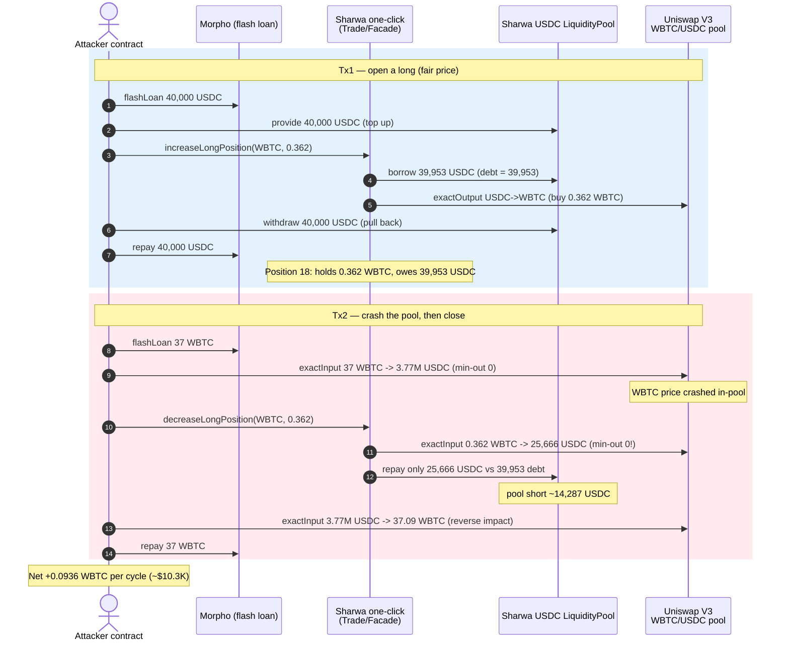
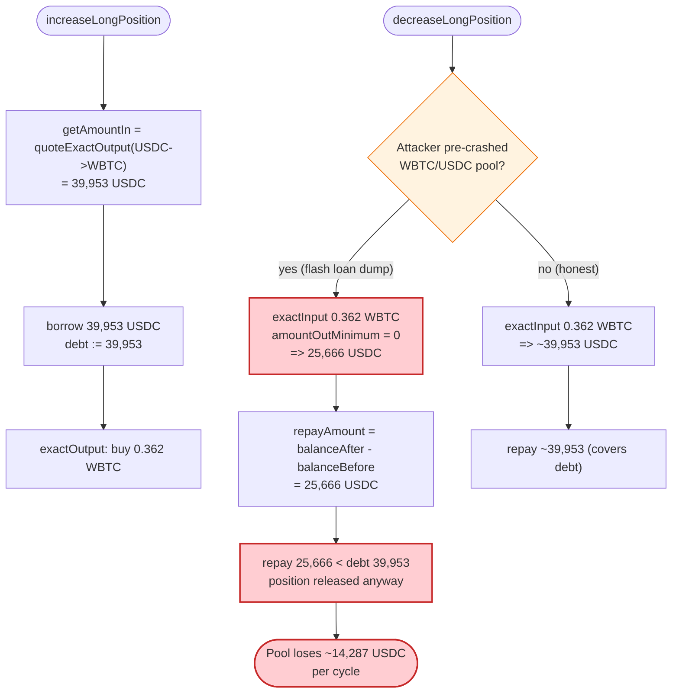
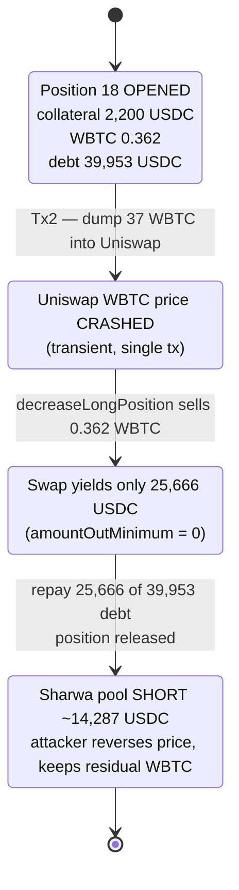

# Sharwa Finance Exploit — Margin Position Closed Against an Attacker-Manipulated Spot Pool (No Slippage Bound)

> One-line summary: Sharwa Finance's one-click margin trading borrows USDC and later repays it by swapping the
> position's WBTC on a **live Uniswap V3 pool with `amountOutMinimum = 0`**; an attacker flash-loan-crashes that
> pool's WBTC price before closing the position, so the protocol repays far less USDC than it lent — and the
> borrower walks away with the difference in WBTC.

> **Reproduction:** the PoC compiles & runs in an isolated Foundry project at
> [this project folder](.). Full verbose trace: [output.txt](output.txt).
> Verified vulnerable sources are under [sources/](sources/).

---

## Key info

| | |
|---|---|
| **Loss** | **~$146,000** total (real attack, multiple position cycles). This PoC reproduces **one** cycle, netting **0.09359054 WBTC ≈ $10.3K** at the fork-block WBTC price of $110,244. |
| **Vulnerable contracts** | `FacadeOutput` / `FacadeInput` + `UniswapModuleBase.swapInput` (`amountOutMinimum = 0`). Entry point: `TradeRouter` — [`0xd3fdE5AF30DA1F394d6e0D361B552648D0dff797`](https://arbiscan.io/address/0xd3fdE5AF30DA1F394d6e0D361B552648D0dff797#code) |
| **Victim / drained pool** | Sharwa USDC `LiquidityPool` (SF-LP-USDC) — [`0x02434cD23972C82FbAbf610D157b41bFB45A45a3`](https://arbiscan.io/address/0x02434cD23972C82FbAbf610D157b41bFB45A45a3) |
| **Attacker EOA** | [`0xd356c82e0c85e1568641d084dbdaf76b8df96c08`](https://arbiscan.io/address/0xd356c82e0c85e1568641d084dbdaf76b8df96c08) |
| **Attacker contract** | [`0xd9ff21caeeea4329133c98a892db16b42f9baa25`](https://arbiscan.io/address/0xd9ff21caeeea4329133c98a892db16b42f9baa25) |
| **Attack txs** | [`0xd64729…fc89c2`](https://app.blocksec.com/explorer/tx/arbitrum/0xd64729c528e6689cb18b0c90345ab0c9ed18fea44247c89af2f1374643fc89c2) (open), [`0x9f8b48…c23ead`](https://app.blocksec.com/explorer/tx/arbitrum/0x9f8b4841f805ec50cc6632068f759216d85633fbbe34afde86b97bbc41c23ead) (close) |
| **Chain / blocks / date** | Arbitrum One / `391402008` (open) & `391402389` (close) / October 2025 |
| **Compiler** | Solidity v0.8.20, optimizer off (runs 200) |
| **Bug class** | Spot-price (AMM) manipulation via flash loan; missing slippage / oracle bound on swap execution; debt accounting tied to manipulable swap proceeds |

---

## TL;DR

Sharwa Finance is a margin-trading protocol. To open a "long WBTC" position the protocol **borrows USDC** from its
`LiquidityPool` and swaps it for WBTC on Uniswap V3, sizing the borrow from a Uniswap **quoter**
([`getOutputPositionValue` → `quoteExactOutput`](sources/UniswapModuleWithChainlink_96fef0/contracts_modularSwapRouter_uniswap_UniswapModuleBase.sol#L74-L76)).
To close the position it **swaps the WBTC back to USDC** and repays the debt with the proceeds — but the actual
on-chain swap is executed with `amountOutMinimum: 0`
([`_prepareInputParams`](sources/UniswapModuleWithChainlink_96fef0/contracts_modularSwapRouter_uniswap_UniswapModuleBase.sol#L131-L139)),
and the repayment is set to exactly *whatever USDC the swap produced*
([`FacadeOutput.multiSwapOutputRepay`](sources/FacadeOutput_A7e66e/contracts_oneClick_facades_FacadeOutput.sol#L92-L103)).

The attacker exploits the gap between the **quoted** price (at open) and the **executed** price (at close):

1. **Open** a tiny long WBTC position funded by a USDC flash loan. The protocol borrows **39,953 USDC** from its
   pool and buys **0.362 WBTC** for the position. Debt recorded = **39,953 USDC**.
2. In a second transaction, **flash-loan 37 WBTC** and dump it into the WBTC→USDC Uniswap V3 pool first, crashing
   the in-pool WBTC price.
3. **Close** the position. The protocol sells the position's **0.362 WBTC** into the now-depressed pool, receiving
   only **25,666 USDC**, and repays only that. The debt of **39,953 USDC** is cleared by repaying **25,666 USDC** —
   the pool eats the **~14,287 USDC** shortfall.
4. The attacker then **swaps the USDC back to WBTC** in the same pool (reversing their own price impact) and repays
   the WBTC flash loan, keeping the residual WBTC.

Net per cycle in this PoC: **+0.09359054 WBTC**. The real attacker repeated the cycle to total **~$146K**.

---

## Background — what Sharwa Finance does

Sharwa Finance ([sources/](sources/)) is an on-chain leveraged/margin trading system on Arbitrum:

- A **`LiquidityPool`** (SF-LP-USDC) holds depositors' USDC and lends it to margin accounts (`provide` / `withdraw`
  / `borrow` / `repay`).
- A **`MarginAccountManager`** mints ERC-721 "margin account" NFTs; **`MarginAccount`** custodies each account's
  ERC-20 collateral and tracks debt per liquidity pool.
- The **one-click layer** (`TradeRouter` → `FacadeTradeRouter` → `FacadeInput`/`FacadeOutput` →
  `OneClickEphemeralSwapOutput` / Uniswap modules) lets a user open and close leveraged positions in a single call.

A long position is "borrow USDC → buy token → hold token as collateral." Closing it is "sell token → repay USDC
debt." Both legs route through Uniswap V3 (the WBTC/USDC 0.05% pool here). The protocol also wires a Chainlink feed
into `UniswapModuleWithChainlink`, **but only for valuing collateral** (`getPositionValue`) — never to bound the
actual swap that moves money.

On-chain facts at the fork blocks (from the trace):

| Parameter | Value |
|---|---|
| Position token | WBTC (8 decimals) |
| Debt token / base | USDC (6 decimals) |
| Uniswap pool | WBTC/USDC, fee 500 (0.05%), `0x0E4831319A50228B9e450861297aB92dee15B44F` |
| Chainlink WBTC/USD at block | `11024440761162` ⇒ **$110,244.41** (used only for collateral value) |
| USDC pool balance at open | `40,088,983,155` ⇒ ~40,089 USDC |
| Attacker's own USDC working capital | 2,201 USDC + flash loans |

---

## The vulnerable code

### 1. Opening a long: borrow is sized by a Uniswap **quoter** (manipulable, but here used at "fair" price)

[`FacadeOutput.borrowSwapOutput`](sources/FacadeOutput_A7e66e/contracts_oneClick_facades_FacadeOutput.sol#L120-L137):

```solidity
function borrowSwapOutput(uint marginAccountID, address positionToken, address tokenIn, address tokenOut, uint amountOut)
    external onlyRole(ONE_CLICK_CONTRACT_ROLE)
{
    (int256 positionSize,,,,) = oneClickProxy.getPosition(marginAccountID, positionToken);
    require(positionSize >= 0, "Short position exists");
    uint amountIn = getAmountIn(tokenOut, tokenIn, amountOut);   // quoteExactOutput on live pool
    oneClickProxy.borrow(marginAccountID, tokenIn, amountIn);     // borrows `amountIn` USDC, debt = amountIn
    oneClickEphemeralSwapOutput.swapOutput(marginAccountID, tokenOut, tokenIn, amountOut, amountIn);
    ...
}
```

At open the attacker borrows **39,953,190,410 USDC units (≈39,953 USDC)** to buy **0.362 WBTC** — the debt is set
equal to the USDC borrowed.

### 2. Closing a long: the position's token is sold with **`amountOutMinimum = 0`**

[`UniswapModuleBase._prepareInputParams`](sources/UniswapModuleWithChainlink_96fef0/contracts_modularSwapRouter_uniswap_UniswapModuleBase.sol#L131-L139)
(the params used by the closing swap, `swapInput`):

```solidity
function _prepareInputParams(uint256 amount) private view returns(ISwapRouter.ExactInputParams memory params) {
    params = ISwapRouter.ExactInputParams({
        path: abi.encodePacked(tokenInContract, poolFee, tokenOutContract),
        recipient: address(this),
        deadline: block.timestamp,
        amountIn: amount,
        amountOutMinimum: 0          // ⚠️ NO SLIPPAGE PROTECTION ON THE EXECUTED SWAP
    });
}
```

### 3. The debt is repaid with **exactly the swap proceeds** — no comparison to the recorded debt

[`FacadeOutput.multiSwapOutputRepay`](sources/FacadeOutput_A7e66e/contracts_oneClick_facades_FacadeOutput.sol#L92-L103)
(`FacadeInput.multiSwapInputRepay` is the symmetric path actually taken when closing a long):

```solidity
uint balanceAfter = marginAccount.getErc20ByContract(marginAccountID, tokenOut);
uint repayAmountToUse;
if (repayAmount != 0) {
    repayAmountToUse = repayAmount;
} else {
    repayAmountToUse = balanceAfter - balanceBefore;   // ⚠️ repay = whatever the swap produced
}
ILiquidityPool liuidityPool = ILiquidityPool(marginAccount.tokenToLiquidityPool(tokenOut));
uint debt = liuidityPool.getDebtWithAccruedInterest(marginAccountID);
if (debt != 0) {
    oneClickProxy.repay(marginAccountID, tokenOut, repayAmountToUse);   // can be far less than `debt`
}
```

`_closePartialLongPosition` passes `repayAmount = 0` and an `amountOutMinimum = 0` swap
([FacadeTradeRouter.sol:84-108](sources/FacadeTradeRouter_B84945/contracts_oneClick_facades_FacadeTradeRouter.sol#L84-L108)),
so the repayment is governed entirely by the manipulated swap output.

In the trace the closing swap returns **`36199999 WBTC, -25665887020 USDC`**
([output.txt:4642](output.txt)) and the protocol then calls **`repay(18, USDC, 25665887020)`**
([output.txt:4691](output.txt)) while `getDebtWithAccruedInterest(18)` is **`0x094d654e0a = 39,953,190,410`**
([output.txt:4694](output.txt)). The position is released for repaying only **64%** of the debt.

---

## Root cause — why it was possible

The protocol treats two different prices as if they were the same:

- **Quote price** at open (`quoteExactOutput`) — sets how much USDC is borrowed (the debt).
- **Execution price** at close (`exactInput` with `amountOutMinimum = 0`) — sets how much USDC actually comes back
  and how much debt is repaid.

Because the closing swap has **no slippage floor** and the repayment is pinned to its raw proceeds, an attacker who
controls the spot pool price *at the moment of closing* controls how much of the debt actually gets repaid. A flash
loan makes the pool fully controllable inside a single transaction:

1. **No slippage / no `amountOutMinimum`.** The position-closing swap accepts any output, so a deliberately crashed
   pool produces a deliberately small repayment.
2. **Debt repaid = swap proceeds, not recorded debt.** `multiSwap…Repay` repays `balanceAfter - balanceBefore`
   when `repayAmount == 0`. It never reverts on, or even reads against, the shortfall versus `getDebtWithAccruedInterest`.
3. **No health/solvency invariant on close.** Closing a long that returns less than the debt simply leaves the pool
   short; nothing forces the position to stay collateralized or the account to cover the gap.
4. **Chainlink is decorative here.** `UniswapModuleWithChainlink` reads a WBTC/USD feed
   ([UniswapModuleWithChainlink.sol:112-114](sources/UniswapModuleWithChainlink_96fef0/contracts_modularSwapRouter_uniswap_UniswapModuleWithChainlink.sol#L112-L114))
   only for `getPositionValue` (collateral accounting), **not** to bound the actual swap execution or the repayment
   amount — so the one defense that could have caught the price gap never fires on the money-moving path.

The combination — manipulable execution price + repayment tied to that price + no oracle bound on the swap — lets
the borrower extract the difference between borrowed USDC and repaid USDC, paid out of the lending pool.

---

## Preconditions

- A WBTC/USDC Uniswap V3 pool whose price can be moved within a single transaction (true for the 0.05% pool with
  flash-loanable size).
- The Sharwa pool must hold enough USDC to fund the open-leg borrow (it held ~40K USDC; the attacker first
  `provide`s flash-loaned USDC to top it up, then `withdraw`s it back at the end of the open tx).
- Flash-loan liquidity in USDC and WBTC (Morpho on Arbitrum supplied both here, fee-free).
- No special privilege: the one-click flow is callable by any margin-account owner; the attacker simply mints a
  fresh margin-account NFT.

---

## Attack walkthrough (ground-truth numbers from the trace)

The attack spans two transactions (two Morpho flash loans). All numbers are raw token units: USDC/USDC-debt = 6
decimals, WBTC = 8 decimals.

| # | Step | Trace ref | Amount | Effect |
|---|------|-----------|-------:|--------|
| 0 | Fund attacker with 2,201 USDC | [setUp](output.txt) | 2,201,000,000 | Seed capital. |
| 1 | **Tx1**: Morpho flash-loan USDC | [output.txt:1666](output.txt) | 40,000,000,000 (40K USDC) | Working capital for the open leg. |
| 2 | `createMarginAccount()` | [output.txt:1677](output.txt) | tokenId **18** | Fresh margin account NFT. |
| 3 | `pool.provide(40K USDC)` | [output.txt:1694](output.txt) | 40,000,000,000 | Tops up SF-LP-USDC so it can fund the borrow. |
| 4 | `provideERC20(18, USDC, 2.2K)` | [output.txt:1722](output.txt) | 2,200,000,000 | Posts 2,200 USDC collateral to the account. |
| 5 | `increaseLongPosition(18, WBTC, 0.362)` | [output.txt:1766](output.txt) | borrow **39,953,190,410 USDC**, buy **36,200,000 WBTC** | Opens long; **debt = 39,953 USDC**, position = 0.362 WBTC bought via Uniswap exactOutput. |
| 6 | `pool.withdraw(all LP shares)` | [output.txt:2648](output.txt) | out **39,999,999,999 USDC** | Pulls the seeded USDC back out (~break-even on provide/withdraw). |
| 7 | Repay USDC flash loan | [output.txt:2684](output.txt) | 40,000,000,000 | Tx1 ends; position 18 holds 0.362 WBTC, owes ~39,953 USDC. |
| 8 | **Tx2** (next block): Morpho flash-loan WBTC | [output.txt:2698](output.txt) | 3,700,000,000 (37 WBTC) | Ammo to crash the pool. |
| 9 | **Dump 37 WBTC → USDC** (`exactInputSingle`, min-out 0) | [output.txt:2727](output.txt) | in 3,700,000,000 WBTC → out **3,771,776,160,178 USDC** | Crashes the pool's WBTC price; attacker now holds ~3.77M USDC. |
| 10 | `decreaseLongPosition(18, WBTC, 0.362)` | [output.txt:3514](output.txt) | sell **0.362 WBTC** → **25,665,887,020 USDC**; repay **25,666 USDC** | Position sold into the crashed pool; only **25,666** of the **39,953** debt repaid. Pool eats the **~14,287 USDC** gap. |
| 11 | **Swap USDC → WBTC back** (`exactInputSingle`, min-out 0) | [output.txt:4735](output.txt) | in 3,771,777,160,177 USDC → out **3,709,359,054 WBTC** | Reverses the attacker's own price impact, recovering WBTC. |
| 12 | Repay WBTC flash loan | [output.txt:951](output.txt) | 3,700,000,000 | |
| 13 | **Profit** | [output.txt:971](output.txt) | **9,359,054 WBTC** | `WBTC balance after exploit: 9359054` = **0.09359054 WBTC**. |

The closing swap's exact return is visible at [output.txt:4642](output.txt): `← [Return] 36199999, -25665887020`
(sold 0.36199999 WBTC, received 25,665,887,020 USDC). The unpaid debt fragment is shown by the post-`changePosition`
state — collateral was reduced and the account released despite the debt not being fully covered.

---

## Profit / loss accounting

### Per-cycle margin-account economics (the actual theft)

| Leg | USDC |
|---|---:|
| Borrowed from pool at open (debt created) | 39,953.190410 |
| Repaid to pool at close | 25,665.887020 |
| **Net taken from the lending pool** | **≈ 14,287.30 USDC** |

The attacker also posted **2,200 USDC** collateral; the closing logic released collateral, so the realized gain is
expressed in the residual WBTC after unwinding the flash loans.

### PoC token P&L (single cycle)

| Asset | Direction | Amount |
|---|---|---:|
| WBTC | Flash-loaned in (Morpho) | 37.00000000 |
| WBTC | Sold into pool (step 9) | −37.00000000 |
| WBTC | Bought back from pool (step 11) | +37.09359054 |
| WBTC | Flash loan repaid | −37.00000000 |
| **WBTC** | **Net profit** | **+0.09359054** |

At the fork-block Chainlink price ($110,244.41/WBTC), **0.09359054 WBTC ≈ $10,318** per cycle. The published total
loss of **~$146K** corresponds to the attacker repeating this position open/close cycle roughly a dozen-plus times
against the pool.

---

## Diagrams

### Sequence of the attack



### Why the repayment shortfall happens (control flow)



### Pool / account state evolution



---

## Remediation

1. **Enforce slippage on the executed swap.** `_prepareInputParams` must set a real `amountOutMinimum` derived from
   an independent price (e.g. the Chainlink feed already wired into `UniswapModuleWithChainlink`), not `0`. Reject
   the swap if execution deviates beyond a tight band from the oracle.
2. **Never tie debt repayment to raw swap proceeds without checking the debt.** In `multiSwap…Repay`, when closing a
   position the protocol must require that the proceeds cover the outstanding `getDebtWithAccruedInterest` (or pull
   the shortfall from collateral / revert). A position that can be closed by repaying < debt is an open invitation
   to manipulation.
3. **Price both legs with the same oracle.** Borrow sizing (open) and value/repay checks (close) should be anchored
   to a manipulation-resistant oracle (Chainlink + TWAP), so a transient spot move cannot create a gap between
   "debt taken" and "debt repaid."
4. **Add a solvency/health invariant on close.** Closing a long must leave the account solvent and the pool whole;
   assert `repaid >= debt` (for a full close) or recompute account health for partial closes.
5. **Make the Chainlink check load-bearing on the money path**, not just on `getPositionValue`. Bound or reject any
   swap whose realized price diverges from the feed.

---

## How to reproduce

```bash
_shared/run_poc.sh 2025-10-SharwaFinance_exp -vvvvv
```

- Requires an **Arbitrum archive** RPC (the fork blocks `391402007` / `391402388` are historical). `foundry.toml`
  uses `https://arbitrum-one.public.blastapi.io`, which serves state at those blocks.
- The PoC opens the long at block `391402008 - 1` and closes it at `391402389 - 1` (matching the two real txs).
- Result: `[PASS] test_exploit_sequence()` with `WBTC balance after exploit:: 9359054`.

Expected tail:

```
Ran 1 test for test/SharwaFinance_exp.sol:ContractTest
[PASS] test_exploit_sequence() (gas: 17083737)
  WBTC balance before exploit:: 0
  WBTC balance after exploit:: 9359054
Suite result: ok. 1 passed; 0 failed; 0 skipped; finished in 844.87s
```

---

*References: Phalcon analysis — https://x.com/phalcon_xyz/status/1980219745480946087 ; Verichains analysis —
https://blog.verichains.io/p/vulnerability-analysis-deconstructing*
