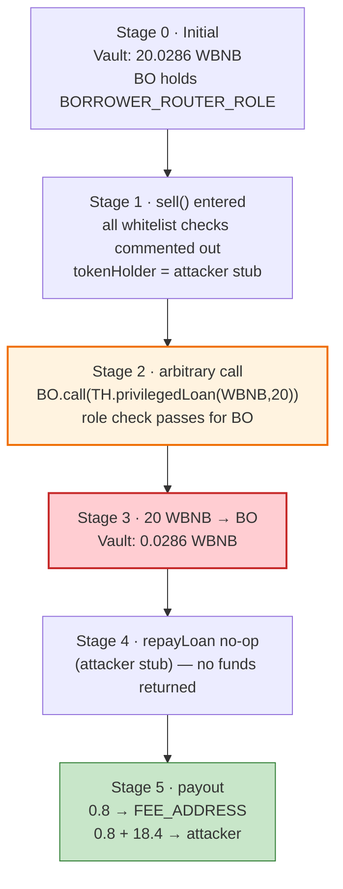
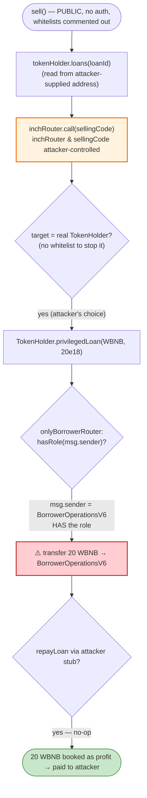

# TokenHolder / BorrowerOperationsV6 Exploit — Privileged-Role Confused-Deputy Drain via `sell()`'s Arbitrary Call

> **Vulnerability classes:** vuln/dependency/unsafe-external-call · vuln/access-control/missing-auth

> One-liner: `BorrowerOperationsV6.sell()` makes an attacker-controlled `inchRouter.call(sellingCode)` while holding the `BORROWER_ROUTER_ROLE` on the protocol's `TokenHolder` vault, letting anyone re-enter `TokenHolder.privilegedLoan()` to pull the vault's WBNB out for free and walk away with it as "profit."

> **Reproduction:** the PoC compiles & runs in an isolated Foundry project at
> [this project folder](.) (the umbrella DeFiHackLabs repo
> does not whole-compile, so this PoC was extracted).
> Full verbose trace: [output.txt](output.txt).
> Verified vulnerable sources:
> [BorrowerOperationsV6](sources/BorrowerOperationsV6_8c7f34/src_BorrowerOperationsV6.sol),
> [TokenHolder](sources/TokenHolder_3403f2/src_TokenHolder.sol).

---

## Key info

| | |
|---|---|
| **Loss** | **20 WBNB** drained from the protocol's `TokenHolder` vault per `sell()` call (attacker netted **19.2 WBNB**, 0.8 WBNB siphoned to the protocol's own fee address). PoC demonstrates one call. |
| **Vulnerable contract** | `BorrowerOperationsV6` (impl) — [`0x8c7f34436C0037742AeCf047e06fD4B27Ad01117`](https://bscscan.com/address/0x8c7f34436C0037742AeCf047e06fD4B27Ad01117#code), behind proxy [`0x616B36265759517AF14300Ba1dD20762241a3828`](https://bscscan.com/address/0x616B36265759517AF14300Ba1dD20762241a3828) |
| **Victim vault (funds source)** | `TokenHolder` — proxy [`0x2EeD3DC9c5134C056825b12388Ee9Be04E522173`](https://bscscan.com/address/0x2EeD3DC9c5134C056825b12388Ee9Be04E522173) (fork-time impl [`0x3403f2Ba8aA448c208C2d1A41F2089c5a6f924e4`](https://bscscan.com/address/0x3403f2Ba8aA448c208C2d1A41F2089c5a6f924e4)) |
| **Attacker EOA** | [`0x3fee6d8aaea76d06cf1ebeaf6b186af215f14088`](https://bscscan.com/address/0x3fee6d8aaea76d06cf1ebeaf6b186af215f14088) |
| **Attacker contract** | [`0xe82Fc275B0e3573115eaDCa465f85c4F96A6c631`](https://bscscan.com/address/0xe82Fc275B0e3573115eaDCa465f85c4F96A6c631) |
| **Attack tx** | [`0xc291d70f281dbb6976820fbc4dbb3cfcf56be7bf360f2e823f339af4161f64c6`](https://bscscan.com/tx/0xc291d70f281dbb6976820fbc4dbb3cfcf56be7bf360f2e823f339af4161f64c6) |
| **Chain / block / date** | BSC / fork at 63,856,734 (one before 63,856,735) / Oct 2025 |
| **Compiler** | `BorrowerOperationsV6`: Solidity v0.8.29, optimizer off (200 runs); `TokenHolder`: v0.8.29 |
| **Bug class** | Confused deputy / privileged-role abuse via unrestricted arbitrary external call (no caller auth, no router/token whitelist) |

---

## TL;DR

`TokenHolder` is a small lending vault that holds WBNB and lends it out via
`privilegedLoan()` — a function correctly guarded by `onlyBorrowerRouter`, so only an address
holding `BORROWER_ROUTER_ROLE` may pull funds.

`BorrowerOperationsV6` is that privileged router (it holds the role). Its `sell()` function is
the problem ([src_BorrowerOperationsV6.sol:144-184](sources/BorrowerOperationsV6_8c7f34/src_BorrowerOperationsV6.sol#L144-L184)):

1. **Every security check is commented out** — no DEX whitelist, no token whitelist, no router
   whitelist, no access control on the caller.
2. It reads the loan to close from a **caller-supplied `tokenHolder` address**
   (`tokenHolder.loans(loanId)`) — so the attacker fabricates the loan data.
3. It then performs `inchRouter.call(sellingCode)` where **both `inchRouter` and `sellingCode`
   are attacker-controlled** ([:160](sources/BorrowerOperationsV6_8c7f34/src_BorrowerOperationsV6.sol#L160)).
   Because the call originates from `BorrowerOperationsV6` (which **holds the `BORROWER_ROUTER_ROLE`**),
   the attacker simply points `inchRouter` at the real `TokenHolder` and sets
   `sellingCode = privilegedLoan(WBNB, 20 ether)`. The `onlyBorrowerRouter` guard passes, and
   **20 WBNB is transferred out of the vault into `BorrowerOperationsV6`.**
4. `sell()` then calls `tokenHolder.repayLoan(loanId, false)` — but `tokenHolder` is the
   **attacker's own contract**, so repayment is a **no-op**. Nothing is paid back.
5. `sell()` finally treats the borrowed 20 WBNB as the trader's "profit" and **transfers it to the
   attacker** (minus an 8% fee, which is split between the protocol fee address and the
   attacker-supplied `integratorFeeAddress` — also the attacker).

Net: the attacker calls one permissionless function, supplies its own address everywhere a trusted
party is expected, and the vulnerable router obediently uses its privileged role to hand the
vault's WBNB to the attacker. Profit = **19.2 WBNB** per call; the vault loses **20 WBNB**.

---

## Background — what the protocol does

This is a leveraged-trading / margin protocol split across two contracts:

- **`TokenHolder`** ([source](sources/TokenHolder_3403f2/src_TokenHolder.sol)) — a vault that
  custodies the lendable asset (WBNB here). It exposes:
  - `privilegedLoan(token, amount)` — an *uncollateralized* transfer of `amount` to the caller,
    intended as an intra-transaction flash advance to the router. Guarded by `onlyBorrowerRouter`.
  - `loanConfirmation(...)` / `repayLoan(...)` — open / settle a recorded loan, also
    `onlyBorrowerRouter`.
  - Admin-only `deposit` / `withdraw` / collateral configuration.
- **`BorrowerOperationsV6`** ([source](sources/BorrowerOperationsV6_8c7f34/src_BorrowerOperationsV6.sol)) —
  the "router" that orchestrates opening (`buy`) and closing (`sell`) leveraged positions. It is
  granted `BORROWER_ROUTER_ROLE` on `TokenHolder`, and is *supposed* to:
  1. borrow the position size from `TokenHolder` via `privilegedLoan`,
  2. swap it on a whitelisted DEX through a 1inch-style router (`inchRouter.call(swapCalldata)`),
  3. repay `TokenHolder`, and
  4. forward the trader's realized profit.

The design hinges on `inchRouter`, `whitelistedDex`, `tokenHolder`, and the collateral token all
being **trusted/whitelisted**. In the deployed code those checks were disabled (commented out),
turning the privileged router into a generic confused deputy.

On-chain state at the fork block (from the trace):

| Fact | Value |
|---|---|
| WBNB held by the `TokenHolder` vault (`0x2EeD3…`) | **20.0286 WBNB** |
| `BORROWER_ROUTER_ROLE` holder | `BorrowerOperationsV6` proxy `0x616B…` |
| `profitFee` | 800 bps = 8% |
| `openingFee` | 50 bps = 0.5% |
| `FEE_ADDRESS` | `0x8432CD30C4d72Ee793399E274C482223DCA2bF9e` |

---

## The vulnerable code

### 1. `sell()` — no auth, all guards commented out, attacker-controlled arbitrary call

```solidity
function sell(uint256 loanId, bytes calldata sellingCode, TokenHolder tokenHolder, address inchRouter, address integratorFeeAddress, address whitelistedDex) external payable nonReentrant {
    // Security checks
    // require(whitelistedDexes[whitelistedDex], "DEX not whitelisted");
    // require(whitelistedDexes[inchRouter], "Router not whitelisted");          // ← DISABLED

    // this is memory, won't change even loan is repaid
    (,uint256 borrowAmount, Collateral memory collateral, uint256 collateralAmount,,address borrower, uint256 userPaid)
        = tokenHolder.loans(loanId);                                             // ← attacker-supplied source

    // // require(whitelistedTokens[collateral.collateralAddress], ...);          // ← DISABLED

    tokenHolder.privilegedLoan(IERC20(collateral.collateralAddress), collateralAmount); // ← attacker stub, no-op (amount=0)
    IERC20(collateral.collateralAddress).approve(whitelistedDex, collateralAmount);
    (bool success,) = inchRouter.call(sellingCode);                              // ⚠️ ARBITRARY CALL, attacker-controlled
    require(success, "Sell token failed");
    uint256 closingPositionSize = weth.balanceOf(address(this));
    (bool success2,) = payable(address(weth)).call{value: msg.value}("");
    require(success2, "WETH failed");
    weth.approve(address(tokenHolder), MAX_INT);
    tokenHolder.repayLoan(loanId, false);                                        // ← attacker stub, no-op (no repayment)
    // transfer profits
    uint256 balance = weth.balanceOf(address(this));
    uint256 profit  = balance > userPaid ? balance - userPaid : 0;              // userPaid=0 ⇒ profit = full 20 WBNB
    uint256 totalFee = profit*profitFee/10000 + (borrowAmount+userPaid)*openingFee/10000; // 8% of 20 = 1.6
    if (integratorFeeAddress == address(0)) {
        require(weth.transfer(FEE_ADDRESS, totalFee), "Fee transfer failed");
    } else {
        require(weth.transfer(FEE_ADDRESS, totalFee / 2), "...");               // 0.8 WBNB → FEE_ADDRESS
        require(weth.transfer(integratorFeeAddress, totalFee - totalFee / 2), "..."); // 0.8 WBNB → attacker
    }
    weth.transfer(borrower, weth.balanceOf(address(this)));                     // 18.4 WBNB → attacker (borrower)
    emit Sell(borrower, ..., closingPositionSize, profit);
}
```

[src_BorrowerOperationsV6.sol:144-184](sources/BorrowerOperationsV6_8c7f34/src_BorrowerOperationsV6.sol#L144-L184)

The two attacker-controlled "callbacks" into `tokenHolder` (`loans`, `privilegedLoan`, `repayLoan`)
all resolve to the **attacker's own contract** because `tokenHolder` is a parameter, not a fixed
trusted address. The real fund movement happens through the *arbitrary call*
`inchRouter.call(sellingCode)`.

### 2. `TokenHolder.privilegedLoan()` — correctly guarded, but the guard is satisfied by the deputy

```solidity
function privilegedLoan(IERC20 flashLoanToken, uint256 amount) public onlyBorrowerRouter {  // ← role check
    require(amount > 0, "Amount must be greater than 0");
    require(flashLoanToken.balanceOf(address(this)) >= amount, "Insufficient funds in the contract");
    require(flashLoanToken.transfer(msg.sender, amount), "Token transfer failed");           // ← sends to msg.sender (the router)
    emit PrivilegedLoan(msg.sender, amount);
}
```

[src_TokenHolder.sol:254-270](sources/TokenHolder_3403f2/src_TokenHolder.sol#L254-L270)

`onlyBorrowerRouter` checks `hasRole(BORROWER_ROUTER_ROLE, msg.sender)`. `BorrowerOperationsV6` *is*
the router and holds that role, so when `sell()` does `inchRouter.call(privilegedLoan(WBNB, 20e18))`
the `msg.sender` seen by `TokenHolder` is `BorrowerOperationsV6` — the check passes, and 20 WBNB is
transferred to `BorrowerOperationsV6`. The vault's own access control is intact; it is *defeated by
the router voluntarily making an attacker-chosen call while wearing its privileged hat.*

---

## Root cause — why it was possible

The vulnerability is a **confused deputy**: a privileged actor (`BorrowerOperationsV6`, holder of
`BORROWER_ROUTER_ROLE`) performs an **arbitrary, attacker-specified external call** with no
restriction on the target or calldata. Four compounding decisions turn this into a free drain:

1. **Unrestricted arbitrary call.** `inchRouter.call(sellingCode)` lets the caller make
   `BorrowerOperationsV6` invoke *any* function on *any* contract, with `msg.sender ==
   BorrowerOperationsV6`. The attacker aims it at the very vault the router is privileged over and
   calls `privilegedLoan`. The router's role is borrowed wholesale.
2. **All whitelists disabled.** The DEX whitelist, token whitelist, and router whitelist checks are
   commented out ([:146-156](sources/BorrowerOperationsV6_8c7f34/src_BorrowerOperationsV6.sol#L146-L156)).
   Had `require(whitelistedDexes[inchRouter])` been live, the attacker could not point the call at
   `TokenHolder`.
3. **Trusted parameters are caller-supplied.** `tokenHolder`, `inchRouter`, `integratorFeeAddress`,
   `whitelistedDex`, and the loan data itself all come from the caller. The contract trusts the
   `loans(loanId)` view of an address the attacker chose, so `userPaid = 0` ⇒ the entire borrowed
   amount is booked as profit.
4. **Repayment is delegated to an untrusted address.** `tokenHolder.repayLoan(loanId, false)` is
   the only thing that would pull funds *back* into the vault — but `tokenHolder` is the attacker's
   stub, so it does nothing. The borrowed WBNB is never returned; instead `sell()` ships it to the
   attacker as "profit."

In short: a function meant to *settle a real leveraged position* was left fully open and was handed
a privileged primitive (arbitrary call from a role-holder) that lets anyone instruct the router to
loot the vault it guards.

---

## Preconditions

- The `TokenHolder` vault holds WBNB (here 20.03 WBNB). The drain per call is capped at the vault
  balance (the PoC borrows exactly 20 WBNB).
- `BorrowerOperationsV6` (the contract called) holds `BORROWER_ROUTER_ROLE` on the target
  `TokenHolder`. (It does — it is the legitimate router.)
- `sell()` is `external` with no `onlyAdmin`/whitelist gating in the deployed bytecode → callable by
  anyone.
- No working capital needed: the exploit borrows from the vault and never repays, so it is a pure,
  capital-free drain (not even a flash loan is required). The PoC funds nothing; the attacker
  starts and the WBNB simply flows out of the vault.

---

## Attack walkthrough (with on-chain numbers from the trace)

The PoC's contract plays the role of the attacker contract and supplies **itself** as `tokenHolder`,
`integratorFeeAddress`, and `whitelistedDex`. It crafts `sellingCode =
privilegedLoan(WBNB, 20 ether)` and points `inchRouter` at the real `TokenHolder` vault
(`0x2EeD3…`). Source: [test/TokenHolder_exp.sol:31-39](test/TokenHolder_exp.sol#L31-L39).

| # | Step (trace) | Actor → target | WBNB moved | Vault balance after |
|---|--------------|----------------|-----------:|--------------------:|
| 0 | **Initial** vault balance | — | — | 20.0286 |
| 1 | `borrowerOper.sell(0, code, self, 0x2EeD3…, self, self)` | attacker → `BorrowerOperationsV6` (`0x616B…`) | — | 20.0286 |
| 2 | `tokenHolder.loans(0)` reads attacker's fake loan (collateral = WBNB, `userPaid=0`, `borrower=self`) | router → attacker stub | — | 20.0286 |
| 3 | `tokenHolder.privilegedLoan(WBNB, 0)` (no-op, amount 0) | router → attacker stub | 0 | 20.0286 |
| 4 | `inchRouter.call(sellingCode)` ⇒ `TokenHolder.privilegedLoan(WBNB, 20e18)` passes `onlyBorrowerRouter` | router → **vault** | **20.0 → router** | **0.0286** |
| 5 | `repayLoan(0, false)` (no-op — attacker stub) | router → attacker stub | 0 | 0.0286 |
| 6 | `profit = 20 − userPaid(0) = 20`; `totalFee = 20·8% = 1.6` | router internal | — | 0.0286 |
| 7 | `weth.transfer(FEE_ADDRESS, 0.8)` | router → `0x8432…` | 0.8 | 0.0286 |
| 8 | `weth.transfer(integratorFeeAddress=self, 0.8)` | router → attacker | 0.8 | 0.0286 |
| 9 | `weth.transfer(borrower=self, 18.4)` | router → attacker | 18.4 | 0.0286 |

End state: attacker WBNB balance **0 → 19.2 WBNB**; vault drained of **20 WBNB**.

Exact storage deltas from [output.txt](output.txt#L1568-L1611):
- Vault WBNB: `0x115f3fc0be699ddad` (20.0286) → `0x65b602d2c9ddad` (0.0286) — **−20.0 WBNB**.
- Router (`0x616B…`) WBNB: receives `0x1158e460913d00000` (20.0), pays out to FEE_ADDRESS, integrator, borrower, ending at 0.
- `log_named_decimal_uint("Attacker After exploit WBNB Balance", 19.2)` ([:1621](output.txt#L1621)).

### Profit / loss accounting (WBNB)

| Direction | Recipient | Amount |
|---|---|---:|
| Out of vault (`TokenHolder`) | `BorrowerOperationsV6` | −20.0 |
| Protocol profit fee (50% of 8%) | `FEE_ADDRESS` `0x8432…` | 0.8 |
| Integrator fee (50% of 8%, = attacker) | attacker | 0.8 |
| Residual "profit" | attacker (borrower) | 18.4 |
| **Attacker net** | | **+19.2** |
| **Vault net** | | **−20.0** |

The 0.8 WBNB that landed in the protocol's `FEE_ADDRESS` is also a loss from the vault's
perspective — the vault lost a full 20 WBNB; the attacker simply chose to let the fee split pay the
protocol's own fee address. The header figure of "20 WBNB" is the vault loss; the attacker's
realized take is 19.2 WBNB.

---

## Diagrams

### Sequence of the attack

```mermaid
sequenceDiagram
    autonumber
    actor A as "Attacker contract (also passed as tokenHolder / integrator / dex)"
    participant BO as "BorrowerOperationsV6 (router, has BORROWER_ROUTER_ROLE)"
    participant TH as "TokenHolder vault (0x2EeD3…)"
    participant W as "WBNB"
    participant F as "FEE_ADDRESS (0x8432…)"

    Note over TH: Vault holds 20.0286 WBNB

    A->>BO: sell(0, code=privilegedLoan(WBNB,20e18), tokenHolder=A, inchRouter=TH, integrator=A, dex=A)
    BO->>A: loans(0)  (attacker fake loan: collateral=WBNB, userPaid=0, borrower=A)
    A-->>BO: Loan{ collateralAmount: 0, userPaid: 0, borrower: A }
    BO->>A: privilegedLoan(WBNB, 0)  (no-op, amount 0)
    rect rgb(255,205,210)
    Note over BO,TH: ⚠️ confused-deputy arbitrary call
    BO->>TH: call(sellingCode) ⇒ privilegedLoan(WBNB, 20e18)
    Note over TH: onlyBorrowerRouter passes<br/>(msg.sender = BO holds the role)
    TH->>W: transfer 20 WBNB → BO
    end
    BO->>A: repayLoan(0, false)  (no-op — no repayment)
    Note over BO: profit = 20 − 0 = 20; fee = 8% = 1.6
    BO->>F: transfer 0.8 WBNB
    BO->>A: transfer 0.8 WBNB (integrator fee)
    BO->>A: transfer 18.4 WBNB (borrower payout)
    Note over A: Attacker net +19.2 WBNB; vault drained 20 WBNB
```

### Vault balance / privilege-flow evolution



### Why the call is a confused deputy



---

## Why each parameter

- **`sellingCode = privilegedLoan(WBNB, 20 ether)`** — the heart of the exploit. Executed *by* the
  privileged router, it makes `TokenHolder` send WBNB to the router for free. `20 ether` is sized to
  the vault's balance (it held 20.0286 WBNB).
- **`inchRouter = 0x2EeD3…` (the real TokenHolder)** — redirects the "DEX swap" call straight at the
  vault. With the router whitelist disabled there is nothing to reject it.
- **`tokenHolder = address(this)` (attacker)** — supplies fake `loans(loanId)` data so
  `userPaid = 0` (entire borrow counts as profit) and `borrower = attacker` (payout recipient), and
  makes `privilegedLoan`/`repayLoan` callbacks into no-ops so no real loan accounting or repayment
  occurs.
- **`integratorFeeAddress = address(this)` (attacker)** — recovers half of the 8% fee (0.8 WBNB)
  that would otherwise leave the attacker's pocket.
- **`loanId = 0`** — any id works; the loan data is read from the attacker's stub regardless.

---

## Remediation

1. **Never make arbitrary external calls from a role-holding contract.** `inchRouter.call(sellingCode)`
   with caller-controlled target and calldata is the root cause. Restrict the router to a fixed,
   audited set of swap targets and validate the selector/arguments — or use a typed interface call,
   not raw `.call` with arbitrary bytes.
2. **Re-enable (and enforce) the whitelists.** The deployed code has every guard commented out.
   `require(whitelistedDexes[inchRouter])`, `require(whitelistedDexes[whitelistedDex])`, and
   `require(whitelistedTokens[collateral.collateralAddress])` must be live. A whitelisted `inchRouter`
   that cannot be the `TokenHolder` vault eliminates the drain.
3. **Do not source trusted data from caller-supplied addresses.** `tokenHolder`, the loan record,
   `userPaid`, and `borrower` must come from protocol-owned storage keyed by `msg.sender`, not from
   an arbitrary `tokenHolder` parameter. Bind each loan to its real `TokenHolder` and verify the
   caller is the loan's borrower.
4. **Account for and enforce repayment.** `repayLoan` must actually return the borrowed principal to
   the vault (and revert if it does not). Treating an unreturned `privilegedLoan` as "profit" is the
   immediate cash-out path; the post-conditions of a `sell()` should assert the vault balance is
   restored.
5. **Scope `privilegedLoan` tighter than a long-lived role.** A standalone, externally-reachable
   uncollateralized-transfer primitive granted to a contract that also makes arbitrary calls is a
   loaded gun. Prefer an in-function, single-use advance with a mandatory same-call settlement check,
   or an ERC-3156-style flash loan that enforces repayment in the callback.

---

## How to reproduce

```bash
_shared/run_poc.sh 2025-10-TokenHolder_exp -vvvvv
```

- RPC: a **BSC archive** endpoint is required (`foundry.toml` uses
  `https://bsc-mainnet.public.blastapi.io`, which serves historical state at fork block 63,856,734).
- Result: `[PASS] testExploit()` with the attacker's WBNB balance going `0 → 19.2`.

Expected tail:

```
Ran 1 test for test/TokenHolder_exp.sol:ExploitTemplate
[PASS] testExploit() (gas: 179327)
Logs:
  Attacker Before exploit WBNB Balance: 0.000000000000000000
  Attacker After exploit WBNB Balance: 19.200000000000000000

Suite result: ok. 1 passed; 0 failed; 0 skipped
```

---

*Reference: DeFiHackLabs PoC `src/test/2025-10/TokenHolder_exp.sol`. Vault loss ≈ 20 WBNB.*
