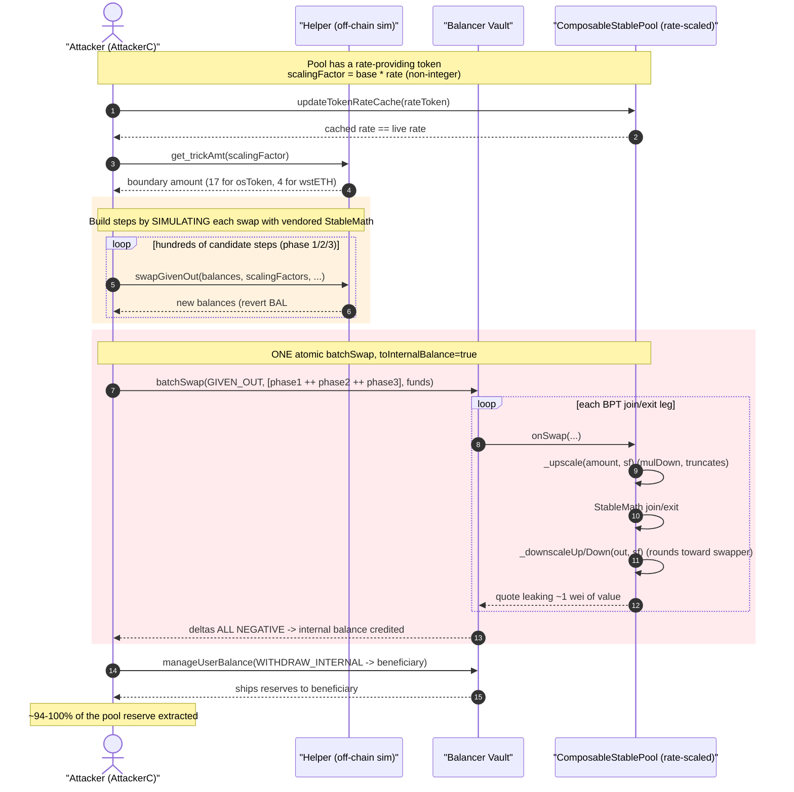
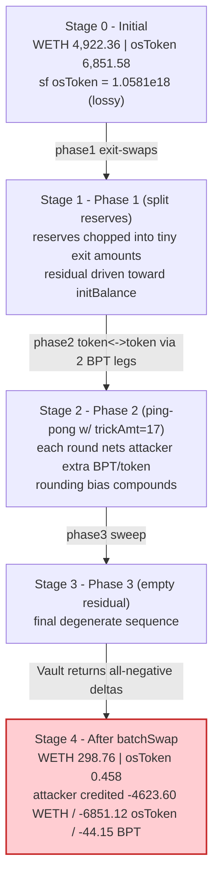
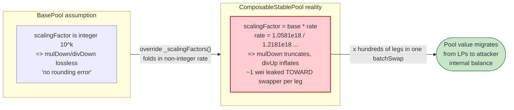

# Balancer V2 Exploit — ComposableStablePool Rounding-Error Drain via Rate-Scaled `_upscale`/`_downscale`

> **Vulnerability classes:** vuln/arithmetic/rounding · vuln/arithmetic/precision-loss

> One-line summary: A wrong "rounding is negligible" assumption in Balancer V2's `BasePool` scaling
> helpers — combined with `ComposableStablePool` overriding the scaling factor to fold in a non-integer
> **token rate** — lets an attacker bleed value out on every BPT join/exit micro-swap, then amplify the
> drift with a degenerate-state sequence to walk off with ~100% of each rate-provided pool's reserves.

> **Reproduction:** the PoC compiles & runs in an isolated Foundry project at
> [this project folder](.) (the umbrella DeFiHackLabs repo does not whole-compile, and the PoC needs the
> vendored Balancer math libraries, so it was extracted here). Full verbose trace:
> [output.txt](output.txt). Verified vulnerable source:
> [contracts_ComposableStablePool.sol](sources/ComposableStablePool_DACf5F/contracts_ComposableStablePool.sol),
> [balancer-labs_v2-pool-utils_contracts_BasePool.sol](sources/ComposableStablePool_DACf5F/balancer-labs_v2-pool-utils_contracts_BasePool.sol),
> [contracts_ComposableStablePoolRates.sol](sources/ComposableStablePool_DACf5F/contracts_ComposableStablePoolRates.sol).

---

## Key info

| | |
|---|---|
| **Loss** | ~**$120M** total across many affected ComposableStablePools (BlockSec/SlowMist figures). This PoC reproduces 2 of the drained pools and recovers **~6,588 WETH + 6,851 osETH + 4,227 wstETH + BPT** to the beneficiary. |
| **Vulnerable contract** | Balancer V2 `ComposableStablePool` (the scaling/rounding flaw lives in `BasePool._upscale`/`_downscaleUp`/`_downscaleDown` made exploitable by `ComposableStablePoolRates._scalingFactors`). Example pool: [`0xDACf5Fa19b1f720111609043ac67A9818262850c`](https://etherscan.io/address/0xDACf5Fa19b1f720111609043ac67A9818262850c#code) (osETH/wETH) |
| **Victim pools (PoC)** | osETH/wETH `0xDACf5Fa19b1f720111609043ac67A9818262850c` (poolId `…0635`); wstETH/wETH [`0x93d199263632a4EF4Bb438F1feB99e57b4b5f0BD`](https://etherscan.io/address/0x93d199263632a4EF4Bb438F1feB99e57b4b5f0BD#code) (poolId `…05c2`) |
| **Shared infra** | Balancer V2 Vault `0xBA12222222228d8Ba445958a75a0704d566BF2C8` |
| **Attacker EOA** | `0x506D1f9EFe24f0d47853aDca907EB8d89AE03207` |
| **Attacker contract** | `0x54B53503c0e2173Df29f8da735fBd45Ee8aBa30d` (`AttackerC` in PoC) |
| **Beneficiary** | `0xAa760D53541d8390074c61DEFeaba314675b8e3f` |
| **Attack tx** | [`0x6ed07db1a9fe5c0794d44cd36081d6a6df103fab868cdd75d581e3bd23bc9742`](https://app.blocksec.com/explorer/tx/eth/0x6ed07db1a9fe5c0794d44cd36081d6a6df103fab868cdd75d581e3bd23bc9742) (withdrawal `0xd155207261712c35fa3d472ed1e51bfcd816e616dd4f517fa5959836f5b48569`) |
| **Chain / block / date** | Ethereum mainnet / fork at **23,717,396** (= attack block − 1) / **Nov 3, 2025** |
| **Compiler** | Pool: Solidity **v0.7.1**, optimizer **1 run**. PoC harness compiled with 0.8.34 + `via_ir`. |
| **Bug class** | Accumulated rounding error / broken-invariant; "negligible rounding" assumption violated by an overridden non-integer scaling factor |

---

## TL;DR

Balancer V2 prices every pool in 18-decimal fixed point. To do so it **upscales** raw token amounts by a
per-token `scalingFactor`, runs StableMath on the scaled values, then **downscales** the result back.
`BasePool` rounds all of these the same direction and explicitly assumes the error is irrelevant:

> *"there's no rounding error unless `_scalingFactor()` is overriden"*
> ([BasePool.sol:680-686](sources/ComposableStablePool_DACf5F/balancer-labs_v2-pool-utils_contracts_BasePool.sol#L680-L686))

`ComposableStablePool` **does** override the scaling factor — it multiplies the base factor by each token's
**market rate** (e.g. osToken ≈ 1.0581, wstETH ≈ 1.2181), producing a non-integer scaling factor
([ComposableStablePoolRates.sol:296-306](sources/ComposableStablePool_DACf5F/contracts_ComposableStablePoolRates.sol#L296-L306)).
With a non-integer factor, `_upscale = mulDown` and `_downscaleUp = divUp` / `_downscaleDown = divDown` each
drop or add ~1 wei, and the direction is **systematically favorable to the swapper** on BPT join/exit swaps.

A single swap leaks a wei. The attacker turns that into a full pool drain by submitting a **single
`batchSwap` of hundreds of BPT↔token micro-swaps** that:

1. **Phase 1** — splits the pool's real token reserves into a sequence of tiny exit-swap amounts, repeatedly
   shaving 1% so the residual reserve falls toward a small `initBalance`.
2. **Phase 2** — runs a hand-tuned ping-pong of `GIVEN_OUT` token→token swaps (each internally two BPT
   join+exit legs) where a `trickAmt` derived from the scaling factor (`get_trickAmt`) maximizes the
   per-swap rounding gain. Each round nets the attacker a little more BPT/token than the invariant should
   allow.
3. **Phase 3** — a final degenerate sequence that empties the residual reserve.

All legs run inside one `batchSwap` with `toInternalBalance = true`, so the accumulated stolen value lands in
the attacker's Vault **internal balance**. A follow-up `manageUserBalance(WITHDRAW_INTERNAL)` ships it to the
beneficiary. The PoC repeats this for two pools; on-chain the same routine was run against every
rate-provided ComposableStablePool, summing to ~$120M.

---

## Background — what the code does

Balancer V2 holds all pool tokens in one **Vault**. A pool is a satellite contract that only does math: when
the Vault routes a swap it calls the pool's `onSwap`, which scales balances, computes a quote with
`StableMath`, and downscales the answer. `ComposableStablePool` is a stable-swap pool whose own BPT (LP
token) is itself one of the registered tokens, so a "swap" between BPT and an underlying token is really a
**single-sided join or exit** (mint/burn of BPT against StableMath).

Two `ComposableStablePool` behaviors are central to the bug:

- **Rate scaling.** Each non-BPT token may have an `IRateProvider`. The pool folds the live rate into the
  scaling factor: `scalingFactor[i] = baseScalingFactor(i) · rate(i)`
  ([ComposableStablePoolRates.sol:296-306](sources/ComposableStablePool_DACf5F/contracts_ComposableStablePoolRates.sol#L296-L306)).
  For osToken the rate is `1.058132398695929516e18`; for wstETH it is `1.218116415279760760e18` (read live in
  the trace). These are **not** multiples of 1e18, so scaling is lossy.
- **BPT swaps via join/exit.** Any swap touching the pool's own BPT goes through `_swapWithBpt`
  ([ComposableStablePool.sol:310-365](sources/ComposableStablePool_DACf5F/contracts_ComposableStablePool.sol#L310-L365)),
  which `_upscale`s the input, computes a join/exit quote, and `_downscaleDown`/`_downscaleUp`s the output.

On-chain parameters at the fork block (from [output.txt](output.txt)):

| Pool | tokens (registered order) | A (amp) | swapFee | rate-bearing token (scalingFactor) |
|---|---|---|---|---|
| osETH/wETH `…2850c` | `[WETH, BPT, osToken]`, BptIndex=1 | 200 (200000/1000) | 0.0001 (1e14) | osToken sf `1.058132e18` |
| wstETH/wETH `…f0BD` | `[wstETH, BPT, WETH]`, BptIndex=1 | 5000 (5e6/1000) | 0.0001 (1e14) | wstETH sf `1.218116e18` |

Initial reserves (`getPoolTokens`): osETH/wETH = **4,922.36 WETH / 6,851.58 osToken**; wstETH/wETH =
**4,270.84 wstETH / 1,977.06 WETH**.

---

## The vulnerable code

### 1. The wrong assumption — `BasePool` scaling helpers

```solidity
// BasePool.sol:680-686
function _upscale(uint256 amount, uint256 scalingFactor) internal pure returns (uint256) {
    // ... "This is the only place where we round in the same direction for all amounts, as the impact
    // of this rounding is expected to be minimal (and there's no rounding error unless
    // `_scalingFactor()` is overriden)."
    return FixedPoint.mulDown(amount, scalingFactor);   // ⚠️ mulDown — truncates toward 0
}

// BasePool.sol:705-707
function _downscaleDown(uint256 amount, uint256 scalingFactor) internal pure returns (uint256) {
    return FixedPoint.divDown(amount, scalingFactor);   // amount-out path: rounds DOWN
}

// BasePool.sol:726-728
function _downscaleUp(uint256 amount, uint256 scalingFactor) internal pure returns (uint256) {
    return FixedPoint.divUp(amount, scalingFactor);     // amount-in path: rounds UP
}
```

See [BasePool.sol:680-728](sources/ComposableStablePool_DACf5F/balancer-labs_v2-pool-utils_contracts_BasePool.sol#L680-L728).
The code is *correct only when `scalingFactor` is a power-of-ten integer* (the no-rate-provider case). The
moment a rate is folded in, every `mulDown`/`divDown`/`divUp` rounds by up to a full wei, and the wei always
lands on the side that benefits the party initiating the swap.

### 2. The override that makes it lossy — `ComposableStablePoolRates`

```solidity
// ComposableStablePoolRates.sol:296-306
function _scalingFactors() internal view virtual override returns (uint256[] memory) {
    uint256 totalTokens = _getTotalTokens();
    uint256[] memory scalingFactors = new uint256[](totalTokens);
    for (uint256 i = 0; i < totalTokens; ++i) {
        scalingFactors[i] = _getScalingFactor(i).mulDown(_getTokenRate(i)); // ⚠️ non-integer factor
    }
    return scalingFactors;
}
```

[ComposableStablePoolRates.sol:296-306](sources/ComposableStablePool_DACf5F/contracts_ComposableStablePoolRates.sol#L296-L306).

### 3. Where it bites — `_swapWithBpt` upscale in, downscale out

```solidity
// ComposableStablePool.sol:310-365 (excerpt)
_upscaleArray(registeredBalances, scalingFactors);
swapRequest.amount = _upscale(
    swapRequest.amount,
    scalingFactors[isGivenIn ? registeredIndexIn : registeredIndexOut]   // ⚠️ lossy upscale of the input
);
// ... StableMath join/exit on scaled values ...
return
    isGivenIn
        ? _downscaleDown(amountCalculated, scalingFactors[registeredIndexOut]) // amount out, rounded DOWN
        : _downscaleUp(amountCalculated, scalingFactors[registeredIndexIn]);   // amount in, rounded UP
```

[ComposableStablePool.sol:319-364](sources/ComposableStablePool_DACf5F/contracts_ComposableStablePool.sol#L319-L364).
The attacker drives `GIVEN_OUT` swaps so the amount they *pay in* is downscaled with `divUp`, while the
balance they consume is upscaled with `mulDown`. By choosing amounts near the rounding boundary
(`get_trickAmt` and the phase-2 ping-pong), the attacker repeatedly receives slightly more value than the
StableMath invariant intends.

---

## Root cause — why it was possible

1. **A correctness invariant ("scaling is lossless") was true for the base pool but silently broken by a
   subclass.** `BasePool._upscale` documents that there is "no rounding error unless `_scalingFactor()` is
   overridden". `ComposableStablePool` overrides exactly that, folding a live, non-integer market rate into the
   factor — so the safety assumption is violated for every rate-provided pool. Nobody re-derived the rounding
   bound after the override.

2. **The rounding direction is adversary-favorable and uncapped per swap.** Upscaling the input with
   `mulDown` (truncates the cost) and downscaling the output with the rounding that favors the swapper means
   each BPT join/exit micro-swap can transfer ≈1 wei (after rate scaling, sometimes far more than 1 raw wei of
   the underlying) from LPs to the swapper. There is no per-swap or per-tx invariant check that
   `k`/StableMath value is preserved net of rounding.

3. **`batchSwap` lets the error be applied hundreds of times atomically.** One transaction can carry hundreds
   of `BatchSwapStep`s. The PoC builds ~hundreds of steps across three phases; each step crystallizes a small
   rounding gain into the running internal balance, and the gains compound because the pool's effective
   reserves shrink as the attacker repeats the trick. The attacker also pre-shapes the pool (phase 1) into a
   state where the rounding bias is maximal, and finishes (phase 3) with a degenerate sequence that empties
   the residual reserve.

4. **Internal balances make it cheap and self-funding.** With `fromInternalBalance / toInternalBalance =
   true`, all legs net out inside the Vault; the attacker never moves real tokens between legs, only the final
   profit, and pays no per-leg ERC-20 transfer cost. The accumulated profit is withdrawn afterward via
   `manageUserBalance(WITHDRAW_INTERNAL)`.

The PoC even ships a **faithful re-implementation of the pool math** ([test/BalancerV2_exp.sol:61-93](test/BalancerV2_exp.sol#L61-L93),
`Helper.swapGivenOut`, using the vendored Balancer `StableMath` + `FixedPoint`) so it can *simulate* each
candidate swap off-chain, keep only the rounds where the math doesn't revert (`BAL#004` = `ZERO_DIVISION`
guard during search), and emit the exact step list that maximizes the leak. The `BAL#004` reverts visible in
the trace are these **off-chain simulation probes inside `try/catch`**, not failed on-chain swaps.

---

## Preconditions

- A `ComposableStablePool` with at least one **rate-providing token** (osToken, wstETH, etc.), so the
  scaling factor is non-integer. Plain stable pools without rate providers are not affected.
- Working capital to seed `batchSwap` (the PoC `deal`s WETH/wstETH/osToken to the attacker contract via the
  fork's existing balances; the routine is self-funding intra-transaction, hence **flash-loanable**).
- Ability to call `updateTokenRateCache(token)` first ([test:354](test/BalancerV2_exp.sol#L354)) so the
  pool's cached rate equals the live rate the attacker computed against — aligning the simulation with the
  on-chain factor.
- No special timing/role: the swap entry points (`batchSwap`, `manageUserBalance`) are permissionless.

---

## Attack walkthrough (with on-chain numbers from the trace)

All figures below come from [output.txt](output.txt). The PoC runs the routine twice; numbers are per pool.

### Pool 1 — osETH/wETH (`attack(osETH_wETH, 67000, 30)`)

| # | Step | Trace evidence | Effect |
|---|------|----------------|--------|
| 0 | Read pool state: `[WETH, BPT, osToken]`, balances `4922.36 / 2.596e33 / 6851.58`, sf `[1e18,1e18,1.0581e18]`, A=200, fee 1e14, actualSupply 11,847.10 BPT | [output.txt:50-99](output.txt) | Establishes the rate-scaled, lossy factor (osToken). |
| 1 | `updateTokenRateCache(osToken)` → rate `1.058132398695929516e18` | [output.txt:71-81](output.txt) | Cache == live rate so off-chain sim matches chain. |
| 2 | `get_trickAmt(1.0581e18) = 17`; pick `idx = 2` (osToken side) | [output.txt:82-83](output.txt) | Picks the boundary amount that maximizes rounding gain. |
| 3 | Build phase 1/2/3 steps and submit ONE `batchSwap(GIVEN_OUT, …, fromInternalBalance/toInternalBalance=true)` | [output.txt:424](output.txt) (10-element preview of a several-hundred-step array) | Hundreds of BPT join/exit legs, each shaving a rounding wei. |
| 4 | Vault returns all-negative deltas → attacker is **credited** every asset | `← [Return] [-4623.60 WETH, -44.15 BPT, -6851.12 osToken]` [output.txt:947](output.txt) | Pool reserve transferred into attacker internal balance. |
| 5 | `withdraw(osETH_wETH)` → `manageUserBalance(WITHDRAW_INTERNAL)` to beneficiary | [output.txt:956-971](output.txt) | 4623.60 WETH + 44.15 BPT + 6851.12 osToken shipped out. |

After step 4 the pool's registered balances had collapsed to `WETH 298.76 / osToken 0.458` (down from
4,922.36 / 6,851.58) — see [output.txt:953](output.txt) — i.e. ~94% of WETH and ~100% of osToken extracted.

### Pool 2 — wstETH/wETH (`attack(wstETH_wETH, 100000000000, 25)`)

| # | Step | Trace evidence | Effect |
|---|------|----------------|--------|
| 0 | Read pool: `[wstETH, BPT, WETH]`, balances `4270.84 / 2.596e33 / 1977.06`, sf `[1.2181e18,1e18,1e18]`, A=5000, fee 1e14, actualSupply 6,825.54 BPT | [output.txt:989-1048](output.txt) | wstETH is the rate token (idx=0). |
| 1 | `updateTokenRateCache(wstETH)` → rate `1.218116415279760760e18` (via Lido `getPooledEthByShares`) | [output.txt:1008-1025](output.txt) | Align cached rate. |
| 2 | `get_trickAmt(1.2181e18) = 4` | [output.txt:1027-1028](output.txt) | Boundary amount for this factor. |
| 3 | Single `batchSwap` of phase 1/2/3 steps | [output.txt:1253](output.txt) | Same rounding-leak compounding. |
| 4 | Vault deltas all negative | `← [Return] [-4227.26 wstETH, -10020.41 BPT, -1964.65 WETH]` [output.txt:1731](output.txt) | Reserve credited to attacker. |
| 5 | `withdraw(wstETH_wETH)` to beneficiary | [output.txt:1740-1755](output.txt) | 4227.26 wstETH + 10020.41 BPT + 1964.65 WETH shipped out. |

### Profit / loss accounting (to beneficiary `0xAa76…8e3f`)

Final beneficiary balances from the test log ([output.txt:11-15](output.txt)):

| Asset | Pool 1 take | Pool 2 take | Beneficiary total | Pool reserve it came from |
|---|---:|---:|---:|---|
| WETH | 4,623.60 | 1,964.65 | **6,588.25** | 4,922.36 (P1) + 1,977.06 (P2) |
| osToken | 6,851.12 | — | **6,851.12** | 6,851.58 (P1) → ~100% |
| wstETH | — | 4,227.26 | **4,227.26** | 4,270.84 (P2) → ~99% |
| osETH/wETH BPT | 44.15 | — | **44.15** | minted/extracted LP |
| wstETH/wETH BPT | — | 10,020.41 | **10,020.41** | minted/extracted LP |

The attacker drains **94–100% of every real reserve** in each rate-provided pool it touches. The DeFiHackLabs
header records the campaign total as **~$120M** across all affected ComposableStablePools; this PoC
demonstrates two of them end-to-end on a mainnet fork.

---

## Diagrams

### Sequence of the attack (one pool)



### Pool state evolution (osETH/wETH)



### Why the rounding is theft



---

## Why each magic number

- **`initBalance` (67000 for pool1, 1e11 for pool2):** the target residual reserve phase 1 shrinks the pool
  down to before the rounding ping-pong begins. It is sized off-chain so the phase-2 simulation converges to a
  maximal-leak step list.
- **`loops` (30 / 25):** number of phase-2 ping-pong rounds — more rounds = more accumulated rounding gain,
  bounded by gas and by the off-chain convergence of `Helper.swapGivenOut`.
- **`trickAmt = get_trickAmt(scalingFactor)` (17 / 4):** `10000 / ((sf - 1e18) * 10000 / 1e18)` — an amount
  sitting on the rounding boundary of the specific scaling factor, so each leg maximizes the wei captured by
  `mulDown`/`divUp`.
- **`limits = 0x4000…000` on all three assets:** an enormous `int256` cap so the Vault never rejects any leg
  on slippage; the attacker doesn't care about per-leg limits, only the net all-negative outcome.
- **`fromInternalBalance / toInternalBalance = true`:** keeps every leg inside the Vault ledger (no ERC-20
  transfer per leg), so the routine is self-funding and the profit is parked as internal balance for a single
  later `WITHDRAW_INTERNAL`.

---

## Remediation

1. **Re-derive and bound the rounding when scaling factors are non-integer.** A pool that folds a market rate
   into its scaling factor must NOT inherit the "rounding is lossless" assumption. Round the **input
   (cost) up** and the **output (proceeds) down** consistently so any residual error favors the pool/LPs, and
   prove a per-swap upper bound on the error.
2. **Enforce an invariant guard per swap (or per `batchSwap`).** After each join/exit leg, assert that the
   StableMath value (D) does not *decrease* by more than a provable rounding bound. A drift that lets `D` fall
   on every leg is the signature of this attack.
3. **Charge/round in the protocol's favor on rate-scaled pools.** The minimum-output / maximum-input rounding
   should always be on the LP side, never the swapper side, for any token whose factor is not a clean power of
   ten.
4. **Cap the number / cumulative effect of BPT join-exit legs that can be batched against one pool in a single
   tx,** or require that a `batchSwap` cannot strictly improve the caller's position across all assets beyond a
   rounding tolerance.
5. **Treat rate caching as security-sensitive.** Since the attack relies on aligning the cached rate with a
   computed boundary, ensure rate updates and swaps cannot be interleaved to construct a favorable boundary
   state (and audit `updateTokenRateCache` reachability).

> Note: this was an industry-wide class issue affecting Balancer V2 ComposableStablePool deployments with
> rate providers; mitigation in practice required pausing/migrating affected pools, not just a single-line fix.

---

## How to reproduce

The PoC was extracted into a standalone Foundry project. It depends on Balancer V2's `StableMath` +
`FixedPoint` + `Math` + `LogExpMath`, which are not vendored in the umbrella repo, so those math libraries are
provided under [`balancer-math/`](balancer-math) and remapped in
[`remappings.txt`](remappings.txt). `via_ir` + optimizer are enabled (the deep StableMath stack overflows the
legacy code path).

```bash
_shared/run_poc.sh 2025-11-BalancerV2_exp -vvvvv
```

- RPC: a **mainnet archive** endpoint is required for fork block 23,717,396. `foundry.toml` uses
  `https://eth.drpc.org` (the bundled Infura key returns HTTP 401). Most pruned RPCs will fail with
  `header not found` / `missing trie node`.
- Result: `[PASS] testPoC()`; the beneficiary ends with ~6,588 WETH, 6,851 osToken, 4,227 wstETH, plus BPT.

Expected tail:

```
  after attack: balance of address(beneficiary): 6588.253514734564770216   (WETH)
  after attack: balance of address(beneficiary): 44.154666372672521145     (osETH/wETH BPT)
  after attack: balance of address(beneficiary): 6851.122954230748094260   (osToken)
  after attack: balance of address(beneficiary): 4227.257976115652204400   (wstETH)
  after attack: balance of address(beneficiary): 10020.413668455251157822  (wstETH/wETH BPT)

Suite result: ok. 1 passed; 0 failed; 0 skipped; finished in 3.66s
Ran 1 test suite ... 1 tests passed, 0 failed, 0 skipped (1 total tests)
```

---

*References: BlockSec (https://x.com/BlockSecTeam/status/1986057732810518640), SlowMist
(https://x.com/SlowMist_Team/status/1986379316935205299),
hklst4r (https://x.com/hklst4r/status/1985872151077953827).*
