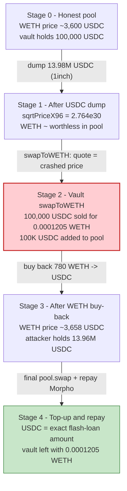
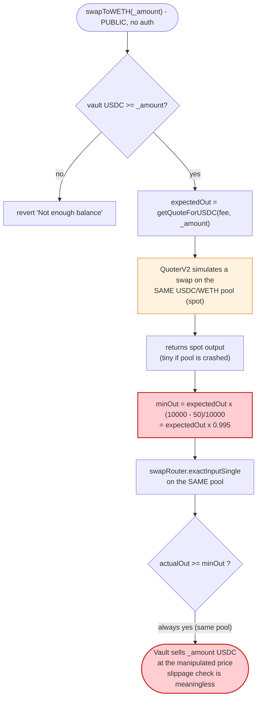

# DRLVaultV3 Exploit — Self-Referential Slippage Lets a Manipulated Pool Set Its Own "Minimum Out"

> **Vulnerability classes:** vuln/defi/slippage · vuln/oracle/spot-price

> **One-liner:** `DRLVaultV3.swapToWETH()` is a permissionless function that swaps the vault's
> entire USDC balance into WETH, computing its slippage floor from a **live, single-pool spot
> quote** of the *same* pool it trades on. An attacker flash-crashes that pool, calls
> `swapToWETH()` to dump the vault's 100,000 USDC for ~$0.43 of WETH, then restores the price and
> walks off with the difference.

> **Reproduction:** the PoC compiles & runs in an isolated Foundry project at
> [this project folder](.) (the umbrella DeFiHackLabs repo contains several unrelated PoCs that do
> not compile under a whole-project `forge test`, so this one was extracted).
> Full log run: [output.txt](output.txt). Readable verbose trace: [DRLVaultV3_exp.trace.txt](DRLVaultV3_exp.trace.txt).
> Verified vulnerable source: [sources/DRLVaultV3_6A0670/src_DRLVaultV3.sol](sources/DRLVaultV3_6A0670/src_DRLVaultV3.sol).

---

## Key info

| | |
|---|---|
| **Loss** | ~$100,000 — the vault's full **100,000 USDC** balance, swapped for **0.0001205 WETH** (≈ $0.43) |
| **Vulnerable contract** | `DRLVaultV3` (clone behind proxy) — [`0x6A06707ab339BEE00C6663db17DdB422301ff5e8`](https://etherscan.io/address/0x6A06707ab339BEE00C6663db17DdB422301ff5e8#code) |
| **Victim / drained pool** | Uniswap V3 USDC/WETH 0.01% pool — `0xE0554a476A092703abdB3Ef35c80e0D76d32939F` |
| **Attacker EOA** | [`0xC0ffeEBABE5D496B2DDE509f9fa189C25cF29671`](https://etherscan.io/address/0xC0ffeEBABE5D496B2DDE509f9fa189C25cF29671) |
| **Attacker contract** | [`0xe08d97e151473a848c3d9ca3f323cb720472d015`](https://etherscan.io/address/0xe08d97e151473a848c3d9ca3f323cb720472d015) |
| **Attack tx** | [`0xe3eab35b288c086afa9b86a97ab93c7bb61d21b1951a156d2a8f6f5d5715c475`](https://etherscan.io/tx/0xe3eab35b288c086afa9b86a97ab93c7bb61d21b1951a156d2a8f6f5d5715c475) |
| **Chain / block / date** | Ethereum mainnet / 23,769,387 / November 2025 |
| **Compiler** | Solidity v0.8.24, optimizer 200 runs |
| **Bug class** | Oracle / slippage self-reference: trade size-protection derived from the same manipulable spot pool |
| **Capital source** | 13,980,773 USDC Morpho flash loan (free), used to crash + restore the pool |
| **Post-mortem** | https://blog.verichains.io/p/the-drlvaultv3-exploit-a-slippage |

> Note on token: the PoC header reads "Total Lost: 100K USDT", but the vault's `token0` is in fact
> **USDC** (`0xA0b8…eB48`, confirmed on-chain). The dollar value is the same ~$100K.

---

## TL;DR

`DRLVaultV3` is an automated Uniswap-V3 liquidity-management vault. To rebalance, it swaps USDC into
WETH via `swapToWETH()`. That function is:

1. **`public` with no access control** — anyone can call it
   ([src_DRLVaultV3.sol:616](sources/DRLVaultV3_6A0670/src_DRLVaultV3.sol#L616)).
2. Its slippage floor is computed by calling `QuoterV2.quoteExactInputSingle` on the **same
   USDC/WETH pool** the swap will execute against
   ([:634](sources/DRLVaultV3_6A0670/src_DRLVaultV3.sol#L634),
   [:719-725](sources/DRLVaultV3_6A0670/src_DRLVaultV3.sol#L719-L725)), then multiplied by
   `(10000 − slippageBps)/10000 = 0.995` ([:637](sources/DRLVaultV3_6A0670/src_DRLVaultV3.sol#L637)).

A V3 quoter returns the *current spot* output. If the attacker has just crashed the pool, the quote
is tiny, the "minimum out" is tiny, and the vault happily sells 100K USDC for dust. The slippage
check protects against nothing because **its reference point and its execution venue are the same
manipulated pool.**

The attacker, all inside one Morpho flash-loaned transaction:

1. **Crashes** the USDC/WETH pool by dumping 13,980,773 USDC into it (via the 1inch DexRouter),
   driving the WETH price up ~100,000× in pool terms (USDC made nearly worthless).
2. **Calls `swapToWETH(100000 USDC)`** on the vault — the vault dumps its entire 100K USDC and
   receives **0.0001205 WETH**. The 100K USDC stays in the pool.
3. **Buys back / restores** the pool price by spending ~780 WETH to repurchase the USDC (now
   including the vault's freshly-deposited 100K), tops up with a final pool swap, and repays the
   flash loan.

Net effect: the vault's 100,000 USDC is absorbed into the pool during the crash and recovered by
the attacker on the round-trip. The vault is left holding 0.0001205 WETH.

---

## Background — what DRLVaultV3 does

`DRLVaultV3` ([source](sources/DRLVaultV3_6A0670/src_DRLVaultV3.sol)) is a single-owner automated
liquidity vault for a Uniswap-V3 USDC/WETH position. It is deployed as a **minimal-proxy clone**
(`initialize()` replaces the constructor,
[:112-140](sources/DRLVaultV3_6A0670/src_DRLVaultV3.sol#L112-L140); the trace shows every call as a
`[delegatecall]` into the `DRLVaultV3` implementation).

Its job is to hold USDC, swap part of it to WETH, and mint/rebalance a concentrated-liquidity
position. The on-chain configuration at the fork block (read via `cast`):

| Parameter | Value |
|---|---|
| `token0` | USDC `0xA0b86991c6218b36c1d19D4a2e9Eb0cE3606eB48` (6 decimals) |
| `token1` / `WETH` | WETH `0xC02aaA39b223FE8D0A0e5C4F27eAD9083C756Cc2` (18 decimals) |
| `fee` | 100 = **0.01% pool** |
| `slippageBps` | **50 = 0.5%** |
| `swapRouter` | Uniswap `SwapRouter02` `0x68b3465833fb72A70ecDF485E0e4C7bD8665Fc45` |
| `quoterV2` | Uniswap `QuoterV2` `0x61fFE014bA17989E743c5F6cB21bF9697530B21e` |
| `owner` | `0x76D6f63A7e2d8202d3534d836C2e724Be74e965B` |
| **USDC held by the vault** | **100,000 USDC** (`100000000000`) ← the prize |

The vault routes both its quote *and* its swap through the **same** Uniswap V3 USDC/WETH 0.01% pool
`0xE0554a476A092703abdB3Ef35c80e0D76d32939F`. That single fact is the entire vulnerability.

---

## The vulnerable code

### `swapToWETH()` — public, slippage floor from a live spot quote

```solidity
/// @notice Swap USDC to WETH
/// @param _amount Amount of USDC to swap
function swapToWETH(uint256 _amount) public returns (uint256 _amountOut) {   // ⚠️ public, no auth
    if (_amount == 0) return 0;

    uint256 tokenBalance;
    address tokenIn;

    if (token0 == WETH) {
        // ...
    } else {
        tokenBalance = IERC20(token0).balanceOf(address(this));
        require(tokenBalance >= _amount, "Not enough balance");   // only checks the vault HAS the USDC
        IERC20(token0).approve(address(swapRouter), _amount);
        tokenIn = token0;
    }

    uint256 expectedAmountOut = getQuoteForUSDC(fee, _amount);                // ⚠️ live spot quote...
    uint256 _amountOutMinimum = (expectedAmountOut * (10000 - slippageBps)) / 10000; // ⚠️ ...×0.995

    IV3SwapRouter.ExactInputSingleParams memory params = IV3SwapRouter.ExactInputSingleParams({
        tokenIn: tokenIn,
        tokenOut: WETH,
        fee: fee,
        recipient: address(this),
        amountIn: _amount,
        amountOutMinimum: _amountOutMinimum,                                 // ⚠️ derived from the same pool
        sqrtPriceLimitX96: 0
    });

    _amountOut = swapRouter.exactInputSingle(params);                        // executes on the SAME pool
}
```

[src_DRLVaultV3.sol:616-650](sources/DRLVaultV3_6A0670/src_DRLVaultV3.sol#L616-L650)

### `getQuoteForUSDC()` — the "oracle" is just the spot pool

```solidity
function getQuoteForUSDC(uint24 _fee, uint256 _amountIn) public returns (uint256) {
    IQuoterV2.QuoteExactInputSingleParams memory quoteParams = IQuoterV2.QuoteExactInputSingleParams({
        tokenIn: token0, tokenOut: WETH, fee: _fee, amountIn: _amountIn, sqrtPriceLimitX96: 0
    });
    (uint256 amountOut,,,) = quoterV2.quoteExactInputSingle(quoteParams);   // ⚠️ simulates a swap on the live pool
    return amountOut;
}
```

[src_DRLVaultV3.sol:719-726](sources/DRLVaultV3_6A0670/src_DRLVaultV3.sol#L719-L726)

Uniswap's `QuoterV2.quoteExactInputSingle` works by **actually performing the swap on the live pool
and reverting**, returning the would-be output. So `expectedAmountOut` is exactly the spot output of
the pool at that instant. The trace shows this verbatim — the quoter calls `UniswapV3Pool::swap(...)`
and reverts with the encoded result
([DRLVaultV3_exp.trace.txt:176-188](DRLVaultV3_exp.trace.txt#L176-L188)).

The identical anti-pattern also exists in `swapToUsdc()`
([:594-597](sources/DRLVaultV3_6A0670/src_DRLVaultV3.sol#L594-L597)) and `_swapExactInput()`
([:369-376](sources/DRLVaultV3_6A0670/src_DRLVaultV3.sol#L369-L376)), and `swapAllToWETH()`
([:653-683](sources/DRLVaultV3_6A0670/src_DRLVaultV3.sol#L653-L683)) even hardcodes
`amountOutMinimum: 0`.

---

## Root cause — why it was possible

A slippage check is only meaningful if its reference value (the "expected" output) is **independent
of the venue you trade on**. `DRLVaultV3` violates this completely:

> The "minimum out" is computed from `QuoterV2`, which simulates a swap on the **same pool** that
> `swapRouter.exactInputSingle` then trades against. Whatever price the attacker forces the pool to,
> the quoter reports *that* price, and the slippage floor collapses to match. The 0.5% tolerance is
> measured against a number the attacker controls.

Three composing design flaws turn this into a critical, anyone-can-call drain:

1. **`swapToWETH()` is `public` with no `onlyOwner`/`onlyOperator` modifier**
   ([:616](sources/DRLVaultV3_6A0670/src_DRLVaultV3.sol#L616)) — unlike `swapAllToWETH()`
   ([:653](sources/DRLVaultV3_6A0670/src_DRLVaultV3.sol#L653)) and `withdrawTokens()`
   ([:483](sources/DRLVaultV3_6A0670/src_DRLVaultV3.sol#L483)), which *are* gated. The attacker can
   force the vault to trade at a moment of their choosing.
2. **The slippage oracle is the spot pool itself** (no TWAP, no external price feed). A
   flash-loanable manipulation of that pool defeats the only protection.
3. **The function swaps an attacker-chosen `_amount`** with the only sanity check being "the vault
   holds at least this much" ([:629](sources/DRLVaultV3_6A0670/src_DRLVaultV3.sol#L629)). So the
   attacker simply passes the vault's full 100,000-USDC balance.

Because the whole thing fits in one transaction and requires no capital of the attacker's own (the
13.98M USDC is flash-loaned from Morpho for free), it is a pure, riskless drain.

---

## Preconditions

- The vault holds a non-trivial USDC balance to be swapped (here 100,000 USDC).
- `swapToWETH()` is reachable permissionlessly (it is — no modifier).
- The USDC/WETH pool the vault uses is manipulable within a single transaction. The Uniswap V3
  0.01% pool is deep but **the manipulation is recovered on the same-tx buy-back**, so any depth is
  affordable with a flash loan. Peak outlay was ~13.98M USDC, fully repaid intra-transaction → the
  attack is **flash-loan-funded** (Morpho, fee-free).
- No TWAP / external oracle gates the swap (none does).

---

## Attack walkthrough (with on-chain numbers from the trace)

The pool is `0xE055…939F`, `token0 = USDC` (6 dec), `token1 = WETH` (18 dec). All figures are from
`Swap`/`Transfer` events and `console.log` lines in
[output.txt](output.txt) / [DRLVaultV3_exp.trace.txt](DRLVaultV3_exp.trace.txt). "WETH Price" below
is the PoC's `CalcPrice()` display value — it *rises* as WETH becomes cheaper (the formula inverts).

| # | Step | Attacker USDC | Attacker WETH+ETH | Pool / vault effect |
|---|------|--------------:|------------------:|---------------------|
| 0 | **Flash loan** 13,980,773 USDC from Morpho ([trace:47](DRLVaultV3_exp.trace.txt#L47)) | 13,980,773 | 0.2022 WETH (seed) | "WETH Price" = **3,600** (honest) |
| 1 | **Crash**: 1inch `uniswapV3SwapTo` sells all 13,980,773 USDC → **812.95 ETH** ([trace:82,109](DRLVaultV3_exp.trace.txt#L109)) | 0 | +812.95 ETH | Pool `sqrtPriceX96` → 2.764e30; "WETH Price" = **865,051,903** (WETH crashed) |
| 2 | **Quote on crashed pool**: vault's `getQuoteForUSDC(100K)` → QuoterV2 returns **0.0001205 WETH** ([trace:175-188](DRLVaultV3_exp.trace.txt#L175)) | — | — | `amountOutMinimum` set to `0.0001205 × 0.995` = **119,915,920,988,279 wei** ([trace:205](DRLVaultV3_exp.trace.txt#L205)) |
| 3 | **`swapToWETH(100000 USDC)`** — vault sells its full 100K USDC, receives **0.0001205 WETH** ([trace:208,225](DRLVaultV3_exp.trace.txt#L208)) | 0 | unchanged | **Vault robbed**: 100K USDC → pool; vault now holds 0.0001205 WETH |
| 4 | **Restore**: 1inch swap spends **780.00 WETH** → **13,959,481 USDC** ([trace:260,273,280](DRLVaultV3_exp.trace.txt#L280)) | 13,959,482 | 32.95 ETH left | Pool price restored; "WETH Price" = **3,658** |
| 5 | **Top-up**: final `pool.swap` sells **5.83 WETH** → **21,291 USDC** ([trace:318,330](DRLVaultV3_exp.trace.txt#L330)) | 13,980,773 | ~0 | USDC reaches exactly the loan amount |
| 6 | **Repay** Morpho 13,980,773 USDC ([trace:358](DRLVaultV3_exp.trace.txt#L358)) | 0 | 27 wei WETH | Flash loan closed |

The decisive moment is **step 3**: 100,000 USDC for 0.0001205 WETH. At the honest price (~3,600
USDC/WETH) the vault's 100K USDC should have bought ≈ **27.8 WETH**. It got ≈ **0.0001205 WETH** —
a loss of essentially the entire $100,000.

### Why the "minimum out" did not save the vault

`amountOutMinimum` was `119,915,920,988,279` wei (≈ 0.00012 WETH), and the swap returned
`120,518,513,556,060` wei (≈ 0.00012 WETH). The check `actualOut ≥ minOut` **passed**, because both
numbers were derived from the same crashed pool. The 0.5% tolerance was applied to a number the
attacker had already driven to near-zero.

### Profit accounting

The attack repays the exact 13,980,773 USDC flash loan and nets the value extracted from the vault.
The vault's loss is unambiguous and is the economic transfer:

| Quantity | Value |
|---|---:|
| USDC the vault swapped away | **100,000.000000 USDC** |
| WETH the vault received | **0.000120518513556060 WETH** (≈ $0.43) |
| **Vault net loss** | **≈ $100,000** |
| Attacker capital at risk | 0 (flash-loaned, repaid same tx) |

The attacker's 100K-USDC gain is realized inside the pool round-trip: the vault deposited 100K USDC
into the pool during the crash (step 3), and the attacker repurchased that USDC — including the
vault's contribution — on the restore (steps 4–5). The vault paid; the attacker collected.

---

## Diagrams

### Sequence of the attack

```mermaid
sequenceDiagram
    autonumber
    actor A as "Attacker contract"
    participant M as "Morpho"
    participant DR as "1inch DexRouter"
    participant P as "USDC/WETH V3 pool"
    participant V as "DRLVaultV3"
    participant Q as "QuoterV2"
    participant SR as "SwapRouter02"

    A->>M: flashLoan(USDC, 13,980,773)
    M-->>A: 13,980,773 USDC

    rect rgb(255,235,238)
    Note over A,P: Step 1 — crash the pool
    A->>DR: uniswapV3SwapTo(sell 13,980,773 USDC)
    DR->>P: swap()
    P-->>A: 812.95 ETH
    Note over P: WETH crashed (~100,000x in pool terms)
    end

    rect rgb(255,243,224)
    Note over A,V: Steps 2-3 — rob the vault
    A->>V: swapToWETH(100,000 USDC)
    V->>Q: getQuoteForUSDC(100,000) on the SAME pool
    Q->>P: swap() then revert
    Q-->>V: expectedOut = 0.0001205 WETH
    Note over V: minOut = 0.0001205 x 0.995 (useless)
    V->>SR: exactInputSingle(100,000 USDC -> WETH)
    SR->>P: swap()
    P-->>V: 0.0001205 WETH
    Note over V: vault dumped 100K USDC for ~$0.43
    end

    rect rgb(232,245,233)
    Note over A,P: Steps 4-5 — restore price, collect
    A->>DR: uniswapV3SwapTo(spend 780 WETH -> USDC)
    DR->>P: swap()
    P-->>A: 13,959,481 USDC
    A->>P: pool.swap(sell 5.83 WETH -> 21,291 USDC)
    P-->>A: 21,291 USDC
    end

    A->>M: repay 13,980,773 USDC
    Note over A: Vault's 100K USDC captured; loan repaid
```

### Pool price evolution



### The flaw inside `swapToWETH` / `getQuoteForUSDC`



---

## Why each magic number

- **`FLASHLOAN_USDC = 13,980,773,000,000` (13.98M USDC):** enough to overwhelm the 0.01% pool's
  in-range liquidity and crash the WETH price far enough that 100K USDC quotes to ~0.0001 WETH. It
  is flash-loaned and fully repaid, so its size costs the attacker nothing.
- **`VAULT_SWAP_USDC = 100,000,000,000` (100,000 USDC):** exactly the vault's full USDC balance —
  the attacker drains everything in one call.
- **`amountIn = 779,999,999,999,792,152,553` (~780 WETH) on the buy-back:** sized to repurchase the
  USDC (including the vault's 100K) and push the pool price back to normal so the loan can be repaid.
- **Final `pool.swap(-21,291,294,107)`:** sells ~5.83 WETH for the remaining 21,291 USDC needed to
  reach exactly `13,980,773,000,000` USDC and repay Morpho to the wei.

---

## Remediation

1. **Add access control to `swapToWETH()`.** It performs a value-moving swap of vault funds and must
   be `onlyOwner`/`onlyOperator`, exactly like `swapAllToWETH()` and `withdrawTokens()` already are.
   A permissionless function that lets *anyone* trigger a swap of the vault's entire balance is the
   primary defect.
2. **Never derive slippage protection from the venue you trade on.** `getQuoteForUSDC` /
   `getQuoteForWETH` read the live spot pool, which is the same pool the swap executes against, so
   the "minimum out" tracks whatever the attacker sets the price to. Use a **manipulation-resistant
   reference**: a Chainlink/Pyth USD price feed, or a sufficiently long Uniswap V3 **TWAP**
   (`pool.observe`), to compute the expected output independently of the instantaneous spot price.
3. **Bound trades to the reference price, not the spot quote.** Compute `amountOutMinimum` from the
   external/TWAP price × `amountIn` × `(1 − tolerance)`. If the spot pool deviates from the reference
   beyond tolerance, the swap should revert instead of executing at a manipulated rate.
4. **Reject swaps when spot deviates from TWAP.** Add an explicit guard: if
   `|spotPrice − twapPrice| / twapPrice > maxDeviation`, revert. This blocks the entire sandwich.
5. **Fix the same pattern everywhere.** `swapToUsdc()` ([:594-610](sources/DRLVaultV3_6A0670/src_DRLVaultV3.sol#L594-L610)),
   `_swapExactInput()` ([:363-389](sources/DRLVaultV3_6A0670/src_DRLVaultV3.sol#L363-L389)) and
   `addLiquidityALL`/`rebase` share the self-referential-quote logic; `swapAllToWETH()`
   ([:653-683](sources/DRLVaultV3_6A0670/src_DRLVaultV3.sol#L653-L683)) uses `amountOutMinimum: 0`
   outright. All must move to an external reference price.

---

## How to reproduce

The PoC was extracted into a standalone Foundry project (the umbrella DeFiHackLabs repo has several
unrelated PoCs that fail to compile under a whole-project `forge test`):

```bash
_shared/run_poc.sh 2025-11-DRLVaultV3_exp -vvvvv
```

- RPC: an **Ethereum mainnet archive** endpoint is required (fork block 23,769,386). `foundry.toml`
  uses an Infura archive endpoint.
- Result: `[PASS] testExploit()`. The decisive log lines are the vault swap — 100,000 USDC in,
  `120518513556060` wei (0.0001205 WETH) out.

Expected tail:

```
Ran 1 test for test/DRLVaultV3_exp.sol:DRLVaultV3_EXP
[PASS] testExploit() (gas: 9747641)
Logs:
  ...
  ========= Before Swap on Vault =========
  Vault weth balane 0
  Vault eth balane 0
  Vault usdc balane 100000000000
  ========= After Swap on Vault =========
  ...
```

---

*References: Verichains post-mortem — https://blog.verichains.io/p/the-drlvaultv3-exploit-a-slippage ;
DeFiHackLabs (DRLVaultV3, Ethereum, ~$100K).*
