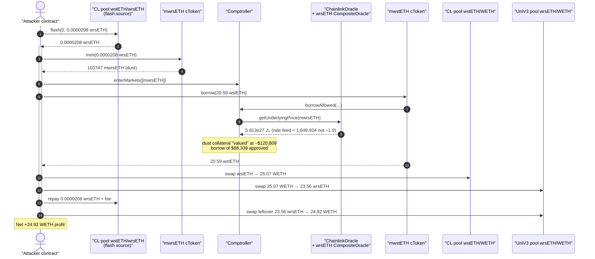
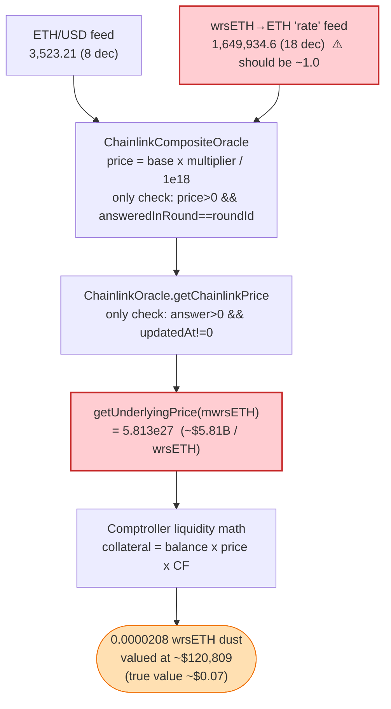
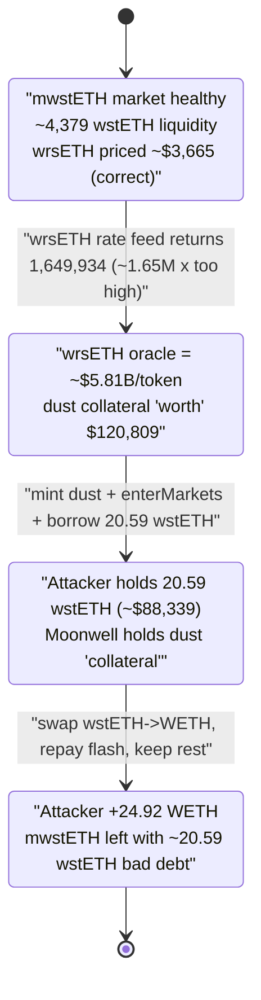

# Moonwell Exploit — Corrupted wrsETH Oracle ⇒ Borrow ~$88K Against ~$0.07 of Collateral

> **Reproduction:** the PoC compiles & runs in an isolated Foundry project at
> [this project folder](.) (the umbrella DeFiHackLabs repo does not whole-compile,
> so this PoC was extracted into a standalone project).
> Full verbose trace: [output.txt](output.txt).
> Verified vulnerable oracle source:
> [ChainlinkCompositeOracle.sol](sources/ChainlinkCompositeOracle_79C613/src_oracles_ChainlinkCompositeOracle.sol)
> and [ChainlinkOracle.sol](sources/ChainlinkOracle_EC942b/src_core_Oracles_ChainlinkOracle.sol).

---

## Key info

| | |
|---|---|
| **Loss** | ~$1M total across Moonwell markets; the reproduced single transaction nets **24.92 WETH ≈ $88K** |
| **Vulnerable contract** | Moonwell `ChainlinkOracle` price feed — [`0xEC942bE8A8114bFD0396A5052c36027f2cA6a9d0`](https://basescan.org/address/0xEC942bE8A8114bFD0396A5052c36027f2cA6a9d0#code), reading the wrsETH `ChainlinkCompositeOracle` — [`0x79C613B4f07080963C3B0CA58Eb2745dD4C744A5`](https://basescan.org/address/0x79C613B4f07080963C3B0CA58Eb2745dD4C744A5#code) |
| **Drained market** | `mwrsETH` cToken [`0xfC41B49d064Ac646015b459C522820DB9472F4B5`](https://basescan.org/address/0xfC41B49d064Ac646015b459C522820DB9472F4B5) (collateral) / `mwstETH` cToken [`0x627Fe393Bc6EdDA28e99AE648fD6fF362514304b`](https://basescan.org/address/0x627Fe393Bc6EdDA28e99AE648fD6fF362514304b) (borrowed) |
| **Attacker EOA** | [`0x6997a8c804642ae2de16d7b8ff09565a5d5658ff`](https://basescan.org/address/0x6997a8c804642ae2de16d7b8ff09565a5d5658ff) |
| **Attacker contract** | [`0x42ecd332d47c91cbc83b39bd7f53cebe5e9734bb`](https://basescan.org/address/0x42ecd332d47c91cbc83b39bd7f53cebe5e9734bb) |
| **Attack tx** | [`0x190a491c0ef095d5447d6d813dc8e2ec11a5710e189771c24527393a2beb05ac`](https://app.blocksec.com/explorer/tx/base/0x190a491c0ef095d5447d6d813dc8e2ec11a5710e189771c24527393a2beb05ac) |
| **Chain / block / date** | Base / 37,722,881 (fork = attack block − 1) / November 2025 |
| **Compiler** | Test pragma `^0.8.10`; oracle deployed under Solidity 0.8.19 |
| **Bug class** | Oracle price corruption — unbounded/unsanitized exchange-rate feed propagated into collateral valuation |

---

## TL;DR

Moonwell prices its `wrsETH` collateral with a **`ChainlinkCompositeOracle`** that multiplies an
ETH/USD feed by a "wrsETH→ETH exchange-rate" feed
([ChainlinkCompositeOracle.sol:133-160](sources/ChainlinkCompositeOracle_79C613/src_oracles_ChainlinkCompositeOracle.sol#L133-L160)).
At the attack block, the wrsETH exchange-rate multiplier feed
(`0xd7221b10FBBC1e1ba95Fd0B4D031C15f7F365296` → aggregator `0x4a61dB…`) was reporting
**`1,649,934.6`** instead of the ~`1.0` an LST/ETH exchange rate should hold — i.e. a value inflated by
roughly **1.65 million×**.

Moonwell's oracle stack performs **no plausibility validation** — the composite oracle only checks
`price > 0 && answeredInRound == roundId`
([:180-195](sources/ChainlinkCompositeOracle_79C613/src_oracles_ChainlinkCompositeOracle.sol#L180-L195)),
and the consuming `ChainlinkOracle.getChainlinkPrice` only checks `answer > 0 && updatedAt != 0`
([ChainlinkOracle.sol:97-113](sources/ChainlinkOracle_EC942b/src_core_Oracles_ChainlinkOracle.sol#L97-L113)).
The garbage was passed straight through to `getUnderlyingPrice(mwrsETH)`, which the trace shows
returning **`5,813,066,107,843,462,759,938,890,135`** (≈ **$5.8 billion per wrsETH**) versus the
correct ~$3,665.

The attacker:

1. Flash-borrows a **dust** amount of wrsETH (`0.0000208` wrsETH, true value ≈ **$0.07**).
2. `mint`s it into `mwrsETH` and `enterMarkets` — the corrupt oracle values this dust collateral at
   **≈ $120,809**.
3. `borrow`s **20.59 wstETH (≈ $88,339)** from `mwstETH` against the imaginary collateral.
4. Swaps the borrowed wstETH → WETH, buys back just enough dust wrsETH to repay the flash loan,
   and keeps the rest.

Net profit of the reproduced transaction: **24.92 WETH**, leaving Moonwell holding a worthless dust
position as "collateral" against a real ~20.59 wstETH bad debt.

---

## Background — what Moonwell does

Moonwell is a Compound-v2-style lending market deployed on Base. Each asset has an `MErc20` cToken
(here the proxy `MErc20Delegator` → implementation `MErc20Delegate`). Users `mint` cTokens by
depositing the underlying, `enterMarkets` to use them as collateral, and `borrow` other assets up to a
**collateral-factor-weighted** limit. The borrow limit is enforced in the `Comptroller`'s
`borrowAllowed` → `getHypotheticalAccountLiquidityInternal`, which values every collateral and debt
position via a single `PriceOracle.getUnderlyingPrice(mToken)`.

The deployed oracle is `ChainlinkOracle`
([source](sources/ChainlinkOracle_EC942b/src_core_Oracles_ChainlinkOracle.sol)). For LST assets like
wstETH and wrsETH whose USD price is not directly quoted, Moonwell registers a
**`ChainlinkCompositeOracle`** as the "feed", which derives a USD price by multiplying:

- a **base** ETH/USD feed, by
- a **multiplier** LST→ETH exchange-rate feed, (optionally by)
- a **second multiplier**.

For wstETH the composite is *three* oracles (ETH/USD × stETH/ETH × wstETH/stETH); for wrsETH it is
*two* (ETH/USD × wrsETH/ETH-rate). The composite is treated as an 18-decimal Chainlink feed so the
rest of Moonwell is unaware it is reading a synthetic price.

On-chain values pulled from the trace at the fork block:

| Input | Address | Value (raw) | Interpreted |
|---|---|---:|---|
| ETH/USD (base) | `0x71041d…` agg `0x57d2d4…` | `352321000000` (8 dec) | $3,523.21 |
| wstETH/stETH rate | `0x04030d…` (18 dec) | `1218209487333800156` | 1.2182 |
| stETH/ETH | `0x79b0e8…` (18 dec) | `999517054137551200` | 0.99952 |
| **wrsETH→ETH "rate"** | **`0xd7221b…` agg `0x4a61dB…`** (18 dec) | **`1649934607316470707093500`** | **1,649,934.6** ⚠️ |

The wstETH composite resolves to a sane **`4,289,935,040,437,591,781,830`** (≈ $4,290).
The wrsETH composite resolves to **`5,813,066,107,843,462,759,938,890,135`** (≈ $5.81B) — the bug.

---

## The vulnerable code

### 1. The composite oracle blindly multiplies feeds with no sanity bounds

```solidity
// ChainlinkCompositeOracle.getDerivedPrice (2-oracle path used for wrsETH)
function getDerivedPrice(address baseAddress, address multiplierAddress, uint8 expectedDecimals)
    public view returns (uint256)
{
    ...
    int256 scalingFactor = int256(10 ** uint256(expectedDecimals)); // 1e18
    int256 basePrice = getPriceAndScale(baseAddress, expectedDecimals);      // ETH/USD scaled to 1e18
    int256 quotePrice = getPriceAndScale(multiplierAddress, expectedDecimals); // wrsETH/ETH "rate"
    return calculatePrice(basePrice, quotePrice, scalingFactor); // (base * quote) / 1e18
}
```

[ChainlinkCompositeOracle.sol:103-123](sources/ChainlinkCompositeOracle_79C613/src_oracles_ChainlinkCompositeOracle.sol#L103-L123)

The only validation performed on each component feed:

```solidity
function getPriceAndDecimals(address oracleAddress) public view returns (int256, uint8) {
    (uint80 roundId, int256 price, , , uint80 answeredInRound)
        = AggregatorV3Interface(oracleAddress).latestRoundData();
    bool valid = price > 0 && answeredInRound == roundId;   // ← only check
    require(valid, "CLCOracle: Oracle data is invalid");
    ...
}
```

[ChainlinkCompositeOracle.sol:180-195](sources/ChainlinkCompositeOracle_79C613/src_oracles_ChainlinkCompositeOracle.sol#L180-L195)

There is **no min/max bound, no deviation check, no staleness window, and no cross-check** that an
"exchange-rate" multiplier is anywhere near `1.0`. A multiplier of `1,649,934.6` passes `valid` and is
multiplied straight into the price.

### 2. The consuming `ChainlinkOracle` adds no bounds either

```solidity
function getChainlinkPrice(AggregatorV3Interface feed) internal view returns (uint256) {
    (, int256 answer, , uint256 updatedAt, ) = AggregatorV3Interface(feed).latestRoundData();
    require(answer > 0, "Chainlink price cannot be lower than 0");
    require(updatedAt != 0, "Round is in incompleted state");
    // ...scale to 18 decimals and return — no plausibility check
}
```

[ChainlinkOracle.sol:97-113](sources/ChainlinkOracle_EC942b/src_core_Oracles_ChainlinkOracle.sol#L97-L113)

`getUnderlyingPrice(mwrsETH)` therefore returned the absurd 5.8e27 mantissa straight to the
Comptroller's liquidity math, which happily authorized the borrow.

---

## Root cause — why it was possible

The wrsETH price for Moonwell is the product of an ETH/USD feed and a **wrsETH→ETH exchange-rate
feed**. That second feed is supposed to track the LST redemption ratio, which for a healthy
liquid-staking token sits within a tight band around `1.0`. At the attack block this rate feed was
reporting **`1,649,934.6`** — about **1.65 million× too high**. Whether the upstream rate provider was
itself compromised/mis-configured or fed a bad update, the failure that turned it into a $1M loss is
inside **Moonwell's oracle layer**:

> Moonwell's `ChainlinkCompositeOracle` and `ChainlinkOracle` accept any feed value that is merely
> positive and "fresh", with **zero plausibility validation**. There is no upper/lower price bound, no
> circuit-breaker comparing against a TWAP or prior price, and no assertion that an *exchange-rate*
> multiplier stays near unity. A single bad multiplier therefore inflates collateral valuation by
> millions of times, with no defense.

Concrete consequences of the design:

1. **Exchange-rate feeds are trusted as if they were prices.** A 6-order-of-magnitude error in a rate
   feed becomes a 6-order-of-magnitude error in collateral value. Treating a ratio that must be ≈1.0
   exactly like an unbounded USD price removes the one natural sanity bound that existed.
2. **No bounds / deviation guard anywhere in the stack.** Neither the composite oracle nor the
   consuming `ChainlinkOracle` clamps or rejects an out-of-range answer. `price > 0` is not a safety
   check against over-valuation.
3. **Lending math fully trusts the oracle.** `getHypotheticalAccountLiquidityInternal` multiplies the
   collateral balance by `getUnderlyingPrice` × collateral factor with no independent ceiling, so an
   inflated price is directly an inflated borrowing power.
4. **Dust collateral is enough.** Because the inflation factor is ~1.65M, even a fraction-of-a-cent
   wrsETH deposit unlocks five-figure-USD borrows; the attack needs essentially no capital beyond a
   trivially-repaid flash loan.

---

## Preconditions

- The wrsETH exchange-rate multiplier feed (`0xd7221b…` → `0x4a61dB…`) reporting a grossly inflated
  value (`1,649,934.6`) at the attack block — the trigger that made wrsETH collateral effectively
  infinite. The PoC simply forks the chain at that block, so the bad feed value is live in state.
- `mwstETH` holds enough underlying wstETH to satisfy the borrow (the market held ≈ 4,379 wstETH;
  [output.txt:1757](output.txt) shows `balanceOf(mwstETH) = 4379490485621820558566`).
- A flash-loan source for the dust collateral seed. The attacker flash-borrows wrsETH from the
  Aerodrome/Velo-style CL pool `0x14dcCDd3…` (wstETH/wrsETH), but the amount (0.0000208 wrsETH) is so
  small it is barely "capital" at all.
- `wrsETH` is an enterable collateral market with a non-zero collateral factor.

---

## Attack walkthrough (with on-chain numbers from the trace)

All numbers below are read directly from [output.txt](output.txt). The attack runs entirely inside the
flash-loan callback `uniswapV3FlashCallback`
([Moonwell_exp.sol:194-235](test/Moonwell_exp.sol#L194-L235)).

| # | Step | Concrete numbers (from trace) | Effect |
|---|------|------|--------|
| 0 | Flash-borrow wrsETH from CL pool `0x14dcCDd3…` | borrow **20,782,357,954,960 wei = 0.0000208 wrsETH**; fee = `2,078,235,796` wei (0.01%) [output.txt:1597](output.txt) | Seed dust collateral; fully repaid at the end. |
| 1 | `wrsETH.approve(mwrsETH)` + `mwrsETH.mint(0.0000208 wrsETH)` | mint returns `103747` cToken units [output.txt:1663-1733](output.txt) | Attacker now holds dust `mwrsETH` collateral. |
| 2 | `comptroller.enterMarkets([mwrsETH])` | `MarketEntered` [output.txt:1744-1752](output.txt) | wrsETH dust counts as collateral. |
| 3 | **Oracle valuation** of the dust | `getUnderlyingPrice(mwrsETH) = 5,813,066,107,843,462,759,938,890,135` (≈ $5.81B/wrsETH); `getUnderlyingPrice(mwstETH) = 4,289,935,040,437,591,781,830` (≈ $4,290) [output.txt:1819-1852](output.txt) | Dust collateral "worth" ≈ **$120,809**; true worth ≈ **$0.07**. |
| 4 | `mwstETH.borrow(20,592,096,934,942,276,800)` | borrow **20.59 wstETH (≈ $88,339)**; `Borrow` event [output.txt:1753-1950](output.txt) | Real wstETH leaves Moonwell against imaginary collateral. |
| 5 | Swap borrowed wstETH → WETH on CL pool `0x861A…` (wstETH/WETH) | 20.59 wstETH → **25.0677 WETH** [output.txt:1972-2032](output.txt) | Convert debt asset to WETH. |
| 6 | Swap WETH → wrsETH on Uniswap-V3 pool `0x16e25…` (just enough to repay) | spend 25.0677 WETH → **23.5626 wrsETH** [output.txt:2035-2065](output.txt) | Acquire wrsETH to settle the flash loan. |
| 7 | Repay flash loan to `0x14dcCDd3…` | transfer **20,784,436,190,756 wei wrsETH** (principal + fee) [output.txt:2066-2073](output.txt) | Flash loan closed; **23.5625 wrsETH leftover**. |
| 8 | Swap leftover wrsETH → WETH on `0x16e25…` | 23.5625 wrsETH → **24.9175 WETH** [output.txt:2117-2143](output.txt) | Realize profit in WETH. |

**Result:** `WETH profit: 24,917,534,577,559,974,182` = **24.92 WETH** ([output.txt:1569](output.txt)).
The `mwstETH` market is left short ~20.59 wstETH of bad debt, "collateralized" by a worthless dust
`mwrsETH` position.

### Why the oracle number is what it is

```
wrsETH USD price = ETH/USD × (wrsETH→ETH rate)
                 = 3,523.21 × 1,649,934.6          (rate should be ≈ 1.0)
                 ≈ 5,813,066,107.8  (in 1e18 mantissa: 5.813e27)
```

Verified exactly against the trace: `(352321000000·1e10 · 1649934607316470707093500) / 1e18 =
5813066107843462759938890135`. With a correct rate of ≈1.0 the price would have been ≈ $3,665, and the
0.0000208 wrsETH dust would have been worth **$0.07**, granting essentially zero borrowing power.

### Profit accounting (WETH)

| Direction | Amount (WETH) |
|---|---:|
| Borrowed wstETH → WETH (step 5) | +25.0677 |
| Spent buying wrsETH to repay flash (step 6) | −25.0677 |
| Leftover wrsETH → WETH (step 8) | +24.9175 |
| Flash-loan principal+fee (wrsETH, dust) | ≈ 0 |
| **Net profit** | **+24.9175 WETH** |

The whole 24.92 WETH is value extracted from Moonwell's `mwstETH` market — the borrowed wstETH minus
the trivial cost of round-tripping a dust flash loan.

---

## Diagrams

### Sequence of the attack



### Oracle corruption: how a dust deposit becomes $120K of collateral



### Moonwell market state evolution



---

## Remediation

1. **Bound every oracle answer.** Reject or clamp prices outside a configured `[min, max]` per feed.
   An LST USD price near $5.8 *billion* should never be accepted; a simple per-asset ceiling would have
   stopped this entirely. (Compound-v2 forks commonly add a `BoundedPriceOracle` / anchored guard.)
2. **Validate exchange-rate multipliers near unity.** The composite oracle multiplies by an LST→ETH
   "rate" that must stay in a tight band (e.g. `0.5e18 ≤ rate ≤ 2e18`). Enforce that band in
   `getPriceAndDecimals` / `getDerivedPrice` and revert otherwise.
3. **Add a deviation / circuit-breaker check.** Compare the new composite price against the last
   accepted price (or a short TWAP) and revert if it deviates more than, say, 10–20% within a window.
   A 1.65-million× jump must trip a breaker.
4. **Enforce staleness on every component feed.** `getChainlinkPrice` checks only `updatedAt != 0`; it
   should require `block.timestamp - updatedAt <= heartbeat` for each feed, including the composite's
   sub-feeds.
5. **Use redundant/independent oracles for collateral valuation.** Cross-check the composite price
   against a second source (e.g. a DEX TWAP or a second provider) and reject when they diverge, so a
   single corrupted feed cannot unilaterally set borrowing power.
6. **Pause-on-anomaly.** Wire an automated guardian that pauses minting/borrowing of an asset whose
   oracle deviates beyond a sane bound, to contain damage if a feed is compromised.

---

## How to reproduce

The PoC was extracted into a standalone Foundry project (the umbrella DeFiHackLabs repo has several
unrelated PoCs that fail `forge test`'s whole-project build):

```bash
_shared/run_poc.sh 2025-11-Moonwell_exp -vvvvv
```

- RPC: a **Base archive** endpoint is required (fork block 37,722,881). `foundry.toml` uses
  `https://base-mainnet.public.blastapi.io`, which serves historical state at that block.
- Forking + execution takes ~1–2 minutes.
- Result: `[PASS] testExploit()` with `WETH profit: 24917534577559974182` (≈ 24.92 WETH).

Expected tail:

```
Ran 1 test for test/Moonwell_exp.sol:ContractTest
[PASS] testExploit() (gas: 1294837)
Logs:
  WETH profit: 24917534577559974182

Suite result: ok. 1 passed; 0 failed; 0 skipped
```

---

*References: CertiK Alert (https://x.com/CertiKAlert/status/1985620452992253973); Halborn —
"Explained: The Moonwell Hack, November 2025" (https://www.halborn.com/blog/post/explained-the-moonwell-hack-november-2025).*
