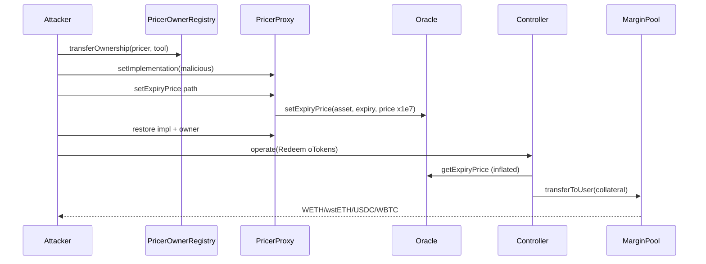

# Ribbon Finance MarginPool — corrupted oToken expiry prices via pricer proxy takeover

<!-- non-defihacklabs -->

> **Vulnerability classes:** vuln/oracle/price-manipulation · vuln/access-control/broken-logic · vuln/logic/incorrect-calculation · vuln/dependency/upgradeable-contract
>
> **Reproduction:** offline via [`_shared/run_poc.sh 2025-12-RibbonMarginPool_exp -vvvvv`](.) · see [`output.txt`](output.txt)

## Key info

| Field | Value |
|-------|--------|
| **Loss** | ~$2.7M |
| **Vulnerable contract** | MarginPool `0x3c212A044760DE5a529B3Ba59363ddeCcc2210bE` · Oracle `0xb5711dAeC960c9487d95bA327c570a7cCE4982c0` · pricer proxies (e.g. stETH `0xa4aC089B…`) |
| **Attacker EOA** | `0x657CDEfc7ef8b459b519dEFc8BED2A67d3cC1aAb` |
| **Attack contract** | `0x4BFD5C65082171DF83fD0fBBe54aa74909529b2c` |
| **Attack txs** | setup `0xb73e4594…` · redeem `0x16eded25…` |
| **Chain · block · date** | Ethereum · 23995263 (setup@23995254) · 2025-12-14 |
| **Bug class** | Pricer ownership/upgrade path → wrong-scale `setExpiryPrice` → OTM call redeem as ITM |

## TL;DR

Legacy Ribbon/Opyn-style MarginPool held collateral for cash-secured call oTokens that expired OTM. The attacker temporarily took ownership of multiple asset **pricer proxies** through an ownership registry (`transferOwnership(proxy, newOwner)`), upgraded the implementation, and called `Oracle.setExpiryPrice` with prices scaled ~×1e7 above the correct 1e8-USD convention. Settlement then treated OTM calls as deeply ITM; redeeming a fraction of the long oTokens drained ~299 WETH + 343 wstETH + 178k USDC + 2.55 WBTC from the MarginPool in the first redeem wave (~$2.7M total campaign).

## Background

Ribbon’s options stack used Opyn Gamma modules: Controller, MarginPool, Oracle, and per-asset pricers. After expiry, long oToken holders call `Controller.operate(Redeem)` and receive collateral based on `getExpiryPrice`. Pricers alone may call `setExpiryPrice` once the locking period ends.

## The vulnerable code

Oracle enforces caller == `assetPricer[asset]`:

```solidity
function setExpiryPrice(address _asset, uint256 _expiryTimestamp, uint256 _price) external {
    require(msg.sender == assetPricer[_asset], "Oracle: caller is not authorized to set expiry price");
    // ...
    storedPrice[_asset][_expiryTimestamp] = Price(_price, now);
}
```

Pricers were upgradeable proxies whose owner was a registry at `0x9d7b3586…` exposing `transferOwnership(address proxy, address newOwner)`. The attack path (trace of setup tx):

1. `transferOwnership(pricer, attackerTool)` via registry  
2. `setImplementation(malicious)` on pricer  
3. Malicious impl → `Oracle.setExpiryPrice(asset, expiry, inflatedPrice)`  
4. Restore impl + ownership  

Example corrupted prices (expiry 1765526400):

| Asset | Live `getPrice` (1e8 USD) | Stored expiry price |
|-------|---------------------------|---------------------|
| stETH | ~3.246e11 ($3246) | ~3.246e18 (×1e7) |
| AAVE  | ~2.044e10 | ~2.044e17 |
| LINK  | ~1.406e9 | ~1.406e16 |

## Root cause

1. **Centralized pricer ownership / upgradeability** with a registry function that could reassign ownership of live pricers used for settlement.  
2. **No validation** that expiry prices match live oracle scale (1e8 USD) or stay within a band of spot.  
3. Settlement math trusts finalized expiry prices fully → incorrect ITM payouts from MarginPool.

## Preconditions

- oTokens at/after expiry with dispute period over (or treated finalized).  
- Attacker holds long oTokens (full supply of several 12DEC25 series).  
- Ability to exercise pricer ownership transfer + upgrade (registry path).  
- MarginPool still holds residual collateral for those series.

## Attack walkthrough

1. **Setup** (`0xb73e45…`, block 23995254): for stETH/AAVE/LINK/PAXG pricers — own → upgrade → `setExpiryPrice` inflated → restore.  
2. **Redeem** (`0x16eded…`, block 23995264): burn partial oToken amounts (pool-limited), receive nearly full collateral notional.  
3. Swap collateral to WETH and exit.

PoC (`test/RibbonMarginPool_exp.sol`) forks at 23995263 and replays Controller redeems with historical burn sizes:

| Asset gained | Amount |
|--------------|--------|
| WETH | 299.48 |
| wstETH | 343.88 |
| USDC | 178,073.78 |
| WBTC | 2.55 |

## Diagrams



## Remediation

- Remove or hard-guard pricer ownership transfer; use immutable or multisig+timelock with no silent upgrade.  
- Bound `setExpiryPrice` vs live Chainlink/TWAP (max deviation).  
- Scale/unit asserts (must be 1e8 USD).  
- Dispute period + independent disputer monitoring before finalization.  
- Drain residual MarginPool liquidity for deprecated series; wind down legacy controllers.

## How to reproduce

```bash
cd ~/RustroverProjects/audits/evm-hack-registry
_shared/run_poc.sh 2025-12-RibbonMarginPool_exp -vvvvv
```

*Reference: https://x.com/CertiKAlert/status/2000017101080379662*
