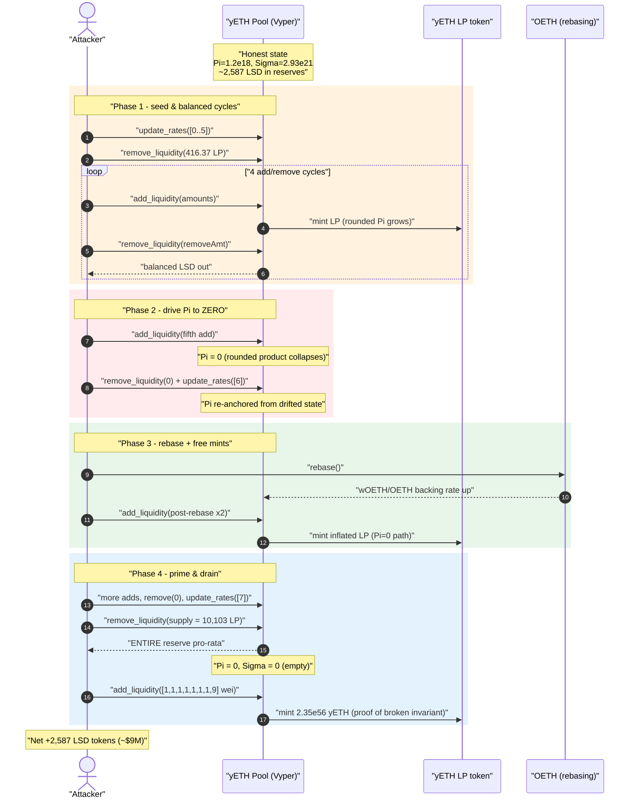
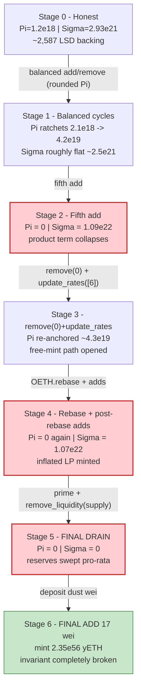
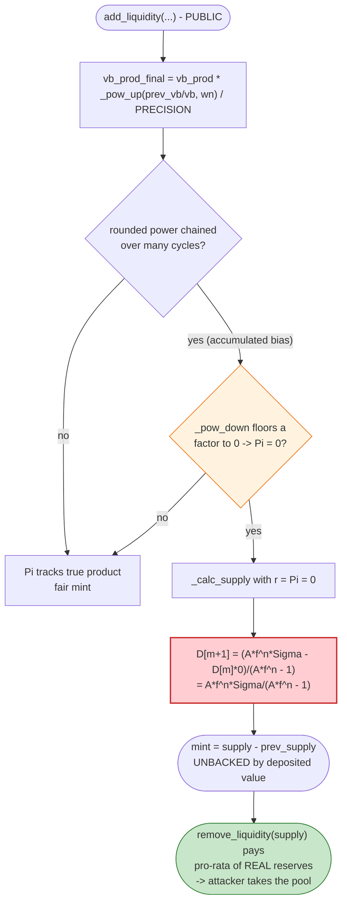

# yETH Weighted-StableSwap Exploit — Invariant Rounding Drift Mints Unbacked LP

> **Vulnerability classes:** vuln/arithmetic/rounding · vuln/arithmetic/precision-loss

> **Reproduction:** the PoC compiles & runs in an isolated Foundry project at
> [this project folder](.) (the umbrella DeFiHackLabs repo contains many unrelated
> PoCs that do not compile together, so this one was extracted).
> Full verbose trace: [output.txt](output.txt).
> Verified vulnerable source (Vyper 0.3.10):
> [yETH weighted stableswap pool.sol](sources/yETH%20weighted%20stableswap%20pool_Ccd040/yETH%20weighted%20stableswap%20pool.sol).

---

## Key info

| | |
|---|---|
| **Loss** | **~$9M** — the pool's entire LSD reserve: ~2,587 ETH-equivalent across 8 liquid-staking tokens |
| **Vulnerable contract** | `yETH weighted stableswap pool` (Yearn yETH) — [`0xCcd04073f4BdC4510927ea9Ba350875C3c65BF81`](https://etherscan.io/address/0xCcd04073f4BdC4510927ea9Ba350875C3c65BF81#code) |
| **Victim / pool** | The yETH pool itself + its LP token `yETH` [`0x1BED97CBC3c24A4fb5C069C6E311a967386131f7`](https://etherscan.io/address/0x1BED97CBC3c24A4fb5C069C6E311a967386131f7) |
| **Attacker EOA** | `0xfb63aa935cf0a003335dce9cca03c4f9c0fa4779` |
| **Attacker contract** | `0xbb2789b418fa18f9526ba79fa7038d4e6d753f73` |
| **Attack tx** | `0x53fe7ef190c34d810c50fb66f0fc65a1ceedc10309cf4b4013d64042a0331156` |
| **Chain / block / date** | Ethereum mainnet / 23,914,085 / December 2025 |
| **Compiler** | Vyper `0.3.10`, optimizer `1 run` |
| **Bug class** | Broken AMM invariant via accumulated rounding drift in the iterative D-invariant / `_pow` math (unbacked LP mint) |
| **Reference** | banteg, "yETH exploit report" — https://github.com/banteg/yeth-exploit/blob/main/report.pdf |

---

## TL;DR

The yETH pool is a Curve-style **weighted** stableswap whose invariant `D` (a.k.a. supply) is solved
iteratively in `_calc_supply()` and whose per-asset terms use a rounded `_pow_up`/`_pow_down`
power function with a fixed `MAX_POW_REL_ERR = 1e-16` relative-error fudge factor
([:153](sources/yETH%20weighted%20stableswap%20pool_Ccd040/yETH%20weighted%20stableswap%20pool.sol#L153)).
The pool maintains two packed accumulators — the product term `vb_prod` (Π) and the sum term
`vb_sum` (Σ) — and updates them **incrementally** on every `add_liquidity` / `remove_liquidity`
instead of recomputing them from scratch.

Because each incremental update applies a *rounded* power term, **the stored `vb_prod` drifts away
from the true product**. By hammering the pool with a carefully tuned sequence of balanced
add/remove cycles, small single-asset deposits, and `update_rates()` recomputations, the attacker
drives the stored `vb_prod` accumulator to **exactly `0`** (visible repeatedly in the trace:
`vb_prod: 0` after the 5th add, the post-rebase adds, etc.). With `Π = 0`, the supply recursion

```
D[m+1] = (A·fⁿ·Σ − D[m]·Π) / (A·fⁿ − 1)
```

degenerates: the `D[m]·Π` correction term vanishes, so `_calc_supply` solves for a hugely inflated
`D`, and `add_liquidity` **mints far more yETH LP than the deposited value backs**. Repeating this
ratchets the attacker's LP balance up while the real reserves stay roughly flat.

The finale: the attacker calls `remove_liquidity(pool.supply, …)` to burn LP for a **balanced,
pro-rata** withdrawal — and since their LP is now wildly over-minted, the pro-rata share is the
**entire pool**. `vb_sum`/`vb_prod` go to `0`, every LSD reserve is swept out, and a final
`add_liquidity([1,1,1,1,1,1,1,9])` of literal **wei** mints **2.35 × 10⁵⁶ yETH**
([output.txt:4640](output.txt)) — a number that has no relationship to value and is the unmistakable
signature of a totally broken invariant.

Net theft = the pool's whole LSD stack (~2,587 ETH-equivalent, ≈ **$9M**), with the attacker's own
seed capital returned (the PoC's `_takeInitialsBack()` subtracts the `deal`-ed working balance so the
printed "After exploit" numbers are pure profit).

---

## Background — what the yETH pool does

Yearn's **yETH** is an index of liquid-staking ETH tokens. The pool
([source](sources/yETH%20weighted%20stableswap%20pool_Ccd040/yETH%20weighted%20stableswap%20pool.sol),
author *0xkorin, Yearn Finance*) is a Vyper weighted-stableswap holding **8 LSD assets**, read from
the trace's `assets(i)` calls ([output.txt:1668-1683](output.txt)):

| idx | asset | address |
|----:|-------|---------|
| 0 | sfrxETH | `0xac3E018457B222d93114458476f3E3416Abbe38F` |
| 1 | wstETH | `0x7f39C581F595B53c5cb19bD0b3f8dA6c935E2Ca0` |
| 2 | ETHx (proxy) | `0xA35b1B31Ce002FBF2058D22F30f95D405200A15b` |
| 3 | cbETH (proxy) | `0xBe9895146f7AF43049ca1c1AE358B0541Ea49704` |
| 4 | rETH | `0xae78736Cd615f374D3085123A210448E74Fc6393` |
| 5 | apxETH | `0x9Ba021B0a9b958B5E75cE9f6dff97C7eE52cb3E6` |
| 6 | wOETH | `0xDcEe70654261AF21C44c093C300eD3Bb97b78192` |
| 7 | mETH | `0xd5F7838F5C461fefF7FE49ea5ebaF7728bB0ADfa` |

Each asset carries a **rate** (its LSD→ETH exchange rate, e.g. sfrxETH ≈ 1.142, wstETH ≈ 1.221 — see
the `RateUpdate` events at [output.txt:2116-2141](output.txt)) and a **weight**. The pool tracks two
packed scalars that summarize the whole curve:

- `vb_prod` (Π) — the weighted **product** term `∏ (D·wᵢ / vbᵢ)^(wᵢ·n)`
- `vb_sum` (Σ) — the **sum** of virtual balances `∑ vbᵢ`

These are stored packed in `packed_pool_vb`
([:1404-1424](sources/yETH%20weighted%20stableswap%20pool_Ccd040/yETH%20weighted%20stableswap%20pool.sol#L1404-L1424))
and the LP supply `D` is recovered from them via the iterative `_calc_supply`.

---

## The vulnerable code

### 1. The rounded power functions — the source of drift

```vyper
def _pow_up(_x: uint256, _y: uint256) -> uint256:
    p: uint256 = self._pow(_x, _y)
    if p == 0:
        return 0
    # p + (p * MAX_POW_REL_ERR - 1) / PRECISION + 1   (round UP)
    return unsafe_add(unsafe_add(p, unsafe_div(unsafe_sub(unsafe_mul(p, MAX_POW_REL_ERR), 1), PRECISION)), 1)

def _pow_down(_x: uint256, _y: uint256) -> uint256:
    p: uint256 = self._pow(_x, _y)
    if p == 0:
        return 0
    e: uint256 = unsafe_add(unsafe_div(unsafe_sub(unsafe_mul(p, MAX_POW_REL_ERR), 1), PRECISION), 1)
    if p < e:
        return 0          # ⚠️ small p collapses to ZERO
    return unsafe_sub(p, e)
```

[:1426-1457](sources/yETH%20weighted%20stableswap%20pool_Ccd040/yETH%20weighted%20stableswap%20pool.sol#L1426-L1457).
These are intentionally one-sided rounding helpers, but they only guarantee a *relative* error bound.
When chained multiplicatively through many incremental updates they accumulate a **directional bias**,
and `_pow_down` can floor a term all the way to `0`.

### 2. `add_liquidity` updates Π and Σ *incrementally* with those rounded powers

```vyper
# update product and sum of virtual balances
vb_prod_final = vb_prod_final * self._pow_up(prev_vb * PRECISION / vb, wn) / PRECISION
vb_sum_final += dvb
...
vb_prod = vb_prod * self._pow_up(prev_vb * PRECISION / (vb - fee), wn) / PRECISION
vb_sum += dvb - fee
```

[:473-481](sources/yETH%20weighted%20stableswap%20pool_Ccd040/yETH%20weighted%20stableswap%20pool.sol#L473-L481).
`vb_prod` is **carried forward** (`vb_prod * _pow_up(...) / PRECISION`) rather than recomputed from the
fresh balances. Every cycle multiplies the running Π by another rounded factor, so the error compounds.

### 3. `_calc_supply` — when Π drifts to 0 it solves for an inflated D

```vyper
# D[m+1] = (A f^n sigma - D[m] pi[m]) / (A f^n - 1)
l: uint256 = _amplification         # A f^n
d: uint256 = l - PRECISION          # A f^n - 1
l = l * _vb_sum                     # A f^n * sigma
s: uint256 = _supply                # D[m]
r: uint256 = _vb_prod               # pi[m]   <-- if this is 0 ...

for _ in range(255):
    assert s > 0
    sp: uint256 = unsafe_div(unsafe_sub(l, unsafe_mul(s, r)), d)   # (l - s*r)/d
    ...
```

[:1242-1293](sources/yETH%20weighted%20stableswap%20pool_Ccd040/yETH%20weighted%20stableswap%20pool.sol#L1242-L1293).
With `r = pi = 0`, the corrective `s·r` term vanishes and the recursion converges to
`sp = A·fⁿ·Σ / (A·fⁿ − 1)` — a value driven purely by Σ with **no product constraint**. The minted LP
`mint = supply − prev_supply` is then completely disconnected from the value actually deposited.

### 4. `remove_liquidity` is strictly pro-rata on supply — so inflated LP drains everything

```vyper
prev_supply: uint256 = self.supply
supply: uint256 = prev_supply - _lp_amount
self.supply = supply
PoolToken(token).burn(msg.sender, _lp_amount)
...
for asset in range(MAX_NUM_ASSETS):
    ...
    dvb: uint256 = prev_vb * _lp_amount / prev_supply   # ⬅ pro-rata of REAL balance
    vb: uint256 = prev_vb - dvb
    ...
    amount: uint256 = dvb * PRECISION / rate
    assert ERC20(self.assets[asset]).transfer(_receiver, amount, ...)
```

[:539-568](sources/yETH%20weighted%20stableswap%20pool_Ccd040/yETH%20weighted%20stableswap%20pool.sol#L539-L568).
`remove_liquidity` ignores Π entirely and just pays out `prev_vb · _lp_amount / prev_supply` of each
real reserve. So once the attacker holds an over-minted LP balance equal to `self.supply`, burning it
returns **100% of every reserve**.

### 5. `update_rates` is permissionless and re-anchors Π

```vyper
@external
def update_rates(_assets: DynArray[uint256, MAX_NUM_ASSETS]):
    ...
    vb_prod, vb_sum = self._update_rates(assets, vb_prod, vb_sum)
    self.packed_pool_vb = self._pack_pool_vb(vb_prod, vb_sum)
```

[:654-675](sources/yETH%20weighted%20stableswap%20pool_Ccd040/yETH%20weighted%20stableswap%20pool.sol#L654-L675),
and inside `_update_rates` the product is again re-scaled by a rounded `_pow_up`
([:1066](sources/yETH%20weighted%20stableswap%20pool_Ccd040/yETH%20weighted%20stableswap%20pool.sol#L1066))
and supply re-derived ([:1078](sources/yETH%20weighted%20stableswap%20pool_Ccd040/yETH%20weighted%20stableswap%20pool.sol#L1078)).
The attacker interleaves `update_rates()` calls — including the no-op `remove_liquidity(0)` then
`update_rates([6])`/`update_rates([7])` pattern — to *re-snapshot* Π/Σ at chosen moments, nudging the
accumulator the rest of the way to 0.

---

## Root cause — why it was possible

The protocol's safety relies on a single mathematical invariant relating Π, Σ and the supply `D`. But
that invariant is enforced with **finite-precision, incrementally-maintained** state:

1. **Π is cached and mutated, never reconstructed.** `add/remove_liquidity` and `update_rates` carry
   the previous `vb_prod` forward and multiply it by a *rounded* power term. The pool never recomputes
   Π from the current balances (except on the very first deposit via `_calc_vb_prod_sum`). Rounded
   factors chained over dozens of operations accumulate a one-directional error.
2. **`_pow_down` floors small terms to literal 0.** The `if p < e: return 0` branch
   ([:1455-1456](sources/yETH%20weighted%20stableswap%20pool_Ccd040/yETH%20weighted%20stableswap%20pool.sol#L1455-L1456))
   lets a sufficiently lop-sided pool state collapse a product factor to zero, which then propagates
   into `vb_prod = 0`.
3. **`_calc_supply` is degenerate at Π = 0.** With the product correction gone, the Newton step mints
   LP bounded only by Σ — i.e. the attacker mints "free" yETH.
4. **`remove_liquidity` is pure pro-rata and ignores Π.** It trusts `self.supply` as ground truth, so
   inflated LP cashes out the full reserves with no invariant re-check.
5. **Every lever is permissionless.** `add_liquidity`, `remove_liquidity` and `update_rates` are all
   open to any caller; the 10%-rate-cap guard in `_update_rates`
   ([:1059-1060](sources/yETH%20weighted%20stableswap%20pool_Ccd040/yETH%20weighted%20stableswap%20pool.sol#L1059-L1060))
   only restricts *rate increases*, not the attacker's manipulation pattern.

In short: a **constant-product-style invariant maintained by lossy incremental arithmetic** can be
walked off its true value by an attacker who chooses the operation sequence, until the cached product
term hits a degenerate value and the mint math gives away tokens.

---

## Preconditions

- A live yETH pool with real LSD liquidity (it held ~2,587 ETH-equivalent at the fork block).
- Working capital in the 8 LSD tokens to run the add/remove cycles. The PoC `deal`s `20,000e18` of
  each asset as headroom ([yETH_exp.sol:49,88-95](test/yETH_exp.sol#L88-L95)); the working capital is
  fully recovered, so the attack is effectively self-funding / flash-loanable (the real attacker used
  flash-sourced capital and `_takeInitialsBack()` models giving it back).
- The pool **not paused** (the math entrypoints assert `not self.paused`,
  [:1033](sources/yETH%20weighted%20stableswap%20pool_Ccd040/yETH%20weighted%20stableswap%20pool.sol#L1033)).
- No special privilege — all functions used (`add_liquidity`, `remove_liquidity`, `update_rates`) are
  permissionless. The only `update_rates` constraint (10% upward rate cap) is never tripped.

---

## Attack walkthrough (with on-chain numbers from the trace)

All Π/Σ figures are the `vb_prod` / `vb_sum` console logs in [output.txt](output.txt); LP figures are
the `Received yETH:` logs / `AddLiquidity`/`RemoveLiquidity` events. The exploit is run by
`testExploit()` ([yETH_exp.sol:80-86](test/yETH_exp.sol#L80-L86)).

| # | Step (PoC fn) | `vb_prod` (Π) | `vb_sum` (Σ) | LP / note |
|---|---------------|--------------:|-------------:|-----------|
| 0 | `update_rates([0..5])` baseline ([yETH_exp.sol:104-110](test/yETH_exp.sol#L104-L110)) | 1.218e18 | 2.929e21 | honest state |
| 1 | `remove_liquidity(416.37 yETH)` ([:136-141](test/yETH_exp.sol#L136-L141)) | 1.218e18 | 2.512e21 | seed removal |
| 2 | add cycle 1 → remove 2,789.35 | 2.139e18 | 2.518e21 | LP minted 2,789.35 (got back 2,789.35) |
| 3 | add cycle 2 → remove 7,379.20 | 5.915e18 | 2.540e21 | Π climbing vs. flat Σ |
| 4 | add cycle 3 → remove 7,066.64 | 2.070e19 | 2.624e21 | |
| 5 | add cycle 4 → remove 3,496.16 | 4.222e19 | 2.744e21 | |
| 6 | **fifth add** ([:152-154](test/yETH_exp.sol#L152-L154)) | **0** | 1.090e22 | ⚠️ **Π collapses to 0** — mint math now degenerate |
| 7 | tiny add asset 3 (20.6) → `remove(0)` → `update_rates([6])` ([:157-164](test/yETH_exp.sol#L157-L164)) | re-anchors 9.09e19 → 4.34e19 | 1.092e22 | `remove(0)` forces Π recompute from drifted state |
| 8 | sixth remove 8,434.93 | 4.344e19 | 1.696e21 | |
| 9 | **`OETH.rebase()`** ([:167-169](test/yETH_exp.sol#L167-L169)) | 4.344e19 | 1.696e21 | bumps wOETH/OETH backing rate |
| 10 | post-rebase adds 1 & 2 | **0** | 1.070e22 | Π = 0 again → free mint |
| 11 | asset-3 add → `remove(0)` → `update_rates([6])` → eighth remove 9,237.03 ([:175-184](test/yETH_exp.sol#L175-L184)) | 4.344e19 | 6.558e20 | |
| 12 | tenth/eleventh adds, asset-3 add, `remove(0)`, `update_rates([7])` ([:187-196](test/yETH_exp.sol#L187-L196)) | 4.344e19 | 1.106e22 | pool primed |
| 13 | **FINAL DRAIN** `remove_liquidity(supply = 10,103.23 yETH)` ([:198-202](test/yETH_exp.sol#L198-L202)) | **0** | **0** | sweeps **entire** reserve pro-rata |
| 14 | **FINAL ADD** `[1,1,1,1,1,1,1,9]` wei ([:204-211](test/yETH_exp.sol#L204-L211)) | 4.28e19 | 16 | mints **2.354e56 yETH** for ~17 wei — invariant fully broken |

After step 13 the pool's `vb_sum` and `vb_prod` are both `0` and every LSD reserve has been transferred
to the attacker. Step 14 is the gratuitous proof: depositing 17 wei mints
`235,443,031,407,908,519,912,635,443,025,109,143,978,181,362,622,575,235,916` yETH
([output.txt:4640](output.txt)).

### Net theft (after `_takeInitialsBack()` returns the seed capital)

Balances at "After exploit" ([output.txt:1652-1661](output.txt)) — these are pure profit because
`_takeInitialsBack()` subtracts the `20,000e18` working balance per asset
([yETH_exp.sol:97-102](test/yETH_exp.sol#L97-L102)):

| Asset | Amount stolen | ≈ ETH (× rate) |
|-------|--------------:|---------------:|
| sfrxETH | 641.07 | ~732 |
| wstETH | 359.66 | ~439 |
| ETHx | 203.17 | ~218 |
| cbETH | 279.07 | ~300 |
| rETH | 204.30 | ~232 |
| apxETH | 798.10 | ~870 |
| wOETH | 50.54 | ~58 |
| mETH | 51.39 | ~53 |
| **yETH (LP)** | 2.354e56 (worthless — pool already drained) | 0 |
| **Total LSD** | **2,587.31 tokens** | **≈ 2,900 ETH ≈ $9M** |

The 2.354e56 yETH the attacker is left holding is unbacked — the pool it represents claims on is empty
— so the realized loss is the **2,587 LSD tokens** (~$9M at December-2025 ETH prices), matching the
PoC header's "Total Lost: 9M USD".

---

## Diagrams

### Sequence of the attack



### Pool state (Pi / Sigma) evolution



### Why the mint math gives away tokens at Pi = 0



---

## Remediation

1. **Reconstruct the invariant, don't cache-and-mutate it.** Recompute `vb_prod` from the live
   balances (`_calc_vb_prod_sum`) at the start of each state-changing operation instead of carrying a
   rounded `vb_prod` forward across `add_liquidity` / `remove_liquidity` / `update_rates`. Incremental
   maintenance of a product term with one-directional rounding is the structural flaw.
2. **Never let the product term degenerate to 0.** Treat `vb_prod == 0` (and any `_pow_down → 0` floor
   on a non-zero balance) as an error/`assert`, not a value to feed into `_calc_supply`. A zero product
   term mathematically corresponds to a zero-balance asset, which `add_liquidity` should reject.
3. **Cross-check minted LP against deposited value.** After `_calc_supply`, verify the minted LP does
   not exceed the value implied by `dvb`/rates within a tight tolerance; revert on divergence. The
   current code trusts the iterative solver unconditionally.
4. **Re-validate the invariant on `remove_liquidity`.** It currently pays pure pro-rata of reserves on
   `self.supply` with no Π check; add an invariant sanity check so an inflated supply cannot translate
   to an over-withdrawal.
5. **Bound rounding accumulation.** Cap the number of, or the cumulative error from, sequential
   liquidity operations within a transaction, or recompute exact integer terms (fixed-point with
   conservative rounding *against* the user) so an attacker cannot walk the accumulator off its true
   value.
6. **Pause and re-audit the iterative D/`_pow` math.** This is the same class of bug as historic
   Curve/StableSwap rounding-drift findings; the weighted variant's `_pow_up`/`_pow_down` chaining
   deserves dedicated property/fuzz testing of the Π↔Σ↔supply invariant.

---

## How to reproduce

The PoC was extracted into a standalone Foundry project (the umbrella DeFiHackLabs repo has many
unrelated PoCs that fail to compile under a whole-project `forge build`):

```bash
_shared/run_poc.sh 2025-12-yETH_exp -vvvvv
```

- RPC: an **Ethereum mainnet archive** endpoint is required (fork block 23,914,085). `foundry.toml`
  uses an Infura archive endpoint.
- The PoC `deal`s working capital in all 8 LSD tokens, runs the manipulation sequence, then
  `_takeInitialsBack()` removes the seed so the printed "After exploit" balances are net profit.
- Result: `[PASS] testExploit()`. The smoking-gun line is `Received yETH: 2.354e56` after the FINAL
  DRAIN/ADD and the non-zero stolen LSD balances at "After exploit".

Expected tail:

```
=== After exploit ===
 sfrxETH Balance: 641.074575696016244679
 wstETH Balance: 359.660954158309014237
 ETHx Balance: 203.169624055563120825
 cbETH Balance: 279.067336257280184065
 rETH Balance: 204.302160863078446818
 apxETH Balance: 798.100750053197635282
 wOETH Balance: 50.542841971854161901
 mETH Balance: 51.389053609897701305
 yETH Balance: 235443031407908519912635443025109144355.018078460956624356
[PASS] testExploit() (gas: 7297892)
Suite result: ok. 1 passed; 0 failed; 0 skipped
```

---

*Reference: banteg, "yETH exploit report" — https://github.com/banteg/yeth-exploit/blob/main/report.pdf
· Original PoC: https://github.com/johnnyonline/yETH-hack*
