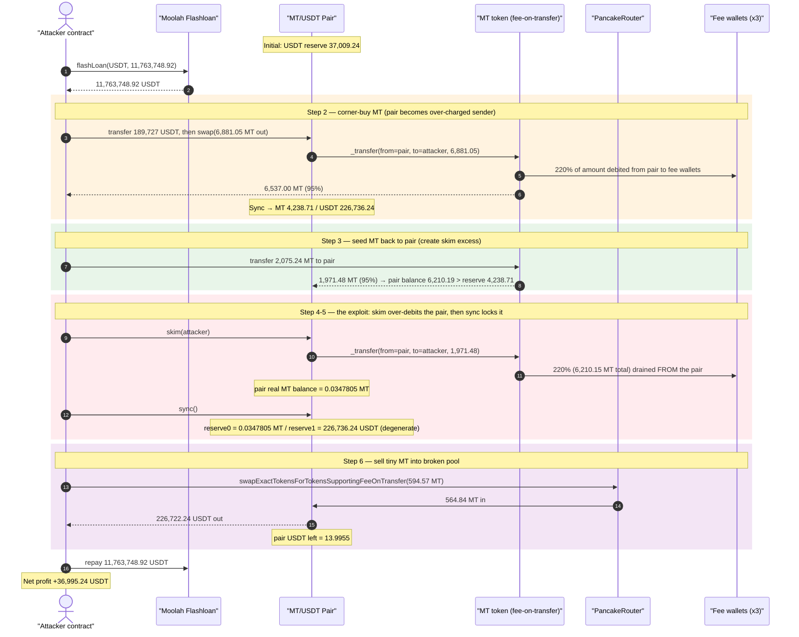
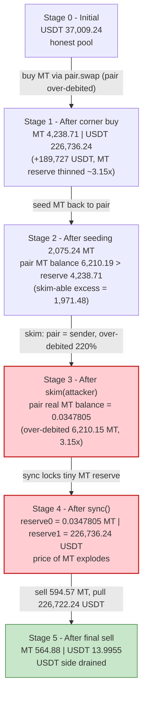
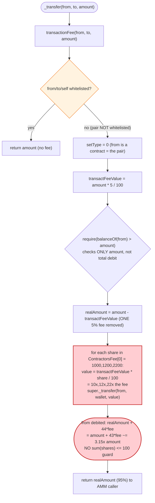
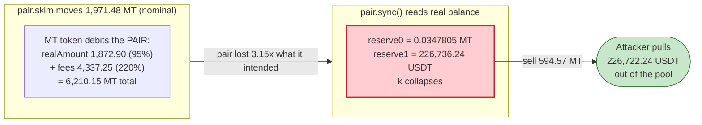

# MT Token Exploit — Fee-on-Transfer Overcharge Drains the AMM Pair via `skim()`+`sync()`

> **One-line summary:** MT's `transactionFee()` splits a 5% fee across a list of percentages that sum to **4400%** (no `sum(shares) ≤ 100` guard), so every MT transfer debits the *sender* ~315% of the nominal amount; the attacker weaponises this by making the **pair** the sender (via `skim()`), collapsing the pair's MT reserve to ~0.035 MT, then sells a tiny amount of MT to drain ~36,995 USDT.

> **Reproduction:** the PoC compiles & runs in this isolated Foundry project at
> [this project folder](.). Full verbose trace: [output.txt](output.txt).
> Verified vulnerable source: [sources/MetaverseToken_2f3f25/MetaverseToken.sol](sources/MetaverseToken_2f3f25/MetaverseToken.sol).

---

## Key info

| | |
|---|---|
| **Loss** | **~36,995.24 USDT** net pool loss (gross USDT pulled from pair: ~226,722.24 USDT, the rest recycled to repay the flash loan) |
| **Vulnerable contract** | `MetaverseToken` (MT) — [`0x2f3f25046Ea518d1E524B8fB6147c656D6722CeD`](https://bscscan.com/address/0x2f3f25046Ea518d1E524B8fB6147c656D6722CeD#code) |
| **Victim pool** | MT/USDT PancakeV2 pair — [`0xbf4707B7f9F53e3aAE29Bf2558CB373419Ef4D45`](https://bscscan.com/address/0xbf4707B7f9F53e3aAE29Bf2558CB373419Ef4D45) |
| **Attacker EOA** | `0xe918a1784ceca08e51a1b740f4036fd149339811` |
| **Attacker contract (flashloan receiver)** | `0xb64f5d49656fae38655ef2e3c2e3768ddb5f3d5c` |
| **Flash-loan provider** | Moolah (ERC1967Proxy) — `0x8F73b65B4caAf64FBA2aF91cC5D4a2A1318E5D8C` |
| **Fee recipients** | `0xa0f76967e9F36367c9045AdcfEe0F62D17B4F016`, `0x869A387Fa1B10A7A3F6361B89e9D0946a40A4F1A`, `0xf8E339c3bCF47417E5b1F8B76bf8d8a4034Ef493` |
| **Attack tx (BSC)** | `0xe1e6aa5332deaf0fa0a3584113c17bedc906148730cbbc73efae16306121687b` ([CertiK SkyLens](https://skylens.certik.com/tx/arb/0xe1e6aa5332deaf0fa0a3584113c17bedc906148730cbbc73efae16306121687b)) |
| **Chain / block / date** | BSC / 74,937,080 / Jan 2026 (fork at 74,937,079) |
| **Compiler** | MT token: Solidity **v0.5.8+commit.23d335f2**, optimizer **on, 999999 runs** |
| **Bug class** | Fee-on-transfer accounting flaw — unbounded fee-share list (`sum(shares) > 100%`) causes sender over-debit; AMM pair becomes the over-charged sender |

---

## TL;DR

`MetaverseToken` (MT) is a fee-on-transfer ERC20. On a normal transfer it takes a 5% fee
(`transactFeeValue = amount × 5 / 100`) and is *supposed* to split that 5% among three "contractor"
fee recipients. But the split percentages stored in `ContractorsFee[setType=0]` are **`[1000, 1200, 2200]`**
— i.e. 1000%, 1200% and 2200% of the fee, totalling **4400%** of `transactFeeValue` (≈ 220% of the
transfer amount). There is **no check that the shares sum to ≤ 100**, and the function only deducts a
single `transactFeeValue` from the recipient's credited amount
([MetaverseToken.sol:907-925](sources/MetaverseToken_2f3f25/MetaverseToken.sol#L907-L925)).

The net effect: **every MT transfer debits the *sender* ~315% of the nominal amount** — 95% reaches the
recipient and ~220% is shovelled to the three fee wallets.

This is normally just a punitive sell-tax that users eat. It becomes catastrophic when the **AMM pair
itself is the sender** of an MT transfer, because the pair has no idea its balance just dropped by 3.15×
the amount it intended to move. The attacker engineers exactly that:

1. **Flash-loan** ~11.76M USDT from Moolah.
2. **Buy MT** directly from the pair (`pair.swap`) using 189,727 USDT → the pair sends `amountOut` MT to
   the attacker but, because the *pair* is the `from`, the fee logic debits the pair an extra 220%, so
   the pair's MT balance falls ~3.15× faster than the swap accounts for. The Sync after this swap already
   shows a thinned MT reserve (4,238.7 MT) against an inflated 226,736 USDT reserve.
3. **Seed** 2,075.24 MT back to the pair (making `balanceOf(pair) > reserve0`), creating skim-able excess.
4. **`pair.skim(attacker)`** — skim transfers the excess MT *from the pair*. Once more the buggy fee logic
   over-debits the pair: it tries to move 1,971.48 MT but actually subtracts **6,210.15 MT** from the
   pair's balance, crashing the pair's real MT balance to **0.0347805 MT**.
5. **`pair.sync()`** — the pair reads its (now tiny) real MT balance and **locks 0.0347805 MT as the new
   MT reserve**, while the USDT reserve stays at 226,736 USDT. The MT/USDT price is now astronomically
   inflated.
6. **Sell 594.57 MT** through the fee-on-transfer-aware router → because the pair holds ~0.035 MT against
   226,736 USDT, this tiny sell yields **226,722.24 USDT**, draining the pool.
7. **Repay** the flash loan; keep **36,995.24 USDT** profit (the pool's real liquidity).

The pool's USDT goes from 37,009.24 → 13.9955 USDT; the attacker walks away with 36,995.24 USDT.

---

## Background — what MetaverseToken does

`MetaverseToken` ([source](sources/MetaverseToken_2f3f25/MetaverseToken.sol)) is a Solidity-0.5.8 ERC20
("MT") with a custom fee-on-transfer layer bolted onto OpenZeppelin's old `ERC20`:

- **Whitelist bypass** — `transactionFee` returns the full amount (no fee) if `from`/`to`/`msg.sender`
  is the token itself or is whitelisted by an external "dispatcher" contract `_dis`
  (`isWhite`, [MetaverseToken.sol:883](sources/MetaverseToken_2f3f25/MetaverseToken.sol#L883)).
- **`setType` selection** — for non-whitelisted transfers it picks a fee profile: `setType = 0` if `from`
  is a contract (the "sell"/from-contract profile), `1` if `to` is a contract, else `2`
  ([:884-889](sources/MetaverseToken_2f3f25/MetaverseToken.sol#L884-L889)).
- **Base fee** — `_transactFeeValue = 5`, so `transactFeeValue = amount × 5 / 100`
  ([:791](sources/MetaverseToken_2f3f25/MetaverseToken.sol#L791), [:907](sources/MetaverseToken_2f3f25/MetaverseToken.sol#L907)).
- **Contractor split** — admin-set arrays `ContractorsFee[setType]` / `ContractorsAddress[setType]`
  decide how the fee is distributed (`setContractorsFee`,
  [:846-856](sources/MetaverseToken_2f3f25/MetaverseToken.sol#L846-L856)).

On-chain reality at the fork block (`setType = 0`, since `from` = the pair, a contract):

| Parameter | Value |
|---|---|
| `_transactFeeValue` | **5** (5%) |
| `ContractorsFee[0]` (split %s of the fee) | **`[1000, 1200, 2200]`** → sum **4400%** |
| `ContractorsAddress[0]` | `0xa0f7…`, `0x869A…`, `0xf8E3…` |
| Effective sender debit per transfer | `realAmount (95%) + 44 × 5% (220%) = ` **≈ 315% of amount** |

The whole game lives in that `4400%` split: the fee math assumes the shares partition a single fee, but
they actually multiply it by 44.

---

## The vulnerable code

### 1. `transactionFee` — single fee deducted, but the loop pays out 44× it

```solidity
// MetaverseToken.sol:882-926
function transactionFee(address from,address to,uint256 amount) internal returns (uint256) {
    if(_msgSender()==address(this)||from==address(this)||to==address(this)
       ||IUniswapV2Pair(_dis).isWhite(from)||IUniswapV2Pair(_dis).isWhite(to)) return amount; // whitelist bypass
    uint setType=2;
    if(isContract(from)){ setType=0; }       // ← pair is a contract ⇒ setType = 0
    else if(isContract(to)){ setType=1; }
    ...
    uint256 realAmount = amount;
    uint256 transactFeeValue = amount.mul(_transactFeeValue).div(100);   // 5% of amount
    require(balanceOf(from)>amount, "balanceOf is Insufficient");        // ⚠ only checks `> amount`, not > total debit
    require(setType==0||balanceOf(from).sub(amount)>=BASE_RATIO.div(10000000), "balanceOf is too small");
    if (transactFeeValue >= 100) {
        realAmount = realAmount.sub(transactFeeValue);                   // ⚠ subtracts ONE 5% fee only
        for(uint256 i=0;i<ContractorsFee[setType].length;i++){
            if(ContractorsFee[setType][i]>0){
                uint256 value = transactFeeValue.mul(ContractorsFee[setType][i]).div(100); // ⚠ %/100 → 1000% = 10×fee
                super._transfer(from, ContractorsAddress[setType][i], value);              // ⚠ pays out of `from`
            }
        }
    }
    return realAmount;   // recipient gets amount − 5%, but `from` was debited amount + 220%
}
```

[MetaverseToken.sol:907-925](sources/MetaverseToken_2f3f25/MetaverseToken.sol#L907-L925)

The fee `value` for each recipient is `transactFeeValue × ContractorsFee[i] / 100`. With
`ContractorsFee[0] = [1000, 1200, 2200]` these become `10×`, `12×`, `22×` the 5% fee — i.e.
`50%`, `60%`, `110%` of `amount` respectively, totalling **220% of amount** transferred *from* `from` to
the three wallets, on top of the 95% that reaches the recipient.

### 2. `_transfer` returns the under-counted `realAmount` to the AMM caller

```solidity
// MetaverseToken.sol:928-935
function _transfer(address from, address to, uint256 amount) internal {
    amount = transactionFee(from,to, amount);   // returns realAmount (≈95%), but `from` already lost ≈315%
    super._transfer(from, to, amount);          // moves only the 95% to `to`
}
```

[MetaverseToken.sol:928-935](sources/MetaverseToken_2f3f25/MetaverseToken.sol#L928-L935)

### 3. No invariant in the admin setter

```solidity
// MetaverseToken.sol:846-856
function setContractorsFee(uint256[] memory fee,address[] memory add,uint setType) public onlyMinter {
    require(fee.length == add.length , "fee<>add");   // ⚠ only length check — NO sum(fee) ≤ 100 guard
    ...
}
```

[MetaverseToken.sol:846-856](sources/MetaverseToken_2f3f25/MetaverseToken.sol#L846-L856)

### 4. The PancakePair `skim`/`sync` that the attacker weaponises

```solidity
// PancakePair: skim transfers (balance − reserve) of each token to `to`
function skim(address to) external lock {
    address _token0 = token0;
    address _token1 = token1;
    _safeTransfer(_token0, to, IERC20(_token0).balanceOf(address(this)).sub(reserve0)); // ⚠ pair is `from` of an MT transfer
    _safeTransfer(_token1, to, IERC20(_token1).balanceOf(address(this)).sub(reserve1));
}
// sync forces reserves to equal the pair's CURRENT real balances
function sync() external lock {
    _update(IERC20(token0).balanceOf(address(this)), IERC20(token1).balanceOf(address(this)), reserve0, reserve1);
}
```

[sources/PancakePair_bf4707/PancakePair.sol:483-493](sources/PancakePair_bf4707/PancakePair.sol#L483)

When `skim` (or any swap) makes the pair transfer MT, the MT token's fee logic silently subtracts an
extra 220% from the pair's balance. `sync()` then honestly reads the pair's (now decimated) MT balance and
sets it as the reserve — there is nothing wrong with PancakePair; it is faithfully recording a balance that
the malicious token destroyed behind its back.

---

## Root cause — why it was possible

The fee distribution loop treats `ContractorsFee[setType][i]` as **a percentage of `transactFeeValue`**
(`value = transactFeeValue × pct / 100`), but the protocol filled those arrays with values
(`1000, 1200, 2200`) that are **far above 100**, and *the credited side of the transfer only subtracts one
`transactFeeValue`*. Two specific design failures compose into a critical bug:

1. **No conservation invariant on the fee split.** A fee-on-transfer token must guarantee
   `sum(fee_outflows) == fee_collected` and `sender_debit == amount`. Here
   `sender_debit = realAmount + Σ value = (amount − fee) + 44 × fee = amount + 43 × fee ≈ 3.15 × amount`.
   The setter (`setContractorsFee`) never checks `Σ ContractorsFee[setType] ≤ 100`, so the shares can
   over-multiply the fee without limit.
2. **The sender's balance is the only thing checked, with the wrong bound.**
   `require(balanceOf(from) > amount)` validates against `amount`, not against the true total debit
   `≈ 3.15 × amount`. As long as the sender (the pair) is rich enough, the over-charge silently succeeds.
3. **AMM pairs are contracts → they take the worst fee profile (`setType = 0`) and are *not* whitelisted.**
   When the pair sends MT (during `swap` output or `skim`), it becomes the over-charged `from`. Pancake's
   `swap`/`skim`/`sync` cannot detect that the token destroyed 220% extra from the pair's balance — so
   `sync()` cements a reserve that no longer reflects any honest pricing.

The attacker does not need any privileged role: the fee config was *already* mis-set on-chain. All they do
is route MT transfers so that the **pair** absorbs the over-charge, then `sync()` the damage into the
reserves and sell into the broken pool.

---

## Preconditions

- The MT token's `ContractorsFee[0]` shares already sum to **> 100** on-chain (here 4400%), so any transfer
  where the pair is `from` over-debits the pair. This is a pre-existing mis-configuration, not something the
  attacker sets.
- The MT/USDT PancakeV2 pair holds meaningful USDT liquidity (here ~37,009 USDT after the buy inflates it to
  226,736 USDT) — that USDT is the prize.
- Neither the pair nor the attacker is whitelisted by `_dis`/`isWhite` (confirmed in the trace: every
  `isWhite(...)` returns `0`), so the fee path is taken.
- Working USDT capital to size the corner-buy + seed; fully recovered intra-transaction, hence
  **flash-loanable** (the PoC borrows ~11.76M USDT from Moolah and repays it in the same tx).

---

## Attack walkthrough (with on-chain numbers from the trace)

The pair's `token0 = MT`, `token1 = USDT`, so `reserve0 = MT`, `reserve1 = USDT`. All figures are taken
directly from the `Sync`/`Swap` events and `balanceOf` reads in
[output.txt](output.txt). Recall the per-transfer debit on the *sender* is ≈ 315% of nominal
(95% to recipient + 220% to fee wallets).

| # | Step | MT reserve | USDT reserve | Effect |
|---|------|-----------:|-------------:|--------|
| 0 | **Initial** (pre-attack pair USDT) | — | 37,009.24 | Honest pool. |
| 1 | **Flash loan** 11,763,748.92 USDT from Moolah | — | — | Working capital. |
| 2 | **Buy MT** — transfer 189,727 USDT to pair, `pair.swap(6,881.05 MT out → attacker)`. Pair is `from` of the MT payout, so it is over-debited; Sync after swap shows the thinned MT reserve. Attacker actually receives **6,537.00 MT** (95%). | **4,238.71** | 226,736.24 | MT reserve thinned ~3.15× vs a normal swap; USDT reserve inflated to 226,736. |
| 3 | **Seed** 2,075.24 MT to pair (attacker is `from`, pair receives 95% = **1,971.48 MT**). Pair MT balance now **6,210.19 MT** > reserve0 (4,238.71) ⇒ skim-able excess = 1,971.48 MT. | 4,238.71 | 226,736.24 | Creates excess for `skim`. |
| 4 | **`pair.skim(attacker)`** — skim moves `balance − reserve0 = 1,971.48 MT` *from the pair*. Buggy fee over-debits the pair: it actually subtracts **6,210.15 MT** (3.15× the 1,971.48) from the pair, leaving the pair holding **0.0347805 MT**. (Attacker receives 95% = 1,872.90 MT.) | 4,238.71 (stale) | 226,736.24 | Pair's *real* MT balance crashes to 0.0348 MT; reserve still stale. |
| 5 | **`pair.sync()`** — reads pair's real balances and locks **reserve0 = 0.0347805 MT**, reserve1 = 226,736.24 USDT. | **0.0347805** | 226,736.24 | ⚠ Reserves now degenerate: ~0.035 MT vs 226,736 USDT. |
| 6 | **Sell 594.57 MT** via `swapExactTokensForTokensSupportingFeeOnTransferTokens` (pair receives 95% = 564.84 MT). Against the tiny MT reserve this yields **226,722.24 USDT** out to the attacker. Final pair USDT = **13.9955 USDT**. | 564.88 | **13.9955** | Pool's entire USDT side drained. |
| 7 | **Repay** flash loan 11,763,748.92 USDT; transfer profit to EOA. | — | — | Net **+36,995.24 USDT**. |

### Why a tiny sell drains the whole USDT side

After `sync`, `reserveMT ≈ 0.0347805 MT` against `reserveUSDT = 226,736.24 USDT`. PancakeSwap's
`getAmountOut(in, reserveIn, reserveOut) = in·9975·reserveOut / (reserveIn·10000 + in·9975)`. With the pair
receiving `≈ 564.84 MT` (95% of the 594.57 sold) into a reserve of only `0.0348 MT`, the input dwarfs the
reserve, so `out ≈ reserveOut` — almost the entire 226,736 USDT pours out (the trace shows 226,722.24 USDT).
The pool ends holding ~14 USDT.

### Profit / loss accounting (USDT)

| Direction | Amount (USDT) |
|---|---:|
| Flash-loan borrowed | 11,763,748.924433808962355485 |
| Spent — corner-buy USDT into pair | 189,727.000000000000000000 |
| Gross USDT pulled from pair (final sell) | 226,722.244786737651151991 |
| Flash-loan repaid | 11,763,748.924433808962355485 |
| **Attacker net profit** | **+36,995.244786737651151991** |
| Pair USDT before / after | 37,009.240317… / 13.995530540603531151 |
| **Pool net USDT loss** | **−36,995.244786737651151991** |

Profit equals the pool's net USDT loss to the wei (`226,722.24 − 189,727 = 36,995.24`), confirming the
attacker walked off with the pool's real liquidity minus what they injected.

---

## Diagrams

### Sequence of the attack



### Pool state evolution



### The flaw inside `transactionFee`



### Why it is theft: pair balance vs. recorded reserve



---

## Why each magic number

- **`BUY_USDT_IN = 189,727 USDT` / `BUY_MT_OUT = 6,881.05 MT`:** sized so the corner-buy both inflates the
  pair's USDT reserve to 226,736 USDT (the prize) and triggers the first over-debit of the pair's MT.
- **`MT_SEED_TO_PAIR = 2,075.24 MT`:** the attacker pushes MT back into the pair to create a skim-able
  excess (`balance − reserve`). The exact value is tuned so that the skim's over-debit lands the pair's MT
  balance at ~0.0348 MT after the 3.15× drain.
- **The 3.15× over-debit:** `realAmount (95%) + Σ (5% × 1000/100, 5% × 1200/100, 5% × 2200/100) =
  95% + (50% + 60% + 110%) = 95% + 220% = 315%`. This is the single constant that makes both the swap and
  the skim destroy 3.15× of MT from the pair.
- **`SELL_MT_IN = 594.57 MT`:** the dust sell into the post-`sync` degenerate pool (MT reserve ≈ 0.035)
  that extracts 226,722.24 USDT — essentially the whole USDT reserve.

---

## Remediation

1. **Enforce a fee-conservation invariant.** In `setContractorsFee`, require
   `Σ ContractorsFee[setType] ≤ 100` (and that each `value` sums to ≤ `transactFeeValue`). The fee split must
   *partition* the fee, never multiply it. The dead commented-out `surplus` check in the code hints the
   author once knew this — re-introduce it as a hard `require`.
2. **Debit the sender exactly `amount`.** Restructure so the recipient gets `amount − fee` and the fee wallets
   together receive exactly `fee`; the sender's total debit must equal `amount`. Validate
   `require(balanceOf(from) >= amount)` against the *true* total outflow, not just `amount`.
3. **Whitelist AMM pairs / routers, or skip the fee when `from`/`to` is a known pair.** Fee-on-transfer
   tokens that charge the pair as `from` are inherently hostile to AMM accounting; at minimum the pair
   should be exempt so `swap`/`skim`/`sync` see balances consistent with their own math.
4. **Avoid fee-on-transfer-into-pool designs entirely** where possible. They repeatedly break the
   constant-product invariant; a buy/burn-from-treasury model is far safer.
5. **Add unit/invariant tests** asserting `sum(fee shares) ≤ 100` and that for every transfer
   `senderBalanceBefore − senderBalanceAfter == amount`.

---

## How to reproduce

The PoC was extracted into a standalone Foundry project (the umbrella DeFiHackLabs repo has several
unrelated PoCs that fail to compile under a whole-project `forge build`):

```bash
_shared/run_poc.sh 2026-01-MTToken_exp -vvvvv
```

- RPC: a **BSC archive** endpoint is required (the fork pins block 74,937,079). `foundry.toml` uses
  `https://bsc-mainnet.public.blastapi.io`, which serves historical state at that block.
- Result: `[PASS] testMTExploit()` with attacker profit **36,995.244786737651151991 USDT**.

Expected tail:

```
  post: pair USDT 13995530540603531151
  post: attacker USDT 36995244786737651151991
  delta: pair USDT -36995244786737651151991
  delta: attacker USDT 36995244786737651151991

Suite result: ok. 1 passed; 0 failed; 0 skipped
[PASS] testMTExploit()
```

---

*Trace: [output.txt](output.txt). Vulnerable source: [sources/MetaverseToken_2f3f25/MetaverseToken.sol](sources/MetaverseToken_2f3f25/MetaverseToken.sol). Pair: [sources/PancakePair_bf4707/PancakePair.sol](sources/PancakePair_bf4707/PancakePair.sol).*
*Post-mortem: https://x.com/nn0b0dyyy/status/2010638145155661942 · Alert: https://x.com/TenArmorAlert/status/2010630024274010460*
