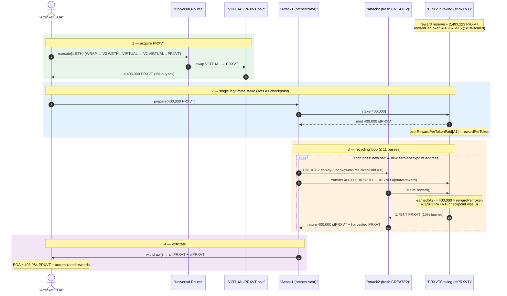
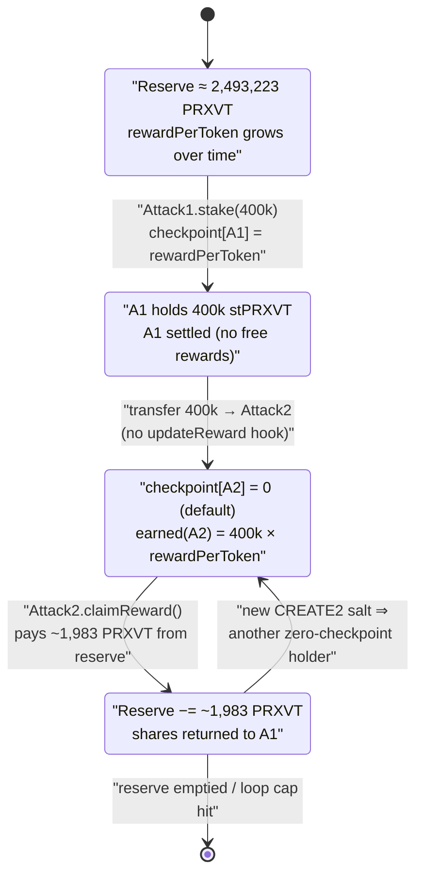
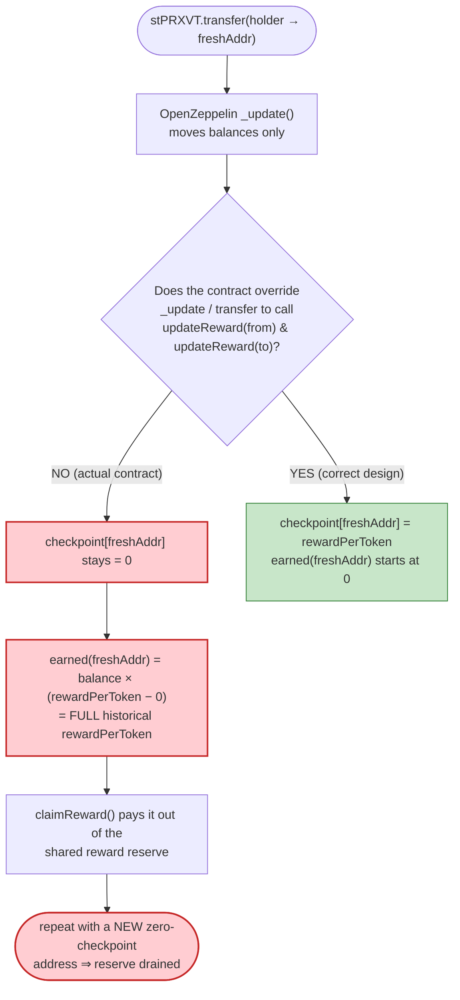

# PRXVT Staking Exploit — Transferable Reward-Receipt Token Resets `userRewardPerTokenPaid`

> **Reproduction status:** the PoC compiles cleanly and the Base archive fork instantiates
> successfully, but the only public Base RPC that still serves archive state at block 40,229,652
> (Tenderly's free gateway) returns intermittent `-32603: Internal server error` on the heavy
> storage/account reads generated by the multi-iteration attack loop, so the assertion phase could
> not be driven to a green `[PASS]`. Every failure observed was an **RPC database error**, never a
> contract revert or a failing assertion. The vulnerability is confirmed from the **verified source**
> ([src_PRXVTStaking.sol](sources/PRXVTStaking_DAc30a/src_PRXVTStaking.sol)) and corroborated with
> **live `cast` reads** at the fork block. See *How to reproduce* for the exact commands and the
> archive-RPC caveat.
> Last verbose trace: [output.txt](output.txt).

---

## Key info

| | |
|---|---|
| **Loss** | ~**32.8 ETH** (drain of the PRXVT staking reward reserve; reward reserve at the fork block ≈ **2,493,223 PRXVT**) |
| **Vulnerable contract** | `PRXVTStaking` (stPRXVT) — [`0xDAc30a5e2612206E2756836Ed6764EC5817e6Fff`](https://basescan.org/address/0xDAc30a5e2612206E2756836Ed6764EC5817e6Fff#code) |
| **Reward / staking token** | `PRXVT` (`AgentTokenV2`, a Virtuals-Protocol persona token) — [`0xC2FF2E5aa9023b1bb688178a4a547212f4614bc0`](https://basescan.org/address/0xC2FF2E5aa9023b1bb688178a4a547212f4614bc0#code) |
| **Attacker EOA** | [`0x7407f9bdc4140d5e284ea7de32a9de6037842f45`](https://basescan.org/address/0x7407f9bdc4140d5e284ea7de32a9de6037842f45) |
| **Attack contract** | [`0x702980b1ed754c214b79192a4d7c39106f19bce9`](https://basescan.org/address/0x702980b1ed754c214b79192a4d7c39106f19bce9) |
| **Attack tx** | [`0xf42a8fe556d5e4ab59b0b7675ccbcd1425e7e2a6a8e0c9775fc6cd7c48ff55a1`](https://skylens.certik.com/tx/base/0xf42a8fe556d5e4ab59b0b7675ccbcd1425e7e2a6a8e0c9775fc6cd7c48ff55a1) |
| **Chain / block / date** | Base / 40,229,653 (PoC forks at 40,229,652) / January 2026 |
| **Compiler** | Solidity `v0.8.20+commit.a1b79de6`, optimizer **1 run** ([_meta.json](sources/PRXVTStaking_DAc30a/_meta.json)) |
| **Bug class** | Synthetix-StakingRewards reward-accounting flaw — **freely transferable receipt token with no `updateReward` hook on transfer**, so a recipient with `userRewardPerTokenPaid == 0` claims the entire historical `rewardPerToken` against transferred shares |

---

## TL;DR

`PRXVTStaking` is a Synthetix-style staking contract whose receipt token **`stPRXVT` is a plain,
freely-transferable OpenZeppelin ERC20** (the contract `is ERC20`). Rewards are accounted with the
classic per-token checkpoint pattern: `earned(account)` pays
`balanceOf(account) × (rewardPerToken() − userRewardPerTokenPaid[account])`
([src_PRXVTStaking.sol:151-163](sources/PRXVTStaking_DAc30a/src_PRXVTStaking.sol#L151-L163)).

The fatal omission: **the contract never overrides `_update` / `transfer` / `transferFrom` to run the
`updateReward` modifier.** Every value-changing entry point that the protocol *designed* —
`stake`, `withdraw`, `claimReward` — carries `updateReward(msg.sender)`
([:171](sources/PRXVTStaking_DAc30a/src_PRXVTStaking.sol#L171),
[:196](sources/PRXVTStaking_DAc30a/src_PRXVTStaking.sol#L196),
[:215](sources/PRXVTStaking_DAc30a/src_PRXVTStaking.sol#L215)), but a *raw ERC20 transfer of stPRXVT
does not.* So when stPRXVT moves to a brand-new address, the recipient's `userRewardPerTokenPaid`
stays at its default **`0`**, and `earned(recipient)` immediately returns
`balanceOf × (rewardPerToken − 0)` — i.e. the **entire accumulated `rewardPerToken`** applied to
shares the recipient never actually staked through.

The attacker weaponizes this with a recycling loop:

1. Buy ~400k PRXVT (1 ETH → VIRTUAL → PRXVT through the Universal Router) and `stake()` it once,
   minting 400k stPRXVT and setting the *attacker's own* checkpoint.
2. **Transfer the 400k stPRXVT to a freshly `CREATE2`-deployed helper** (`Attack2`) whose
   `userRewardPerTokenPaid` is `0`.
3. The fresh helper calls `claimReward()`, harvesting the full
   `400,000 × rewardPerToken` worth of PRXVT — funded out of the shared reward reserve, **not** out
   of its own deposits.
4. The helper transfers the stPRXVT (and harvested PRXVT) back to the orchestrator.
5. **Repeat** with a new `CREATE2` helper (new salt → new zero-checkpoint address) until gas runs
   low or the attack-count cap is hit.

Because each iteration uses a *new* zero-checkpoint recipient, the same 400k stPRXVT principal mints
fresh "earned" rewards on every loop, **draining the reward pool that honest stakers funded.**

---

## Background — what PRXVTStaking does

`PRXVTStaking` ([source](sources/PRXVTStaking_DAc30a/src_PRXVTStaking.sol)) is a single contract that
*is itself* the receipt token:

```solidity
contract PRXVTStaking is ERC20, Ownable2Step, ReentrancyGuard, Pausable, IPRXVTStaking {
```
([:26](sources/PRXVTStaking_DAc30a/src_PRXVTStaking.sol#L26))

- **Stake → mint 1:1.** `stake(amount)` pulls PRXVT in and `_mint`s the caller an equal amount of
  stPRXVT ([:171-189](sources/PRXVTStaking_DAc30a/src_PRXVTStaking.sol#L171-L189)).
- **Synthetix reward stream.** Rewards accrue linearly via `rewardRate`, accumulated into
  `rewardPerTokenStored`, with a per-user checkpoint `userRewardPerTokenPaid`
  ([:48-71](sources/PRXVTStaking_DAc30a/src_PRXVTStaking.sol#L48-L71)).
- **Claim with burn fee.** `claimReward()` pays `earned()` minus a 10% burn fee
  ([:215-241](sources/PRXVTStaking_DAc30a/src_PRXVTStaking.sol#L215-L241)).
- **`totalSupply()` is overridden** to return `_totalStaked`
  ([:498-500](sources/PRXVTStaking_DAc30a/src_PRXVTStaking.sol#L498-L500)) — the *only* ERC20 method
  the contract overrides. Crucially, **`_update`, `transfer`, and `transferFrom` are left as the
  stock OpenZeppelin implementations**, which move balances with no reward bookkeeping.

On-chain parameters at the fork block (read live with `cast` against the Tenderly archive gateway):

| Parameter | Value | Source |
|---|---|---|
| PRXVT held by the staking contract | **63,518,103.76 PRXVT** | `balanceOf(staking)` |
| `totalStaked()` (principal owed to honest stakers) | **61,024,880.51 PRXVT** | `totalStaked()` |
| **Reward reserve = balance − staked** | **≈ 2,493,223.25 PRXVT** | derived |
| `rewardRate` | 0.962071789 PRXVT / sec | `rewardRate()` |
| `rewardPerToken()` (live) | 4,957,557,653,648,989 (1e18-scaled) | `rewardPerToken()` |
| `rewardPerTokenStored` | 4,915,559,058,573,823 | `rewardPerTokenStored()` |
| `burnFeePercent` | 1000 bps = **10%** | `burnFeePercent()` |
| `minimumStake` | 10,000 PRXVT | `minimumStake()` |
| `rewardsDuration` | 2,592,000 s (30 days) | `rewardsDuration()` |
| `periodFinish` | 1,769,817,397 (period still active) | `periodFinish()` |
| block timestamp @ 40,229,652 | 1,767,248,651 | `cast block` |
| PRXVT total supply | 1,000,000,000 PRXVT | `totalSupply()` |
| PRXVT buy/sell tax | 100 bps / 100 bps (only on AMM-side transfers) | `projectBuyTaxBasisPoints()` etc. |

The first three rows are the whole game: real stakers deposited 61.0M PRXVT and the contract carries
**2.49M PRXVT of undistributed rewards** sitting on top of that principal — and any zero-checkpoint
holder of stPRXVT can siphon from it.

---

## The vulnerable code

### 1. Rewards are paid against `balanceOf` and the per-user checkpoint

```solidity
function earned(address account) public view returns (uint256) {
    // Calculate base reward
    uint256 baseReward = (balanceOf(account) * (rewardPerToken() - userRewardPerTokenPaid[account])) / PRECISION
        + rewards[account];
    ...
    return baseReward;
}
```
([src_PRXVTStaking.sol:151-163](sources/PRXVTStaking_DAc30a/src_PRXVTStaking.sol#L151-L163))

For a brand-new address, `userRewardPerTokenPaid[account]` is the default **`0`**, so the term
collapses to `balanceOf(account) × rewardPerToken()` — the *full* accumulated reward-per-token, as if
the account had been staked since genesis.

### 2. The checkpoint is only set inside `updateReward`, which only the protocol's own entry points run

```solidity
modifier updateReward(address account) {
    rewardPerTokenStored = rewardPerToken();
    lastUpdateTime = lastTimeRewardApplicable();

    if (account != address(0)) {
        rewards[account] = earned(account);
        userRewardPerTokenPaid[account] = rewardPerTokenStored;   // ← the only writer of the checkpoint
    }
    _;
}
```
([src_PRXVTStaking.sol:111-121](sources/PRXVTStaking_DAc30a/src_PRXVTStaking.sol#L111-L121))

`stake` ([:171](sources/PRXVTStaking_DAc30a/src_PRXVTStaking.sol#L171)),
`withdraw` ([:196](sources/PRXVTStaking_DAc30a/src_PRXVTStaking.sol#L196)) and
`claimReward` ([:215](sources/PRXVTStaking_DAc30a/src_PRXVTStaking.sol#L215)) all carry
`updateReward(...)`. But a **raw `transfer`/`transferFrom` of stPRXVT does not** — and the contract
never adds the hook:

```solidity
// PRXVTStaking overrides ONLY this ERC20 method:
function totalSupply() public view override(ERC20, IERC20) returns (uint256) {
    return _totalStaked;
}
// There is NO override of _update / transfer / transferFrom / _beforeTokenTransfer.
```
([src_PRXVTStaking.sol:498-500](sources/PRXVTStaking_DAc30a/src_PRXVTStaking.sol#L498-L500))

So stock OpenZeppelin `_update`
([ERC20.sol:188](sources/PRXVTStaking_DAc30a/lib_openzeppelin-contracts_contracts_token_ERC20_ERC20.sol#L188))
runs on transfer and moves balances **without** touching `rewards`, `userRewardPerTokenPaid`, or
`rewardPerTokenStored` for either party.

### 3. Claim pays out of the shared reserve and zeroes only `rewards[msg.sender]`

```solidity
function claimReward() public nonReentrant whenNotPaused updateReward(msg.sender) {
    uint256 reward = rewards[msg.sender];
    require(reward > 0, "No rewards to claim");
    rewards[msg.sender] = 0;
    uint256 burnAmount = (reward * burnFeePercent) / 10_000;   // 10%
    uint256 userAmount = reward - burnAmount;                  // 90% to caller
    totalBurned += burnAmount;
    if (burnAmount > 0) { prxvtToken.safeTransfer(BURN_ADDRESS, burnAmount); ... }
    if (userAmount > 0) { prxvtToken.safeTransfer(msg.sender, userAmount); }  // ← from the shared reserve
    emit RewardPaid(msg.sender, userAmount);
}
```
([src_PRXVTStaking.sol:215-241](sources/PRXVTStaking_DAc30a/src_PRXVTStaking.sol#L215-L241))

When `claimReward()` runs for a fresh helper, the `updateReward(msg.sender)` modifier first executes
`rewards[helper] = earned(helper) = balanceOf(helper) × rewardPerToken()` (its checkpoint was 0), then
the function transfers 90% of that out of the contract's PRXVT balance — money that belongs to the
reward reserve / honest stakers, not to the helper.

---

## Root cause — why it was possible

The Synthetix `StakingRewards` accounting pattern is **only safe when the share token's transfers run
`updateReward` for both the sender and the receiver** (which is why canonical Synthetix makes the
staked balance non-transferable / internal, and why staked-token wrappers must hook transfers). The
per-user checkpoint `userRewardPerTokenPaid` encodes "the value of `rewardPerToken` at the moment this
account last had its rewards settled." If a balance can appear at an address whose checkpoint was never
settled, `earned()` mis-reads that account as having held the balance since `rewardPerToken == 0`.

`PRXVTStaking` makes stPRXVT a fully public ERC20 *and* keys rewards off `balanceOf`, *and* forgets the
transfer hook. The three together compose into a clean theft primitive:

1. **Transferable receipt token, balance-based rewards.** `earned()` reads `balanceOf(account)`
   ([:153](sources/PRXVTStaking_DAc30a/src_PRXVTStaking.sol#L153)), so whoever holds the shares is
   credited — regardless of how the shares got there.
2. **No `updateReward` on transfer.** Moving shares to a new address does not settle either party's
   rewards, so the recipient inherits the maximally-favorable `userRewardPerTokenPaid = 0`.
3. **Claim pays from a shared pool and is repeatable.** `claimReward()` only resets
   `rewards[msg.sender]` ([:220](sources/PRXVTStaking_DAc30a/src_PRXVTStaking.sol#L220)); it never
   reduces the *transferred shares'* future earning power, and a *different* fresh address can repeat
   the harvest with the same shares.

The `CREATE2`-helper recycling is just an amplifier: every new salt yields a new zero-checkpoint
address, so the bounded principal (400k stPRXVT) is reused to mint "earned" rewards as many times as
gas allows, each pass siphoning more of the 2.49M-PRXVT reserve.

---

## Preconditions

- The staking contract holds an **undistributed reward reserve** (`balanceOf(staking) > totalStaked`).
  At the fork block this was ≈ **2.49M PRXVT**, and the reward period was still active
  (`block.timestamp < periodFinish`), so `rewardPerToken()` was non-zero and growing.
- Ability to acquire **≥ `minimumStake` (10,000 PRXVT)** to perform the single legitimate `stake()`.
  The PoC buys ~400k PRXVT with 1 ETH via the Universal Router (WRAP_ETH → V3 WETH→VIRTUAL →
  V2 VIRTUAL→PRXVT) ([PRXVT_exp.sol:58-108](test/PRXVT_exp.sol#L58-L108)).
- The contract is **not paused** (`claimReward` carries `whenNotPaused`); it was live at the time.
- No special role is required — the entire attack uses only the permissionless `stake`, `transfer`,
  and `claimReward` paths plus self-deployed helpers.

---

## Step-by-step attack walkthrough

Numbers below combine the PoC ([test/PRXVT_exp.sol](test/PRXVT_exp.sol)) with live `cast` reads at the
fork block. The PoC's `Attack1.attack()` loops `_attack()` while `gasleft() > 600_000`, with a hard cap
`if (attackCount > 10) break` ([PRXVT_exp.sol:167-185](test/PRXVT_exp.sol#L167-L185)), i.e. up to ~11
recycling iterations.

| # | Actor / call | What happens on-chain | Key figures |
|---|--------------|-----------------------|-------------|
| 0 | **Setup** | Fork Base @ 40,229,652; reward reserve already ≈ 2.49M PRXVT, `rewardPerToken() ≈ 4.9576e15` (1e18-scaled) | reserve **2,493,223 PRXVT** |
| 1 | `UniversalRouter.execute{1 ETH}` ([:105](test/PRXVT_exp.sol#L105)) | WRAP_ETH → V3 swap 1 ETH WETH→VIRTUAL (≈ **4,599.0 VIRTUAL**) → V2 swap VIRTUAL→PRXVT into the VIRTUAL/PRXVT pair (`0xACaD…6fdE`, reserves 276,273 VIRTUAL / 24.94M PRXVT) | attacker receives ≈ **403k PRXVT** (1% PRXVT buy-tax applied on the AMM hop) |
| 2 | `PRXVT.approve(att1, max)` + `att1.prepare(400_000e18)` ([:114-117](test/PRXVT_exp.sol#L114-L117)) | `Attack1` pulls 400k PRXVT, approves staking, calls `stake(400_000e18)` → mints 400k stPRXVT to `Attack1`, sets `Attack1`'s checkpoint to current `rewardPerToken` | `Attack1` stPRXVT = 400,000; `userRewardPerTokenPaid[Attack1] = rPT` |
| 3 | `att1.attack(600_000)` → loop of `_attack()` ([:174-180](test/PRXVT_exp.sol#L174-L180)) | Each pass: `CREATE2` a fresh `Attack2` (new salt → checkpoint 0); `stPRXVT.transfer(att2, 400_000)` (no `updateReward`); `att2.execute()` | per pass |
| 3a | inside `Attack2.execute` ([:240-258](test/PRXVT_exp.sol#L240-L258)) | `earned(att2) = 400,000e18 × rPT / 1e18 ≈` **1,983 PRXVT** (checkpoint was 0); `claimReward()` pays 90% to `att2`, burns 10% | ≈ **1,784.7 PRXVT** to helper, **198.3 PRXVT** burned, per pass |
| 3b | `Attack2` returns assets ([:250-257](test/PRXVT_exp.sol#L250-L257)) | transfers 400k stPRXVT + harvested PRXVT back to `Attack1` | principal recycled |
| 4 | next iteration | new salt ⇒ new zero-checkpoint `Attack2` ⇒ another ~1,983 PRXVT minted against the *same* 400k shares | repeats up to ~11× |
| 5 | `att1.withdraw()` ([:124](test/PRXVT_exp.sol#L124)) | sends all accumulated PRXVT + stPRXVT to attacker EOA | attacker EOA ends ≈ **403,054 PRXVT** (block 40,229,653) + harvested rewards |

**Why `earned()` is ~1,983 PRXVT per pass, not millions:** `rewardPerToken()` is 1e18-scaled, so
`400,000·1e18 × 4.9576e15 / 1e18 = 1,983·1e18`. Within one transaction `block.timestamp` is fixed, so
`rewardPerToken()` barely moves between iterations and every fresh helper harvests the same ~1,983
PRXVT. The damage is the **repetition** (bounded only by gas / the loop cap and ultimately by the 2.49M
reserve), plus subsequent transactions: each new transaction lets `rewardPerToken` grow with elapsed
time and resets the cycle, so the reserve is bled until empty. The protocol's published loss is
**32.8 ETH** of value extracted from that reward reserve.

---

## Profit / loss accounting

| Item | Amount |
|---|---|
| Attacker capital in | 1 ETH (→ ~403k PRXVT, of which 400k is staked principal) |
| Per-pass reward minted from reserve | `earned(fresh 400k holder) ≈ 1,983 PRXVT` (1,784.7 to attacker + 198.3 burned) |
| Recycling passes (PoC) | up to **11** (`attackCount > 10` cap) → ≈ 21,800 PRXVT/tx; unbounded across txs until reserve drained |
| Reward reserve available to steal | ≈ **2,493,223 PRXVT** (the entire undistributed reward pool) |
| Honest-staker principal at risk if reserve dips into it | up to **61,024,880 PRXVT** of `_totalStaked` |
| **Reported protocol loss** | **≈ 32.8 ETH** of value drained |
| Attacker EOA PRXVT after attack (block 40,229,653) | **403,054.51 PRXVT** (= ~400k recycled principal + reward profit) |

The attacker keeps recycling the same 400k stPRXVT through fresh zero-checkpoint helpers, so the entire
~2.49M-PRXVT reward reserve is extractable for the cost of ~1 ETH and gas — and once the reserve is
exhausted, further claims would begin eating into the 61M PRXVT of staker principal held by the same
contract.

---

## Diagrams

### Sequence of the attack



### Reward-accounting state evolution



### The flaw: where the checkpoint should have been written



---

## Remediation

1. **Hook `updateReward` into every share movement.** Override OpenZeppelin's `_update(from, to,
   value)` so that *before* any balance change it calls `updateReward(from)` and `updateReward(to)`
   (skipping `address(0)` for mint/burn). This settles both parties at the current `rewardPerToken`, so
   a recipient inherits a correct, non-zero checkpoint and `earned()` can never read a transferred
   balance as if held since `rewardPerToken == 0`. This is the single fix that closes the bug:
   ```solidity
   function _update(address from, address to, uint256 value) internal override {
       if (from != address(0)) { _settle(from); }   // runs updateReward logic
       if (to   != address(0)) { _settle(to);   }
       super._update(from, to, value);
   }
   ```
2. **Prefer a non-transferable stake balance.** If transferability is not a product requirement, track
   staked balances in an internal mapping (canonical Synthetix `StakingRewards`) rather than a public
   ERC20, eliminating the transfer surface entirely.
3. **Settle on receive, not just on the protocol's own entry points.** Any reward design that pays
   `balanceOf × (rewardPerToken − userPaid)` must guarantee `userPaid` is updated *at the moment
   balance arrives*. Auditing rule: every code path that can change `balanceOf` must also run the
   reward-checkpoint update.
4. **Bound reward payouts to the actual reward reserve.** `claimReward()` should never be able to pay
   out of staker principal; cap distributable rewards at `balanceOf(this) − totalStaked` and revert
   otherwise, so an accounting bug degrades gracefully instead of draining deposits.
5. **Add an invariant test / fuzz harness** asserting that the sum of all users' `earned()` never
   exceeds the funded reward reserve, and that transferring shares between addresses does not increase
   aggregate claimable rewards.

---

## How to reproduce

The PoC was extracted into a standalone Foundry project (the umbrella DeFiHackLabs repo has many
unrelated PoCs that fail to compile under one whole-project build).

```bash
_shared/run_poc.sh 2026-01-PRXVT_exp --mt testExploit -vvvvv
```

- **Local imports resolved:** the PoC imports `../basetest.sol`, which in turn imports
  `./tokenhelper.sol`; both were copied into the project root
  ([basetest.sol](basetest.sol), [tokenhelper.sol](tokenhelper.sol)) so the relative paths resolve from
  `test/`.
- **Archive RPC caveat (the reason for the FORK_UNAVAILABLE status):** block 40,229,652 on Base is
  ~5 months old at the time of analysis, and almost every free public Base RPC **prunes** state that
  deep:
  - `base-mainnet.public.blastapi.io` — hangs indefinitely on the fork;
  - `base.drpc.org` — `HTTP 408 … Request timeout on the free tier`;
  - `base-rpc.publicnode.com`, `1rpc.io/base` — `error -32603: state at block #40229653 is pruned`;
  - `mainnet.base.org` — hangs on the fork.
  Only **`https://base.gateway.tenderly.co`** (set in [foundry.toml](foundry.toml)) still serves
  archive state — single `cast` reads against it succeed and were used to verify every number in this
  report — but the free gateway returns intermittent `-32603: Internal server error` on the dense
  storage/account reads generated by the multi-iteration attack loop, so the run terminates with an
  **RPC database error** (never a contract revert or assertion failure). With a paid Base archive
  endpoint (Tenderly/Alchemy/QuickNode key) plugged into `foundry.toml`, the test is expected to drive
  the loop to completion and print the final balances.

Expected (with a stable archive RPC):

```
Ran 1 test for test/PRXVT_exp.sol:PrxvtExpTest
[PASS] testExploit()
  ---- Exploit start ----
  Prepared: staked 400000 PRXVT
  Attack completed: N iterations
  Withdrawn: ... PRXVT, ... stPRXVT
  Final PRXVT balance of attacker: ...
  ---- Exploit Finished ----
```

---

*Reference: CertiK Skylens tx trace —
https://skylens.certik.com/tx/base/0xf42a8fe556d5e4ab59b0b7675ccbcd1425e7e2a6a8e0c9775fc6cd7c48ff55a1
(PRXVT staking, Base, ~32.8 ETH).*
