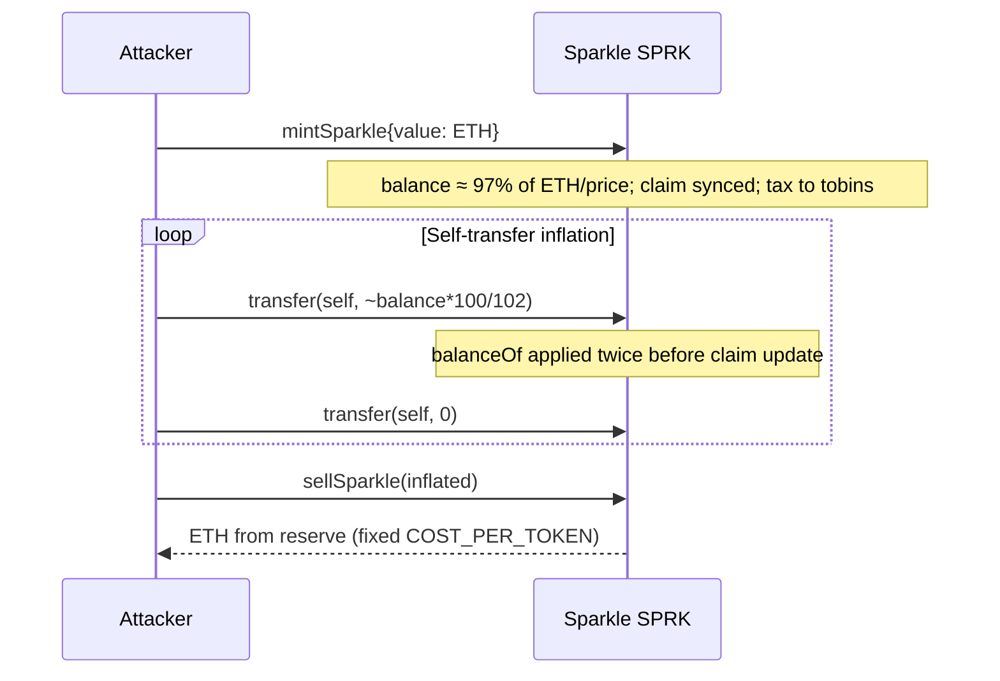

# 2026-01 Sparkle! (SPRK) Tobin-tax self-transfer inflation

<!-- non-defihacklabs -->

## Summary

| Field | Value |
|-------|--------|
| **Date** | 2025-12-27 (TenArmor linked as “~13 days before” 2026-01-09 alert) |
| **Chain** | Ethereum |
| **Loss** | ~$14.6K (alerter); PoC ~4.5 ETH net at attack-block reserve |
| **Root cause** | Reflection / Tobin-tax accounting double-counts unclaimed redistribution on self-transfer |
| **Tags** | `vuln/logic/incorrect-calculation` · `vuln/defi/fee-manipulation` · `vuln/logic/incorrect-state-transition` |

## Addresses

| Role | Address |
|------|---------|
| Vulnerable token (SPRK / Sparkle!) | `0x286ae10228C274a9396a05A56B9E3B8f42D1cE14` |
| Attacker EOA (Truebit Exploiter 1 label) | `0x6C8EC8f14bE7C01672d31CFa5f2CEfeAB2562b50` |
| MEV / attack runner | `0xf0c8d5c861161BdffB5E83e14Ff573bdC9275960` |
| Attack tx | `0xa3d09b92d29c60dcd2056077d5e8995334ec278fec93fc30bc60eddd5e002f53` |
| Fork block | `24101438` (attack − 1) |

## Root cause

Sparkle! (2019 activist experiment) maintains:

- Fixed mint/sell price: `COST_PER_TOKEN = 1e14` (10,000 SPRK ↔ 1 ETH gross).
- 2% Tobin tax on transfers, tracked as `_tobinsCollected` and paid out virtually via `balanceOf`:

```solidity
function balanceOf(address owner) public view returns (uint256) {
    uint256 unclaimed = _tobinsCollected.sub(_tobinsClaimed[owner]);
    uint256 floatingSupply = _totalSupply.sub(_tobinsCollected);
    uint256 redistribution = _balances[owner].mul(unclaimed).div(floatingSupply);
    return _balances[owner].add(redistribution);
}
```

`transfer` realizes `balanceOf` into hard `_balances` **before** updating `_tobinsClaimed`, then does the same for the recipient:

```solidity
_balances[msg.sender] = balanceOf(msg.sender).sub(value).sub(taxAmount);
_balances[to]         = balanceOf(to).add(value);          // unclaimed still old
_tobinsClaimed[msg.sender] = _tobinsCollected;
_tobinsClaimed[to]         = _tobinsCollected;
_tobinsCollected = _tobinsCollected.add(taxAmount);        // tax AFTER claim write
```

On **self-transfer** (`to == msg.sender`):

1. First write stores realized balance minus value/tax, but leaves `_tobinsClaimed` stale.
2. Second `balanceOf(self)` **re-applies the same unclaimed factor** on the already-realized residual.
3. Tax is only then appended to `_tobinsCollected`, so a residual unclaimed share remains for the next hop.

Repeating self-transfer (optionally interleaved with zero-value transfers, matching the live attack logs) compounds the balance far above the economically minted amount. `sellSparkle` then pays ETH from the contract reserve at the fixed rate.



## Attack flow (live)

1. Flashloan WETH → ETH into MEV bot.
2. Fund mint into SPRK.
3. ~100+ self-`Transfer` events on the MEV address with steadily **increasing** amounts, alternating with zero-value transfers.
4. `sellSparkle` drains reserve (~5→~10 ETH gross path in the cited tx).
5. Repay flashloan; profit to attacker EOA (~5 ETH / ~$14.6K class).

## Fix class

- Update `_tobinsClaimed` **before** any second `balanceOf` read, or never feed `balanceOf` (soft balance) back into `_balances` without zeroing unclaimed first.
- Prefer explicit “claim rewards” then hard-balance transfer.
- Cap sellable amount by proportional share of ETH reserve / invariant, not unbounded fixed price × synthetic supply.

## PoC

```bash
cd 2026-01-SPRK_exp
ETH_RPC_URL=<archive> forge test --match-contract SPRK_exp -vv
```

Expect multi-ETH profit (`require(profit > 1 ether)`).

## Sources

- TenArmor: https://x.com/TenArmorAlert/status/2009479460853305659
- Verified source: `sources/Sparkle.sol` (Etherscan)
