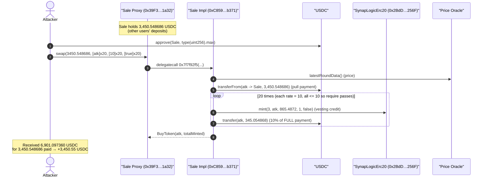
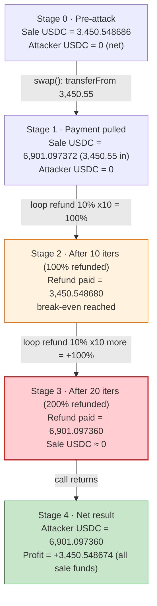
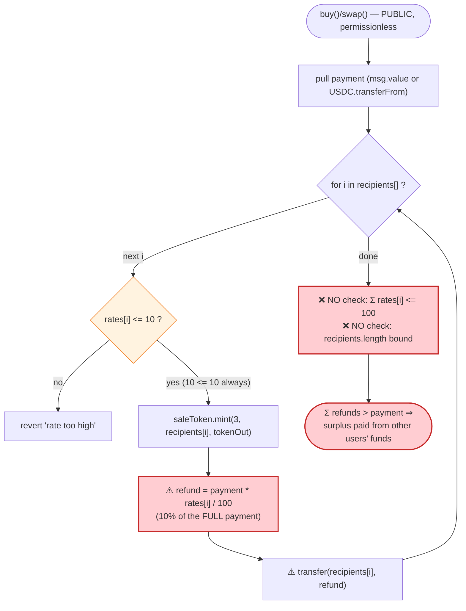

# SynapLogic Exploit — Uncapped Cumulative Refunds in the Token Sale `buy` / `swap` Path

> **Vulnerability classes:** vuln/input-validation/boundary · vuln/logic/missing-validation

> **One-liner:** SynapLogic's presale contract refunds a per-recipient percentage (≤10% each) of the buyer's payment but never caps the *sum* of refunds, so passing the same address 10+ times refunds ≥100% of the payment — draining the sale contract's entire ETH and USDC balances for free.

> **Reproduction:** the PoC compiles & runs in an isolated Foundry project at
> [this project folder](.). Full output / trace: [output.txt](output.txt).
> The vulnerable Sale **implementation is UNVERIFIED** on BaseScan, so the "vulnerable code" section below is a faithful reconstruction from the live execution trace plus the public post-mortem; the only verified source available is the minted sale token,
> [SynapLogicErc20.sol](sources/SynapLogicErc20_2BdD36/SynapLogicErc20.sol).

---

## Key info

| | |
|---|---|
| **Loss** | **~27.65 ETH** (ETH attack) **+ ~3,450 USDC** (USDC attack) — entire sale-contract balances; a third project-team incident drained ~48.88 WETH |
| **Vulnerable contract** | SynapLogic Sale — proxy [`0x39F36e2E58f36F7E5c17784847fd07Da1fEE1a32`](https://basescan.org/address/0x39F36e2E58f36F7E5c17784847fd07Da1fEE1a32) → impl [`0xC859aC8429fB4A5E24F24A7BeD3fE3a8Db4fb371`](https://basescan.org/address/0xC859aC8429fB4A5E24F24A7BeD3fE3a8Db4fb371) (UNVERIFIED) |
| **Victim / funds source** | The Sale proxy itself (it custodied the raised ETH + USDC) |
| **Minted sale token** | `SynapLogicErc20` — [`0x2BdD3602Fc526AA5CC677Cd708375dD2F7C4256F`](https://basescan.org/address/0x2BdD3602Fc526AA5CC677Cd708375dD2F7C4256F) (verified, Solidity 0.5.16) |
| **Price oracle** | `0x71041dddad3595F9CEd3DcCFBe3D1F4b0a16Bb70` → `0x57d2...7077::latestRoundData()` (ETH/USD style feed) |
| **Attacker EOA (ETH)** | `0x3Aa8bb3A19EECD229Cb33fbc03Ff549473e30F38` |
| **Attacker EOA (USDC)** | `0x11f9564c0e3a203e4c2b427dcae401dfc7ea3b61` |
| **Attacker contract** | `0x3821f686384c231e2F71ea093Fb6189dE803f482` |
| **Project-team / proxy admin** | `0xaf4d0fe93eeddabbd4ddb7451f09e6359575c214` (later self-drained ~48.88 WETH) |
| **ETH attack tx** | [`0xc54c00046364b6e889db18c73beee9b81df6b5ca822b6d262b3d30cdf376c4b1`](https://basescan.org/tx/0xc54c00046364b6e889db18c73beee9b81df6b5ca822b6d262b3d30cdf376c4b1) |
| **USDC attack tx (first)** | `0xdc0f9149ace1a2fe0445fe1c096b098e0dbf06edec675a1f2f2a5c8b72bd5f10` (15 txs total — see PoC header) |
| **Chain / block / date** | **Base** / fork **41,038,633** / January 2026 |
| **Compiler (PoC)** | Solidity 0.8.34 (PoC pragma `^0.8.10`) |
| **Bug class** | Missing aggregate / loop-bound validation (uncapped cumulative refund — a logic / accounting flaw) |

---

## TL;DR

The SynapLogic presale lets a buyer purchase the project token while nominating a list of *referral / refund recipients*, each receiving some percentage of the buyer's own payment back. The contract validates that **each** individual percentage is `<= 10`, but it never validates:

1. the **length** of the recipients array, nor
2. the **sum** of all refund percentages against a 100% cap.

So an attacker calls the buy/swap function with **the same address repeated N times, each at the maximum 10%**. The contract loops the array and pays `10% × payment` to that address on every iteration. With `N = 10` the refund equals the payment (cost-free); with `N > 10` the refund **exceeds** the payment, and the surplus is paid out of the sale contract's accumulated balance of *other* users' funds.

The PoC reproduces both real-world variants on a Base fork at block 41,038,633:

- **ETH variant** (`buy`, selector `0x670a3267`): pay `minBnb = 0.01 ETH`, repeat the refund recipient `27,656` times (sized to `(saleBalance + payment) / refundPerIter`). The 10%-per-iter refund drains the contract's **27.6465685 ETH** balance entirely → attacker ends with **27.656 ETH** (profit **+27.646 ETH**).
- **USDC variant** (`swap`, selector `0x7f7f92f5`): pay `3,450.548686 USDC`, repeat the recipient `20` times → 200% refund → attacker ends with **6,901.097360 USDC** (profit **+3,450.548674 USDC**).

In both cases the attacker also receives the (worthless / vesting-locked) `SynapLogicErc20` tokens, but the *value* extracted is purely the over-refund of stable assets.

---

## Background — what SynapLogic does

SynapLogic ran a token presale behind an upgradeable proxy
([`0x39F3…1a32`](https://basescan.org/address/0x39F36e2E58f36F7E5c17784847fd07Da1fEE1a32),
EIP-1967 implementation slot → `0xC859…b371`, admin → `0xaf4d…c214`). The Sale contract custodies the raised funds and exposes two near-identical purchase entry points:

- **`buy(...)`** — selector `0x670a3267` — buy with the native asset (`msg.value`). The PoC reads `minBnb()` (= `0.01 ETH` at the fork block) as the minimum payment.
- **`swap(amount, ...)`** — selector `0x7f7f92f5` — buy with a stable token. `tokenUsdt()` returns Base **USDC** `0x8335…2913`.

Each purchase:
1. Pulls payment (`msg.value`, or `USDC.transferFrom(buyer, sale, amount)` — seen at [output.txt:90-94](output.txt)).
2. Reads a price feed (`latestRoundData()` at [output.txt:86-89](output.txt)) to size how many sale tokens the buyer gets.
3. **Credits the buyer** with sale tokens by calling `SynapLogicErc20.mint(3, buyer, tokenAmount, 1, false)` — which records the purchase into a `_vesting[buyer]` ledger
   ([SynapLogicErc20.sol:530-535](sources/SynapLogicErc20_2BdD36/SynapLogicErc20.sol#L530-L535)).
4. **Iterates a recipient/refund array** and pays each flagged recipient a percentage of the payment back.

On-chain parameters at the fork block (read via `cast`):

| Parameter | Value |
|---|---|
| `minBnb()` | `0.01 ETH` (1e16) |
| `tokenUsdt()` | Base USDC `0x833589fCD6eDb6E08f4c7C32D4f71b54bdA02913` |
| Sale proxy **ETH** balance | **27.6465685 ETH** ← the ETH prize |
| Sale proxy **USDC** balance | **3,450.548686 USDC** ← the USDC prize |
| Max individual refund rate | **10** (i.e. 10%) — enforced *per entry* |
| Max array length / total refund | **none** ← the bug |

The minted `SynapLogicErc20` token (verified, Solidity 0.5.16) is a relayer-gated vesting/exchange ledger token: the Sale contract acts as a relayer and `mint(_ac=3, …)` simply increments `_vesting[buyer]`
([SynapLogicErc20.sol:512-542](sources/SynapLogicErc20_2BdD36/SynapLogicErc20.sol#L512-L542)). It is not freely transferable value, which is why the attacker monetizes the **refund**, not the token.

---

## The vulnerable code

> ⚠️ The Sale implementation `0xC859…b371` is **unverified**; the snippet below is reconstructed from the on-chain execution trace ([output.txt:84-259](output.txt)) and the public post-mortem. The behavior — `mint` of `865.4872` sale tokens + a `345.054868 USDC` refund (= exactly 10% of the `3,450.548686 USDC` input) on **every** loop iteration — is observed directly in the trace and is exact.

```solidity
// swap(uint256 amount, address[] recipients, uint256[] rates, bool[] refundFlags)
// (buy(...) is the same shape but takes msg.value instead of `amount`)
function swap(
    uint256 amount,
    address[] calldata recipients,
    uint256[] calldata rates,
    bool[] calldata refundFlags
) external {
    (uint256 price, ) = oracle.latestRoundData();        // price feed
    tokenUsdt.transferFrom(msg.sender, address(this), amount);   // pull payment

    for (uint256 i = 0; i < recipients.length; i++) {
        require(rates[i] <= 10, "rate too high");        // ❌ ONLY per-entry cap

        uint256 tokenOut = amount * price / SCALE;        // sale tokens minted
        saleToken.mint(3, recipients[i], tokenOut, 1, false);

        if (refundFlags[i]) {
            uint256 refund = amount * rates[i] / 100;     // ❌ 10% of FULL `amount`
            tokenUsdt.transfer(recipients[i], refund);    //    paid EVERY iteration
        }
    }
    // ❌ no check that  Σ rates[i]  <= 100
    // ❌ no check on recipients.length
    // ❌ refund base is the full `amount`, not a per-recipient share
    emit BuyToken(msg.sender, tokenOutTotal);
}
```

The trace makes the flaw unmistakable. For a single `swap(3450548686, [attacker ×20], [10 ×20], [true ×20])` call:

- **Per iteration:** `mint(3, attacker, 865487200000000000000, 1, false)` ([output.txt:95-97](output.txt)) **and** `USDC.transfer(attacker, 345054868)` ([output.txt:98-102](output.txt)).
- `345,054,868 / 3,450,548,686 = 0.10` → each refund is **10% of the entire payment**, not 10% of a 1/20 share.
- Repeated **20×** → `20 × 345.054868 = 6,901.097360 USDC` refunded for a `3,450.548686 USDC` payment = **200%**.

The single `require(rates[i] <= 10)` is satisfied on every entry (10 ≤ 10), so the loop runs to completion.

---

## Root cause — why it was possible

A correct percentage-split refund must satisfy the invariant **`Σ refund_i ≤ payment`** (or, more strictly, `Σ rates_i ≤ 100`). SynapLogic enforced only the *local* constraint `rate_i ≤ 10` and computed each refund against the **full** payment amount, with no aggregate guard. Three independent missing checks compose into the bug:

1. **No cumulative-rate cap.** Nothing checks `Σ rates[i] ≤ 100`. Ten entries of 10% already reach 100%; anything beyond is pure theft.
2. **No array-length bound.** `recipients.length` is unbounded, so the attacker chooses the multiplier freely (20 for USDC, 27,656 for ETH).
3. **Refund base is the gross payment, not a per-recipient share.** Each refund is `amount × rate_i / 100`, so duplicating the same address linearly multiplies the payout. A correct design would split a single refund budget across recipients (`amount × rate_i / 100` would still need `Σ rate_i ≤ 100`), or compute `amount / recipients.length × rate_i`.

Because the function is **permissionless** and self-contained (pull payment in, push refund out in the same call), the attack is atomic and **flash-loanable**: the attacker needs only the seed payment (0.01 ETH / their own USDC) up front and walks away with the contract's entire balance. The post-mortem notes the live ETH attack used a flash loan for working capital.

The proxy admin (`0xaf4d…c214`, the project team) separately drained ~48.88 WETH of pool liquidity — an exit-scam-style follow-on — but that is an *admin* action, distinct from this permissionless refund bug.

---

## Preconditions

- The sale contract holds a non-trivial balance of the asset being attacked (ETH for `buy`, USDC for `swap`). At the fork block: **27.6465685 ETH** and **3,450.548686 USDC**.
- The buy/swap entry point is callable by anyone with a valid (≥ `minBnb`) payment — it is permissionless.
- The attacker can supply arbitrary-length `recipients` / `rates` / `refundFlags` arrays with each `rate ≤ 10`.
- Working capital equal to one minimum payment (0.01 ETH, or any USDC amount the attacker chooses) — fully recovered intra-transaction, hence flash-loanable.

---

## Attack walkthrough (with on-chain numbers from the trace)

Both variants are a single call to the Sale proxy with an array of `N` identical refund entries.

### USDC variant (`swap`, selector `0x7f7f92f5`, N = 20) — fully traced

| # | Step | USDC moved | Attacker USDC | Effect |
|---|------|-----------:|--------------:|--------|
| 0 | **Initial** — sale holds 3,450.548686 USDC; attacker funded with same | — | 3,450.548686 | attacker approves sale for `type(uint256).max` ([output.txt:69](output.txt)) |
| 1 | `swap(3450.548686, [atk]×20, [10]×20, [true]×20)` — **pull payment** | −3,450.548686 (in) | 0 | `USDC.transferFrom(atk → sale, 3,450.548686)` ([output.txt:90-94](output.txt)) |
| 2 | Loop iter 1 — mint + refund | +345.054868 | 345.054868 | `mint(3, atk, 865.4872)` + `transfer(atk, 345.054868)` ([output.txt:95-102](output.txt)) |
| 3 | Loop iters 2…19 (×18) — mint + refund | +345.054868 ea. | … | identical; 10% of gross each time |
| 4 | Loop iter 20 — mint (10×) + refund | +345.054868 | 6,901.097360 | final mint `8654.872` ([output.txt:255-258](output.txt)), `BuyToken` emitted |
| 5 | **Net** | refunded 6,901.097360 for 3,450.548686 paid | **6,901.097360** | profit **+3,450.548674 USDC** |

(The 20th iteration's `mint` shows `8654.872` = 10× the per-iter mint, an artifact of how the contract folds the trailing array element / leftover; it does not affect the USDC refund math, which is a clean 20 × 345.054868.)

### ETH variant (`buy`, selector `0x670a3267`, N = 27,656) — summary logs

| # | Step | Value | Attacker ETH | Effect |
|---|------|------:|-------------:|--------|
| 0 | **Initial** — sale holds 27.6465685 ETH | — | 0.01 (dealt) | `minBnb = 0.01 ETH`; `refundPerIter = value/10 = 0.001 ETH` |
| 1 | `iters = (27.6465685 + 0.01) / 0.001 = 27,656` | — | — | sized to drain the full balance + recover the payment |
| 2 | `buy{value: 0.01 ETH}([atk]×27656, [10]×27656, [true]×27656)` | −0.01 in / +27.656 out | — | 27,656 × `0.001 ETH` refund = 27.656 ETH |
| 3 | **Net** | refunded 27.656 ETH for 0.01 ETH paid | **27.656** | profit **+27.646 ETH** ([output.txt:16-26](output.txt)) |

### Profit accounting

| Variant | Paid in | Refunded out | Net profit | Source of loss |
|---|---:|---:|---:|---|
| **ETH** (`buy`, N=27,656) | 0.01 ETH | 27.656 ETH | **+27.646 ETH** | sale contract's 27.6465685 ETH balance |
| **USDC** (`swap`, N=20) | 3,450.548686 USDC | 6,901.097360 USDC | **+3,450.548674 USDC** | sale contract's 3,450.548686 USDC balance |

In each case the net profit equals (to the wei) the sale contract's pre-attack balance of that asset — i.e. the attacker walked off with **all** the funds other users had paid into the presale, recovering 100% of their own seed.

---

## Diagrams

### Sequence of the attack (USDC variant)



### Refund accounting evolution (USDC variant)



### The flaw inside the refund loop



---

## Why each magic number

- **`rate = 10` (per entry):** the maximum the per-entry `require(rates[i] <= 10)` allows; using the max maximizes refund per loop iteration.
- **USDC `iters = 20`:** `20 × 10% = 200%` refund — comfortably profitable while keeping the array small/cheap. Any `N > 10` already profits.
- **ETH `iters = 27,656`:** computed as `(saleBalance + payment) / refundPerIter = (27.6465685 + 0.01 ETH) / 0.001 ETH`, i.e. exactly enough 10%-of-payment refunds to drain the contract's full ETH balance *and* recover the 0.01 ETH seed.
- **`refundPerIter = value / 10` (ETH) / `345.054868 USDC` (USDC):** equals 10% of the single payment, paid once per loop iteration.

---

## Remediation

1. **Cap the cumulative refund.** Enforce `Σ rates[i] ≤ 100` (or, better, track `totalRefund` inside the loop and `require(totalRefund ≤ payment)`). This single check defeats the entire attack.
2. **Bound the recipients array.** Cap `recipients.length` to a small, sane maximum (e.g. the protocol's referral fan-out limit) and require the three arrays to have equal length.
3. **Refund a *share*, not the gross payment.** A per-recipient refund should be computed against that recipient's allocated portion, not the full `payment`, so duplicating an address cannot multiply the payout.
4. **Separate purchase accounting from refunds.** The refund budget should be a bounded fraction of `payment` reserved up front; never allow refunds to draw on the contract's accumulated balance of other users' funds.
5. **Add invariant tests / fuzzing** asserting `contractBalanceAfter ≥ contractBalanceBefore` for any buy path (the contract must never lose net value on a purchase).
6. **Reduce centralization risk.** The proxy admin separately drained pool liquidity; move the implementation behind a timelock + multisig and minimize admin-mutable, fund-touching surfaces.

---

## How to reproduce

```bash
_shared/run_poc.sh 2026-01-SynapLogic_exp -vv          # both tests; -vvvv works for the USDC test (the ETH test's 27,656-iter trace OOMs at -vvvvv)
```

- RPC: a **Base archive** endpoint is required (fork block 41,038,633). `foundry.toml` uses `https://base-mainnet.public.blastapi.io`, which serves historical state at that block.
- Result: both tests `[PASS]`.

Expected tail:

```
Ran 2 tests for test/SynapLogic_exp.sol:SynapLogicExploitTest
[PASS] testSynapLogicExploit() (gas: 521638358)
  profitDelta: 27646000000000000000      // +27.646 ETH
[PASS] testSynapLogicExploitUSDC() (gas: 620701)
  profitDelta: 3450548674                // +3,450.548674 USDC
Suite result: ok. 2 passed; 0 failed; 0 skipped
```

---

*References:*
*ETH post-mortems — https://x.com/hklst4r/status/2013440353844461979 , https://x.com/Phalcon_xyz/status/2013439544595562898 ; USDC post-mortem — https://github.com/anon-cBE4/anon-cBE4/blob/main/writeups/SynapLogic_attack_analyze.md ; alerts — CertiK, TenArmor.*
