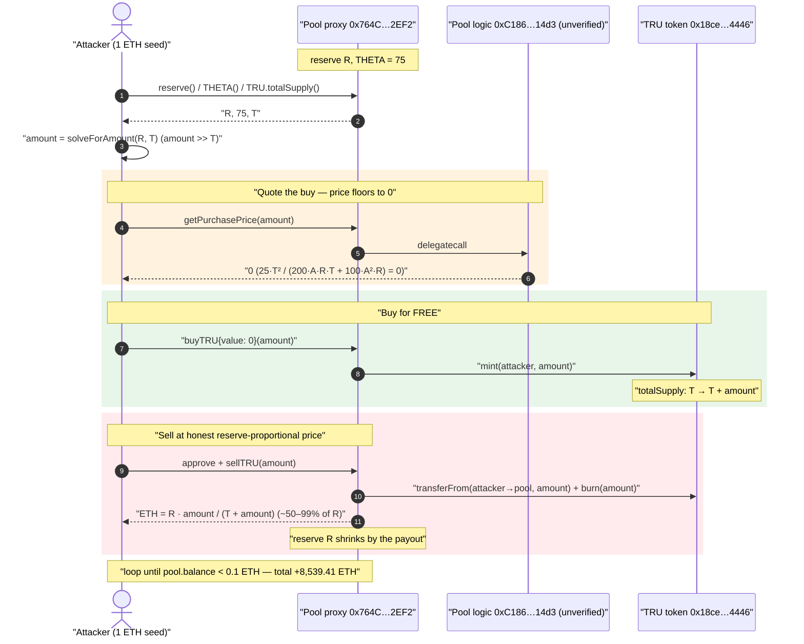
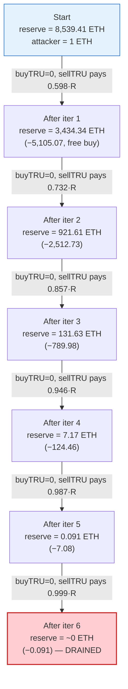
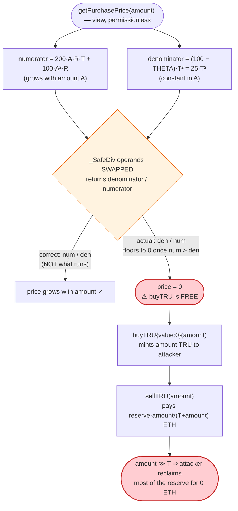

# Truebit Exploit — Inverted `getPurchasePrice` Lets Anyone Buy TRU For Free, Then Sell For ETH

> **Reproduction:** the PoC compiles & runs in an isolated Foundry project at
> [this project folder](.) (the umbrella DeFiHackLabs repo contains many unrelated PoCs that do not
> compile, so this one was extracted). Full verbose trace:
> [output.txt](output.txt). The PoC itself: [test/Truebit_exp.sol](test/Truebit_exp.sol).
>
> **Note on sources:** the bonding-curve pool's *pricing implementation*
> (`0xC186…14d3`) and the TRU token's *logic implementation* (`0x18ce…4446`) are **unverified on
> Etherscan** — only their `AdminUpgradeabilityProxy` shells are verified
> ([proxy source](sources/AdminUpgradeabilityProxy_764C64/AdminUpgradeabilityProxy.sol)). The pricing
> math below is reconstructed from the Dedaub decompilation embedded in the PoC header and **verified
> numerically against the live fork trace to the wei** (see the Step-by-step table).

---

## Key info

| | |
|---|---|
| **Loss** | **8,539.41 ETH** drained from the bonding-curve pool (the PoC starts with 1 ETH and ends with **8,540.41 ETH**) |
| **Vulnerable contract** | Truebit bonding-curve **pool proxy** `0x764C64b2A09b09Acb100B80d8c505Aa6a0302EF2` — [explorer](https://etherscan.io/address/0x764C64b2A09b09Acb100B80d8c505Aa6a0302EF2) (logic impl `0xC186e6F0163e21be057E95aA135eDD52508D14d3`, **unverified**) |
| **Victim / pool** | The pool's own ETH `reserve` (slot 154) — sole counterparty for `buyTRU`/`sellTRU` |
| **Token** | TRU `0xf65B5C5104c4faFD4b709d9D60a185eAE063276c` (logic impl `0x18ceDF1071EC25331130C82D7AF71D393Ccd4446`) |
| **Attacker EOA** | [`0x6C8EC8f14bE7C01672d31CFa5f2CEfeAB2562b50`](https://etherscan.io/address/0x6C8EC8f14bE7C01672d31CFa5f2CEfeAB2562b50) |
| **Attacker contract** | [`0x1De399967B206e446B4E9AeEb3Cb0A0991bF11b8`](https://etherscan.io/address/0x1De399967B206e446B4E9AeEb3Cb0A0991bF11b8) |
| **Attack tx** | [`0xcd4755645595094a8ab984d0db7e3b4aabde72a5c87c4f176a030629c47fb014`](https://etherscan.io/tx/0xcd4755645595094a8ab984d0db7e3b4aabde72a5c87c4f176a030629c47fb014) |
| **Chain / block / date** | Ethereum mainnet / 24,191,018 / **2026-01-08** |
| **Compiler** | PoC: Solidity `^0.8.15`; pool proxy: `v0.5.3` |
| **Bug class** | Inverted/mis-ordered bonding-curve price formula → free mint + asymmetric reserve payout |

---

## TL;DR

Truebit's bonding-curve pool prices TRU purchases with a function `getPurchasePrice(amount)` whose
arithmetic is **inverted**: instead of returning `numerator / denominator`, it returns
`denominator / numerator`, where the numerator grows with the requested `amount` (it contains
`200·A·R·T + 100·A²·R`). For a sufficiently large `amount`, the numerator exceeds the (fixed)
denominator and **integer division floors the price to `0`**.

So `buyTRU(amount)` becomes **free**: pass a big enough `amount`, pay `0` wei, and the token contract
**mints** that `amount` of TRU straight to you. But the *sell* side is honest — `sellTRU(amount)` pays
out a **proportional share of the pool's ETH reserve**: `payout = reserve · amount / totalSupply`.

The asymmetry is total. The attacker, starting from **1 ETH**:

1. Reads the pool's live `reserve` (R), TRU `totalSupply` (T) and `THETA` (75).
2. Computes the smallest `amount` that floors `getPurchasePrice` to `0`.
3. `buyTRU(amount)` — pays **0 ETH**, receives `amount` TRU (minted, `totalSupply` jumps to `T+amount`).
4. `sellTRU(amount)` — burns it back, the pool pays out `R · amount / (T+amount)` ETH (~50–99% of the
   whole reserve, because `amount ≫ T`).
5. Loops: each pass drains a large slice of the remaining reserve. Six iterations empty the pool.

Net: the attacker walks off with the **entire 8,539.41 ETH** reserve. Profit per the PoC = **+8,539.41 ETH**.

---

## Background — what the Truebit pool does

Truebit operates a **bonding-curve / reserve pool** for its TRU token behind an
`AdminUpgradeabilityProxy` ([verified proxy](sources/AdminUpgradeabilityProxy_764C64/AdminUpgradeabilityProxy.sol),
impl `0xC186…14d3`). The pool exposes, among others:

- `getPurchasePrice(uint256 amount) view → uint256` — quotes the ETH price to buy `amount` TRU.
- `buyTRU(uint256 amount) payable` — mints `amount` TRU to the caller; it reads `getPurchasePrice` and
  expects `msg.value` to cover it.
- `sellTRU(uint256 amount) payable` — pulls `amount` TRU from the caller (`transferFrom` then `burn`),
  and pays the caller a share of the pool's ETH `reserve`.
- `reserve() view` — the pool's ETH reserve (storage slot 154).
- `THETA() view` — a curve parameter; at the fork block it is **75** (a percentage-like constant).

TRU itself ([token proxy](sources/AdminUpgradeabilityProxy_f65B5C/AdminUpgradeabilityProxy.sol),
impl `0x18ce…4446`) is a mint/burnable ERC-20 whose `mint`/`burn` are callable by the pool. Its
`totalSupply` lives in slot 153.

On-chain state read at the fork block (from the trace):

| Parameter | Value | Source |
|---|---|---|
| `reserve()` (pool ETH) | **8,539.41 ETH** | [output.txt:1596](output.txt#L1596) |
| `THETA()` | **75** | [output.txt:1592](output.txt#L1592) |
| TRU `totalSupply()` | 161,753,242.37 TRU (`1.6175e26`) | [output.txt:1600](output.txt#L1600) |

---

## The vulnerable code

The pricing implementation is **unverified**, so the exact Solidity is not on-chain. The PoC author
decompiled it with **Dedaub** and embedded the result in the test header
([test/Truebit_exp.sol:160-178](test/Truebit_exp.sol#L160-L178)). The relevant routine
(`getPurchasePrice` → internal `0x1446`) decompiles to:

```
function 0x1446(uint256 amount) private {
    v1 = stor_97_0_19.totalSupply();        // T
    v2 = T * T;                             // T^2
    v3 = _setParameters * v2;               // THETA * T^2     (THETA = 75)
    v4 = T * T;
    v5 = 100 * v4;                          // 100 * T^2
    v6 = _SafeSub(v5, v3);                  // (100 - THETA) * T^2   == 25 * T^2  (positive)

    v7  = amount * _reserve;                // A * R
    v8  = T * (A * R);                      // A * R * T
    v9  = 200 * v8;                         // 200 * A * R * T
    v10 = amount * _reserve;                // A * R
    v11 = amount * (A * R);                 // A^2 * R
    v12 = 100 * v11;                        // 100 * A^2 * R

    v13 = _SafeDiv(v6, v12 + v9);           // ⚠️ (25*T^2) / (200*A*R*T + 100*A^2*R)
    return v13;
}
```

The price the pool should charge for `amount` TRU is, per the PoC's own comment
([test/Truebit_exp.sol:134](test/Truebit_exp.sol#L134)):

```
price = (200·A·R·T + 100·A²·R) / (100·T² − THETA·T²)
```

i.e. **numerator / denominator**. But the decompiled code computes
**`v13 = denominator / numerator`** — the operands of the final `_SafeDiv` are swapped. The
"denominator" `25·T²` is *constant* in `A`, while the "numerator" `200·A·R·T + 100·A²·R` grows
linearly and then quadratically with `A`. Once `A` is large enough that
`200·A·R·T + 100·A²·R > 25·T²`, the floored division returns **`0`**.

For comparison, the **sell** side (`sellTRU`) is implemented correctly. The trace shows
`sellTRU(amount)` doing `transferFrom(attacker → pool, amount)`, `burn(amount)`, then sending the
caller ETH equal to **`reserve · amount / totalSupply`** (verified below to the wei). So buying is
mis-priced to zero while selling pays a real, proportional reserve share.

---

## Root cause — why it was possible

A single transposed pair of operands in `_SafeDiv` turns the buy-side price upside down:

> `getPurchasePrice` returns `(25·T²) / (200·A·R·T + 100·A²·R)` instead of its reciprocal. The result
> **monotonically decreases** with the requested `amount` and **floors to `0`** for any large `amount`.
> A user can therefore mint an arbitrarily large quantity of TRU for **0 ETH**.

Three independent design facts compose into a total drain:

1. **Inverted price → free buys.** Because price falls (to 0) as `amount` rises, the attacker simply
   asks for a huge `amount` and pays nothing. `buyTRU` then **mints** that `amount` — there is no
   "amount you can afford" clamp; the quoted price *is* the only gate, and it is `0`.
2. **Asymmetric sell pricing.** `sellTRU` pays `reserve · amount / totalSupply`. The minted `amount`
   is **larger than the entire pre-existing supply** `T` (ratio `A/T` ranged from **1.49× up to 695×**
   across the six iterations — see the table), so `amount / (T+amount)` is close to 1, and the seller
   reclaims most of the reserve in one shot.
3. **`getPurchasePrice` is the only validation in `buyTRU`.** `buyTRU` trusts the quoted price; it does
   not independently verify that `msg.value` corresponds to a sane amount of minted tokens, nor cap the
   mint relative to reserves. So a `0` quote is taken at face value.

Helper math in the PoC: `solveForAmount(reserve, totalSupply)`
([test/Truebit_exp.sol:79-108](test/Truebit_exp.sol#L79-L108)) reverse-solves for the smallest
`amount` that pushes the quoted price to (effectively) its extreme, guaranteeing the buy is free while
maximizing the share of reserve the subsequent sell reclaims. It is just an *optimizer* around the
real bug; any sufficiently large `amount` would also yield a `0` price.

---

## Preconditions

- The pool holds a non-trivial ETH `reserve` (`require(reserve > 0)` in `solveForAmount`). At the fork
  block it held **8,539.41 ETH**.
- `buyTRU` / `sellTRU` are **permissionless** — no allow-list, no per-tx caps.
- A tiny amount of working ETH for gas. The buys cost **0 ETH** (the trace logs
  *"Calculated need Ether to buy TRU: 0"* on every iteration), so the attack is essentially
  self-funding — the PoC seeds itself with just **1 ETH**
  ([test/Truebit_exp.sol:46](test/Truebit_exp.sol#L46)).

---

## Attack walkthrough (with on-chain numbers from the trace)

`R` = pool ETH `reserve` (slot 154), `T` = TRU `totalSupply` (slot 153) **at the moment of the buy**.
Each iteration: read R/T/THETA → `amount = solveForAmount(R, T)` → `buyTRU{value:0}(amount)` (mints
`amount`, supply becomes `T+amount`) → `sellTRU(amount)` (burns it, pays `R·amount/(T+amount)` ETH).
All figures are pulled directly from the verbose trace and the `reserve` storage-slot transitions; the
predicted payout `R·amount/(T+amount)` **matches the actual `sellTRU` return to the wei**.

| # | `amount` bought (TRU) | `amount / T` | Quoted buy price | Reserve **before** | ETH paid out by `sellTRU` | Reserve **after** |
|---|----------------------:|-------------:|:----------------:|-------------------:|--------------------------:|------------------:|
| 1 | 240,442,509.45 (`2.404e26`) | 1.486× | **0** | 8,539.4089 | **5,105.0686** | 3,434.3403 |
| 2 | 441,010,174.51 (`4.410e26`) | 2.726× | **0** | 3,434.3403 | **2,512.7255** | 921.6148 |
| 3 | 970,752,177.50 (`9.708e26`) | 6.001× | **0** | 921.6148 | **789.9826** | 131.6322 |
| 4 | 2,808,567,055.50 (`2.809e27`) | 17.363× | **0** | 131.6322 | **124.4640** | 7.1682 |
| 5 | 12,548,923,878.78 (`1.255e28`) | 77.581× | **0** | 7.1682 | **7.0770** | 0.0912 |
| 6 | 112,503,970,673.12 (`1.125e29`) | 695.528× | **0** | 0.0912 | **0.0911** | ~0.0001 |

Trace references: amounts at
[output.txt:1543](output.txt#L1543), [:1548](output.txt#L1548), [:1553](output.txt#L1553),
[:1558](output.txt#L1558), [:1563](output.txt#L1563), [:1568](output.txt#L1568); the per-iteration
`reserve` slot-154 transitions at
[output.txt:1666](output.txt#L1666), [:1748](output.txt#L1748), [:1830](output.txt#L1830),
[:1912](output.txt#L1912), [:1994](output.txt#L1994), [:2076](output.txt#L2076);
`buyTRU` mint event (free) at [output.txt:1620](output.txt#L1620); `sellTRU` `burn` + ETH `receive`
at [output.txt:1657-1663](output.txt#L1657-L1663).

**Why each sell reclaims most of the reserve:** because `amount ≫ T`, the ratio
`amount / (T + amount)` → 1. In iteration 1, `amount/(T+amount) = 2.404e26 / 4.022e26 ≈ 0.598`, so the
seller takes ~59.8% of the reserve. By iteration 6, `amount/(T+amount) ≈ 0.9986`, taking ~99.9% of
the remaining dust. The `while (POOL.balance >= 0.1 ether)` loop
([test/Truebit_exp.sol:50](test/Truebit_exp.sol#L50)) repeats until the reserve is essentially empty.

### Profit accounting (ETH)

| | Amount (ETH) |
|---|---:|
| Starting balance | 1.0000 |
| Spent on `buyTRU` (6 buys × 0) | 0.0000 |
| Received from `sellTRU` #1 | 5,105.0686 |
| Received from `sellTRU` #2 | 2,512.7255 |
| Received from `sellTRU` #3 | 789.9826 |
| Received from `sellTRU` #4 | 124.4640 |
| Received from `sellTRU` #5 | 7.0770 |
| Received from `sellTRU` #6 | 0.0911 |
| **Total drained** | **8,539.4089** |
| **Final balance** | **8,540.4088** |

The total drained (8,539.41 ETH) equals the pool's original reserve to the wei — the attacker walked
off with **the entire reserve** for **0 ETH** of buy cost.
(*The PoC header rounds the headline loss to "8540 ETH", which is the attacker's final balance
including the 1 ETH seed.*)

---

## Diagrams

### Sequence of one drain iteration



### Pool reserve evolution across the six iterations



### The flaw inside `getPurchasePrice`



---

## Remediation

1. **Fix the inverted division.** Return `numerator / denominator`, not its reciprocal. The buy price
   must **increase** with the requested `amount`. Add a unit test asserting
   `getPurchasePrice(2x) > getPurchasePrice(x)` to lock in monotonicity.
2. **Validate `buyTRU` against `msg.value`, not just the quote.** `buyTRU` should require
   `msg.value == getPurchasePrice(amount)` **and** reject a `0` price for a non-zero `amount`
   (`require(price > 0)`), so a degenerate quote can never mint tokens for free.
3. **Enforce buy/sell price symmetry / no-arbitrage.** A buy immediately followed by a sell of the same
   `amount` must not be profitable. Bound the round-trip so `sellPrice(amount) ≤ buyPrice(amount)` for
   the same instantaneous state (the curve should charge at least as much to enter as it pays to exit).
4. **Cap single-operation reserve impact.** A `sellTRU` that pays out > a small percentage of the
   reserve in one call should revert; here a single sell pulled ~60–99% of the reserve.
5. **Verify and audit upgradeable implementations.** The pricing logic was deployed **unverified**
   behind a proxy. Mandatory source verification plus an audit of the bonding-curve math would have
   surfaced the swapped operands before deployment.

---

## How to reproduce

The PoC was extracted into a standalone Foundry project (the umbrella DeFiHackLabs repo has many
unrelated PoCs that fail to compile under a whole-project `forge test` build):

```bash
_shared/run_poc.sh 2026-01-Truebit_exp -vvvvv
```

- **RPC:** a mainnet **archive** endpoint is required (fork block 24,191,018). `foundry.toml` uses the
  pre-configured Infura archive endpoint, which serves historical state at that block.
- **Local imports:** `test/Truebit_exp.sol` imports `../basetest.sol`, which in turn imports
  `./tokenhelper.sol`. Both were copied to the project root
  ([basetest.sol](basetest.sol), [tokenhelper.sol](tokenhelper.sol)) so the relative paths resolve.
- Result: `[PASS] testExploit()`.

Expected tail:

```
  ---- Exploit Finished ----
  Final ETHER balance of attacker: 8540
  Attacker After exploit ETH Balance: 8540.408804981517620558

Suite result: ok. 1 passed; 0 failed; 0 skipped
```

---

*Post-mortem reference: CertiK — "Truebit Incident Analysis"
(https://www.certik.com/zh-CN/resources/blog/truebit-incident-analysis).*
