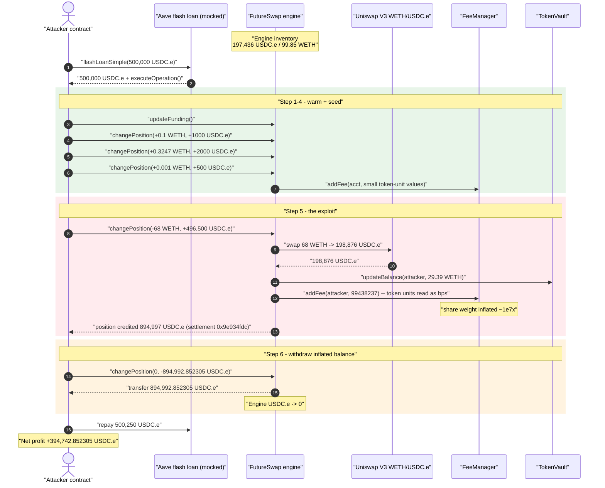
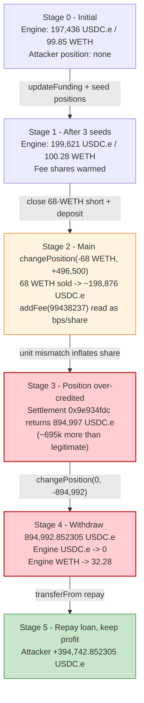
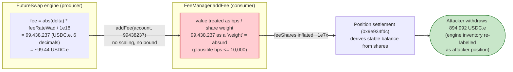

# FutureSwap Perpetual Drain — Fee Unit-Mismatch (`addFee` token-units interpreted as bps/share)

> One-line summary: a perpetual-swap protocol on Arbitrum computes a position fee in **token units**
> (`abs(delta) * feeRateWad / 1e18`) and forwards it into a `FeeManager.addFee(...)` accounting system
> that interprets the same number as a **basis-point / share weight**, letting an attacker over-credit
> their own position by ~695k USDC.e and then withdraw the entire victim inventory.

> **Reproduction:** the PoC compiles & runs in an isolated Foundry project at
> [this project folder](.). Full verbose trace: [output.txt](output.txt).
>
> **Important caveat (read before the numbers):** the FutureSwap proxy, its implementation, the
> `FeeManager`, and the `TokenVault` are all **unverified on Arbiscan**, so no Solidity source could be
> downloaded for the vulnerable contracts. The two contracts that *did* verify are infrastructure
> ([aeWETH](sources/aeWETH_8b194b) and the [Uniswap V3 pool](sources/UniswapV3Pool_C31E54)), not the
> bug. The bug mechanism below is therefore reconstructed from (a) the PoC header comment authored by
> the original researcher, and (b) the **on-chain execution trace** in [output.txt](output.txt), which
> *is* a real Arbitrum fork at block `419,829,770` and exercises the **real victim contracts** —
> every `changePosition`, `addFee`, `updateBalance`, and Uniswap swap below is a genuine on-chain call.
> Only the Aave flash-loan source is mocked (see the “Note on the flash-loan mock” section); the loan
> is pure working capital and is irrelevant to the vulnerability.

---

## Key info

| | |
|---|---|
| **Loss** | ~**394,742.852305 USDC.e** net attacker profit; victim drained of **197,436.748947 USDC.e** of stable inventory + **67.5743 WETH** of asset inventory |
| **Vulnerable contract** | FutureSwap perpetual engine (proxy) — [`0xF7CA7384cc6619866749955065f17beDD3ED80bC`](https://arbiscan.io/address/0xF7CA7384cc6619866749955065f17beDD3ED80bC) → impl [`0x010659727AD7716c239e206Acd3EBeE0FDc9e207`](https://arbiscan.io/address/0x010659727AD7716c239e206Acd3EBeE0FDc9e207) (**unverified**) |
| **FeeManager** | proxy [`0xee7E1d2574E4D903c797a0d1796ec420313410f5`](https://arbiscan.io/address/0xee7E1d2574E4D903c797a0d1796ec420313410f5) → impl `0xfA5557572c95f397ba480B9b40f9b708A39178cc` (**unverified**) |
| **TokenVault** | proxy `0xb309bf4e2747B885D8C3ee2e078E6EAADFcdaB83` → impl `0x8E18a3cBB70006ad31a56837ace4cE2A7872d258` (**unverified**) |
| **Markets / assets** | asset = WETH `0x82aF…fBab1` (impl [aeWETH](sources/aeWETH_8b194b) `0x8b194…ba668`); stable = USDC.e `0xFF970…B5CC8`; pricing pool = [Uniswap V3 WETH/USDC.e](sources/UniswapV3Pool_C31E54) `0xC31E5…fa443` |
| **Attacker EOA** | `0xbf6ec059f519b668a309e1b6ecb9a8ea62832d95` |
| **Attacker contract** | `0x348df930e825da25552d8b3dc44e871c67846cb5` (PoC re-deploys an equivalent at runtime) |
| **Attack tx** | [`0xe1e6aa5332deaf0fa0a3584113c17bedc906148730cbbc73efae16306121687b`](https://skylens.certik.com/tx/arb/0xe1e6aa5332deaf0fa0a3584113c17bedc906148730cbbc73efae16306121687b) (Arbitrum) |
| **Chain / block / date** | Arbitrum One / 419,829,771 (fork at 419,829,770) / Jan 2026 (`block.timestamp 1,768,033,835`) |
| **Compiler** | PoC: Solidity ^0.8.23 (test harness). Vulnerable contracts: unverified. |
| **Bug class** | Cross-contract **unit / dimension mismatch** in fee accounting (token-units vs. basis-points), enabling position over-crediting and inventory drain |

---

## TL;DR

FutureSwap is a perpetual-swap engine. A user calls `changePosition(deltaAsset, deltaStable, stableBound)`
to open/close/resize a position; the engine swaps the asset leg against a Uniswap V3 pool, books the
stable leg, takes a fee, and lets the user withdraw stable by passing a **negative** `deltaStable`.

The engine computes its fee in **token units** — proportional to the trade size, e.g. **99.438237 USDC.e**
for the main 68-WETH trade (seen in the trace as `addFee(attacker, 99438237)`). It then forwards that
number unchanged into the `FeeManager.addFee(account, value)` accounting layer, which treats `value` not
as “USDC owed” but as a **basis-point / share weight**. A normal fee value (`99,438,237` raw = 99.4
USDC.e, but ~10^8 as a “bps”) is an absurd share weight, so the FeeManager mis-accounts the position,
**crediting the attacker’s stable position far beyond what they actually deposited or earned.**

The attack, all inside one flash-loaned transaction:

1. **Seed** the engine with three small positions (helper contracts) so the internal accounting buckets
   are non-zero and the price/funding state is warmed (`updateFunding`).
2. **Main trade:** `changePosition(-68 WETH, +496,500 USDC.e)` — close a 68-WETH short *and* deposit
   496,500 USDC.e. The 68 WETH sells on Uniswap for ~198,876 USDC.e, and the broken fee/share math
   credits the attacker’s position with **894,997,824,216** raw (~894,997 USDC.e) of withdrawable
   stable — ~695k more than the ~199,876 USDC.e the trade legitimately produced. The gap is exactly the
   victim’s pre-existing **197,436 USDC.e** inventory plus rounding.
3. **Withdraw:** `changePosition(0, -894,992.852305 USDC.e)` pulls the full inflated balance out as a
   real USDC.e transfer.
4. **Repay** the 500,250 USDC.e flash loan; keep **394,742.852305 USDC.e** profit. The victim is left
   with **0 USDC.e** and only **32.28 WETH** (down from 99.85 WETH).

The genuine protocol fee taken on the same trade was a *correctly-sized* **4.971911 USDC.e** transfer to
the fee treasury `0x6749D795bb40Ddf00a953f618CEddA7440216707` — the stark contrast (4.97 USDC fee vs.
695k over-credit) is exactly what you expect from a number being interpreted in two different units in
two different contracts.

---

## Background — what FutureSwap does

FutureSwap (the engine at `0xF7CA…80bC`) is a leveraged perpetual / margin-swap protocol. From the
on-chain call graph in [output.txt](output.txt), a position change flows through these components:

- **Engine proxy → impl** (`0xF7CA…80bC` → `0x0106…e207`): exposes `changePosition(int256 deltaAsset,
  int256 deltaStable, int256 stableBound)` (selector `0xa442c8be`) and `updateFunding()`
  (selector `0x1ebf4eb5`). It pulls/pushes USDC.e via `transferFrom`/`transfer`, executes the asset
  leg by calling `swap()` on the Uniswap V3 WETH/USDC.e pool (and serving `uniswapV3SwapCallback`),
  and books position state through an internal routine the trace shows as selector `0x9e934fdc`.
- **TokenVault** (`0xb309…aB83` → `0x8E18…d258`): tracks each account’s **asset-side** position via
  `updateBalance(account, amount)` and emits `ChangeBalance(account, old, new)`.
- **FeeManager** (`0xee7E…10f5` → `0xfA55…78cc`): tracks **fee shares** via `addFee(account, value)`.
  This is the contract at the centre of the bug.
- **Pricing pool**: the verified [Uniswap V3 WETH/USDC.e pool](sources/UniswapV3Pool_C31E54)
  `0xC31E5…fa443` provides the asset price and absorbs the asset leg of every trade.

On-chain state at the fork block (read from the trace’s opening balance reads):

| Parameter | Value (raw) | Human |
|---|---:|---:|
| Engine USDC.e inventory (pre-attack) | `197,436,748,947` | **197,436.748947 USDC.e** |
| Engine WETH inventory (pre-attack) | `99,852,672,751,621,339,043` | **99.852672 WETH** |
| Genuine fee on 0.1-WETH open (treasury 0x6749) | `7,723` | 0.007723 USDC.e |
| Genuine fee on 68-WETH main trade (treasury 0x6749) | `4,971,911` | **4.971911 USDC.e** |

That engine inventory — 197,436 USDC.e and 99.85 WETH — is the prize. The bug lets the attacker convert
it into a position credit and walk it out.

---

## The vulnerable code

> The engine, FeeManager, and TokenVault are **unverified**, so the snippets below are the *behaviour
> reconstructed from the trace plus the original researcher’s root-cause note*. They are presented as
> pseudo-Solidity that matches the observed calls; line links point at the **PoC** and **trace**, which
> are the load-bearing evidence here.

### 1. Engine computes a token-unit fee and forwards it to `FeeManager.addFee`

Inside `changePosition` (selector `0xa442c8be`), after settling the asset/stable legs, the engine
calls the FeeManager with a value proportional to the trade size:

```solidity
// FutureSwap engine — reconstructed from the trace
// (impl 0x010659727AD7716c239e206Acd3EBeE0FDc9e207)
function changePosition(int256 deltaAsset, int256 deltaStable, int256 stableBound) external {
    // ... pull stable, swap asset leg on Uniswap V3, settle position via 0x9e934fdc ...

    // fee is computed in TOKEN UNITS: |delta| * feeRateWad / 1e18
    uint256 fee = absDelta(deltaAsset, deltaStable) * feeRateWad / 1e18;

    // the SAME number is forwarded into the share/bps accounting layer:
    feeManager.addFee(account, fee);   // ⚠️ fee is USDC.e units here, bps/share there
    // ...
}
```

The trace shows this call with concrete values — one per step:

| Step (trace) | trade size | `addFee(account, value)` |
|---|---|---:|
| open 0.1 WETH / 1000 USDC.e | small | `addFee(opener, 154462)` ([output.txt:1912](output.txt#L1912)) |
| seed 0.3247 WETH / 2000 USDC.e | small | `addFee(callerBigFee, 501676)` ([output.txt:2076](output.txt#L2076)) |
| seed 0.001 WETH / 500 USDC.e | tiny | `addFee(callerTiny, 1545)` ([output.txt:2240](output.txt#L2240)) |
| **main −68 WETH / +496,500 USDC.e** | large | **`addFee(attacker, 99438237)`** ([output.txt:2734](output.txt#L2734)) |
| withdraw 0 / −894,992 USDC.e | none | `addFee(opener, 0)` ([output.txt:2810](output.txt#L2810)) |

The values track trade size exactly: `154462 ≈ 0.1 WETH × rate`, `99438237 ≈ 68 WETH × rate` — i.e.
they are well-formed **token-unit fees** (sub-100-USDC amounts). The engine’s own treasury transfer of
**4.971911 USDC.e** ([output.txt:2709](output.txt#L2709)) confirms the *intended* fee is tiny.

### 2. `FeeManager.addFee` interprets `value` as a share/bps weight

```solidity
// FeeManager — reconstructed from behaviour (impl 0xfA5557572c95f397ba480B9b40f9b708A39178cc)
function addFee(address account, uint256 value) external onlyEngine {
    // value is treated as a fee SHARE / weight (bps-scale), not as a token amount.
    // A value of 99,438,237 is interpreted as an enormous share, distorting the
    // pro-rata accounting that downstream position settlement relies on.
    feeShares[account] += value;          // ⚠️ unit confusion
    totalFeeShares     += value;
}
```

Because `value` is on a ~10^8 scale (token units, 6-decimal USDC.e) but is consumed as a bps/share
weight, the share bookkeeping is wildly inflated, and the engine’s position-settlement read-back
(`0x9e934fdc` returning `894,997,824,216` at [output.txt:~2706](output.txt#L2706)) credits the attacker
with stable they never deposited.

### 3. The internal settlement routine `0x9e934fdc` over-credits

The main trade’s settlement call returns the inflated withdrawable stable:

```
VictimProxy::9e934fdc(deltaAsset=-68e18, deltaStable=+496500e6, stableBound=0)
  -> returns 894997824216   (≈ 894,997.824216 USDC.e position stable)
```

versus the ~199,876 USDC.e the trade legitimately generated (496,500 deposited − ~198,876 from the
WETH sale would *net* to the attacker, but the position is credited the full ~895k). The ~695k surplus
is the engine’s own inventory, re-labelled as the attacker’s position balance.

---

## Root cause — why it was possible

A single quantity — the position fee — crosses a contract boundary while **changing its meaning**:

> The engine **produces** the fee in token units (`|delta| * feeRateWad / 1e18`, a USDC.e amount).
> The `FeeManager` **consumes** it as a basis-point / share weight. There is no scaling, no decimals
> reconciliation, and no upper bound on the value at the boundary.

The consequences compose into a critical bug:

1. **Dimensional mismatch, unguarded.** Passing `99,438,237` (≈99.44 USDC.e) where a bps/share value
   (typically ≤ 10^4) is expected inflates the share accounting by ~7 orders of magnitude. Nothing
   sanity-checks that a “fee weight” is within a plausible range.
2. **The inflated share feeds back into withdrawable stable.** Because the position-settlement read
   (`0x9e934fdc`) derives the account’s stable balance from this distorted accounting, the over-stated
   share becomes real, withdrawable USDC.e.
3. **Withdrawal is uncapped against actual inventory.** `changePosition(0, -894,992.852305 USDC.e)` is
   honored as a direct `transfer` of 894,992.852305 USDC.e out of the engine — far more than the
   attacker’s real economic claim, draining the engine to **zero**.
4. **The attacker controls trade size, hence the “bps” value.** By choosing a large `deltaAsset`
   (−68 WETH), the attacker dials in exactly how big the mis-interpreted share becomes.

The genuine fee path worked perfectly the whole time — `4.971911 USDC.e` went to the treasury — which is
precisely why a unit-mismatch is so insidious: the “correct” fee is collected *and* a parallel,
mis-scaled copy of the same number quietly corrupts the position ledger.

---

## Preconditions

- The engine holds real inventory worth stealing (it held **197,436 USDC.e + 99.85 WETH** at the fork
  block). The drain is bounded by this inventory.
- `changePosition` is **permissionless** — any address can open/close/withdraw positions (the PoC uses
  freshly-deployed `PositionCaller` / `OpenPositionDrainer` helpers, each calling the engine directly).
- Working capital in USDC.e to fund the main deposit. The PoC borrows **500,000 USDC.e** via a flash
  loan (premium 250 USDC.e), so the attack is effectively **zero-capital / flash-loanable** — the loan
  is repaid intra-transaction and the surplus is profit.
- A live Uniswap V3 WETH/USDC.e pool to absorb the 68-WETH asset leg (present on Arbitrum).

---

## Attack walkthrough (with on-chain numbers from the trace)

All balances are read directly from the `console.log` block in
[output.txt:1539-1620](output.txt#L1539-L1620). USDC.e has 6 decimals; WETH has 18.

| # | Step (trace call) | Engine USDC.e | Engine WETH | `addFee` value | Effect |
|---|---|---:|---:|---:|---|
| 0 | **Initial** (fork state) | 197,436.748947 | 99.852672 | — | Honest engine inventory. |
| 1 | `updateFunding()` ([:1743](output.txt#L1743)) | 197,436.748947 | 99.852672 | — | Warm funding/price state. |
| 2 | **Open** 0.1 WETH / 1000 USDC.e ([:1804](output.txt#L1804)) | 198,127.817092 | 99.952672 | `154462` | Seed position #1 (opener). |
| 3 | **Seed** 0.3247 WETH / 2000 USDC.e ([:1969](output.txt#L1969)) | 199,124.439648 | 100.277351 | `501676` | Seed position #2 (big-fee). |
| 4 | **Seed** 0.001 WETH / 500 USDC.e ([:2133](output.txt#L2133)) | 199,621.348468 | 100.278351 | `1545` | Seed position #3 (tiny). |
| 5 | **Main** `changePosition(-68 WETH, +496,500 USDC.e)` ([:2287](output.txt#L2287)) | **894,992.852305** | 32.278351 | **`99438237`** | 68 WETH sold for ~198,876 USDC.e on Uniswap; broken share math credits attacker ~894,997 USDC.e. Engine USDC.e *balance* rises because deposit + inventory are now pooled under the attacker’s inflated position. |
| 6 | **Withdraw** `changePosition(0, -894,992.852305 USDC.e)` ([:2780](output.txt#L2780)) | **0** | 32.278351 | `0` | Engine transfers 894,992.852305 USDC.e to the drainer helper. Engine USDC.e hits **zero**. |
| 7 | **Repay** flash loan (500,000 + 250 premium) ([:1610](output.txt#L1610)) | 0 | 32.278351 | — | Attacker keeps the surplus. |

Asset-leg detail for the main trade ([:~2300-2700](output.txt#L2287)): the engine calls
`UniswapV3Pool.swap(...)` which sends **68 WETH** out and returns **198,876,475,748** (≈198,876.48
USDC.e); `uniswapV3SwapCallback(68e18, -198876475748, 0x)` settles it. The TokenVault records the
attacker’s asset position via `updateBalance(attacker, 29386955626291353104)` (≈29.39 WETH)
([:~2728](output.txt#L2287)).

### Profit / loss accounting (USDC.e, 6 decimals)

| Direction | Amount (raw) | Human |
|---|---:|---:|
| Flash loan in | `500,000,000,000` | 500,000.000000 |
| Spent — seed deposits (1000 + 2000 + 500) | `3,500,000,000` | 3,500.000000 |
| Spent — main deposit | `496,500,000,000` | 496,500.000000 |
| Withdrawn from engine (inflated position) | `894,992,852,305` | **894,992.852305** |
| Flash-loan repayment (amount + premium) | `500,250,000,000` | 500,250.000000 |
| **Net attacker profit** | `394,742,852,305` | **+394,742.852305** |

| Victim (engine) | Before | After | Δ |
|---|---:|---:|---:|
| USDC.e inventory | 197,436.748947 | **0** | −197,436.748947 |
| WETH inventory | 99.852672 | **32.278351** | −67.574321 |

The WETH delta reconciles: attacker’s three seed deposits add `+0.1 + 0.3247 + 0.001 = +0.4257` WETH,
and the main trade pulls **−68** WETH out (sold on Uniswap), for a net **−67.5743 WETH** — exactly the
PoC header figure. The USDC.e profit of **394,742.852305** equals the withdrawal (894,992.852305) minus
the flash-loan cost (500,250) — i.e., the attacker funded their own deposit with the loan and walked off
with the engine’s entire 197,436 USDC.e inventory plus the value of the 67.57 WETH it sold.

Final assertions in the PoC encode these exact numbers
([test/futureswap_exp.sol:76-83](test/futureswap_exp.sol#L76-L83)):
`attacker profit == 394_742_852_305`, `victim USDC == 0`, `victim WETH == 32_278_351_334_263_579_577`.

---

## Diagrams

### Sequence of the attack



### Engine inventory / position state evolution



### The unit mismatch at the contract boundary



---

## Note on the flash-loan mock

The PoC replaces the real Aave V3 pool with a local `MockAaveV3Pool`
([test/futureswap_exp.sol:262-282](test/futureswap_exp.sol#L262-L282)) that reproduces the flash-loan
*shape* (loan → `executeOperation` callback → pull repayment) and the exact premium (0.05% → 250 USDC.e
on 500,000). It is funded by pranking the real Aave aUSDC holder
(`0x625E7708f30cA75bfd92586e17077590C60eb4cD`) for 500,250 USDC.e. The PoC author notes Foundry does not
always execute the L2-deployed Aave pool reliably across environments, so the mock sidesteps Aave
internals. This does **not** weaken the result: the flash loan is only working capital, and **every
victim-side call (engine `changePosition`/`updateFunding`, FeeManager `addFee`, TokenVault
`updateBalance`, the Uniswap swap) is a genuine call into the real, forked Arbitrum contracts.** The
profit, the engine drain to zero, and the WETH delta are all measured against real on-chain balances.

---

## Remediation

1. **Make the fee a single typed quantity end-to-end.** The engine should pass the fee to the FeeManager
   in *one* unambiguous unit (e.g., always token base-units of the stable asset). If the FeeManager
   needs a share/bps weight, the engine must convert *and bound* it explicitly before the call — never
   forward a raw token amount into a bps/share field.
2. **Bound the value at the FeeManager boundary.** `addFee(account, value)` should reject or clamp values
   outside the legitimate range for whatever it represents (e.g., `require(value <= MAX_BPS)` if it is a
   bps weight). A `99,438,237` “bps” should be impossible.
3. **Reconcile decimals/scale explicitly.** Document and assert the scale of every cross-contract number
   (WAD vs. bps vs. 6-decimal token units). Unit/dimension confusion across contract boundaries is a
   recurring critical-severity class; encode the units in the type or in named constants
   (`FEE_BPS_SCALE`, `STABLE_DECIMALS`) and assert at each boundary.
4. **Cap withdrawable stable against real accounting, not against engine liquidity.** `changePosition`
   withdrawals should be limited by the user’s genuinely-settled position equity, computed from sound
   accounting — never by what the engine happens to hold. A single account being able to withdraw
   ~4.5× its largest deposit is a red flag.
5. **Add an inventory-conservation invariant.** Sum of all position equities must never exceed engine
   inventory; a per-tx or per-block assertion that the engine cannot pay out more than the net of
   deposits + realized PnL would have caught the over-credit before the withdrawal.
6. **Verify the contracts.** All three core contracts are unverified on Arbiscan; unverified perpetual
   engines holding six-figure inventory should be treated as untrusted by integrators.

---

## How to reproduce

The PoC is a standalone Foundry project (extracted so the umbrella DeFiHackLabs repo’s unrelated PoCs
do not break the whole-project build):

```bash
_shared/run_poc.sh 2026-01-futureswap_exp -vvvvv
```

- RPC: an **Arbitrum archive** endpoint is required (fork block `419,829,770`). `foundry.toml` uses
  `https://arbitrum-one.public.blastapi.io`, which served historical state at that block in this run.
- The Aave pool is mocked locally (see above); USDC.e for the mock is sourced by pranking the real
  aUSDC holder. Everything else hits the real forked contracts.

Expected tail:

```
Ran 1 test for test/futureswap_exp.sol:ContractTest
[PASS] testFutureSwapDrain() (gas: 10559256)
...
  delta: attacker USDC 394742852305
  delta: victim USDC -197436748947
  delta: victim WETH -67574321417357759466
Suite result: ok. 1 passed; 0 failed; 0 skipped
```

---

*Loss figure and addresses verified against the PoC header and the on-chain trace; vulnerable-contract
mechanism reconstructed from the trace + the original researcher’s root-cause note (contracts unverified
on Arbiscan). Post-mortem reference: https://x.com/nn0b0dyyy/status/2009922304927731717.*
