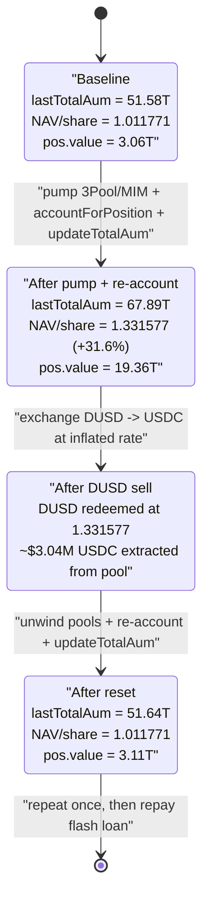
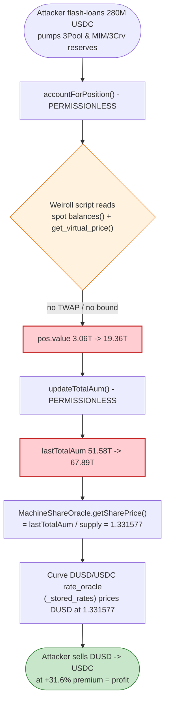

# Makina Finance Exploit — Self-Referential AUM Oracle Manipulation via Permissionless Re-Accounting

> **Vulnerability classes:** vuln/oracle/price-manipulation · vuln/governance/flash-loan-attack

> **Reproduction:** the PoC compiles & runs in an isolated Foundry project at
> [this project folder](.) (the umbrella DeFiHackLabs repo
> contains many unrelated PoCs that do not all compile, so this one was extracted).
> Full verbose trace: [output.txt](output.txt).
> Verified vulnerable sources: [Caliber.sol](sources/Caliber_06147e/src_caliber_Caliber.sol),
> [MachineShareOracle.sol](sources/MachineShareOracle_9434Fe/src_oracles_MachineShareOracle.sol),
> [Machine.sol](sources/Machine_E10572/src_machine_Machine.sol).

---

## Key info

| | |
|---|---|
| **Loss** | ~$5.1M USDC drained from the DUSD/USDC pool (PoC reproduces **$4,304,016** net profit over two runs; on-chain pool loss ≈ $5.1M, the live tx was also front-run by a MEV bot) |
| **Vulnerable contracts** | `Caliber` (accounting) — [`0xD1A1C248B253f1fc60eACd90777B9A63F8c8c1BC`](https://etherscan.io/address/0xD1A1C248B253f1fc60eACd90777B9A63F8c8c1BC#code) (impl [`0x06147e07…`](https://etherscan.io/address/0x06147e073B854521c7B778280E7d7dBAfB2D4898#code)); `Machine` — [`0x6b006870C83b1Cd49E766Ac9209f8d68763Df721`](https://etherscan.io/address/0x6b006870C83b1Cd49E766Ac9209f8d68763Df721#code); `MachineShareOracle` — [`0x9434FeBA9eDc5D0Cedc128F417307f8d9afe8bc0`](https://etherscan.io/address/0x9434FeBA9eDc5D0Cedc128F417307f8d9afe8bc0#code) |
| **Victim pool** | DUSD/USDC Curve StableSwap-NG pool — [`0x32E616F4f17d43f9A5cd9Be0e294727187064cb3`](https://etherscan.io/address/0x32E616F4f17d43f9A5cd9Be0e294727187064cb3#code) (DUSD = the Makina MachineShare token `0x1e33E98a…`) |
| **Real attacker EOA** | `0x2f934b0fd5c4f99bab37d47604a3a1aeadef1ccc` |
| **Real attacker contract** | `0x2c19b916b29e5170f75628d690623dedcafeca4c` |
| **MEV bot (front-ran the tx)** | EOA `0x935bfb495e33f74d2e9735df1da66ace442ede48` / contract `0x454d03b2a1D52F5F7AabA8E352225335a1b724E8` |
| **Attack tx** | [`0x569733b8016ef9418f0b6bde8c14224d9e759e79301499908ecbcd956a0651f5`](https://app.blocksec.com/phalcon/explorer/tx/eth/0x569733b8016ef9418f0b6bde8c14224d9e759e79301499908ecbcd956a0651f5) |
| **Chain / block / date** | Ethereum mainnet / fork at `24,273,361` (block-1) / January 2026 |
| **Compiler** | Caliber/Machine `v0.8.28`, optimizer 1 run; PoC `^0.8.20`, **evm_version = cancun** (required) |
| **Bug class** | Price-oracle manipulation — self-referential NAV oracle valued from flash-loan-manipulable spot AMM state, refreshable by anyone |

---

## TL;DR

Makina is an on-chain asset-management vault. Users deposit USDC and receive **DUSD** (the `MachineShare`
token). DUSD's "fair value" is the vault NAV per share: `lastTotalAum / shareSupply`, exposed by
[`MachineShareOracle.getSharePrice()`](sources/MachineShareOracle_9434Fe/src_oracles_MachineShareOracle.sol#L98-L121).
A **Curve StableSwap-NG DUSD/USDC pool** uses that very oracle as DUSD's `rate_oracle`
([`_stored_rates()`](sources/CurveStableSwapNG_32E616/CurveStableSwapNG.sol#L433-L468)), so the Curve
pool prices DUSD at exactly whatever NAV-per-share Makina reports.

The NAV (`lastTotalAum`) is built from the vault's positions. A position's value is computed by
[`Caliber._accountForPosition()`](sources/Caliber_06147e/src_caliber_Caliber.sol#L726-L783), which runs a
Weiroll script that reads **live, manipulable Curve pool reserves and `get_virtual_price()`** (3Pool,
MIM/3Crv) and prices them with no manipulation resistance. Both the re-accounting call
([`accountForPosition`](sources/Caliber_06147e/src_caliber_Caliber.sol#L331-L345)) and the NAV refresh
([`Machine.updateTotalAum`](sources/Machine_E10572/src_machine_Machine.sol#L392-L403)) are **permissionless**.

So the attacker, in a single flash-loaned transaction:

1. **Pumps** the Curve pools that back the vault's positions (3Pool, MIM/3Crv) with ~280M USDC of borrowed liquidity, inflating the value the Caliber will attribute to its position.
2. **Re-accounts** the position (`accountForPosition`) and **refreshes NAV** (`updateTotalAum`). The position value jumps from **3.06T → 19.36T** (accounting units), pushing `lastTotalAum` from **51.58T → 67.89T**, i.e. **DUSD NAV per share `1.011771 → 1.331577` (+31.6%)**.
3. **Sells DUSD into the Curve pool** at the now-inflated rate (the rate oracle returns the pumped NAV), receiving ~31% more USDC per DUSD than it paid moments earlier.
4. **Unwinds** the Curve manipulation and resets Makina state. Repeats once. Repays the flash loan.

Net: **+$4,304,016 USDC** in the PoC (two runs), draining the honest USDC liquidity from the DUSD/USDC pool.

---

## Background — what Makina does

Makina is a vault/asset-manager protocol with three relevant pieces:

- **`Machine`** ([Machine.sol](sources/Machine_E10572/src_machine_Machine.sol)) — the hub vault. Holds the
  cached NAV `_lastTotalAum`, mints/redeems the `MachineShare` token (here symbol **DUSD**), and computes
  share price from `_lastTotalAum / shareSupply`.
- **`Caliber`** ([Caliber.sol](sources/Caliber_06147e/src_caliber_Caliber.sol)) — the strategy executor.
  It holds the vault's DeFi positions (Curve LP, Morpho, etc.). Each position's value is re-computed by
  running a merkle-allowlisted **Weiroll** instruction (`accountForPosition`) that reads on-chain state and
  caches the result in `pos.value`. `getDetailedAum()` sums all `pos.value`s to report the hub Caliber's NAV.
- **`MachineShareOracle`** ([MachineShareOracle.sol](sources/MachineShareOracle_9434Fe/src_oracles_MachineShareOracle.sol)) —
  a price feed that returns `getSharePrice()` = `lastTotalAum / shareSupply` (scaled). This oracle is wired
  into the **Curve DUSD/USDC StableSwap-NG pool** as DUSD's rate oracle, so the pool's exchange rate tracks
  the reported NAV per share.

Key on-chain facts at the fork block (from the trace):

| Parameter | Value |
|---|---|
| `MachineShare`/DUSD total supply | `50,982,086.07` DUSD (`5.098e25`) |
| `lastTotalAum` (baseline) | `51,582,210,540,930` (≈ $51.58M, 6-dp accounting units) |
| DUSD NAV per share (baseline) | `getSharePrice = 1,011,771` → `1.011771` (USDC/DUSD, 1e6) |
| DUSD/USDC pool USDC balance (baseline) | `5,127,936,124,721` (≈ $5.13M USDC) |
| Caliber accounted position value (baseline) | `3,114,286,714,450` / `3,164,641,776,670` (≈ $3.06M–$3.16M) |
| DUSD/USDC pool DUSD rate oracle | `MachineShareOracle.getSharePrice()` (asset_type 1) |

The ~$5.1M of USDC sitting in the DUSD/USDC Curve pool is the prize.

---

## The vulnerable code

### 1. The vault NAV oracle reads the *cached* `lastTotalAum` and feeds the Curve pool

```solidity
// MachineShareOracle.getSharePrice()  (post-migration branch)
function getSharePrice() external view override returns (uint256) {
    ...
    } else {
        address machine = $._isShareOwnerPdv ? IPreDepositVault($._shareOwner).machine() : $._shareOwner;
        uint256 aum = IMachine(machine).lastTotalAum();              // ← cached NAV
        sharePrice = MachineUtils.getSharePrice(aum, stSupply, $._shareTokenDecimalsOffset);
    }
    return $._scalingNumerator * sharePrice;
}
```
[MachineShareOracle.sol:98-121](sources/MachineShareOracle_9434Fe/src_oracles_MachineShareOracle.sol#L98-L121) ·
`getSharePrice = SHARE_UNIT × (aum+1) / (supply+offset)`
([MachineUtils.sol:138-144](sources/Machine_E10572/src_libraries_MachineUtils.sol#L138-L144)).

The Curve DUSD/USDC pool consumes this as DUSD's `rate_oracle` and bakes it straight into the swap math:

```python
# CurveStableSwapNG._stored_rates()
if asset_types[i] == 1 and not rate_oracles[i] == 0:
    oracle_response: Bytes[32] = raw_call(
        convert(rate_oracles[i] % 2**160, address),
        _abi_encode(rate_oracles[i] & ORACLE_BIT_MASK),   # → MachineShareOracle.getSharePrice()
        max_outsize=32, is_static_call=True)
    fetched_rate: uint256 = convert(oracle_response, uint256)
    rates[i] = unsafe_div(rates[i] * fetched_rate, PRECISION)   # DUSD priced at NAV/share
```
[CurveStableSwapNG.sol:433-468](sources/CurveStableSwapNG_32E616/CurveStableSwapNG.sol#L433-L468)

### 2. The position value is computed from manipulable spot AMM state, with no guard

```solidity
function _accountForPosition(Instruction calldata instruction, bool checks) internal returns (uint256, int256) {
    if (checks) {
        if (instruction.instructionType != InstructionType.ACCOUNTING) revert Errors.InvalidInstructionType();
        _checkInstructionIsAllowed(instruction);          // only a merkle-root allowlist on the *script*
    }
    bytes[] memory returnedState = _execute(instruction.commands, instruction.state); // Weiroll: reads live pool state
    amounts = _decodeAccountingOutputState(returnedState);
    ...
    for (uint256 i; i < len; ++i) {
        currentValue += _accountingValueOf(token, amounts[i]);  // value derived from manipulated reserves
    }
    ...
    pos.value = currentValue;                              // ← cached, no TWAP / no sanity bound
    pos.lastAccountingTime = block.timestamp;
    return (currentValue, int256(currentValue) - int256(lastValue));
}
```
[Caliber.sol:726-783](sources/Caliber_06147e/src_caliber_Caliber.sol#L726-L783)

The Weiroll script (`instruction.commands`) reads, in the trace, the **3Pool `balances(0..2)` and
`get_virtual_price()`** and the **DUSD pool `totalSupply`/virtual price** — all flash-loan-manipulable — and
multiplies them via `mulDiv` (the `0x836C9007` math helper). Prices for DAI/USDC/USDT come from Chainlink,
so the manipulation rides on the *quantities* (pool reserves), which the allowlisted script trusts at spot.

### 3. Re-accounting and NAV refresh are both permissionless

```solidity
function accountForPosition(Instruction calldata instruction)
    external override nonReentrant returns (uint256, int256)       // ← NO access control
{ ... return _accountForPosition(instruction, true); }
```
[Caliber.sol:331-345](sources/Caliber_06147e/src_caliber_Caliber.sol#L331-L345)

```solidity
function updateTotalAum() external override nonReentrant notRecoveryMode returns (uint256) {  // ← NO access control
    uint256 _lastTotalAum = MachineUtils.updateTotalAum($, IHubCoreRegistry(registry).oracleRegistry());
    ...
}
```
[Machine.sol:392-403](sources/Machine_E10572/src_machine_Machine.sol#L392-L403) ·
`_getTotalAum` sums `getDetailedAum()` from the hub Caliber
([MachineUtils.sol:204-250](sources/Machine_E10572/src_libraries_MachineUtils.sol#L204-L250)).

Anyone can therefore (a) force the Caliber to re-value its position against manipulated reserves, and
(b) snapshot that inflated number into `lastTotalAum`, which the Curve pool immediately trusts.

---

## Root cause — why it was possible

The protocol built a **circular pricing dependency** with no manipulation resistance:

```
Curve DUSD/USDC rate  ←  MachineShareOracle.getSharePrice  ←  Machine.lastTotalAum
        ↑                                                            ↑
   attacker sells DUSD here                            Caliber.pos.value  ←  spot Curve reserves (3Pool, MIM)
                                                                            ↑
                                                            attacker pumps these here
```

1. **NAV is valued from spot AMM reserves.** `Caliber._accountForPosition` runs a Weiroll script that reads
   `balances()` and `get_virtual_price()` of the very Curve pools an attacker can move with a flash loan.
   There is no TWAP, no `min`/`max` bound on the per-call value change, and no comparison against an
   independent reference. The merkle allowlist only constrains *which script* runs — not the *values* it
   reads.
2. **The NAV is exposed as a tradeable price.** Because the DUSD/USDC Curve pool uses `getSharePrice()` as
   DUSD's rate oracle, the inflated NAV is not just a reporting number — it becomes the **exchange rate** at
   which DUSD trades for real USDC. NAV inflation is directly monetizable.
3. **Both refresh entry points are permissionless.** `accountForPosition` and `updateTotalAum` have no access
   control, so the attacker controls *when* the inflated valuation is captured — immediately before selling.
   A keeper-only / cool-down design would have prevented attacker-timed snapshots.
4. **The cache is read fresh, atomically.** `pos.value` and `lastTotalAum` are plain cached values that the
   attacker re-writes in the same transaction; the staleness check in `getDetailedAum`
   ([Caliber.sol:283-284](sources/Caliber_06147e/src_caliber_Caliber.sol#L283-L289)) only *requires* fresh
   accounting — it does nothing to stop a maliciously fresh value.

The exploit is fully recoverable intra-transaction (the pump is unwound), so it is **flash-loanable** — the
PoC simply `deal`s 280M USDC as working capital.

---

## Preconditions

- The DUSD/USDC Curve pool is configured to use `MachineShareOracle.getSharePrice()` as DUSD's rate oracle
  (asset_type 1) — true at the fork block.
- The hub Caliber holds at least one position whose accounting script reads flash-loan-manipulable Curve pool
  state (3Pool, MIM/3Crv) — true (position `329781725403426819283923979544582973776`).
- Working capital in USDC to move the backing Curve pools. Peak outlay was the 280M USDC flash loan, fully
  recovered intra-transaction → flash-loanable.
- No timelock / keeper restriction on `accountForPosition` or `updateTotalAum` — true (both permissionless).

---

## Attack walkthrough (with on-chain numbers from the trace)

Each `runExploit()` does steps 1–7 below; the PoC runs it twice. All figures are taken directly from
[output.txt](output.txt) (`console.log` lines and `TokenExchange`/return values).

| # | Step (PoC `runExploit`) | Concrete numbers (run 1) | Effect |
|---|---|---|---|
| 0 | **Baseline** | NAV/share `getSharePrice = 1.011771`; `lastTotalAum = 51,582,210,540,930`; Caliber pos value `3.06T–3.16T` | Honest state. |
| 1 | **Pump DUSD/USDC pool**: `add_liquidity(100M USDC)` then `exchange(0→1, 10M USDC)` | gain `9,215,229 DUSD`, `99,206,722 DUSD/USDC LP` | Buys cheap DUSD; pre-loads pool with USDC. |
| 2 | **Add 170M USDC to 3Pool** `add_liquidity([0,170M,0])` | gain `163,452,534 3Crv` | Loads 3Pool (the Caliber's position backing). |
| 3 | **Pump MIM/3Crv pool**: add 30M MIM-LP, `remove_liquidity_one_coin(15M)`, `exchange(1→0,120M)` | gain `13,201,058 MIM`, `15,642,770 MIM/3Crv LP` | Skews MIM/3Crv reserves (further position backing). |
| 4 | **Re-account + refresh NAV**: `accountForPosition(...)` then `updateTotalAum()` | **pos value `3.06T → 19,363,191,719,074` (+16.30T)**; **`lastTotalAum 51.58T → 67,886,575,091,834`**; **NAV/share `1.011771 → 1.331577` (+31.6%)** | The self-referential oracle now overprices DUSD. |
| 5 | **Sell DUSD + LP into pool at inflated rate**: `exchange(1→0, 9,215,229 DUSD)` + `remove_liquidity_one_coin(99.2M LP)` | DUSD swap returns `12,785,691` USDC; running USDC balance `113,451,824,157,347` (+`3,451,824` over the 110M spent on the DUSD-pool leg) | Extracts ~31% premium on the DUSD acquired in step 1. |
| 6 | **Unwind MIM & 3Pool legs** back to USDC | cumulative USDC `283,037,068,227,933` ⇒ **+$3,037,068** over the 280M flash loan after run 1 | Recovers all pump capital + net profit. |
| 7 | **Reset Makina**: `accountForPosition` + `updateTotalAum` again | pos value `19.36T → 3.11T`; `lastTotalAum → 51,637,670,087,210` | Returns NAV to ~baseline for the next run. |

Run 2 repeats: NAV pumped `51.58T → 68,217,264,462,913`, NAV/share `→ 1.331577` again, DUSD swap of
`9,235,449 DUSD`, ending cumulative USDC `284,304,016,338,798`.

### Profit accounting (USDC)

| Item | Amount |
|---|---:|
| Flash loan (working capital) | 280,000,000 USDC |
| Cumulative balance after run 1 | 283,037,068 USDC (**+3,037,068**) |
| Cumulative balance after run 2 | 284,304,016 USDC (**+4,304,016**) |
| Repay flash loan (`transfer 280M → 0xdEaD`) | −280,000,000 USDC |
| **Net profit (PoC)** | **+$4,304,016** |

The PoC nets **$4.3M**; the live on-chain pool loss was ≈ **$5.1M** (different exact sizing on-chain and a
MEV bot front-running part of the value). The profit is the honest USDC that real LPs had in the DUSD/USDC
pool, plus DUSD redeemed at an artificially high rate.

---

## Diagrams

### Sequence of the attack (one `runExploit`)

```mermaid
sequenceDiagram
    autonumber
    actor A as Attacker
    participant DP as "DUSD/USDC Curve pool"
    participant TP as "3Pool / MIM-3Crv pools"
    participant CAL as "Caliber (accounting)"
    participant M as "Machine (NAV cache)"
    participant O as "MachineShareOracle"

    Note over M,O: Baseline NAV/share = 1.011771<br/>lastTotalAum = 51.58T

    rect rgb(255,243,224)
    Note over A,TP: Steps 1-3 - pump the backing pools
    A->>DP: add_liquidity 100M USDC + exchange 10M USDC -> 9.215M DUSD
    A->>TP: add 170M USDC to 3Pool; skew MIM/3Crv with 120M+30M
    end

    rect rgb(255,235,238)
    Note over A,O: Step 4 - inflate the self-referential NAV oracle
    A->>CAL: accountForPosition(instruction)  (permissionless)
    CAL->>TP: Weiroll reads spot balances() & get_virtual_price()
    CAL-->>CAL: pos.value 3.06T -> 19.36T
    A->>M: updateTotalAum()  (permissionless)
    M->>CAL: getDetailedAum()
    M-->>M: lastTotalAum 51.58T -> 67.89T
    Note over O: getSharePrice() now 1.331577 (+31.6%)
    end

    rect rgb(232,245,233)
    Note over A,DP: Step 5 - sell DUSD at the inflated rate
    A->>DP: exchange 9.215M DUSD -> USDC
    DP->>O: rate_oracle = getSharePrice() = 1.331577
    DP-->>A: 12.785M USDC  (~31% premium)
    A->>DP: remove_liquidity_one_coin(99.2M LP) -> USDC
    end

    rect rgb(243,229,245)
    Note over A,M: Steps 6-7 - unwind & reset
    A->>TP: unwind MIM & 3Pool legs back to USDC
    A->>CAL: accountForPosition (reset)
    A->>M: updateTotalAum (NAV back to ~baseline)
    end

    Note over A: Net +$3.04M (run 1); repeat -> +$4.30M total
```

### NAV / share-price state evolution



### The flaw: self-referential valuation loop



---

## Why each magic number

- **280M USDC flash loan** — enough to move the 3Pool and MIM/3Crv reserves materially while leaving headroom
  to also buy ~9.2M DUSD in the DUSD/USDC pool; fully recovered intra-tx.
- **100M `add_liquidity` + 10M `exchange` in the DUSD pool** — acquires `9.215M DUSD` cheaply (at ~1.011) and
  pre-loads the pool with USDC so the later DUSD→USDC sell has liquidity to drain.
- **170M into 3Pool, 120M+30M into MIM/3Crv** — skews the reserves that the Caliber's accounting Weiroll
  script reads, so the re-accounted position value jumps `+16.30T`, lifting NAV/share by `+31.6%`.
- **Two runs** — each run extracts the premium the pool can supply at that moment; repeating compounds the
  drain until the pool's honest USDC is exhausted.

---

## Remediation

1. **Do not value NAV from spot AMM state.** The Caliber accounting scripts must price Curve/AMM LP positions
   from manipulation-resistant sources (LP fair-value using *external* per-asset oracles and `get_virtual_price`
   bounded by a TWAP, not raw spot `balances()`), or cap the per-call position-value change.
2. **Break the self-reference.** A share-price oracle that feeds an external market (the Curve `rate_oracle`)
   must not be derivable, within the same block, from positions that trade against that same market. Use a
   smoothed/lagged NAV (TWAP of `lastTotalAum`, or a min-update interval) for the rate oracle so it cannot be
   moved and consumed atomically.
3. **Gate the refresh entry points.** Restrict `accountForPosition` and `updateTotalAum` to a trusted
   keeper/role, or enforce a cool-down so an attacker cannot snapshot a freshly-manipulated valuation and
   trade on it in the same transaction.
4. **Add value sanity bounds.** Reject a position re-accounting (or an AUM update) whose value change exceeds
   a configurable per-update threshold relative to the prior value; a +500% position jump in one call is a
   red flag.
5. **Make the NAV path reentrancy/flash-loan aware.** Even with a merkle-allowlisted script, the *inputs* it
   reads must be validated; allowlisting the script is not the same as validating the data the script trusts.

---

## How to reproduce

The PoC was extracted into a standalone Foundry project (the umbrella DeFiHackLabs repo has several unrelated
PoCs that fail to compile under a whole-project `forge test`):

```bash
_shared/run_poc.sh 2026-01-makina_exp -vvvvv
```

- **Mainnet archive RPC required** — the fork is at block `24,273,361` (`24_273_362 - 1`). `foundry.toml`
  uses an Infura archive endpoint, which serves historical state at that block.
- **`evm_version = cancun`** is required (set in [foundry.toml](foundry.toml)); the PoC header notes this.
- Result: `[PASS] testMakinaExploitTest()` with `Final Profit in USDC: $ 4304016`.

Expected tail:

```
Ran 1 test for test/makina_exp.sol:MakinaExploitTest
[PASS] testMakinaExploitTest() (gas: 4369450)
  USDC after repay 280M USDC: 4304016338798
  Final Profit in USDC: $ 4304016
Suite result: ok. 1 passed; 0 failed; 0 skipped; finished in 4.68s
```

---

*References: post-mortem — https://github.com/anon-cBE4/anon-cBE4/blob/main/writeups/makina_attack_analyze.md ·
QuillAudits — https://www.quillaudits.com/blog/hack-analysis/makina-4m-hack-explained ·
alerts — TenArmor / CertiK.*
