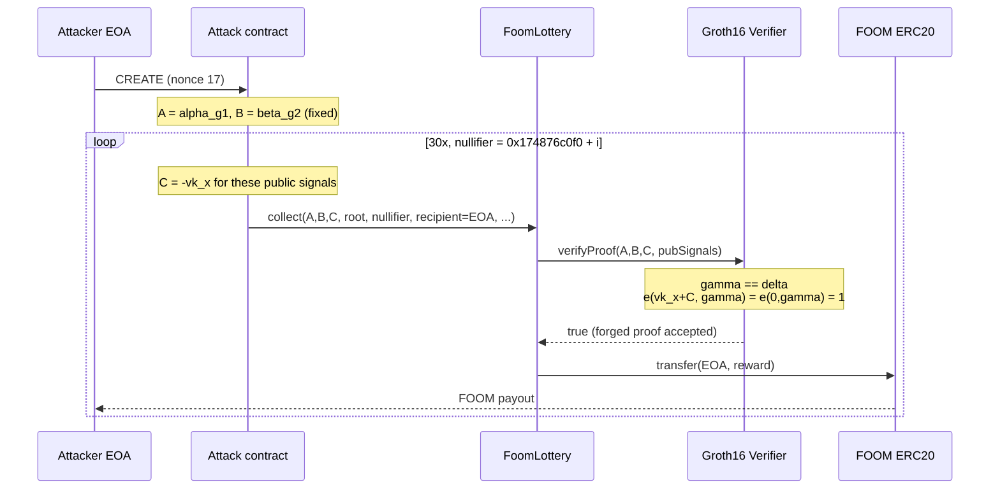
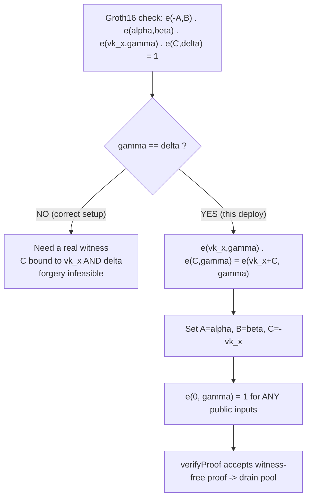

# FoomCash / FOOM Lottery — Groth16 verifier with `gamma == delta` lets anyone forge proofs

> **Vulnerability classes:** vuln/auth/signature-validation · vuln/logic/missing-check · vuln/logic/missing-validation

> **Reproduction:** the PoC compiles & runs in an isolated Foundry project at
> [this project folder](.). The fork is served offline from the bundled
> `anvil_state.json` (local anvil replays Ethereum state at block `24539649`), so no
> public RPC is required.
> Full verbose trace: [output.txt](output.txt).
> Verified vulnerable source: [WithdrawG16Verifier](sources/WithdrawG16Verifier_c04386/src_Withdraw.sol)
> (`0xc043…71A6`), [FoomLottery](sources/FoomLottery_239AF9/src_FoomLottery.sol) (`0x239A…51f8`).

<!-- non-defihacklabs -->

---

## Key info

| | |
|---|---|
| **Loss** | **19,695,576,757,802.19 FOOM** (~$1.3M) — the FOOM Lottery pool drained to dust in one tx |
| **Vulnerable contract** | `WithdrawG16Verifier` — [`0xc043865fb4D542E2bc5ed5Ed9A2F0939965671A6`](https://etherscan.io/address/0xc043865fb4D542E2bc5ed5Ed9A2F0939965671A6#code) (`gamma == delta`) |
| **Victim funds contract** | `FoomLottery` mixer — [`0x239AF915abcD0a5DCB8566e863088423831951f8`](https://etherscan.io/address/0x239AF915abcD0a5DCB8566e863088423831951f8#code) |
| **FOOM token** | [`0xd0D56273290D339aaF1417D9bfa1bb8cFe8A0933`](https://etherscan.io/address/0xd0D56273290D339aaF1417D9bfa1bb8cFe8A0933) |
| **Attacker EOA** | [`0x46c403e3DcAF219D9D4De167cCc4e0dd8E81Eb72`](https://etherscan.io/address/0x46c403e3DcAF219D9D4De167cCc4e0dd8E81Eb72) |
| **Attack contract** | [`0x256a5D6852Fa5B3C55D3b132e3669A0bdE42e22c`](https://etherscan.io/address/0x256a5D6852Fa5B3C55D3b132e3669A0bdE42e22c) (CREATE, attacker nonce 17, same block) |
| **Attack tx** | [`0xce20448233f5ea6b6d7209cc40b4dc27b65e07728f2cbbfeb29fc0814e275e48`](https://etherscan.io/tx/0xce20448233f5ea6b6d7209cc40b4dc27b65e07728f2cbbfeb29fc0814e275e48) |
| **Chain / block / date** | Ethereum mainnet / fork `24539649` (attack in `24539650`) / 2026-02-26 |
| **Compiler** | Verifier `>=0.7.0 <0.9.0` (snarkJS-generated); Lottery Solidity `0.8.28` |
| **Bug class** | Groth16 verifying key has `gamma == delta`; soundness collapses so a witness-free proof (`A = alpha`, `B = beta`, `C = -vk_x`) verifies for **any** public inputs |

A near-identical drain also occurred on **Base** (~$316K); this PoC reproduces the
larger Ethereum leg.

---

## TL;DR

1. FoomCash's `FoomLottery` is a Tornado-style shielded pool: you `play()` to deposit
   FOOM behind a commitment, and later `collect()` a reward by presenting a Groth16
   zero-knowledge proof that you own an unspent note in the Merkle tree.

2. The deployed `WithdrawG16Verifier` verifying key was generated by a **botched
   trusted setup**: `gamma` and `delta` are the **same** G2 point (both left as the
   canonical BN254 G2 generator — the `delta` "toxic waste" was never applied).

3. Groth16 soundness *requires* `gamma` and `delta` to be independent. When they are
   equal, the pairing check degenerates into an equation an attacker can satisfy with
   **no witness at all**: set proof `A = alpha_g1`, `B = beta_g2`, and `C = -vk_x`.
   Then the whole check reduces to `e(0, gamma) == 1`, which is trivially true for
   **any** public signals (any recipient, any nullifier, any amount).

4. The attacker deployed a contract whose constructor loops `collect()` **30 times**
   with fresh nullifiers (`0x174876c0f0 + i`) and `recipient = attacker`, forging a
   valid proof each iteration. Each `collect()` pays out the lottery's max reward (and
   then half of the shrinking pool), transferring FOOM straight to the attacker until
   the pool is empty — **19,695,576,757,802.19 FOOM** in a single transaction.

---

## Background

FoomCash (FOOM Lottery) is a privacy pool + on-chain lottery for the FOOM memecoin.
Users deposit a fixed denomination with `play()`, which inserts a commitment leaf into
a Merkle tree. To withdraw a reward, `collect()` takes a Groth16 proof plus seven
public signals:

```text
[ _root, _nullifierHash, _rewardbits, _recipient, _relayer, _fee, _refund ]
```

The circuit is supposed to prove: *"I know the secret behind an unspent leaf under
`_root`, its nullifier hashes to `_nullifierHash`, and the payout parameters are
consistent"* — without revealing which leaf. The contract enforces
double-spend protection by marking `nullifier[_nullifierHash] = 1`, and pays the
reward to `_recipient`. Soundness of the proof system is the **only** thing standing
between an outsider and the pool: there is no other ownership check.

The proof is verified by an auto-generated snarkJS `Groth16Verifier` at
`0xc043…71A6`. Its security rests entirely on the verifying key produced by the
project's trusted setup ceremony.

---

## The vulnerable code

### The verifying key: `gamma == delta` (verified source)

```solidity
// sources/WithdrawG16Verifier_c04386/src_Withdraw.sol
uint256 constant gammax1 = 11559732032986387107991004021392285783925812861821192530917403151452391805634;
uint256 constant gammax2 = 10857046999023057135944570762232829481370756359578518086990519993285655852781;
uint256 constant gammay1 = 4082367875863433681332203403145435568316851327593401208105741076214120093531;
uint256 constant gammay2 = 8495653923123431417604973247489272438418190587263600148770280649306958101930;
uint256 constant deltax1 = 11559732032986387107991004021392285783925812861821192530917403151452391805634; // == gammax1
uint256 constant deltax2 = 10857046999023057135944570762232829481370756359578518086990519993285655852781; // == gammax2
uint256 constant deltay1 = 4082367875863433681332203403145435568316851327593401208105741076214120093531;  // == gammay1
uint256 constant deltay2 = 8495653923123431417604973247489272438418190587263600148770280649306958101930;  // == gammay2
```

`(gammax1, gammax2, gammay1, gammay2) == (deltax1, deltax2, deltay1, deltay2)` — and,
worse, these are exactly the **canonical BN254 G2 generator** coordinates. In a
correct ceremony `delta` is randomized in phase 2 and the toxic waste discarded; here
`delta` was never touched, so it equals `gamma`.

### The pairing check that this breaks (verified source)

```solidity
function checkPairing(pA, pB, pC, pubSignals, pMem) -> isOk {
    // vk_x = IC0 + sum_i IC[i] * pubSignals[i]
    // -A
    mstore(_pPairing, calldataload(pA))
    mstore(add(_pPairing, 32), mod(sub(q, calldataload(add(pA, 32))), q)); // negate A.y
    // B, alpha1, beta2, vk_x, gamma2, C, delta2 laid out for the ecPairing precompile (0x08)
    let success := staticcall(sub(gas(), 2000), 8, _pPairing, 768, _pPairing, 0x20)
    isOk := and(success, mload(_pPairing))
}
```

The precompile checks:

```text
e(-A, B) · e(alpha, beta) · e(vk_x, gamma) · e(C, delta) == 1
```

### Where the pool trusts it (verified source)

```solidity
// sources/FoomLottery_239AF9/src_FoomLottery.sol — collect()
require(nullifier[_nullifierHash] == 0, "Incorrect nullifier");
nullifier[_nullifierHash] = 1;
...
require(
    withdraw.verifyProof(_pA, _pB, _pC,
        [ _root, _nullifierHash, _rewardbits, uint(uint160(_recipient)),
          uint(uint160(_relayer)), _fee, _refund ]),
    "Invalid withdraw proof");           // <-- the ONLY gate protecting the pool
...
if (reward - _fee > 0) { _withdraw(_recipient, reward - _fee); } // pays FOOM to _recipient
```

A fresh `_nullifierHash` each call defeats double-spend protection; a forged proof
sails through `verifyProof`; `_recipient` is attacker-chosen.

---

## Root cause

Groth16's verification equation is

```text
e(A, B) = e(alpha, beta) · e(vk_x, gamma) · e(C, delta)
```

Rearranged, the on-chain check is `e(-A,B) · e(alpha,beta) · e(vk_x,gamma) · e(C,delta) = 1`.

**With `gamma == delta`** the last two factors merge, because pairings are bilinear:

```text
e(vk_x, gamma) · e(C, gamma) = e(vk_x + C, gamma)
```

so the whole equation collapses to

```text
e(-A, B) · e(alpha, beta) · e(vk_x + C, gamma) = 1
```

An attacker who never ran the circuit simply picks:

| Proof element | Chosen value | Effect |
|---|---|---|
| `A` | `alpha_g1` (from VK) | `e(-A, B) · e(alpha, beta) = e(-alpha, beta) · e(alpha, beta) = 1` |
| `B` | `beta_g2` (from VK) | (same as above) |
| `C` | `-vk_x` (point negation) | `e(vk_x + C, gamma) = e(0, gamma) = 1` |

Product `= 1 · 1 = 1` → **valid for any public signals**. `vk_x` is fully determined by
the public inputs and the public `IC[]` constants, so the attacker recomputes it
per-call (only `C` changes; `A` and `B` are constant). The verbose trace confirms
`A = (alphax, alphay)` and `B = beta2` are byte-for-byte the verifier's own VK
constants on every call ([output.txt](output.txt) L1581).

The bug is not in the circuit or in `FoomLottery`'s logic — it is a **misconfigured
verifying key** whose broken soundness makes `verifyProof` accept forgeries. The pool
had no defence in depth: proof validity was the sole authorization.

---

## Preconditions

- The verifier at `0xc043…71A6` has `gamma == delta` (true at the fork block, and
  immutable — the constants are hard-coded).
- `FoomLottery` holds a non-trivial FOOM balance (pool `= 19,695,576,810,020.24 FOOM`).
- `collect()` is permissionless; `_recipient` is caller-chosen.
- The attacker supplies a `_root` that already exists in `roots[]` (any historical
  root passes `roots[_root] > 0`) and a never-used `_nullifierHash` each call.
- No secret, no note, no deposit, and no allowance required — soundness is the only
  gate and it is broken.

---

## Attack walkthrough

Single atomic contract-creation tx `0xce2044…e48` (the constructor performs the whole
drain). The PoC replays the exact CREATE initcode from the attacker EOA at fork
`24539649`; attacker nonce 17 reproduces the real attack address `0x256a…e22c`.

1. **CREATE** the attack contract (constructor args = mixer, FOOM, attacker)
   ([output.txt](output.txt) L1565).
2. Constructor computes the constant forged points once: `A = alpha_g1`, `B = beta_g2`,
   and prepares to compute `C = -vk_x` per iteration.
3. **Loop i = 0..29**, `_nullifierHash = 0x174876c0f0 + i`:
   - Compute `vk_x` from `IC[]` and the public signals, set `C = -vk_x`.
   - Call `FoomLottery.collect(A, B, C, root, nullifier, attacker, 0, 0, 0, rewardbits=7, 0)`
     ([output.txt](output.txt) L1578).
   - `verifyProof(...)` returns **true** on the forged proof ([output.txt](output.txt) L1581).
   - `collect()` transfers the reward in FOOM directly to the attacker
     ([output.txt](output.txt) L1614) and emits `LogWin` ([output.txt](output.txt) L1619).
4. The first collects pay the max reward (`4,047,820,800,000,000,000,000,000,000,000`
   FOOM each). Once `balance < reward`, `collect()`'s `balance/2` branch pays half the
   remaining pool, so payouts halve each subsequent call — 30 iterations empty the pool
   down to `52,218.04 FOOM` of dust.

Offline PoC result ([output.txt](output.txt)):

```
Attacker Before exploit FOOM Balance: 0.000000000000000000
Attacker FOOM profit:                 19695576757802.192910518134117126
Mixer FOOM before:                    19695576810020.236864000000000000
Mixer FOOM after:                     52218.043953481865882874
[PASS] testExploit()
```

Token flow (per collect, x30):

```text
FoomLottery  --collect(): _withdraw-->  Attacker EOA        (recipient in public signals)
      ^ verifyProof(forged) == true because gamma == delta
```

---

## Diagrams





---

## Remediation

1. **Re-run the trusted setup correctly.** `delta` must be randomized in phase 2 and be
   independent of `gamma`; the toxic waste must be destroyed. Never ship a verifier
   whose `delta` equals `gamma` or the G2 generator.

2. **Verify the verifying key before deployment.** Add a CI/deploy assertion that the
   on-chain VK matches the ceremony output and that `gamma != delta`. A single equality
   check would have caught this.

3. **Independent audit of the ceremony artifacts**, not just the circuit and contracts —
   the vulnerability lived entirely in constants generated off-chain.

4. **Defence in depth in the pool.** Even with a sound verifier, cap single-tx payouts /
   rate-limit `collect()` and monitor for whole-pool drains, so a verifier failure is not
   an instant total loss.

---

## How to reproduce

```bash
cd ~/RustroverProjects/audits/evm-hack-registry
_shared/run_poc.sh 2026-02-FoomCash_Groth16_exp --match-test testExploit -vvvvv
# Offline: loads anvil_state.json @ block 24539649, no RPC required.
# Expected: [PASS] and Attacker FOOM profit 19695576757802.192910518134117126
```

PoC source: [test/FoomCash_Groth16_exp.sol](test/FoomCash_Groth16_exp.sol) — replays the
historical CREATE initcode (the whole attack tx input) from the attacker EOA. The
forged proofs are recomputed by the original constructor bytecode, so no proof
re-forging is needed.

---

*Reference: [BeosinAlert](https://x.com/BeosinAlert/status/2026949474065809838) · [QuillAudits — FoomCash exploit explained](https://www.quillaudits.com/blog/hack-analysis/foomcash-exploit-explained) · [zkSecurity — Groth16 setup exploit](https://blog.zksecurity.xyz/posts/groth16-setup-exploit/) · [public PoC](https://github.com/DK27ss/FoomClub-1.6M-PoC)*
