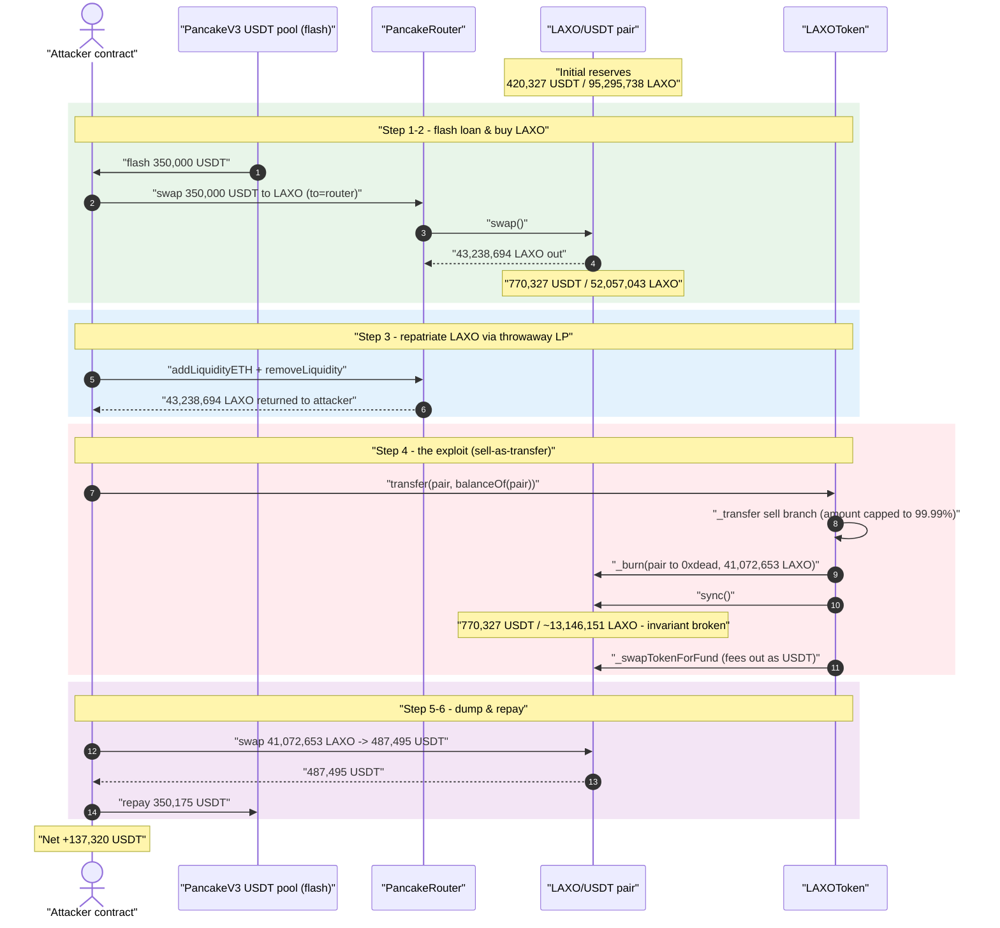
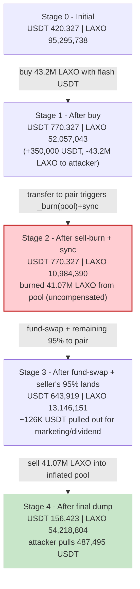
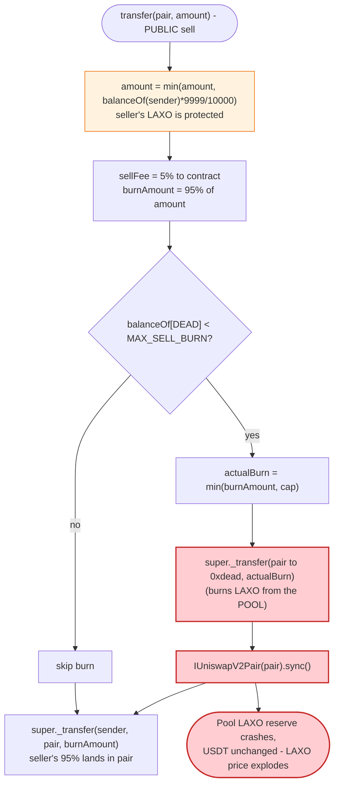

# LAXO Token Exploit — Uncompensated Pool-Side Burn on Every Sell Breaks `x·y = k`

> **Vulnerability classes:** vuln/logic/incorrect-order-of-operations · vuln/oracle/spot-price

> **Reproduction:** the PoC compiles & runs in an isolated Foundry project at
> [this project folder](.) (the umbrella DeFiHackLabs repo contains many unrelated PoCs
> that do not build together, so this one was extracted into a standalone project).
> Full verbose trace: [output.txt](output.txt).
> Verified vulnerable source: [contracts_LAXOToken.sol](sources/LAXOToken_62951C/contracts_LAXOToken.sol).

---

## Key info

| | |
|---|---|
| **Loss** | **~137,320 USDT (BSC-USD)** drained from the LAXO/USDT PancakeSwap pair |
| **Vulnerable contract** | `LAXOToken` — [`0x62951CaD7659393BF07fbe790cF898A3B6d317CB`](https://bscscan.com/address/0x62951CaD7659393BF07fbe790cF898A3B6d317CB#code) |
| **Victim pool** | LAXO/USDT PancakeSwap-V2 pair — [`0xF05a6361e6F851BbFf39C4f1d9aD4b661d3180B3`](https://bscscan.com/address/0xF05a6361e6F851BbFf39C4f1d9aD4b661d3180B3) |
| **Flash-loan source** | PancakeSwap-V3 USDT pool — [`0x4f31Fa980a675570939B737Ebdde0471a4Be40Eb`](https://bscscan.com/address/0x4f31Fa980a675570939B737Ebdde0471a4Be40Eb) |
| **Attacker EOA** | [`0x17f9132E66A78b93195b4B186702Ad18Fdcd6E3D`](https://bscscan.com/address/0x17f9132E66A78b93195b4B186702Ad18Fdcd6E3D) |
| **Attacker contract** | `0x6588ACB7dd37887C707C08AC710A82c9F9A7C1E9` |
| **Attack tx** | [`0xd58f3ef6414b59f95f55dae1acb3d5d6e626acf5333917c6d43fe422d98ac7d3`](https://bscscan.com/tx/0xd58f3ef6414b59f95f55dae1acb3d5d6e626acf5333917c6d43fe422d98ac7d3) |
| **Chain / block / date** | BSC / 82,730,141 / Feb 2026 |
| **Compiler** | Solidity v0.8.20, optimizer **1 run** |
| **Bug class** | Broken AMM invariant via an un-compensated, attacker-triggered pool-reserve burn (`_burn(pool) + sync()` inside the token's sell path) |

---

## TL;DR

`LAXOToken` is a deflationary "tax token." Whenever someone **sells** (transfers LAXO *to* the
PancakeSwap pair), its `_transfer` override doesn't just tax the seller — it **burns up to 95% of
the sale amount directly out of the AMM pair's own balance and then calls `pair.sync()`**
([contracts_LAXOToken.sol:106-113](sources/LAXOToken_62951C/contracts_LAXOToken.sol#L106-L113)).
This is an *un-compensated* deletion of one side of the pool's reserves: it destroys LAXO sitting in
the pair without any matching USDT outflow, then forces the pair to accept the reduced LAXO balance
as its new reserve. The constant-product invariant `x·y = k` collapses in whoever-holds-LAXO's favor.

The attacker, funded by a **flash loan of 350,000 USDT**:

1. **Buys 43.2M LAXO** from the pool with the flash-loaned USDT (a normal swap). The pool's LAXO
   reserve drops from 95.3M → 52.0M; its USDT reserve rises to 770K.
2. **Sells almost all of that LAXO back into the pool in a single `transfer`.** This trips the
   token's sell branch, which **burns ~41.07M LAXO straight out of the pair** (to `0xdead`) and
   `sync()`s. The pool's LAXO reserve crashes 52.0M → ~13.1M while the USDT side stays high —
   so LAXO becomes artificially expensive relative to USDT *inside the pool*.
3. Because of a 99.99% per-tx **maxAmount cap**, the seller (attacker) actually keeps the bulk of the
   LAXO it tried to dump; combined with the burned amount it now holds ~41M LAXO that the inflated
   pool will pay a huge amount of USDT for.
4. **Sells ~41.07M LAXO** into the now-degenerate pool for **487,495 USDT**.
5. **Repays** the flash loan (350,000 + 175 fee = 350,175 USDT) and walks off with the remainder.

Net result: **+137,320 USDT** profit, equal to `487,495 − 350,175` to the wei. The whole operation
is intra-transaction and self-funding, hence flash-loanable.

---

## Background — what LAXOToken does

`LAXOToken` ([source](sources/LAXOToken_62951C/contracts_LAXOToken.sol)) is a USDT-paired
PancakeSwap-V2 tax token built on a custom solmate-style ERC20
([abstract/token/ERC20.sol](sources/LAXOToken_62951C/contracts_abstract_token_ERC20.sol)). Its
`_transfer` override layers several "tokenomics" features on top of plain transfers:

- **Buy side** (pair → user): requires `buyEnabled`, deducts a per-user `buyQuota`, takes a 1%
  dividend fee.
- **Sell side** (user → pair): takes a 5% `sellFee` to the contract, then **burns the remaining 95%
  of the amount from the pool** (up to a `MAX_SELL_BURN` cap of 100M LAXO), and periodically swaps
  accumulated contract LAXO to USDT for dividend/marketing wallets.
- **Liquidity gating**: `_isAddLiquidity()` / `_isRemoveLiquidity()`
  ([abstract/dex/BaseUSDTWA.sol:12-24](sources/LAXOToken_62951C/contracts_abstract_dex_BaseUSDTWA.sol#L12-L24))
  compare the pair's USDT balance against its LAXO reserve to detect and block adds/removes.
- **Time-based deflation**: an hourly burn of 0.0208% of the pool's LAXO, gated on `lastDeflationTime`.

Because USDT (`0x55d3…`) sorts below the token address, the constructor enforces `USDT < address(this)`
([BaseUSDTWA.sol:9](sources/LAXOToken_62951C/contracts_abstract_dex_BaseUSDTWA.sol#L9)). In the
LAXO/USDT pair this makes **`token0 = USDT`, `token1 = LAXO`**, so `getReserves()` returns
`(reserve0 = USDT, reserve1 = LAXO)`.

On-chain state at the fork block (from the trace):

| Parameter | Value |
|---|---|
| `totalSupply` | 200,000,000 LAXO |
| `MAX_SELL_BURN` | **100,000,000 LAXO** (sell-burn cap) |
| `sellFee` | 5% to contract |
| sell **burn** | **95% of the (capped) sell amount, taken from the pool** |
| per-tx `maxAmount` cap | **99.99% of sender balance** (`balanceOf[sender] * 9999 / 10000`) |
| pool USDT reserve (start) | 420,327.57 USDT |
| pool LAXO reserve (start) | 95,295,738.39 LAXO |
| `balanceOf[DEAD]` (already burned) | well below `MAX_SELL_BURN`, so the pool-burn path is live |

---

## The vulnerable code

### 1. The sell path burns from the pool and `sync()`s

[contracts_LAXOToken.sol:98-123](sources/LAXOToken_62951C/contracts_LAXOToken.sol#L98-L123):

```solidity
} else if (uniswapV2Pair == recipient) {                       // ← a SELL (LAXO -> pair)
    if (_isAddLiquidity()) {
        revert("add liquidity not allowed");
    } else {
        uint256 sellFee = (amount * 500) / 10000;              // 5% to contract
        if (sellFee > 0) {
            super._transfer(sender, address(this), sellFee);
        }
        uint256 burnAmount = amount - sellFee;                 // 95% of the sale
        uint256 currentBurned = balanceOf[DEAD];
        if (currentBurned < MAX_SELL_BURN) {
            uint256 maxCanBurn = MAX_SELL_BURN - currentBurned;
            uint256 actualBurn = burnAmount > maxCanBurn ? maxCanBurn : burnAmount;
            super._transfer(uniswapV2Pair, DEAD, actualBurn);  // ⚠️ burns LAXO OUT OF THE POOL
            IUniswapV2Pair(uniswapV2Pair).sync();              // ⚠️ forces it to be the new reserve
        }
        uint256 contractTokenBalance = balanceOf[address(this)];
        if (contractTokenBalance > swapAtAmount) {
            uint256 numTokensSellToFund = (amount * numTokensSellRate) / 100;
            if (numTokensSellToFund > contractTokenBalance) {
                numTokensSellToFund = contractTokenBalance;
            }
            _swapTokenForFund(numTokensSellToFund);            // also pulls USDT from the pool
        }
        super._transfer(sender, recipient, burnAmount);        // the seller's 95% lands in the pair
    }
}
```

The decisive lines are **111-112**: `super._transfer(uniswapV2Pair, DEAD, actualBurn)` deletes LAXO
that belongs to the *pair*, then `sync()` tells the pair "your LAXO reserve is now this much smaller."
No USDT leaves the pair, so the product `k` collapses and LAXO's marginal price (in USDT) explodes.

### 2. The 99.99% per-tx cap means the seller keeps the LAXO

[contracts_LAXOToken.sol:80-83](sources/LAXOToken_62951C/contracts_LAXOToken.sol#L80-L83):

```solidity
uint256 maxAmount = (balanceOf[sender] * 9999) / 10000;
if (amount > maxAmount) {
    amount = maxAmount;                 // a single sell can move at most 99.99% of the balance
}
```

The attacker calls `laxo.transfer(pair, laxo.balanceOf(pair))` — asking to dump 52M LAXO, far more
than its own balance. The cap clamps the *effective* `amount` to 99.99% of what the attacker holds
(~43.23M). The crucial consequence: **the burn comes out of the pool, not out of the seller.** The
seller's LAXO is mostly untouched; the pool eats the destruction.

### 3. `_swapTokenForFund` — a second, smaller pool drain

[contracts_LAXOToken.sol:129-151](sources/LAXOToken_62951C/contracts_LAXOToken.sol#L129-L151) sells
the contract's accumulated LAXO (the 5% fees) back through the pool for USDT and ships it to the
dividend / marketing wallets — pulling another ~126K USDT out of the pair during the same call. This
is incidental to the core bug but further thins the pool's USDT side.

---

## Root cause — why it was possible

A PancakeSwap-V2 pair prices assets purely from its reserves and only enforces `x·y ≥ k` *inside
`swap()`*. `sync()` exists to let a pair re-read its real token balances — it trusts that balances
only change via `mint`/`burn`/`swap`/honest transfers.

`LAXOToken._transfer` violates that trust on **every sell**:

> On a sell it **destroys** LAXO held by the pair (`super._transfer(uniswapV2Pair, DEAD, actualBurn)`)
> and then calls `pair.sync()`, declaring the pair's LAXO reserve smaller. No USDT leaves the pair.
> `k` collapses and the price of LAXO (in USDT) spikes — and because the seller's own LAXO is
> protected by the 99.99% cap, the seller can immediately re-sell into the inflated pool at a profit.

Four design decisions compose into a critical bug:

1. **The burn is taken from the pool, not the seller.** A deflationary token should burn the
   *seller's* tokens. Burning the *pair's* tokens is an un-compensated transfer of value to every
   remaining LAXO holder — and the attacker arranges to be the dominant holder.
2. **The burn happens on a permissionless, attacker-chosen transfer.** Anyone can call
   `transfer(pair, x)`. The attacker decides exactly *when* the reserve-shrinking burn fires — right
   after positioning to profit from it.
3. **The 99.99% maxAmount cap shields the seller's balance.** This guarantees the seller keeps almost
   all of its LAXO while the pool absorbs the 95% burn, turning the "tax" into a one-way pump.
4. **`sync()` makes the manipulated reserve authoritative immediately**, so the very next swap prices
   off the broken curve.

---

## Preconditions

- `balanceOf[DEAD] < MAX_SELL_BURN` (100M LAXO) so the pool-burn branch at
  [:108-113](sources/LAXOToken_62951C/contracts_LAXOToken.sol#L108-L113) is live. True at the fork
  block.
- Neither sender nor recipient excluded from fee, and `inSwapAndLiquify == false`, so the sell branch
  is actually taken ([:63-66](sources/LAXOToken_62951C/contracts_LAXOToken.sol#L63-L66)).
- The sell must not look like an add-liquidity (`_isAddLiquidity()` false). The attacker sells via a
  raw `transfer` to the pair (no matching USDT donation), so this check passes.
- Working capital in USDT to buy LAXO and seed the manipulation. The attacker flash-loans **350,000
  USDT** from a PancakeSwap-V3 pool; all of it is repaid intra-transaction, so the attack is
  **flash-loan-funded** with essentially zero capital at risk.

---

## Attack walkthrough (with on-chain numbers from the trace)

Pair `0xF05a6361…`: `token0 = USDT`, `token1 = LAXO` ⇒ `reserve0 = USDT`, `reserve1 = LAXO`.
All reserve figures are read directly from the `getReserves()` / `Sync` events in
[output.txt](output.txt).

| # | Step | USDT reserve | LAXO reserve | Effect |
|---|------|-------------:|-------------:|--------|
| 0 | **Initial** ([trace](output.txt) L78) | 420,327.57 | 95,295,738.39 | Honest pool. |
| 1 | **Flash loan** 350,000 USDT from PancakeV3 pool `0x4f31…` | — | — | Working capital, repaid at the end. |
| 2 | **Buy** — swap 350,000 USDT → 43,238,694.72 LAXO (sent to router) ([Sync L92](output.txt)) | 770,327.57 | 52,057,043.67 | Pool LAXO −43.2M; USDT +350K. Attacker now holds 43.2M LAXO. |
| 3 | **Liquidity dance** — create a throwaway LAXO/WBNB pair, add 10000 wei LAXO + dust BNB, then `removeLiquidity` — moves the 43.2M LAXO from the router back to the attacker contract ([L107-L228](output.txt)) | 770,327.57 | 52,057,043.67 | Pool untouched; attacker repatriates its 43.2M LAXO. |
| 4 | **Sell-as-transfer** — `transfer(pair, 52,057,043 requested)`, capped to **43,234,370.85** (99.99% of balance). Sell branch fires: 5% fee → contract, **burn 41,072,653.26 LAXO from the pool → 0xdead**, `sync()` ([Transfer to dead L239](output.txt), [Sync L245](output.txt)) | 770,327.57 | 10,984,390.42 | **Invariant broken** — pool LAXO −41.07M, USDT unchanged. LAXO price in pool spikes. |
| 4b | `_swapTokenForFund` — contract sells 2,161,761 LAXO of accrued fees → 126,408.42 USDT to dividend/marketing wallets ([swap L264](output.txt), [Sync L275](output.txt)) | 643,919.14 | 13,146,151.68 | Pulls another 126K USDT *out* of the pool; pool LAXO net rises back as the seller's 95% lands in. |
| 5 | **Dump** — `busd_pair.swap` selling 41,072,653.26 LAXO → **487,495.18 USDT** out ([getAmountOut L320](output.txt), [Swap L334](output.txt)) | 156,423.97 | 54,218,804.94 | Attacker drains the inflated USDT side. |
| 6 | **Repay** flash loan: transfer 350,175 USDT to `0x4f31…` (350,000 + 0.05% fee) ([L338](output.txt)) | — | — | Loan + fee settled. |
| 7 | **Profit** — attacker USDT balance = **137,320.18 USDT** ([balanceOf L345](output.txt)) | — | — | `487,495.18 − 350,175 = 137,320.18`. |

The PoC bakes these exact figures into asserts that all pass:

- `52_057_043_674_336_149_349_295_101 == laxo.balanceOf(busd_pair)` (pool LAXO before the sell) ✓
- `amountOut == 487_495_176_743_718_966_418_330` (USDT from the final dump) ✓
- `137_320_176_743_718_966_418_330 == busd.balanceOf(this)` (final profit) ✓

### Why the burn is theft: constant product before vs. after the sell-burn

The single `transfer` in step 4 burns ~41.07M LAXO out of the pair without removing any USDT. The
pool's `k` (computed on the reserves the pair *believes* it has after `sync()`) drops sharply, and the
USDT-per-LAXO that the curve will pay rises. Because the 99.99% cap left the attacker still holding
~41M LAXO, step 5 sells that LAXO back into the *same* manipulated curve and walks off with 487K USDT
against a pool that genuinely only ever held ~770K USDT of honest liquidity.

### Profit accounting (USDT)

| Direction | Amount (USDT) |
|---|---:|
| Borrowed (flash loan) | 350,000.00 |
| Spent — buy LAXO | 350,000.00 (the borrowed funds) |
| Received — final LAXO dump | **+487,495.18** |
| Repaid — flash loan + fee | −350,175.00 |
| **Net profit** | **+137,320.18** |

---

## Diagrams

### Sequence of the attack



### Pool state evolution



### The flaw inside the sell branch



---

## Why each magic number

- **Flash loan 350,000 USDT:** enough to buy ~43.2M LAXO (≈45% of the pool's LAXO), so that the
  subsequent 95% pool-burn lands on a *large* fraction of the pool and the attacker ends up holding
  enough LAXO to make the re-sell worthwhile.
- **`transfer(pair, balanceOf(pair))` = 52,057,043 LAXO requested:** an over-sized number that the
  99.99% cap clamps to the attacker's true balance. The point is only to *maximize* the effective sell
  amount (and thus the pool burn) while keeping the seller's LAXO intact.
- **Burn = 41,072,653 LAXO (95% of the capped 43,234,370):** wipes ~79% of the pool's LAXO reserve
  (52.0M → 13.1M after the fee/burn/fund sequence) without touching USDT — the core invariant break.
- **Final dump of 41,072,653 LAXO:** the LAXO the attacker still controls, sold against the inflated
  curve for 487,495 USDT.
- **Repay 350,175 USDT:** principal 350,000 + the PancakeV3 flash fee (0.05% = 175).

---

## Remediation

1. **Never burn from the liquidity pool.** A deflationary burn must only destroy the *seller's* tokens
   (or the protocol's own treasury balance) — never `_burn(uniswapV2Pair, …)`. Removing the
   `super._transfer(uniswapV2Pair, DEAD, actualBurn)` + `sync()` pair eliminates the bug. If the
   product needs "burn pressure," tax the seller and burn the tax, leaving pool reserves untouched.
2. **Do not call `pair.sync()` from token logic.** `sync()` after a pool-side balance change lets the
   token unilaterally rewrite the AMM's reserves. Token contracts should never reach into a pair and
   re-baseline its reserves.
3. **If pool reserves must change, route through the pair's own `burn()`/`swap()`** so both reserves
   move together and `k` is preserved — an isolated one-sided reserve deletion is always exploitable.
4. **Reconsider the 99.99% per-tx cap.** Combined with a pool-side burn it actively shields the
   attacker's balance while the pool absorbs the destruction. Caps should not create an asymmetry
   where the trigger of a burn is exempt from it.
5. **Add a reserve-ratio sanity check / oracle.** Any sell that would move the pool's reserve ratio by
   more than a small percentage in a single operation should revert; a 95%-of-sale burn that lands as
   ~79% of the pool reserve is a glaring red flag.

---

## How to reproduce

The PoC was extracted into a standalone Foundry project (the umbrella DeFiHackLabs repo has many
unrelated PoCs that fail to compile together under `forge test`):

```bash
_shared/run_poc.sh 2026-02-LAXO_Token_exp -vvvvv
```

- RPC: a **BSC archive** endpoint is required (fork block 82,730,141). `foundry.toml` uses
  `https://bsc-mainnet.public.blastapi.io`, which serves historical state at that block; most pruned
  public BSC RPCs fail with `header not found` / `missing trie node`.
- Result: `[PASS] testExploit()` with `BSC-USD: : 137320.176743718966418330`.

Expected tail:

```
[PASS] testExploit() (gas: 3924187)
Logs:
  BSC-USD: : 137320.176743718966418330

Suite result: ok. 1 passed; 0 failed; 0 skipped
Ran 1 test suite: 1 tests passed, 0 failed, 0 skipped (1 total tests)
```

---

*Reference: CertiK Alert — https://x.com/CertiKAlert/status/2027317095420072317 (LAXO, BSC, ~$137K).*
