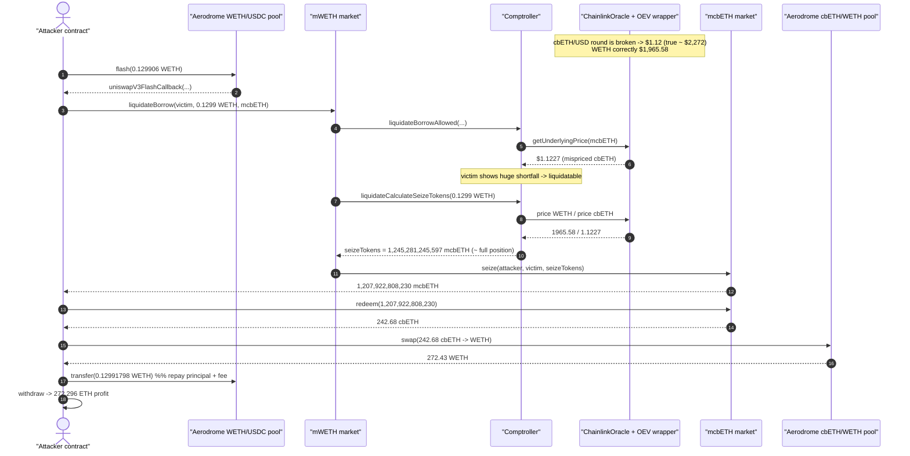
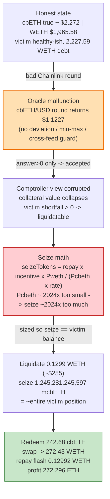
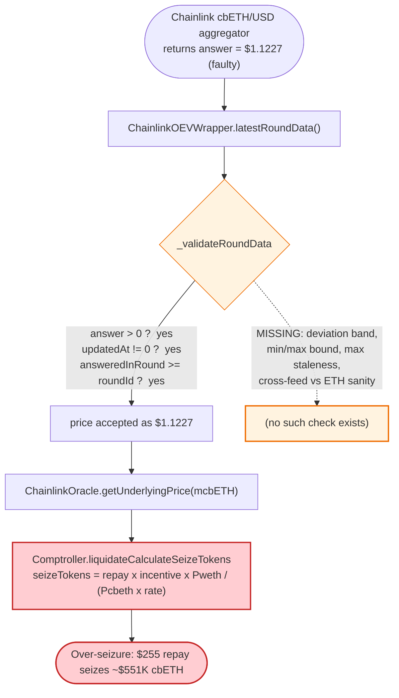

# Moonwell cbETH Oracle Incident — Mispriced Collateral Enables Near-Free Liquidation

> One faulty Chainlink `cbETH/USD` round priced cbETH at **$1.12** instead of **~$2,272**. Moonwell's
> `ChainlinkOracle` had no deviation/sanity bound, so every cbETH-collateralised position instantly showed
> a huge "shortfall." A liquidator repaid **0.1299 WETH (~$255)** and legally seized **242.68 cbETH
> (~$551K of value)** — and the same mechanic produced ~$1.78M of protocol-wide bad debt.

> **Reproduction:** the PoC compiles & runs in an isolated Foundry project at
> [this project folder](.). Full verbose trace: [output.txt](output.txt).
> Verified vulnerable source: [ChainlinkOracle](sources/ChainlinkOracle_EC942b/src_core_Oracles_ChainlinkOracle.sol),
> [ChainlinkOEVWrapper](sources/ChainlinkOEVWrapper_67996D/src_oracles_ChainlinkOEVWrapper.sol),
> [Comptroller seize math](sources/Comptroller_73D8A3/src_core_Comptroller.sol#L629-L656).

---

## Key info

| | |
|---|---|
| **Loss** | ~**$1.78M** protocol-wide bad debt (cbETH $1.03M, WETH $479K, USDC $233K, EURC, cbBTC, cbXRP, DAI, USDS, AERO, MORPHO, wstETH). This single PoC tx nets **272.296 WETH** profit. |
| **Vulnerable contract** | Moonwell `ChainlinkOracle` — [`0xEC942bE8A8114bFD0396A5052c36027f2cA6a9d0`](https://basescan.org/address/0xEC942bE8A8114bFD0396A5052c36027f2cA6a9d0#code) (Base). The cbETH feed routes through `ChainlinkOEVWrapper` [`0x67996D1ff7a3711a91E2839d1059Fcb950C0495D`](https://basescan.org/address/0x67996D1ff7a3711a91E2839d1059Fcb950C0495D#code). |
| **Victim (liquidated borrower)** | `0x4C1A699166CD60473040d0618C47Ad82251B9D0f` — held cbETH collateral in `mcbETH`, borrowed 2,227.59 WETH from `mWETH`. |
| **Markets involved** | `mWETH` [`0x628ff693426583D9a7FB391E54366292F509D457`](https://basescan.org/address/0x628ff693426583D9a7FB391E54366292F509D457), `mcbETH` [`0x3bf93770f2d4a794c3d9EBEfBAeBAE2a8f09A5E5`](https://basescan.org/address/0x3bf93770f2d4a794c3d9EBEfBAeBAE2a8f09A5E5), Comptroller/Unitroller [`0xfBb21d0380beE3312B33c4353c8936a0F13EF26C`](https://basescan.org/address/0xfBb21d0380beE3312B33c4353c8936a0F13EF26C) |
| **Attacker EOA** | `0x0100ab3021dE6e00c39BE16424472164c281C308` |
| **Attacker contract** | `0x083CfA7FD187Be983ce5D519fE7ae78357779998` (PoC redeploys it; in-trace `0x5615dEB7…23b72f`) |
| **Funding pools** | Aerodrome CL WETH/USDC pool `0x861A2922bE165a5Bd41b1E482B49216b465e1B5F` (flash loan), Aerodrome CL cbETH/WETH pool `0x47cA96Ea59C13F72745928887f84C9F52C3D7348` (cbETH→WETH exit swap) |
| **Attack tx** | `0x2f4ff77c77ce2a52c80fcd59a4cac4b05f4285afe1f3b92118b0a004a325953c` |
| **Chain / block / date** | Base / ≈ block **42,194,664** (block ts `1771178675`) / **2026-02-15** |
| **Compiler** | Oracle `v0.8.19`, OEV wrapper / mTokens compiled with their own pragmas; PoC `^0.8.23` (`evm_version=cancun`) |
| **Bug class** | Oracle integrity failure — unbounded/unchecked Chainlink answer feeds liquidation math (no deviation/min-max sanity bound) |
| **References** | Post-mortem [MIP-X43 cbETH oracle incident summary](https://forum.moonwell.fi/t/mip-x43-cbeth-oracle-incident-summary/2068) · [Recovery plan](https://forum.moonwell.fi/t/recovery-plan-cbeth-incident-and-moonwell-apollo-onboarding/2084) · [pashov](https://x.com/pashov/status/2023872510077616223) |

---

## TL;DR

Moonwell (a Compound-v2 fork on Base) values collateral and debt for liquidations through its
`ChainlinkOracle`. For cbETH that oracle reads a `ChainlinkOEVWrapper`, which in turn reads the
Chainlink `cbETH/USD` aggregator. During this incident the underlying aggregator returned a grossly
wrong answer — **`1122662744874806300` = $1.1227** — while WETH was correctly **$1,965.58**. The real
cbETH price was ≈ $2,272 (cbETH trades at a small premium to ETH).

Moonwell's oracle has **no sanity bound**: it only requires `answer > 0`. So the $1.12 price flowed
straight into the Comptroller's seize formula
([`liquidateCalculateSeizeTokens`](sources/Comptroller_73D8A3/src_core_Comptroller.sol#L629-L656)):

```
seizeTokens = repayAmount × (liquidationIncentive × priceBorrowed) / (priceCollateral × exchangeRate)
```

With `priceCollateral` (cbETH) ≈ **2,024× too small**, the seize amount is ≈ 2,024× too large. Every
cbETH-collateralised borrower also instantly showed a massive account "shortfall," making them
liquidatable. The attacker:

1. Flash-borrows **0.129906 WETH** from an Aerodrome CL pool.
2. Calls `mWETH.liquidateBorrow(victim, 0.1299 WETH, mcbETH)` — repaying ~$255 of the victim's
   2,227.59 WETH debt and **seizing essentially the victim's entire cbETH position** (`1,245,281,245,597`
   mcbETH).
3. Redeems the seized mcbETH for **242.68 cbETH**.
4. Swaps 242.68 cbETH → **272.43 WETH** on Aerodrome.
5. Repays the flash loan (0.12991798 WETH) and keeps **272.296 WETH** (≈ $535K at the trace's true
   ~$1,965/ETH WETH price).

The repay was sized so that the seized collateral (`1,245,281,245,597`) was just under the victim's
mcbETH balance (`1,245,405,786,250`) — i.e. drain the position to the wei.

---

## Background — what Moonwell is

Moonwell is an over-collateralised lending market on Base, forked from Compound v2 / Benqi:

- Users supply assets to `mToken` markets (`mWETH`, `mcbETH`, `mUSDC`, …) and may borrow against them.
- The `Comptroller` (behind the `Unitroller` proxy) enforces collateral factors, decides who is
  liquidatable (`getAccountLiquidity`), and computes how much collateral a liquidator seizes
  (`liquidateCalculateSeizeTokens`).
- All USD pricing comes from a single `PriceOracle` — here the `ChainlinkOracle` at
  `0xEC942b…`. For each market it looks up a Chainlink feed by the underlying token's **symbol string**
  (e.g. `"cbETH"`).
- For some assets the configured "feed" is not a raw Chainlink aggregator but a **`ChainlinkOEVWrapper`** —
  Moonwell's mechanism to capture Oracle-Extractable-Value: it deliberately serves the *previous*
  round's price unless a liquidator has paid to "unlock" the fresh round.

The liquidation path is the standard Compound flow: `mWETH.liquidateBorrow` →
[`liquidateBorrowFresh`](sources/ChainlinkOracle_EC942b/src_core_MToken.sol#L968-L1037) →
`Comptroller.liquidateBorrowAllowed` (checks shortfall + close factor) →
`Comptroller.liquidateCalculateSeizeTokens` (computes seized collateral) → `mcbETH.seize`.

---

## The vulnerable code

### 1. The oracle accepts any positive answer — no deviation / sanity bound

[`ChainlinkOracle.getChainlinkPrice`](sources/ChainlinkOracle_EC942b/src_core_Oracles_ChainlinkOracle.sol#L97-L113):

```solidity
function getChainlinkPrice(AggregatorV3Interface feed) internal view returns (uint256) {
    (, int256 answer, , uint256 updatedAt, ) = AggregatorV3Interface(feed).latestRoundData();
    require(answer > 0, "Chainlink price cannot be lower than 0");   // ← only guard
    require(updatedAt != 0, "Round is in incompleted state");
    uint256 decimalDelta = uint256(18).sub(feed.decimals());
    if (decimalDelta > 0) { return uint256(answer).mul(10 ** decimalDelta); }
    else { return uint256(answer); }
}
```

There is **no minimum/maximum price band, no deviation-vs-previous-round check, no
cross-feed/exchange-rate sanity check, and no max-staleness window** (it never compares `updatedAt` to
`block.timestamp`). A `$1.12` cbETH answer — a ~99.95% drop that no correct cbETH feed could ever
produce — is accepted as a valid collateral price.

### 2. The OEV wrapper has the same weak validation

[`ChainlinkOEVWrapper._validateRoundData`](sources/ChainlinkOEVWrapper_67996D/src_oracles_ChainlinkOEVWrapper.sol#L519-L528):

```solidity
function _validateRoundData(uint80 roundId, int256 answer, uint256 updatedAt, uint80 answeredInRound)
    internal pure {
    require(answer > 0, "Chainlink price cannot be lower or equal to 0");
    require(updatedAt != 0, "Round is in incompleted state");
    require(answeredInRound >= roundId, "Stale price");
}
```

Same story — sign, completeness, and round monotonicity only. The wrapper additionally [serves the
*previous* round unless the current round was paid for](sources/ChainlinkOEVWrapper_67996D/src_oracles_ChainlinkOEVWrapper.sol#L209-L256),
which can extend the lifetime of a bad round but adds no value sanity-check.

In the trace the wrapper's `latestRoundData()` returns the underlying aggregator answer
`1122662744874806300` ($1.1227) at `updatedAt = 1771164149` — see
[output.txt:2164-2180](output.txt#L2164-L2180).

### 3. The seize formula divides by the (mispriced) collateral price

[`Comptroller.liquidateCalculateSeizeTokens`](sources/Comptroller_73D8A3/src_core_Comptroller.sol#L629-L656):

```solidity
uint priceBorrowedMantissa   = oracle.getUnderlyingPrice(MToken(mTokenBorrowed));   // WETH = 1965.58e18
uint priceCollateralMantissa = oracle.getUnderlyingPrice(MToken(mTokenCollateral)); // cbETH = 1.1227e18  ⚠️
...
numerator   = liquidationIncentiveMantissa × priceBorrowedMantissa;
denominator = priceCollateralMantissa × exchangeRateMantissa;       // ⚠️ ~2000× too small
ratio       = numerator / denominator;
seizeTokens = ratio × actualRepayAmount;                            // ⚠️ ~2000× too many cbETH seized
```

Because `priceCollateral` is artificially ≈ 2,024× too small, the liquidator seizes ≈ 2,024× the
collateral they should for a given repay — i.e. they buy cbETH for ~1/2000th of its real value.

### 4. The liquidation gate also keys off the same bad price

[`Comptroller.liquidateBorrowAllowed`](sources/Comptroller_73D8A3/src_core_Comptroller.sol#L394-L424) only
requires `shortfall > 0`. With cbETH collateral valued at $1.12, the victim's account liquidity collapses
(borrow ≈ 2,227.59 WETH × $1,965 ≈ $4.38M vs collateral valued at ~$0), so they are reported as deeply
underwater and freely liquidatable.

---

## Root cause — why it was possible

The proximate trigger was a **bad Chainlink `cbETH/USD` round** (~$1.12). The reason that off-chain
glitch became a $1.78M on-chain loss is a **missing oracle integrity layer** in Moonwell:

1. **No price-deviation / circuit-breaker guard.** A correct lending oracle should reject a price that
   moves >X% from the previous accepted value, or that falls outside a hard min/max band, and should
   pause/fall-back rather than feed it to liquidations. Moonwell's oracle only checks `answer > 0`.
2. **No cross-feed sanity check for an ETH-correlated LST.** cbETH is Coinbase staked-ETH; it can only
   trade in a narrow band around ETH (the trace's WETH price was a healthy $1,965). A cbETH price of
   $1.12 vs an ETH price of $1,965 is physically impossible and trivially detectable, yet nothing
   compared them.
3. **No max-staleness window.** Neither the oracle nor the OEV wrapper checks `updatedAt` against
   `block.timestamp`; the OEV wrapper can even deliberately serve a stale prior round.
4. **Liquidation math is purely price-ratio driven.** `seizeTokens ∝ 1 / priceCollateral`, so a
   collateral price error is amplified linearly into over-seizure. There is no per-liquidation cap on
   the *fraction of an account's collateral* that one undersized repay can take.

Net effect: a single bad oracle round is sufficient to (a) mark every cbETH borrower as liquidatable and
(b) let anyone repay dust and walk away with the full collateral — at ~1/2000th of fair value.

---

## Preconditions

- The Chainlink `cbETH/USD` feed (via the OEV wrapper) is returning a grossly wrong low answer (here
  $1.12). This was a real off-chain oracle malfunction during the incident.
- A target account holds cbETH collateral in `mcbETH` and has any WETH (or other) debt — at the bad
  price it is reported with `shortfall > 0` and is liquidatable. The PoC asserts the exact victim debt
  `mWETH.borrowBalanceCurrent(victim) == 2_227_585_181_466_568_852_543` before proceeding
  ([Moonwell_exp.sol:88](test/Moonwell_exp.sol#L88)).
- A small amount of WETH to perform the liquidation repayment — fully flash-loanable and repaid in the
  same transaction, so **zero capital at risk** for the attacker.

---

## Attack walkthrough (ground-truth numbers from the trace)

All values are taken directly from [output.txt](output.txt). cbETH/mcbETH and WETH are 18-decimal;
mcbETH (the receipt token) is 8-decimal.

| # | Step | Concrete value (from trace) | Source |
|---|------|------------------------------|--------|
| 0 | Victim debt check | `borrowBalanceCurrent(victim) = 2,227,585,181,466,568,852,543` = **2,227.59 WETH** | [L1580-L1583](output.txt#L1580) |
| 1 | Flash-borrow WETH from Aerodrome WETH/USDC CL pool | `flash(amount0 = 129,906,284,941,311,087)` = **0.129906 WETH** | [L1584](output.txt#L1584) |
| 2 | Oracle reads cbETH price during `liquidateBorrowAllowed` | cbETH = **`1,122,662,744,874,806,300` ($1.1227)** | [L1655-L1671](output.txt#L1655) |
| 3 | Oracle reads WETH price | WETH = **`1,965,580,189,520,000,000,000` ($1,965.58)** | [L1716-L1737](output.txt#L1737) |
| 4 | Approve + `mWETH.liquidateBorrow(victim, 0.1299 WETH, mcbETH)` | repayAmount = **0.129906 WETH** | [L1623-L1628](output.txt#L1623) |
| 5 | Seize math (`liquidateCalculateSeizeTokens`) re-reads WETH $1,965.58 / cbETH $1.1227 | seizeTokens = **`1,245,281,245,597`** mcbETH (≈ victim's full `1,245,405,786,250`) | [L2131-L2199](output.txt#L2131) |
| 6 | `mcbETH.seize` transfers collateral to attacker (after ~3% protocol seize share) | attacker mcbETH = **`1,207,922,808,230`** | [L2253, L2273](output.txt#L2253) |
| 7 | `mcbETH.redeem(1,207,922,808,230)` → underlying cbETH | redeemAmount = **`242,681,146,382,025,215,739`** = **242.68 cbETH** | [L2315](output.txt#L2315) |
| 8 | Swap 242.68 cbETH → WETH on Aerodrome cbETH/WETH CL pool | WETH out = **`272,426,378,140,706,009,111`** = **272.43 WETH** | [L2359-L2383](output.txt#L2359) |
| 9 | Repay flash loan (principal + fee) | `129,906,284,941,311,087 + 11,691,565,644,718` = **`129,917,976,506,955,805`** = 0.12991798 WETH | [L2390, L2422](output.txt#L2390) |
| 10 | Unwrap WETH → ETH to attacker | **`272,296,460,164,199,053,306`** = **272.296 ETH** | [L2397-L2405](output.txt#L2397) |

**Why the numbers line up:** at the *correct* prices the repay of 0.1299 WETH (~$255) should seize roughly
$255 × 1.10 incentive ÷ $2,272 ≈ 0.123 cbETH. At the *bad* cbETH price ($1.12) the same repay seizes
≈ 0.123 × ($2,272 / $1.12) ≈ **250 cbETH** — matching the 242.68 cbETH actually redeemed (the small gap is
the mcbETH→cbETH exchange rate `2.009e26` and the protocol's ~3% seize share). The attacker turns ~$255 of
WETH into ~$551K of cbETH.

### Profit / loss accounting (WETH terms)

| Direction | Amount (WETH) | Note |
|---|---:|---|
| Flash-loan principal in | 0.129906 | borrowed from Aerodrome, repaid same tx |
| Repaid to `mWETH` (liquidation) | 0.129906 | covers ~0.0058% of the victim's 2,227.59 WETH debt |
| cbETH seized → redeemed | 242.68 cbETH | ≈ $551K fair value, "bought" for ~$255 |
| cbETH sold → WETH received | +272.43 | via Aerodrome cbETH/WETH pool |
| Flash-loan repay (principal + fee) | −0.12992 | fee = 11,691,565,644,718 wei |
| **Net attacker profit** | **+272.296 WETH (≈ $535K)** | trace `Attacker After exploit ETH Balance = 272.296` |

This single liquidation is one slice of the broader incident; across all cbETH-collateralised positions
the protocol absorbed **~$1.78M of bad debt** (per the PoC header and MIP-X43).

---

## Diagrams

### Sequence of the attack



### Price / seize-math state evolution



### Where the integrity check is missing



---

## Why each magic number

- **`borrowBalanceCurrent(victim) == 2,227,585,181,466,568,852,543`** — the PoC asserts the exact victim
  debt so the run is pinned to the on-chain state at the fork tx.
- **flash `129,906,284,941,311,087` WETH (0.129906)** — sized so that the resulting `seizeTokens`
  (`1,245,281,245,597`) is just below the victim's mcbETH balance (`1,245,405,786,250`); i.e. repay the
  largest amount that still seizes ≤ 100% of the position (and stays under the close-factor `maxClose`),
  draining it to the wei.
- **`mcbETH.balanceOf(this) == 1,207,922,808,230`** — the seized amount net of the protocol's seize share
  (the `seizeTokens` minus the `37,358,437,367` added to mcbETH reserves at [L2254-L2255](output.txt#L2254)).
- **swap `sqrtPriceLimitX96 = 4_295_128_740`** — the Uniswap-V3/Aerodrome min sqrt-price limit
  (`MIN_SQRT_RATIO + 1`) for a `zeroForOne` (cbETH→WETH) swap, i.e. "accept any price."
- **`amount0Delta == 242_681_146_382_025_215_739`** asserted in `uniswapV3SwapCallback` — the exact cbETH
  the pool pulls (242.68 cbETH), confirming the redeem produced precisely that.
- **repay `amount + amount0Delta == 129_917_976_506_955_805`** — flash principal `0.129906` + fee
  `11,691,565,644,718` wei.

---

## Remediation

1. **Add a price-integrity layer to the oracle.** Reject any feed answer that (a) deviates more than a
   configured percentage from the last accepted value, or (b) falls outside a hard min/max band per
   asset. On violation, revert (pausing liquidations for that market) or fall back to a secondary
   source — never silently accept it.
2. **Enforce staleness.** Require `block.timestamp - updatedAt <= maxAge` in both `ChainlinkOracle` and
   `ChainlinkOEVWrapper`; the current code never compares `updatedAt` to `block.timestamp`, and the OEV
   wrapper can deliberately serve a stale prior round.
3. **Cross-check correlated assets.** For ETH liquid-staking tokens (cbETH, wstETH, rETH), validate the
   reported price against the ETH price and the token's known exchange-rate band; a cbETH/ETH ratio of
   ~0.0006 (here) is physically impossible and should fail closed.
4. **Cap per-liquidation collateral seizure.** Bound the fraction of an account's collateral one
   liquidation can take so that a single mispriced round cannot translate a dust repay into full-position
   seizure; combine with a sane close factor.
5. **Use a robust multi-oracle / OEV design.** Aggregate Chainlink with at least one independent source
   and require agreement within tolerance before a price is usable by the Comptroller.

---

## How to reproduce

The PoC was extracted into a standalone Foundry project (the umbrella DeFiHackLabs repo has other PoCs
that don't compile under a whole-project `forge build`):

```bash
_shared/run_poc.sh 2026-02-Moonwell_exp -vvvvv
```

- RPC: a **Base archive** endpoint is required (the PoC forks at the exact attack tx). The configured
  `base = https://base-mainnet.public.blastapi.io` serves the historical state; resolving the fork at
  the transaction takes **~14 minutes** in this run, so allow a generous timeout.
- Result: `[PASS] testExploit()` with `Attacker After exploit ETH Balance: 272.296…`.

Expected tail:

```
Ran 1 test for test/Moonwell_exp.sol:Moonwell_exp
[PASS] testExploit() (gas: 1980812)
  Attacker Before exploit ETH Balance: 0.000000000000000000
  Attacker After exploit ETH Balance: 272.296460164199053306
Suite result: ok. 1 passed; 0 failed; 0 skipped; finished in 857.14s
```

---

*Sources downloaded to [`sources/`](sources/): `ChainlinkOracle` (vulnerable), `ChainlinkOEVWrapper`
(cbETH feed), `Comptroller` + `Unitroller` (seize math), `mWETH` / `mcbETH` delegators, and the cbETH
proxy. Full trace in [`output.txt`](output.txt); PoC in [`test/Moonwell_exp.sol`](test/Moonwell_exp.sol).*
