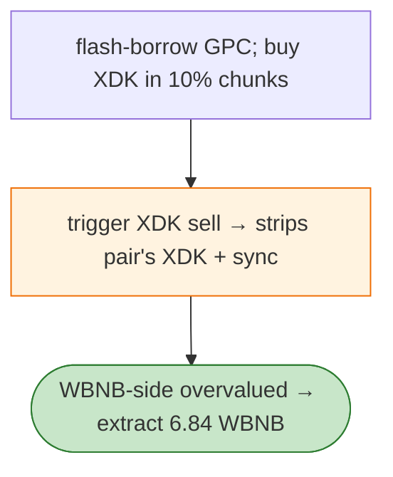

# XDK Recycle Exploit — `sell` Moves XDK Out of the Pair + `sync` Abuse

> **Reproduction:** the PoC compiles & runs in an isolated Foundry project at
> [this project folder](.). Full verbose trace: [output.txt](output.txt).
> Verified vulnerable source: [XDK](sources/XDK_02739B), [AMMToken](sources/AMMToken_D3c304).

---

## Key info

| | |
|---|---|
| **Loss** | 6.84 WBNB; tx `0x4848bae0…` |
| **Vulnerable contract** | XDK token `0x02739be6…` (BSC) |
| **Chain / block / date** | BSC / Feb 2026 |
| **Bug class** | Token `sell`-path — XDK's sell path moves XDK **directly out of its Pancake pair** and `sync()`s, so buying in chunks + triggering sell harvests WBNB. |

---

## TL;DR

Per the embedded analysis: XDK's sell path moves XDK directly out of its Pancake pair and syncs the
pair. The attacker flash-borrows GPC, buys XDK in 10% reserve chunks, repeatedly triggers the XDK sell
that strips the pair's XDK and `sync()`s (WBNB-side unchanged), then extracts WBNB.

---

## Root cause

A **token sell path that mutates the AMM pair's reserves out-of-band** (removes the pair's XDK and
re-syncs), breakable by an attacker who positions before the sell.

---

## Diagrams



---

## Remediation

1. The token's sell path must not mutate the AMM pair's reserves; route sells through the router only.
2. Fee-aware AMM; `k` on received amounts.

---

## How to reproduce

```bash
_shared/run_poc.sh 2026-02-XDKRecycle_exp -vvvvv
```

- RPC: BSC archive. Result: `[PASS]` — 6.84 WBNB extracted (~3 min).

---

*Reference: XDK sell-path `sync` abuse, BSC, Feb 2026 (6.84 WBNB).*
