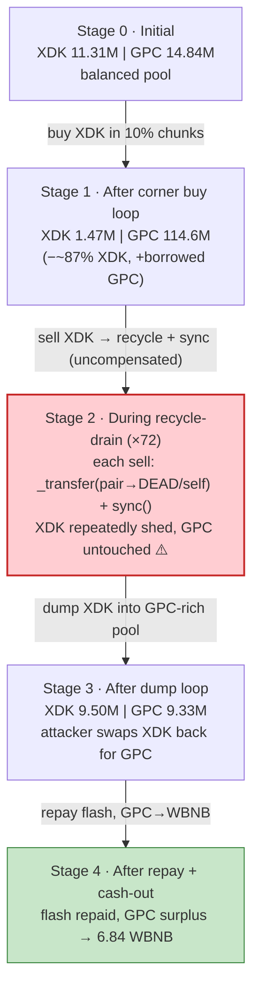
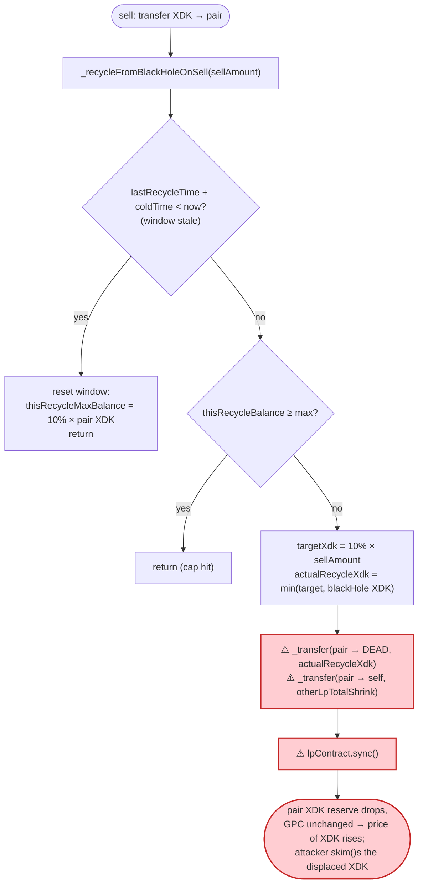
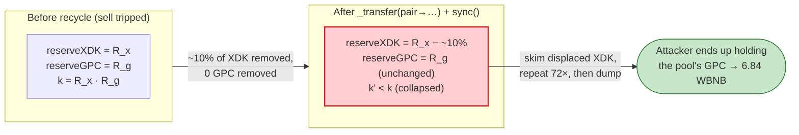

# XDK Exploit — Sell-Path "Recycle" Removes XDK from the Live Pair and `sync()`s

> **Reproduction:** the PoC compiles & runs in an isolated Foundry project at
> [this project folder](.) (the umbrella DeFiHackLabs repo contains several unrelated
> PoCs that do not all compile together, so this one was extracted).
> Full verbose trace: [output.txt](output.txt).
> Verified vulnerable source: [contracts_XDK.sol](sources/XDK_02739B/contracts_XDK.sol).

---

## Key info

| | |
|---|---|
| **Loss** | ~6.84 WBNB — **6.840316534082275362 WBNB** (~$3–4K) forwarded to the attacker EOA, sourced from the manipulated XDK/GPC liquidity |
| **Vulnerable contract** | `XDK` token — [`0x02739BE625f7A1Cb196F42dceEe630C394DD9FAA`](https://bscscan.com/address/0x02739BE625f7A1Cb196F42dceEe630C394DD9FAA#code) |
| **Victim pool** | XDK/GPC PancakeV2 pair — `0xe3cBa5C0A8efAeDce84751aF2EFDdCf071D311a9` (XDK's configured `uniswapV2Pair`) |
| **Flash-loan source** | WBNB/GPC PancakeV2 pair — `0x12dAbFCe08eF59c24cdee6c488E05179Fb8D64D9` |
| **Attacker EOA** | `0xB180eF1bF6FB3e9A0b5dB4460e4DB804e946cC8a` |
| **Attacker contract** | `0x1e7e4e41defde022e78add6f6e406a7520b63c70` (PoC redeploys the same logic at `0xcf3C8c908D19E45b4abF8A8323fbA45a992d6F8b`) |
| **Attack tx** | [`0x4848bae0fe22f781a94b4613596e7640f70d443db03b6a18fdaffcd30de718d0`](https://bscscan.com/tx/0x4848bae0fe22f781a94b4613596e7640f70d443db03b6a18fdaffcd30de718d0) |
| **Chain / block / date** | BSC / fork pinned at **81,556,795** / Feb 2026 |
| **Compiler** | Solidity v0.8.21+commit.d9974bed, optimizer **enabled, 200 runs** (per `sources/XDK_02739B/_meta.json`); GPC/`AMMToken` impl v0.8.26, optimizer disabled |
| **Bug class** | A token sell hook (`_recycleFromBlackHoleOnSell`) that moves the token **directly out of its own live AMM pair** via `_transfer(uniswapV2Pair, …)` and then calls `pair.sync()`, breaking the constant-product invariant `x·y = k` in favour of whoever holds the token |

---

## TL;DR

1. `XDK` is a fee-on-transfer "deflationary + dividend" token on BSC. Its `uniswapV2Pair` is the live
   **XDK/GPC** PancakeSwap pair (GPC, ticker for the `AMMToken` contract, is the quote asset). Every
   buy/sell routed through that pair runs through `XDK._transfer` →
   `handlerTranscation` ([contracts_XDK.sol:202-281](sources/XDK_02739B/contracts_XDK.sol#L202-L281)).

2. On a **sell**, the contract calls `_recycleFromBlackHoleOnSell(transferAmount)`
   ([contracts_XDK.sol:400-467](sources/XDK_02739B/contracts_XDK.sol#L400-L467)). That routine is
   meant to "recycle" XDK from the dead-wallet's LP share, but it is implemented as two raw
   `super._transfer(uniswapV2Pair, …)` calls — `_transfer(pair → DEAD_WALLET, actualRecycleXdk)` and
   `_transfer(pair → address(this), otherLpTotalShrink)` — followed by `lpContract.sync()`. This is an
   **un-compensated one-sided removal of XDK from the pair's reserve**: ~10% of the pool's XDK is
   deleted/moved out, no GPC moves, and `sync()` forces the pair to accept the smaller XDK reserve.

3. The attacker flash-borrows **99,789,278,778,620,420,792,392,638 GPC (~9.98e25, ≈99% of the WBNB/GPC
   pair's GPC reserve)** via a `pancakeCall` flash swap from the WBNB/GPC pair
   ([output.txt:1614](output.txt)), then buys XDK out of the XDK/GPC pair in ~10% reserve chunks
   (`buyXdkWithGpcUntilSpent`, 16 chunk swaps).

4. The attacker then repeatedly **sells tiny XDK amounts back into the pair** (`sellXdkIntoRecycleWindow`),
   each sell tripping `_recycleFromBlackHoleOnSell` so the pair sheds ~10% of its XDK and `sync()`s, and
   using `pair.skim()` to scoop the XDK that the recycle pushed out. **72 `SellRecycledFromBlackHole`
   events** fire ([output.txt:2843](output.txt) onward), driving the pair's XDK reserve down while its GPC
   reserve stays loaded with the attacker's borrowed capital.

5. Finally the attacker dumps its accumulated XDK back into the now XDK-depleted / GPC-rich pool
   (`sellRemainingXdkForGpc`), pulling GPC out ([output.txt:21038](output.txt)), repays the flash swap
   `100,039,377,221,674,607,310,669,312 GPC` ([output.txt:21054](output.txt)), and converts the
   **5,144,739,567,228,948,814,053,975 GPC (~5.14e24)** surplus to **6.840316534082275362 WBNB**
   ([output.txt:21066](output.txt)), forwarding it to the attacker EOA ([output.txt:21108](output.txt)).

Net result asserted by the PoC: attacker WBNB grows from `1e11` wei (0.0000001 WBNB) to
**6.840316634082275362 WBNB** ([output.txt:21117](output.txt)), i.e. profit > 6 WBNB.

---

## Background — what XDK does

`XDK` ([source](sources/XDK_02739B/contracts_XDK.sol)) is a fee-on-transfer ERC20 with three bolted-on
mechanisms, all triggered inside `_transfer`/`handlerTranscation`:

- **3% trade fee** — every buy/sell pays `TOTAL_TRADE_FEE = 30` / 1000 = 3%, split 1% burn / 1% "black
  hole" LP / 1% reward pool ([contracts_XDK.sol:211-263](sources/XDK_02739B/contracts_XDK.sol#L211-L263)).
- **LP-holder dividends** — accumulated reward-pool XDK is paid out pro-rata to LP holders via
  `distributeRewardsBatch` ([contracts_XDK.sol:322-397](sources/XDK_02739B/contracts_XDK.sol#L322-L397)).
- **"Black-hole recycle on sell"** — `_recycleFromBlackHoleOnSell`
  ([contracts_XDK.sol:400-467](sources/XDK_02739B/contracts_XDK.sol#L400-L467)) tries to claw XDK
  attributable to the dead-wallet's LP position back out of the pair on each sell, capped per 24h window.

The quote token is **GPC** (`AMMToken`, `0xD3c304697f63B279cd314F92c19cDBE5E5b1631A`), and XDK's
`uniswapV2Pair` is created in `BaseGpc`'s constructor against `_GPC`
([contracts_BaseGpc.sol:31](sources/XDK_02739B/contracts_BaseGpc.sol#L31)). There is no separate
WBNB pool for XDK that holds liquidity; WBNB is reached only by routing GPC → WBNB through the
separate WBNB/GPC pair.

On-chain parameters at the fork block (read from the trace):

| Parameter | Value | Source |
|---|---|---|
| `recycleColdTime` | 86,400 s = **1 day** | [output.txt:1623](output.txt) |
| `lastRecycleTime` | 1,771,159,602 | [output.txt:1625](output.txt) |
| `block.timestamp` (tx) | 1,771,246,282 (`> lastRecycleTime + recycleColdTime` → window stale) | [output.txt:1675](output.txt) |
| `SELL_RECYCLE_RATE` | 100 / 1000 = **10% of each sell amount** | [contracts_XDK.sol:27](sources/XDK_02739B/contracts_XDK.sol#L27) |
| `MAX_RECYCLE_RATE` | 100 / 1000 = **10% of pair XDK per 24h window** | [contracts_XDK.sol:28](sources/XDK_02739B/contracts_XDK.sol#L28) |
| `thisRecycleMaxBalance` (after reset) | 1,131,191,091,024,352,106,861,578 (~1.131e24 = 10% of pair XDK) | [output.txt:2722](output.txt) |
| XDK/GPC pair XDK reserve (initial) | 11,311,911,655,724,807,549,926,752 (~1.131e25 XDK) | [output.txt:1633](output.txt) |
| XDK/GPC pair GPC reserve (initial) | 14,838,228,195,602,116,419,462,362 (~1.483e25 GPC) | [output.txt:1633](output.txt) |
| WBNB/GPC pair WBNB reserve | 141,527,052,082,842,095,624 (~141.53 WBNB) | [output.txt:1612](output.txt) |
| WBNB/GPC pair GPC reserve | 100,797,251,291,535,778,578,174,382 (~1.008e26 GPC) | [output.txt:1612](output.txt) |

The whole game is that `_recycleFromBlackHoleOnSell` treats `uniswapV2Pair` as a balance it is free to
debit, and re-syncs the pair afterward — exactly the "burn/move from the pool then sync" anti-pattern.

---

## The vulnerable code

### 1. The sell path calls the recycle hook

```solidity
if (isSell) {
    _processPendingFees();

    if (currentBurn + burnAmount <= maxBurnFee && isMainPair(recipient)) {
        _recycleFromBlackHoleOnSell(transferAmount);
    }
    if (rewardPoolBalance > 0) {
        distributeRewardsBatch();
    }
}
```
([contracts_XDK.sol:268-278](sources/XDK_02739B/contracts_XDK.sol#L268-L278))

Any transfer whose `recipient` is the main pair is classified as a sell
([contracts_XDK.sol:180-188](sources/XDK_02739B/contracts_XDK.sol#L180-L188)), so an attacker can drive
this path at will simply by `transfer`-ing XDK to the pair (the classic "manual swap" pattern that
bypasses the router's slippage checks).

### 2. The recycle removes XDK *out of the live pair* and `sync()`s

```solidity
function _recycleFromBlackHoleOnSell(uint256 sellAmount) internal virtual {
    if (lastRecycleTime + recycleColdTime < block.timestamp) {
        lastRecycleTime = block.timestamp;
        thisRecycleMaxBalance =
            (balanceOf(uniswapV2Pair) * MAX_RECYCLE_RATE) / 1000;   // 10% of pair XDK
        thisRecycleBalance = 0;
        return;                                                     // first stale sell only resets
    }
    if (thisRecycleBalance >= thisRecycleMaxBalance) { return; }    // per-window cap

    uint256 targetXdk = sellAmount * SELL_RECYCLE_RATE / 1000;      // 10% of this sell

    IPancakePair lpContract = IPancakePair(uniswapV2Pair);
    uint256 blackHoleLp     = lpContract.balanceOf(DEAD_WALLET);
    uint256 totalLpSupply   = lpContract.totalSupply();
    uint256 reserveXdk      = balanceOf(uniswapV2Pair);            // XDK held by the pair
    // ... boundary checks ...

    uint256 xdkInBlackHoleLp = (blackHoleLp * reserveXdk) / totalLpSupply;
    uint256 actualRecycleXdk = targetXdk > xdkInBlackHoleLp ? xdkInBlackHoleLp : targetXdk;
    // ... boundary checks ...

    uint256 otherLpTotalShrink =
        (actualRecycleXdk * (reserveXdk - xdkInBlackHoleLp)) / reserveXdk;
    // ...
    thisRecycleBalance = thisRecycleBalance + actualRecycleXdk + otherLpTotalShrink;

    super._transfer(uniswapV2Pair, DEAD_WALLET, actualRecycleXdk);     // ⚠️ debit pair's XDK reserve
    super._transfer(uniswapV2Pair, address(this), otherLpTotalShrink); // ⚠️ debit pair's XDK reserve
    rewardPoolBalance += otherLpTotalShrink;
    success = true;
    lpContract.sync();                                                 // ⚠️ force pair to accept new XDK reserve
    emit SellRecycledFromBlackHole(sellAmount, actualRecycleXdk, success);
}
```
([contracts_XDK.sol:400-467](sources/XDK_02739B/contracts_XDK.sol#L400-L467))

The source even admits the implementation is a shortcut. The Chinese comments at
[contracts_XDK.sol:451-456](sources/XDK_02739B/contracts_XDK.sol#L451-L456) translate to: *"In a real
scenario you must first move the black-hole LP into the contract, remove liquidity to obtain XDK, then
burn it. Here it is simplified to transferring XDK directly out of the LP contract to the dead
address."* That "simplification" is the bug: it deletes one side of the AMM reserve with no
counterparty outflow.

### 3. The sell-classification + manual-swap surface

```solidity
if (isPair(recipient)) {           // transfer to the pair == "sell"
    isSell = true;
    user = sender;
    pairAddress = recipient;
} else if (isPair(sender)) {       // transfer from the pair == "buy"
    isBuy = true;
    user = recipient;
    pairAddress = sender;
}
```
([contracts_XDK.sol:180-188](sources/XDK_02739B/contracts_XDK.sol#L180-L188))

Because a plain `transfer(pair, amount)` is classified as a sell, the attacker drives the recycle hook
**without ever calling the router**, then uses the pair's own `swap()`/`skim()` primitives to collect
the displaced reserves — the trace shows 56 `skim()` calls ([output.txt:1852](output.txt) onward).

---

## Root cause — why it was possible

A Uniswap-V2/PancakeSwap pair prices assets purely from its cached reserves and only enforces `x·y ≥ k`
inside `swap()`. `sync()` exists to force the cached reserves to equal the actual token balances — it
*trusts* that balances only change through mint/burn/swap. `_recycleFromBlackHoleOnSell` violates that
trust:

> It calls `super._transfer(uniswapV2Pair, …)` to move XDK **out of the pair's balance**, then calls
> `pair.sync()` to tell the pair "your XDK reserve is now this much smaller." No GPC ever leaves the
> pair. The product `k` drops and the marginal price of XDK rises — value flows to whoever holds XDK.

Concretely, four design decisions compose into the loss:

1. **The recycle debits the live pair, not a treasury.** `uniswapV2Pair` is the real PancakeSwap pair.
   `_transfer(uniswapV2Pair, DEAD_WALLET, …)` + `_transfer(uniswapV2Pair, address(this), …)` is an
   un-compensated one-sided reserve removal — functionally identical to "burn from the pool then sync".
2. **The trigger is attacker-controlled.** Any `transfer` to the pair is a "sell", so the attacker
   decides exactly *when* and *how often* the reserve-shrinking recycle fires, and sizes each sell so the
   recycle takes a meaningful 10% chunk.
3. **The window cap is on the pair's own balance.** `thisRecycleMaxBalance` is `10% × balanceOf(pair)`
   measured *at reset* ([output.txt:2722](output.txt) = 1.131e24), and `SELL_RECYCLE_RATE` is 10% of each
   sell — both keyed off instantaneous, attacker-manipulable pool state, so the cap does nothing to stop
   an attacker who has already cornered the pool.
4. **`skim()` lets the attacker harvest the displacement.** After each recycle desyncs the pair, the
   attacker calls `pair.skim(self)` to pull the XDK overage to itself, recycling it into the next sell.

The 3% fee, dividend distribution, and `swapAndLiquify` machinery do not claw the value back — they
actually *help* the attacker by routing the fee-XDK through the pair and steadily moving GPC into the
XDK/GPC pair while XDK is drained, leaving a GPC-rich pool the attacker then sells into.

---

## Preconditions

- The recycle window must be reachable. `lastRecycleTime + recycleColdTime < block.timestamp`
  (1,771,159,602 + 86,400 < 1,771,246,282) is true at the fork block, so the first stale sell *resets*
  the window and arms `thisRecycleMaxBalance` ([contracts_XDK.sol:402-408](sources/XDK_02739B/contracts_XDK.sol#L402-L408)).
  The PoC handles this in `primeRecycleWindow()` ([XDKRecycle_exp.sol:133-148](test/XDKRecycle_exp.sol#L133-L148))
  by doing one small buy/sell to trip the reset before the real drain loop.
- `isStart == true` (trading launched) so `handlerTranscation` does not revert
  ([contracts_XDK.sol:206](sources/XDK_02739B/contracts_XDK.sol#L206)). True at the fork block.
- Each buy/sell must stay under the anti-whale cap `transferAmount < reserveXdk/10`
  ([contracts_XDK.sol:208-209](sources/XDK_02739B/contracts_XDK.sol#L208-L209)) — hence the
  `cappedTenth()` sizing in the PoC ([XDKRecycle_exp.sol:224-227](test/XDKRecycle_exp.sol#L224-L227)).
- Working capital in GPC to corner the XDK/GPC pool. Peak outlay was ~9.98e25 GPC, **fully recovered
  intra-transaction**, hence flash-loanable: the PoC borrows it from the WBNB/GPC pair via a
  `pancakeCall` flash swap ([XDKRecycle_exp.sol:88-92](test/XDKRecycle_exp.sol#L88-L92)).

---

## Attack walkthrough (with on-chain numbers from the trace)

The XDK/GPC pair has `token0 = XDK`, `token1 = GPC`, so `reserve0 = XDK`, `reserve1 = GPC`. All figures
are taken directly from `getReserves` / `Sync` returns in [output.txt](output.txt). Amounts are raw
(18-decimal) wei; human approximations in parentheses.

| # | Step | XDK reserve (r0) | GPC reserve (r1) | Effect |
|---|------|-----------------:|-----------------:|--------|
| 0 | **Initial** XDK/GPC reserves ([output.txt:1633](output.txt)) | 11,311,911,655,724,807,549,926,752 (~1.131e25) | 14,838,228,195,602,116,419,462,362 (~1.483e25) | Honest pool. |
| 1 | **Flash-borrow** 99,789,278,778,620,420,792,392,638 GPC (~9.98e25, ~99% of WBNB/GPC GPC reserve) from the WBNB/GPC pair ([output.txt:1614-1616](output.txt)) | — | — | Working capital assembled; repaid intra-tx. |
| 2 | **Prime window** — 1 GPC donated + one tiny buy/sell + `skim()` to reset the stale recycle window ([output.txt:1626](output.txt), [output.txt:1852](output.txt)) | ~1.131e25 | ~1.483e25 | `lastRecycleTime` reset; `thisRecycleMaxBalance` armed. |
| 3 | **Corner buy loop** — `buyXdkWithGpcUntilSpent`, 16 chunked buys spending the borrowed GPC for XDK in ≤10%-reserve slices ([output.txt:2019](output.txt)–[output.txt:2691](output.txt)) | 1,471,422,401,291,534,722,602,257 (~1.471e24) | 114,627,506,974,222,537,211,855,000 (~1.146e26) | Pool XDK shrunk ~87%; pool loaded with the attacker's GPC. |
| 4 | **Recycle-drain loop** — `sellXdkIntoRecycleWindow`: each XDK `transfer`→pair trips `_recycleFromBlackHoleOnSell` (10% of pair XDK moved out + `sync()`), attacker `skim()`s the overage. **72 `SellRecycledFromBlackHole`** events; first at amount 142,727,972,925,278,868,092,418 / recycled 14,272,797,292,527,886,809,241 (~1.427e22) ([output.txt:2843](output.txt)) | falls to ~1.5e24 then oscillates while XDK is repeatedly shed | rises toward ~1.1e26 | XDK reserve repeatedly debited with **zero GPC outflow** → `k` collapses in the attacker's favour. |
| 5 | **Dump loop** — `sellRemainingXdkForGpc`: sell accumulated XDK back into the GPC-rich pool, e.g. swap 827,172,131,395,221,790,441,270 XDK in → 887,638,972,069,766,833,579,419 GPC out, final pair state 9,499,198,844,327,752,138,392,158 XDK / 9,329,280,916,612,873,261,152,210 GPC ([output.txt:21038](output.txt), [output.txt:21049](output.txt)) | 9,499,198,844,327,752,138,392,158 (~9.499e24) | 9,329,280,916,612,873,261,152,210 (~9.329e24) | Attacker converts its XDK holdings into the GPC the pool now holds. |
| 6 | **Repay** the flash swap: transfer 100,039,377,221,674,607,310,669,312 GPC (~1.0004e26) back to the WBNB/GPC pair ([output.txt:21054](output.txt)) | — | — | Flash swap settled (`borrowed·10000/9975 + 1`). |
| 7 | **Cash out** — swap the 5,144,739,567,228,948,814,053,975 GPC (~5.14e24) surplus → 6,840,316,534,082,275,362 WBNB and forward to the EOA ([output.txt:21066](output.txt), [output.txt:21108](output.txt)) | — | — | **6.84 WBNB profit realised.** |

**Why "transfer to the pair == sell"**: the recycle never requires a router call. The attacker
`transfer`s XDK to the pair (sell-classified), the hook deletes ~10% of the pair's XDK and `sync()`s,
and `skim()` returns the displaced XDK to the attacker — repeated 72× until the per-window cap or the
attacker's XDK balance is exhausted.

### Profit / loss accounting (WBNB, raw wei)

| Item | Amount (wei) | ~Human |
|---|---:|---:|
| Attacker WBNB before attack | 100,000,000,000 | ~0.0000001 |
| Attacker WBNB after attack | 6,840,316,634,082,275,362 | ~6.84031663 |
| WBNB forwarded to EOA from the exploit | 6,840,316,534,082,275,362 | ~6.84031653 |
| **Net profit (asserted `> 6 ether`)** | **6,840,316,534,082,275,362** | **~6.8403 WBNB** |

The profit is realised entirely in GPC inside the transaction (GPC surplus after repaying the flash
swap = 5,144,739,567,228,948,814,053,975 wei ([output.txt:21072](output.txt))) and then converted to
**6.840316534082275362 WBNB** via the WBNB/GPC pair ([output.txt:21066](output.txt)). The PoC asserts
`profit > 6 ether` ([XDKRecycle_exp.sol:64-65](test/XDKRecycle_exp.sol#L64-L65)).

---

## Diagrams

### Sequence of the attack

```mermaid
sequenceDiagram
    autonumber
    actor A as Attacker
    participant FP as WBNB/GPC Pair (flash)
    participant P as XDK/GPC Pair (lpPair)
    participant T as XDK token
    participant R as PancakeRouter

    Note over P: Initial reserves<br/>11.31M XDK / 14.84M GPC

    rect rgb(255,243,224)
    Note over A,FP: Flash-borrow ~9.98e25 GPC (~99% of pair)
    A->>FP: swap(0, 9.98e25 GPC, self, data)
    FP-->>A: GPC (to be repaid in pancakeCall)
    end

    rect rgb(227,242,253)
    Note over A,T: Step 3 — corner the XDK reserve
    loop 16 chunk buys (≤10% reserve each)
        A->>P: transfer GPC in; swap XDK out
        P-->>A: XDK
    end
    Note over P: 1.47M XDK / 114.6M GPC
    end

    rect rgb(255,235,238)
    Note over A,T: Step 4 — the exploit (×72)
    loop sellXdkIntoRecycleWindow
        A->>T: transfer XDK → pair (== sell)
        T->>T: _recycleFromBlackHoleOnSell(amount)
        T->>P: _transfer(pair → DEAD, ~10% XDK)
        T->>P: _transfer(pair → XDK, shrink)
        T->>P: sync()  ⚠️ k collapses
        A->>P: skim(self)  (harvest displaced XDK)
    end
    end

    rect rgb(243,229,245)
    Note over A,T: Steps 5-7 — dump, repay, cash out
    A->>P: sell accumulated XDK → GPC
    A->>FP: repay 1.0004e26 GPC
    A->>R: swap GPC surplus → 6.84 WBNB
    A->>A: forward 6.84 WBNB to EOA
    end

    Note over A: Net +6.84 WBNB
```

### Pool state evolution (XDK/GPC pair)



### The flaw inside `_recycleFromBlackHoleOnSell`



### Why the recycle is theft: constant-product before vs. after one recycle



---

## Why each magic number

- **`borrowAmount = gpcReserve * 99 / 100`** ([XDKRecycle_exp.sol:88-89](test/XDKRecycle_exp.sol#L88-L92)):
  borrows ~99% of the WBNB/GPC pair's GPC reserve (~9.98e25 GPC, [output.txt:1614](output.txt)) — the
  maximum working capital available from the flash source, used to corner the XDK/GPC pool's XDK side.
- **`primeRecycleWindow` 1 GPC donation** ([XDKRecycle_exp.sol:134](test/XDKRecycle_exp.sol#L134),
  [output.txt:1626](output.txt)): a tiny buy/sell to trip the stale-window reset branch
  ([contracts_XDK.sol:402-408](sources/XDK_02739B/contracts_XDK.sol#L402-L408)) so the real drain loop
  runs against an armed `thisRecycleMaxBalance` instead of wasting its first sell on the reset.
- **`cappedTenth(reserveXdk) = reserveXdk/10 - 1`** ([XDKRecycle_exp.sol:224-227](test/XDKRecycle_exp.sol#L224-L227)):
  keeps every buy/sell strictly under the anti-whale cap `transferAmount < reserveXdk/10`
  ([contracts_XDK.sol:208-209](sources/XDK_02739B/contracts_XDK.sol#L208-L209)); the `-1` avoids the
  boundary revert.
- **Loop bounds 20 / 55 / 27** (`buyXdkWithGpcUntilSpent` / `sellXdkIntoRecycleWindow` /
  `sellRemainingXdkForGpc`, [XDKRecycle_exp.sol:151](test/XDKRecycle_exp.sol#L151),
  [XDKRecycle_exp.sol:170](test/XDKRecycle_exp.sol#L170),
  [XDKRecycle_exp.sol:185](test/XDKRecycle_exp.sol#L185)): generous upper bounds; each loop exits early
  when the GPC/XDK balance is spent, the recycle cap (`thisRecycleBalance ≥ thisRecycleMaxBalance`) is
  hit, or `getAmountOut` returns 0. The 72 recycle events / 16 buy chunks are how many were actually
  needed.
- **`repayAmount = borrowed * 10_000 / 9_975 + 1`** ([XDKRecycle_exp.sol:129](test/XDKRecycle_exp.sol#L129),
  [output.txt:21054](output.txt) = 1.0004e26 GPC): PancakeV2's 0.25% flash-swap fee — repaying the
  borrowed amount grossed up by `10000/9975` plus 1 wei for rounding.
- **`getAmountOut`/`getAmountIn` with `9_975`/`10_000`** ([XDKRecycle_exp.sol:208-218](test/XDKRecycle_exp.sol#L208-L218)):
  the PancakeV2 0.25% swap-fee constant-product formulas, used to size manual swaps against the live
  reserves.

---

## Remediation

1. **Never move tokens out of a live AMM pair from a token hook.** A "recycle"/"burn" must only ever
   destroy or move tokens the protocol *owns* (its own balance or a dedicated treasury). Removing the
   two `super._transfer(uniswapV2Pair, …)` calls + `lpContract.sync()`
   ([contracts_XDK.sol:457-461](sources/XDK_02739B/contracts_XDK.sol#L457-L461)) eliminates the bug
   entirely. If "recycling LP value" is a product requirement, implement it as a proper
   `removeLiquidity` of the dead-wallet's *own* LP tokens (both reserves move together, `k` preserved) —
   exactly what the code's own comment said the correct path was.
2. **Do not classify a raw `transfer` to the pair as a privileged "sell".** Driving reserve-mutating
   logic from `transfer(pair, …)` lets an attacker trigger it without router slippage protection. Gate
   the recycle behind an authenticated keeper, or make it unreachable from any externally-triggerable
   transfer.
3. **Never call `pair.sync()` from the token.** `sync()` after a one-sided balance change is the exact
   mechanism that converts a balance edit into a price move. Removing it forces any reserve change to go
   through the AMM's own `burn`/`swap`, which preserve the invariant.
4. **Stop keying caps off instantaneous pool state.** `thisRecycleMaxBalance` (10% of pool XDK) and
   `SELL_RECYCLE_RATE` (10% of each sell) are both attacker-manipulable. Bound any single operation's
   reserve impact with a hard percentage-of-reserve revert, and price trust decisions from a TWAP/oracle,
   not the live reserve.
5. **Disallow `skim()`-harvestable displacement.** As long as the token can push its own balance out of
   the pair, `skim()` lets the caller pocket the displacement. Eliminating (1)–(3) removes the
   displacement so there is nothing to skim.

---

## How to reproduce

The PoC runs offline against a local anvil fork served from `anvil_state.json` (the project's
`foundry.toml` sets `evm_version = 'cancun'` and `createSelectFork` points at a local
`http://127.0.0.1:8546` anvil instance at block 81,556,795):

```bash
_shared/run_poc.sh 2026-02-XDKRecycle_exp --mt testExploit -vvvvv
```

- Fork: the shared harness boots anvil from the bundled `anvil_state.json` (BSC state at block
  81,556,795) and exposes it on a local port; no public RPC is contacted.
- EVM: `foundry.toml` pins `evm_version = 'cancun'`.
- Result: `[PASS] testExploit()` with `Attacker After exploit WBNB Balance: 6.840316634082275362`.

Expected tail ([output.txt:1562-1565](output.txt) / [output.txt:21127-21130](output.txt)):

```
Ran 1 test for test/XDKRecycle_exp.sol:ContractTest
[PASS] testExploit() (gas: 27715040)
  Attacker Before exploit WBNB Balance: 0.000000100000000000
  Attacker After exploit WBNB Balance: 6.840316634082275362
...
Suite result: ok. 1 passed; 0 failed; 0 skipped; finished in 181.53s (178.78s CPU time)
```

---

*Reference: DefimonAlerts — https://x.com/DefimonAlerts/status/2024163654631882916 (XDK, BSC, ~6.84 WBNB).*
