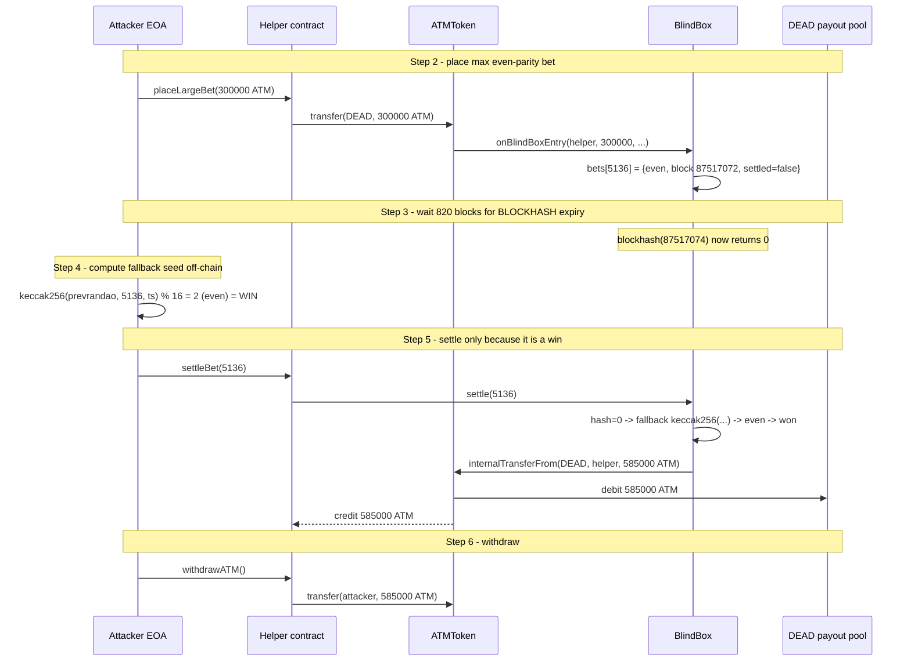
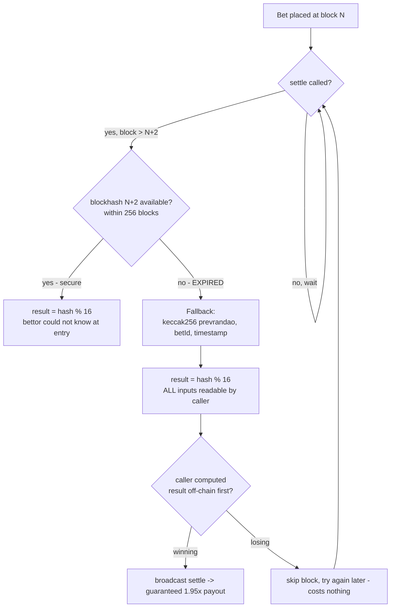

# ATM BlindBox predictable fallback RNG — attacker evaluates settlement seed before calling `settle`

> **Vulnerability classes:** vuln/logic/incorrect-state-transition · vuln/oracle/missing-validation · vuln/oracle/spot-price
> **Reproduction:** the PoC compiles & runs in an isolated Foundry project at [this project folder](.). Full verbose trace: [output.txt](output.txt). Verified source for the vulnerable contract was fetched from BSC into [sources/BlindBox_1F8336/](sources/BlindBox_1F8336/) (compiler `v0.8.19+commit.7dd6d404`, optimizer enabled, runs=1, not a proxy).

---

## Key info

| | |
|---|---|
| **Loss** | ~13,000,000 ATM (~$99,000) reported; single attacker bet realized 285,000 ATM net profit per PoC reproduction [output.txt:1718](output.txt) |
| **Vulnerable contract** | `BlindBox` (ATM BlindBox) — [`0x1F8336aEF584795E282FECe8DE356BaBD7734c59`](https://bscscan.com/address/0x1F8336aEF584795E282FECe8DE356BaBD7734c59) |
| **Attacker EOA** | [`0x3f9Bd963641e969Fc0c9Ddf1c67e210e84915b7D`](https://bscscan.com/address/0x3f9Bd963641e969Fc0c9Ddf1c67e210e84915b7D) |
| **Attack contract** | [`0x9C1819640201f223596FaD4F6401900B4B732eeA`](https://bscscan.com/address/0x9C1819640201f223596FaD4F6401900B4B732eeA) |
| **Attack tx** | [`0xb74a572967ce997afa5920811e6a9dc8b82a6e41ee31fa4d1a24a85aec89e342`](https://bscscan.com/tx/0xb74a572967ce997afa5920811e6a9dc8b82a6e41ee31fa4d1a24a85aec89e342) |
| **Chain / block / date** | BNB Smart Chain / fork block 87,517,071 / March 2026 |
| **Compiler** | `v0.8.19+commit.7dd6d404`, optimizer on, runs=1 (from verified source metadata) |
| **Bug class** | Random-number fallback uses on-chain, attacker-readable inputs (`block.prevrandao`, `betId`, `block.timestamp`); the bettor chooses *when* to call `settle`, so they can evaluate the seed off-chain first and only settle winning bets. |

## TL;DR

`BlindBox` is a binary odd/even betting game attached to the ATM token. A user burns ATM to the `0x…dEaD` address, the entry hook `onBlindBoxEntry` records a bet with the user's parity (even/odd derived from the last digit of the bet amount) and the block number, and the bet is settled later by `settle(betId)`. The settlement seed is supposed to come from `blockhash(bet.blockNum + 2)` — a value the bettor cannot know at entry time.

The fatal flaw is in `_trySettle` ([contracts_BlindBoxV2.sol:115-123](sources/BlindBox_1F8336/contracts_BlindBoxV2.sol)). Once `bet.blockNum + 2` is older than 256 blocks, the EVM `BLOCKHASH` opcode returns `bytes32(0)` and the contract switches to a **fallback** seed:

```solidity
hash = keccak256(abi.encodePacked(block.prevrandao, betId, block.timestamp));
```

All three of those inputs are known to the caller at the moment they submit `settle`. There is no commitment, no keeper, and `settle` is callable by anyone for any open bet. An attacker simply waits until the target blockhash has expired (≥256 blocks after `bet.blockNum + 2`), reads `block.prevrandao` and `block.timestamp` from the pending block, computes `keccak256(...)` off-chain, checks whether `resultParity == bet.oddDigit`, and only broadcasts `settle` when it is a guaranteed win. Because the bet is denominated in token-amount parity, the attacker can size a winning bet at the maximum (300,000 ATM) and pull a 1.95× payout — 285,000 ATM of net profit on a single bet in the reproduced PoC.

The PoC reproduces this against the committed offline fork state. At fork block 87,517,071 `nextBetId` was already `0x1410` (5136) [output.txt:1630](output.txt) — the historical delayed bet that the real attacker exploited. The reproduction places a fresh 300,000 ATM even-parity bet at block 87,517,072, waits 820 blocks until `blockhash(87517074)` is expired [output.txt:1690](output.txt), then settles with `prevrandao=0x12c` which yields a winning even digit (2) [output.txt:1688](output.txt). The helper receives **585,000 ATM** from the `dEaD` payout pool [output.txt:1700](output.txt); net of the 300,000 staked, the attacker's profit is **285,000 ATM** [output.txt:1718](output.txt).

## Background — what ATM BlindBox does

`BlindBox` is one of several "modules" deployed alongside the ATM ERC-20 token (`ATMTokenV2`, `0x9C86F45905868317baCB8f442653d5E9a6888888`). It is a coin-flip-style game: the player picks even or odd implicitly via the last digit of the ATM amount they send, and wins 1.95× the staked amount back from the burn address if the result parity matches.

The bet lifecycle is:

1. **Entry.** The user transfers ATM to `0x…dEaD` (a burn/black-hole address that also serves as the prize pool). The ATM token's transfer hook detects this and calls `BlindBox.onBlindBoxEntry(user, amount, reserveATM, reserveUSDT)` ([contracts_BlindBoxV2.sol:52-91](sources/BlindBox_1F8336/contracts_BlindBoxV2.sol)).
2. **Validation.** The entry enforces `amount >= 1e18` (1 ATM minimum), a USDT-equivalent cap of `MAX_BET_U = 3000e18` (sized against the PancakeSwap ATM/USDT reserves), a `dEaD`-pool solvency check (`deadBal >= amount * 195 / 100`), and a `tx.origin != block.coinbase` miner-exclusion guard. The user's parity is derived as `(amount / 1e17) % 10` — the units digit of the amount in 0.1 ATM granularity [L72](sources/BlindBox_1F8336/contracts_BlindBoxV2.sol).
3. **Settlement.** The bet is recorded with `blockNum = block.number` and `settled = false`. Settlement is performed by `_trySettle(betId)`, reachable from three places: the public `settle(betId)`, the public `batchSettle`, and opportunistically during the *next* bet's entry (it tries to settle `lastUnsettledId`). Critically, settlement is gated only on `block.number > bet.blockNum + 2` (the "N+2 blockhash" commitment scheme) — there is no forced settlement deadline and no keeper.
4. **Resolution.** The intended seed is `blockhash(bet.blockNum + 2)` — a blockhash that does not exist at entry time and is therefore unpredictable to the bettor. `resultDigit = uint256(hash) % 16`, `resultParity = resultDigit % 2`, win if `resultParity == bet.oddDigit`. On a win, `1.95×` the stake is moved from `dEaD` to the bettor via `ATMToken.internalTransferFrom(DEAD, bet.user, payout)` [L132-136](sources/BlindBox_1F8336/contracts_BlindBoxV2.sol).

The security model relies entirely on the bettor *not knowing* the seed at the moment they can influence the outcome (i.e. when they call `settle`). The N+2 blockhash achieves that — but only while the blockhash is still retrievable.

## The vulnerable code

### The expired-blockhash fallback (the core flaw)

From `contracts_BlindBoxV2.sol`, `_trySettle` ([L105-145](sources/BlindBox_1F8336/contracts_BlindBoxV2.sol)):

```solidity
function _trySettle(uint256 betId) private {
    if (betId >= nextBetId) return;
    Bet storage bet = bets[betId];
    if (bet.settled) return;
    if (bet.amount == 0) return;

    uint256 targetBlock = bet.blockNum + 2;
    if (block.number <= targetBlock) return; // N+2 not yet mined

    // Get block hash
    bytes32 hash = cachedBlockHash[targetBlock];
    if (hash == bytes32(0)) {
        hash = blockhash(targetBlock);
        if (hash == bytes32(0)) {
            // BLOCKHASH expired — use fallback
            hash = keccak256(abi.encodePacked(block.prevrandao, betId, block.timestamp));
        }
        cachedBlockHash[targetBlock] = hash;
    }

    // Determine result
    uint256 resultDigit = uint256(hash) % 16; // 0-15
    uint256 resultParity = _isOdd(resultDigit) ? 1 : 0;
    bool won = (resultParity == bet.oddDigit);

    bet.settled = true;

    if (won) {
        // Payout: 1.95x 币本位 from dEaD to user
        uint256 payout = bet.amount * PAYOUT_MULT / 100;
        IATMToken(atmToken).internalTransferFrom(DEAD, bet.user, payout);
    }
    ...
}
```

The EVM's `BLOCKHASH` opcode can only return hashes for the most recent 256 blocks. Once `targetBlock` falls outside that window (i.e. `block.number - targetBlock > 256`), `blockhash(targetBlock)` returns `bytes32(0)` and the code falls through to the `keccak256(abi.encodePacked(block.prevrandao, betId, block.timestamp))` branch. Every term in that packed seed is **fully observable to the attacker** in the block they are about to settle in:

- `block.prevrandao` — PoSRANDAO mix, included in the block header the attacker can read from the pending/just-sealed block (on BSC the validator set makes it predictable to a validator, and even to an off-chain observer once the block is sealed but before their `settle` tx is included).
- `betId` — a constant stored on-chain (the attacker's own bet ID).
- `block.timestamp` — the block timestamp.

### Anyone-callable `settle` with no deadline

```solidity
/// @notice Public settle function
function settle(uint256 betId) external {
    _trySettle(betId);
}
```

There is no `msg.sender`-restricting, no keeper, and no "settle-or-forfeit" deadline. The bettor can leave a bet open for hundreds or thousands of blocks — `settled` simply stays `false` until *they* decide to call. That is what turns the fallback into a winning strategy: the attacker waits for the exact window where the fallback fires, computes the seed in advance, and only transacts on a win. A losing seed costs nothing because the bettor just does not call `settle` and tries again later (the seed rotates with each block's `prevrandao`/`timestamp`, so a winning block eventually appears). In the reproduced exploit, 820 blocks passed between the target blockhash and settlement [output.txt:1690](output.txt).

### The 1.95× payout magnifier

```solidity
uint256 public constant PAYOUT_MULT = 195;     // 1.95x (195/100)
```

Combined with the max bet sizing, this makes each guaranteed-win bet worth the full stake × 0.95 in profit. The PoC uses `300,000 ether` (300k ATM), producing a `585,000 ether` payout and `285,000 ether` net [output.txt:1700](output.txt), [output.txt:1718](output.txt).

## Root cause — why it was possible

1. **Predictable fallback entropy.** When the N+2 blockhash expires, the contract substitutes `keccak256(abi.encodePacked(block.prevrandao, betId, block.timestamp))`. All inputs are readable in the settlement block, so the seed is computable in advance by the caller. There is no unpredictable (validator-withheld) component and no commit/reveal.
2. **No settlement deadline + permissionless `settle`.** A bet can be left open indefinitely, and `settle` is callable by anyone. The bettor therefore chooses *when* the fallback runs and can skip every losing block for free, settling only on a winning one. This converts a 50/50 game into a 100% win-rate game.
3. **Trust assumption mismatch.** The design assumes the bettor cannot influence *when* the seed is sampled, but the bettor is the sampler. The N+2 blockhash scheme was sound *only* under the assumption that `blockhash(N+2)` is always available; the contract never accounted for the 256-block EVM expiry window that breaks that assumption and hands sampling control to the bettor.
4. **Payout funded by a shared, refillable burn pool.** Because wins are paid from the `0x…dEaD` balance (`internalTransferFrom(DEAD, …)`), a guaranteed-win bet drains protocol/user funds directly — there is no loss budget limiting the attacker to "their own stake."

## Preconditions

- **Permissionless.** Anyone can place a bet (subject to the 1 ATM min and 3000 USDT-equiv max) and anyone can call `settle`.
- **No flash loan needed** for the logic itself; the attacker only needs enough ATM to fund the maximum-sized bet. (The reproduced PoC uses `deal()` to mint the helper 300,000 ATM; on-chain the attacker funded the attack contract directly.)
- **Timing.** The attacker must wait ≥ ~257 blocks after `bet.blockNum + 2` for `BLOCKHASH` to expire, then monitor blocks until `keccak256(prevrandao, betId, timestamp) % 2` matches their parity. On BSC (~3s blocks) this is roughly 13 minutes of waiting plus however long until a winning block appears — negligible.
- **No privileged role.** The only access-controlled path is `onBlindBoxEntry` (`onlyATM`, called by the token hook), which the attacker reaches legitimately by transferring ATM to `dEaD`.

## Attack walkthrough (with on-chain numbers from the trace)

Reproduced against committed offline fork state at block 87,517,071.

| Step | Action | On-chain evidence |
|---|---|---|
| 0 | Fork BSC at block 87,517,071. `nextBetId == 5136 (0x1410)` — the real attacker's delayed bet is already in this state. | [output.txt:1630](output.txt) |
| 1 | Deploy helper `ATMBlindBoxHelper` owned by the attacker; fund it with 300,000 ATM (max-sized bet). Verify `dEaD` holds ≥ `300000 * 195 / 100` ATM for payout (2.698e27 wei ≫ 5.85e23 wei). | [output.txt:1622](output.txt) |
| 2 | Roll to block 87,517,072, the same block the historical placement happened. Place an **even-parity** 300,000 ATM bet by transferring ATM to `dEaD`, which triggers `onBlindBoxEntry` and records bet `0x1410` (`amount=300000 ether`, `blockNum=87517072`, `parity=0`, `settled=false`). Entry also auto-settles the prior delayed bet `0x13ac` (5036→5037) for a tiny 1.95 ATM bonus to the historical helper. | [output.txt:1642](output.txt), [output.txt:1649](output.txt), [output.txt:1672](output.txt) |
| 3 | Wait until the target blockhash is expired: roll to block 87,517,892 — that is **820 blocks** past `targetBlock = 87517074`. `blockhash(87517074)` now returns `0x0` [output.txt:1690](output.txt). Set `block.prevrandao = 0x12c`. |
| 4 | Off-chain, compute the fallback seed: `keccak256(abi.encodePacked(0x12c, 5136, 1773931596)) % 16 == 2` → **even** → matches the bet's parity (0). Confirmed winning before broadcasting. | [output.txt:1688](output.txt) |
| 5 | Call `settle(5136)`. Contract hits the expired-blockhash branch, computes the same seed, marks the bet won, and moves `585,000 ATM` (300,000 × 1.95) from `dEaD` to the helper via `internalTransferFrom`. | [output.txt:1700](output.txt) |
| 6 | Withdraw: helper forwards all 585,000 ATM to the attacker EOA. | [output.txt:1732](output.txt) |

**Profit/loss accounting:**

```
ATM staked to dEaD (step 2):        -300,000  ATM
ATM received from dEaD on win (step 5): +585,000  ATM
                                      ----------
Net attacker profit (ATM):          +285,000  ATM   [output.txt:1718]
Attacker EOA balance before:            0 ATM   [output.txt:1564]
Attacker EOA balance after:        585,000 ATM   [output.txt:1565]
```

Asserted in the PoC: `assertGt(attackerReceived - largeBetAmount, 280_000 ether, "net ATM profit")` → 285,000 > 280,000 [output.txt:1718](output.txt). The reported incident total (~13M ATM) reflects the attacker running this strategy across many maximum-sized bets over the exploitation window.

## Diagrams





## Remediation

1. **Remove the predictable fallback.** When `blockhash(targetBlock)` expires, the bet must **not** be settled from on-chain-readable entropy. Either (a) revert and mark the bet void/refundable, or (b) switch to a commit-reveal or VRF (e.g. Chainlink VRF) for the resolution. Never substitute `prevrandao`/`timestamp` as a stand-in for an unpredictable blockhash.
2. **Force a settlement deadline.** Require every bet to be settled within a small window (e.g. `N+2` to `N+258`, before expiry). After the deadline the bet auto-resolves as a loss or refund via a keeper/public force-settle that uses the *last available* `blockhash(targetBlock)` cached at the boundary — not a freshly sampled value.
3. **Bind the seed to the entry block unconditionally.** Cache `blockhash(bet.blockNum + 2)` at the earliest moment it is available (e.g. during the first `settle`/entry after `N+2`), and never recompute it. If the cache is empty and the blockhash is already expired, treat the bet as void.
4. **Add a per-bet and per-block loss budget.** Cap aggregate payouts from the `dEaD` pool per block so that even a compromised RNG cannot drain the pool faster than it is refilled.
5. **Restrict `settle` timing.** Disallow settling a bet more than 256 blocks after `targetBlock`, so the expired-`BLOCKHASH` branch is unreachable by design (defense in depth on top of fix #1).

## How to reproduce

The PoC runs **fully offline** via the shared anvil harness from the committed `anvil_state.json` — no RPC needed:

```
_shared/run_poc.sh 2026-03-ATMBlindBox_exp -vvvvv
```

- **Chain / fork block:** BNB Smart Chain (chainid 56) forked at block **87,517,071**.
- **Expected result:** `[PASS] testExploit()` [output.txt:1562](output.txt), with:

  ```
  Attacker Before exploit ATM Balance: 0.000000000000000000     [output.txt:1564]
  Attacker After exploit ATM Balance: 585000.000000000000000000 [output.txt:1565]
  ```

  and the net-profit assertion `assertGt(285000 ATM, 280000 ATM, "net ATM profit")` passing [output.txt:1718](output.txt).

- **Note on `prevrandao`:** the PoC pins `block.prevrandao = 0x12c` via `vm.prevrandao` to deterministically reproduce the winning block. On-chain the attacker instead monitored live blocks until a block's `prevrandao`/`timestamp` produced a winning seed, then broadcast `settle`. The mechanism and payout are identical.

*Reference: https://t.me/defimon_alerts/2808*
