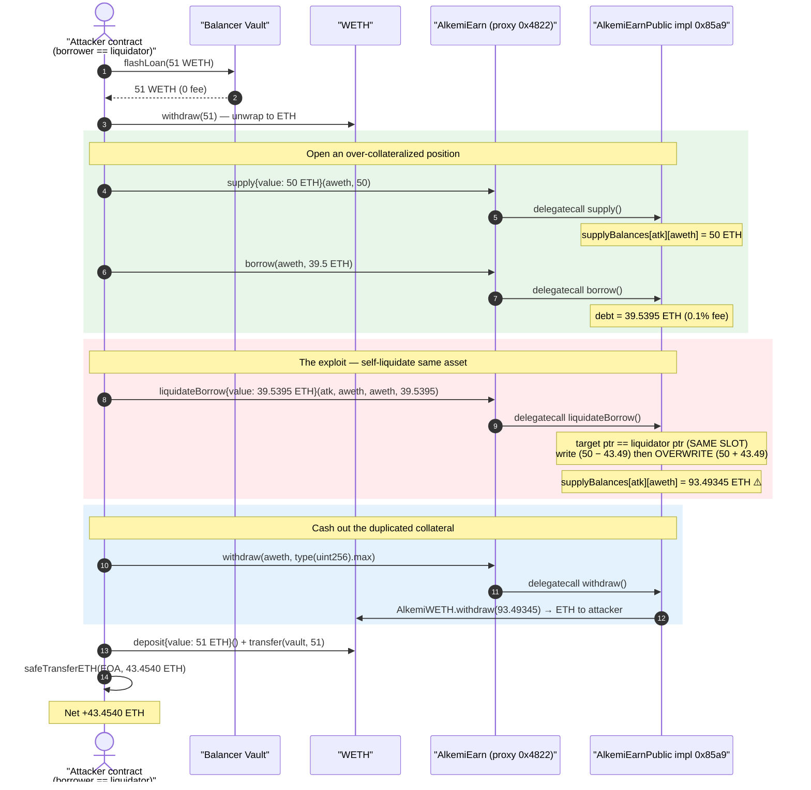
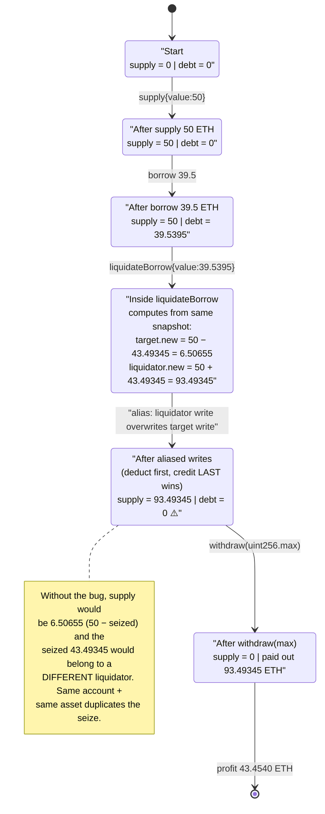
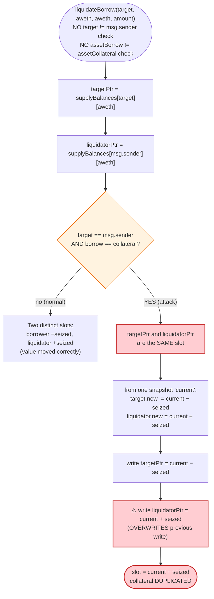

# AlkemiEarn Exploit — Self-Liquidation Storage-Aliasing Collateral Duplication

> **Vulnerability classes:** vuln/logic/incorrect-order-of-operations · vuln/logic/state-update

> One-liner: A borrower liquidates *their own* WETH-collateralized WETH borrow; because the borrower and the
> liquidator are the same account and the borrow asset equals the collateral asset, the two `Balance storage`
> pointers in `liquidateBorrow` alias the **same** storage slot — the "seize" credit overwrites the "deduct" debit,
> so the seized collateral is *duplicated* into the attacker's supply balance instead of moved. The attacker then
> withdraws the inflated balance for ~43.45 ETH of free funds.

> **Reproduction:** the PoC compiles & runs in an isolated Foundry project at [this project folder](.).
> Full verbose trace: [output.txt](output.txt).
> Verified vulnerable implementation: [sources/AlkemiEarnPublic_85a948/AlkemiEarnPublic.sol](sources/AlkemiEarnPublic_85a948/AlkemiEarnPublic.sol)
> (the implementation behind the `AdminUpgradeabilityProxy` at the victim address).

---

## Key info

| | |
|---|---|
| **Loss** | **43.4540 ETH** (~$43.45k+ at the time) drained from the AlkemiEarn WETH market |
| **Vulnerable contract** | `AlkemiEarnPublic` implementation — [`0x85a948fd70b2b415bda93324581fb5fff1293df7`](https://etherscan.io/address/0x85a948fd70b2b415bda93324581fb5fff1293df7#code), reached via the proxy [`0x4822D9172e5b76b9Db37B75f5552F9988F98a888`](https://etherscan.io/address/0x4822D9172e5b76b9Db37B75f5552F9988F98a888#code) |
| **Victim / pool** | AlkemiEarn lending pool (`AlkemiWETH` market, token `0x8125afd067094cD573255f82795339b9fe2A40ab`) |
| **Attacker EOA** | [`0x0ed1c01b8420a965d7bd2374db02896464c91cd7`](https://etherscan.io/address/0x0ed1c01b8420a965d7bd2374db02896464c91cd7) |
| **Attacker contract** | [`0xE408b52AEfB27A2FB4f1cD760A76DAa4BF23794B`](https://etherscan.io/address/0xE408b52AEfB27A2FB4f1cD760A76DAa4BF23794B) |
| **Attack tx** | [`0xa17001eb39f867b8bed850de9107018a2d2503f95f15e4dceb7d68fff5ef6d9d`](https://skylens.certik.com/tx/eth/0xa17001eb39f867b8bed850de9107018a2d2503f95f15e4dceb7d68fff5ef6d9d) |
| **Chain / block / date** | Ethereum mainnet / fork at `24,626,978` (attack block `24,626,979`) / **2026-03-10** |
| **Compiler (vulnerable contract)** | Solidity **v0.4.24+commit.e67f0147**, optimizer enabled, **1 run** |
| **Bug class** | Storage-pointer **aliasing** in self-liquidation (missing `borrower != liquidator` / `borrow != collateral` guard) → collateral accounting duplication |

---

## TL;DR

AlkemiEarn is a Compound-style money market (a hard fork of Compound v1 era code). Its `liquidateBorrow`
([AlkemiEarnPublic.sol:3444](sources/AlkemiEarnPublic_85a948/AlkemiEarnPublic.sol#L3444)) lets a liquidator repay an
underwater borrow and seize the borrower's collateral. It loads two `Balance storage` references:

```solidity
Balance storage supplyBalance_TargetCollateralAsset    = supplyBalances[targetAccount][assetCollateral];
Balance storage supplyBalance_LiquidatorCollateralAsset = supplyBalances[localResults.liquidator][assetCollateral];
```

When `targetAccount == msg.sender` **and** `assetCollateral == assetBorrow`, **both references point to the very
same storage slot**. The function then:

1. computes `target.new = current − seized` (subtract the seized collateral from the borrower),
2. computes `liquidator.new = current + seized` (add the seized collateral to the liquidator),
3. writes `target` **first**, then writes `liquidator` **last** — so the liquidator write **overwrites** the target
   write. Net effect on that single aliased slot: `current + seized` instead of `current`.

The collateral that should have been *moved* from borrower to liquidator is instead **created out of thin air**: the
attacker keeps their original 50 ETH supply *and* gains the 43.49 ETH "seized" amount.

The attacker funded the position with a **51 WETH Balancer flash loan**, supplied 50 ETH, borrowed 39.5 ETH,
self-liquidated to inflate their supply balance to 93.49 ETH, withdrew all 93.49 ETH, repaid the flash loan, and
walked away with **43.4540 ETH**.

---

## Background — what AlkemiEarn does

AlkemiEarn (sources: [AlkemiEarnPublic.sol](sources/AlkemiEarnPublic_85a948/AlkemiEarnPublic.sol)) is an
over-collateralized lending pool in the Compound mould:

- **`supply(asset, amount)`** ([:2461](sources/AlkemiEarnPublic_85a948/AlkemiEarnPublic.sol#L2461)) — deposit an
  asset as collateral, credited to `supplyBalances[msg.sender][asset]`. For the WETH market the call is
  `payable` and the native ETH is auto-wrapped.
- **`borrow(asset, amount)`** ([:4233](sources/AlkemiEarnPublic_85a948/AlkemiEarnPublic.sol#L4233)) — borrow against
  collateral; a 0.1% origination fee is added to the debt (39.5 → 39.5395).
- **`liquidateBorrow(targetAccount, assetBorrow, assetCollateral, amountClose)`**
  ([:3444](sources/AlkemiEarnPublic_85a948/AlkemiEarnPublic.sol#L3444)) — repay an underwater account's borrow and
  seize a discounted amount of its collateral (10% liquidation discount).
- **`withdraw(asset, amount)`** ([:2693](sources/AlkemiEarnPublic_85a948/AlkemiEarnPublic.sol#L2693)) — redeem supply
  balance; `type(uint256).max` withdraws the full balance.

The contract is deployed behind an `AdminUpgradeabilityProxy`
([sources/AdminUpgradeabilityProxy_4822D9](sources/AdminUpgradeabilityProxy_4822D9/AdminUpgradeabilityProxy.sol)); the
implementation in the trace is labelled `AlkemiEarnPublic` and lives at `0x85a9…3df7`.

On-chain parameters relevant to the attack (read from the trace / source):

| Parameter | Value |
|---|---|
| `liquidationDiscount` | **10%** (seize multiplier `1.10` → 39.5395 repaid yields 43.49345 seized) |
| Borrow origination fee | **0.1%** (39.5 ETH borrow → 39.5395 ETH debt) |
| WETH market (`AlkemiWETH`) | supported (`markets[aweth].isSupported == true`) |
| `closeFactorMantissa` | allows closing the full borrow in one call here |

---

## The vulnerable code

### 1. The two aliased collateral pointers

[AlkemiEarnPublic.sol:3474-3485](sources/AlkemiEarnPublic_85a948/AlkemiEarnPublic.sol#L3474-L3485):

```solidity
Balance storage borrowBalance_TargeUnderwaterAsset   = borrowBalances[targetAccount][assetBorrow];
Balance storage supplyBalance_TargetCollateralAsset  = supplyBalances[targetAccount][assetCollateral];

// Liquidator might already hold some of the collateral asset
Balance storage supplyBalance_LiquidatorCollateralAsset
    = supplyBalances[localResults.liquidator][assetCollateral];   // localResults.liquidator == msg.sender
```

When `targetAccount == msg.sender` and `assetCollateral` is the same asset, **`supplyBalance_TargetCollateralAsset`
and `supplyBalance_LiquidatorCollateralAsset` are the identical storage slot.**

### 2. Both updates computed from the same pre-image, written deduct-then-credit

The two "new" balances are computed from the **same** `currentSupplyBalance` snapshot
([:3903-3922](sources/AlkemiEarnPublic_85a948/AlkemiEarnPublic.sol#L3903-L3922)):

```solidity
// target loses the seized collateral
(err, localResults.updatedSupplyBalance_TargetCollateralAsset) = sub(
    localResults.currentSupplyBalance_TargetCollateralAsset,
    localResults.seizeSupplyAmount_TargetCollateralAsset);          // = current − seized

// liquidator gains the seized collateral
(err, localResults.updatedSupplyBalance_LiquidatorCollateralAsset) = add(
    localResults.currentSupplyBalance_LiquidatorCollateralAsset,    // == current (same slot!)
    localResults.seizeSupplyAmount_TargetCollateralAsset);          // = current + seized
```

Then both are persisted, **target first, liquidator last**
([:3960-3974](sources/AlkemiEarnPublic_85a948/AlkemiEarnPublic.sol#L3960-L3974)):

```solidity
supplyBalance_TargetCollateralAsset.principal     = localResults.updatedSupplyBalance_TargetCollateralAsset;     // writes current − seized
...
supplyBalance_LiquidatorCollateralAsset.principal = localResults.updatedSupplyBalance_LiquidatorCollateralAsset; // OVERWRITES with current + seized
```

Because the slot is shared, the second write clobbers the first. The slot ends at `current + seized` — the seized
collateral is **duplicated** rather than transferred.

### 3. No self-liquidation guard, no real solvency gate

`liquidateBorrow` never checks `targetAccount != msg.sender`, and for the WETH market the only constraint on the
close amount is `min(borrowBalance, discountedBorrowDenominatedCollateral, discountedRepayToEvenAmount)`
([:3654-3691](sources/AlkemiEarnPublic_85a948/AlkemiEarnPublic.sol#L3654-L3691)). The attacker's position is sized so
the full borrow (39.5395) is closeable, yielding the maximum seize (43.49345). The `supplyEther` call that "supplies"
the repaid ETH ([:2430-2441](sources/AlkemiEarnPublic_85a948/AlkemiEarnPublic.sol#L2430-L2441)) silently ignores its
`user` argument (`user; // To silence the warning`) — it only `WETHContract.deposit()`s the ETH into the protocol; it
does **not** credit any supply balance. All of the attacker's gain comes from the aliasing bug, not from the repaid ETH.

---

## Root cause — why it was possible

The function was written under the implicit assumption that a liquidator and the liquidated borrower are **distinct
accounts**, and that the borrow asset and collateral asset are **distinct markets** (the canonical Compound case). The
comment on line 3481 — *"Liquidator might already hold some of the collateral asset"* — shows the author intended to
account for a liquidator who *separately* holds collateral, never imagining the liquidator **is** the borrower in the
**same** asset.

Under Solidity's storage-reference semantics, two `storage` pointers derived from the same `mapping[key][key]` are the
same slot. The code:

1. Snapshots `current` into both `currentSupplyBalance_TargetCollateralAsset` and
   `currentSupplyBalance_LiquidatorCollateralAsset` (identical when aliased).
2. Computes `current − seized` and `current + seized` from that identical snapshot.
3. Persists them in deduct-then-credit order to the same slot.

The last write wins: the slot becomes `current + seized`. The protocol believes it moved collateral between two
parties, but in reality it **minted** `seized` units of collateral entitlement to a single account.

Four design gaps compose into the exploit:

1. **No `targetAccount != msg.sender` check.** Self-liquidation is allowed.
2. **No `assetBorrow != assetCollateral` check.** Same-asset liquidation aliases the slots.
3. **Both balance updates read the same pre-state and are written sequentially** rather than via a single net
   adjustment — so an alias turns "move" into "duplicate."
4. **Withdrawal trusts the corrupted `supplyBalances`.** `withdraw(aweth, type(uint256).max)` pays out the inflated
   93.49 ETH balance with no cross-check against the market's real cash/total-supply invariant.

---

## Preconditions

- The WETH market is live and holds enough cash to honour the inflated withdrawal (the pool had >50 ETH spare cash at
  the fork block — the attacker only needs the *seized* delta of liquidity to be present).
- The attacker can both supply collateral and borrow against it (over-collateralized, permissionless).
- The borrow asset equals the collateral asset (WETH) so the storage pointers alias.
- Working capital to fund the supply + borrow + repay round-trip. It is fully recovered intra-transaction, hence
  **flash-loanable** — the PoC uses a **51 WETH Balancer flash loan** (0 fee) as the entire capital source.

---

## Step-by-step attack walkthrough (ground-truth numbers from the trace)

All figures are taken directly from the events / `console.log` lines in
[output.txt](output.txt). The attacker contract (`Attacker` in the trace) is both borrower and liquidator.

| # | Step | Call | Ground-truth value | Effect |
|---|------|------|-------------------:|--------|
| 0 | **Flash loan** | `Balancer.flashLoan(51 WETH)` | 51.0 WETH in, **0 fee** | Capital sourced; attacker ETH balance 0 → 51 (after unwrap). |
| 1 | **Unwrap** | `WETH.withdraw(51e18)` | 51.0 ETH | WETH → native ETH. |
| 2 | **Supply** | `supply{value:50e18}(aweth,50e18)` | `SupplyReceived` newBalance = **50.0 ETH** | `supplyBalances[atk][aweth] = 50`. ETH balance now 1.0. |
| 3 | **Borrow** | `borrow(aweth, 39.5e18)` | `BorrowTaken` borrowAmountWithFee = **39.5395 ETH** | Debt = 39.5395 (0.1% fee). ETH balance now **40.5 ETH** (1 + 39.5 borrowed). |
| 4 | **Read debt** | `getBorrowBalance(atk, aweth)` | **39.5395 ETH** (`console: amount`) | Amount to repay = exact full debt. |
| 5 | **Self-liquidate** | `liquidateBorrow{value:39.5395e18}(atk, aweth, aweth, 39.5395e18)` | `BorrowLiquidated`: amountRepaid **39.5395**, amountSeized **43.49345** | Debt → 0; **aliasing bug**: `supplyBalances[atk][aweth]` = 50 (kept) + 43.49345 (seized) = **93.49345 ETH**. ETH balance now **0.9605 ETH**. |
| 6 | **Withdraw all** | `withdraw(aweth, type(uint256).max)` | `SupplyWithdrawn` amount = **93.49345 ETH**, newBalance 0 | Pool pays out the inflated balance. ETH balance now **94.45395 ETH**. |
| 7 | **Repay loan** | `WETH.deposit{value:51e18}()` + `transfer(vault, 51e18)` | 51.0 WETH repaid | Flash loan closed. |
| 8 | **Profit** | `safeTransferETH(attacker, balance)` | **43.4540 ETH** (`console: balance of eth`) | Net profit to attacker EOA. |

Key seize math: `seized = repaid × (1 + liquidationDiscount) = 39.5395 × 1.10 = 43.49345 ETH`.
Final collateral: `50 (original, not deducted due to aliasing) + 43.49345 (seized, credited) = 93.49345 ETH`.

### Profit accounting (ETH)

| Direction | Amount (ETH) |
|---|---:|
| Flash-loan principal in (unwrapped) | +51.00000 |
| Supply collateral | −50.00000 |
| Borrow proceeds (withdrawn as ETH) | +39.50000 |
| Repay own debt via `liquidateBorrow{value:…}` | −39.53950 |
| Withdraw inflated supply balance | +93.49345 |
| Repay flash loan (re-wrap + transfer) | −51.00000 |
| **Net profit** | **+43.45395** |

`51 − 50 + 39.5 − 39.5395 + 93.49345 − 51 = 43.45395 ETH`, matching the trace's
`Attacker After exploit ETH Balance: 43.45395 ETH` exactly.

---

## Diagrams

### Sequence of the attack



### Collateral-balance state evolution (the duplication)



### Where the aliasing happens in `liquidateBorrow`



---

## Remediation

1. **Reject self-liquidation.** Add `require(targetAccount != msg.sender, "SELF_LIQUIDATION")` at the top of
   `liquidateBorrow`. A borrower must never be their own liquidator.
2. **Reject same-asset aliasing where it duplicates state.** Either forbid `assetBorrow == assetCollateral`
   self-loops, or detect when the borrower's and liquidator's collateral slots alias and compute a **single net
   adjustment** to that slot (`current − seized + seized = current`) instead of two sequential writes.
3. **Use a single read-modify-write per slot.** Never derive two `Balance storage` references that may alias and write
   them independently from the same pre-image. Compute the final value once and write once.
4. **Enforce a real solvency precondition.** Liquidation should require the target account to be genuinely below the
   collateral ratio (positive shortfall). The over-collateralized attacker should not have been liquidatable at all.
5. **Add a market-level invariant check on withdrawal.** A withdraw that exceeds the user's *honest* contribution to
   the market's cash/total-supply should be impossible; an accounting cross-check would have caught the inflated
   93.49 ETH balance before the payout.

---

## How to reproduce

The PoC was extracted into a standalone Foundry project (the umbrella DeFiHackLabs repo has several unrelated PoCs
that fail to compile under a whole-project `forge test` build):

```bash
_shared/run_poc.sh 2026-03-AlkemiEarn_exp -vvvvv
```

- RPC: an **Ethereum mainnet archive** endpoint is required (fork block `24,626,978`). `foundry.toml` uses the
  pre-configured Infura archive endpoint.
- Local imports resolved into the project root: [`interface.sol`](interface.sol) (provides `IBalancerVault`, `IWETH`,
  `TransferHelper`), [`basetest.sol`](basetest.sol) and [`tokenhelper.sol`](tokenhelper.sol) (provide
  `BaseTestWithBalanceLog`). The PoC's `IAlkemiEarn` interface is declared inline in
  [test/AlkemiEarn_exp.sol](test/AlkemiEarn_exp.sol).
- Result: `[PASS] testExploit()` with an attacker ending ETH balance of **43.45395 ETH**.

Expected tail:

```
[PASS] testExploit() (gas: ...)
  amount:  39539500000000000000
  balance of eth:  40500000000000000000
  balance of eth:  43453950000000000000
  ...
  emit log_named_decimal_uint(key: "Attacker After exploit ETH Balance", val: 43453950000000000000 [4.345e19], decimals: 18)

Suite result: ok. 1 passed; 0 failed; 0 skipped
```

---

*Sources downloaded (3): `AlkemiEarnPublic` (vulnerable implementation), `AdminUpgradeabilityProxy` (victim proxy),
`AlkemiWETH` (collateral/market token). See [sources/](sources/).*
*Post-mortem reference: https://x.com/blockaid_/status/2031351883470676048*
