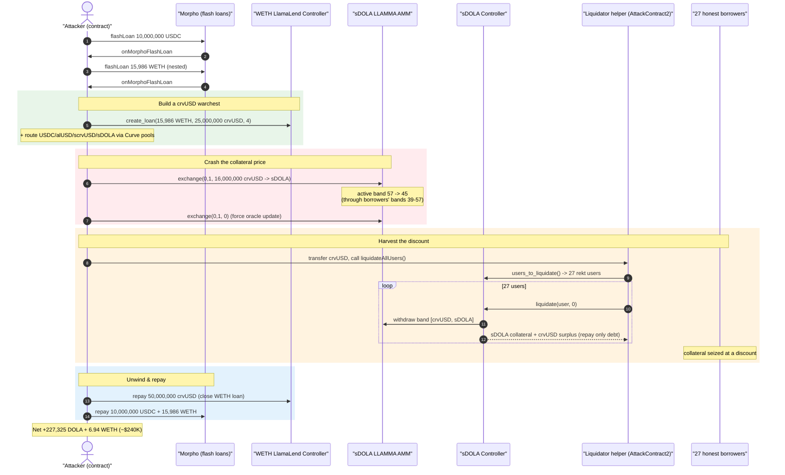
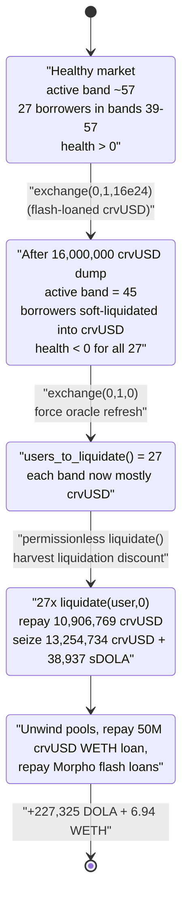
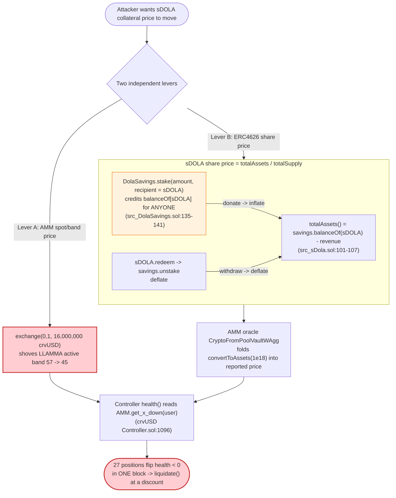

# Curve LlamaLend (Inverse Finance sDOLA market) Exploit — Oracle / Band Manipulation Mass-Liquidation

> **Vulnerability classes:** vuln/oracle/price-manipulation · vuln/logic/liquidation-logic

> One-line summary: An attacker used a flash loan to dump ~16M crvUSD into the `sDOLA`-collateral LlamaLend AMM, dragging the AMM's active band down through 27 honest borrowers' bands so they all became liquidatable in one block, then liquidated every one of them and walked off with their `sDOLA` collateral plus the band crvUSD surplus — netting **~227,325 DOLA + ~6.94 WETH (~$240K)**.

> **Reproduction:** the PoC compiles & runs in this isolated Foundry project ([folder](.)). Full verbose trace: [output.txt](output.txt). Verified vulnerable sources are under [sources/](sources/).

---

## Key info

| | |
|---|---|
| **Loss** | **~$240,000** — extracted as **227,325.57 DOLA** + **6.94 WETH** |
| **Vulnerable market** | Curve **LlamaLend `sDOLA` market** — Controller [`0xaD444663c6C92B497225c6cE65feE2E7F78BFb86`](https://etherscan.io/address/0xaD444663c6C92B497225c6cE65feE2E7F78BFb86#code) + AMM [`0x0079885E248B572CdC4559A8B156745e2d8EA1f7`](https://etherscan.io/address/0x0079885E248B572CdC4559A8B156745e2d8EA1f7#code) |
| **Mis-integrated collateral** | `sDOLA` (Inverse Finance) — [`0xb45ad160634c528Cc3D2926d9807104FA3157305`](https://etherscan.io/address/0xb45ad160634c528Cc3D2926d9807104FA3157305#code), an ERC4626 whose share price is donation-inflatable via [`DolaSavings`](https://etherscan.io/address/0xE5f24791E273Cb96A1f8E5B67Bc2397F0AD9B8B4#code) |
| **Victims** | 27 honest `sDOLA`-collateral borrowers in the LlamaLend market |
| **Attacker EOA** | `0x33a0aab2642c78729873786e5903cc30f9a94be2` |
| **Attacker contracts** | `0xd8E8544E0c808641b9b89dfB285b5655BD5B6982`, `0xC6C2fcdf688BAeB7b03D9D9C088c183dbB499ac0` (liquidator) |
| **Attack tx** | [`0xb93506af8f1a39f6a31e2d34f5f6a262c2799fef6e338640f42ab8737ed3d8a4`](https://etherscan.io/tx/0xb93506af8f1a39f6a31e2d34f5f6a262c2799fef6e338640f42ab8737ed3d8a4) |
| **Chain / block / date** | Ethereum mainnet / 24,566,937 / Mar 2026 |
| **Compiler** | Controllers & AMM: **Vyper 0.3.10**; `sDOLA`: **Solidity 0.8.21**; `DolaSavings`: Solidity |
| **Bug class** | Lending-collateral **price-oracle / AMM-band manipulation** enabling a mass bad-debt liquidation for profit (a price-of-collateral manipulation, not a code bug in any one contract) |

---

## TL;DR

Curve **LlamaLend** is a lending market where collateral is continuously, automatically "soft-liquidated" inside a specialised AMM (**LLAMMA**) as the collateral price falls: as the oracle/AMM price drops through a borrower's price *bands*, that borrower's collateral is progressively converted from the collateral token into the borrowed token (`crvUSD`) inside the AMM. If price drops far enough the position becomes **hard-liquidatable** — anyone can call `liquidate(user)`, repay the debt, and take the band's contents.

This particular market used **`sDOLA`** (Inverse Finance's auto-compounding `DOLA` vault) as collateral. The attacker did **not** break any single contract; instead they **moved the price of `sDOLA` collateral inside the LLAMMA AMM** by force, in one atomic flash-loan transaction:

1. **Flash-loan capital** — borrow 10,000,000 USDC then 15,986 WETH from Morpho (nested flash loans).
2. **Build a crvUSD warchest** — mint 25,000,000 crvUSD against the borrowed WETH in a *different* LlamaLend market (the WETH market, Controller `0xA920De…`), and assemble `sDOLA`/`DOLA`/`scrvUSD`/`alUSD` legs through several Curve pools.
3. **Crash the sDOLA-market AMM price** — swap **16,000,000 crvUSD → sDOLA** through the victim market's LLAMMA AMM ([`exchange(0,1,16e24,1)`](test/Curve_LlamaLend_exp.sol#L104)). This dumps a colossal amount of `crvUSD` into the AMM, dragging its **active band down to 45** (verified `active_band() = 45` during liquidation, [output.txt:2418](output.txt)), *through* the price bands of 27 existing borrowers (whose band ranges span roughly `n0 = -4 … 184`). Their positions instantly read as deeply underwater.
4. **Liquidate everyone** — `users_to_liquidate()` now returns all 27 newly-rekt borrowers; the attacker's helper contract loops over them calling `liquidate(user, 0)` ([liquidateAllUsers](test/Curve_LlamaLend_exp.sol#L171-L187)), repaying **10,906,769 crvUSD** of debt while seizing **13,254,734 crvUSD** of band content + **38,937 sDOLA** of collateral — a **~2.35M crvUSD + 38.9K sDOLA** surplus harvested from the liquidation discount on honest users.
5. **Unwind & repay** — redeem the seized `sDOLA`/`scrvUSD`, swap back through the Curve pools, repay both flash loans and the WETH loan, and keep the residue: **227,325 DOLA + 6.94 WETH**.

The root problem: **`sDOLA` is an ERC4626 whose price can be moved atomically (its own author warns about exactly this), and LlamaLend let a single flash-loan-funded AMM swap shove the market price through dozens of borrowers' bands in one block** — so a hard-liquidation cascade that should only happen across a slow market decline was compressed into one profitable transaction.

---

## Background — the moving parts

### Curve LlamaLend / LLAMMA

LlamaLend isolated lending markets pair a **Controller** (debt accounting, `create_loan` / `repay` / `liquidate`) with a **LLAMMA AMM** that holds the collateral. A borrower's collateral is spread across a range of price **bands** `[n0, n1]`. As the oracle price falls into those bands, `LLAMMA.exchange()` converts collateral → `crvUSD` band-by-band ("soft liquidation"); as it rises, back again. Position health is computed from the AMM state:

```python
# sources/crvUSD Controller_aD4446/crvUSD Controller.sol:1094-1096
health: int256 = 10**18 - convert(liquidation_discount, int256)
health = unsafe_div(convert(AMM.get_x_down(user), int256) * health, convert(debt, int256)) - 10**18
```
[`crvUSD Controller.sol:1084-1106`](sources/crvUSD%20Controller_aD4446/crvUSD%20Controller.sol#L1084-L1106) — health is driven by `AMM.get_x_down(user)`, which collapses as the AMM price moves down through the user's bands.

`users_to_liquidate()` ([:1326](sources/crvUSD%20Controller_aD4446/crvUSD%20Controller.sol#L1326)) returns every user whose `full` health < 0; `liquidate(user, min_x)` lets *anyone* close such a position:

```python
# sources/crvUSD Controller_aD4446/crvUSD Controller.sol:1265-1273
def liquidate(user: address, min_x: uint256):
    discount: uint256 = 0
    if user != msg.sender:
        discount = self.liquidation_discounts[user]
    self._liquidate(user, min_x, discount, 10**18, empty(address), [])
```
Inside `_liquidate`, the AMM band contents `xy = [crvUSD, sDOLA]` are withdrawn; the liquidator repays `debt` and **keeps everything above it** — the collateral `xy[1]` *and* any band crvUSD surplus `xy[0] - debt`:

```python
# sources/crvUSD Controller_aD4446/crvUSD Controller.sol:1207, 1241-1246
xy: uint256[2] = AMM.withdraw(user, self._get_f_remove(frac, health_limit))  # [stable, collateral]
...
else:                                              # xy[0] >= debt  (band already mostly crvUSD)
    self.transferFrom(COLLATERAL_TOKEN, AMM.address, msg.sender, xy[1])   # all sDOLA → liquidator
    if xy[0] > debt:
        self.transferFrom(BORROWED_TOKEN, AMM.address, msg.sender, unsafe_sub(xy[0], debt))  # crvUSD surplus → liquidator
```
[`crvUSD Controller.sol:1179-1251`](sources/crvUSD%20Controller_aD4446/crvUSD%20Controller.sol#L1179-L1251)

### `sDOLA` — an atomically-pumpable ERC4626

`sDOLA` ([source](sources/sDola_b45ad1/src_sDola.sol)) wraps `DolaSavings`. Its share price is `totalAssets()/totalSupply`, and `totalAssets()` reads the **live `DolaSavings` stake balance held by the `sDOLA` contract**:

```solidity
// sources/sDola_b45ad1/src_sDola.sol:101-107
function totalAssets() public view override returns (uint) {
    uint week = block.timestamp / 7 days;
    uint timeElapsed = block.timestamp % 7 days;
    uint remainingLastRevenue = weeklyRevenue[week - 1] * (7 days - timeElapsed) / 7 days;
    uint actualAssets = savings.balanceOf(address(this)) - remainingLastRevenue - weeklyRevenue[week];
    return actualAssets < MAX_ASSETS ? actualAssets : MAX_ASSETS;
}
```
[`src_sDola.sol:101-107`](sources/sDola_b45ad1/src_sDola.sol#L101-L107)

Critically, **`DolaSavings.stake(amount, recipient)` lets anyone credit an arbitrary `recipient`** — including the `sDOLA` vault itself:

```solidity
// sources/DolaSavings_E5f247/src_DolaSavings.sol:135-141
function stake(uint amount, address recipient) external updateIndex(recipient) {
    require(recipient != address(0), "Zero address");
    balanceOf[recipient] += amount;
    totalSupply += amount;
    dola.transferFrom(msg.sender, address(this), amount);
    emit Stake(msg.sender, recipient, amount);
}
```
[`src_DolaSavings.sol:135-141`](sources/DolaSavings_E5f247/src_DolaSavings.sol#L135-L141)

So `stake(X, sDOLA)` raises `savings.balanceOf(sDOLA)` (and therefore `sDOLA.totalAssets()` / share price) **with no shares minted** — a textbook ERC4626 donation/inflation primitive. Conversely, redeeming sDOLA calls `savings.unstake()`, lowering it. The `sDOLA` author *documented* this danger verbatim:

```solidity
// sources/sDola_b45ad1/src_sDola.sol:24-25
// WARNING: While this vault is safe to be used as collateral in lending markets, it should not be allowed as a borrowable asset.
// Any protocol in which sudden, large and atomic increases in the value of an asset may be a security risk should not integrate this vault.
```
[`src_sDola.sol:24-25`](sources/sDola_b45ad1/src_sDola.sol#L24-L25)

The LlamaLend `sDOLA` market's AMM oracle (`CryptoFromPoolVaultWAgg`) folds **both** the `alUSD/sDOLA` Curve pool EMA *and* `sDOLA.convertToAssets(1e18)` into the reported collateral price (see [output.txt:2157-2167](output.txt)), so the attacker can lean on the share-price leg as well as the band-pushing leg.

---

## Root cause — why it was possible

This was not a single-line bug; it was a **composition of three known-but-uncombined hazards**, all reachable atomically with flash-loaned capital:

1. **Manipulable collateral price.** `sDOLA`'s ERC4626 share price is movable in one transaction (donate via `DolaSavings.stake(_, sDOLA)`, or redeem to deflate), and the LLAMMA AMM's *spot/active-band* price is movable by simply swapping a large amount into it. Neither the AMM band price nor `convertToAssets()` has any same-block manipulation guard usable as a lending oracle. The collateral issuer literally warned that "*sudden, large and atomic increases in the value of an asset may be a security risk*" — the integrating market ignored it.

2. **Liquidations key off the manipulated AMM price with no rate-limit.** `health()`/`get_x_down()` read the *current* AMM band state ([:1096](sources/crvUSD%20Controller_aD4446/crvUSD%20Controller.sol#L1096)). A single `exchange(0,1,16,000,000 crvUSD)` shoves the active band from 57 → 45, instantly flipping 27 positions (bands ~39–57) to "rekt." LLAMMA's design assumes price moves through bands *gradually over many blocks*; nothing prevents a whale from dragging the active band through dozens of bands in one swap.

3. **Permissionless, profitable liquidation.** `liquidate(user, 0)` is callable by anyone and pays the **liquidation discount** to the caller: repay `debt`, receive the band's full collateral `xy[1]` plus crvUSD surplus `xy[0]-debt` ([:1241-1246](sources/crvUSD%20Controller_aD4446/crvUSD%20Controller.sol#L1241-L1246)). Because the attacker *caused* the price move, they are the one positioned to harvest every discount — turning a self-inflicted price crash into a profit extracted from honest borrowers.

In short: **the AMM swap that crashes the price and the liquidations that profit from the crash happen in the same atomic transaction, funded by flash loans.** The "soft-liquidation buffer" that is supposed to protect borrowers from instantaneous price moves is itself defeated by an instantaneous, oversized AMM swap.

---

## Preconditions

- A LlamaLend market that uses **`sDOLA`** (an atomically-pumpable ERC4626) as collateral, with an AMM oracle exposed to same-block manipulation.
- Existing honest borrowers whose price bands sit near the current active band (here, 27 positions with bands ~39–57, active band ~57).
- Flash-loan liquidity to (a) mint a large `crvUSD` warchest and (b) provide the `~16M crvUSD` needed to push the AMM through the bands. The peak capital was sourced from **nested Morpho flash loans** (10M USDC + 15,986 WETH) and a 25M crvUSD WETH-collateral LlamaLend loan — all repaid intra-transaction, so the attack is effectively **self-funding**.

---

## Attack walkthrough (ground-truth numbers from the trace)

All figures are taken directly from [output.txt](output.txt). `i=0 = crvUSD`, `i=1 = sDOLA` in the LLAMMA AMM. Two LlamaLend Controllers are involved: **Controller-2 `0xA920De…` = WETH market** (used only to mint crvUSD), **Controller `0xaD4446…` = the victim sDOLA market**.

| # | Step (trace ref) | Concrete numbers | Effect |
|---|---|---|---|
| 0 | **Morpho flash loan #1** ([:1599](output.txt)) | 10,000,000 USDC | Working capital. |
| 1 | **Morpho flash loan #2 (nested)** ([:1612](output.txt)) | 15,986.11 WETH (all of Morpho's WETH) | More working capital. |
| 2 | **Build crvUSD / sDOLA legs** ([:1675-1737](output.txt)) | USDC→alUSD via `alUSD_FRAXB3CRV_F` (7e12 wei in); `alUSD→sDOLA` via `alUSD_sDOLA` exchange (650,000e18) | Acquire sDOLA + position pools. |
| 3 | **Mint 25M crvUSD vs WETH** in WETH market ([:1820, Borrow :2046](output.txt)) | `create_loan(15,986 WETH, 25,000,000 crvUSD, 4 bands)` | crvUSD warchest. |
| 4 | **Deposit 7M crvUSD → scrvUSD; SAVE_DOLA leg** ([:2058,:2074](output.txt)) | `scrvUSD.deposit(7,000,000e18)`; `SAVE_DOLA.exchange(0,1,370,000e18)` | More routing assets. |
| 5 | **CRASH the AMM price** — dump crvUSD into victim AMM ([:2156](output.txt)) | `LLAMMA.exchange(0,1, 16,000,000e18, 1)` → sold 13,254,733 crvUSD, got 9,825,506 sDOLA | **Active band pushed 57 → 45**, *into* borrowers' bands (39–57). |
| 6 | **sDOLA share-price wobble** ([redeem :2293, stake :2326](output.txt)) | redeem 10.6M sDOLA → `savings.unstake(12,613,130 DOLA)`; then `DolaSavings.stake(190,777 DOLA, recipient = sDOLA)` | `convertToAssets(1e18)`: 1.189 → **1.353**; `savings.balanceOf(sDOLA)`: 14,005,542 → 1,583,189 DOLA. |
| 7 | **Trigger soft-liq pass** ([:2342](output.txt)) | `LLAMMA.exchange(0,1,0,1)` (zero-amount, forces oracle update) | Bands re-priced; positions now `health < 0`. |
| 8 | **Mass hard-liquidation** ([:2374 liquidateAllUsers, 27× liquidate :4273+](output.txt)) | `users_to_liquidate()` → **27 users**; loop `liquidate(user,0)` | See accounting below. |
| 9 | **Sandwich-back mint** ([:8441](output.txt)) | `create_loan(8,286,547 sDOLA, 10,904,021 crvUSD, 4)` in victim market | Re-establish AMM state for unwind/repay. |
| 10 | **Repay WETH loan + unwind pools** ([repay :8554, swap :8661](output.txt)) | `Controller-2.repay(50,000,000 crvUSD)`; USDC→WETH `swapExactTokensForTokens(13,241,509,653)` | Close debts, recover WETH. |
| 11 | **Repay both Morpho flash loans** ([approvals :80,:147 in PoC](test/Curve_LlamaLend_exp.sol#L80)) | 10,000,000 USDC + 15,986.11 WETH | Loans settled. |
| 12 | **Profit** ([:end log](output.txt)) | **227,325.57 DOLA + 6.94 WETH** | Net theft. |

### The 27 liquidations, aggregated (from the `Liquidate` events)

```
#liquidations              = 27
Σ collateral_received       = 38,937.27 sDOLA
Σ stablecoin_received       = 13,254,733.56 crvUSD   (band crvUSD contents)
Σ debt repaid               = 10,906,769.12 crvUSD
crvUSD surplus from bands   = +2,347,964.44 crvUSD   (the liquidation-discount harvest)
```
Example, first victim `0x2b083a…` ([:4273-4283](output.txt)): repaid `debt = 1,639.16 crvUSD`, received `collateral = 501.40 sDOLA` + `stablecoin = 2,080.54 crvUSD` ⇒ `Liquidate(collateral_received: 501.40 sDOLA, stablecoin_received: 2,080.54 crvUSD, debt: 1,639.16)`. The borrower had bands `[39,48]` with the active band now at `45` — fully inside their soft-liquidation range.

### Profit / loss accounting

| Flow | Amount |
|---|---:|
| Flash loans drawn (repaid in full) | 10,000,000 USDC + 15,986.11 WETH (Morpho) |
| crvUSD minted vs WETH (repaid) | 25,000,000 → 50,000,000 crvUSD repaid to WETH market |
| Band crvUSD surplus harvested | **+2,347,964 crvUSD** |
| sDOLA collateral seized | **+38,937 sDOLA** |
| **Attacker net retained** | **227,325.57 DOLA + 6.94 WETH ≈ $240,000** |
| **Borne by** | 27 honest `sDOLA`-collateral borrowers + LlamaLend market (bad debt) |

The residual `DOLA`/`WETH` is what's left after every flash loan, the 25M/50M crvUSD WETH-market loan, and all pool round-trips are netted out — i.e., the realised value of the liquidation-discount harvest, denominated back into `DOLA` and `WETH`.

---

## Diagrams

### Sequence of the attack



### AMM band / price-state evolution



### Why the collateral price is manipulable (the sDOLA / DolaSavings leg)



---

## Remediation

1. **Do not use atomically-manipulable assets as lending collateral.** `sDOLA`'s own NatSpec warns that "*sudden, large and atomic increases in the value of an asset may be a security risk*" ([src_sDola.sol:24-25](sources/sDola_b45ad1/src_sDola.sol#L24-L25)). A market integrating it must either avoid it or wrap its price in a manipulation-resistant oracle. The same applies to its mirror risk (atomic *decreases*).
2. **Rate-limit single-block band movement in LLAMMA-style markets.** Cap how many bands a single swap (or single block) can move the active band through, or require liquidations to use a *time-averaged* band/oracle price rather than the instantaneous post-swap state. A move that crosses dozens of borrowers' bands in one swap should not immediately make them all hard-liquidatable.
3. **Use a robust collateral oracle, not raw AMM spot + raw `convertToAssets()`.** Combine an EMA/TWAP of the collateral price with sanity bounds and a deviation circuit-breaker, so a single fat swap or a single `DolaSavings.stake(_, sDOLA)` donation cannot dictate liquidation health.
4. **Harden `DolaSavings.stake(amount, recipient)`.** Allowing arbitrary third parties to credit the `sDOLA` vault's stake (inflating its share price with no shares minted) is the donation primitive. Restrict crediting to `msg.sender`, or have `sDOLA.totalAssets()` track an *internally-accounted* principal rather than the live external `savings.balanceOf(sDOLA)`.
5. **Add anti-self-liquidation economics.** Because `liquidate()` pays the discount to whoever triggers it, the entity that *caused* the price move can always be the liquidator. Mechanisms such as a liquidation delay, partial-only liquidation under fast moves, or routing the discount to a backstop fund rather than the caller reduce the profitability of self-inflicted-crash attacks.

---

## How to reproduce

```bash
_shared/run_poc.sh 2026-03-Curve_LlamaLend_exp -vvvvv
```

- Requires a **mainnet archive** RPC at fork block **24,566,937** (configured `foundry.toml` → `mainnet` = Infura archive endpoint).
- The PoC pins the fork to the attack tx hash itself (`vm.createSelectFork("mainnet", 0xb935…d8a4)`), so it executes against the exact pre-attack state.

Expected tail:

```
Ran 1 test for test/Curve_LlamaLend_exp.sol:Curve_LlamaLend_exp
[PASS] testExploit() (gas: 14460255)
  DOLA Balance: 227325.565940517368498878
  WETH Balance: 6.939577139569480067
```

---

*Vulnerable sources (verified, Etherscan V2, chainid 1) in [sources/](sources/): the two LlamaLend [Controllers](sources/crvUSD%20Controller_aD4446/), the [LLAMMA AMM](sources/LLAMMA%20-%20crvUSD%20AMM_007988/), [sDOLA](sources/sDola_b45ad1/), [DolaSavings](sources/DolaSavings_E5f247/), [scrvUSD (Yearn V3)](sources/Yearn%20V3%20Vault_065597/), and the three Curve pools used for routing. Reference: PoC header — DeFiHackLabs, Curve LlamaLend, ~$240K.*
