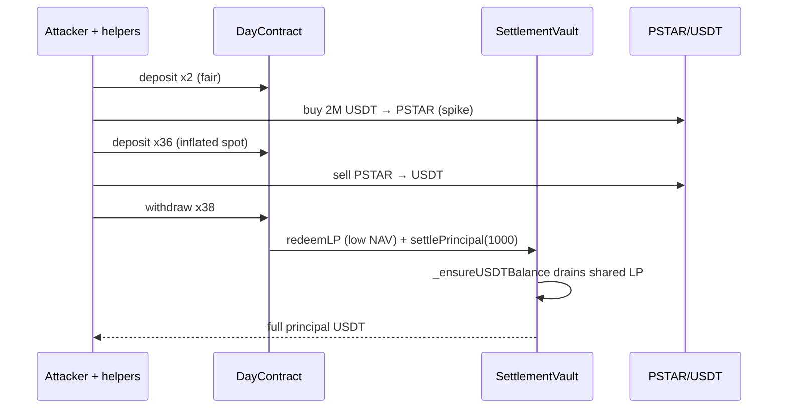

# DayContract / Polarx — Spot Manip + Rigid Principal Guarantee

> **Vulnerability classes:** vuln/oracle/price-manipulation · vuln/logic/missing-check

> **Reproduction:** Foundry PoC in [this project folder](.) — ONLINE BSC archive fork.
> Verbose run: [output.txt](output.txt). Sources: [sources/DayContract.sol](sources/DayContract.sol),
> [sources/SettlementVault.sol](sources/SettlementVault.sol).

---

## Key info

| | |
|---|---|
| **Loss** | **~$10.6K** attacker profit; **~$29.7K** protocol insolvency |
| **Vulnerable contract** | DayContract — [`0x587984549f7e61c0ed8131b1f6614f592573a43c`](https://bscscan.com/address/0x587984549f7e61c0ed8131b1f6614f592573a43c#code) |
| **SettlementVault** | [`0x66426a835c71c20ac222c8441117f78aa8f2ff12`](https://bscscan.com/address/0x66426a835c71c20ac222c8441117f78aa8f2ff12#code) |
| **PSTAR token** | [`0xa0d94224e5434471638b82985af61b79109e09f5`](https://bscscan.com/address/0xa0d94224e5434471638b82985af61b79109e09f5) |
| **PSTAR/USDT pair** | [`0x3f7b54e8b46b8a0780628a2361dcd9c3873fa9d9`](https://bscscan.com/address/0x3f7b54e8b46b8a0780628a2361dcd9c3873fa9d9) |
| **Attacker EOA** | [`0xf25d6a026c7853829e7cd5e98cd958a5a41be5e8`](https://bscscan.com/address/0xf25d6a026c7853829e7cd5e98cd958a5a41be5e8) |
| **Attack contract** | [`0x0e59d33cc16b5d660725869c29bc26562c9975f1`](https://bscscan.com/address/0x0e59d33cc16b5d660725869c29bc26562c9975f1) |
| **Attack tx** | [`0xf3b8ceae…91755e7`](https://bscscan.com/tx/0xf3b8ceae88818d7121c84b7f00f7c99d1c6c45409ceb9de2eae10a92391755e7) |
| **Chain / block / date** | BSC / **89,610,264** (fork at 89,610,263) / Mar 30, 2026 |
| **Bug class** | Spot-priced LP mint + unconditional principal settlement on shared vault LP |

---

## TL;DR

`DayContract.deposit` converts USDT → LP via Pancake **spot** reserves (no TWAP).
`withdraw` always calls `vault.settlePrincipal(user, fullPrincipal, 0)`, and the vault’s
`_ensureUSDTBalance` redeems **shared** vault LP until it can pay that principal —
regardless of the order’s own post-manipulation NAV.

Attacker flow (atomic):

1. Flash/deal ~2.04M USDT; deploy **38** registered helpers.
2. Two fair deposits of 1,000 USDT.
3. Buy ~2M USDT of PSTAR → spike spot.
4. 36 more 1,000 USDT deposits at inflated spot (sandwich meat + overvalued LP receipts).
5. Dump PSTAR → ~2.01M USDT back (manip profit from deposit-side buys/liquidity).
6. Withdraw all 38 orders → each gets full 1,000 USDT principal paid by draining shared LP.

PoC profit **~10,655 USDT** (matches ExVul ~$10.6K).

---

## Vulnerable code

### Spot LP mint ([sources/DayContract.sol](sources/DayContract.sol))

```solidity
function deposit(uint256 amount) external nonReentrant {
    // ...
    uint256 lpReceived = _convertToLP(amount); // spot reserves only
    // store order.principal = amount (USDT face value)
    vault.receiveLP(msg.sender, orderId, lpReceived);
    vault.increaseDeposit(msg.sender, amount);
}
```

### Rigid principal ([sources/DayContract.sol](sources/DayContract.sol) + vault)

```solidity
function withdraw(uint256 orderId) external nonReentrant {
    // ...
    vault.redeemLP(msg.sender, orderId); // may yield ≪ principal after dump
    // ...
    vault.settlePrincipal(msg.sender, returnAmount, 0); // returnAmount ≈ full principal
}
```

```solidity
// SettlementVault
function settlePrincipal(...) external onlyAuthorized {
    _ensureUSDTBalance(principal); // redeems SHARED vault LP until balance ≥ principal
    usdt.transfer(user, returnAmount);
}
```

---

## Attack flow



---

## PoC notes

- ONLINE: `BSC_RPC_URL=... forge test --match-contract DayContract_exp -vv --gas-limit 100000000`
- Capital via `deal` (live: Moolah flash loan).
- Referral sponsor: live depositor `0xB08d…bF58`.
- Offline `anvil_state.json` not shipped (large state; ONLINE only).

---

## References

- ExVul: https://x.com/exvulsec/status/2038606487581495329
