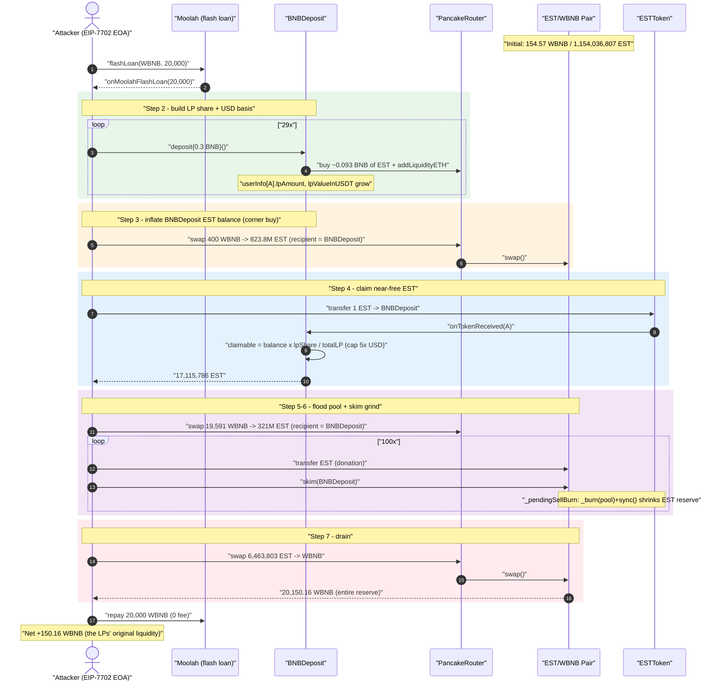
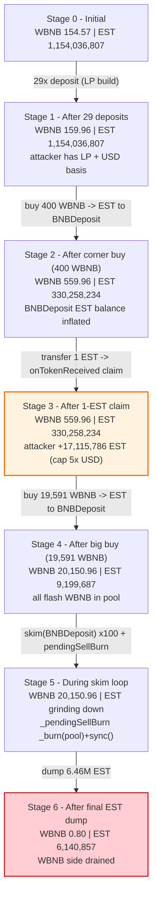
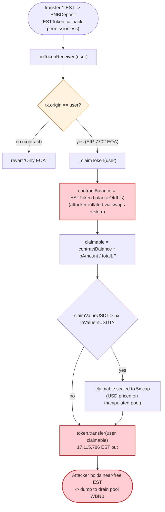
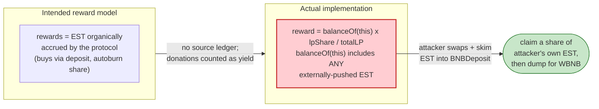

# EST / BNBDeposit Exploit — `skim()`-Fed Proportional Reward Drain + AMM Reserve Manipulation

> **Vulnerability classes:** vuln/logic/incorrect-order-of-operations · vuln/oracle/spot-price

> One-line summary: an attacker uses a flash loan to over-fund the `BNBDeposit` reward contract with EST tokens (via PancakeSwap `skim()` and direct swaps), abuses its `balance × lpShare / totalLP` proportional `claimToken` payout to mint itself ~17M EST nearly for free, then dumps that EST to drain the **entire WBNB side** of the EST/WBNB pool — walking off with the pool's original honest liquidity.

> **Reproduction:** the PoC compiles & runs in an isolated Foundry project at
> [this project folder](.) (the umbrella DeFiHackLabs repo contains many
> unrelated PoCs that do not all compile, so this one was extracted).
> Full verbose trace: [output.txt](output.txt).
> Verified vulnerable sources: [BNBDeposit.sol](sources/BNBDeposit_E71547/BNBDeposit.sol) and [ESTToken.sol](sources/ESTToken_D4524B/ESTToken.sol).

---

## Key info

| | |
|---|---|
| **Loss** | **150.16 WBNB** (~150.2 WBNB per the incident header) — the entire WBNB reserve of the EST/WBNB PancakeSwap pair |
| **Vulnerable contracts** | `BNBDeposit` — [`0xE71547170c5ad5120992B85Cf1288FAb23d29A61`](https://bscscan.com/address/0xE71547170c5ad5120992B85Cf1288FAb23d29A61#code) (proportional reward payout) and `ESTToken` — [`0xD4524Be41cd452576aB9FF7b68a0b89aF8498a91`](https://bscscan.com/address/0xD4524Be41cd452576aB9FF7b68a0b89aF8498a91#code) (LP-burn / pendingSellBurn) |
| **Victim pool** | EST/WBNB pair — [`0x74986cD86CAf54961dd70eEdcAF7cB3FE813c0B9`](https://bscscan.com/address/0x74986cD86CAf54961dd70eEdcAF7cB3FE813c0B9) (`token0 = WBNB`, `token1 = EST`) |
| **Attacker EOA / contract** | [`0xCF300DE6F177ec10DB0d7f756ced3Ae2D2203BFd`](https://bscscan.com/address/0xCF300DE6F177ec10DB0d7f756ced3Ae2D2203BFd) (the PoC reproduces with an EIP-7702-delegated EOA) |
| **Flash-loan source** | `Moolah` — [`0x8F73b65B4caAf64FBA2aF91cC5D4a2A1318E5D8C`](https://bscscan.com/address/0x8F73b65B4caAf64FBA2aF91cC5D4a2A1318E5D8C) (20,000 WBNB, no fee) |
| **Attack tx** | [`0x2f1c33eaaaace728f6101ff527793387341021ef465a4a33f53a0037f5bd1626`](https://bscscan.com/tx/0x2f1c33eaaaace728f6101ff527793387341021ef465a4a33f53a0037f5bd1626) |
| **Chain / block / date** | BSC / fork at block **89,060,336** (attack tx in block 89,060,337) / ~2026-03-27 |
| **Compiler** | Solidity v0.8.31, optimizer enabled, 200 runs |
| **Bug class** | Manipulable proportional reward (`balance × share / total`) + un-compensated AMM reserve removal via `skim()` / token-side `_burn(pool)+sync()` |

---

## TL;DR

`BNBDeposit` is a referral/LP-staking contract for the EST token. When a user transfers exactly **1 EST** to it, the EST token calls back `BNBDeposit.onTokenReceived()`, which pays the user a reward of

```
claimable = ESTToken.balanceOf(BNBDeposit) * userLpAmount / totalLP        (capped at 5× the user's USD cost basis)
```

The payout is proportional to the contract's **current** EST balance, with **no accounting of where that EST came from**. An attacker can therefore inflate `ESTToken.balanceOf(BNBDeposit)` with EST it pushes in from the outside (router swaps with `recipient = BNBDeposit`, and repeated PancakeSwap `skim(BNBDeposit)` calls) and then trigger a single claim that hands the attacker a huge, almost-free pile of EST — bounded only by a soft `5× USD value` cap that the attacker satisfies with a tiny real deposit.

Wrapped around this is a classic AMM drain: the attacker first floods the EST/WBNB pool with 20,000 WBNB (flash-loaned), uses the inflated-balance reward path to obtain ~17M EST nearly for free, and finally dumps **6.46M EST** back into the pool to pull out the **entire 20,150 WBNB reserve**. After repaying the 20,000 WBNB flash loan, the attacker keeps **150.16 WBNB** — precisely the pool's original honest liquidity.

The EOA-only guard (`require(tx.origin == user, "Only EOA")` in `onTokenReceived`) is bypassed in the PoC with an **EIP-7702 delegation**, letting the attacker's EOA itself run the attack contract's code while still appearing as a plain EOA.

---

## Background — what the protocol does

The system has two in-scope contracts plus a standard PancakeSwap V2 pair.

### `ESTToken` ([source](sources/ESTToken_D4524B/ESTToken.sol))

A fee-on-transfer ERC20 (`_tTotal = 1,300,000,000 EST`, 18 decimals) with three relevant behaviours:

- **5% transfer fee** (`totalFee = 5`) routed to a fee wallet ([ESTToken.sol:497-506](sources/ESTToken_D4524B/ESTToken.sol#L497-L506)).
- **Delayed sell-burn (`_pendingSellBurn`)** — on a sell, the post-tax amount entering the pair is recorded; on the **next non-buy transfer** it is `_burn`ed straight out of the pair's balance and the pair is `sync()`ed ([ESTToken.sol:418-437](sources/ESTToken_D4524B/ESTToken.sol#L418-L437)).
- **`autoBurnLiquidityPairTokens()`** — a periodic 0.08% LP burn (half real-burn, half to `burnReceiver = BNBDeposit`) + `sync()` ([ESTToken.sol:526-558](sources/ESTToken_D4524B/ESTToken.sol#L526-L558)).
- A **1-EST callback hook**: any transfer of exactly `1e18` EST to `depositContract` calls `BNBDeposit.onTokenReceived(from)` ([ESTToken.sol:519-521](sources/ESTToken_D4524B/ESTToken.sol#L519-L521)).

### `BNBDeposit` ([source](sources/BNBDeposit_E71547/BNBDeposit.sol))

A "deposit BNB → auto-build LP → earn EST rewards (up to 5× your USD value)" referral contract:

- `deposit()` ([BNBDeposit.sol:192-245](sources/BNBDeposit_E71547/BNBDeposit.sol#L192-L245)): takes `minDeposit..maxDeposit` BNB (0.01–0.2 ETH config; **0.3 ETH `maxDeposit` at the fork block**), distributes 26% / 8% / 4% as bonuses, then uses 62% to buy EST and `addLiquidityETH` into the EST/WBNB pair, crediting `userInfo[user].lpAmount` and `lpValueInUSDT`.
- `claimToken()` / `onTokenReceived()` → `_claimToken()` ([BNBDeposit.sol:314-341](sources/BNBDeposit_E71547/BNBDeposit.sol#L314-L341)): pays EST proportional to the depositor's LP share of the contract's **current** EST balance, capped at 5× their recorded USD value.

On-chain parameters at the fork block (read from the trace):

| Parameter | Value |
|---|---|
| `maxDeposit` | **0.3 BNB** |
| `claimInterval` | 1 day |
| `claim cap` | **5× `lpValueInUSDT`** |
| Pool reserves (start) | **154.57 WBNB / 1,154,036,807 EST** |
| EST held by `BNBDeposit` (start) | ~10,044,135 EST (pre-existing) |
| Flash-loan available (Moolah WBNB) | ≥ 20,000 WBNB, **0 fee** |

---

## The vulnerable code

### 1. `BNBDeposit` pays rewards from its raw EST balance — `balance × share / total`

```solidity
// BNBDeposit.sol:303-341
function onTokenReceived(address user) external {
    require(!_locked, "Reentrant");
    require(msg.sender == address(token), "Only token");
    require(tx.origin == user, "Only EOA");                 // ← bypassed via EIP-7702
    require(userInfo[user].lpAmount > 0, "No LP");
    require(userInfo[user].claimedValueInUSDT < userInfo[user].lpValueInUSDT * 5, "...5x limit");
    _locked = true;
    _claimToken(user);
    _locked = false;
}

function _claimToken(address user) internal {
    UserInfo storage info = userInfo[user];
    require(block.timestamp >= info.lastClaimTime + claimInterval, "Claim too frequent");

    uint256 contractBalance = token.balanceOf(address(this));         // ⚠️ attacker-inflatable
    uint256 claimable = contractBalance * info.lpAmount / totalLP;     // ⚠️ proportional to raw balance
    require(claimable > 0, "Nothing to claim");

    uint256 claimValueUSDT = _getTokenValueInUSDT(claimable);          // ⚠️ priced via the manipulated pool

    uint256 maxValue = info.lpValueInUSDT * 5;                         // soft cap (attacker tops up cheaply)
    if (info.claimedValueInUSDT + claimValueUSDT > maxValue) {
        uint256 remainingValue = maxValue - info.claimedValueInUSDT;
        claimable = claimable * remainingValue / claimValueUSDT;
        claimValueUSDT = remainingValue;
    }
    ...
    token.transfer(user, claimable);                                  // ⚠️ pays out EST
}
```

[BNBDeposit.sol:314-341](sources/BNBDeposit_E71547/BNBDeposit.sol#L314-L341)

The reward is a function of `token.balanceOf(this)` — a quantity **anyone can increase** by sending EST to the contract. There is no internal "rewards owned vs. rewards externally donated" ledger, so externally-pushed EST (router swaps with `recipient = BNBDeposit`, or `pair.skim(BNBDeposit)`) is treated as claimable yield.

### 2. EST lets the pair's reserve be removed without removing WBNB (`_pendingSellBurn`)

```solidity
// ESTToken.sol:418-437
if (_pendingSellBurn > 0 && !ammPairs[from] && uniswapV2Pair != address(0) && _tTotal > minSupply) {
    uint256 burnAmount = _pendingSellBurn;
    _pendingSellBurn = 0;
    uint256 pairBalance = _tOwned[uniswapV2Pair];
    uint256 maxBurn = pairBalance / 10;                  // up to 10% of the pair per burn
    if (burnAmount > maxBurn) burnAmount = maxBurn;
    ...
    _tOwned[uniswapV2Pair] = _tOwned[uniswapV2Pair].sub(burnAmount);
    _tTotal = _tTotal.sub(burnAmount);
    emit Transfer(uniswapV2Pair, address(0), burnAmount);
    IUniswapV2Pair(uniswapV2Pair).sync();                // ⚠️ deletes EST from the pair, no WBNB out
}
```

[ESTToken.sol:418-437](sources/ESTToken_D4524B/ESTToken.sol#L418-L437)

Each skim-loop iteration sells EST (recording `_pendingSellBurn`), then the very next non-pair transfer executes a `_burn(pool) + sync()` — repeatedly shrinking the pool's EST side while the WBNB side stays put. That, plus the final dump, collapses the constant product in the attacker's favour.

### 3. The 1-EST callback wires steps 1 and 2 together

```solidity
// ESTToken.sol:519-521
if (to == depositContract && depositContract != address(0) && amount == 1 * 10 ** uint256(_decimals)) {
    IBNBDeposit(depositContract).onTokenReceived(from);
}
```

[ESTToken.sol:519-521](sources/ESTToken_D4524B/ESTToken.sol#L519-L521)

A single 1-EST transfer to `BNBDeposit` triggers the (now-inflated) reward payout, so the attacker controls *exactly when* the claim happens — after it has loaded `BNBDeposit` with EST.

---

## Root cause — why it was possible

1. **Reward = `balance × share / totalLP` with no source accounting.** `_claimToken` reads `token.balanceOf(this)` directly. Any EST sent in from outside — by a swap whose recipient is the contract, or by `pair.skim(BNBDeposit)` — counts as distributable yield. The attacker therefore "pre-pays" itself by dumping cheaply-obtained EST into the contract and then claiming a share of it back.
2. **The 5× USD cap is priced against a pool the attacker controls.** `claimValueUSDT` is computed by `router.getAmountsOut` over the *current* EST/WBNB reserves, which the attacker has already manipulated. Combined with a tiny genuine deposit (29 × 0.3 BNB), the cap is no real limit on the EST quantity drained.
3. **The token can delete the pool's reserve without compensation.** `_pendingSellBurn`'s `_burn(pool, …) + sync()` removes EST from the pair while no WBNB leaves, breaking `x·y = k` exactly like an un-compensated reserve burn. `skim()` plus this token behaviour is the drain engine.
4. **Permissionless, attacker-timed trigger.** The 1-EST callback and `skim()` are both permissionless, so the attacker chooses the moment of maximum advantage.
5. **EOA guard is not a real defense.** `require(tx.origin == user)` is bypassed with **EIP-7702** account delegation, which lets the attacker's EOA execute arbitrary contract code while remaining a plain externally-owned account.

---

## Preconditions

- A flash-loan source for WBNB with no/low fee (Moolah supplies 20,000 WBNB at **0 fee**).
- The attacker can call `BNBDeposit.deposit()` to accrue a small genuine `lpAmount` / `lpValueInUSDT` (gives it a non-zero LP share and a USD cost basis for the 5× cap).
- `block.timestamp ≥ lastClaimTime + claimInterval` for the attacker's account (fresh account ⇒ `lastClaimTime = 0`, trivially satisfied).
- EIP-7702-capable execution to satisfy `tx.origin == user` while running the attack logic from the EOA (the PoC delegates the EOA to the `Attacker` contract via `vm.signAndAttachDelegation`).

---

## Attack walkthrough (with on-chain numbers from the trace)

The pair has `token0 = WBNB`, `token1 = EST`, so **`reserve0 = WBNB`, `reserve1 = EST`**. All reserve figures below are taken from `Sync` events in [output.txt](output.txt).

| # | Step | WBNB reserve | EST reserve | Effect |
|---|------|-----------:|------------:|--------|
| 0 | **Initial pool** ([:1609](output.txt#L1609)) | 154.57 | 1,154,036,807 | Honest pool. |
| 1 | **Flash loan 20,000 WBNB** from Moolah ([:1642](output.txt#L1642)) | — | — | Working capital, repaid at end (0 fee). |
| 2 | **29× `deposit()` (0.3 BNB each)** — each buys ~0.093 BNB of EST + adds LP to the pair, crediting attacker LP ([:1665](output.txt#L1665), [:1804](output.txt#L1804)) | →159.96 | ~1,154,036,807 | Attacker gains `lpAmount` + USD basis; `BNBDeposit` accrues EST. |
| 3 | **Corner buy: swap 400 WBNB → 823,778,573 EST → `BNBDeposit`** ([:5933](output.txt#L5933)) | 559.96 | 330,258,234 | EST pushed into `BNBDeposit`, pool EST drained. |
| 4 | **Send 1 EST → `BNBDeposit`** ⇒ `onTokenReceived` ⇒ `_claimToken` pays attacker **17,115,786 EST** (USD value 16,420, hitting the 5× cap) ([:5969-5990](output.txt#L5969-L5990)) | 559.96 | 330,258,234 | Near-free EST minted to the attacker from the inflated balance. |
| 5 | **Big buy: swap 19,591 WBNB → 321,058,546 EST → `BNBDeposit`** ([:6001](output.txt#L6001)) | **20,150.96** | 9,199,687 | All flash-loaned WBNB now sits in the pool; `BNBDeposit` EST balance ~1.13B. |
| 6 | **`skim()` loop ×100** — each: `est.transfer(pair, ~10%)` (records `_pendingSellBurn`) → `pair.skim(BNBDeposit)` → next transfer burns EST out of the pair + `sync()` ([:6058 onward](output.txt#L6058)) | 20,150.96 | shrinks (e.g. 8,279,718 after iter 1 → …) | Repeatedly feeds `BNBDeposit` and grinds the pool's EST side down. |
| 7 | **Final dump: swap 6,463,803 EST → 20,150.16 WBNB to attacker** ([:11078](output.txt#L11078)) | **0.80** | 6,140,857 (post-burn/tax) | Drains the **entire WBNB reserve**. |
| 8 | **Repay 20,000 WBNB** to Moolah ([:11137](output.txt#L11137)) | — | — | Loan settled, 0 fee. |

The single final sell of 6.46M EST yielded `amount0Out = 20,150.16 WBNB` ([:11129](output.txt#L11129)), emptying the WBNB side from 20,150.96 → 0.80 WBNB.

### Profit accounting (WBNB)

| Direction | Amount (WBNB) |
|---|---:|
| Flash-loan in (Moolah) | 20,000.00 |
| Spent — 29× deposit funding (unwrapped) | ~9.00 (8.7 deposited + ~0.3 retained) |
| Spent — corner buy | 400.00 |
| Spent — big buy | 19,591.00 |
| **Received — final EST dump** | **20,150.16** |
| Flash-loan repay (Moolah) | −20,000.00 |
| **Net profit (attacker WBNB balance after)** | **+150.16** |

Measured by the PoC's balance log: `Attacker Before = 0`, `Attacker After = 150.157862314223097198 WBNB` ([:1564-1565](output.txt#L1564-L1565)). The profit equals the pool's original **154.57 WBNB** of honest liquidity less the few WBNB consumed by EST transfer fees and the deposit distribution — i.e. the attacker walked off with essentially all of the LPs' WBNB.

---

## Diagrams

### Sequence of the attack



### Pool / state evolution



### The flaw inside `BNBDeposit._claimToken`



### Why the reward is theft: balance source matters



---

## Why each magic number

- **20,000 WBNB flash loan:** working capital to flood the pool so the final EST dump can pull out a large WBNB amount; fully repaid (Moolah charged 0 fee).
- **29 × 0.3 BNB deposits:** the minimum genuine stake needed to obtain a non-zero `lpAmount`/`lpValueInUSDT` (so the `lpAmount > 0` and `5× USD` checks pass) — the proportional payout then scales off the inflated balance, not this deposit.
- **400 WBNB corner buy → `BNBDeposit`:** pre-loads `BNBDeposit` with ~823.8M EST so the `balance × share / total` claim returns a large number before the 1-EST trigger.
- **1 EST transfer:** exact `1e18` to fire the `onTokenReceived` callback ([ESTToken.sol:519](sources/ESTToken_D4524B/ESTToken.sol#L519)) at the attacker-chosen moment.
- **19,591 WBNB big buy:** brings the pool's WBNB reserve to ~20,150 WBNB, the prize the final dump extracts.
- **`skim()` ×100 with `amount = pairESTbalance * 10/95`:** repeatedly donates EST to the pair and `skim`s it to `BNBDeposit`, while the EST token's `_pendingSellBurn` burns EST out of the pair (`maxBurn = pairBalance/10`) and `sync()`s — grinding the EST reserve down so the final dump is maximally profitable.

---

## Remediation

1. **Never compute rewards from a raw `balanceOf(this)`.** Track distributable rewards in an internal accumulator that only increases through controlled, protocol-owned inflows. EST pushed in from a swap or `skim()` must not be claimable. (`_claimToken` at [BNBDeposit.sol:314-341](sources/BNBDeposit_E71547/BNBDeposit.sol#L314-L341).)
2. **Do not price the reward cap off a live, manipulable pool.** `_getTokenValueInUSDT` ([:409-420](sources/BNBDeposit_E71547/BNBDeposit.sol#L409-L420)) uses spot `getAmountsOut`; use a TWAP/oracle or a fixed USD basis recorded at deposit time.
3. **Remove the un-compensated pool burn.** `_pendingSellBurn`'s `_burn(pool, …) + sync()` ([ESTToken.sol:431-436](sources/ESTToken_D4524B/ESTToken.sol#L431-L436)) and `autoBurnLiquidityPairTokens` ([:546-556](sources/ESTToken_D4524B/ESTToken.sol#L546-L556)) delete one side of the reserve. Burns must only destroy protocol-owned tokens, never the pair's balance with a forced `sync()`.
4. **Do not rely on `tx.origin == user` as an access control.** EIP-7702 (and historically phishing) defeats EOA checks. Use explicit allow-lists or signature-bound authorization tied to the actual claimant.
5. **Make rewards pull-based and rate-limited.** A single permissionless callback that pays out a balance-proportional reward, callable at attacker-chosen timing, is a red flag; gate it and bound per-call payout to genuinely accrued, protocol-owned yield.

---

## How to reproduce

The PoC was extracted into a standalone Foundry project:

```bash
_shared/run_poc.sh 2026-03-EST_exp -vvvvv
```

- **RPC:** a **BSC archive** endpoint is required (fork block 89,060,336). `foundry.toml` uses `https://bsc-mainnet.public.blastapi.io`, which serves historical state at that block. `evm_version = 'cancun'` is required for the EIP-7702 `vm.signAndAttachDelegation` cheatcode used to bypass the EOA guard.
- **Local imports copied in:** `basetest.sol` and `tokenhelper.sol` (siblings of the original test under `src/test/`) were copied into the project root so `import "../basetest.sol"` resolves; the shared `interface.sol` is at the project root.
- **Result:** `[PASS] testExploit()` with the attacker's WBNB balance going `0 → 150.157862314223097198`.

Expected tail:

```
Ran 1 test for test/EST_exp.sol:EST_exp
[PASS] testExploit() (gas: 13788325)
  Attacker Before exploit WBNB Balance: 0.000000000000000000
  Attacker After exploit WBNB Balance: 150.157862314223097198
Suite result: ok. 1 passed; 0 failed; 0 skipped
```

---

*Reference: DeFiHackLabs — EST / BNBDeposit, BSC, ~150.2 WBNB. Trace: [output.txt](output.txt). Sources: [BNBDeposit.sol](sources/BNBDeposit_E71547/BNBDeposit.sol), [ESTToken.sol](sources/ESTToken_D4524B/ESTToken.sol), [PancakePair.sol](sources/PancakePair_74986c/PancakePair.sol).*
