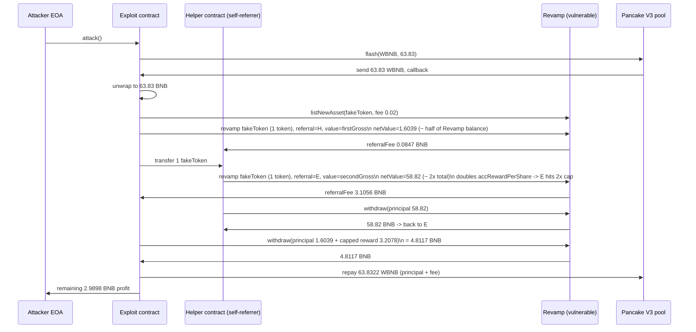
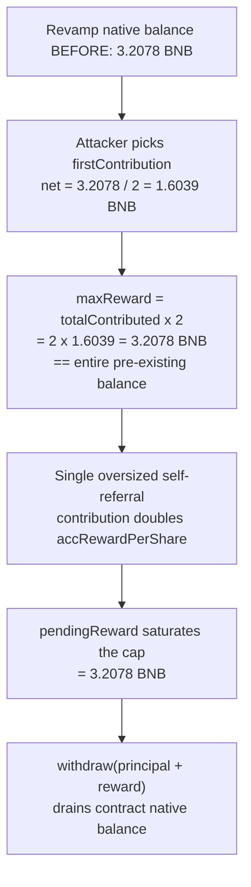

# Revamp referral-reward drain — a self-referral that pays contributors out of existing pool BNB

> **Vulnerability classes:** vuln/logic/reward-calculation · vuln/defi/flash-loan-attack · vuln/access-control/missing-validation
> **Reproduction:** the PoC compiles & runs in an isolated Foundry project at [this project folder](.). Full verbose trace: [output.txt](output.txt). Vulnerable contract is verified on BscScan and was fetched to [sources/Revamp_46280c/Revamp.sol](sources/Revamp_46280c/Revamp.sol) (compiler v0.8.30, optimizer disabled).

---

## Key info

| | |
|---|---|
| **Loss** | 2.99 BNB (3.2078 BNB was the contract's entire native balance; ~2.9898 BNB is net attacker profit after flash-loan repayment) |
| **Vulnerable contract** | `Revamp` — [`0x46280C1A2e17CfC151f50a885363408368BB163A`](https://bscscan.com/address/0x46280c1a2e17cfc151f50a885363408368bb163a) |
| **Attacker EOA** | [`0x42579d63bd5945fcfde5adff4edc40c34869914e`](https://bscscan.com/address/0x42579d63bd5945fcfde5adff4edc40c34869914e) |
| **Attack contract** | [`0x8b959ecdd652dee3272f1c9684dbf42ae671eb40`](https://bscscan.com/address/0x8b959ecdd652dee3272f1c9684dbf42ae671eb40) |
| **Attack tx** | [`0xa0ff1de61793b0915038e644a2b45372be8d49e1060b6b2cd5e3482d7d4325ba`](https://bscscan.com/tx/0xa0ff1de61793b0915038e644a2b45372be8d49e1060b6b2cd5e3482d7d4325ba) |
| **Chain / block / date** | BNB Smart Chain / 87,423,340 / 2026-03 |
| **Compiler** | Solidity v0.8.30+commit.73712a01 (no optimizer, 200 runs) |
| **Bug class** | A permissionless user can list a worthless self-issued token, then exploit the per-share reward accounting plus a referral kickback to convert the contract's *pre-existing* native balance into personal reward that is capped at `2 × principal`. |

## TL;DR

`Revamp` is a "revamp" / contribution protocol on BSC. Anyone can pay a listing fee to register an ERC-20, after which users call `revamp(token, tokenAmount, referral)` to send native BNB in exchange for the listed token (which is burned/transferred to the contract). Each native contribution is split into fees (native, shareholding, referral) and a `netValue` that is added to a global dividend pool. The pool accrues "reward" to every contributor pro-rata to their `totalContributed`, capped at `2 × totalContributed` per user. Users withdraw their principal plus accrued/capped reward via `withdraw()`.

The flaw is twofold. First, `listNewAsset` performs **no quality/liquidity check** on the listed token — it only reads ERC-20 metadata (`decimals()`, `name()`, `symbol()`) and trusts a `safeTransferFrom` for the contribution. An attacker can therefore list a freshly minted token of zero value and "revamp" it. Second, the **referral reward and the per-share reward pool are both funded out of `msg.value` of the *current* contribution**, but `pendingReward()`'s cap is `2 × principal`, which is independent of how the pool was funded. By contributing an amount sized to half the contract's existing BNB balance, an attacker's `2 × principal` reward cap equals the entire pre-existing native balance; a single oversized self-referral contribution then drives the attacker's accrued reward up to that cap, after which a `withdraw()` drains the contract.

In the reproduced fork run, the contract held 3.2078 BNB before the attack [output.txt:1565]. The attacker borrowed ~63.83 WBNB from a Pancake V3 pool, listed a fake token, contributed ~1.6039 BNB (net) with a self-controlled helper as referrer, then had the helper contribute ~58.82 BNB (net) using the attacker as referrer. That oversized contribution minted ~3.2078 BNB of accrued-but-capped reward to the attacker and a ~3.1056 BNB referral kickback the same way. Both controlled addresses withdrew principal + reward, repaid the flash loan, and walked away with **2.989830366765223040 BNB of net profit** [output.txt:1566,1924].

## Background — what Revamp does

`Revamp` markets itself as a contribution / "revamping" platform. The intended lifecycle is:

1. A project owner calls `listNewAsset(token, rate, logoUrl)` paying a `listingFee` to register an ERC-20. The contract stores its metadata and a fixed `rate`.
2. A user calls `revamp(token, tokenAmount, referral)` sending native BNB and `tokenAmount` of the listed token. The token is `safeTransferFrom`'d into the contract (intended to be "burned"/locked), while the BNB is split:
   - `nativeFee`, `shareholdingFee`, and `referralFee` are forwarded to their respective recipients (the referrer gets a kickback),
   - the remainder `netValue` is added to a global dividend pool.
3. Every contribution increases `accRewardPerShare` pro-rata to `netValue / totalNativeContributed`. Each contributor accrues reward against their `totalContributed`, tracked with a MasterChef-style `rewardDebt`.
4. Reward is capped per user at `2 × totalContributed` (see `pendingReward`); users withdraw principal plus reward via `withdraw()`, or reinvest via `reinvest()`.

The economic assumption is that users pay real BNB and burn a *genuinely valuable* token, so the dividend pool genuinely grows. The exploit breaks that assumption: because listing requires no token-quality gate, the listed asset can be worthless, so "paying BNB" is effectively a self-transfer that still crediting `netValue` to the pool.

## The vulnerable code

All code below is from the verified [sources/Revamp_46280c/Revamp.sol](sources/Revamp_46280c/Revamp.sol).

### `listNewAsset` — no token-quality gate

[Revamp.sol:836-866](sources/Revamp_46280c/Revamp.sol) — the function only checks the listing fee and reads metadata. It never checks token supply, holder count, liquidity, or whether `msg.sender` controls the token:

```solidity
function listNewAsset(
    address token,
    uint256 rate,
    string calldata logoUrl
) external payable nonReentrant {
    require(msg.value >= listingFee, "Fee too low");
    require(rate > 0, "Rate > 0");
    require(token != address(0), "Bad token");
    require(tokenInfos[token].lister == address(0), "Already listed");

    IERC20Metadata erc = IERC20Metadata(token);
    uint8 _decimals = erc.decimals();
    string memory _name = erc.name();
    string memory _symbol = erc.symbol();
    // ... stored as-is; fee forwarded to feeRecipient ...
}
```

Any freshly minted ERC-20 with `decimals/name/symbol` passes. The attacker's `FakeRevampToken` (a 2-token toy contract in the PoC) qualifies.

### `revamp` — referral kickback and pool growth funded by the same `msg.value`

[Revamp.sol:892-943](sources/Revamp_46280c/Revamp.sol) — the entire `netValue` (what remains after the three fees) is what grows the dividend pool and what the referrer kickback is computed from:

```solidity
uint256 nativeFee   = (msg.value * nativeFeePercent)   / 10000;
uint256 shareFee    = (msg.value * shareholdingFeePercent) / 10000;
uint256 referralFee = (msg.value * referralFeePercent) / 10000;
uint256 netValue = msg.value - nativeFee - shareFee - referralFee;

if (totalNativeContributed > 0) {
    accRewardPerShare += (netValue * PRECISION) / totalNativeContributed;
}

UserInfo storage user = users[msg.sender];
user.totalContributed += netValue;
totalNativeContributed += netValue;
user.rewardDebt = (user.totalContributed * accRewardPerShare) / PRECISION;
// ...
if (referralFee > 0 && ref != address(0)) {
    (bool successRef, ) = payable(ref).call{value: referralFee}("");
    require(successRef, "Referral pay fail");
    emit ReferralRewardPaid(msg.sender, ref, referralFee);
}
```

Two critical properties: (a) the referrer is set on the user's **first** `revamp` and cannot be changed afterward, so a self-controlled helper can be wired in as the attacker's referrer (and vice-versa); (b) the kickback is paid in *native BNB taken from the contract's current balance*, which includes the pre-existing treasury, not just the attacker's `msg.value`.

### `pendingReward` — the 2× cap that becomes the drain ceiling

[Revamp.sol:1001-1012](sources/Revamp_46280c/Revamp.sol):

```solidity
function pendingReward(address userAddr) public view returns (uint256) {
    UserInfo storage user = users[userAddr];
    uint256 accumulated = (user.totalContributed * accRewardPerShare) / PRECISION;
    uint256 rawPending = accumulated > user.rewardDebt ? accumulated - user.rewardDebt : 0;
    uint256 maxReward = user.totalContributed * 2;     // <-- 2x principal cap
    uint256 used = user.claimedSoFar;
    if (used >= maxReward) return 0;
    uint256 leftover = maxReward - used;
    return rawPending > leftover ? leftover : rawPending;
}
```

The cap is `2 × totalContributed`. If the attacker picks `firstContribution = (contractBalance / 2)` (grossed up for fees), then `2 × netFirstContribution ≈ contractBalance`. The cap *is* the entire pre-existing native balance, and a single large self-referral contribution pushes `rawPending` above the cap so `pendingReward` returns exactly `contractBalance`. (Verified arithmetically: `2 × 1.603915222411113821e18 = 3.207830444822227642e18`, matching the pre-attack contract balance of 3.207830444822227643e18 [output.txt:1565].)

### `withdraw` — pays out reward then principal from native balance

[Revamp.sol:945-981](sources/Revamp_46280c/Revamp.sol) — `withdraw` is `nonReentrant` and splits the requested `amount` into `fromReward` (capped by `pendingReward`) and `fromPrincipal`. It pays a small `claimFee` on the reward portion and forwards `toUser` in native BNB:

```solidity
uint256 toUser = (fromReward - feePart) + fromPrincipal;
user.claimedSoFar += fromReward;
if (fromPrincipal > 0) {
    user.totalContributed -= fromPrincipal;
    totalNativeContributed -= fromPrincipal;
}
// ...
(bool ok, ) = payable(msg.sender).call{value: toUser}("");
```

Because `toUser` is paid from `address(this).balance` with no internal balance ledger, the contract's entire native holdings are fair game. The principal withdrawal simply returns the attacker's own contributed BNB, and the reward withdrawal returns pre-existing treasury BNB.

## Root cause — why it was possible

1. **No token-quality gate in `listNewAsset`.** Listing only requires an ERC-20 interface and a fee. A worthless attacker-minted token qualifies, so the "burn a real token" economic assumption is void.
2. **Reward cap is a function of *principal*, not of pool sustainability.** `maxReward = totalContributed × 2` is computed from the user's own contribution size, which the attacker controls. By sizing the first contribution to half the contract's BNB balance, the attacker makes the cap equal the entire treasury.
3. **Per-share reward accrual is manipulable by a single oversized contribution.** `accRewardPerShare += netValue * PRECISION / totalNativeContributed` — a contribution of `netValue ≈ 2 × totalNativeContributed` doubles `accRewardPerShare` in one step, instantly saturating every prior contributor's `rawPending`. The attacker's prior contributor (themselves) immediately hits the cap.
4. **Referral kickback + reward are both paid from `address(this).balance` with no internal accounting.** The contract never reconciles "fees and rewards payable" against "actual native balance set aside for payouts." Once the inflated reward and kickback are recorded, `withdraw` mechanically sends BNB from the shared pot.
5. **Self-referral is possible.** The referrer is bound on first contribution and only excludes `msg.sender`; two attacker-controlled contracts can refer each other, routing the kickback back to the attacker.
6. **No flash-loan defense.** The whole sequence executes inside one transaction funded by a Pancake V3 flash loan, so the attacker needs no upfront capital.

## Preconditions

- Permissionless — anyone can list a token and call `revamp`/`withdraw`. No privileged role required.
- The contract must hold a non-zero native BNB balance (the dividend pool / treasury). At fork block 87,423,340 it held 3.2078 BNB [output.txt:1565].
- A flash loan source for BNB is needed (the PoC uses the Pancake V3 WBNB/USDT pool `0x172fcD41E0913e95784454622d1c3724f546f849`); the loan is repaid inside the same transaction.

## Attack walkthrough (with on-chain numbers from the trace)

The PoC runs inside a single `RevampExploit.attack()` that triggers a Pancake V3 flash loan. All numbers are from [output.txt](output.txt).

| # | Step | Amount (BNB, 18 dp) | Trace ref |
|---|------|---------------------|-----------|
| 0 | Borrow WBNB from Pancake V3 pool | +63.825831631291807246 (flash) | [output.txt:1606] |
| 1 | Unwrap WBNB → BNB to fund native paths | 63.8258… | [output.txt:1615] |
| 2 | Pay `listingFee`, list `FakeRevampToken` (rate 18) | 0.02 (listing fee) | [output.txt:1664] |
| 3 | `revamp` #1 (attacker as caller, helper as referrer). Gross `msg.value` grossed up so `netValue = 3.2078/2` | netValue 1.603915222411113821 | [output.txt:1724] |
| 3a | Referral kickback to helper (from this `msg.value`) | 0.084684013854863454 | [output.txt:1723] |
| 4 | Transfer 1 fake token to helper; helper calls `revamp` #2 (helper as caller, attacker as referrer). `netValue = 2 × (totalNative + first_net) ≈ 58.82` | netValue 58.820207332422227642 | [output.txt:1808] |
| 4a | This single contribution doubles `accRewardPerShare` and pushes attacker's `pendingReward` to its `2 × 1.6039… = 3.2078…` cap. Referral kickback to attacker | 3.105607567709726908 | [output.txt:1807] |
| 5 | Helper `withdraw`s its own principal (it has no accrued reward interest because it just contributed and `rewardDebt` was set to its full accumulated share) | 58.820207332422227642 | [output.txt:1841] |
| 6 | Attacker `withdraw(principal + pending)` = 1.6039… + 3.2078… | 4.811745667233341463 | [output.txt:1885] |
| 7 | Repay flash loan (principal + 1 bps fee): 63.8258… + 0.006382583163129181 | 63.832214214454936427 | [output.txt:1898] |
| 8 | Forward remaining BNB to attacker EOA | **2.989830366765223040 net profit** | [output.txt:1566,1929] |

Profit/loss accounting for the attacker (all controlled value):
- Inflows: principal returned 1.6039 (own) + 58.8202 (helper, same capital recycled) + capped reward 3.2078 + referral kickback 3.1056 ≈ 66.7375 BNB gross that touches the attacker's contracts.
- Outflows: flash-loan repayment 63.8322 BNB (principal 63.8258 + fee 0.00638), plus the listing fee 0.02 and the various protocol fees are taken out of `msg.value` before `netValue` and routed to the protocol's fee recipients — these are not recovered by the attacker.
- Net to attacker EOA after repaying the loan and fees: **2.989830366765223040 BNB** [output.txt:1566], drawn almost entirely from the 3.2078 BNB that was the contract's pre-existing balance.

## Diagrams





## Remediation

1. **Gate listed tokens on intrinsic value, not metadata.** Require that the listed token has verifiable external liquidity, a minimum holder/supply threshold, or that it is approved by governance. At minimum, do not let `listNewAsset` accept tokens whose entire supply is held by `msg.sender`.
2. **Do not fund the dividend pool from the contributor's own `msg.value`.** A "revamp" payout should be sourced from token-side value the contract actually receives and can monetize (e.g., swap the received token for the native asset via a trusted DEX and only credit the realized proceeds), not from raw `msg.value` that the attacker can recycle.
3. **Make the reward cap a function of pool solvency, not principal.** Cap a user's withdrawable reward at their pro-rata share of the *actual* native balance reserved for rewards, and maintain an internal `rewardReserve` ledger that is debited when rewards accrue and credited only from genuine external revenue. Never let recorded rewards exceed `address(this).balance` reserved for payouts.
4. **Break the self-referral loop.** Either disable referral relationships between addresses that are contract-created/controlled, or require the referrer to have an established on-chain contribution history before it can earn kickbacks. The `referralFee` should be paid from a budget that does not include prior contributors' principal.
5. **Reconcile accounting against balance.** Add an invariant check in `withdraw`/`revamp` that the sum of all `totalContributed` plus accrued rewards never exceeds the contract's reserved native balance; revert if a payout would breach it.
6. **Flash-loan hardening.** Since reward accrual is sensitive to a single contribution's size, consider limiting the per-transaction `netValue` growth of `accRewardPerShare` (e.g., TWAP-style smoothing) so a one-shot contribution cannot double the global share index.

## How to reproduce

The PoC runs fully **offline** via the shared anvil harness from the committed `anvil_state.json` (no RPC needed). The fork is BNB Smart Chain at block **87,423,340**. From the registry root, run:

```bash
_shared/run_poc.sh 2026-03-Revamp_exp -vvvvv
```

The suite reports `1 passed; 0 failed` with `[PASS] testExploit()`. Key balance lines from [output.txt](output.txt):

```
[PASS] testExploit() (gas: 5333934)
  Attacker Before exploit BNB Balance: 0.000000000000000000
  Revamp native balance before: 3.207830444822227643
  BNB profit: 2.989830366765223040
  Attacker After exploit BNB Balance: 2.989830366765223040
```

[output.txt:1562,1564,1565,1566,1567]

*Reference: https://x.com/DefimonAlerts/status/2034532544239088053*
