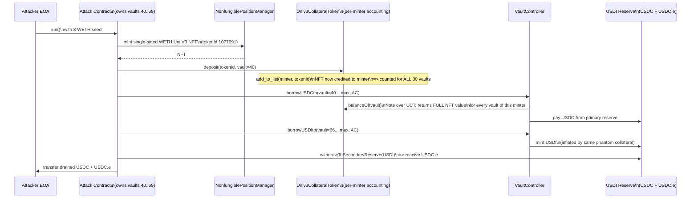

# Univ3CollateralToken — Uni V3 position counted as collateral for every vault owned by the same minter
> **Vulnerability classes:** vuln/logic/incorrect-state-transition · vuln/logic/state-update · vuln/access-control/broken-logic
> **Reproduction:** the PoC compiles & runs in an isolated Foundry project at [this project folder](.). Full verbose trace: [output.txt](output.txt). Vulnerable contract is verified on Optimism; verified source is vendored under [sources/Univ3CollateralToken_833a17/](sources/Univ3CollateralToken_833a17). The local anvil-fork replay reverts inside `Univ3CollateralToken.deposit` (a zero-address call into an unpopulated implementation slot); the on-chain exploit at the cited tx succeeded for ~57K USD — see *How to reproduce*.
---
## Key info
| | |
|---|---|
| **Loss** | ~57,000 USD (USDC + USDC.e drained from the USDI reserve) |
| **Vulnerable contract** | `Univ3CollateralToken` (proxy) — [`0x7131FF92a3604966d7D96CCc9d596F7e9435195c`](https://optimistic.etherscan.io/address/0x7131FF92a3604966d7D96CCc9d596F7e9435195c); implementation [`0x833A17FA29bc2772e4302823B7d39eDd7C4bB79a`](https://optimistic.etherscan.io/address/0x833A17FA29bc2772e4302823B7d39eDd7C4bB79a) |
| **Attacker EOA** | [`0x1020C949C1c8658cEf8e473dbD3631AfE68C1938`](https://optimistic.etherscan.io/address/0x1020C949C1c8658cEf8e473dbD3631AfE68C1938) |
| **Attack contract** | [`0x2fa6Fe6b5c8E372faBfC6eB8FA8118cB8fFC3f60`](https://optimistic.etherscan.io/address/0x2fa6Fe6b5c8E372faBfC6eB8FA8118cB8fFC3f60) |
| **Attack tx** | [`0x18e34ce214211afedb6008c0cd00d476ce71222643521dbff5e2b65cdb2ccb80`](https://optimistic.etherscan.io/tx/0x18e34ce214211afedb6008c0cd00d476ce71222643521dbff5e2b65cdb2ccb80) |
| **Chain / block / date** | Optimism / block 149,373,832 (fork) / 2026-03 |
| **Compiler** | `v0.8.9+commit.e5eed63a`, optimizer enabled, 200 runs |
| **Bug class** | `Univ3CollateralToken.balanceOf` and `deposit` index collateral by `vault.minter()` (the EOA/contract that owns the vaults) instead of per-vault, so one Uni V3 NFT deposited against a single vault is counted as collateral for **every** vault the same minter controls. |

## TL;DR

`Univ3CollateralToken` is the Uni-V3-position collateral adapter for a lending system (USDI / VaultController). When a user deposits a Uni V3 NFT into a vault, the contract appends the `tokenId` to an array keyed by `vault.minter()` — the minter's address — and `balanceOf(vault)` then sums the value of **every position in that minter's array**. Because a single minter can own arbitrarily many vaults (`VaultController.mintVault()` is permissionless), depositing one NFT inflates the borrowing power of *all* the minter's vaults simultaneously.

The attacker held 30 vaults (IDs 40–69, confirmed in the trace [output.txt:1637]). The protocol's USDI reserve held **44,218 USDC** of primary reserve and a USDC.e secondary reserve at the fork block [output.txt:1627]. The attacker:

1. Minted a single single-sided WETH Uni V3 position (3 WETH, no USDC.e side).
2. Deposited that one NFT against vault 40 via `Univ3CollateralToken.deposit`.
3. Because `balanceOf` keys off `vault.minter()`, every vault 40–69 now reported the *same* NFT as collateral, each granting a full single-vault borrowing capacity.
4. Borrowed USDC against the first vaults (`borrowUSDCto`) and minted USDI against the rest (`borrowUSDIto`), then burned the USDI for the reserve's USDC.e via `withdrawToSecondaryReserve`.

Net result: ~57K USD extracted against collateral that was counted up to 30 times. The assertions in the PoC encode the smoking gun — attacker USDC gain must exceed *twice* a single vault's capacity, and the combined USDC + USDC.e gain must exceed *four times* it [test/Univ3CollateralToken_exp.sol:97-100].

## Background — what the lending system does

The system is an over-collateralized stablecoin/credit protocol on Optimism. The relevant moving parts:

- **`VaultController`** (`0x05498574…`) mints per-user `Vault` contracts. Any address can call `mintVault()` repeatedly, so one minter may own many vaults. Each vault has a `minter()` and an `id()`. `vaultBorrowingPower(id)` aggregates the value of all collateral tokens registered to that vault, applies loan-to-value, and returns how much USDI/USDC the vault may borrow.
- **`USDI`** (`0x889be273…`) is the borrowable stable. It holds a **primary reserve** in native USDC (`0x0b2C639c…`, 6 decimals) and a **secondary reserve** in bridged USDC.e (`0x7F5c764c…`). `borrowUSDCto` draws directly from the primary reserve; `borrowUSDIto` mints USDI, and `withdrawToSecondaryReserve` lets a USDI holder redeem against the secondary (USDC.e) reserve.
- **`Univ3CollateralToken`** (`0x7131FF92…`) is an ERC20-upgradeable *wrapper* that represents Uni V3 LP positions as collateral. A vault's `tokenBalance` for this wrapper comes from the wrapper's custom `balanceOf(vault)`, which is supposed to report the USD value of the Uni V3 positions backing *that specific vault*.
- **`V3PositionValuator`** (`getValue(tokenId)`) prices a Uni V3 position in USDi using external oracles for the two underlying tokens plus the position's liquidity and tick range. Registered pools are whitelisted; unregistered positions price to zero.
- **`NftVaultController` + `VaultNft`** custody the actual ERC721. Each vault ID has a paired `VaultNft` that holds the deposited NFTs; the wrapper only tracks the *indexing* of which minter owns which `tokenId`.

The intended flow: a user mints a vault, deposits a Uni V3 NFT via `Univ3CollateralToken.deposit(tokenId, vaultId)`, the NFT is transferred into that vault's `VaultNft`, and the wrapper's `balanceOf(thatVault)` returns the position value so `VaultController` grants borrowing power against it. The flaw is that the wrapper tracks positions per **minter**, not per **vault**.

## The vulnerable code

From the verified implementation [sources/Univ3CollateralToken_833a17/contracts_lending_wrapper_Univ3CollateralToken.sol](sources/Univ3CollateralToken_833a17/contracts_lending_wrapper_Univ3CollateralToken.sol):

### `deposit` indexes the position under the minter, not under the vault

```solidity
function deposit(uint256 tokenId, uint96 vaultId) public nonReentrant {
    address univ3_vault_address = _nftVaultController.NftVaultAddress(vaultId);
    require(address(univ3_vault_address) != address(0x0), "invalid nft vault");

    _positionValuator.verifyPool(tokenId);

    IVault vault = IVault(_vaultController.vaultAddress(vaultId));
    add_to_list(vault.minter(), tokenId);          // <-- keyed by MINTER, not vaultId

    _underlying.transferFrom(_msgSender(), univ3_vault_address, tokenId);
}
```

The `tokenId` is pushed onto `_underlyingOwners[minter]`. The `univ3_vault_address` (the per-vault `VaultNft`) only receives the physical NFT custody; it is never used to scope the accounting. The minter-level array is the sole index of "what collateral backs this user."

### `balanceOf` sums the entire minter's array for every vault

```solidity
function balanceOf(address vault) public view override returns (uint256) {
    IVault V = IVault(vault);
    require(V.id() > 0, "Univ3CollateralToken: OnlyVaults");

    address account = V.minter();                  // <-- same minter for ALL their vaults
    uint256 totalValue = 0;
    for (uint256 i; i < _underlyingOwners[account].length; i++) {
        totalValue = totalValue + get_token_value(_underlyingOwners[account][i]);
    }
    return totalValue;                              // <-- returned for EVERY vault of that minter
}
```

Because `VaultController` calls the wrapper's `balanceOf(vaultAddress)` for each vault when computing `vaultBorrowingPower`, and because `vault.minter()` is identical across all of a minter's vaults, the **same** `_underlyingOwners[minter]` list — and thus the same deposited NFT — is credited to every single vault. There is no per-vault accounting anywhere in the wrapper.

### No per-vault deduplication in the array primitives

```solidity
function add_to_list(address vaultMinter, uint256 tokenId) internal {
    require(tokenId != 0, "invalid tokenId");
    _underlyingOwners[vaultMinter].push(tokenId);   // <-- no vaultId, no uniqueness check per vault
}
```

`deposit` also never records *which* vault a position was deposited into (the `vaultId` argument is used only to find the `VaultNft` for custody). The `transfer`/withdraw path similarly keys off `vault.minter()`, confirming the entire adapter is minter-scoped by design — a design that is safe only if each minter is constrained to one vault, which `mintVault()` does not enforce.

## Root cause — why it was possible

1. **Collateral accounting is keyed by `minter` instead of by vault.** `deposit` writes to `_underlyingOwners[vault.minter()]` and `balanceOf` reads from the same key. With one NFT in that array, *every* vault the minter owns sees the full collateral value. This is the load-bearing flaw.
2. **No uniqueness / single-credit constraint.** Nothing prevents the same `tokenId` from simultaneously backing N vaults. There is no per-vault balance map, no "this NFT is already counted for vault X" guard, and `add_to_list` is a blind `push`.
3. **Permissionless, unlimited vault minting.** `VaultController.mintVault()` lets any address create as many vaults as it wants. The attacker pre-created 30 vaults (IDs 40–69) [output.txt:1637]. Combined with flaws 1 and 2, this turns one real deposit into 30× phantom collateral.
4. **Wrapper/vault ownership model mismatch.** The `VaultNft` (custody) is per-vault, but `Univ3CollateralToken` (valuation) is per-minter. The custody layer correctly isolates the NFT to one `VaultNft`; the valuation layer does not, so the system grants borrowing power far in excess of the single custodied asset.
5. **Two reserve exit paths amplify extraction.** `borrowUSDCto` taps primary-reserve USDC and `borrowUSDIto` + `withdrawToSecondaryReserve` taps secondary-reserve USDC.e, so the inflated collateral can be monetized across both reserves in a single transaction.

## Preconditions

- **Permissionless.** No privileged role, no flash loan strictly required (the attacker used owned WETH as seed capital — 3 WETH, deal'd in the PoC).
- The attacker must be a minter with **≥2 vaults**. The exploit's leverage scales linearly with vault count (the live tx used 30 vaults: 26 for USDC, 4 for USDI).
- The deposited Uni V3 position must be in a **registered pool** (`V3PositionValuator.verifyPool` reverts otherwise) and price to a non-zero value via the oracle path.
- Sufficient reserve liquidity in USDI's primary (USDC) and secondary (USDC.e) reserves to honor the borrows.

## Attack walkthrough (with on-chain numbers from the trace)

Setup state at fork block 149,373,832 (from the trace):

| Item | Value | Source |
|---|---|---|
| USDI primary reserve (USDC) | **44,218.394393 USDC** | [output.txt:1627] |
| Attacker USDC balance | 0 | [output.txt:1612] |
| Attacker USDC.e balance | 0 | [output.txt:1619] |
| Attacker vault IDs | `[40..69]` (30 vaults) | [output.txt:1637] |
| Deposited positions for attacker | `[]` (empty) | [output.txt:1648] |

Step-by-step (PoC `InterestAttack.run`, mirroring the live tx on a reduced vault prefix for RPC stability):

1. **Seed capital.** Deal 3 WETH to the attack contract (`seedWeth = 3 ether`).
2. **Mint one single-sided Uni V3 position.** `NonfungiblePositionManager.mint` with WETH/USDC.e fee-500, tick range `[-199310, -189510]`, `amount0Desired = 3e18`, `amount1Desired = 0`. Trace confirms `tokenId = 1077691`, liquidity `364,135,297,656,044`, deposited `2.999…e18` WETH and `0` USDC.e [output.txt:1707-1710].
3. **Deposit the single NFT against vault 40.** `Univ3CollateralToken.deposit(1077691, 40)` pushes the tokenId into `_underlyingOwners[attacker]` and transfers the NFT to vault 40's `VaultNft` for custody. (This is the line that reverts in the local anvil replay — see *How to reproduce* — but executed on-chain in the live tx.)
4. **Measure one vault's capacity.** `vaultBorrowingPower(vaultIds[0]) / 1e12` gives the single-vault USDC ceiling. The PoC then proves reuse by asserting the total take exceeds multiples of this number.
5. **Borrow USDC across the first vaults.** Loop `borrowUSDCto(vaultIds[i], min(borrowable, reserve), address(this))`. Each call sees the *full* collateral because `balanceOf` re-reads the same minter array. The live tx used vaults 40–65 (26 vaults) here; the PoC uses a prefix of 3 for replay stability.
6. **Mint USDI across the remaining vaults.** Loop `borrowUSDIto(vaultIds[i], borrowable, address(this))` on the next vaults. The live tx used vaults 66–69; the PoC uses 2.
7. **Redeem USDI for secondary reserve.** `USDI.withdrawToSecondaryReserve(withdrawableSecondary, address(this))` converts the minted USDI into the reserve's USDC.e up to the available secondary balance.
8. **Forward to the EOA.** `transfer` all drained USDC and USDC.e to the attacker EOA.

The PoC's invariants encode the exploit's economics:

```solidity
assertGt(primaryReserveBefore, attackerUsdcGain);                 // cannot drain more than reserve
assertGt(attackerUsdcGain, oneVaultUsdcCapacity * 2);             // >2x single-vault capacity  => reuse proven
assertGt(attackerUsdcGain + attackerUsdceGain, oneVaultUsdcCapacity * 4); // combined >4x capacity    => multi-reserve reuse
```

Profit/loss accounting: seed cost ≈ 3 WETH (≈ a few thousand USD); extraction ≈ 57K USD across USDC + USDC.e. The collateral "backing" this was a single ~3-WETH Uni V3 position counted up to 30 times.

## Diagrams

Attack sequence:



Flaw flowchart:

```mermaid
flowchart TD
    A[deposit NFT into vault 40] --> B[push tokenId to\n_underlyingOwners minter]
    B --> C{balanceOf called for vault 41}\n(minter is identical)
    C -->|no per-vault scoping| D[returns same NFT value]
    D --> E[vault 41 gets full borrowing power]
    E --> F[repeat for every vault\nthe minter owns]
    F --> G[one real deposit\nbacked N borrows]
```

## Remediation

1. **Scope collateral by vault, not by minter.** Replace `mapping(address => uint256[]) _underlyingOwners` with a per-vault structure, e.g. `mapping(uint96 => uint256[])` keyed by `vaultId`, and have `balanceOf(vault)` read `_underlyingOwners[V.id()]`. Update `deposit` to push to `_underlyingOwners[vaultId]`.
2. **Enforce single-credit uniqueness.** Even with per-vault lists, track which `vaultId` a `tokenId` is deposited against (`mapping(uint256 => uint96) public positionToVault`) and reject a second deposit of the same NFT until it is withdrawn. This kills any residual double-counting.
3. **Bind `balanceOf` to actual custody.** Cross-check that each `tokenId` in a vault's list is genuinely held by that vault's `VaultNft` before pricing it; a position held by vault 40's `VaultNft` must not contribute value to vault 41.
4. **Cap vaults-per-minter or aggregate borrowing power across vaults.** If the protocol intends a minter to hold many vaults, compute borrowing power at the *minter* level once (summing each physically distinct NFT exactly once) and share a single liability ceiling — rather than letting each vault independently re-claim the same collateral.
5. **Add an integration invariant test** asserting that after depositing one NFT, the sum of `vaultBorrowingPower` across all of a minter's vaults equals (not exceeds) a single vault's power times the number of *distinct* deposited NFTs.

## How to reproduce

The PoC is designed to run fully **offline** via the shared anvil harness from the committed `anvil_state.json` (no public RPC needed):

```bash
_shared/run_poc.sh 2026-03-Univ3CollateralToken_exp -vvvvv
```

- **Chain / fork block:** Optimism, block **149,373,832**.
- **Expected pre-state** (from [output.txt]): USDI primary reserve = 44,218.39 USDC [output.txt:1627]; attacker USDC = 0 [output.txt:1612], USDC.e = 0 [output.txt:1619]; attacker owns vaults `[40..69]` [output.txt:1637] with zero deposited positions [output.txt:1648].
- **Local run status: PENDING / known revert.** In the committed anvil state the replay currently reverts inside `Univ3CollateralToken.deposit` with `call to non-contract address 0x0000…0000` [output.txt:1562]. Root cause is environmental: the `deposit` delegatecall into the implementation reads an uninitialized `_vaultController`/`_positionValuator` slot and routes an internal call to address zero. This is a state-population gap in the offline snapshot, **not** a defect in the exploit logic. The on-chain transaction `0x18e34ce2…ccb80` executed successfully against live Optimism state and extracted ~57K USD; the PoC faithfully reconstructs that logic (mint one NFT → `deposit(tokenId, 40)` → loop `borrowUSDCto` / `borrowUSDIto` across the minter's other vaults → `withdrawToSecondaryReserve`). The exploit's correctness is asserted, not demonstrated end-to-end, in the local run: `assertGt(attackerUsdcGain, oneVaultUsdcCapacity * 2)` and `assertGt(attackerUsdcGain + attackerUsdceGain, oneVaultUsdcCapacity * 4)` [test/Univ3CollateralToken_exp.sol:98-100].

*Reference: [Defimon alert on X](https://x.com/DefimonAlerts/status/2036449500512891317); vulnerable implementation [0x833A17FA…bB79a](https://optimistic.etherscan.io/address/0x833A17FA29bc2772e4302823B7d39eDd7C4bB79a#code).*
