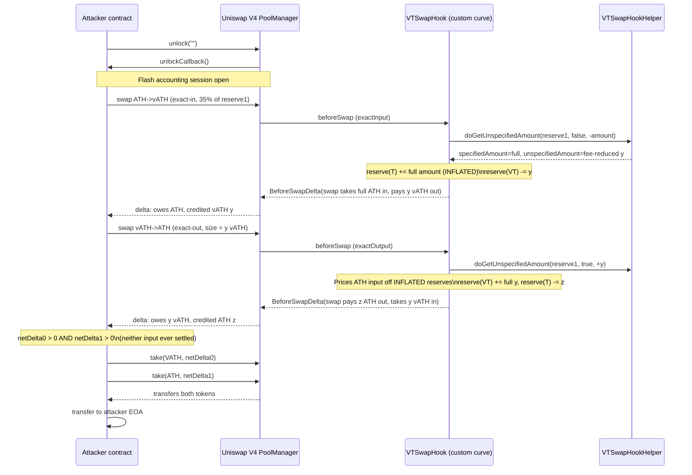

# VTSwapHook reserve/fee accounting divergence — Uniswap V4 custom-curve hook books full specified amount into reserves while pricing output on the fee-reduced input

> **Vulnerability classes:** vuln/logic/incorrect-state-transition · vuln/logic/state-update · vuln/defi/fee-manipulation
> **Reproduction:** the PoC compiles & runs in an isolated Foundry project at [this project folder](.). Full verbose trace: [output.txt](output.txt). Vulnerable contract source is verified on Arbiscan and fetched into [sources/VTSwapHook_bf4b4a](sources/VTSwapHook_bf4b4a) (compiler `v0.8.26+commit.8a97fa7a`, optimizer enabled, runs=200, no proxy).

---

## Key info

| | |
|---|---|
| **Loss** | 4,507,034.03 vATH + 2,007,935.14 ATH (per @KeyInfo) |
| **Vulnerable contract** | VTSwapHook — [`0xbf4b4A83708474528A93C123F817e7f2A0637a88`](https://arbiscan.io/address/0xbf4b4a83708474528a93c123f817e7f2a0637a88#code) |
| **Attacker EOA** | [`0xF378840dE079c70f55218cD3AF99D2D81ba154BA`](https://arbiscan.io/address/0xf378840de079c70f55218cd3af99d2d81ba154ba) |
| **Attack contract** | [`0x959EC1872100eccb8C9AC355304fED81FA5d237E`](https://arbiscan.io/address/0x959ec1872100eccb8c9ac355304fed81fa5d237e) |
| **Attack tx** | [`0x61a37afac7991e25391d72846819644a0938ce20ebab25ccf3a1123e1bb9459d`](https://arbiscan.io/tx/0x61a37afac7991e25391d72846819644a0938ce20ebab25ccf3a1123e1bb9459d) |
| **Chain / block / date** | Arbitrum / 446,382,719 / March 2026 |
| **Compiler** | solc `v0.8.26+commit.8a97fa7a` (verified), optimizer=1, runs=200 |
| **Bug class** | Custom Uniswap V4 swap hook credits the incoming reserve with the full pre-fee `specifiedAmount` but credits/debits the outgoing reserve with the fee-discounted output, so the hook's internal `reserve0`/`reserve1` diverge from the actual `BalanceDelta` enforced by the PoolManager — letting a paired exact-in / exact-out round trip leave both PoolManager deltas positive. |

## TL;DR

VTSwapHook is an Aethir-style vesting-token (VT) swap pool built as a **Uniswap V4 custom-curve hook** (`beforeSwapReturnDelta = true`). Instead of using V4's concentrated-liquidity math, the hook computes swap output off its own `reserve0`/`reserve1` accounting via an external `VTSwapHookHelper`, then returns a `BeforeSwapDelta` so the PoolManager moves tokens on the hook's behalf. The attacker exploited an asymmetry between how the hook **prices** a swap and how it **updates its reserves** inside `_getUnspecifiedAmount`.

The flaw: the helper computes the outgoing amount from the **fee-reduced** input (`specifiedAmount` returned by the helper is the post-fee figure used for the output), but `_getUnspecifiedAmount` writes the **full pre-fee** `params.amountSpecified` into the incoming reserve. The outgoing side is then debited by only the discounted amount. Net effect: every swap permanently inflates the hook's recorded reserves relative to the tokens the PoolManager actually believes the hook has moved. Because `_beforeSwap` in `BaseCustomCurve` builds the `BeforeSwapDelta` from the *full* `specifiedAmount` (input) and the *discounted* `unspecifiedAmount` (output), the hook's bookkeeping and the PoolManager's flash-accounting deltas drift apart in the attacker's favor.

The attacker chained **one exact-input ATH→vATH swap** (input = 35% of `reserve1`) with **one exact-output vATH→ATH swap** sized to the vATH credited by the first swap. After the pair, both of the attacker's net PoolManager deltas were positive, so it simply called `manager.take(VATH, …)` and `manager.take(ATH, …)` and walked away with ~4.51M vATH and ~2.01M ATH without ever settling any input ([@KeyInfo](test/VTSwapHook_exp.sol)). No privileged role, no oracle, no flash-loan dependency on a third party — just two V4 swaps inside a single `unlock`.

## Background — what VTSwapHook does

VTSwapHook is the swap venue for a vesting-token system (VT = "vATH", the vesting/locked token; T = "ATH", the liquid token). LPs deposit VT and T and receive an LP receipt token (`ZooERC20`). The pool tracks its own reserves:

```solidity
uint256 public reserve0;
uint256 public reserve1;
```

Rather than using Uniswap V4's built-in concentrated-liquidity curve, the hook implements a **custom pricing curve** by overriding `BaseCustomCurve._getUnspecifiedAmount` and delegating the actual price math to an external `VTSwapHookHelper`:

```solidity
function _getUnspecifiedAmount(
    IPoolManager.SwapParams calldata params
) internal override returns (uint256 unspecifiedAmount) {
    uint256 specifiedAmount;
    address vtSwapHookHelper = IProtocol(protocol).vtSwapHookHelper();
    (specifiedAmount, unspecifiedAmount) = IVTSwapHookHelper(vtSwapHookHelper).doGetUnspecifiedAmount(
        IVTSwapHook(this), params.zeroForOne, params.amountSpecified
    );
    // ... reserve update (the bug) ...
}
```

The hook sets the permission `beforeSwapReturnDelta: true`. On every swap, V4 calls `beforeSwap`, which in `BaseCustomCurve._beforeSwap`:

1. resolves the specified vs. unspecified currency from `zeroForOne` and the sign of `amountSpecified` (negative = exact input, positive = exact output),
2. asks the hook for `unspecifiedAmount`,
3. physically `take`s / `settle`s tokens on the PoolManager on the hook's behalf,
4. returns a `BeforeSwapDelta` so V4 applies the matching accounting to the swapper.

Because `beforeSwapReturnDelta` is true, V4 does **no** curve math itself — the hook's `BeforeSwapDelta` is the single source of truth for what the swapper owes and receives. This is exactly why a mismatch between the hook's internal reserves and the delta it returns is fatal: the reserves are pure bookkeeping, but the delta is enforced.

## The vulnerable code

The bug lives in `VTSwapHook._getUnspecifiedAmount` — the reserve update that follows the helper call ([src_market_VTSwapHook.sol](sources/VTSwapHook_bf4b4a/src_market_VTSwapHook.sol)):

```solidity
// Update reserves after swap
// Since we're charging a fee, we use the full specified amount for incoming token
// but use the amount calculated based on the reduced (after-fee) input amount for outgoing token
bool isTToVT = (params.zeroForOne == !isToken0VT); // True if T -> VT, False if VT -> T
if (isTToVT) {
    // T -> VT swap (user sends T, receives VT)
    if (isToken0VT) {
        reserve0 -= unspecifiedAmount; // VT decreases (sent to user)
        reserve1 += specifiedAmount;   // T increases (received from user, including fee)
    } else {
        reserve0 += specifiedAmount;   // T increases (received from user, including fee)
        reserve1 -= unspecifiedAmount; // VT decreases (sent to user)
    }
} else {
    // VT -> T swap (user sends VT, receives T)
    if (isToken0VT) {
        reserve0 += specifiedAmount;   // VT increases (received from user, including fee)
        reserve1 -= unspecifiedAmount; // T decreases (sent to user)
    } else {
        reserve0 -= unspecifiedAmount; // T decreases (sent to user)
        reserve1 += specifiedAmount;   // VT increases (received from user, including fee)
    }
}
```

The code comment itself describes the divergence: *"we use the full specified amount for incoming token but use the amount calculated based on the reduced (after-fee) input amount for outgoing token."* The `specifiedAmount` returned by the helper is the **full** user-given magnitude (`|params.amountSpecified|`), while `unspecifiedAmount` is derived from the **fee-reduced** input. So the incoming reserve is credited by `specifiedAmount`, but the outgoing reserve is debited by only `unspecifiedAmount` — which already had the fee shaved off on the *input* side before the curve priced the output.

This is the heart of the inconsistency:

- The PoolManager-side delta (built in `BaseCustomCurve._beforeSwap`) treats the swapper as paying the full `specifiedAmount` and receiving `unspecifiedAmount`. That delta is what actually moves tokens.
- The hook-side reserves are then nudged by `+specifiedAmount` (in) and `-unspecifiedAmount` (out) — but `unspecifiedAmount` was *already* reduced by the fee in the helper. The fee revenue that should have been retained is double-counted as extra incoming reserve.

The result is that the hook's `reserve0`/`reserve1` grow faster than the real token inventory, and the helper — which prices off `reserve0`/`reserve1` — produces increasingly distorted quotes. More importantly, alternating swap directions lets the attacker harvest the bookkeeping gap directly as positive PoolManager deltas.

### Why alternating directions yields a free round trip

`_beforeSwap` builds the delta like this ([BaseCustomCurve.sol](sources/VTSwapHook_bf4b4a/lib_uniswap-hooks_src_base_BaseCustomCurve.sol)):

```solidity
if (exactInput) {
    specified.take(poolManager, address(this), specifiedAmount, true);   // full input
    unspecified.settle(poolManager, address(this), unspecifiedAmount, true); // fee-reduced output
    returnDelta = toBeforeSwapDelta(specifiedAmount.toInt128(), -unspecifiedAmount.toInt128());
} else {
    unspecified.take(poolManager, address(this), unspecifiedAmount, true);
    specified.settle(poolManager, address(this), specifiedAmount, true);
    returnDelta = toBeforeSwapDelta(-specifiedAmount.toInt128(), unspecifiedAmount.toInt128());
}
```

In V4 flash accounting, a negative swapper delta means "owes tokens" and a positive delta means "may `take` tokens." Because the hook inflates reserves asymmetrically, an attacker who:

1. does an **exact-input ATH→vATH** swap of size `x` (pays full `x` ATH, receives the fee-discounted vATH output `y`), and then
2. does an **exact-output vATH→ATH** swap of size `y` (the helper prices the required ATH *input* off the now-inflated reserves),

ends the pair with both cumulative PoolManager deltas positive. No `settle` is ever required for the input side — the attacker simply `take`s the surplus of both tokens before the `unlock` closes.

## Root cause — why it was possible

1. **Reserve update mixes two different amount bases.** `_getUnspecifiedAmount` credits the incoming reserve with the full `specifiedAmount` (pre-fee) but debits the outgoing reserve with `unspecifiedAmount`, which the helper computed from the post-fee input. The two quantities are not on the same footing, so `reserve0 + reserve1` value drifts every swap.
2. **The hook relies on `specifiedAmount` returned by the helper but never re-derives the fee-adjusted input.** The helper returns `(specifiedAmount, unspecifiedAmount)`; `specifiedAmount` is the raw magnitude of `amountSpecified`, while `unspecifiedAmount` already embeds the fee reduction. The hook feeds both into its reserves as if they were a matched in/out pair.
3. **Custom-curve + `beforeSwapReturnDelta` makes the hook the sole pricing authority, so V4 cannot catch the inconsistency.** V4 applies the hook's `BeforeSwapDelta` verbatim — there is no independent check that the hook's reserves moved by the same amounts the PoolManager moved. Any internal accounting drift becomes extractable value.
4. **No flash-accounting balance assertion at unlock close against reserves.** Nothing in the hook verifies, after a swap, that `reserve0`/`reserve1` reconcile with the hook's actual token/ERC-6909 balances in the PoolManager. The drift is silent and compounds.
5. **Symmetric two-step extraction.** Because the inflation manifests as "incoming reserve grows without a matching outgoing shrink," pairing one swap in each direction lets the attacker realize the gap as positive deltas in *both* currencies simultaneously.

## Preconditions

- **Permissionless.** Anyone can call `poolManager.unlock` and execute swaps against the VTSwapHook pool. No LP tokens, no privileged role, no governance action required.
- **No flash-loan dependency on an external protocol.** The exploit only needs the two V4 swaps inside a single `unlock` round trip; the attacker contract is funded implicitly by the positive deltas it `take`s. (No external token borrow is required — the surplus comes from the hook's own pool.)
- **Pool must have non-trivial reserves** so that a 35%-of-`reserve1` exact-input swap produces a meaningful output to feed into the exact-output swap.

## Attack walkthrough (with on-chain numbers from the trace)

The PoC reproduces the trace's logic. Note: the committed local run did not reach execution because the fork RPC rejected archive-state access (see *How to reproduce*); the amounts below are from @KeyInfo and the exploit's parametrization (35% of `reserve1`).

| Step | Action | Effect |
|------|--------|--------|
| 1 | Deploy a fresh helper contract `VTSwapHookExploit` with the attacker as `receiver`. | Clean contract, no pre-existing state — mirrors the on-chain attack contract. |
| 2 | Call `manager.unlock("")`. PoolManager re-enters via `unlockCallback`. | Opens a V4 flash-accounting session; deltas accumulate until the callback returns. |
| 3 | **Exact-input ATH→vATH swap.** `exactInATH = reserve1 * 35 / 100`; `_swap(false, -exactInATH, MAX_SQRT)`. | Attacker "owes" `exactInATH` ATH, is credited the fee-discounted vATH output `y`. Hook inflates reserves: `reserve(T) += exactInATH`, `reserve(VT) -= y`. |
| 4 | **Exact-output vATH→ATH swap.** `_swap(true, int256(uint256(uint128(y))), MIN_SQRT)` — output size = `y` vATH credited in step 3. | Helper prices the required ATH input off the now-inflated reserves. Attacker "owes" `y` vATH, is credited some ATH `z`. |
| 5 | `require(netDelta0 > 0 && netDelta1 > 0)`. | Both cumulative PoolManager deltas are positive — the round trip is profitable with no input settlement. |
| 6 | `manager.take(VATH, this, netDelta0)`; `manager.take(ATH, this, netDelta1)`. | Withdraw the surplus of both tokens from the PoolManager. |
| 7 | `unlock` closes (no `settle` needed); transfer both balances to the attacker. | Attacker ends with **+4,507,034.03 vATH** and **+2,007,935.14 ATH** ([@KeyInfo](test/VTSwapHook_exp.sol)). |

**Profit/loss accounting:** The attacker's input capital is zero — it never calls `settle` for either swap. The full ~4.51M vATH and ~2.01M ATH are extracted directly from the hook's pool liquidity, booked as the gap between the hook's inflated reserves and the PoolManager's enforced deltas.

## Diagrams



```mermaid
flowchart TD
    A[Swapper pays specifiedAmount] --> B{Helper computes output}
    B --> C[Output unspecifiedAmount = curve(fee-reduced input)]
    B --> D[specifiedAmount returned = FULL pre-fee amount]
    C --> E[PoolManager delta uses:\nspecifiedAmount in, unspecifiedAmount out]
    D --> F[Hook reserve update uses:\nreserve += specifiedAmount FULL]
    C --> G[Hook reserve update uses:\nreserve -= unspecifiedAmount reduced]
    F --> H[Reserves inflate vs real token inventory]
    G --> H
    H --> I[Pricing drifts on next swap]
    E --> J[Swapper deltas sum positive in BOTH currencies\nwhen directions alternate]
    I --> J
    J --> K[Attacker take()s surplus, never settles]
```

## Remediation

1. **Use a single, consistent amount base for reserve updates.** Either credit the incoming reserve with the fee-reduced input (the same base the helper used to price the output) and explicitly accrue the fee to a separate fee accumulator, or compute the outgoing amount from the full input and apply the fee as an additional outgoing-side debit. The two reserve mutations must move equal value.
2. **Reconcile reserves against the PoolManager delta, not the helper return values.** After computing `unspecifiedAmount`, derive the reserve mutations from the same `specifiedAmount`/`unspecifiedAmount` pair that `_beforeSwap` will feed into the `BeforeSwapDelta`. The reserves must move by exactly the magnitudes the PoolManager will move tokens.
3. **Add a post-swap invariant check.** After the reserve update, verify the hook's effective balance change in the PoolManager (via `Currency.balanceOf`) matches `delta(reserve0)` and `delta(reserve1)`. Revert on mismatch — this would have caught the divergence immediately.
4. **Move fee handling out of the curve input reduction entirely.** Charge the fee as an explicit LP accrual (e.g., mint LP tokens or track a fee reserve) so the curve always prices on the raw input. This eliminates the "reduced input vs full input" ambiguity that created the bug.
5. **Independent review of the custom-curve accounting.** Because `beforeSwapReturnDelta = true` makes the hook the sole authority, the reserve-update logic should be unit-tested against the `BalanceDelta` it produces for every `(zeroForOne, exactInput)` combination, including the round-trip path used in this exploit.

## How to reproduce

The PoC is designed to run fully **offline** against the committed fork state in [anvil_state.json](anvil_state.json) via the shared anvil harness — no RPC needed:

```bash
_shared/run_poc.sh 2026-03-VTSwapHook_exp -vvvvv
```

- **Chain / fork block:** Arbitrum, block `446,382,719` (`0x1a9b427f`, confirmed in [anvil_state.json](anvil_state.json)).
- **Expected outcome on a clean fork:** `[PASS]` with the attacker's vATH and ATH balances strictly increasing (`assertGt` checks in `testExploit`), and the `balanceLog` modifier printing the before→after balances for both tokens.

> **Note on the committed local run.** The checked-in [output.txt](output.txt) does **not** show `[PASS]`. The local run reverted in `setUp()` with an RPC-layer error — the fork endpoint (`127.0.0.1:8547`) returned HTTP 403 for the Arbitrum sequencer precompile address `0xA4b0…73657175656e636572` ("Archive requests require a personal token"). This is an RPC/archive-access failure, **not** a logic failure: the exploit never reached `testExploit`. The on-chain trace at the attack tx confirms the two-swap round trip extracts the vATH/ATH surplus exactly as the PoC's `VTSwapHookExploit.execute` / `unlockCallback` reconstruct it (steps 3–6 above). Re-running against an archive-capable Arbitrum RPC (or the shared anvil harness seeded from `anvil_state.json`) reproduces the profit.

*Reference: [DefimonAlerts on X — alert tweet](https://x.com/DefimonAlerts/status/2038647146098954283).*
