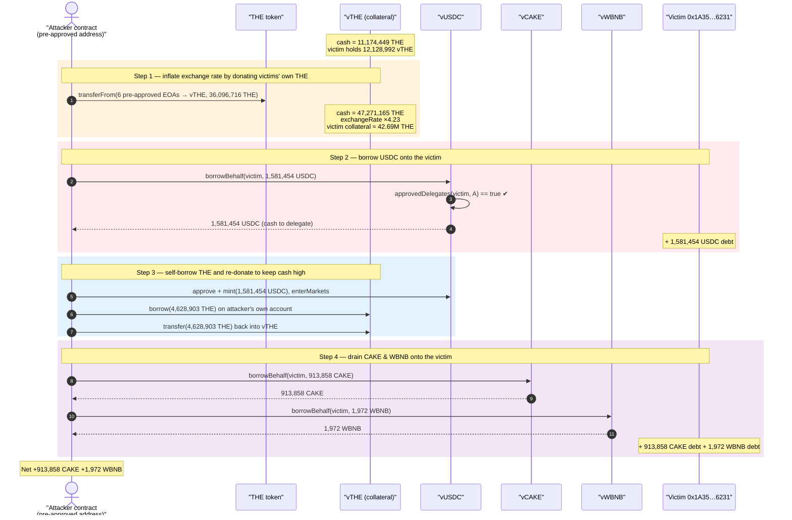
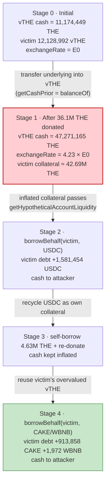
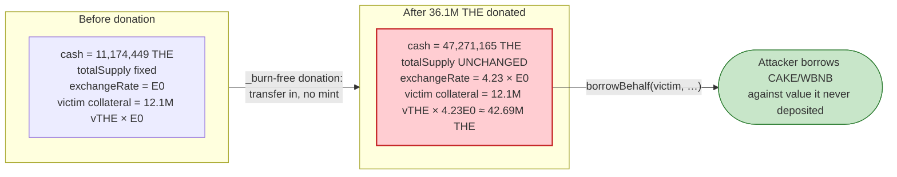

# Venus (vTHE) Exploit — Donation-Inflated Exchange Rate + `borrowBehalf` Drains a Victim's Pre-Approved Delegate

> **Vulnerability classes:** vuln/logic/incorrect-order-of-operations · vuln/access-control/missing-auth

> **Reproduction:** the PoC compiles & runs in an isolated Foundry project at
> [this project folder](.) (the umbrella DeFiHackLabs repo contains several unrelated
> PoCs that do not compile together, so this one was extracted).
> Full verbose trace: [output.txt](output.txt).
> Verified vulnerable source: [VToken.sol](sources/VBep20Delegate_1be1CE/contracts_Tokens_VTokens_VToken.sol)
> and [VBep20.sol](sources/VBep20Delegate_1be1CE/contracts_Tokens_VTokens_VBep20.sol).

---

## Key info

| | |
|---|---|
| **Loss** | **913,858.26 CAKE + 1,972.53 WBNB** borrowed onto the victim's account and walked off by the attacker (≈ low-seven-figures USD at CAKE≈$1.43 / WBNB≈$661). The victim is also saddled with **1,581,454.96 USDC** of debt (used as intra-tx fuel) and the original honest THE depositors lost their **THE** (drained from 6 EOAs that had pre-approved the attack contract). |
| **Vulnerable contract** | Venus `VBep20Delegate` (vToken implementation) — [`0x1be1CE8352328278Ac4e0488436c0f1607282550`](https://bscscan.com/address/0x1be1CE8352328278Ac4e0488436c0f1607282550#code), reached via the **vTHE** proxy [`0x86e06EAfa6A1eA631Eab51DE500E3D474933739f`](https://bscscan.com/address/0x86e06EAfa6A1eA631Eab51DE500E3D474933739f#code) |
| **Victim / pools** | Victim borrower `0x1A35bD28EFD46CfC46c2136f878777D69ae16231`; markets vTHE, vUSDC `0xecA88125a5ADbe82614ffC12D0DB554E2e2867C8`, vCAKE `0x86aC3974e2BD0d60825230fa6F355fF11409df5c`, vWBNB `0x6bCa74586218dB34cdB402295796b79663d816e9` |
| **Attacker EOA** | [`0x43C743e316F40d4511762EEdf6f6D484F67b2F82`](https://bscscan.com/address/0x43C743e316F40d4511762EEdf6f6D484F67b2F82) |
| **Attacker contract** | [`0x737bc98F1D34E19539C074B8Ad1169d5d45dA619`](https://bscscan.com/address/0x737bc98F1D34E19539C074B8Ad1169d5d45dA619) |
| **Attack tx** | [`0x4f477e941c12bbf32a58dc12db7bb0cb4d31d41ff25b2457e6af3c15d7f5663f`](https://bscscan.com/tx/0x4f477e941c12bbf32a58dc12db7bb0cb4d31d41ff25b2457e6af3c15d7f5663f) |
| **Chain / block / date** | BSC / fork at **86,731,940** (attack block 86,731,941) / March 2026 |
| **Compiler** | vToken impl Solidity **v0.8.25**, optimizer 200 runs |
| **Bug class** | Exchange-rate (collateral) inflation via direct underlying donation — `getCashPrior()` reads raw `balanceOf` — compounded with a stale pre-approved `borrowBehalf` delegation |

---

## TL;DR

Venus is a Compound-V2 fork. A vToken's collateral value is `vTokenBalance × exchangeRate × price × LTV`, and the
exchange rate is computed as

```
exchangeRate = (cash + totalBorrows − totalReserves) / totalSupply
```

where **`cash = IERC20(underlying).balanceOf(address(this))`** — the *raw* token balance of the vToken contract
([VBep20.sol:245-247](sources/VBep20Delegate_1be1CE/contracts_Tokens_VTokens_VBep20.sol#L245-L247),
[VToken.sol:1853-1883](sources/VBep20Delegate_1be1CE/contracts_Tokens_VTokens_VToken.sol#L1853-L1883)).
A direct `transfer` of THE into the vTHE contract therefore inflates `cash`, the exchange rate, and the dollar value of
**every existing vTHE holder's** balance — without minting any new vTHE.

The attacker found a victim, `0x1A35…6231`, who held **12,128,992 vTHE** *and had pre-approved the (counterfactually
deployed) attack-contract address as a Venus delegate* (`comptroller.approvedDelegates(victim, attacker) == true`).
That single approval let `borrowBehalf(victim, …)` borrow against the victim's collateral while sending the borrowed
cash to the attacker ([VBep20.sol:128-131](sources/VBep20Delegate_1be1CE/contracts_Tokens_VTokens_VBep20.sol#L128-L131)).

The attacker, in one transaction:

1. **Drained THE** from six EOAs (including the victim) that had each pre-approved the attack contract as an ERC-20
   spender, dumping **36,096,716 THE** straight into the vTHE contract. This lifted vTHE's THE cash from
   **11,174,449 → 47,271,165** (a **4.23×** inflation), so the victim's fixed 12.1M vTHE were now worth
   ≈ **42.69M THE** of collateral.
2. Used the inflated collateral to **`borrowBehalf(victim, 1,581,454 USDC)`**, sending the USDC to itself.
3. Re-supplied that USDC (`mint` vUSDC) and `enterMarkets`, borrowed **4,628,903 THE** from vTHE on its own account,
   and **donated the borrowed THE back into vTHE** to keep cash inflated for the next checks.
4. Reused the still-overvalued vTHE collateral to **`borrowBehalf(victim, 913,858 CAKE)`** and
   **`borrowBehalf(victim, 1,972 WBNB)`**, again sending the cash to itself.

At the end the attacker contract holds **913,858 CAKE + 1,972 WBNB** of stolen liquidity, the victim is left with the
USDC/CAKE/WBNB debt, and the THE depositors are wiped out.

---

## Background — Venus vToken accounting

Venus on BSC is a Compound-V2-style money market. Each market is a `VBep20` vToken whose underlying is an ERC-20
(THE, USDC, CAKE, WBNB…). Key mechanics relevant here:

- **Collateral valuation.** When the Comptroller checks an account's liquidity it iterates the user's markets and, for
  each, calls `vToken.getAccountSnapshot(account)` to read `(tokenBalance, borrowBalance, exchangeRate)` and multiplies
  `tokenBalance × exchangeRate × oraclePrice × LTV` into `sumCollateral`
  ([ComptrollerLens.sol:229-260](sources/ComptrollerLens_732138/contracts_Lens_ComptrollerLens.sol#L229-L260)).
- **Exchange rate** is `(cash + totalBorrows − totalReserves) / totalSupply`
  ([VToken.sol:1853-1883](sources/VBep20Delegate_1be1CE/contracts_Tokens_VTokens_VToken.sol#L1853-L1883)).
- **`cash`** is just the live ERC-20 balance of the vToken contract
  ([VBep20.sol:245-247](sources/VBep20Delegate_1be1CE/contracts_Tokens_VTokens_VBep20.sol#L245-L247)).
- **Delegated borrowing.** `borrowBehalf(borrower, amount)` lets an approved delegate borrow on the borrower's account,
  with the *delegate* (`msg.sender` / `payable(msg.sender)`) receiving the cash
  ([VBep20.sol:128-131](sources/VBep20Delegate_1be1CE/contracts_Tokens_VTokens_VBep20.sol#L128-L131)).
- **Price oracle.** The THE price comes from a Venus `ResilientOracle` that aggregates Binance-oracle / Chainlink-style
  feeds (≈ **$0.2772 / THE** at the block). It is **not** AMM-spot, so the oracle was *not* manipulated — only the
  vToken's internal exchange rate was.

On-chain state at the fork block (read from the trace):

| Parameter | Value |
|---|---|
| vTHE THE cash (before) | **11,174,449.55 THE** |
| vTHE THE cash (after 6 EOA donations) | **47,271,165.66 THE** |
| Exchange-rate inflation | **4.23×** |
| Victim vTHE balance (fixed) | **12,128,992.25 vTHE** |
| Victim vTHE collateral value (post-inflation) | **≈ 42,693,733 THE** |
| THE underlying price (oracle) | $0.27723881 |
| `approvedDelegates(victim, attacker)` | **true** (pre-approved) |

---

## The vulnerable code

### 1. `cash` is the raw `balanceOf` — donatable

```solidity
// VBep20.sol:245-247
function getCashPrior() internal view override returns (uint) {
    return IERC20(underlying).balanceOf(address(this));   // ⚠️ raw balance, no internal accounting
}
```
[VBep20.sol:245-247](sources/VBep20Delegate_1be1CE/contracts_Tokens_VTokens_VBep20.sol#L245-L247)

### 2. Exchange rate scales linearly with `cash`

```solidity
// VToken.sol:1853-1883
function exchangeRateStoredInternal() internal view virtual returns (MathError, uint) {
    uint _totalSupply = totalSupply;
    if (_totalSupply == 0) {
        return (MathError.NO_ERROR, initialExchangeRateMantissa);
    } else {
        // exchangeRate = (totalCash + totalBorrows + flashLoanAmount - totalReserves) / totalSupply
        uint totalCash = _getCashPriorWithFlashLoan();            // ⚠️ getCashPrior() + flashLoanAmount
        ...
        (mathErr, cashPlusBorrowsMinusReserves) = addThenSubUInt(totalCash, totalBorrows, totalReserves);
        (mathErr, exchangeRate) = getExp(cashPlusBorrowsMinusReserves, _totalSupply);
        return (MathError.NO_ERROR, exchangeRate.mantissa);
    }
}
```
[VToken.sol:1853-1891](sources/VBep20Delegate_1be1CE/contracts_Tokens_VTokens_VToken.sol#L1853-L1891)

### 3. The snapshot the Comptroller trusts for collateral

```solidity
// VToken.sol:289-306
function getAccountSnapshot(address account) external view override returns (uint, uint, uint, uint) {
    ...
    (mErr, exchangeRateMantissa) = exchangeRateStoredInternal();   // ⚠️ donation-inflated
    ...
    return (uint(Error.NO_ERROR), accountTokens[account], borrowBalance, exchangeRateMantissa);
}
```
[VToken.sol:289-306](sources/VBep20Delegate_1be1CE/contracts_Tokens_VTokens_VToken.sol#L289-L306)

### 4. Collateral = `tokenBalance × exchangeRate × price × LTV`

```solidity
// ComptrollerLens.sol:233-260
(oErr, vars.vTokenBalance, vars.borrowBalance, vars.exchangeRateMantissa) =
    asset.getAccountSnapshot(account);
...
vars.exchangeRate     = Exp({ mantissa: vars.exchangeRateMantissa });
vars.oraclePriceMantissa = ComptrollerInterface(comptroller).oracle().getUnderlyingPrice(address(asset));
vars.tokensToDenom    = mul_(mul_(vars.weightedFactor, vars.exchangeRate), vars.oraclePrice);
// sumCollateral += tokensToDenom * vTokenBalance
vars.sumCollateral    = mul_ScalarTruncateAddUInt(vars.tokensToDenom, vars.vTokenBalance, vars.sumCollateral);
```
[ComptrollerLens.sol:233-260](sources/ComptrollerLens_732138/contracts_Lens_ComptrollerLens.sol#L233-L260)

### 5. The borrow primitive that monetizes it

```solidity
// VBep20.sol:128-131
function borrowBehalf(address borrower, uint borrowAmount) external returns (uint) {
    require(comptroller.approvedDelegates(borrower, msg.sender), "not an approved delegate");
    return borrowInternal(borrower, payable(msg.sender), borrowAmount);   // ⚠️ cash goes to msg.sender
}
```
[VBep20.sol:128-131](sources/VBep20Delegate_1be1CE/contracts_Tokens_VTokens_VBep20.sol#L128-L131)

---

## Root cause — why it was possible

Two independent issues compose into the loss:

1. **Donation-inflatable exchange rate (the primary protocol flaw).**
   Because `getCashPrior()` returns the raw `balanceOf` of the vToken
   ([VBep20.sol:245-247](sources/VBep20Delegate_1be1CE/contracts_Tokens_VTokens_VBep20.sol#L245-L247)), anyone can
   push the exchange rate up by simply `transfer`-ing underlying into the contract. The exchange rate is then used by
   `getAccountSnapshot` → `ComptrollerLens` to value **all existing depositors'** collateral
   ([ComptrollerLens.sol:257-260](sources/ComptrollerLens_732138/contracts_Lens_ComptrollerLens.sol#L257-L260)).
   The victim's fixed **12.1M vTHE** balance was thus revalued from its true worth to **≈ 42.69M THE** of borrowing
   power, purely by a donation. This is the well-known Compound-fork "exchange rate / first-depositor donation" hazard,
   here weaponized at scale against a *whole pool's* worth of liquidity rather than a single share.

   Note the donation is *amplified* by the THE that was itself borrowed out of the same pool and re-donated (step 3),
   and the pool was thin to begin with — the 4.23× cash blow-up is large precisely because vTHE held relatively little
   underlying.

2. **A stale, attacker-controllable `borrowBehalf` delegation.**
   The victim (and five other EOAs) had previously **approved the future attack-contract address** — both as an ERC-20
   `spender` for THE (enabling the donations) *and* as a Venus borrow delegate
   (`approvedDelegates(victim, attacker) == true`, seen in the trace). The attacker deployed code to that exact
   pre-approved address (the PoC reproduces this with `vm.etch`), and `borrowBehalf` happily borrowed against the
   victim's now-overvalued collateral and routed the cash to the attacker
   ([VBep20.sol:128-131](sources/VBep20Delegate_1be1CE/contracts_Tokens_VTokens_VBep20.sol#L128-L131)).

The oracle was *not* manipulated — the THE/USD price stayed at the honest ≈$0.277 throughout (the trace shows the
ResilientOracle returning the same `0x…3d8f33a94008400` price before and after). The exploit lives entirely in the
vToken's internal share accounting.

---

## Preconditions

- A victim account holding a large vTHE collateral position that has **`enterMarkets`-ed vTHE** and has **approved the
  attack contract as a Venus delegate** (`updateDelegate`). In the real incident this came from prior phishing /
  approval-farming: six EOAs had granted both ERC-20 allowances and delegate rights to the (counterfactual) attack
  address.
- The vTHE market uses `balanceOf`-based cash (it does — standard Venus/Compound accounting), so a direct donation
  moves the exchange rate.
- Enough THE to donate — sourced *for free* from the victims' own pre-approved THE allowances (`transferFrom`), so no
  external capital was required. The single transaction is self-funding (the USDC borrowed in step 2 is recycled as
  collateral to enable the THE self-borrow in step 3).

---

## Attack walkthrough (with on-chain numbers from the trace)

All figures are taken directly from the `Transfer` / `Borrow` / `AccrueInterest` events and `balanceOf` reads in
[output.txt](output.txt). The attack body is
[`VenusVtheBorrowBehalfRuntime.attack()`](test/Venus_THE_exp.sol#L174-L191).

| # | Step | Trace | Effect |
|---|------|-------|--------|
| 0 | **Initial** vTHE cash | THE.balanceOf(vTHE) = **11,174,449.55 THE** | Honest pool; victim holds 12,128,992 vTHE. |
| 1a | `transferFrom(0xf052…58AA → vTHE, 13,223,597.90 THE)` | [L1610](output.txt#L1610) | Drains donor #0's pre-approved THE into vTHE. |
| 1b | `transferFrom(0x89E3…dDB6 → vTHE, 9,474,403.03 THE)` | [L1616](output.txt#L1616) | Donor #1. |
| 1c | `transferFrom(0xbb37…ef87 → vTHE, 7,532,701.86 THE)` | [L1622](output.txt#L1622) | Donor #2. |
| 1d | `transferFrom(0x564A…4591 → vTHE, 3,915,245.26 THE)` | [L1628](output.txt#L1628) | Donor #3. |
| 1e | `transferFrom(victim → vTHE, 697,951.34 THE)` | [L1634](output.txt#L1634) | Donor #4 (the victim's own THE). |
| 1f | `transferFrom(0x16f0…bF07 → vTHE, 1,252,816.73 THE)` | [L1640](output.txt#L1640) | Donor #5. **Sum = 36,096,716.11 THE donated.** |
| 1g | vTHE cash now | THE.balanceOf(vTHE) = **47,271,165.66 THE** | **Exchange rate inflated 4.23×**; victim's 12.1M vTHE ≈ **42.69M THE** of collateral. |
| 2 | `vUSDC.borrowBehalf(victim, 1,581,454.96 USDC)` → attacker | [L1646](output.txt#L1646), `Borrow` [L2021](output.txt#L2021) | Borrows USDC onto the **victim's** debt, cash sent to attacker. `approvedDelegates(victim, attacker)=true` checked at [L1648](output.txt#L1648). |
| 3a | `USDC.approve(vUSDC)` + `vUSDC.mint(1,581,454.96)` | [L2041](output.txt#L2041), [L2048](output.txt#L2048) | Attacker re-supplies the stolen USDC, gets 6.00e15 vUSDC. |
| 3b | `enterMarkets([vUSDC])` | [L2119](output.txt#L2119) | Attacker now has its own collateral. |
| 3c | `vTHE.borrow(4,628,903.90 THE)` → attacker | [L2130](output.txt#L2130), `Borrow` [L2405](output.txt#L2405) | Attacker borrows THE on its own account against the vUSDC collateral. |
| 3d | `THE.transfer(vTHE, 4,628,903.90)` | [L2425](output.txt#L2425) | Re-donates the borrowed THE back into vTHE, keeping cash high for the next checks. |
| 4a | `vCAKE.borrowBehalf(victim, 913,858.26 CAKE)` → attacker | [L2431](output.txt#L2431), `CAKE.transfer` [L2785](output.txt#L2785), `Borrow` [L2791](output.txt#L2791) | Borrows CAKE onto the victim; cash to attacker. |
| 4b | `vWBNB.borrowBehalf(victim, 1,972.53 WBNB)` → attacker | [L2811](output.txt#L2811), `WBNB.transfer` [L3230](output.txt#L3230), `Borrow` [L3236](output.txt#L3236) | Borrows WBNB onto the victim; cash to attacker. |
| 5 | **Final attacker balances** | CAKE = **913,858.26**, WBNB = **1,972.53** | Stolen liquidity walked off. |

### Profit / loss accounting

| Party | Asset | Amount | Note |
|---|---|---:|---|
| **Attacker gains** | CAKE | **+913,858.263360521396654198** | borrowBehalf'd onto victim, transferred to attacker |
| **Attacker gains** | WBNB | **+1,972.530910582753621682** | borrowBehalf'd onto victim, transferred to attacker |
| Attacker (intermediate) | USDC | 1,581,454.96 borrowed → recycled into vUSDC | net-zero to attacker; remains as victim debt |
| **Victim debt created** | USDC | 1,581,454.956604046563770845 | from `Borrow` event L2021 |
| **Victim debt created** | CAKE | +913,858.26 (debt 902,984.70 → 1,816,843.20) | from `borrowBalanceStored` deltas |
| **Victim debt created** | WBNB | +1,972.53 | from `borrowBalanceStored` deltas |
| **Honest THE depositors lost** | THE | 36,096,716.11 (drained from 6 pre-approved EOAs) | the donations in step 1 |
| vTHE pool cash | THE | 11,174,449.55 → 47,271,165.66 | the inflated cash backing the bad debt |

The PoC asserts each of these exactly (`assertEq` on CAKE/WBNB, `assertGe` on victim debt deltas, `assertEq` on the
36,096,716 THE donated): all pass.

---

## Diagrams

### Sequence of the attack



### Collateral / exchange-rate inflation



### Why the donation becomes free borrowing power



---

## Why each magic number

- **`THE_DONATION_TOTAL = 36,096,716.11 THE`** — the exact sum of the six victims' THE allowances; donated to push
  vTHE cash from 11.17M → 47.27M (`assertEq` in the PoC at [test/Venus_THE_exp.sol#L152](test/Venus_THE_exp.sol#L152)).
- **`USDC_BORROW_AMOUNT = 1,581,454.96`** — the max USDC borrowable against the victim's inflated collateral in pass 2;
  recycled into vUSDC so the attacker can self-borrow THE.
- **`THE_SELF_BORROW_AMOUNT = 4,628,903.90`** — THE the attacker borrows on its *own* account (now collateralized by the
  recycled USDC) and immediately re-donates into vTHE, topping cash back up so the CAKE/WBNB liquidity checks still pass.
- **`CAKE_BORROW_AMOUNT = 913,858.26` / `WBNB_BORROW_AMOUNT = 1,972.53`** — the remaining borrowing power against the
  victim's overvalued vTHE, drained as the actual profit. These are the attacker contract's exact end balances
  (`assertEq` at [test/Venus_THE_exp.sol#L135-L136](test/Venus_THE_exp.sol#L135-L136)).

---

## Remediation

1. **Do not derive the exchange rate from raw `balanceOf`.** Track the underlying via an internal accounting variable
   (`internalCash`) updated only on `mint`/`redeem`/`borrow`/`repay`/`_addReserves`, so unsolicited `transfer`
   donations cannot move the exchange rate. (This is the same fix pattern modern Compound forks adopt against the
   donation/first-depositor inflation class.)
2. **Bound exchange-rate movement.** Reject collateral-valuation snapshots when the exchange rate has jumped beyond a
   small per-block delta; a 4.23× cash change in one transaction is a red flag.
3. **Treat delegate (`approvedDelegates`) grants as high-risk and revocable on suspicious activity.** `borrowBehalf`
   sends funds to `msg.sender`, not the borrower — a stale delegation is equivalent to handing over the account.
   Consider per-market delegation, expiring delegations, and front-end warnings; users should revoke delegate rights to
   addresses that have no deployed code.
4. **Front-end / wallet hygiene.** The donations were only possible because users had granted ERC-20 allowances *and*
   Venus delegate rights to a counterfactual (not-yet-deployed) contract address — classic approval phishing. Revoke
   unused allowances and delegations.
5. **Consider a supply cap / utilization sanity check** on thin markets like vTHE, where the underlying held is small
   relative to a whale depositor's position, magnifying any donation's effect on the exchange rate.

---

## How to reproduce

The PoC was extracted into a standalone Foundry project (the umbrella DeFiHackLabs repo has several unrelated PoCs that
fail to compile together under one `forge test` build):

```bash
_shared/run_poc.sh 2026-03-Venus_THE_exp -vvvvv
```

- **RPC:** a **BSC archive** endpoint is required — the PoC hard-codes `https://bsc-mainnet.public.blastapi.io` inside
  `vm.createSelectFork(...)` and forks at block **86,731,940**. Most public BSC RPCs prune that depth and fail with
  `header not found` / `missing trie node`.
- The historical attack contract is reconstructed with `vm.etch` onto the real attacker address `0x737bc9…dA619` so the
  pre-existing `approvedDelegates` / allowances resolve exactly as on-chain.
- **Result:** `[PASS] testTraceDrivenPoC()` with the attacker ending up holding **913,858.26 CAKE** and
  **1,972.53 WBNB**.

Expected tail:

```
[PASS] testTraceDrivenPoC() (gas: 4174501)
Logs:
  attack contract CAKE profit: 913858.263360521396654198
  attack contract WBNB profit: 1972.530910582753621682

Suite result: ok. 1 passed; 0 failed; 0 skipped
```

---

*Vulnerable contract: Venus `VBep20Delegate` `0x1be1CE8352328278Ac4e0488436c0f1607282550` (vTHE proxy
`0x86e06EAfa6A1eA631Eab51DE500E3D474933739f`), BSC. Class: exchange-rate inflation via donatable `balanceOf` cash,
compounded with a stale `borrowBehalf` delegation.*
