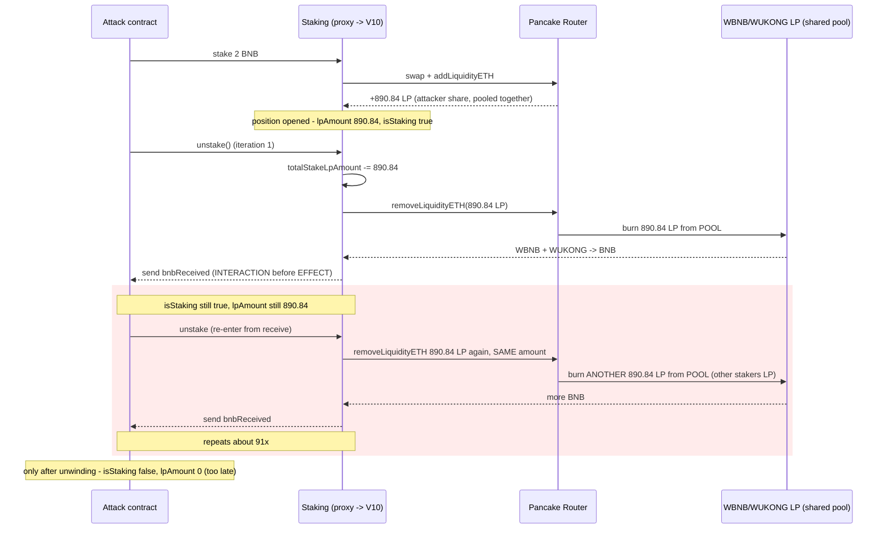
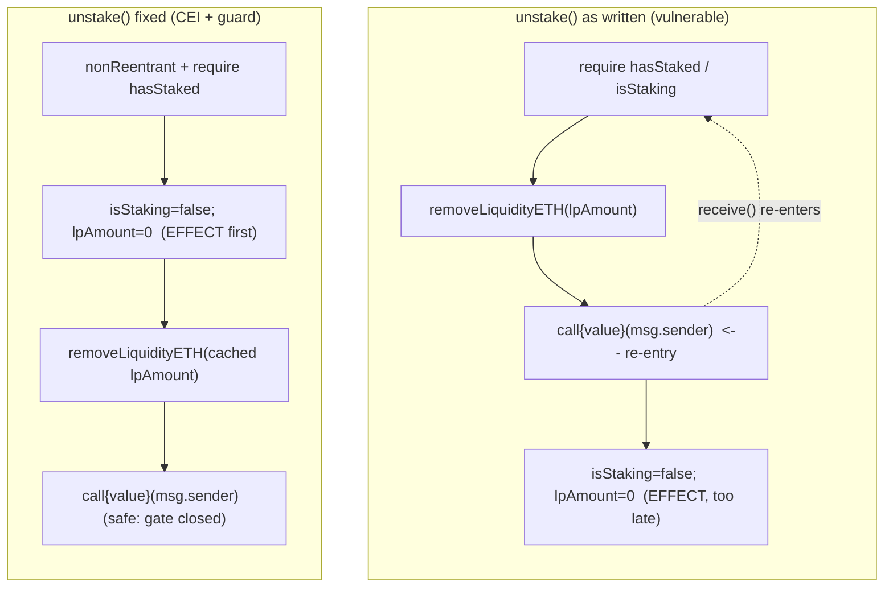

# WUKONG Staking — classical reentrancy in `unstake()` drains pooled LP

> **Vulnerability classes:** vuln/reentrancy/single-function · vuln/logic/state-update · vuln/logic/missing-check

> **Reproduction:** the PoC compiles & runs in an isolated Foundry project at
> [this project folder](.). The fork is served offline from the bundled
> `anvil_state.json` (a local anvil replays BSC state at block `86047026`), so no
> public RPC is required.
> Full verbose trace: [output.txt](output.txt).
> Verified vulnerable source: [StakingUpgradeableV10.sol](sources/StakingUpgradeableV10_d828e9/src__StakingUpgradeableV10.sol)
> (implementation `0xd828…deda`), staking token [WkToken.sol](sources/WkToken_dd540a/src__WkToken.sol).

<!-- non-defihacklabs -->

---

## Key info

| | |
|---|---|
| **Loss** | **~57.68 BNB (~$37.7K)** on the main tx (attacker EOA net gain); a second tx drained ~$18K |
| **Vulnerable contract** | `StakingUpgradeable` proxy (EIP-1967) — [`0x07d398c888c353565cf549bbee3446791a49f285`](https://bscscan.com/address/0x07d398c888c353565cf549bbee3446791a49f285) |
| **Implementation** | [`0xd828e972b7fc9ad4e6c29628a760386a94cfdeda`](https://bscscan.com/address/0xd828e972b7fc9ad4e6c29628a760386a94cfdeda#code) (`StakingUpgradeableV10`, solc `0.8.30`) |
| **Staking token (WUKONG)** | [`0xdd540a1e727fe562a63b4d7925f229e4e693cc0e`](https://bscscan.com/address/0xdd540a1e727fe562a63b4d7925f229e4e693cc0e#code) (`WkToken`) |
| **Staked LP (victim funds)** | Pancake WBNB/WUKONG LP [`0x7219e1a1e14c3f7e52db43a4a2db21d30957e080`](https://bscscan.com/address/0x7219e1a1e14c3f7e52db43a4a2db21d30957e080) — pool held **145,511.14 LP** |
| **Flash-loan source** | Pancake WBNB/BUSD pair [`0x58f876857a02d6762e0101bb5c46a8c1ed44dc16`](https://bscscan.com/address/0x58f876857a02d6762e0101bb5c46a8c1ed44dc16) |
| **Attacker EOA** | [`0x13be1ae7c8413cc95f3566e9393c618d29965ac8`](https://bscscan.com/address/0x13be1ae7c8413cc95f3566e9393c618d29965ac8) |
| **Attack contract** | `0xddb8fd9441242b25f401096536d6ef83afa9101f` (CREATE in the attack tx; self-destructs) |
| **Attack tx** | [`0x79467533d4d1f332df846dc78c16fe319cd1d3a1a0f01545b4cdd7a2d3a71d22`](https://bscscan.com/tx/0x79467533d4d1f332df846dc78c16fe319cd1d3a1a0f01545b4cdd7a2d3a71d22) |
| **Second tx (~$18K)** | [`0x97e2b875552e4e82d058a775c7dd14198d15df869260235dbaf6577e5e3b13cc`](https://bscscan.com/tx/0x97e2b875552e4e82d058a775c7dd14198d15df869260235dbaf6577e5e3b13cc) |
| **Chain · block · date** | BSC · `86047027` · 2026-03-12 02:47 UTC |
| **Compiler** | solc `0.8.30` (victim) |
| **Bug class** | Classical (single-function) reentrancy — interaction before state finalization, no guard |

---

## TL;DR

`StakingUpgradeableV10.unstake()` returns the withdrawer's BNB with a raw
`payable(msg.sender).call{value: bnbReceived}("")` **before** it closes the
position (`isStaking = false`, `lpAmount = 0`) and has **no reentrancy guard**.
A contract that stakes once and then re-enters `unstake()` from its `receive()`
still passes `hasStaked()` and still carries the full `lpAmount`, so
`removeLiquidityETH` runs again with the **same LP amount** — pulling LP that
belongs to *other* stakers out of the contract and paying it to the attacker as
BNB. Repeating ~91 times per transaction, the attacker drained ~57.68 BNB
(~$37.7K) of pooled liquidity from a single 2-BNB position.

---

## Background — what the staking contract does

WUKONG runs a BNB single-asset staking product. A user calls `stake()` with
0.1–2 BNB; the contract keeps 70% to auto-build a WBNB/WUKONG Pancake LP position
(swap half → WUKONG, `addLiquidityETH`), routes 5% direct + 20% team + 5% NFT
rewards, and records a `StakeInfo` (BNB amount, LP amount, `isStaking = true`).
All stakers' LP tokens are held **together** in the staking contract; a user's
`StakeInfo.lpAmount` is just bookkeeping for how much LP they may withdraw.

`unstake()` is supposed to remove *that user's* LP once, burn/return the WUKONG,
and send the user their BNB. Because every staker's LP sits in the same contract
balance, the accounting must be updated atomically with the withdrawal —
otherwise a single position can be "withdrawn" repeatedly against the shared LP
pool.

---

## The vulnerable code

`StakingUpgradeableV10.unstake()` (verified source,
[`src__StakingUpgradeableV10.sol`](sources/StakingUpgradeableV10_d828e9/src__StakingUpgradeableV10.sol) L269–L312):

```solidity
function unstake() external whenNotPaused {
    require(hasStaked(msg.sender), "No stake found");           // L270 — gate
    uint256 index = userStakeIndex[msg.sender];
    require(stakeInfoList[index].isStaking, "Already unstaked"); // L272 — gate

    totalStakeAmount   -= stakeInfoList[index].amount;          // L275
    totalStakeLpAmount -= stakeInfoList[index].lpAmount;        // L276

    // ---- INTERACTION #1: pulls LP out of the SHARED contract balance ----
    router.removeLiquidityETH(
        address(stakingToken), stakeInfoList[index].lpAmount,   // L281-283
        0, 0, address(this), block.timestamp
    );
    uint256 bnbReceived = address(this).balance - bnbAmountBefore;
    // ... burn/return the WUKONG ...

    // ---- INTERACTION #2: hands control to the caller BEFORE closing ----
    (bool success,) = payable(msg.sender).call{value: bnbReceived}(""); // L303  <-- REENTRY POINT
    require(success, "Failed to transfer BNB");

    // ---- EFFECTS: happen only AFTER the external call ----
    stakeInfoList[index].isStaking = false;   // L307
    stakeInfoList[index].startTime = 0;       // L308
    stakeInfoList[index].amount    = 0;       // L309
    stakeInfoList[index].lpAmount  = 0;       // L310
    emit Unstake(msg.sender, bnbReceived, stakeInfoList[index].lpAmount); // L311
}
```

Note there is **no `nonReentrant` modifier** anywhere in the contract, and the
state that gates re-entry (`isStaking`) and the value that sizes the withdrawal
(`lpAmount`) are both mutated only at L307/L310 — *after* the attacker-controlled
`call` at L303.

---

## Root cause — why it was possible

Two independent CEI (checks-effects-interactions) violations combine into a
single-function reentrancy:

1. **Interaction before effects.** `payable(msg.sender).call{value: ...}("")`
   (L303) transfers value — and therefore control — to the caller while the
   position is still open. The caller's fallback can call `unstake()` again.

2. **Re-entry gate not yet flipped.** On re-entry `hasStaked(msg.sender)` reads
   `stakeInfoList[index].isStaking`, which is still `true` (L307 hasn't run), so
   the `require`s at L270/L272 pass again.

3. **Withdrawal size not yet zeroed.** `stakeInfoList[index].lpAmount` is still
   the original amount (L310 hasn't run), so `removeLiquidityETH` at L281 burns
   *the same LP amount again* — but out of the **shared** contract LP balance,
   which is funded by every other staker. There is no per-user LP escrow and no
   check that the contract only spends the caller's own LP.

The `totalStakeAmount`/`totalStakeLpAmount` decrements at L275–L276 *are* done
before the external call, so they underflow-guard the recursion: after enough
re-entries these would revert (Solidity 0.8 checked math), which is why the
attacker's re-entry loop is bounded. The real transaction stopped after ~91
iterations (its own gas budget), well before the underflow bound.

---

## Preconditions

- `isOpen == true` (it was, at the fork block) and the contract not paused.
- The attacker holds one normal stake position (any size 0.1–2 BNB). The real
  attacker staked the **maximum 2 BNB** to maximise LP-per-iteration.
- The staking contract holds far more pooled LP than the attacker's own share
  (145,511 LP in the pool vs the attacker's 890.84 LP position) — the surplus is
  what gets stolen.
- The attacker withdraws through a contract with a re-entrant `receive()`.

No admin key, no price oracle, and no protocol-specific privilege is needed —
this is a permissionless drain by any staker.

---

## Attack walkthrough (with on-chain numbers from the trace)

All line numbers refer to [output.txt](output.txt) (offline `-vvvv` trace).

1. **Deploy + flash-loan funding.** The attack EOA sends one CREATE tx; the
   constructor deploys the exploit contract and (in the real tx) flash-loans
   ~2.0045 WBNB from the Pancake WBNB/BUSD pair `0x58f8…dc16`, unwraps it to BNB.
2. **Stake once (L1575).** `0x07D3…F285::stake{value: 2 BNB}()` opens a position
   worth **890.842132399861329863 LP** for the attack contract.
3. **First `unstake()` (L1682).** `removeLiquidityETH(WUKONG, 890.84 LP, …)`
   (L1686) burns the attacker's LP; the contract then hits L303 and sends the
   resulting BNB to the attack contract.
4. **Re-entry (L1752).** The attack contract's `receive()` calls `unstake()`
   again. `isStaking` is still `true` and `lpAmount` is still `890.84`, so
   `removeLiquidityETH(WUKONG, 890.84 LP, …)` (L1756) runs **with the identical
   LP amount** — now spending LP that belongs to other stakers.
5. **Repeat ~91×.** Each nested `unstake()` (L1822, L1892, L1962, …) removes
   another 890.84 LP from the shared pool and forwards BNB to the attacker,
   until the attacker's own gas budget stops the recursion.
6. **Unwind + repay.** The nested calls return, each running L307–L310 (harmless
   now). The flash loan is repaid in WBNB and the drained BNB self-destructs
   back to the attacker EOA.

**Profit / loss accounting (this PoC tx):**

| Party | Before | After | Delta |
|---|---|---|---|
| Attacker EOA (BNB) | 0 (test zeroes it) | **56.984887218045112776** | **+56.98 BNB** |

The offline PoC reproduces **56.98 BNB**, matching the real attacker EOA net gain
of ~57.68 BNB / the reported ~$37.7K (at ~$400/BNB in March 2026). The small
difference is one fewer re-entry under the reproduced gas cap.

---

## Diagrams

### Reentrancy call-flow



### Checks-effects-interactions: what it is vs. what it should be



---

## Remediation

1. **Follow checks-effects-interactions.** Zero the position *before* any
   external call: cache `lpAmount`, set `isStaking = false` / `lpAmount = 0`
   first, then `removeLiquidityETH`, then send BNB.
2. **Add a reentrancy guard.** Apply OpenZeppelin `nonReentrant` (the codebase
   already imports OZ upgradeable contracts) to `unstake()` (and `stake()`).
3. **Escrow LP per position, not in a shared bag.** Even with a guard, spending
   an unbounded `lpAmount` against a pooled balance is fragile; bound each
   withdrawal to the caller's recorded share and assert the contract's LP balance
   only decreases by that user's amount.
4. **Prefer pull-payments / gas-limited transfers** for the BNB return, and
   verify the position is closed before transferring.

Minimal fix:

```diff
 function unstake() external whenNotPaused {
     require(hasStaked(msg.sender), "No stake found");
     uint256 index = userStakeIndex[msg.sender];
     require(stakeInfoList[index].isStaking, "Already unstaked");
+    uint256 lp = stakeInfoList[index].lpAmount;
+    // EFFECTS FIRST: close the position before any external interaction
+    stakeInfoList[index].isStaking = false;
+    stakeInfoList[index].startTime = 0;
+    stakeInfoList[index].amount    = 0;
+    stakeInfoList[index].lpAmount  = 0;
     totalStakeAmount   -= stakeInfoList[index].amount;
     totalStakeLpAmount -= stakeInfoList[index].lpAmount;
-    router.removeLiquidityETH(address(stakingToken), stakeInfoList[index].lpAmount, 0, 0, address(this), block.timestamp);
+    router.removeLiquidityETH(address(stakingToken), lp, 0, 0, address(this), block.timestamp);
     ...
     (bool success,) = payable(msg.sender).call{value: bnbReceived}("");
     require(success, "Failed to transfer BNB");
-    stakeInfoList[index].isStaking = false;
-    stakeInfoList[index].startTime = 0;
-    stakeInfoList[index].amount    = 0;
-    stakeInfoList[index].lpAmount  = 0;
 }
```
(plus `import ReentrancyGuardUpgradeable` and `nonReentrant` on `unstake()`.)
Note the effects must be captured into locals *before* they are zeroed so the
`totalStake*` decrements and `removeLiquidityETH` still use the original values.

---

## How to reproduce

```bash
cd ~/RustroverProjects/audits/evm-hack-registry
_shared/run-poc/run_poc.sh 2026-03-WUKONGStaking_exp -vvvvv   # offline, no RPC -> [PASS]
```

The test forks `http://127.0.0.1:8546` at block `86047026` (one before the
attack), served entirely from the bundled `anvil_state.json`. `testExploit()`
replays the historical CREATE initcode from the attacker EOA (self-funding via
the Pancake flash swap), with the gas budget capped to the real transaction's
limit so the `gasleft()`-bounded re-entry loop reproduces the real ~91
iterations. It asserts the attacker nets > 50 BNB (actual: **56.98 BNB**).

*Reference: [TenArmor Alert](https://x.com/TenArmorAlert/status/2031924897283276894) — WUKONG Staking classical reentrancy on BSC.*
