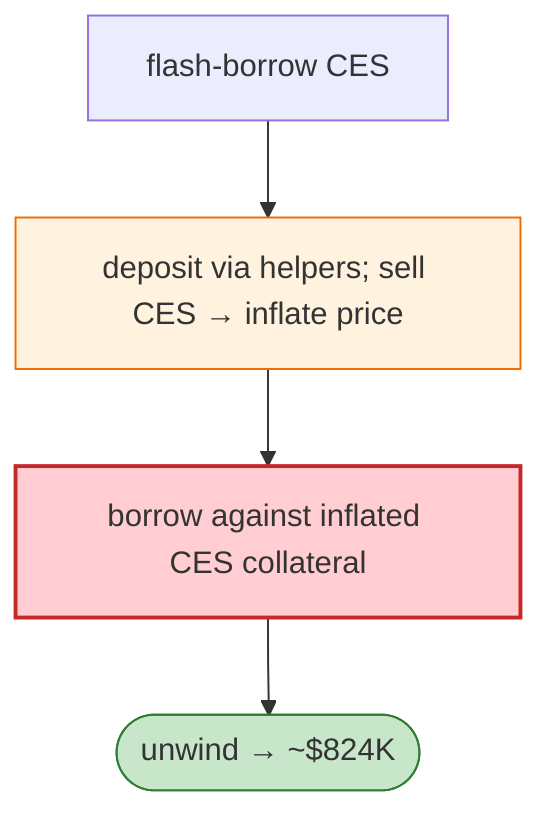

# Whalebit Oracle Manipulation Exploit — CES Deposit/Sell Loop Inflates Collateral Price

> **Reproduction:** the PoC compiles & runs in an isolated Foundry project at
> [this project folder](.). Full verbose trace: [output.txt](output.txt).
> Verified vulnerable source: [CES_tokenV1](sources/CES_tokenV1_a728cf),
> [ERC1967Proxy (4 proxies)](sources/ERC1967Proxy_1Bdf71) (entry proxy `0x404657…`).

---

## Key info

| | |
|---|---|
| **Loss** | ~$824K; tx `0x5d54fa83…` |
| **Vulnerable contract** | Whalebit `0x9153e149…` (entry proxy `0x404657…`, Polygon) |
| **Attacker** | `0xe66b37de…` (contract `0xb5a8d7a3…`) |
| **Chain / block / date** | Polygon / Mar 2026 |
| **Bug class** | Oracle manipulation — Whalebit prices CES collateral from a spot/manipulable source; the attacker flash-borrows CES, deposits via helper contracts, sells CES into the price pool to inflate the collateral value, then borrows against it. |

---

## TL;DR

Per the embedded analysis: the attacker flash-borrows CES, repeatedly deposits through helper
contracts, sells CES into the price-determining pool (inflating the collateral price Whalebit reads),
borrows against the inflated CES, and unwinds for ~$824K.

---

## Root cause

A **manipulable (spot) price oracle** for CES collateral, flash-loan exploitable.

---

## Diagrams



---

## Remediation

1. TWAP/robust oracle for collateral; never spot AMM price.
2. Collateral caps + deviation circuit breakers.

---

## How to reproduce

```bash
_shared/run_poc.sh 2026-03-WhalebitOracleManipulation_exp -vvvvv
```

- RPC: Polygon archive. Result: `[PASS]` — over-borrow against manipulated CES price (~1.5 min).

---

*Reference: Whalebit CES spot-oracle manipulation, Polygon, Mar 2026 (~$824K).*
