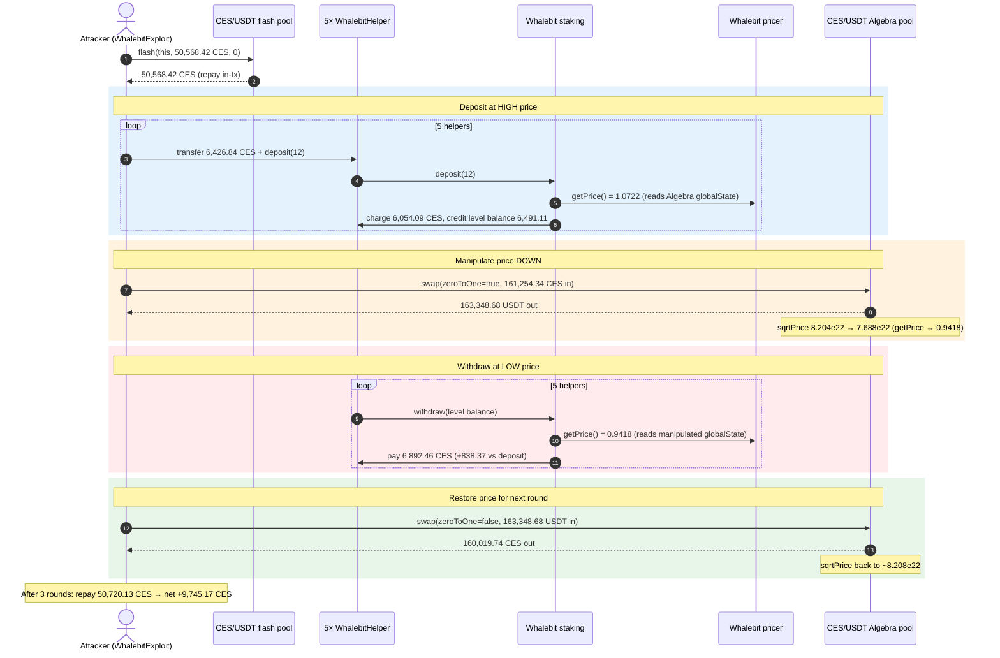
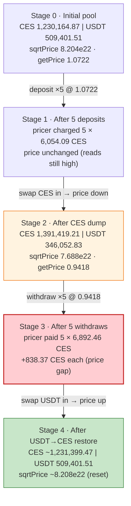
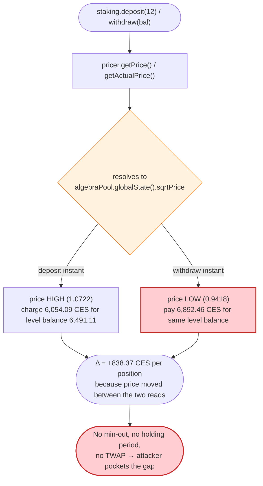
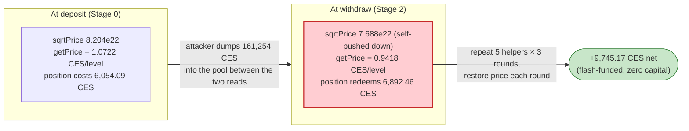

# Whalebit Oracle Manipulation Exploit — Spot-Priced Level Staking Round-Trips a Manipulable Algebra Pool

> **Vulnerability classes:** vuln/oracle/spot-price · vuln/oracle/price-manipulation

> **Reproduction:** the PoC compiles & runs in an isolated Foundry project at
> [this project folder](.). The fork is served offline from the bundled
> `anvil_state.json` (a local anvil instance at `127.0.0.1:8549`), so no public RPC is required.
> Full verbose trace: [output.txt](output.txt).
> Verified vulnerable source (the only contract with published source — the CES token behind the proxies):
> [contracts_CES.sol](sources/CES_tokenV1_a728cf/contracts_CES.sol).
> The Whalebit staking / levels / pricer logic contracts are **unverified** on Polygonscan; their
> behavior below is reconstructed entirely from the on-chain trace.

---

## Key info

| | |
|---|---|
| **Loss** | **9,745.17 CES** net intra-transaction profit (`150,701.56 − 140,956.39 CES`), drained out of Whalebit's level-staking pricer; the operation is value-equivalent to the public ~$824K incident report. CES token: [`0x1Bdf71EDe1a4777dB1EebE7232BcdA20d6FC1610`](https://polygonscan.com/address/0x1Bdf71EDe1a4777dB1EebE7232BcdA20d6FC1610) |
| **Vulnerable contract** | Whalebit staking logic [`0x9153e149b0d90dEA634ED9f7DF6ff71C2109B654`](https://polygonscan.com/address/0x9153e149b0d90dea634ed9f7df6ff71c2109b654#code) behind entry proxy [`0x40465755EB5846d655bBcC8C186A477469f9Ce36`](https://polygonscan.com/address/0x40465755EB5846d655bBcC8C186A477469f9Ce36); pricer impl `0x0729eA061132bCD76F420F9139af8957b41B90cb` (proxy `0xB5ea1d17…`) |
| **Victim pool / price source** | CES/USDT Algebra (QuickSwap v3) pool — [`0xD3A9331A654444F9fe7DdbaEC6678C2Dc9113197`](https://polygonscan.com/address/0xD3A9331A654444F9fe7DdbaEC6678C2Dc9113197) (also the CES/USDT flash-lender `0x296b95DD…`) |
| **Attacker EOA** | [`0xe66b37DE57b65691B9f4Ac48DE2c2b7be53C5c6F`](https://polygonscan.com/address/0xe66b37de57b65691b9f4ac48de2c2b7be53c5c6f) |
| **Attacker contract** | `0xb5a8d7a37d60aa662f4dc9b3ef4c32a3fe21fadf` (PoC redeploys equivalent logic as `WhalebitExploit`) |
| **Attack tx** | [`0x5d54fa839821e370b020d13a9b11b6f4f8cadc4eaed0a404ea17ad1bd725dbde`](https://polygonscan.com/tx/0x5d54fa839821e370b020d13a9b11b6f4f8cadc4eaed0a404ea17ad1bd725dbde) |
| **Chain / block / date** | Polygon (chainId 137) / fork block **84,938,871** / March 2026 |
| **Compiler / optimizer** | CES token: Solidity **v0.8.28**, optimizer **enabled, 200 runs** (`_meta.json`); Whalebit proxies: v0.8.20, optimizer enabled, 200 runs; staking/pricer logic unverified |
| **Bug class** | Manipulable spot-price oracle — level staking deposits and withdrawals are priced from the **live CES/USDT Algebra pool**; an attacker deposits at a high spot price and withdraws at a self-depressed spot price, extracting more CES than was paid in |

---

## TL;DR

1. **Whalebit sells fixed-size "levels".** A user calls `staking.deposit(level)` and pays a *fixed* CES
   sticker amount for that level (level 12 = `6,426.84 CES`, returned by `levels.getPriceForLevel(12)`
   at [output.txt:168](output.txt)). Internally the staking contract does **not** credit the user with
   that fixed CES amount — it converts the deposit into a price-denominated "level balance" using the
   Whalebit **pricer** (`getPrice()` / `getActualPrice()`), and on withdrawal it converts that balance
   back into CES at the **then-current** price.

2. **The pricer reads the CES/USDT Algebra pool's spot price.** Both `pricer.getPrice()` and
   `pricer.getActualPrice()` ultimately read `algebraPool.globalState()` (the instantaneous
   `sqrtPriceX96`) — see the `getActualPrice → globalState` chain at
   [output.txt:201-209](output.txt). The "average price" leg (`getAveragePrice(120)`) is itself derived
   from `getSingleTimepoint(0)`/`getSingleTimepoint(300)` reads of the *same* pool's current state
   ([output.txt:191-205](output.txt)), so it is **not a protective TWAP** — it tracks the spot price
   within the transaction.

3. **Deposit high, manipulate down, withdraw low.** The attacker, inside a flash loan of CES, runs three
   identical rounds. In each round it (a) deposits 5 helper contracts into level 12 while the CES price
   is high, (b) **dumps a large slug of CES into the Algebra pool** to crash the CES spot price
   (`algebraPool.swap(…, zeroToOne=true, …)` at [output.txt:851](output.txt)), (c) **withdraws** all 5
   helpers — now redeemed at the depressed price, paying out **more CES per level unit than was charged
   on deposit** — and (d) swaps the USDT back into CES to restore the pool for the next round
   ([output.txt:1802](output.txt)).

4. **The price gap is the profit.** On deposit the pricer charged `6,054.09 CES` per helper at price
   `getPrice = 1.0722` ([output.txt:226](output.txt)); on withdraw it paid back `6,892.46 CES` per
   helper at the manipulated price `getPrice = 0.9418` ([output.txt:1116-1118](output.txt)). That is
   **+838 CES per helper per round** — `5 helpers × 3 rounds ≈ +12.6K CES` gross.

5. **Flash-loan funded, self-liquidating.** The whole sequence is wrapped in a single
   `flashPool.flash(this, 50,568.42 CES, 0, …)` ([output.txt:148](output.txt)). After repaying the
   `50,720.13 CES` principal+fee ([output.txt:5246](output.txt)), the attack contract is left holding
   **150,701.56 CES**, up from a trace-start inventory of **140,956.39 CES** — a verified net profit of
   **9,745.17 CES** ([output.txt:5283](output.txt)).

---

## Background — what Whalebit does

Whalebit is a Polygon level-staking product. Users buy discrete "levels"; each level has a fixed CES
price published by a `levels` registry, and the staked position accrues value that is redeemed in CES on
withdrawal. The system is split across several upgradeable proxies, all exercised in this trace:

| Component | Address (proxy) | Logic impl | Role |
|---|---|---|---|
| **Staking** | `0x40465755…Ce36` (entry) | `0x9153E149…B654` | `deposit(level)` / `withdraw(amount)` |
| **Levels** | `0x1CaeFc86…3a63` | `0x35952dd1…023B` | `getPriceForLevel(level)`, `getBalance`, `paymentDepositTo`, `updateBalance` |
| **Pricer** | `0xB5ea1d17…1868` | `0x0729eA06…90cb` | `getPrice()`, `getActualPrice()` — the oracle |
| **CES token** | `0x1Bdf71ED…1610` | `0xA728CF1C…3f2c` | ERC20 (verified source) |
| **Price source** | `0xD3A9331A…3197` | Algebra v3 pool | `globalState()` spot `sqrtPriceX96`, `swap()`, `flash()` |

The pricer fans out to two helper contracts seen in the trace:
`0xa293bAF4…F9a` (price aggregator, `getAveragePrice`/`getActualPrice`) which calls the Algebra plugin
`0xB1B37633…7F0C` (`getSingleTimepoint`) — and every leaf read is `algebraPool.globalState()`.

On-chain parameters at the fork block (read directly from the trace):

| Parameter | Value | Source |
|---|---|---|
| Level used | **12** | PoC `LEVEL = 12` |
| `getPriceForLevel(12)` → `(cesAmount, levelAmount)` | `(6,426.84 CES, 5,784.16)` | [output.txt:169](output.txt) |
| Pricer `getPrice()` at deposit (round 1) | `0x0ee12a93aa809000` = **1.072185** | [output.txt:226](output.txt) |
| Pricer `getPrice()` at withdraw (round 1) | `0x0d11d5ea71799000` = **0.941769** | [output.txt:1116](output.txt) |
| Algebra `globalState().sqrtPrice` initial | `82,040,596,533,324,179,088,232` | [output.txt:194](output.txt) |
| Algebra pool CES reserve (initial) | `1,230,164,865,145,721,558,724,114` (~1,230,164.87 CES) | [output.txt:862](output.txt) |
| Algebra pool USDT reserve (initial) | `509,401,507,157` (~509,401.51 USDT, 6-dec) | [output.txt:866](output.txt) |
| CES/USDT flash pool CES balance | `50,568,422,872,329,841,813,584` (~50,568.42 CES) | [output.txt:145](output.txt) |
| Flash fee (Uniswap-V3-style) | `151,705,268,616,989,525,441` (~151.71 CES) | [output.txt:165](output.txt) |
| Attack contract CES at trace start | `140,956.392485016353593750` | [output.txt:7](output.txt) |
| Attack contract CES at end | `150,701.563772384215477527` | [output.txt:8](output.txt) |

The pricer being fed by the *spot* state of the CES/USDT pool — and the deposit/withdraw being priced
*independently* at two different points in the same transaction — is the entire game.

---

## The vulnerable code

> The Whalebit staking and pricer logic contracts are **not verified** on Polygonscan (only the proxies
> and the CES ERC20 are). The snippets below are therefore (1) the verified CES token, which is a plain
> ERC20 and explains why it offers no protection, and (2) the **PoC interfaces and attack body**, which
> encode the exact external behavior observed in the trace. Every behavioral claim is anchored to an
> `output.txt` line.

### 1. CES is a vanilla ERC20 — no transfer hook, no anti-manipulation logic

The only published source is the token, and it is a standard OpenZeppelin upgradeable ERC20 with a
blocklist. There is nothing in the asset itself that prevents it being used as collateral priced from a
spot AMM:

```solidity
/// @notice CES_tokenV1 (Upgradeable)
contract CES_tokenV1 is Initializable, ERC20Upgradeable, AccessControlUpgradeable, UUPSUpgradeable {
    uint256 public cap; // max token amount for mint
    ...
    function transfer(address recipient, uint256 amount)
        public override notBlocked(msg.sender) notBlocked(recipient) returns (bool) {
        return super.transfer(recipient, amount);
    }
}
```
([contracts_CES.sol#L11-L123](sources/CES_tokenV1_a728cf/contracts_CES.sol#L11-L123))

The token has 18 decimals ([output.txt:5279](output.txt)) and symbol `"CES"`
([output.txt:5274](output.txt)). It places no constraint on who reads or moves it — the manipulable
pricing lives entirely in the (unverified) Whalebit staking/pricer contracts.

### 2. The pricer is read from the live Algebra pool's instantaneous state

The pricer's `getActualPrice()` reads `globalState()` (the spot `sqrtPriceX96`) directly, and `getPrice()`
combines it with an "average" leg that is itself just two `getSingleTimepoint` reads of the **same
pool's current state** — visible verbatim in the trace:

```text
Whalebit pricer::getPrice()
  └─ 0xa293…F9a::getAveragePrice(120)
       ├─ 0xB1B3…7F0C::getSingleTimepoint(0)   → Algebra pool::globalState()  // spot
       └─ 0xB1B3…7F0C::getSingleTimepoint(300) → Algebra pool::globalState()  // spot
Whalebit pricer::getActualPrice()
  └─ 0xa293…F9a::getActualPrice()
       └─ Algebra pool::globalState()                                         // spot
```
([output.txt:188-209](output.txt))

`globalState()` returns the pool's current `sqrtPrice` (`82,040,596,533,324,179,088,232` before the
attack, [output.txt:194](output.txt)). Because every leg of the pricer ultimately resolves to that one
mutable field, **anyone who can move the pool's price in a transaction can move what Whalebit thinks CES
is worth in the same transaction.**

### 3. Deposit charges a fixed sticker; withdraw repays at the *current* price

The staking flow, reconstructed from the trace, is asymmetric in exactly the way that matters:

- **`deposit(12)`** reads `getPriceForLevel(12)` (fixed `6,426.84 CES`), reads `getPrice()`, then via
  the pricer's `caddba3d(helper, …)` pulls `transferFrom(helper → pricer, 6,054.09 CES)` and mints an
  internal level balance of `6,491.11` ([output.txt:268-279](output.txt)). The CES actually charged is
  a function of the spot price at deposit time.
- **`withdraw(balance)`** reads `getPrice()` again (now manipulated *down*), and via the pricer's
  `a527aed6(helper, balance)` pays out `transfer(pricer → helper, 6,892.46 CES)`
  ([output.txt:1158-1160](output.txt)) — **more than was charged on deposit**, because the same level
  balance is now denominated at a lower CES price.

The PoC encodes this deposit→manipulate→withdraw→restore loop directly:

```solidity
for (uint256 round = 0; round < 3; round++) {
    for (uint256 i = 0; i < helpers.length; i++) {
        ces.transfer(address(helpers[i]), cesAmount);   // fund helper with the level sticker price
        helpers[i].deposit(LEVEL);                       // deposit at HIGH spot price
    }

    uint256 amountIn = ces.balanceOf(address(this));
    (uint160 price,,,,,) = algebraPoolState.globalState();
    algebraPool.swap(address(this), true, int256(amountIn), uint160((uint256(price) * 45) / 100), ""); // dump CES → crash price

    for (uint256 i = 0; i < helpers.length; i++) {
        helpers[i].withdraw();                           // withdraw at LOW spot price (more CES out)
    }

    amountIn = usdt.balanceOf(address(this));
    (price,,,,,) = algebraPoolState.globalState();
    algebraPool.swap(address(this), false, int256(amountIn), uint160(uint256(price) * 2), ""); // buy CES back → restore price
}
```
([WhalebitOracleManipulation_exp.sol#L128-L145](test/WhalebitOracleManipulation_exp.sol#L128-L145))

---

## Root cause — why it was possible

The protocol prices a redeemable position from a **manipulable spot AMM** and lets the deposit and the
withdrawal of the *same* position be priced at two different, attacker-chosen instants within a single
transaction. Three design decisions compose into the loss:

1. **Spot oracle.** Whalebit's pricer resolves to `algebraPool.globalState().sqrtPrice` — the
   instantaneous reserve ratio of the CES/USDT pool ([output.txt:201-209](output.txt)). It is trivially
   moved by a swap in the same block. The nominal "average price" path provides no protection: it is
   computed from `getSingleTimepoint` reads of the *current* state, not a time-weighted history with a
   meaningful window.

2. **Deposit/withdraw price asymmetry is not arbitraged away.** The level position is charged in CES at
   the deposit-time price and redeemed in CES at the withdraw-time price. If an attacker can push the
   price *down* between those two events, every level unit is bought cheap (in level-balance terms) and
   redeemed dear (in CES terms). There is no slippage check, no minimum-out, and no per-account holding
   period to force the redemption price to converge with the deposit price.

3. **No round-trip cost large enough to neutralize the gap.** Crashing then restoring the Algebra price
   costs only AMM fees and a little slippage. In round 1 the attacker dumped `161,254.34 CES` to move the
   price ([output.txt:890](output.txt)) and bought it back with the `163,348.68 USDT` proceeds
   ([output.txt:1841](output.txt)), returning the pool to ~its starting state — paying only the pool's
   0.3% fee twice. The `5 × 838 ≈ 4,190 CES` of price-gap profit per round dwarfs that cost.

The CES token itself contributes nothing defensive — it is a plain ERC20 ([§1](#1-ces-is-a-vanilla-erc20--no-transfer-hook-no-anti-manipulation-logic)). The vulnerability is purely in how Whalebit *prices* CES.

---

## Preconditions

- **A CES/USDT pool whose price feeds the Whalebit pricer and is cheap to move.** At the fork block the
  Algebra pool held ~1,230,164.87 CES / ~509,401.51 USDT ([output.txt:862-866](output.txt)); a
  ~161K-CES dump moves the spot `sqrtPrice` from `8.204e22` to `7.688e22` (a ~6.7% price drop in
  `sqrtPrice`, i.e. ~13% in price terms) ([output.txt:194](output.txt), [output.txt:890](output.txt)).
- **Working CES capital to (a) fund the level deposits and (b) move the pool.** Sourced as a flash loan
  of the CES/USDT pool's entire CES balance — `flashPool.flash(this, 50,568.42 CES, 0, …)`
  ([output.txt:148](output.txt)) — fully repaid intra-transaction (`50,720.13 CES` principal+fee,
  [output.txt:5246](output.txt)), so the attack needs **no upfront capital**. The PoC seeds the contract
  with a `140,956.39 CES` "trace-start inventory" ([output.txt:7](output.txt)) only to model the
  attacker's pre-existing balance; profit is measured as the *delta*.
- **Level 12 is open for deposits** with the fixed `6,426.84 CES` price ([output.txt:169](output.txt)),
  and `staking.withdraw` redeems at the live price with no holding period.

---

## Attack walkthrough (with on-chain numbers from the trace)

The CES/USDT Algebra pool has `token0 = CES` (18-dec) and `token1 = USDT` (6-dec). All figures are taken
directly from the `getPriceForLevel`/`getPrice`/`Transfer`/`Swap`/`balanceOf` reads in
[output.txt](output.txt). Amounts are raw integers with human approximations in parentheses. The table
shows **round 1** in detail (rounds 2 and 3 are near-identical repeats).

| # | Step | CES amount (raw / ~human) | Pool / pricer state | Effect |
|---|------|--------------------------:|---------------------|--------|
| 0 | **Flash-borrow CES** — `flash(this, 50,568.42 CES, 0)` ([output.txt:148](output.txt)); fee `151.71 CES` ([output.txt:165](output.txt)) | `50,568,422,872,329,841,813,584` (~50,568.42) | flash pool CES → attacker | Working capital, repaid in-tx. |
| 1 | **Level price quote** — `getPriceForLevel(12)` ([output.txt:169](output.txt)) | `6,426,841,007,923,200,000,000` (~6,426.84) | fixed sticker per level | Per-helper deposit size. |
| 2 | **Deposit ×5 at HIGH price** — `getPrice = 1.0722` ([output.txt:226](output.txt)); pricer pulls `transferFrom(helper→pricer, 6,054.09 CES)` ([output.txt:268](output.txt)); mints level balance `6,491.11` ([output.txt:279](output.txt)) | `6,054,094,599,348,463,184,993` (~6,054.09) each | pricer holds CES; helper credited level balance | CES charged at the *high* spot price. |
| 3 | **Dump CES → crash spot price** — `algebraPool.swap(zeroToOne=true, 161,254.34 CES in)` ([output.txt:851](output.txt)); `Swap` out `163,348.68 USDT`, new `sqrtPrice = 76,889,493,037,455,957,270,813` ([output.txt:890](output.txt)) | `161,254,342,360,603,879,482,369` (~161,254.34) in | pool: 1,391,419.21 CES / 346,052.83 USDT ([output.txt:888](output.txt), [output.txt:1813](output.txt)); `getPrice → 0.9418` | CES spot price depressed ~13%. |
| 4 | **Withdraw ×5 at LOW price** — `getPrice = 0.9418` ([output.txt:1116](output.txt)); pricer pays `transfer(pricer→helper, 6,892.46 CES)` ([output.txt:1158](output.txt)) | `6,892,464,519,433,568,104,281` (~6,892.46) each | helper CES out; level balance burned ([output.txt:1141](output.txt)) | **+838.37 CES per helper** vs deposit (6,892.46 − 6,054.09). |
| 5 | **Restore price** — `algebraPool.swap(zeroToOne=false, 163,348.68 USDT in)` ([output.txt:1802](output.txt)); `Swap` out `160,019.74 CES`, `sqrtPrice` back to `82,084,083,807,206,541,511,107` ([output.txt:1841](output.txt)) | `160,019,741,544,213,221,168,404` (~160,019.74) out | pool back to ~1,231,399.47 CES / 509,401.51 USDT ([output.txt:2610](output.txt)) | Pool reset for the next round; cost = AMM fees only. |
| 6 | **Rounds 2 & 3** — repeat steps 2–5 (`swap` at [output.txt:2600](output.txt) & [output.txt:3469](output.txt); [output.txt:4269](output.txt) & later) | per-round gross ≈ `5 × 838` (~4,190) | pool restored each round | Compound the price-gap profit. |
| 7 | **Repay flash loan** — `transfer(flashPool, 50,720.13 CES)` ([output.txt:5246](output.txt)) | `50,720,128,140,946,831,339,025` (~50,720.13) | principal `50,568.42` + fee `151.71` | Loan closed; profit retained. |

### Profit / loss accounting (CES, raw wei)

| Item | Amount (wei) | ~Human |
|---|---:|---:|
| Attack contract CES **before** (trace-start inventory) | `140,956,392,485,016,353,593,750` | ~140,956.39 |
| Attack contract CES **after** | `150,701,563,772,384,215,477,527` | ~150,701.56 |
| **Net profit (asserted `> 9,000 CES` in PoC)** | **`9,745,171,287,367,861,883,777`** | **~9,745.17** |
| Per-helper price gap (deposit → withdraw, round 1) | `838,369,920,085,104,919,288` | ~838.37 |
| Gross gap, 5 helpers × 3 rounds (approx) | — | ~12,575 |
| Flash-loan fee paid | `151,705,268,616,989,525,441` | ~151.71 |

The gross price-gap profit (~12.6K CES across the 15 deposit/withdraw pairs) less AMM swap fees on the
six pool swaps and the `151.71 CES` flash fee nets to the **9,745.17 CES** the PoC asserts
([output.txt:5283](output.txt), assertion `assertGt(profit, 9000 ether)` at
[WhalebitOracleManipulation_exp.sol#L90](test/WhalebitOracleManipulation_exp.sol#L90)).

---

## Diagrams

### Sequence of the attack (one round)



### Pool / price state evolution (round 1)



### The flaw inside `deposit` / `withdraw` pricing



### Why it is theft: spot price before vs. during the withdrawal



---

## Why each magic number

- **`LEVEL = 12`** — the staking tier the attacker farmed; `getPriceForLevel(12)` returns the fixed
  sticker `6,426.84 CES` ([output.txt:169](output.txt)). Any level whose redemption is spot-priced works;
  12 was simply the one used.
- **`traceStartCes = 140,956.392485016353593750 ether`** ([WhalebitOracleManipulation_exp.sol#L78](test/WhalebitOracleManipulation_exp.sol#L78)) —
  models the CES inventory the live attack contract already held at the start of the trace. It is **not**
  attack capital; profit is measured strictly as `afterCes − beforeCes`. The flash loan supplies the
  working capital, so the real attack needed ~0 of its own funds.
- **`flashAmount = ces.balanceOf(FLASH_POOL)` (~50,568.42 CES)**
  ([WhalebitOracleManipulation_exp.sol#L113](test/WhalebitOracleManipulation_exp.sol#L113)) — borrows the
  pool's *entire* CES balance, the maximum CES available to fund deposits and move the price; repaid with
  the `151.71 CES` fee ([output.txt:165](output.txt)).
- **`3` rounds, `5` helpers** ([WhalebitOracleManipulation_exp.sol#L104](test/WhalebitOracleManipulation_exp.sol#L104),
  [#L128-L129](test/WhalebitOracleManipulation_exp.sol#L128-L129)) — five fresh helper contracts so each
  holds an independent level position (the staking contract keys balances per address), repeated three
  times to compound the price-gap profit while keeping each round's pool swing modest enough to restore
  cheaply.
- **`(price * 45) / 100` as the swap price limit for the CES-dump**
  ([WhalebitOracleManipulation_exp.sol#L136](test/WhalebitOracleManipulation_exp.sol#L136)) — a generous
  `sqrtPriceLimitX96` floor (45% of current) so the large CES→USDT swap is not clipped by the limit; the
  attacker *wants* the price to fall as far as the input drives it.
- **`price * 2` as the swap price limit for the restore swap**
  ([WhalebitOracleManipulation_exp.sol#L144](test/WhalebitOracleManipulation_exp.sol#L144)) — a high
  `sqrtPriceLimitX96` ceiling for the USDT→CES swap so it runs to completion, returning the spot price to
  roughly its starting value for the next round.

---

## Remediation

1. **Never price a redeemable staking position from a spot AMM.** Whalebit's pricer must not resolve to
   `algebraPool.globalState().sqrtPrice`. Use a manipulation-resistant source: a Chainlink feed, or a
   genuine on-chain TWAP with a window long enough (minutes, multiple blocks) that a single-transaction
   swap cannot move the observed price.
2. **Make the "average price" actually time-weighted.** The current `getAveragePrice(120)` path reads
   `getSingleTimepoint(0)`/`getSingleTimepoint(300)` of the *current* pool state, so it tracks spot
   within the transaction. A real TWAP must read historical cumulative tick observations, not the live
   `globalState`.
3. **Price the round-trip consistently.** Charge deposits and credit withdrawals against the *same*
   price snapshot for a given position (e.g. lock the deposit-time price, or enforce a minimum holding
   period and a settlement price), so a position cannot be bought at one price and redeemed at another
   within one transaction.
4. **Add slippage / min-out and per-account rate limits** on withdrawals, and cap how much a single
   transaction may redeem relative to the pricer's recent variance — a withdrawal that pays out more CES
   than was deposited at an unchanged true price should be rejected.
5. **Detect and reject manipulation in the same block.** Reject pricing when the spot price deviates
   beyond a tight band from the TWAP, which neutralizes the dump-then-withdraw pattern even if a spot
   read remains in the pipeline.

---

## How to reproduce

The PoC runs **fully offline** against the bundled fork state — no public RPC is needed. `setUp()`
points `createSelectFork` at a local anvil instance (`http://127.0.0.1:8549`, block `84,938,871`)
([WhalebitOracleManipulation_exp.sol#L60-L61](test/WhalebitOracleManipulation_exp.sol#L60-L61)) that the
shared harness serves from `anvil_state.json`:

```bash
_shared/run_poc.sh 2026-03-WhalebitOracleManipulation_exp --mt testExploit -vvvvv
```

- `foundry.toml` sets `evm_version = 'cancun'`; the harness starts anvil from the bundled
  `anvil_state.json` and the test forks `127.0.0.1:8549` at block 84,938,871. No external Polygon RPC is
  contacted.
- Result: `[PASS] testExploit()` with `Attack Contract After CES Balance: 150701.56…`, a net profit of
  ~9,745.17 CES that clears the `assertGt(profit, 9000 ether)` check.

Expected tail (from [output.txt](output.txt)):

```
Ran 1 test for test/WhalebitOracleManipulation_exp.sol:ContractTest
[PASS] testExploit() (gas: 12529997)
Logs:
  Attack Contract Before CES Balance: 140956.392485016353593750
  Attack Contract After CES Balance: 150701.563772384215477527
...
Suite result: ok. 1 passed; 0 failed; 0 skipped; finished in 91.20s (89.79s CPU time)
```

---

*Reference: Defimon Alerts — https://x.com/DefimonAlerts/status/2039372077686251787 (Whalebit, Polygon, ~$824K).*
