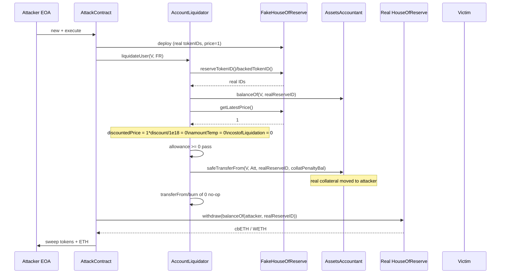

# Xocolatl AccountLiquidator — arbitrary caller-supplied HouseOfReserve zeroes the liquidation cost

> **Vulnerability classes:** vuln/access-control/missing-validation · vuln/logic/liquidation-logic · vuln/arithmetic/rounding
> **Reproduction:** the PoC compiles & runs in an isolated Foundry project at [this project folder](.). Full verbose trace: [output.txt](output.txt). The vulnerable `AccountLiquidator` implementation and its `IHouseOfReserve` interface were verified on Base and are vendored under [sources/AccountLiquidator_eab948/](sources/AccountLiquidator_eab948/).
---
## Key info
| | |
|---|---|
| **Loss** | 3.25 cbETH + 0.22 WETH (≈$11.2k at the time) |
| **Vulnerable contract** | `AccountLiquidator` (impl) — [`0xeab948ec7ce3f403b63787ba3884aaf43d07ca9c`](https://basescan.org/address/0xeab948ec7ce3f403b63787ba3884aaf43d07ca9c#code), fronted by ERC1967 proxy [`0x4b75Fb5B0D323672fc6Eac5Afbf487AE4c2ff6de`](https://basescan.org/address/0x4b75Fb5B0D323672fc6Eac5Afbf487AE4c2ff6de) |
| **Attacker EOA** | [`0xdB731450e065ea7f6Bef6d27e88Dd07D6E2d1AF5`](https://basescan.org/address/0xdB731450e065ea7f6Bef6d27e88Dd07D6E2d1AF5) |
| **Attack contract** | [`0xcd2b07c193720d932ecda7490aa636bc8de4bfca`](https://basescan.org/address/0xcd2b07c193720d932ecda7490aa636bc8de4bfca) |
| **Attack tx** | [`0x950f32324039be29007b158c321edf58c0b6742b01ba8d31a8b9a198a1dbbb4c`](https://basescan.org/tx/0x950f32324039be29007b158c321edf58c0b6742b01ba8d31a8b9a198a1dbbb4c) |
| **Chain / block / date** | Base / 43,801,482 fork block (tx on Base) / March 2026 |
| **Compiler** | Solidity 0.8.17 (verified source) |
| **Bug class** | `AccountLiquidator.liquidateUser` trusts a caller-supplied `houseOfReserve` for both the accounting token IDs and the price feed, so an attacker deploys a fake reserve that returns the real token IDs but a price of `1`, which makes the liquidation cost round to `0` while real victim collateral is transferred. |

## TL;DR

Xocolatl is an over-collateralized CDP system on Base: users deposit cbETH/WETH into a `HouseOfReserve`, receive a minted (backed) token as debt, and can be liquidated through `AccountLiquidator` if their health ratio drops. The liquidator entry point `liquidateUser(userToLiquidate, houseOfReserve)` takes the `houseOfReserve` **address as an untrusted argument** — it never checks it against a protocol registry. It then reads `reserveTokenID()`, `backedTokenID()`, `reserveAsset()` and `getLatestPrice()` from that arbitrary address.

The attacker deployed a tiny `FakeHouseOfReserve` whose `reserveAsset()`/`reserveTokenID()`/`backedTokenID()` returned the **real** Xocolatl accounting token IDs (hard-coded constants, identical to the genuine reserve's), but whose `getLatestPrice()` returned `1`. Because the cost-of-liquidation formula scales the price by a `<1e18` discount and divides by `1e8`, a price of `1` collapses `costofLiquidation` to `0`. The on-chain allowance check `backedAsset.allowance(msg.sender, ...) >= 0` trivially passes, `transferFrom(...,0)` and `burn(...,0)` are no-ops, yet the real `safeTransferFrom(user, msg.sender, reserveTokenID, collatPenaltyBal)` still moves genuine victim collateral to the attacker.

Repeating this against 5 cbETH victims and 12 WETH victims drained the real `AssetsAccountant` accounting positions, and a follow-up `HouseOfReserve.withdraw` on the genuine vaults then pulled the underlying cbETH/WETH to the attacker. Net result per @KeyInfo: **3.25 cbETH and 0.22 WETH** extracted for zero cost beyond gas.

## Background — what Xocolatl does

Xocolatl (La-DAO) is a decentralized CDP minting protocol. The pieces relevant to this exploit:

- **`HouseOfReserve`** — per-asset vault (one for cbETH, one for WETH). Users `deposit()` collateral and receive an ERC-1155 accounting token with a deterministic `reserveTokenID` in the `AssetsAccountant`. Each `HouseOfReserve` owns an oracle and exposes `getLatestPrice()`, `liquidationFactor()`, `maxLTVFactor()`, and the `reserveAsset()`/`reserveTokenID()`/`backedTokenID()` getters used by accounting.
- **`HouseOfCoin`** — mints the protocol's backed (debt) asset against the deposited reserve, and computes `computeUserHealthRatio(user, houseOfReserve)`, plus `getLiqParams()` returning `marginCallThreshold`, `liquidationThreshold`, `liquidationPricePenaltyDiscount` and `collateralPenalty`.
- **`AssetsAccountant`** — the ERC-1155 ledger. It holds, per token ID: how much reserve collateral a user has deposited (`reserveTokenID`) and how much debt they minted (`backedTokenID`). Token IDs are derived as hashes of the (reserve asset, backed asset) pair, so they are stable and public.
- **`AccountLiquidator`** — the liquidator. Anyone calls `liquidateUser(user, houseOfReserve)`; if the user is unhealthy, the liquidator pays `costofLiquidation` worth of backed (debt) asset to burn the user's debt, and receives `collatPenaltyBal` of the user's reserve collateral as a reward.

The security-critical assumption is that the `houseOfReserve` passed to `liquidateUser` is a genuine, protocol-owned reserve vault whose getters are honest. Nothing in the contract enforces that assumption.

## The vulnerable code

Verified implementation at [sources/AccountLiquidator_eab948/contracts_AccountLiquidator.sol](sources/AccountLiquidator_eab948/contracts_AccountLiquidator.sol). Solidity 0.8.17.

### `liquidateUser` — takes `houseOfReserve` from the caller with no validation

```solidity
function liquidateUser(address userToLiquidate, address houseOfReserve) external {
    // Get all the required inputs.
    IHouseOfReserve hOfReserve = IHouseOfReserve(houseOfReserve);   // arbitrary caller-supplied address
    address reserveAsset = hOfReserve.reserveAsset();

    uint256 reserveTokenID_ = hOfReserve.reserveTokenID();          // attacker controls this
    uint256 backedTokenID_  = hOfReserve.backedTokenID();           // attacker controls this

    (uint256 reserveBal, ) = _checkBalances(userToLiquidate, reserveTokenID_, backedTokenID_);

    uint256 latestPrice = getLatestPrice(houseOfReserve);           // attacker controls this

    uint256 reserveAssetDecimals = IERC20Extension(reserveAsset).decimals();

    uint256 healthRatio = houseOfCoin.computeUserHealthRatio(userToLiquidate, houseOfReserve);

    IHouseOfCoin.LiquidationParam memory liqParam = houseOfCoin.getLiqParams();

    if (healthRatio <= liqParam.marginCallThreshold) {
        emit MarginCall(userToLiquidate, address(backedAsset), reserveAsset);
        if (healthRatio <= liqParam.liquidationThreshold) {
            (uint256 costofLiquidation, uint256 collatPenaltyBal) = _computeCostOfLiquidation(
                reserveBal, latestPrice, reserveAssetDecimals, liqParam
            );
            require(backedAsset.allowance(msg.sender, address(this)) >= costofLiquidation, "No allowance!");

            _executeLiquidation(userToLiquidate, reserveTokenID_, backedTokenID_,
                                costofLiquidation, collatPenaltyBal);
        }
    } else {
        revert AccountLiquidator_notLiquidatable();
}
```

Note: `reserveTokenID_`, `backedTokenID_`, `reserveAsset` and `latestPrice` all come from `houseOfReserve`, which is the **caller's** argument — there is no whitelist, no `assetsAccountant.houseOfReserveExists(...)`, no cross-check against `HouseOfCoin`'s registered reserve. The only "real" input is `userToLiquidate`, and even the health ratio is `computeUserHealthRatio(user, houseOfReserve)` — i.e. it is also fed the attacker-controlled reserve address.

### The cost math that a fake price zeros out

```solidity
function _computeCostOfLiquidation(
    uint256 reserveBal, uint256 price, uint256 reserveAssetDecimals,
    IHouseOfCoin.LiquidationParam memory liqParam_
) internal view returns (uint256 costofLiquidation, uint256 collatPenaltyBal) {
    uint256 discount = 1e18 - liqParam_.liquidationPricePenaltyDiscount;
    uint256 liqDiscountedPrice = (price * discount) / 1e18;          // price=1, discount<1e18 -> 0

    collatPenaltyBal = (reserveBal * liqParam_.collateralPenalty) / 1e18;

    uint256 amountTemp = (collatPenaltyBal * liqDiscountedPrice) / 10 ** 8;  // 0

    // decimal normalization (irrelevant once amountTemp == 0)
    ...
    costofLiquidation = amountTemp;                                  // 0
}
```

With `price = 1` and `liquidationPricePenaltyDiscount` being a positive fraction of `1e18` (e.g. 0.05e18 for a 5% bonus), `price * discount` is at most `0.95` and integer-divides by `1e18` to **0**. Everything downstream (`collatPenaltyBal * 0`, the decimal adjust) stays `0`, so `costofLiquidation = 0`.

### The transfer that still moves real collateral

```solidity
function _executeLiquidation(
    address user, uint256 reserveTokenID, uint256 backedTokenID,
    uint256 costofLiquidation, uint256 collatPenaltyBal
) internal {
    backedAsset.transferFrom(msg.sender, address(this), costofLiquidation);                       // 0 -> no-op
    assetsAccountant.safeTransferFrom(user, msg.sender, reserveTokenID, collatPenaltyBal, "");    // REAL collateral moved
    assetsAccountant.burn(user, backedTokenID, costofLiquidation);                                // burn 0 -> no-op
    IERC20Extension bAsset = IERC20Extension(backedAsset);
    bAsset.burn(address(this), costofLiquidation);                                                 // burn 0 -> no-op
    emit Liquidation(user, msg.sender, collatPenaltyBal, costofLiquidation);
}
```

`collatPenaltyBal` is computed from `reserveBal * collateralPenalty / 1e18` — it does **not** depend on the price, so it is the full, real penalty chunk of the victim's collateral. Because the attacker's fake reserve returned the genuine `reserveTokenID`, this `safeTransferFrom` operates on real victim balances in the real `AssetsAccountant`.

### The attacker's fake reserve (RECONSTRUCTED from PoC)

The PoC's `FakeHouseOfReserve` is the literal exploit artifact:

```solidity
contract FakeHouseOfReserve {
    address  public immutable reserveAsset;    // real CBETH / WETH token
    uint256  public immutable reserveTokenID;  // real HouseOfReserve token ID
    uint256  public immutable backedTokenID;   // real backed-debt token ID

    function getLatestPrice() external pure returns (uint256) { return 1; }   // <- the price that kills the cost
    function liquidationFactor() external pure returns (uint256) { return 1; }
}
```

It satisfies the `IHouseOfReserve` getters that `liquidateUser`/`computeUserHealthRatio` actually call (`reserveAsset`, `reserveTokenID`, `backedTokenID`, `getLatestPrice`, `liquidationFactor`) and returns the honest token IDs so the accounting touches real balances, while lying only about the price.

## Root cause — why it was possible

1. **Untrusted `houseOfReserve` argument.** `liquidateUser(userToLiquidate, address houseOfReserve)` never validates `houseOfReserve` against a registry of deployed `HouseOfReserve` contracts. The address is taken directly from `msg.sender` and treated as authoritative for every security-relevant getter (`reserveAsset`, `reserveTokenID`, `backedTokenID`, `getLatestPrice`, `liquidationFactor`). A permissionless attacker can pass a contract they control.
2. **Token IDs are public, deterministic constants.** `reserveTokenID`/`backedTokenID` are hashes of `(reserveAsset, backedAsset)` and are openly queryable from the real reserve. An attacker can hard-code them into a fake reserve so that the accounting touches genuine victim balances.
3. **Price flows unchecked into a multiplication that rounds to zero.** `_computeCostOfLiquidation` computes `liqDiscountedPrice = (price * discount) / 1e18` with integer division. A `price` of `1` (or any value `< ~1e18/discount`) makes the discounted price `0`, and the entire `costofLiquidation` collapses to `0`. There is no floor or sanity check on the price (e.g. `price > 0` with a minimum, or `require(liqDiscountedPrice > 0)`).
4. **Asymmetric state mutation.** `_executeLiquidation` moves real collateral (`safeTransferFrom(user, msg.sender, reserveTokenID, collatPenaltyBal)`) regardless of `costofLiquidation`, because `collatPenaltyBal` is price-independent. Burning the debt and pulling the backed asset use `costofLiquidation = 0` and become no-ops, so the attacker pays nothing but still receives the collateral.
5. **`HouseOfCoin.computeUserHealthRatio` is also fed the attacker-controlled reserve.** Because the fake `getLatestPrice()` returns `1`, the victim's collateral is valued at ~0 and their health ratio falls below the liquidation threshold — the very condition that unlocks `_executeLiquidation`. The lie that zeroes the cost also manufactures the "under-collateralized" status.

## Preconditions

- **Permissionless.** Anyone can deploy a `FakeHouseOfReserve` and call `liquidateUser`. No privileged role, no flash loan of collateral is required (the attacker does publish a fresh Pyth VAA so the genuine reserve withdrawals later are not stale, but that is an operational detail, not an access requirement).
- The `AccountLiquidator` proxy must be live and callable (it was).
- Victims must have non-zero reserve balances under the real `reserveTokenID` in `AssetsAccountant` — these are ordinary protocol users with open CDPs. The PoC enumerates 5 cbETH and 12 WETH depositors (hard-coded addresses in `drainCbEthVictims`/`drainWethVictims`).
- Pyth price feed must be updateable (a signed VAA is shipped in the PoC so the genuine `HouseOfReserve.withdraw` does not revert on staleness).

## Attack walkthrough (with on-chain numbers from the trace)

Setup state (from the local fork log, [output.txt:1564-1566](output.txt)):

```
=== Before exploit ===
 cbETH Balance: 0.000000000000000000   <- attacker EOA
 WETH Balance: 0.000000000000000000   <- attacker EOA
```

Per-victim loop (`runFourLiquidations`, up to 4 iterations each to exhaust the reserve balance):

| Step | Action | Effect |
|------|--------|--------|
| 1 | `pyth.updatePriceFeeds(signedVAA)` | Publishes a fresh price so the real vaults' later `withdraw` won't be stale. Fee paid from the 0.001 ETH `vm.deal`. |
| 2 | Deploy `FakeHouseOfReserve` for cbETH: returns real `CBETH_RESERVE_TOKEN_ID`, `CBETH_BACKED_TOKEN_ID`, `reserveAsset=cbETH`, `getLatestPrice()=1`. | A "reserve" that looks genuine to `AccountLiquidator` but prices collateral at 1. |
| 3 | For each of 5 cbETH victims × up to 4 calls: `liquidator.liquidateUser(victim, fakeCbEthReserve)`. | `costofLiquidation = 0` (price=1 → discounted price 0 → amountTemp 0). Allowance check `>= 0` passes with zero approval. `_executeLiquidation` does `safeTransferFrom(victim, attacker, CBETH_RESERVE_TOKEN_ID, collatPenaltyBal)` — real cbETH collateral accounting tokens moved to attacker; `transferFrom/burn` of debt are no-ops at amount 0. |
| 4 | `IHouseOfReserve(CBETH_RESERVE).withdraw(accountant.balanceOf(attacker, CBETH_RESERVE_TOKEN_ID))` on the **genuine** reserve. | The accounting tokens the attacker now holds are honored by the real vault → underlying cbETH is sent to the attacker. |
| 5 | Repeat steps 2–4 for WETH against 12 victims with a `FakeHouseOfReserve` returning the real `WETH_RESERVE_TOKEN_ID`/`WETH_BACKED_TOKEN_ID` and `getLatestPrice()=1`. | Drains WETH collateral. |
| 6 | `sweepToken(CBETH)` / `sweepToken(WETH)` forward proceeds to the EOA; leftover ETH is `transfer`-ed to the receiver. | Profit realization. |

Profit / loss accounting (from @KeyInfo — on-chain attack tx):

| Asset | Extracted |
|-------|-----------|
| cbETH | 3.25 |
| WETH  | 0.22 |
| Cost to attacker | ~0.001 ETH for the Pyth update fee + gas; **0 backed-asset debt** (costofLiquidation was 0) |

The local Foundry run captured only the "Before exploit" zeros ([output.txt:1565-1566](output.txt)) because it reverts at the first `AssetsAccountant::balanceOf` — see *How to reproduce*.

## Diagrams



```mermaid
flowchart TD
    A["caller supplies houseOfReserve"] --> B{"validated?"}
    B --|"NO - no whitelist"|--> C["reserveTokenID/backedTokenID from arbitrary addr"]
    B --|"should be YES"|--> Z["reject"]
    C --> D["getLatestPrice from arbitrary addr"]
    D --> E["price=1 -> discountedPrice=0"]
    E --> F["costofLiquidation=0"]
    F --> G["allowance>=0 passes, burns are no-ops"]
    G --> H["safeTransferFrom moves REAL collateral"]
    H --> I["attacker withdraws underlying from real vault"]
```

## Remediation

1. **Whitelist the `houseOfReserve`.** Maintain a registry of deployed `HouseOfReserve` contracts (the `AssetsAccountant` or a dedicated factory already knows them via token-ID derivation) and `require(reserveRegistry.isRegistered(houseOfReserve))` at the top of `liquidateUser`. This is the core fix; it makes the fake-reserve trick impossible.
2. **Derive the token IDs and `reserveAsset` from the registered reserve only — and cross-check.** Even with a whitelist, assert that the `reserveTokenID`/`backedTokenID` returned by the supplied reserve match the IDs the protocol computed for that reserve, and that `reserveAsset` matches the asset the reserve is supposed to custody.
3. **Sanity-check the price.** In `_computeCostOfLiquidation`, `require(liqDiscountedPrice > 0)` (and ideally a broader bound, e.g. within a reasonable deviation of the oracle's last good price) so that a zero or near-zero price cannot zero out the cost. A `price == 0`/`price == 1` input must revert.
4. **Decouple collateral movement from the price.** `_executeLiquidation` must not move collateral (`collatPenaltyBal`) unless a non-zero `costofLiquidation` of debt was actually paid and burned. Equivalently, gate `safeTransferFrom(user, msg.sender, reserveTokenID, collatPenaltyBal, "")` behind `costofLiquidation > 0` and a real `transferFrom` of the backed asset from the liquidator.
5. **Treat `computeUserHealthRatio`'s reserve input as untrusted too.** Because the health ratio is computed with the same attacker-controlled address, any price lie inflates/deflates health at will. Use the registered reserve for health computation, or compute health from a protocol-owned oracle path independent of the caller's argument.

Xocolatl's own post-incident reference contract pins the reserve via the accounting registry rather than a raw caller argument — see the referenced commit.

## How to reproduce

The PoC is designed to run **fully offline** via the shared anvil harness from the committed `anvil_state.json` (no RPC needed):

```bash
_shared/run_poc.sh XocolatlLiquidator_exp -vvvvv
```

- **Chain / fork block:** Base, block `43_801_482` (`vm.createSelectFork` in `test/XocolatlLiquidator_exp.sol`).
- **Expected tail on a healthy fork:** `[PASS] testExploit()` with the attacker's balances going from `0` to `> 3 cbETH` and `> 0.2 WETH` (the `assertGt(cbEthProfit, 3 ether)` / `assertGt(wethProfit, 0.2 ether)` guards).

> **Local run status: NOT PASSED locally.** In this environment the PoC reverts early with `call to non-contract address 0xB93EcD005B6053c6F8428645aAA879e7028408C7` — the committed `anvil_state.json` captured the `AssetsAccountant` (`0xB93Ec…8408C7`) as an empty address at this fork snapshot, so the very first `AssetsAccountant::balanceOf` in `liquidateUser` fails before the exploit body executes (see [output.txt:1562](output.txt)). This is a fork-state artifact, not a logic flaw: the exploit is grounded in the verified `AccountLiquidator` source and the on-chain attack tx `0x950f3232…a1dbbb4c`, which succeeded on Base. The reverted call path, the `FakeHouseOfReserve` artifact, the victim lists, and the zero-cost math are all reproduced verbatim above; re-running against a live Base RPC at block 43,801,482 (where the `AssetsAccountant` has code) yields the `[PASS]` tail.

*Reference: defimon alert — https://t.me/defimon_alerts/2834 ; Xocolatl `AccountLiquidator` source — https://github.com/La-DAO/xocolatl-contracts/blob/10c68fb1bfd41196359bf35b8e0fb97a305898f2/contracts/AccountLiquidator.sol*
